---
tags:
  - css
  - web-development
  - fundamentals
  - css-setup
date: 2025-07-21
aliases:
  - CSS Basics
  - CSS Intro
---
# 1. CSS Introduction & Setup 🚀

This chapter introduces the world of CSS, the fundamental technology for styling web pages. We'll cover the basics of what CSS is, how it has evolved, and how to include it in your projects.

## Table of Contents

-   [[#What is CSS and its role in web development?|What is CSS and its role in web development?]]
-   [[#CSS evolution from CSS1 to CSS3|CSS evolution from CSS1 to CSS3]]
-   [[#Importance of separating content from presentation|Importance of separating content from presentation]]
-   [[#Setting up development environment and CSS editors|Setting up development environment and CSS editors]]
-   [[#Including CSS in HTML|Including CSS in HTML]]
-   [[#CSS validation and browser-specific prefixes|CSS validation and browser-specific prefixes]]
-   [[#Cross-browser testing fundamentals|Cross-browser testing fundamentals]]

---

## What is CSS and its role in web development?

**Cascading Style Sheets (CSS)** is a cornerstone technology of the web, used for describing the presentation and styling of a web page created by HTML.

> [!abstract] 🚀 **Theory Summary**
> In short, CSS is the "look and feel" of your webpage. While HTML provides the structure and semantic content of your page (headings, paragraphs, images), CSS comes in to style those elements—setting colors, fonts, layout, and much more.

This separation is a core principle in web development called the **separation of concerns** (or separating content from presentation).

```mermaid
graph TD
    A[🌐 Web Page] --> B{HTML: Structure};
    A --> C{CSS: Style};
    A --> D{JavaScript: Interactivity};

    subgraph "Frontend"
        B; C; D;
    end

    B -- "Defines the content (text, images)" --> A;
    C -- "Styles the content (colors, fonts)" --> A;
    D -- "Adds behavior (clicks, forms)" --> A;
```



---

## CSS evolution from CSS1 to CSS3

CSS is not static; it has evolved to meet the needs of the web.

> [!info] 💡 **The Evolution Journey**
> CSS has grown from simple styling capabilities to a powerful, module-based system capable of handling complex layouts and animations.


**CSS3** is not a single, monolithic specification but a collection of smaller **modules**. This approach allows CSS to evolve more quickly, as each module can be updated independently. Some key CSS3 modules include:

-   Selectors
-   Box Model
-   Backgrounds and Borders
-   Text Effects
-   2D/3D Transformations
-   Animations
-   Flexbox and Grid Layout

---

## Importance of separating content from presentation

Using HTML for content and CSS for style has several significant advantages:

-   **⚙️ Easier Maintenance:** You can change the look and feel of your entire website by editing a single CSS file, without touching your HTML files.
-   **♿ Improved Accessibility:** Semantic HTML helps assistive technologies like screen readers to better understand the content.
-   **🚀 Faster Loading Times:** An external CSS file can be cached by the browser, making subsequent page loads faster.
-   **📝 Cleaner Code:** The code is more organized and easier to read.

### Example: Without vs. With Separation

> [!fail] **Bad Practice (Styling in HTML)**
> Here, styling is mixed directly into HTML tags. This is difficult to maintain.

```html
<!-- preview: true -->
<h1 style="color: #007BFF; font-family: Arial, sans-serif;">A Heading</h1>
<p style="color: #333; font-size: 16px; line-height: 1.5;">This is a paragraph. The styling is directly in the HTML.</p>
```

> [!success] **Good Practice (Separating HTML and CSS)**
> The HTML is for structure only, and the styling is controlled in a separate CSS file.

**HTML (`index.html`)**
```html
<!-- preview: true -->
<h1 class="main-title">A Heading</h1>
<p class="main-paragraph">This is a paragraph. The styling comes from an external CSS file.</p>

<!-- To see the CSS in effect, it's added in a style block for this preview -->
<style>
.main-title {
  color: #007BFF;
  font-family: Arial, sans-serif;
}
.main-paragraph {
  color: #333;
  font-size: 16px;
  line-height: 1.5;
}
</style>
```

---

## Setting up development environment and CSS editors

You don't need much to write CSS, but the right tools can greatly enhance your productivity.

-   **✏️ Code Editor:** A good code editor provides syntax highlighting, auto-completion, and other helpful features.
    -   **Popular Choices:** [Visual Studio Code](https://code.visualstudio.com/) (highly recommended), Sublime Text, Atom.
-   **🌐 Web Browser:** You'll need a modern web browser to test your code.
    -   **Popular Choices:** Chrome, Firefox, Edge. All have excellent **Developer Tools (DevTools)**, which are essential for debugging CSS.

> [!tip] **Browser DevTools (F12)**
> Learn to open the developer tools in your browser by pressing `F12`. The "Elements" or "Inspector" tab allows you to see the CSS applied to any element and edit it live.

---

## Including CSS in HTML

There are three main ways to apply CSS to an HTML document.

### 1. 📜 Inline CSS
Inline CSS is used to apply styling to a single, specific HTML element. It should be used very sparingly.

-   **When to use:** Only for applying a unique style to a single element, or for quick testing.

```html
<!-- preview: true -->
<h1 style="color: tomato; text-align: center;">This is an inline-styled heading</h1>
```

> [!warning] **Drawbacks of Inline CSS**
> - It mixes content with presentation.
> - It has the highest specificity, making it hard to override.
> - It's difficult to maintain and scale.

### 2. 📄 Internal CSS
Internal (or embedded) CSS is placed inside a `<style>` tag within the `<head>` section of the HTML document.

-   **When to use:** When a single HTML page has a unique style, like a specific landing page.

```html
<!-- preview: true -->
<!DOCTYPE html>
<html>
<head>
<title>Internal CSS Example</title>
<style>
  body {
    background-color: #f0f8ff;
    font-family: sans-serif;
  }
  h1 {
    color: steelblue;
    text-align: center;
  }
</style>
</head>
<body>

<h1>This is an internal-styled heading</h1>

</body>
</html>
```

### 3. 🔗 External CSS
This is the most common and recommended way to use CSS. Styles are defined in a separate `.css` file and linked to the HTML document using a `<link>` tag in the `<head>` section.

-   **When to use:** Almost always. This is the best practice.

**HTML (`index.html`)**
```html
<!DOCTYPE html>
<html>
<head>
<title>External CSS Example</title>
<link rel="stylesheet" href="styles.css">
</head>
<body>

<h1>This is an external-styled heading</h1>
<p>This paragraph is also styled from the external CSS file.</p>

</body>
</html>
```

**CSS (`styles.css`)**
```css
body {
  background-color: #e6e6fa;
  font-family: 'Georgia', serif;
}

h1 {
  color: #483d8b;
  border-bottom: 2px solid #483d8b;
}

p {
    font-size: 18px;
}
```

> [!success] **Preview**
> To preview this example, you would need to create both `index.html` and `styles.css` in the same folder. When you open `index.html` in a browser, it will load the styles from `styles.css`.

---

## CSS validation and browser-specific prefixes

### ✅ CSS Validation
It's important to ensure your CSS syntax is correct. Invalid CSS may be ignored by browsers, leading to unexpected results.

-   **W3C CSS Validation Service:** This is a free online tool for checking your CSS code for errors. [Jigsaw W3C Validator](https://jigsaw.w3.org/css-validator/)

### 🏷️ Browser-Specific Prefixes (Vendor Prefixes)
When browsers are testing and implementing new CSS features, they often release them behind a **vendor prefix**. This allows experimental features to be used without breaking standards-compliant code.

| Prefix     | Browser                             |
|------------|-------------------------------------|
| `-webkit-` | Chrome, Safari, newer Opera, Edge   |
| `-moz-`    | Firefox                             |
| `-o-`      | Older Opera                         |
| `-ms-`     | Internet Explorer                   |

**Example:**
```css
.box {
  -webkit-border-radius: 10px; /* Chrome, Safari */
  -moz-border-radius: 10px;    /* Firefox */
  border-radius: 10px;         /* Standard */
}
```

> [!info] **Relevance Today**
> Vendor prefixes are less common today as browsers have become much better at adopting standards. However, you may still need them for older codebases or certain bleeding-edge features. Tools like **Autoprefixer** can automate this process.

---

## Cross-browser testing fundamentals

Your website should look and function consistently across different browsers and devices.

-   **Why?** Users access the web with a variety of browsers (Chrome, Firefox, Safari, Edge) and devices (desktops, tablets, phones). A broken experience can drive visitors away.
-   **How to test?**
    1.  **Test in multiple browsers:** Install several browsers on your computer and test your site in them regularly.
    2.  **Responsive Testing:** Use your browser's DevTools to simulate different screen sizes.
    3.  **Test on real devices:** If possible, test on different physical devices (like an iPhone and an Android phone).
    4.  **Online Tools:** Services like [BrowserStack](https://www.browserstack.com/) allow you to test remotely on hundreds of browser and device combinations. 


---


---
[[CSS/Table Of Content|��� Table of Contents]] [[2. CSS Syntax & Core Concepts.md|CSS Syntax & Core Concepts]] →
