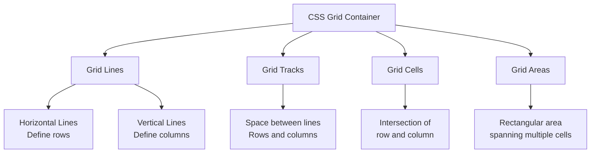

# 13. CSS Grid Layout System 🔲

CSS Grid is a powerful two-dimensional layout system that allows you to create complex layouts with rows and columns. Unlike Flexbox (which is one-dimensional), Grid excels at creating sophisticated layouts where you need precise control over both dimensions.

## Table of Contents

- [[#Introduction to CSS Grid|Introduction to CSS Grid]]
- [[#Grid Container Properties|Grid Container Properties]]
  - [[#display: grid|display: grid]]
  - [[#grid-template-rows and grid-template-columns|grid-template-rows and grid-template-columns]]
  - [[#grid-template-areas|grid-template-areas]]
  - [[#gap (grid-gap)|gap (grid-gap)]]
  - [[#justify-items and align-items|justify-items and align-items]]
  - [[#justify-content and align-content|justify-content and align-content]]
- [[#Grid Item Properties|Grid Item Properties]]
  - [[#grid-row and grid-column|grid-row and grid-column]]
  - [[#grid-area|grid-area]]
  - [[#justify-self and align-self|justify-self and align-self]]
- [[#Advanced Grid Features|Advanced Grid Features]]
  - [[#Fractional Units (fr)|Fractional Units (fr)]]
  - [[#repeat() Function|repeat() Function]]
  - [[#minmax() Function|minmax() Function]]
  - [[#Auto-placement Algorithm|Auto-placement Algorithm]]
  - [[#Subgrid (Modern Feature)|Subgrid (Modern Feature)]]
- [[#Practical Grid Layouts|Practical Grid Layouts]]

---

## Introduction to CSS Grid

CSS Grid creates a **two-dimensional grid system** with rows and columns. It's perfect for:

- Complex page layouts
- Card-based designs
- Image galleries
- Dashboard layouts
- Any design requiring precise positioning



> [!abstract] 🚀 **Key Concepts**
> - **Grid Container**: Element with `display: grid`
> - **Grid Items**: Direct children of grid container
> - **Grid Lines**: Dividing lines that create the grid structure
> - **Grid Tracks**: Space between two adjacent grid lines (rows/columns)
> - **Grid Cells**: Single unit of the grid
> - **Grid Areas**: Rectangular area spanning one or more cells

---

## Grid Container Properties

### display: grid

Establishes a grid formatting context.

```css
.grid-container {
  display: grid;        /* Block-level grid container */
  /* display: inline-grid;  Inline-level grid container */
}
```

```html
<!-- preview: true -->
<div class="grid-demo">
  <div class="grid-container basic-grid">
    <div class="grid-item">1</div>
    <div class="grid-item">2</div>
    <div class="grid-item">3</div>
    <div class="grid-item">4</div>
    <div class="grid-item">5</div>
    <div class="grid-item">6</div>
  </div>
</div>
<style>
.grid-demo {
  background: #f8f9fa;
  padding: 2rem;
  border-radius: 8px;
}
.basic-grid {
  display: grid;
  grid-template-columns: repeat(3, 1fr);
  gap: 1rem;
  background: #e3f2fd;
  padding: 1rem;
  border-radius: 4px;
}
.grid-item {
  background: #007bff;
  color: white;
  padding: 2rem;
  text-align: center;
  border-radius: 4px;
  font-size: 1.5rem;
  font-weight: bold;
}
</style>
```

### grid-template-rows and grid-template-columns

Define the size of grid tracks (rows and columns).

```css
.grid-container {
  /* Fixed sizes */
  grid-template-columns: 200px 300px 100px;
  grid-template-rows: 100px 200px;
  
  /* Flexible sizes */
  grid-template-columns: 1fr 2fr 1fr;  /* Fractional units */
  grid-template-rows: auto 1fr auto;
  
  /* Mixed sizes */
  grid-template-columns: 200px 1fr 100px;
  grid-template-rows: 50px auto 1fr;
}
```

```html
<!-- preview: true -->
<div class="template-demo">
  <div class="template-example">
    <h4>Fixed Columns: 100px 200px 100px</h4>
    <div class="grid-container fixed-columns">
      <div class="grid-item">1</div>
      <div class="grid-item">2</div>
      <div class="grid-item">3</div>
    </div>
  </div>
  
  <div class="template-example">
    <h4>Fractional Columns: 1fr 2fr 1fr</h4>
    <div class="grid-container fractional-columns">
      <div class="grid-item">1</div>
      <div class="grid-item">2</div>
      <div class="grid-item">3</div>
    </div>
  </div>
  
  <div class="template-example">
    <h4>Mixed: 100px 1fr 100px</h4>
    <div class="grid-container mixed-columns">
      <div class="grid-item">1</div>
      <div class="grid-item">2</div>
      <div class="grid-item">3</div>
    </div>
  </div>
</div>
<style>
.template-demo {
  background: #f8f9fa;
  padding: 2rem;
  border-radius: 8px;
}
.template-example {
  margin-bottom: 2rem;
}
.template-example h4 {
  margin: 0 0 0.5rem 0;
  color: #007bff;
}
.grid-container {
  display: grid;
  gap: 0.5rem;
  background: #e3f2fd;
  padding: 0.5rem;
  border-radius: 4px;
}
.fixed-columns {
  grid-template-columns: 100px 200px 100px;
}
.fractional-columns {
  grid-template-columns: 1fr 2fr 1fr;
}
.mixed-columns {
  grid-template-columns: 100px 1fr 100px;
}
.grid-item {
  background: #007bff;
  color: white;
  padding: 1rem;
  text-align: center;
  border-radius: 4px;
  font-weight: bold;
}
</style>
```

### grid-template-areas

Define named grid areas for easier layout management.

```css
.grid-container {
  grid-template-areas: 
    "header header header"
    "sidebar main ads"
    "footer footer footer";
  grid-template-columns: 200px 1fr 200px;
  grid-template-rows: auto 1fr auto;
}

.header { grid-area: header; }
.sidebar { grid-area: sidebar; }
.main { grid-area: main; }
.ads { grid-area: ads; }
.footer { grid-area: footer; }
```

```html
<!-- preview: true -->
<div class="areas-demo">
  <div class="grid-container layout-grid">
    <div class="grid-item header-item">Header</div>
    <div class="grid-item sidebar-item">Sidebar</div>
    <div class="grid-item main-item">Main Content</div>
    <div class="grid-item ads-item">Ads</div>
    <div class="grid-item footer-item">Footer</div>
  </div>
</div>
<style>
.areas-demo {
  background: #f8f9fa;
  padding: 2rem;
  border-radius: 8px;
}
.layout-grid {
  display: grid;
  grid-template-areas: 
    "header header header"
    "sidebar main ads"
    "footer footer footer";
  grid-template-columns: 150px 1fr 150px;
  grid-template-rows: auto 200px auto;
  gap: 1rem;
  background: #e3f2fd;
  padding: 1rem;
  border-radius: 4px;
}
.header-item { 
  grid-area: header; 
  background: #dc3545;
}
.sidebar-item { 
  grid-area: sidebar; 
  background: #6c757d;
}
.main-item { 
  grid-area: main; 
  background: #007bff;
}
.ads-item { 
  grid-area: ads; 
  background: #28a745;
}
.footer-item { 
  grid-area: footer; 
  background: #ffc107;
  color: #212529;
}
.grid-item {
  color: white;
  padding: 1rem;
  text-align: center;
  border-radius: 4px;
  font-weight: bold;
  display: flex;
  align-items: center;
  justify-content: center;
}
</style>
```

### gap (grid-gap)

Sets spacing between grid items.

```css
.grid-container {
  gap: 1rem;              /* Same gap for rows and columns */
  gap: 1rem 2rem;         /* Row gap | Column gap */
  row-gap: 1rem;          /* Gap between rows */
  column-gap: 2rem;       /* Gap between columns */
}
```

### justify-items and align-items

Control alignment of items within their grid cells.

```css
.grid-container {
  /* Horizontal alignment */
  justify-items: start;    /* start | end | center | stretch */
  
  /* Vertical alignment */
  align-items: start;      /* start | end | center | stretch */
  
  /* Shorthand */
  place-items: center;     /* align-items justify-items */
}
```

```html
<!-- preview: true -->
<div class="alignment-demo">
  <div class="alignment-example">
    <h4>justify-items: start, align-items: start</h4>
    <div class="grid-container align-start">
      <div class="grid-item small">1</div>
      <div class="grid-item small">2</div>
      <div class="grid-item small">3</div>
      <div class="grid-item small">4</div>
    </div>
  </div>
  
  <div class="alignment-example">
    <h4>justify-items: center, align-items: center</h4>
    <div class="grid-container align-center">
      <div class="grid-item small">1</div>
      <div class="grid-item small">2</div>
      <div class="grid-item small">3</div>
      <div class="grid-item small">4</div>
    </div>
  </div>
</div>
<style>
.alignment-demo {
  background: #f8f9fa;
  padding: 2rem;
  border-radius: 8px;
}
.alignment-example {
  margin-bottom: 2rem;
}
.alignment-example h4 {
  margin: 0 0 0.5rem 0;
  color: #007bff;
}
.grid-container {
  display: grid;
  grid-template-columns: repeat(2, 1fr);
  grid-template-rows: repeat(2, 100px);
  gap: 0.5rem;
  background: #e3f2fd;
  padding: 0.5rem;
  border-radius: 4px;
}
.align-start {
  justify-items: start;
  align-items: start;
}
.align-center {
  justify-items: center;
  align-items: center;
}
.grid-item.small {
  background: #007bff;
  color: white;
  padding: 0.5rem 1rem;
  text-align: center;
  border-radius: 4px;
  font-weight: bold;
  width: 60px;
  height: 40px;
  display: flex;
  align-items: center;
  justify-content: center;
}
</style>
```

### justify-content and align-content

Control alignment of the entire grid within the container.

```css
.grid-container {
  /* Horizontal alignment of grid */
  justify-content: start;   /* start | end | center | stretch | space-around | space-between | space-evenly */
  
  /* Vertical alignment of grid */
  align-content: start;     /* start | end | center | stretch | space-around | space-between | space-evenly */
  
  /* Shorthand */
  place-content: center;    /* align-content justify-content */
}
```

---

## Grid Item Properties

### grid-row and grid-column

Position items by specifying grid lines.

```css
.grid-item {
  /* Line-based positioning */
  grid-column: 1 / 3;      /* Start at line 1, end at line 3 */
  grid-row: 2 / 4;         /* Start at line 2, end at line 4 */
  
  /* Span syntax */
  grid-column: span 2;     /* Span 2 columns */
  grid-row: span 3;        /* Span 3 rows */
  
  /* Individual properties */
  grid-column-start: 1;
  grid-column-end: 3;
  grid-row-start: 2;
  grid-row-end: 4;
}
```

```html
<!-- preview: true -->
<div class="positioning-demo">
  <div class="grid-container positioning-grid">
    <div class="grid-item item-1">1<br><small>grid-column: 1 / 3</small></div>
    <div class="grid-item item-2">2<br><small>grid-row: 1 / 3</small></div>
    <div class="grid-item item-3">3<br><small>span 2</small></div>
    <div class="grid-item item-4">4</div>
    <div class="grid-item item-5">5</div>
  </div>
</div>
<style>
.positioning-demo {
  background: #f8f9fa;
  padding: 2rem;
  border-radius: 8px;
}
.positioning-grid {
  display: grid;
  grid-template-columns: repeat(4, 1fr);
  grid-template-rows: repeat(3, 80px);
  gap: 0.5rem;
  background: #e3f2fd;
  padding: 0.5rem;
  border-radius: 4px;
}
.item-1 {
  grid-column: 1 / 3;
  background: #dc3545;
}
.item-2 {
  grid-column: 3;
  grid-row: 1 / 3;
  background: #28a745;
}
.item-3 {
  grid-column: span 2;
  background: #ffc107;
  color: #212529;
}
.item-4 {
  background: #6c757d;
}
.item-5 {
  background: #17a2b8;
}
.grid-item {
  color: white;
  padding: 0.5rem;
  text-align: center;
  border-radius: 4px;
  font-weight: bold;
  display: flex;
  flex-direction: column;
  align-items: center;
  justify-content: center;
}
.grid-item small {
  font-size: 0.7rem;
  opacity: 0.8;
  margin-top: 0.25rem;
}
</style>
```

### grid-area

Shorthand for positioning or assigning to named areas.

```css
.grid-item {
  /* Shorthand for grid-row-start / grid-column-start / grid-row-end / grid-column-end */
  grid-area: 1 / 2 / 3 / 4;
  
  /* Or use named area */
  grid-area: header;
}
```

### justify-self and align-self

Override container alignment for individual items.

```css
.grid-item {
  justify-self: start;     /* start | end | center | stretch */
  align-self: end;         /* start | end | center | stretch */
  place-self: center;      /* align-self justify-self */
}
```

---

## Advanced Grid Features

### Fractional Units (fr)

The `fr` unit represents a fraction of available space.

```css
.grid-container {
  grid-template-columns: 1fr 2fr 1fr;  /* 1:2:1 ratio */
  grid-template-columns: 200px 1fr;    /* Fixed + flexible */
  grid-template-columns: 1fr 1fr 1fr;  /* Equal columns */
}
```

### repeat() Function

Simplifies repetitive track definitions.

```css
.grid-container {
  /* Instead of: 1fr 1fr 1fr 1fr */
  grid-template-columns: repeat(4, 1fr);
  
  /* Mixed patterns */
  grid-template-columns: repeat(3, 100px 200px);  /* 100px 200px 100px 200px 100px 200px */
  
  /* Auto-fit and auto-fill */
  grid-template-columns: repeat(auto-fit, minmax(250px, 1fr));
  grid-template-columns: repeat(auto-fill, 200px);
}
```

### minmax() Function

Sets minimum and maximum track sizes.

```css
.grid-container {
  grid-template-columns: minmax(200px, 1fr) 300px;  /* Min 200px, max 1fr */
  grid-template-rows: minmax(100px, auto);          /* Min 100px, max content size */
}
```

```html
<!-- preview: true -->
<div class="advanced-demo">
  <div class="advanced-example">
    <h4>repeat(auto-fit, minmax(200px, 1fr))</h4>
    <div class="grid-container responsive-grid">
      <div class="grid-item">Card 1</div>
      <div class="grid-item">Card 2</div>
      <div class="grid-item">Card 3</div>
      <div class="grid-item">Card 4</div>
      <div class="grid-item">Card 5</div>
    </div>
  </div>
</div>
<style>
.advanced-demo {
  background: #f8f9fa;
  padding: 2rem;
  border-radius: 8px;
}
.advanced-example h4 {
  margin: 0 0 1rem 0;
  color: #007bff;
}
.responsive-grid {
  display: grid;
  grid-template-columns: repeat(auto-fit, minmax(200px, 1fr));
  gap: 1rem;
  background: #e3f2fd;
  padding: 1rem;
  border-radius: 4px;
}
.grid-item {
  background: #007bff;
  color: white;
  padding: 2rem;
  text-align: center;
  border-radius: 4px;
  font-weight: bold;
}
</style>
```

### Auto-placement Algorithm

Grid automatically places items that don't have explicit positioning.

```css
.grid-container {
  grid-auto-flow: row;        /* Default: fill rows first */
  grid-auto-flow: column;     /* Fill columns first */
  grid-auto-flow: row dense;  /* Fill gaps with smaller items */
}
```

### Subgrid (Modern Feature)

Allows nested grids to inherit parent grid tracks.

```css
.parent-grid {
  display: grid;
  grid-template-columns: repeat(4, 1fr);
}

.nested-grid {
  display: grid;
  grid-template-columns: subgrid;  /* Inherit parent columns */
  grid-column: span 3;
}
```

> [!info] **Browser Support**
> Subgrid is supported in Firefox and Safari. Chrome support is coming soon (2024+).

---

## Practical Grid Layouts

### Image Gallery

```html
<!-- preview: true -->
<div class="gallery-demo">
  <div class="image-gallery">
    <div class="gallery-item large">Large Image</div>
    <div class="gallery-item">Image 1</div>
    <div class="gallery-item">Image 2</div>
    <div class="gallery-item tall">Tall Image</div>
    <div class="gallery-item">Image 3</div>
    <div class="gallery-item">Image 4</div>
    <div class="gallery-item wide">Wide Image</div>
    <div class="gallery-item">Image 5</div>
  </div>
</div>
<style>
.gallery-demo {
  background: #f8f9fa;
  padding: 2rem;
  border-radius: 8px;
}
.image-gallery {
  display: grid;
  grid-template-columns: repeat(auto-fit, minmax(150px, 1fr));
  grid-auto-rows: 150px;
  gap: 1rem;
}
.gallery-item {
  background: linear-gradient(45deg, #007bff, #0056b3);
  color: white;
  display: flex;
  align-items: center;
  justify-content: center;
  border-radius: 4px;
  font-weight: bold;
}
.large {
  grid-column: span 2;
  grid-row: span 2;
}
.tall {
  grid-row: span 2;
}
.wide {
  grid-column: span 2;
}
</style>
```

### Dashboard Layout

```html
<!-- preview: true -->
<div class="dashboard-demo">
  <div class="dashboard">
    <div class="dashboard-item header">Dashboard Header</div>
    <div class="dashboard-item sidebar">Navigation</div>
    <div class="dashboard-item stats">Statistics</div>
    <div class="dashboard-item chart">Chart</div>
    <div class="dashboard-item table">Data Table</div>
    <div class="dashboard-item activity">Recent Activity</div>
  </div>
</div>
<style>
.dashboard-demo {
  background: #f8f9fa;
  padding: 2rem;
  border-radius: 8px;
}
.dashboard {
  display: grid;
  grid-template-columns: 200px 1fr 1fr;
  grid-template-rows: auto 150px 200px 150px;
  grid-template-areas:
    "header header header"
    "sidebar stats chart"
    "sidebar table table"
    "sidebar activity activity";
  gap: 1rem;
  height: 500px;
}
.dashboard-item {
  background: white;
  padding: 1rem;
  border-radius: 8px;
  box-shadow: 0 2px 4px rgba(0,0,0,0.1);
  display: flex;
  align-items: center;
  justify-content: center;
  font-weight: bold;
  color: #333;
}
.header {
  grid-area: header;
  background: #007bff;
  color: white;
}
.sidebar {
  grid-area: sidebar;
  background: #6c757d;
  color: white;
}
.stats {
  grid-area: stats;
  background: #28a745;
  color: white;
}
.chart {
  grid-area: chart;
  background: #ffc107;
  color: #212529;
}
.table {
  grid-area: table;
  background: #17a2b8;
  color: white;
}
.activity {
  grid-area: activity;
  background: #dc3545;
  color: white;
}
</style>
```

### Card Grid with Auto-Fit

```html
<!-- preview: true -->
<div class="card-grid-demo">
  <div class="card-grid">
    <div class="card">
      <h3>Card Title 1</h3>
      <p>This is some content for the first card.</p>
    </div>
    <div class="card">
      <h3>Card Title 2</h3>
      <p>This card has a bit more content to show how the grid handles different content sizes.</p>
    </div>
    <div class="card">
      <h3>Card Title 3</h3>
      <p>Short content.</p>
    </div>
    <div class="card">
      <h3>Card Title 4</h3>
      <p>Another card with some interesting content that might be longer than others.</p>
    </div>
    <div class="card">
      <h3>Card Title 5</h3>
      <p>Final card content.</p>
    </div>
  </div>
</div>
<style>
.card-grid-demo {
  background: #f8f9fa;
  padding: 2rem;
  border-radius: 8px;
}
.card-grid {
  display: grid;
  grid-template-columns: repeat(auto-fit, minmax(280px, 1fr));
  gap: 1.5rem;
}
.card {
  background: white;
  padding: 1.5rem;
  border-radius: 8px;
  box-shadow: 0 2px 10px rgba(0,0,0,0.1);
  border: 1px solid #dee2e6;
}
.card h3 {
  margin: 0 0 1rem 0;
  color: #007bff;
}
.card p {
  margin: 0;
  color: #666;
  line-height: 1.6;
}
</style>
```

> [!tip] **CSS Grid Best Practices**
> 1. **Use Grid for two-dimensional layouts** (both rows and columns matter)
> 2. **Combine with Flexbox** - Grid for overall layout, Flexbox for component internals
> 3. **Use `fr` units** for flexible, proportional sizing
> 4. **Use `minmax()`** for responsive designs without media queries
> 5. **Name your grid areas** for complex layouts - it's more maintainable
> 6. **Use `auto-fit` with `minmax()`** for responsive card layouts
> 7. **Remember implicit vs explicit grids** - Grid creates tracks automatically
> 8. **Use `gap`** instead of margins for consistent spacing
> 9. **Consider `grid-auto-flow: dense`** for masonry-like layouts
> 10. **Test browser support** for newer features like Subgrid


---


---
← [[12. Flexbox Layout System.md|Flexbox Layout System]] [[CSS/Table Of Content|��� Table of Contents]] [[14. Responsive Design.md|Responsive Design]] →
