# 14. Responsive Design 📱

Responsive design ensures your website looks and functions well across all devices and screen sizes. This chapter covers media queries, responsive units, and modern techniques for creating adaptive layouts.

## Table of Contents

-   [[#What is Responsive Design?|What is Responsive Design?]]
-   [[#Media Queries|Media Queries]]
    -   [[#Syntax and Structure|Syntax and Structure]]
    -   [[#Common Breakpoints|Common Breakpoints]]
    -   [[#Mobile-First vs Desktop-First Approach|Mobile-First vs Desktop-First Approach]]
    -   [[#Print Styles|Print Styles]]
-   [[#Responsive Units|Responsive Units]]
    -   [[#Viewport-Relative Units|Viewport-Relative Units]]
    -   [[#Flexible Sizing Strategies|Flexible Sizing Strategies]]
-   [[#Responsive Images|Responsive Images]]
-   [[#Modern Responsive Features|Modern Responsive Features]]
    -   [[#Container Queries (2025 Feature)|Container Queries (2025 Feature)]]
    -   [[#Intrinsic Web Design Principles|Intrinsic Web Design Principles]]
-   [[#Mermaid: Responsive Design Strategy|Mermaid: Responsive Design Strategy]]

---

## What is Responsive Design?

Responsive web design is an approach that makes web pages render well on a variety of devices and window or screen sizes.

> [!abstract] 🚀 **Theory Summary**
> Responsive design uses flexible layouts, flexible images, and CSS media queries to create websites that adapt to different screen sizes and orientations. The goal is to provide an optimal viewing experience across all devices.

```mermaid
graph LR
    A[Single Codebase] --> B[📱 Mobile<br/>320-768px]
    A --> C[📟 Tablet<br/>768-1024px]
    A --> D[💻 Desktop<br/>1024px+]
    A --> E[🖥️ Large Desktop<br/>1440px+]
    
    style A fill:#e1f5fe
    style B fill:#f3e5f5
    style C fill:#e8f5e8
    style D fill:#fff3e0
    style E fill:#fce4ec
```



**Core Principles:**
1. **Fluid Grids** - Layouts that scale proportionally
2. **Flexible Images** - Images that resize within their containers
3. **Media Queries** - CSS rules that apply based on device characteristics

---

## Media Queries

Media queries are the foundation of responsive design, allowing you to apply different styles based on device characteristics.

### Syntax and Structure

```css
/* Basic syntax */
@media media-type and (condition) {
  /* CSS rules */
}

/* Common examples */
@media screen and (max-width: 768px) {
  /* Styles for screens 768px and smaller */
}

@media print {
  /* Styles for printing */
}

@media (orientation: landscape) {
  /* Styles for landscape orientation */
}
```

**Media Types:**
- `screen` - Computer screens, tablets, phones
- `print` - Printers and print preview
- `all` - All media types (default)

**Common Media Features:**
- `width`, `min-width`, `max-width`
- `height`, `min-height`, `max-height`
- `orientation` (portrait/landscape)
- `resolution`, `device-pixel-ratio`
- `prefers-color-scheme` (light/dark)
- `prefers-reduced-motion`

### Common Breakpoints

Here are industry-standard breakpoints for responsive design:

```css
/* Mobile First Approach */
/* Extra small devices (phones, 600px and down) */
@media only screen and (max-width: 600px) {
  .container { width: 100%; padding: 1rem; }
}

/* Small devices (portrait tablets and large phones, 600px and up) */
@media only screen and (min-width: 600px) {
  .container { width: 90%; }
}

/* Medium devices (landscape tablets, 768px and up) */
@media only screen and (min-width: 768px) {
  .container { width: 80%; }
  .grid { display: grid; grid-template-columns: 1fr 1fr; }
}

/* Large devices (laptops/desktops, 992px and up) */
@media only screen and (min-width: 992px) {
  .container { width: 70%; }
  .grid { grid-template-columns: 1fr 1fr 1fr; }
}

/* Extra large devices (large laptops and desktops, 1200px and up) */
@media only screen and (min-width: 1200px) {
  .container { max-width: 1200px; margin: 0 auto; }
  .grid { grid-template-columns: repeat(4, 1fr); }
}
```

**Practical Example:**
```html
<!-- preview: true -->
<div class="responsive-demo">
  <div class="responsive-grid">
    <div class="card">Card 1</div>
    <div class="card">Card 2</div>
    <div class="card">Card 3</div>
    <div class="card">Card 4</div>
  </div>
  <p class="breakpoint-indicator">Resize your browser to see the responsive behavior!</p>
</div>

<style>
.responsive-demo {
  background: #f8f9fa;
  padding: 2rem;
  border-radius: 8px;
}

.responsive-grid {
  display: grid;
  gap: 1rem;
  margin-bottom: 1rem;
}

.card {
  background: #007bff;
  color: white;
  padding: 2rem;
  border-radius: 8px;
  text-align: center;
  font-weight: bold;
}

.breakpoint-indicator {
  text-align: center;
  font-style: italic;
  color: #6c757d;
}

/* Mobile: 1 column */
@media (max-width: 767px) {
  .responsive-grid {
    grid-template-columns: 1fr;
  }
  .breakpoint-indicator::after {
    content: " (Mobile: 1 column)";
    color: #dc3545;
  }
}

/* Tablet: 2 columns */
@media (min-width: 768px) and (max-width: 991px) {
  .responsive-grid {
    grid-template-columns: 1fr 1fr;
  }
  .breakpoint-indicator::after {
    content: " (Tablet: 2 columns)";
    color: #fd7e14;
  }
}

/* Desktop: 4 columns */
@media (min-width: 992px) {
  .responsive-grid {
    grid-template-columns: repeat(4, 1fr);
  }
  .breakpoint-indicator::after {
    content: " (Desktop: 4 columns)";
    color: #28a745;
  }
}
</style>
```

### Mobile-First vs Desktop-First Approach

#### Mobile-First (Recommended)
Start with mobile styles and progressively enhance for larger screens:

```css
/* Base styles (mobile) */
.navigation {
  display: block;
}

.nav-item {
  display: block;
  padding: 1rem;
  border-bottom: 1px solid #eee;
}

/* Tablet and up */
@media (min-width: 768px) {
  .navigation {
    display: flex;
  }
  
  .nav-item {
    border-bottom: none;
    border-right: 1px solid #eee;
  }
}

/* Desktop and up */
@media (min-width: 1024px) {
  .navigation {
    justify-content: center;
  }
  
  .nav-item {
    padding: 1rem 2rem;
  }
}
```

#### Desktop-First
Start with desktop styles and scale down:

```css
/* Base styles (desktop) */
.sidebar {
  width: 300px;
  float: left;
}

.main-content {
  margin-left: 320px;
}

/* Tablet and down */
@media (max-width: 1023px) {
  .sidebar {
    width: 250px;
  }
  
  .main-content {
    margin-left: 270px;
  }
}

/* Mobile and down */
@media (max-width: 767px) {
  .sidebar {
    width: 100%;
    float: none;
  }
  
  .main-content {
    margin-left: 0;
  }
}
```

> [!success] **Why Mobile-First?**
> - Better performance on mobile devices
> - Progressive enhancement philosophy
> - Easier to add complexity than remove it
> - Forces focus on essential content

### Print Styles

Optimize your content for printing:

```css
@media print {
  /* Hide navigation and ads */
  .navigation,
  .sidebar,
  .advertisement {
    display: none;
  }
  
  /* Optimize typography */
  body {
    font-family: Georgia, serif;
    font-size: 12pt;
    line-height: 1.5;
    color: #000;
    background: #fff;
  }
  
  /* Show link URLs */
  a[href]:after {
    content: " (" attr(href) ")";
  }
  
  /* Page breaks */
  h1, h2, h3 {
    page-break-after: avoid;
  }
  
  /* Ensure images fit */
  img {
    max-width: 100% !important;
  }
}
```

---

## Responsive Units

### Viewport-Relative Units

Viewport units scale with the browser window size:

```html
<!-- preview: true -->
<div class="viewport-units-demo">
  <div class="vw-demo">50vw (50% of viewport width)</div>
  <div class="vh-demo">30vh (30% of viewport height)</div>
  <div class="vmin-demo">20vmin (20% of smaller dimension)</div>
  <div class="fluid-text">Fluid text: 4vw</div>
</div>

<style>
.viewport-units-demo > div {
  margin: 1rem 0;
  padding: 1rem;
  border-radius: 8px;
  color: white;
  font-weight: bold;
  text-align: center;
}

.vw-demo {
  width: 50vw;
  background: #e74c3c;
}

.vh-demo {
  height: 30vh;
  background: #3498db;
  display: flex;
  align-items: center;
  justify-content: center;
}

.vmin-demo {
  width: 20vmin;
  height: 20vmin;
  background: #2ecc71;
  display: flex;
  align-items: center;
  justify-content: center;
}

.fluid-text {
  font-size: 4vw;
  background: #9b59b6;
}
</style>
```

### Flexible Sizing Strategies

#### Using clamp() for Fluid Typography
```css
.fluid-heading {
  font-size: clamp(1.5rem, 4vw, 3rem);
  /* Minimum: 1.5rem, Preferred: 4vw, Maximum: 3rem */
}

.fluid-spacing {
  padding: clamp(1rem, 5vw, 4rem);
}
```

#### Responsive Container Widths
```css
.container {
  width: min(90%, 1200px);
  margin: 0 auto;
  padding: clamp(1rem, 4vw, 2rem);
}
```

---

## Responsive Images

Make images adapt to their containers:

```html
<!-- preview: true -->
<div class="responsive-images-demo">
  <div class="image-container">
    
  </div>
</div>

<style>
.responsive-images-demo {
  background: #f8f9fa;
  padding: 2rem;
  border-radius: 8px;
}

.image-container {
  max-width: 600px;
  margin: 0 auto;
}

.responsive-image {
  width: 100%;
  height: auto;
  border-radius: 8px;
  box-shadow: 0 4px 8px rgba(0,0,0,0.1);
}
</style>
```

**Responsive Image Techniques:**

```css
/* Basic responsive image */
img {
  max-width: 100%;
  height: auto;
}

/* Responsive background images */
.hero-image {
  background-image: url('hero.jpg');
  background-size: cover;
  background-position: center;
  height: 50vh;
}

/* Art direction with picture element */
```

```html
<picture>
  <source media="(min-width: 800px)" srcset="large-image.jpg">
  <source media="(min-width: 400px)" srcset="medium-image.jpg">
  
</picture>
```

---

## Modern Responsive Features

### Container Queries (2025 Feature)

Container queries allow styling based on a container's size rather than the viewport:

```css
/* Container query setup */
.card-container {
  container-type: inline-size;
  container-name: card;
}

/* Query the container */
@container card (min-width: 300px) {
  .card {
    display: flex;
    flex-direction: row;
  }
  
  .card-image {
    width: 40%;
  }
  
  .card-content {
    width: 60%;
  }
}

@container card (max-width: 299px) {
  .card {
    display: block;
  }
  
  .card-image {
    width: 100%;
  }
}
```

### Intrinsic Web Design Principles

Modern CSS allows for more flexible, content-aware layouts:

```css
/* Intrinsic grid */
.auto-grid {
  display: grid;
  grid-template-columns: repeat(auto-fit, minmax(250px, 1fr));
  gap: 1rem;
}

/* Flexible aspect ratios */
.aspect-ratio-box {
  aspect-ratio: 16 / 9;
  background: #ddd;
}

/* Content-based sizing */
.flexible-width {
  width: fit-content;
  min-width: 200px;
  max-width: 100%;
}
```

---

## Mermaid: Responsive Design Strategy


**Responsive Design Checklist:**

> [!tip] **Responsive Design Best Practices**
> 
> **📱 Mobile-First Approach:**
> - Start with mobile styles
> - Use `min-width` media queries
> - Progressive enhancement
> 
> **🎯 Performance:**
> - Optimize images for different screen sizes
> - Use efficient CSS selectors
> - Minimize HTTP requests
> 
> **♿ Accessibility:**
> - Ensure touch targets are at least 44px
> - Test with screen readers
> - Maintain good color contrast
> 
> **🧪 Testing:**
> - Test on real devices
> - Use browser dev tools
> - Check different orientations

Responsive design is essential for modern web development. By mastering media queries, flexible units, and modern CSS features, you can create websites that work beautifully across all devices and screen sizes.


---


---
← [[13. CSS Grid Layout System.md|CSS Grid Layout System]] [[CSS/Table Of Content|��� Table of Contents]] [[15. Borders, Shadows & Visual Effects.md|Borders, Shadows & Visual Effects]] →
