# 18. CSS Animations 🎬

CSS Animations allow you to create complex, multi-step animations using keyframes. Unlike transitions, animations can run automatically, loop, and have multiple intermediate steps, making them perfect for creating engaging user experiences.

## Table of Contents

- [[#Introduction to CSS Animations|Introduction to CSS Animations]]
- [[#Animation Properties|Animation Properties]]
  - [[#@keyframes Rule Creation|@keyframes Rule Creation]]
  - [[#animation-name|animation-name]]
  - [[#animation-duration|animation-duration]]
  - [[#animation-timing-function|animation-timing-function]]
  - [[#animation-delay|animation-delay]]
  - [[#animation-iteration-count|animation-iteration-count]]
  - [[#animation-direction|animation-direction]]
  - [[#animation-fill-mode|animation-fill-mode]]
  - [[#animation-play-state|animation-play-state]]
  - [[#animation (shorthand)|animation (shorthand)]]
- [[#Advanced Animation Techniques|Advanced Animation Techniques]]
  - [[#Keyframe Optimization|Keyframe Optimization]]
  - [[#Performance Best Practices|Performance Best Practices]]
  - [[#Complex Multi-Step Animations|Complex Multi-Step Animations]]
- [[#Practical Animation Examples|Practical Animation Examples]]
- [[#Mermaid: Animation Timeline|Mermaid: Animation Timeline]]

---

## Introduction to CSS Animations

CSS Animations provide fine-grained control over intermediate animation steps using keyframes. They can run automatically when elements load, be triggered by user interactions, or controlled via JavaScript.

> [!abstract] 🚀 **Theory Summary**
> CSS Animations consist of two parts:
> 1. **@keyframes rule**: Defines what happens during the animation
> 2. **Animation properties**: Control how the animation behaves (duration, timing, etc.)

```mermaid
graph TD
    A[CSS Animation] --> B[@keyframes<br/>Define animation steps]
    A --> C[Animation Properties<br/>Control behavior]
    
    B --> B1[0% - Start state]
    B --> B2[50% - Middle state]
    B --> B3[100% - End state]
    
    C --> C1[Duration<br/>How long]
    C --> C2[Timing Function<br/>How it progresses]
    C --> C3[Iteration<br/>How many times]
    C --> C4[Direction<br/>Forward/Reverse]
```

**Animations vs Transitions:**

| Feature | Transitions | Animations |
|---------|-------------|------------|
| **Trigger** | Requires state change | Can run automatically |
| **Steps** | Only start and end | Multiple keyframes |
| **Control** | Limited | Full control |
| **Looping** | No | Yes |
| **Direction** | One way | Forward, reverse, alternate |

---

## Animation Properties

### @keyframes Rule Creation

The `@keyframes` rule defines the animation sequence:

```css
/* Using percentages */
@keyframes slideIn {
  0% {
    transform: translateX(-100%);
    opacity: 0;
  }
  50% {
    transform: translateX(-10%);
  }
  100% {
    transform: translateX(0);
    opacity: 1;
  }
}

/* Using keywords */
@keyframes fadeInOut {
  from {
    opacity: 0;
  }
  to {
    opacity: 1;
  }
}

/* Complex multi-property animation */
@keyframes complexMove {
  0% {
    transform: translateX(0) rotate(0deg);
    background-color: #007bff;
    border-radius: 0;
  }
  25% {
    transform: translateX(100px) rotate(90deg);
    background-color: #28a745;
  }
  50% {
    transform: translateX(100px) translateY(100px) rotate(180deg);
    background-color: #ffc107;
    border-radius: 50%;
  }
  75% {
    transform: translateX(0) translateY(100px) rotate(270deg);
    background-color: #dc3545;
  }
  100% {
    transform: translateX(0) rotate(360deg);
    background-color: #007bff;
    border-radius: 0;
  }
}
```

### animation-name

Specifies which keyframes to use:

```css
.element {
  animation-name: slideIn;        /* Single animation */
  animation-name: slideIn, fadeIn; /* Multiple animations */
  animation-name: none;           /* No animation */
}
```

### animation-duration

Sets how long the animation takes to complete one cycle:

```css
.element {
  animation-duration: 2s;         /* 2 seconds */
  animation-duration: 500ms;      /* 500 milliseconds */
  animation-duration: 1s, 0.5s;   /* Multiple durations */
}
```

### animation-timing-function

Controls the speed curve of the animation:

```css
.element {
  animation-timing-function: ease;        /* Default */
  animation-timing-function: linear;      /* Constant speed */
  animation-timing-function: ease-in;     /* Slow start */
  animation-timing-function: ease-out;    /* Slow end */
  animation-timing-function: ease-in-out; /* Slow start and end */
  animation-timing-function: cubic-bezier(0.25, 0.1, 0.25, 1);
  animation-timing-function: steps(4, end); /* Step animation */
}
```

```html
<!-- preview: true -->
<div class="timing-demo">
  <div class="timing-example">
    <h4>Timing Functions Comparison</h4>
    <div class="timing-container">
      <div class="timing-box timing-linear">linear</div>
      <div class="timing-box timing-ease">ease</div>
      <div class="timing-box timing-ease-in">ease-in</div>
      <div class="timing-box timing-ease-out">ease-out</div>
      <div class="timing-box timing-ease-in-out">ease-in-out</div>
    </div>
    <button onclick="restartAnimation()" class="restart-btn">Restart Animation</button>
  </div>
</div>

<style>
@keyframes moveRight {
  from { transform: translateX(0); }
  to { transform: translateX(200px); }
}

.timing-demo {
  background: #f8f9fa;
  padding: 2rem;
  border-radius: 8px;
}

.timing-example h4 {
  text-align: center;
  color: #007bff;
  margin-bottom: 2rem;
}

.timing-container {
  display: flex;
  flex-direction: column;
  gap: 1rem;
  margin-bottom: 2rem;
}

.timing-box {
  width: 60px;
  height: 40px;
  background: #007bff;
  color: white;
  display: flex;
  align-items: center;
  justify-content: center;
  border-radius: 4px;
  font-size: 0.8rem;
  font-weight: bold;
  animation: moveRight 2s infinite alternate;
}

.timing-linear { animation-timing-function: linear; }
.timing-ease { animation-timing-function: ease; }
.timing-ease-in { animation-timing-function: ease-in; }
.timing-ease-out { animation-timing-function: ease-out; }
.timing-ease-in-out { animation-timing-function: ease-in-out; }

.restart-btn {
  display: block;
  margin: 0 auto;
  background: #007bff;
  color: white;
  border: none;
  padding: 0.5rem 1rem;
  border-radius: 4px;
  cursor: pointer;
}
</style>

<script>
function restartAnimation() {
  const boxes = document.querySelectorAll('.timing-box');
  boxes.forEach(box => {
    box.style.animation = 'none';
    box.offsetHeight; // Trigger reflow
    box.style.animation = 'moveRight 2s infinite alternate';
  });
}
</script>
```

### animation-delay

Sets when the animation starts:

```css
.element {
  animation-delay: 1s;           /* Start after 1 second */
  animation-delay: -0.5s;        /* Start 0.5s into the animation */
  animation-delay: 0s, 1s, 2s;   /* Staggered delays */
}
```

### animation-iteration-count

Specifies how many times the animation runs:

```css
.element {
  animation-iteration-count: 1;        /* Default: run once */
  animation-iteration-count: 3;        /* Run 3 times */
  animation-iteration-count: infinite; /* Run forever */
  animation-iteration-count: 2.5;      /* Run 2.5 times */
}
```

### animation-direction

Sets the direction of the animation:

```css
.element {
  animation-direction: normal;          /* Default: forward */
  animation-direction: reverse;         /* Backward */
  animation-direction: alternate;       /* Forward, then backward */
  animation-direction: alternate-reverse; /* Backward, then forward */
}
```

### animation-fill-mode

Defines what styles apply before/after the animation:

```css
.element {
  animation-fill-mode: none;      /* Default: no styles applied */
  animation-fill-mode: forwards;  /* Keep end state */
  animation-fill-mode: backwards; /* Apply start state during delay */
  animation-fill-mode: both;      /* Apply both forwards and backwards */
}
```

```html
<!-- preview: true -->
<div class="fill-mode-demo">
  <div class="fill-mode-example">
    <h4>Fill Mode Comparison</h4>
    <div class="fill-mode-container">
      <div class="fill-mode-box fill-mode-none">
        <div class="animated-element">none</div>
      </div>
      <div class="fill-mode-box fill-mode-forwards">
        <div class="animated-element">forwards</div>
      </div>
      <div class="fill-mode-box fill-mode-backwards">
        <div class="animated-element">backwards</div>
      </div>
      <div class="fill-mode-box fill-mode-both">
        <div class="animated-element">both</div>
      </div>
    </div>
  </div>
</div>

<style>
@keyframes fillModeDemo {
  0% {
    transform: translateX(0);
    background-color: #dc3545;
  }
  100% {
    transform: translateX(100px);
    background-color: #28a745;
  }
}

.fill-mode-demo {
  background: #f8f9fa;
  padding: 2rem;
  border-radius: 8px;
}

.fill-mode-example h4 {
  text-align: center;
  color: #007bff;
  margin-bottom: 2rem;
}

.fill-mode-container {
  display: grid;
  grid-template-columns: repeat(auto-fit, minmax(200px, 1fr));
  gap: 1rem;
}

.fill-mode-box {
  background: #e9ecef;
  padding: 1rem;
  border-radius: 4px;
  height: 80px;
  position: relative;
}

.animated-element {
  width: 60px;
  height: 40px;
  background: #007bff;
  color: white;
  display: flex;
  align-items: center;
  justify-content: center;
  border-radius: 4px;
  font-size: 0.8rem;
  font-weight: bold;
  animation: fillModeDemo 2s 1s;
}

.fill-mode-none .animated-element { animation-fill-mode: none; }
.fill-mode-forwards .animated-element { animation-fill-mode: forwards; }
.fill-mode-backwards .animated-element { animation-fill-mode: backwards; }
.fill-mode-both .animated-element { animation-fill-mode: both; }
</style>
```

### animation-play-state

Controls whether the animation is running or paused:

```css
.element {
  animation-play-state: running; /* Default: animation runs */
  animation-play-state: paused;  /* Animation is paused */
}

/* Interactive control */
.element:hover {
  animation-play-state: paused;
}
```

### animation (shorthand)

Combines all animation properties:

```css
.element {
  /* name | duration | timing-function | delay | iteration-count | direction | fill-mode | play-state */
  animation: slideIn 2s ease-in-out 0.5s infinite alternate both running;
  
  /* Multiple animations */
  animation: 
    slideIn 2s ease-in-out,
    fadeIn 1s linear 0.5s;
}
```

---

## Advanced Animation Techniques

### Keyframe Optimization

Optimize animations for better performance:

```css
/* Good: Animate transform and opacity (GPU accelerated) */
@keyframes optimizedSlide {
  from {
    transform: translateX(-100%);
    opacity: 0;
  }
  to {
    transform: translateX(0);
    opacity: 1;
  }
}

/* Avoid: Animating layout properties */
@keyframes avoidThis {
  from {
    left: -100px;  /* Causes layout recalculation */
    width: 100px;  /* Causes layout recalculation */
  }
  to {
    left: 0;
    width: 200px;
  }
}

/* Use transform instead */
@keyframes betterApproach {
  from {
    transform: translateX(-100px) scaleX(0.5);
  }
  to {
    transform: translateX(0) scaleX(1);
  }
}
```

### Performance Best Practices

```css
/* Enable hardware acceleration */
.animated-element {
  will-change: transform, opacity;
  transform: translateZ(0); /* Force GPU layer */
}

/* Clean up after animation */
.animated-element.animation-complete {
  will-change: auto;
}

/* Use transform and opacity for best performance */
@keyframes performantAnimation {
  0% {
    transform: scale(0) rotate(0deg);
    opacity: 0;
  }
  50% {
    transform: scale(1.1) rotate(180deg);
    opacity: 0.8;
  }
  100% {
    transform: scale(1) rotate(360deg);
    opacity: 1;
  }
}
```

### Complex Multi-Step Animations

Create sophisticated animations with multiple keyframes:

```html
<!-- preview: true -->
<div class="complex-animation-demo">
  <div class="animation-stage">
    <div class="complex-element">
      <div class="element-core">🚀</div>
    </div>
  </div>
  <div class="animation-controls">
    <button onclick="startComplexAnimation()" class="control-btn">Start Journey</button>
    <button onclick="pauseComplexAnimation()" class="control-btn">Pause</button>
    <button onclick="resetComplexAnimation()" class="control-btn">Reset</button>
  </div>
</div>

<style>
@keyframes rocketJourney {
  0% {
    transform: translateX(0) translateY(0) rotate(0deg) scale(1);
    filter: hue-rotate(0deg);
  }
  15% {
    transform: translateX(100px) translateY(-20px) rotate(45deg) scale(1.1);
    filter: hue-rotate(60deg);
  }
  30% {
    transform: translateX(200px) translateY(-60px) rotate(90deg) scale(0.9);
    filter: hue-rotate(120deg);
  }
  45% {
    transform: translateX(250px) translateY(-100px) rotate(180deg) scale(1.2);
    filter: hue-rotate(180deg);
  }
  60% {
    transform: translateX(200px) translateY(-140px) rotate(270deg) scale(0.8);
    filter: hue-rotate(240deg);
  }
  75% {
    transform: translateX(100px) translateY(-120px) rotate(315deg) scale(1.1);
    filter: hue-rotate(300deg);
  }
  90% {
    transform: translateX(20px) translateY(-80px) rotate(360deg) scale(1);
    filter: hue-rotate(340deg);
  }
  100% {
    transform: translateX(0) translateY(0) rotate(360deg) scale(1);
    filter: hue-rotate(360deg);
  }
}

@keyframes pulse {
  0%, 100% { transform: scale(1); }
  50% { transform: scale(1.05); }
}

.complex-animation-demo {
  background: linear-gradient(135deg, #667eea 0%, #764ba2 100%);
  padding: 2rem;
  border-radius: 8px;
  color: white;
}

.animation-stage {
  height: 200px;
  position: relative;
  background: rgba(255, 255, 255, 0.1);
  border-radius: 8px;
  margin-bottom: 2rem;
  overflow: hidden;
}

.complex-element {
  position: absolute;
  top: 50%;
  left: 20px;
  width: 60px;
  height: 60px;
  animation-play-state: paused;
}

.element-core {
  width: 100%;
  height: 100%;
  background: rgba(255, 255, 255, 0.2);
  border-radius: 50%;
  display: flex;
  align-items: center;
  justify-content: center;
  font-size: 2rem;
  animation: pulse 1s ease-in-out infinite;
}

.animation-controls {
  display: flex;
  gap: 1rem;
  justify-content: center;
}

.control-btn {
  background: rgba(255, 255, 255, 0.2);
  color: white;
  border: 1px solid rgba(255, 255, 255, 0.3);
  padding: 0.5rem 1rem;
  border-radius: 4px;
  cursor: pointer;
  transition: all 0.3s ease;
}

.control-btn:hover {
  background: rgba(255, 255, 255, 0.3);
  transform: translateY(-2px);
}
</style>

<script>
function startComplexAnimation() {
  const element = document.querySelector('.complex-element');
  element.style.animation = 'rocketJourney 8s ease-in-out infinite';
  element.style.animationPlayState = 'running';
}

function pauseComplexAnimation() {
  const element = document.querySelector('.complex-element');
  element.style.animationPlayState = 'paused';
}

function resetComplexAnimation() {
  const element = document.querySelector('.complex-element');
  element.style.animation = 'none';
  element.offsetHeight; // Trigger reflow
  element.style.animationPlayState = 'paused';
}
</script>
```

---

## Practical Animation Examples

### Loading Spinner

```html
<!-- preview: true -->
<div class="spinner-demo">
  <div class="spinner-container">
    <div class="spinner spinner-dots">
      <div class="dot"></div>
      <div class="dot"></div>
      <div class="dot"></div>
    </div>
    
    <div class="spinner spinner-ring">
      <div class="ring"></div>
    </div>
    
    <div class="spinner spinner-pulse">
      <div class="pulse-element"></div>
    </div>
  </div>
</div>

<style>
@keyframes dotBounce {
  0%, 80%, 100% { transform: scale(0); }
  40% { transform: scale(1); }
}

@keyframes ringRotate {
  0% { transform: rotate(0deg); }
  100% { transform: rotate(360deg); }
}

@keyframes pulseScale {
  0% { transform: scale(0); opacity: 1; }
  100% { transform: scale(1); opacity: 0; }
}

.spinner-demo {
  background: #f8f9fa;
  padding: 3rem;
  border-radius: 8px;
}

.spinner-container {
  display: flex;
  justify-content: space-around;
  align-items: center;
  gap: 2rem;
}

.spinner {
  display: flex;
  align-items: center;
  justify-content: center;
}

/* Dots Spinner */
.spinner-dots {
  gap: 0.5rem;
}

.dot {
  width: 12px;
  height: 12px;
  background: #007bff;
  border-radius: 50%;
  animation: dotBounce 1.4s ease-in-out infinite both;
}

.dot:nth-child(1) { animation-delay: -0.32s; }
.dot:nth-child(2) { animation-delay: -0.16s; }

/* Ring Spinner */
.ring {
  width: 40px;
  height: 40px;
  border: 4px solid #f3f3f3;
  border-top: 4px solid #007bff;
  border-radius: 50%;
  animation: ringRotate 1s linear infinite;
}

/* Pulse Spinner */
.spinner-pulse {
  position: relative;
  width: 40px;
  height: 40px;
}

.pulse-element {
  position: absolute;
  width: 100%;
  height: 100%;
  background: #007bff;
  border-radius: 50%;
  animation: pulseScale 1s ease-out infinite;
}
</style>
```

### Card Hover Animation

```html
<!-- preview: true -->
<div class="card-animation-demo">
  <div class="animated-card">
    <div class="card-image">
      <div class="image-placeholder">🖼️</div>
    </div>
    <div class="card-content">
      <h3>Animated Card</h3>
      <p>Hover to see the animation effects in action.</p>
      <button class="card-button">Learn More</button>
    </div>
  </div>
</div>

<style>
@keyframes cardFloat {
  0%, 100% { transform: translateY(0px); }
  50% { transform: translateY(-10px); }
}

@keyframes buttonSlide {
  from { transform: translateX(-100%); opacity: 0; }
  to { transform: translateX(0); opacity: 1; }
}

.card-animation-demo {
  background: #f8f9fa;
  padding: 3rem;
  border-radius: 8px;
  display: flex;
  justify-content: center;
}

.animated-card {
  width: 300px;
  background: white;
  border-radius: 12px;
  overflow: hidden;
  box-shadow: 0 4px 6px rgba(0, 0, 0, 0.1);
  transition: all 0.3s ease;
  cursor: pointer;
}

.animated-card:hover {
  transform: translateY(-8px);
  box-shadow: 0 12px 24px rgba(0, 0, 0, 0.15);
  animation: cardFloat 2s ease-in-out infinite;
}

.card-image {
  height: 200px;
  background: linear-gradient(45deg, #667eea, #764ba2);
  display: flex;
  align-items: center;
  justify-content: center;
  position: relative;
  overflow: hidden;
}

.image-placeholder {
  font-size: 3rem;
  color: white;
  transition: transform 0.3s ease;
}

.animated-card:hover .image-placeholder {
  transform: scale(1.1) rotate(5deg);
}

.card-content {
  padding: 1.5rem;
}

.card-content h3 {
  margin: 0 0 1rem 0;
  color: #333;
  transition: color 0.3s ease;
}

.animated-card:hover .card-content h3 {
  color: #667eea;
}

.card-content p {
  margin: 0 0 1.5rem 0;
  color: #666;
  line-height: 1.6;
}

.card-button {
  background: #667eea;
  color: white;
  border: none;
  padding: 0.75rem 1.5rem;
  border-radius: 6px;
  cursor: pointer;
  font-weight: bold;
  transform: translateX(-100%);
  opacity: 0;
  transition: all 0.3s ease;
}

.animated-card:hover .card-button {
  animation: buttonSlide 0.5s ease forwards;
}
</style>
```

### Text Animation Effects

```html
<!-- preview: true -->
<div class="text-animation-demo">
  <div class="text-effect typewriter">
    <h2>Typewriter Effect</h2>
  </div>
  
  <div class="text-effect wave-text">
    <h2>
      <span>W</span><span>a</span><span>v</span><span>e</span>
      <span> </span>
      <span>T</span><span>e</span><span>x</span><span>t</span>
    </h2>
  </div>
  
  <div class="text-effect glow-text">
    <h2>Glowing Text</h2>
  </div>
</div>

<style>
@keyframes typewriter {
  from { width: 0; }
  to { width: 100%; }
}

@keyframes blinkCursor {
  from, to { border-color: transparent; }
  50% { border-color: #007bff; }
}

@keyframes wave {
  0%, 40%, 100% { transform: translateY(0); }
  20% { transform: translateY(-20px); }
}

@keyframes glow {
  from {
    text-shadow: 0 0 10px #fff, 0 0 20px #fff, 0 0 30px #007bff, 0 0 40px #007bff;
  }
  to {
    text-shadow: 0 0 20px #fff, 0 0 30px #007bff, 0 0 40px #007bff, 0 0 50px #007bff;
  }
}

.text-animation-demo {
  background: #1a1a1a;
  padding: 3rem;
  border-radius: 8px;
  display: flex;
  flex-direction: column;
  gap: 3rem;
  align-items: center;
}

.text-effect h2 {
  font-size: 2rem;
  margin: 0;
  font-family: 'Courier New', monospace;
}

/* Typewriter Effect */
.typewriter h2 {
  color: #00ff00;
  overflow: hidden;
  border-right: 3px solid #007bff;
  white-space: nowrap;
  animation: 
    typewriter 3s steps(40, end),
    blinkCursor 0.75s step-end infinite;
}

/* Wave Text */
.wave-text h2 {
  color: #007bff;
  display: flex;
}

.wave-text span {
  display: inline-block;
  animation: wave 2s ease-in-out infinite;
}

.wave-text span:nth-child(1) { animation-delay: 0s; }
.wave-text span:nth-child(2) { animation-delay: 0.1s; }
.wave-text span:nth-child(3) { animation-delay: 0.2s; }
.wave-text span:nth-child(4) { animation-delay: 0.3s; }
.wave-text span:nth-child(5) { animation-delay: 0.4s; }
.wave-text span:nth-child(6) { animation-delay: 0.5s; }
.wave-text span:nth-child(7) { animation-delay: 0.6s; }
.wave-text span:nth-child(8) { animation-delay: 0.7s; }
.wave-text span:nth-child(9) { animation-delay: 0.8s; }

/* Glow Text */
.glow-text h2 {
  color: #fff;
  text-align: center;
  animation: glow 1s ease-in-out infinite alternate;
}
</style>
```

---

## Mermaid: Animation Timeline

```mermaid
gantt
    title CSS Animation Timeline
    dateFormat X
    axisFormat %s
    
    section Keyframes
    0% (Start State)    :milestone, m1, 0, 0
    25% (First Quarter) :milestone, m2, 1, 1
    50% (Midpoint)      :milestone, m3, 2, 2
    75% (Third Quarter) :milestone, m4, 3, 3
    100% (End State)    :milestone, m5, 4, 4
    
    section Animation Properties
    Duration (4s)       :active, dur, 0, 4
    Delay (1s)          :delay, 0, 1
    Active Animation    :crit, active, 1, 4
    Fill Mode Effect    :fill, 4, 5
    
    section Iteration
    First Cycle         :iter1, 1, 4
    Second Cycle        :iter2, 4, 7
    Third Cycle         :iter3, 7, 10
```



> [!tip] **CSS Animation Best Practices**
> 
> **⚡ Performance:**
> - Animate `transform` and `opacity` for best performance
> - Use `will-change` property to hint at animations
> - Avoid animating layout properties (width, height, margin)
> 
> **🎯 User Experience:**
> - Respect `prefers-reduced-motion` for accessibility
> - Keep animations purposeful and not distracting
> - Use appropriate durations (200-500ms for micro-interactions)
> 
> **🔧 Technical:**
> - Use `animation-fill-mode: both` for consistent states
> - Clean up `will-change` after animations complete
> - Test animations on lower-end devices
> 
> **🎨 Design:**
> - Follow easing principles from motion design
> - Create smooth, natural-feeling animations
> - Use animations to guide user attention

CSS Animations provide powerful tools for creating engaging, interactive experiences. When used thoughtfully, they can enhance usability and delight users while maintaining good performance.


---


---
← [[17. CSS Transitions.md|CSS Transitions]] [[CSS/Table Of Content|��� Table of Contents]] [[19. Modern CSS Selectors & Pseudo-classes.md|Modern CSS Selectors & Pseudo-classes]] →
