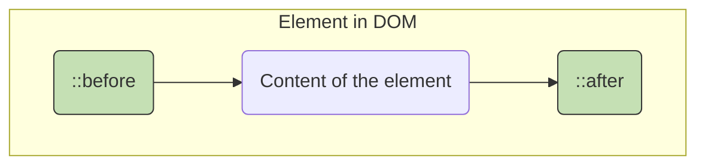

# 19. Modern CSS Selectors & Pseudo-classes 🔬

Beyond the fundamentals, CSS offers a vast array of advanced selectors that provide incredible power and precision for targeting elements. This chapter explores powerful pseudo-classes for structural and state-based selection, pseudo-elements for styling abstract parts of the document, and the revolutionary `:has()` pseudo-class that allows for parent selection.

## Table of Contents
-   [[#Advanced Pseudo-classes|Advanced Pseudo-classes]]
    -   [[#Structural Pseudo-classes (`:nth-child`, etc.)|Structural Pseudo-classes (`:nth-child`, etc.)]]
    -   [[#Relational Pseudo-classes (`:focus-within`, `:has()`)|Relational Pseudo-classes (`:focus-within`, `:has()`)]]
-   [[#Pseudo-elements|Pseudo-elements]]
    -   [[#`::before` and `::after`|`::before` and `::after`]]
    -   [[#Typographic and UI Pseudo-elements|Typographic and UI Pseudo-elements]]
-   [[#State-based Selectors|State-based Selectors (Review)]]

---

## Advanced Pseudo-classes

Pseudo-classes select elements based on state or structural characteristics that can't be targeted by simple selectors alone.

### Structural Pseudo-classes (`:nth-child`, etc.)
These select elements based on their position in the document tree.

- **`:first-child` / `:last-child`**: Selects an element that is the first or last child of its parent.
- **`:only-child`**: Selects an element that is the *only* child of its parent.
- **`:empty`**: Selects an element that has no children (including text nodes).
- **`:nth-child(an+b)` / `:nth-of-type(an+b)`**: The most powerful structural selectors. They select elements based on a formula.
    - `:nth-child(2n)` or `:nth-child(even)`: Selects every even element.
    - `:nth-child(2n+1)` or `:nth-child(odd)`: Selects every odd element.
    - `:nth-child(3)`: Selects the third child.
    - `:nth-child(n+4)`: Selects every child from the 4th onwards.
    - **`...-of-type` vs `...-child`**: `:nth-child` counts all siblings, regardless of type. `:nth-of-type` only counts siblings of the same element type.

**Example: Zebra-Striped Table**
```html
<!-- preview: true -->
<table>
  <tr><td>Row 1</td></tr>
  <tr><td>Row 2</td></tr>
  <tr><td>Row 3</td></tr>
  <tr><td>Row 4</td></tr>
</table>
<style>
  tr:nth-child(even) { background-color: #f2f2f2; }
</style>
```

### Relational Pseudo-classes (`:focus-within`, `:has()`)
These modern selectors are game-changers, allowing you to style elements based on the state or presence of their descendants.

#### `:focus-within`
Selects an element if that element *or any of its descendants* has focus. This is incredibly useful for form styling.

```html
<!-- preview: true -->
<div class="form-group">
  <label for="name">Name:</label>
  <input type="text" id="name">
</div>
<style>
.form-group { border: 2px solid #ccc; padding: 10px; border-radius: 5px; transition: all 0.3s; }
.form-group:focus-within {
  border-color: #3498db;
  box-shadow: 0 0 5px rgba(52, 152, 219, 0.5);
}
</style>
```

#### `:has()` - The Parent Selector
The `:has()` pseudo-class selects an element if any of the selectors passed as arguments match at least one of its descendants. **It lets you style a parent or ancestor based on its children.**

- **Use Cases:** Immensely powerful for creating responsive components, styling form states, and simplifying layouts that previously required JavaScript.

**Example: Styling a card with an image differently**
```html
<!-- preview: true -->
<div class="card-container">
  <div class="card"><p>A card with just text.</p></div>
  <div class="card">
    
    <p>A card that has an image.</p>
  </div>
</div>
<style>
.card { border: 1px solid #ddd; padding: 1rem; }
/* Select a .card that HAS an  inside it */
.card:has(img) {
  padding: 0;
  border-color: tomato;
  display: flex;
  flex-direction: column;
}
.card:has(img) p { padding: 0 1rem 1rem; }
</style>
```
---

## Pseudo-elements

Pseudo-elements create abstract elements that are not in the HTML source code, allowing you to style specific parts of an element. They are prefixed with `::`.

### `::before` and `::after`
These are the most common pseudo-elements. They create a "fake" child element *before* or *after* the selected element's content.

- **`content` property is required:** For `::before` or `::after` to be rendered, you must declare the `content` property, even if it's empty (`content: '';`).
- **Use Cases:** Adding decorative elements (icons, quotes), creating tooltips, and for the "clearfix" hack.


**Example: Custom List Bullets**
```html
<!-- preview: true -->
<ul class="custom-list">
  <li>First item</li>
  <li>Second item</li>
</ul>
<style>
.custom-list { list-style: none; padding-left: 0; }
.custom-list li { padding-left: 1.5rem; position: relative; }
.custom-list li::before {
  content: '✅'; /* The pseudo-element content */
  position: absolute;
  left: 0;
  top: 0;
}
</style>
```

### Typographic and UI Pseudo-elements
- `::first-line`: Styles the first line of a block-level element.
- `::first-letter`: Styles the first letter of the first line.
- `::selection`: Styles the portion of the document that is currently highlighted by the user.
- `::placeholder`: Styles the placeholder text in an `<input>` or `<textarea>`.
- `::backdrop`: Styles the backdrop that is rendered behind a fullscreen element (like a `<dialog>` or video).

**Example: Typography and UI Pseudo-elements**
```html
<!-- preview: true -->
<div class="typography-demo">
  <p class="drop-cap">This paragraph demonstrates the ::first-letter pseudo-element with a beautiful drop cap effect. The first letter is styled differently from the rest of the text.</p>
  
  <p class="first-line-demo">This paragraph shows the ::first-line pseudo-element in action. The first line has different styling from the rest of the paragraph content, creating an elegant typographic effect.</p>
  
  <input type="text" class="styled-input" placeholder="Custom placeholder styling...">
  
  <p class="selection-demo">Try selecting this text to see the custom selection styling with a beautiful color scheme.</p>
</div>

<style>
.typography-demo {
  background: #f8f9fa;
  padding: 2rem;
  border-radius: 8px;
  max-width: 600px;
}

.drop-cap::first-letter {
  font-size: 3em;
  float: left;
  line-height: 1;
  margin: 0 0.1em 0 0;
  color: #007bff;
  font-weight: bold;
}

.first-line-demo::first-line {
  font-weight: bold;
  color: #dc3545;
  text-transform: uppercase;
  letter-spacing: 1px;
}

.styled-input {
  width: 100%;
  padding: 0.75rem;
  border: 2px solid #dee2e6;
  border-radius: 4px;
  font-size: 1rem;
  margin: 1rem 0;
}

.styled-input::placeholder {
  color: #6c757d;
  font-style: italic;
  opacity: 0.8;
}

.styled-input:focus {
  outline: none;
  border-color: #007bff;
  box-shadow: 0 0 0 0.2rem rgba(0, 123, 255, 0.25);
}

.selection-demo::selection {
  background: #007bff;
  color: white;
  text-shadow: none;
}

.typography-demo p {
  margin-bottom: 1.5rem;
  line-height: 1.6;
}
</style>
```

### Modern Pseudo-elements (2025+)

#### `::backdrop`
Styles the backdrop behind fullscreen elements like dialogs:

```css
dialog::backdrop {
  background: rgba(0, 0, 0, 0.5);
  backdrop-filter: blur(4px);
}
```

#### `::marker`
Styles the marker box of list items:

```html
<!-- preview: true -->
<ul class="custom-markers">
  <li>First item with custom marker</li>
  <li>Second item with custom marker</li>
  <li>Third item with custom marker</li>
</ul>

<style>
.custom-markers {
  padding-left: 2rem;
}

.custom-markers li::marker {
  content: "🎯 ";
  font-size: 1.2em;
}

.custom-markers li:nth-child(2)::marker {
  content: "⭐ ";
}

.custom-markers li:nth-child(3)::marker {
  content: "🚀 ";
}
</style>
```

---

## State-based Selectors

These selectors target elements based on their current state, enabling rich interactive experiences.

### Basic State Selectors

```html
<!-- preview: true -->
<div class="state-demo">
  <a href="#section1" class="demo-link">Hover and click me</a>
  <a href="#visited-example" class="demo-link visited-link">Visited link example</a>
  
  <div class="form-states">
    <input type="text" class="demo-input" placeholder="Focus me">
    <input type="checkbox" id="demo-check" class="demo-checkbox">
    <label for="demo-check">Check me</label>
    <input type="text" disabled class="demo-input" placeholder="Disabled input">
  </div>
  
  <div id="section1" class="target-section">
    <p>This section is targeted when you click the first link above!</p>
  </div>
</div>

<style>
.state-demo {
  background: #f8f9fa;
  padding: 2rem;
  border-radius: 8px;
}

.demo-link {
  display: inline-block;
  padding: 0.5rem 1rem;
  margin: 0.5rem;
  background: #007bff;
  color: white;
  text-decoration: none;
  border-radius: 4px;
  transition: all 0.3s ease;
}

.demo-link:hover {
  background: #0056b3;
  transform: translateY(-2px);
  box-shadow: 0 4px 8px rgba(0, 0, 0, 0.2);
}

.demo-link:active {
  transform: translateY(0);
  box-shadow: 0 2px 4px rgba(0, 0, 0, 0.2);
}

.demo-link:visited {
  background: #6c757d;
}

.form-states {
  margin: 2rem 0;
  display: flex;
  flex-direction: column;
  gap: 1rem;
}

.demo-input {
  padding: 0.75rem;
  border: 2px solid #dee2e6;
  border-radius: 4px;
  transition: all 0.3s ease;
}

.demo-input:focus {
  outline: none;
  border-color: #007bff;
  box-shadow: 0 0 0 0.2rem rgba(0, 123, 255, 0.25);
}

.demo-input:disabled {
  background: #e9ecef;
  color: #6c757d;
  cursor: not-allowed;
}

.demo-checkbox {
  margin-right: 0.5rem;
  transform: scale(1.2);
}

.demo-checkbox:checked + label {
  color: #28a745;
  font-weight: bold;
}

.target-section {
  margin-top: 2rem;
  padding: 1rem;
  background: #d4edda;
  border: 1px solid #c3e6cb;
  border-radius: 4px;
  opacity: 0.5;
  transition: all 0.3s ease;
}

.target-section:target {
  opacity: 1;
  background: #d1ecf1;
  border-color: #bee5eb;
  transform: scale(1.02);
}
</style>
```

### Advanced State Selectors

#### `:focus-visible`
Only applies focus styles when focus is visible (keyboard navigation):

```css
.button {
  outline: none;
}

.button:focus-visible {
  outline: 2px solid #007bff;
  outline-offset: 2px;
}
```

#### `:focus-within`
Styles an element when it or any descendant has focus:

```html
<!-- preview: true -->
<div class="form-container">
  <h3>Contact Form</h3>
  <form class="focus-within-form">
    <div class="form-group">
      <label>Name:</label>
      <input type="text" placeholder="Your name">
    </div>
    <div class="form-group">
      <label>Email:</label>
      <input type="email" placeholder="your@email.com">
    </div>
    <div class="form-group">
      <label>Message:</label>
      <textarea placeholder="Your message"></textarea>
    </div>
  </form>
</div>

<style>
.form-container {
  background: #f8f9fa;
  padding: 2rem;
  border-radius: 8px;
  max-width: 400px;
}

.focus-within-form {
  border: 2px solid #dee2e6;
  padding: 1.5rem;
  border-radius: 8px;
  transition: all 0.3s ease;
}

.focus-within-form:focus-within {
  border-color: #007bff;
  box-shadow: 0 0 0 0.2rem rgba(0, 123, 255, 0.1);
  background: white;
}

.form-group {
  margin-bottom: 1rem;
}

.form-group label {
  display: block;
  margin-bottom: 0.5rem;
  font-weight: bold;
  color: #495057;
}

.form-group input,
.form-group textarea {
  width: 100%;
  padding: 0.75rem;
  border: 1px solid #ced4da;
  border-radius: 4px;
  transition: border-color 0.3s ease;
}

.form-group input:focus,
.form-group textarea:focus {
  outline: none;
  border-color: #007bff;
}
</style>
```

---

## Advanced Structural Selectors

### Complex nth-child Patterns

```html
<!-- preview: true -->
<div class="nth-child-demo">
  <h4>nth-child Pattern Examples</h4>
  
  <div class="pattern-grid">
    <div class="pattern-section">
      <h5>Every 3rd item (3n)</h5>
      <div class="items-container pattern-3n">
        <div class="item">1</div>
        <div class="item">2</div>
        <div class="item">3</div>
        <div class="item">4</div>
        <div class="item">5</div>
        <div class="item">6</div>
        <div class="item">7</div>
        <div class="item">8</div>
        <div class="item">9</div>
      </div>
    </div>
    
    <div class="pattern-section">
      <h5>From 4th onwards (n+4)</h5>
      <div class="items-container pattern-n4">
        <div class="item">1</div>
        <div class="item">2</div>
        <div class="item">3</div>
        <div class="item">4</div>
        <div class="item">5</div>
        <div class="item">6</div>
        <div class="item">7</div>
        <div class="item">8</div>
        <div class="item">9</div>
      </div>
    </div>
    
    <div class="pattern-section">
      <h5>First 3 items (-n+3)</h5>
      <div class="items-container pattern-first3">
        <div class="item">1</div>
        <div class="item">2</div>
        <div class="item">3</div>
        <div class="item">4</div>
        <div class="item">5</div>
        <div class="item">6</div>
        <div class="item">7</div>
        <div class="item">8</div>
        <div class="item">9</div>
      </div>
    </div>
  </div>
</div>

<style>
.nth-child-demo {
  background: #f8f9fa;
  padding: 2rem;
  border-radius: 8px;
}

.nth-child-demo h4 {
  text-align: center;
  color: #007bff;
  margin-bottom: 2rem;
}

.pattern-grid {
  display: grid;
  grid-template-columns: repeat(auto-fit, minmax(250px, 1fr));
  gap: 2rem;
}

.pattern-section h5 {
  margin: 0 0 1rem 0;
  color: #495057;
  text-align: center;
}

.items-container {
  display: grid;
  grid-template-columns: repeat(3, 1fr);
  gap: 0.5rem;
}

.item {
  background: #e9ecef;
  padding: 1rem;
  text-align: center;
  border-radius: 4px;
  font-weight: bold;
  transition: all 0.3s ease;
}

/* Pattern: Every 3rd item */
.pattern-3n .item:nth-child(3n) {
  background: #007bff;
  color: white;
  transform: scale(1.1);
}

/* Pattern: From 4th onwards */
.pattern-n4 .item:nth-child(n+4) {
  background: #28a745;
  color: white;
  transform: scale(1.1);
}

/* Pattern: First 3 items */
.pattern-first3 .item:nth-child(-n+3) {
  background: #dc3545;
  color: white;
  transform: scale(1.1);
}
</style>
```

### Empty and Only-Child Selectors

```html
<!-- preview: true -->
<div class="empty-demo">
  <h4>Empty and Only-Child Examples</h4>
  
  <div class="demo-containers">
    <div class="demo-container">
      <h5>Container with multiple children</h5>
      <p>Child 1</p>
      <p>Child 2</p>
    </div>
    
    <div class="demo-container">
      <h5>Container with only child</h5>
      <p>Only child</p>
    </div>
    
    <div class="demo-container">
      <h5>Empty container</h5>
    </div>
  </div>
</div>

<style>
.empty-demo {
  background: #f8f9fa;
  padding: 2rem;
  border-radius: 8px;
}

.empty-demo h4 {
  text-align: center;
  color: #007bff;
  margin-bottom: 2rem;
}

.demo-containers {
  display: grid;
  grid-template-columns: repeat(auto-fit, minmax(200px, 1fr));
  gap: 1rem;
}

.demo-container {
  background: white;
  border: 2px solid #dee2e6;
  border-radius: 8px;
  padding: 1rem;
  min-height: 120px;
}

.demo-container h5 {
  margin: 0 0 1rem 0;
  color: #495057;
  font-size: 0.9rem;
}

.demo-container p {
  background: #e9ecef;
  padding: 0.5rem;
  margin: 0.5rem 0;
  border-radius: 4px;
}

/* Style only children differently */
.demo-container p:only-child {
  background: #d1ecf1;
  border: 2px solid #bee5eb;
  font-weight: bold;
}

/* Style empty containers */
.demo-container:empty::before {
  content: "This container is empty";
  color: #6c757d;
  font-style: italic;
  display: block;
  text-align: center;
  padding: 2rem;
}

/* Alternative styling for containers with no paragraph children */
.demo-container:not(:has(p))::after {
  content: "No paragraphs here!";
  color: #dc3545;
  font-weight: bold;
  display: block;
  text-align: center;
  margin-top: 1rem;
}
</style>
```

---

## The Revolutionary `:has()` Selector

The `:has()` pseudo-class is a game-changer, allowing parent selection based on descendant content.

### Practical `:has()` Examples

```html
<!-- preview: true -->
<div class="has-demo">
  <h4>:has() Selector Examples</h4>
  
  <div class="cards-container">
    <article class="card">
      <h3>Text Only Card</h3>
      <p>This card contains only text content.</p>
    </article>
    
    <article class="card">
      
      <h3>Card with Image</h3>
      <p>This card has an image and gets special styling.</p>
    </article>
    
    <article class="card">
      <h3>Card with Button</h3>
      <p>This card has a call-to-action button.</p>
      <button class="cta-button">Click Me</button>
    </article>
    
    <article class="card">
      
      <h3>Card with Both</h3>
      <p>This card has both an image and a button.</p>
      <button class="cta-button">Learn More</button>
    </article>
  </div>
  
  <div class="form-has-demo">
    <h5>Form Validation with :has()</h5>
    <form class="validation-form">
      <div class="field-group">
        <label>Valid Field:</label>
        <input type="text" class="valid" value="Valid input">
      </div>
      <div class="field-group">
        <label>Invalid Field:</label>
        <input type="text" class="invalid" value="Invalid input">
      </div>
      <div class="field-group">
        <label>Normal Field:</label>
        <input type="text" placeholder="Type something...">
      </div>
    </form>
  </div>
</div>

<style>
.has-demo {
  background: #f8f9fa;
  padding: 2rem;
  border-radius: 8px;
}

.has-demo h4 {
  text-align: center;
  color: #007bff;
  margin-bottom: 2rem;
}

.cards-container {
  display: grid;
  grid-template-columns: repeat(auto-fit, minmax(250px, 1fr));
  gap: 1.5rem;
  margin-bottom: 3rem;
}

.card {
  background: white;
  border: 2px solid #dee2e6;
  border-radius: 8px;
  padding: 1.5rem;
  transition: all 0.3s ease;
}

/* Cards with images get special styling */
.card:has(img) {
  border-color: #007bff;
  padding: 0;
  overflow: hidden;
}

.card:has(img) img {
  width: 100%;
  height: 120px;
  object-fit: cover;
}

.card:has(img) h3,
.card:has(img) p {
  padding: 0 1.5rem;
}

.card:has(img) h3 {
  padding-top: 1rem;
}

/* Cards with buttons get different styling */
.card:has(button) {
  border-color: #28a745;
  background: linear-gradient(to bottom, white 0%, #f8fff9 100%);
}

/* Cards with both image and button */
.card:has(img):has(button) {
  border-color: #ffc107;
  background: linear-gradient(to bottom, white 0%, #fffbf0 100%);
}

.card:has(img):has(button) .cta-button {
  margin: 0 1.5rem 1.5rem 1.5rem;
}

.card h3 {
  margin: 0 0 1rem 0;
  color: #495057;
}

.card p {
  margin: 0 0 1rem 0;
  color: #6c757d;
  line-height: 1.5;
}

.cta-button {
  background: #007bff;
  color: white;
  border: none;
  padding: 0.5rem 1rem;
  border-radius: 4px;
  cursor: pointer;
  font-weight: bold;
  transition: background 0.3s ease;
}

.cta-button:hover {
  background: #0056b3;
}

/* Form validation with :has() */
.form-has-demo {
  margin-top: 2rem;
}

.form-has-demo h5 {
  color: #495057;
  margin-bottom: 1rem;
}

.validation-form {
  background: white;
  padding: 1.5rem;
  border-radius: 8px;
  border: 2px solid #dee2e6;
}

.field-group {
  margin-bottom: 1rem;
}

.field-group label {
  display: block;
  margin-bottom: 0.5rem;
  font-weight: bold;
  color: #495057;
}

.field-group input {
  width: 100%;
  padding: 0.75rem;
  border: 2px solid #ced4da;
  border-radius: 4px;
  transition: all 0.3s ease;
}

/* Style field groups based on input state */
.field-group:has(.valid) {
  background: #d4edda;
  padding: 1rem;
  border-radius: 4px;
  border-left: 4px solid #28a745;
}

.field-group:has(.invalid) {
  background: #f8d7da;
  padding: 1rem;
  border-radius: 4px;
  border-left: 4px solid #dc3545;
}

.field-group:has(.valid) label {
  color: #155724;
}

.field-group:has(.invalid) label {
  color: #721c24;
}

.valid {
  border-color: #28a745 !important;
}

.invalid {
  border-color: #dc3545 !important;
}
</style>
```

> [!tip] **Modern CSS Selector Best Practices**
> 
> **🎯 Performance:**
> - Use specific selectors to avoid over-broad matching
> - Be mindful that `:has()` can be performance-intensive
> - Prefer class-based selectors for frequently changing states
> 
> **♿ Accessibility:**
> - Use `:focus-visible` for keyboard navigation
> - Ensure sufficient color contrast in all states
> - Test with screen readers and keyboard navigation
> 
> **🔧 Browser Support:**
> - Check compatibility for newer selectors like `:has()`
> - Provide fallbacks for critical functionality
> - Use progressive enhancement
> 
> **🎨 Design:**
> - Use pseudo-elements for decorative content only
> - Keep animations smooth and purposeful
> - Maintain consistency across interactive states

Modern CSS selectors provide incredible power for creating sophisticated, responsive, and interactive designs. The `:has()` selector in particular opens up new possibilities that were previously only achievable with JavaScript. 


---


---
← [[18. CSS Animations.md|CSS Animations]] [[CSS/Table Of Content|��� Table of Contents]] [[20. CSS Variables (Custom Properties).md|CSS Variables (Custom Properties)]] →
