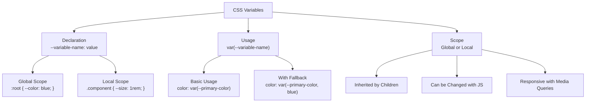

# 20. CSS Variables (Custom Properties) 🎨

CSS Variables (officially called Custom Properties) allow you to store values that can be reused throughout your stylesheet. They enable dynamic styling, theming, and more maintainable CSS code.

## Table of Contents

- [[#Introduction to CSS Variables|Introduction to CSS Variables]]
- [[#Variable Declaration and Usage|Variable Declaration and Usage]]
  - [[#:root Scope for Global Variables|:root Scope for Global Variables]]
  - [[#Local Variable Scoping|Local Variable Scoping]]
  - [[#var() Function with Fallbacks|var() Function with Fallbacks]]
- [[#Dynamic Variables|Dynamic Variables]]
  - [[#JavaScript Integration|JavaScript Integration]]
  - [[#Theme Switching|Theme Switching]]
  - [[#Responsive Variables|Responsive Variables]]
- [[#Advanced Patterns|Advanced Patterns]]
  - [[#Component-Based Variables|Component-Based Variables]]
  - [[#Calculations with Variables|Calculations with Variables]]
  - [[#@property Registration (2025)|@property Registration (2025)]]
- [[#Practical Examples|Practical Examples]]
- [[#Mermaid: CSS Variables Architecture|Mermaid: CSS Variables Architecture]]

---

## Introduction to CSS Variables

CSS Variables provide a way to store and reuse values throughout your stylesheets. They cascade and inherit like regular CSS properties, making them incredibly powerful for theming and dynamic styling.

> [!abstract] 🚀 **Theory Summary**
> CSS Variables are defined with a custom property name prefixed with `--` and accessed using the `var()` function. They follow CSS cascade and inheritance rules, making them more powerful than preprocessor variables.



**Key Advantages:**
- **Dynamic**: Can be changed at runtime with JavaScript
- **Cascading**: Follow CSS inheritance rules
- **Scoped**: Can be local to specific elements
- **Fallbacks**: Support default values
- **Maintainable**: Centralized value management

---

## Variable Declaration and Usage

### :root Scope for Global Variables

The `:root` pseudo-class represents the document root and is the ideal place for global variables:

```css
:root {
  /* Color palette */
  --primary-color: #007bff;
  --secondary-color: #6c757d;
  --success-color: #28a745;
  --danger-color: #dc3545;
  --warning-color: #ffc107;
  
  /* Typography */
  --font-family-base: 'Helvetica Neue', Arial, sans-serif;
  --font-size-base: 1rem;
  --line-height-base: 1.5;
  
  /* Spacing */
  --spacing-xs: 0.25rem;
  --spacing-sm: 0.5rem;
  --spacing-md: 1rem;
  --spacing-lg: 1.5rem;
  --spacing-xl: 3rem;
  
  /* Layout */
  --container-max-width: 1200px;
  --border-radius: 0.375rem;
  --box-shadow: 0 0.125rem 0.25rem rgba(0, 0, 0, 0.075);
}
```

### Local Variable Scoping

Variables can be scoped to specific elements and their children:

```css
.card {
  --card-padding: 1.5rem;
  --card-background: #fff;
  --card-border: 1px solid #dee2e6;
  
  padding: var(--card-padding);
  background: var(--card-background);
  border: var(--card-border);
  border-radius: var(--border-radius);
}

.card--dark {
  --card-background: #343a40;
  --card-border: 1px solid #495057;
  color: white;
}
```

### var() Function with Fallbacks

The `var()` function retrieves variable values and supports fallback values:

```css
.element {
  /* Basic usage */
  color: var(--primary-color);
  
  /* With fallback */
  color: var(--primary-color, #007bff);
  
  /* Multiple fallbacks */
  font-family: var(--font-family-custom, var(--font-family-base, Arial, sans-serif));
  
  /* Fallback with calculation */
  margin: var(--margin-custom, calc(var(--spacing-md) * 2));
}
```

```html
<!-- preview: true -->
<div class="variables-demo">
  <div class="demo-card">
    <h3>Default Card</h3>
    <p>This card uses default CSS variables.</p>
    <button class="demo-button">Action</button>
  </div>
  
  <div class="demo-card demo-card--success">
    <h3>Success Card</h3>
    <p>This card overrides variables for success theme.</p>
    <button class="demo-button">Action</button>
  </div>
  
  <div class="demo-card demo-card--dark">
    <h3>Dark Card</h3>
    <p>This card uses dark theme variables.</p>
    <button class="demo-button">Action</button>
  </div>
</div>

<style>
:root {
  --primary-color: #007bff;
  --success-color: #28a745;
  --dark-color: #343a40;
  --light-color: #f8f9fa;
  --border-radius: 0.5rem;
  --spacing: 1rem;
  --box-shadow: 0 0.25rem 0.5rem rgba(0, 0, 0, 0.1);
}

.variables-demo {
  display: grid;
  grid-template-columns: repeat(auto-fit, minmax(250px, 1fr));
  gap: var(--spacing);
  background: var(--light-color);
  padding: calc(var(--spacing) * 2);
  border-radius: var(--border-radius);
}

.demo-card {
  --card-bg: white;
  --card-color: #333;
  --card-border: var(--primary-color);
  
  background: var(--card-bg);
  color: var(--card-color);
  padding: var(--spacing);
  border: 2px solid var(--card-border);
  border-radius: var(--border-radius);
  box-shadow: var(--box-shadow);
}

.demo-card--success {
  --card-border: var(--success-color);
}

.demo-card--dark {
  --card-bg: var(--dark-color);
  --card-color: white;
  --card-border: #495057;
}

.demo-card h3 {
  margin: 0 0 var(--spacing) 0;
  color: var(--card-border);
}

.demo-card p {
  margin: 0 0 var(--spacing) 0;
  line-height: 1.5;
}

.demo-button {
  background: var(--card-border);
  color: white;
  border: none;
  padding: 0.5rem 1rem;
  border-radius: calc(var(--border-radius) * 0.75);
  cursor: pointer;
  font-weight: bold;
}
</style>
```

---

## Dynamic Variables

### JavaScript Integration

CSS Variables can be manipulated with JavaScript, enabling dynamic theming:

```javascript
// Get CSS variable value
const primaryColor = getComputedStyle(document.documentElement)
  .getPropertyValue('--primary-color');

// Set CSS variable value
document.documentElement.style.setProperty('--primary-color', '#ff6b6b');

// Remove CSS variable
document.documentElement.style.removeProperty('--primary-color');
```

### Theme Switching

Create a complete theme switching system:

```css
:root {
  /* Light theme (default) */
  --bg-primary: #ffffff;
  --bg-secondary: #f8f9fa;
  --text-primary: #212529;
  --text-secondary: #6c757d;
  --border-color: #dee2e6;
  --shadow: rgba(0, 0, 0, 0.1);
}

[data-theme="dark"] {
  /* Dark theme */
  --bg-primary: #212529;
  --bg-secondary: #343a40;
  --text-primary: #f8f9fa;
  --text-secondary: #adb5bd;
  --border-color: #495057;
  --shadow: rgba(0, 0, 0, 0.3);
}

body {
  background-color: var(--bg-primary);
  color: var(--text-primary);
  transition: background-color 0.3s ease, color 0.3s ease;
}

.card {
  background-color: var(--bg-secondary);
  border: 1px solid var(--border-color);
  box-shadow: 0 2px 4px var(--shadow);
}
```

```html
<!-- preview: true -->
<div class="theme-demo" id="themeDemo">
  <div class="theme-controls">
    <button onclick="setTheme('light')" class="theme-btn">☀️ Light</button>
    <button onclick="setTheme('dark')" class="theme-btn">🌙 Dark</button>
    <button onclick="setTheme('colorful')" class="theme-btn">🎨 Colorful</button>
  </div>
  
  <div class="themed-content">
    <div class="themed-card">
      <h3>Themed Card</h3>
      <p>This card adapts to the selected theme using CSS variables.</p>
      <button class="themed-button">Themed Button</button>
    </div>
  </div>
</div>

<style>
.theme-demo {
  --bg-primary: #ffffff;
  --bg-secondary: #f8f9fa;
  --text-primary: #212529;
  --text-secondary: #6c757d;
  --accent-color: #007bff;
  --border-color: #dee2e6;
  --shadow: rgba(0, 0, 0, 0.1);
  
  background: var(--bg-primary);
  color: var(--text-primary);
  padding: 2rem;
  border-radius: 0.5rem;
  transition: all 0.3s ease;
}

.theme-demo[data-theme="dark"] {
  --bg-primary: #212529;
  --bg-secondary: #343a40;
  --text-primary: #f8f9fa;
  --text-secondary: #adb5bd;
  --accent-color: #0d6efd;
  --border-color: #495057;
  --shadow: rgba(0, 0, 0, 0.3);
}

.theme-demo[data-theme="colorful"] {
  --bg-primary: linear-gradient(135deg, #667eea 0%, #764ba2 100%);
  --bg-secondary: rgba(255, 255, 255, 0.1);
  --text-primary: #ffffff;
  --text-secondary: #e9ecef;
  --accent-color: #ffd700;
  --border-color: rgba(255, 255, 255, 0.2);
  --shadow: rgba(0, 0, 0, 0.2);
}

.theme-controls {
  display: flex;
  gap: 1rem;
  margin-bottom: 2rem;
  justify-content: center;
}

.theme-btn {
  background: var(--accent-color);
  color: var(--bg-primary);
  border: none;
  padding: 0.5rem 1rem;
  border-radius: 0.25rem;
  cursor: pointer;
  font-weight: bold;
  transition: all 0.3s ease;
}

.theme-btn:hover {
  transform: translateY(-2px);
  box-shadow: 0 4px 8px var(--shadow);
}

.themed-content {
  display: flex;
  justify-content: center;
}

.themed-card {
  background: var(--bg-secondary);
  border: 1px solid var(--border-color);
  border-radius: 0.5rem;
  padding: 2rem;
  box-shadow: 0 4px 6px var(--shadow);
  max-width: 300px;
  text-align: center;
}

.themed-card h3 {
  margin: 0 0 1rem 0;
  color: var(--accent-color);
}

.themed-card p {
  margin: 0 0 1.5rem 0;
  color: var(--text-secondary);
  line-height: 1.5;
}

.themed-button {
  background: var(--accent-color);
  color: var(--bg-primary);
  border: none;
  padding: 0.75rem 1.5rem;
  border-radius: 0.25rem;
  cursor: pointer;
  font-weight: bold;
  transition: all 0.3s ease;
}

.themed-button:hover {
  transform: scale(1.05);
}
</style>

<script>
function setTheme(theme) {
  const demo = document.getElementById('themeDemo');
  if (theme === 'light') {
    demo.removeAttribute('data-theme');
  } else {
    demo.setAttribute('data-theme', theme);
  }
}
</script>
```

### Responsive Variables

Variables can change based on media queries:

```css
:root {
  --container-padding: 1rem;
  --font-size-h1: 2rem;
  --grid-columns: 1;
}

@media (min-width: 768px) {
  :root {
    --container-padding: 2rem;
    --font-size-h1: 2.5rem;
    --grid-columns: 2;
  }
}

@media (min-width: 1024px) {
  :root {
    --container-padding: 3rem;
    --font-size-h1: 3rem;
    --grid-columns: 3;
  }
}

.container {
  padding: var(--container-padding);
}

h1 {
  font-size: var(--font-size-h1);
}

.grid {
  display: grid;
  grid-template-columns: repeat(var(--grid-columns), 1fr);
}
```

---

## Advanced Patterns

### Component-Based Variables

Organize variables by component for better maintainability:

```css
/* Button component variables */
.btn {
  --btn-padding-y: 0.375rem;
  --btn-padding-x: 0.75rem;
  --btn-font-size: 1rem;
  --btn-border-radius: 0.375rem;
  --btn-border-width: 1px;
  --btn-transition: all 0.15s ease-in-out;
  
  padding: var(--btn-padding-y) var(--btn-padding-x);
  font-size: var(--btn-font-size);
  border-radius: var(--btn-border-radius);
  border: var(--btn-border-width) solid transparent;
  transition: var(--btn-transition);
}

/* Button variants */
.btn--primary {
  --btn-bg: var(--primary-color);
  --btn-color: white;
  --btn-border-color: var(--primary-color);
  
  background-color: var(--btn-bg);
  color: var(--btn-color);
  border-color: var(--btn-border-color);
}

.btn--large {
  --btn-padding-y: 0.5rem;
  --btn-padding-x: 1rem;
  --btn-font-size: 1.25rem;
}

.btn--small {
  --btn-padding-y: 0.25rem;
  --btn-padding-x: 0.5rem;
  --btn-font-size: 0.875rem;
}
```

### Calculations with Variables

Combine variables with CSS functions:

```css
:root {
  --base-size: 1rem;
  --scale-ratio: 1.25;
  --spacing-unit: 8px;
}

.typography {
  --h1-size: calc(var(--base-size) * var(--scale-ratio) * var(--scale-ratio) * var(--scale-ratio));
  --h2-size: calc(var(--base-size) * var(--scale-ratio) * var(--scale-ratio));
  --h3-size: calc(var(--base-size) * var(--scale-ratio));
}

.spacing {
  --space-xs: calc(var(--spacing-unit) * 0.5);
  --space-sm: var(--spacing-unit);
  --space-md: calc(var(--spacing-unit) * 2);
  --space-lg: calc(var(--spacing-unit) * 3);
  --space-xl: calc(var(--spacing-unit) * 4);
}

/* Responsive calculations */
.fluid-container {
  --min-width: 320px;
  --max-width: 1200px;
  --padding: clamp(1rem, 4vw, 3rem);
  
  width: min(90%, var(--max-width));
  padding: var(--padding);
  margin: 0 auto;
}
```

### @property Registration (2025)

The `@property` rule allows you to register custom properties with type checking and animation support:

```css
@property --rotation {
  syntax: '<angle>';
  initial-value: 0deg;
  inherits: false;
}

@property --color-stop {
  syntax: '<percentage>';
  initial-value: 0%;
  inherits: false;
}

.animated-element {
  transform: rotate(var(--rotation));
  background: linear-gradient(45deg, 
    red var(--color-stop), 
    blue calc(var(--color-stop) + 50%));
  
  animation: spin 2s linear infinite;
}

@keyframes spin {
  to {
    --rotation: 360deg;
    --color-stop: 100%;
  }
}
```

---

## Practical Examples

### Design System with Variables

```html
<!-- preview: true -->
<div class="design-system-demo">
  <div class="ds-header">
    <h2>Design System Demo</h2>
    <p>Built with CSS Variables</p>
  </div>
  
  <div class="ds-grid">
    <div class="ds-card ds-card--primary">
      <h3>Primary Card</h3>
      <p>This card uses primary theme colors.</p>
      <button class="ds-btn ds-btn--primary">Primary Action</button>
    </div>
    
    <div class="ds-card ds-card--secondary">
      <h3>Secondary Card</h3>
      <p>This card uses secondary theme colors.</p>
      <button class="ds-btn ds-btn--secondary">Secondary Action</button>
    </div>
    
    <div class="ds-card ds-card--success">
      <h3>Success Card</h3>
      <p>This card uses success theme colors.</p>
      <button class="ds-btn ds-btn--success">Success Action</button>
    </div>
  </div>
</div>

<style>
.design-system-demo {
  /* Design tokens */
  --ds-color-primary: #007bff;
  --ds-color-secondary: #6c757d;
  --ds-color-success: #28a745;
  --ds-color-white: #ffffff;
  --ds-color-light: #f8f9fa;
  --ds-color-dark: #343a40;
  
  --ds-font-family: -apple-system, BlinkMacSystemFont, 'Segoe UI', Roboto, sans-serif;
  --ds-font-size-sm: 0.875rem;
  --ds-font-size-base: 1rem;
  --ds-font-size-lg: 1.125rem;
  --ds-font-size-xl: 1.25rem;
  
  --ds-spacing-xs: 0.25rem;
  --ds-spacing-sm: 0.5rem;
  --ds-spacing-md: 1rem;
  --ds-spacing-lg: 1.5rem;
  --ds-spacing-xl: 3rem;
  
  --ds-border-radius: 0.375rem;
  --ds-border-width: 1px;
  --ds-box-shadow: 0 0.125rem 0.25rem rgba(0, 0, 0, 0.075);
  --ds-transition: all 0.15s ease-in-out;
  
  font-family: var(--ds-font-family);
  background: var(--ds-color-light);
  padding: var(--ds-spacing-xl);
  border-radius: var(--ds-border-radius);
}

.ds-header {
  text-align: center;
  margin-bottom: var(--ds-spacing-xl);
}

.ds-header h2 {
  color: var(--ds-color-dark);
  font-size: var(--ds-font-size-xl);
  margin: 0 0 var(--ds-spacing-sm) 0;
}

.ds-header p {
  color: var(--ds-color-secondary);
  margin: 0;
}

.ds-grid {
  display: grid;
  grid-template-columns: repeat(auto-fit, minmax(250px, 1fr));
  gap: var(--ds-spacing-lg);
}

.ds-card {
  --card-theme-color: var(--ds-color-primary);
  
  background: var(--ds-color-white);
  border: var(--ds-border-width) solid var(--card-theme-color);
  border-radius: var(--ds-border-radius);
  padding: var(--ds-spacing-lg);
  box-shadow: var(--ds-box-shadow);
  transition: var(--ds-transition);
}

.ds-card:hover {
  transform: translateY(-2px);
  box-shadow: 0 0.5rem 1rem rgba(0, 0, 0, 0.15);
}

.ds-card--primary { --card-theme-color: var(--ds-color-primary); }
.ds-card--secondary { --card-theme-color: var(--ds-color-secondary); }
.ds-card--success { --card-theme-color: var(--ds-color-success); }

.ds-card h3 {
  color: var(--card-theme-color);
  font-size: var(--ds-font-size-lg);
  margin: 0 0 var(--ds-spacing-md) 0;
}

.ds-card p {
  color: var(--ds-color-dark);
  line-height: 1.5;
  margin: 0 0 var(--ds-spacing-lg) 0;
}

.ds-btn {
  --btn-theme-color: var(--ds-color-primary);
  
  background: var(--btn-theme-color);
  color: var(--ds-color-white);
  border: none;
  padding: var(--ds-spacing-sm) var(--ds-spacing-md);
  border-radius: var(--ds-border-radius);
  font-size: var(--ds-font-size-sm);
  font-weight: 600;
  cursor: pointer;
  transition: var(--ds-transition);
}

.ds-btn:hover {
  filter: brightness(110%);
  transform: scale(1.02);
}

.ds-btn--primary { --btn-theme-color: var(--ds-color-primary); }
.ds-btn--secondary { --btn-theme-color: var(--ds-color-secondary); }
.ds-btn--success { --btn-theme-color: var(--ds-color-success); }
</style>
```

---

## Mermaid: CSS Variables Architecture

```mermaid
graph TD
    A[CSS Variables Architecture] --> B[Global Variables<br/>:root]
    A --> C[Component Variables<br/>Local Scope]
    A --> D[Theme Variables<br/>Data Attributes]
    
    B --> B1[Design Tokens<br/>Colors, Typography, Spacing]
    B --> B2[Layout Variables<br/>Breakpoints, Containers]
    B --> B3[Animation Variables<br/>Durations, Easings]
    
    C --> C1[Component Tokens<br/>Button, Card, Modal]
    C --> C2[State Variables<br/>Hover, Active, Disabled]
    C --> C3[Variant Variables<br/>Primary, Secondary, Large]
    
    D --> D1[Light Theme<br/>Default Values]
    D --> D2[Dark Theme<br/>data-theme="dark"]
    D --> D3[Custom Themes<br/>Brand Variations]
    
    E[JavaScript Integration] --> E1[Dynamic Updates<br/>setProperty()]
    E --> E2[Theme Switching<br/>Toggle Attributes]
    E --> E3[User Preferences<br/>localStorage]
    
    style A fill:#e1f5fe
    style B fill:#f3e5f5
    style C fill:#e8f5e8
    style D fill:#fff3e0
    style E fill:#fce4ec
```

> [!tip] **CSS Variables Best Practices**
> 
> **🎯 Organization:**
> - Use meaningful, descriptive names
> - Group related variables together
> - Follow consistent naming conventions
> 
> **🔧 Scoping:**
> - Use `:root` for global design tokens
> - Scope component variables locally
> - Override variables for themes and variants
> 
> **⚡ Performance:**
> - Variables are live - changes cascade immediately
> - Use fallback values for robustness
> - Consider browser support for advanced features
> 
> **🎨 Theming:**
> - Build theme systems with data attributes
> - Use JavaScript for dynamic theme switching
> - Respect user preferences (prefers-color-scheme)

CSS Variables are a powerful tool for creating maintainable, themeable, and dynamic stylesheets. They enable modern CSS architecture patterns and make it easier to build consistent design systems.


---


---
← [[19. Modern CSS Selectors & Pseudo-classes.md|Modern CSS Selectors & Pseudo-classes]] [[CSS/Table Of Content|��� Table of Contents]] [[21. CSS Functions & Calculations.md|CSS Functions & Calculations]] →
