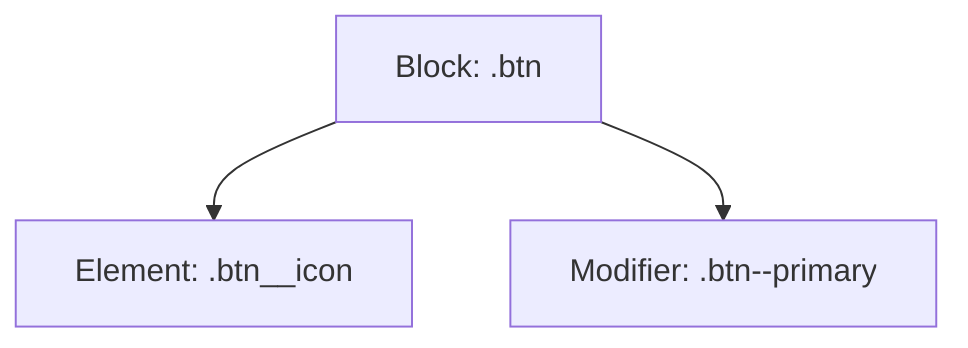
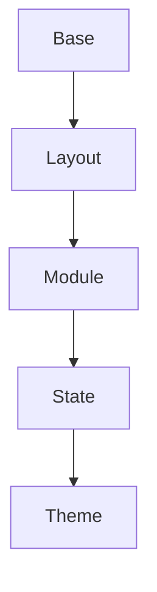
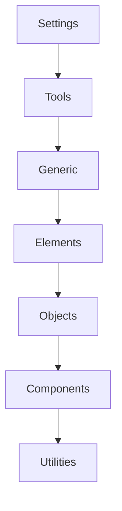

# 23. CSS Methodologies 🏗️

As CSS projects grow, maintaining scalable, readable, and maintainable code becomes a challenge. CSS methodologies provide structured approaches to organizing your stylesheets, making large codebases easier to manage and collaborate on. This chapter covers the most popular methodologies: **BEM**, **OOCSS**, **SMACSS**, and **ITCSS**.

## Table of Contents
-   [[#Why Use a CSS Methodology?|Why Use a CSS Methodology?]]
-   [[#BEM (Block Element Modifier)|BEM (Block Element Modifier)]]
-   [[#OOCSS (Object-Oriented CSS)|OOCSS (Object-Oriented CSS)]]
-   [[#SMACSS (Scalable and Modular Architecture for CSS)|SMACSS (Scalable and Modular Architecture for CSS)]]
-   [[#ITCSS (Inverted Triangle CSS)|ITCSS (Inverted Triangle CSS)]]
-   [[#Comparison & When to Use Each|Comparison & When to Use Each]]

---

## Why Use a CSS Methodology?

> [!abstract] 🚀 **Theory Summary**
> CSS methodologies help you:
> - Avoid selector conflicts and specificity wars
> - Make code more readable and maintainable
> - Enable easier collaboration in teams
> - Scale your CSS for large projects

---

## BEM (Block Element Modifier)

BEM is a naming convention for classes in HTML and CSS. It helps you create reusable components and code sharing in front-end development.

- **Block:** The standalone entity (e.g., `button`, `menu`).
- **Element:** A part of the block that has no standalone meaning (e.g., `button__icon`).
- **Modifier:** A flag on a block or element (e.g., `button--primary`).

**Naming Convention:**
- Block: `.block`
- Element: `.block__element`
- Modifier: `.block--modifier` or `.block__element--modifier`

```html
<!-- preview: true -->
<button class="btn btn--primary">
  <span class="btn__icon"></span>
  <span class="btn__text">Click Me</span>
</button>
<style>
.btn { padding: 10px 20px; border-radius: 4px; border: none; }
.btn--primary { background: #3498db; color: white; }
.btn__icon { margin-right: 8px; }
</style>
```



> [!tip] **BEM Pros:**
> - Predictable, flat class structure
> - Easy to read and maintain
> - Works well with component-based frameworks

---

## OOCSS (Object-Oriented CSS)

OOCSS encourages you to separate structure (objects) from skin (visuals), and to build reusable, composable classes.

- **Object:** A repeating visual pattern (e.g., `.media`, `.box`).
- **Skin:** The visual appearance (e.g., `.bg-blue`, `.rounded`).

**Example:**
```html
<!-- preview: true -->
<div class="media box bg-blue rounded">
  
  <div class="media__body">OOCSS Example</div>
</div>
<style>
.media { display: flex; align-items: center; }
.media__img { margin-right: 10px; }
.box { padding: 10px; border: 1px solid #ccc; }
.bg-blue { background: #e3f2fd; }
.rounded { border-radius: 8px; }
</style>
```

> [!tip] **OOCSS Pros:**
> - Promotes reuse and DRY code
> - Encourages separation of concerns
> - Works well with utility classes

---

## SMACSS (Scalable and Modular Architecture for CSS)

SMACSS is a style guide that categorizes CSS rules into five types: **Base**, **Layout**, **Module**, **State**, and **Theme**.

- **Base:** Default element styles (e.g., `body`, `h1`)
- **Layout:** Major page sections (e.g., `.header`, `.footer`)
- **Module:** Reusable components (e.g., `.card`, `.nav`)
- **State:** Variations or states (e.g., `.is-active`, `.is-hidden`)
- **Theme:** Visual themes (e.g., `.theme-dark`)



**Example:**
```css
/* Base */
h1 { font-size: 2rem; }

/* Layout */
.header { display: flex; justify-content: space-between; }

/* Module */
.card { border: 1px solid #ccc; padding: 1rem; }

/* State */
.is-active { border-color: #3498db; }

/* Theme */
.theme-dark .card { background: #222; color: #eee; }
```

> [!tip] **SMACSS Pros:**
> - Flexible and adaptable
> - Encourages modularity
> - Works well for large projects

---

## ITCSS (Inverted Triangle CSS)

ITCSS is an architecture for organizing CSS by specificity, from broadest to most specific. It uses an inverted triangle to represent the flow from generic to explicit rules.

- **Layers:**
    1. **Settings:** Global variables, config
    2. **Tools:** Mixins, functions
    3. **Generic:** Resets, normalize
    4. **Elements:** Unclassed HTML elements
    5. **Objects:** Reusable patterns (like OOCSS)
    6. **Components:** Specific UI components
    7. **Utilities:** Helpers, overrides



> [!tip] **ITCSS Pros:**
> - Scales to very large codebases
> - Reduces specificity conflicts
> - Encourages clear separation of concerns

---

## Comparison & When to Use Each

| Methodology | Best For | Key Features |
|-------------|----------|--------------|
| **BEM**     | Component-based UIs, teams | Predictable, flat class names, easy to read |
| **OOCSS**   | Utility/atomic CSS, reuse  | Separation of structure/skin, DRY code      |
| **SMACSS**  | Large, modular projects    | Categorized rules, flexible, scalable       |
| **ITCSS**   | Huge codebases, design systems | Layered by specificity, avoids conflicts |

> [!success] **Best Practice:**
> You can combine methodologies! For example, use BEM for naming, ITCSS for file structure, and OOCSS for utility classes. 


---


---
← [[22. Modern CSS Layout Features (2025).md|Modern CSS Layout Features (2025)]] [[CSS/Table Of Content|��� Table of Contents]] [[24. CSS Preprocessors.md|CSS Preprocessors]] →
