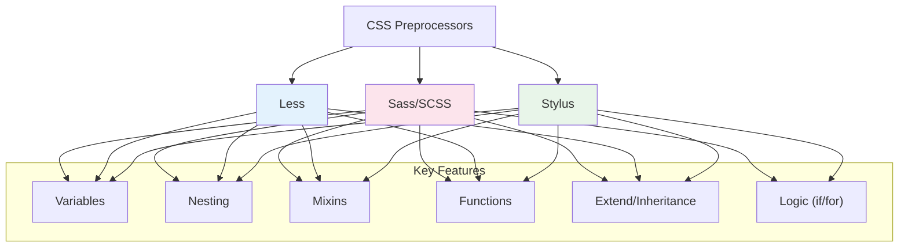

# 24. CSS Preprocessors ⚙️

CSS preprocessors are scripting languages that extend the default capabilities of CSS. They allow you to use logic, functions, and variables, which are then compiled into regular CSS. This makes your stylesheets more maintainable, scalable, and easier to write.

## Table of Contents
- [[#What is a CSS Preprocessor?|What is a CSS Preprocessor?]]
- [[#Sass/SCSS - The Industry Standard|Sass/SCSS - The Industry Standard]]
  - [[#Variables and Nesting|Variables and Nesting]]
  - [[#Mixins and Functions|Mixins and Functions]]
  - [[#Inheritance (`@extend`)|Inheritance (`@extend`)]]
- [[#Less - The JavaScript Alternative|Less - The JavaScript Alternative]]
- [[#Stylus - The Flexible Preprocessor|Stylus - The Flexible Preprocessor]]
- [[#Modern Alternatives & PostCSS|Modern Alternatives & PostCSS]]
- [[#Mermaid: Preprocessor Feature Comparison|Mermaid: Preprocessor Feature Comparison]]

---

## What is a CSS Preprocessor?

> [!abstract] 🚀 **Theory Summary**
> A preprocessor lets you write CSS-like code with advanced programming features. A compiler then processes this code and turns it into a standard `.css` file that browsers can read.
>
> **Core benefits include:**
> - **DRY Principle:** "Don't Repeat Yourself" through variables and mixins.
> - **Organization:** Nesting rules and splitting code into multiple files (`partials`).
> - **Logic:** Using loops, conditionals, and functions.
> - **Maintainability:** Easier to manage large and complex stylesheets.

---

## Sass/SCSS - The Industry Standard

Sass (Syntactically Awesome Style Sheets) is the most mature and widely used preprocessor. It has two syntaxes:
- **SCSS (.scss):** Superset of CSS. All valid CSS is valid SCSS. Uses curly braces `{}` and semicolons `;`. **(Most common)**
- **Sass (.sass):** Older syntax. Uses indentation instead of braces and newlines instead of semicolons.

### Variables and Nesting

Variables store reusable values, and nesting provides a clear visual hierarchy.

```html
<!-- preview: true -->
<div class="scss-demo">
  <nav class="main-nav">
    <ul>
      <li><a href="#">Home</a></li>
      <li><a href="#" class="active">Products</a></li>
    </ul>
  </nav>
</div>

<style>
/* SCSS Code */
/*
$primary-color: #3498db;
$active-color: #e74c3c;
$nav-padding: 1rem;

.main-nav {
  padding: $nav-padding;
  background-color: #f2f2f2;
  
  ul {
    list-style: none;
    margin: 0;
    padding: 0;
  }
  
  li {
    display: inline-block;
    margin-right: 1.5rem;
  }
  
  a {
    color: $primary-color;
    text-decoration: none;
    
    &:hover {
      text-decoration: underline;
    }
    
    &.active {
      color: $active-color;
      font-weight: bold;
    }
  }
}
*/

/* Compiled CSS */
.main-nav {
  padding: 1rem;
  background-color: #f2f2f2;
}
.main-nav ul {
  list-style: none;
  margin: 0;
  padding: 0;
}
.main-nav li {
  display: inline-block;
  margin-right: 1.5rem;
}
.main-nav a {
  color: #3498db;
  text-decoration: none;
}
.main-nav a:hover {
  text-decoration: underline;
}
.main-nav a.active {
  color: #e74c3c;
  font-weight: bold;
}
</style>
```

### Mixins and Functions
Mixins are reusable blocks of styles, while functions compute and return values.

```scss
// Mixin for creating a flexible container
@mixin flex-center($direction: row) {
  display: flex;
  justify-content: center;
  align-items: center;
  flex-direction: $direction;
}

.container {
  @include flex-center(column);
}

// Function to convert pixels to rems
@function rem($pixels, $base: 16) {
  @return ($pixels / $base) * 1rem;
}

.title {
  font-size: rem(32); // returns 2rem
}
```

### Inheritance (`@extend`)
Allows one selector to inherit the styles of another.

> [!warning] **Use `@extend` with caution!**
> Overuse of `@extend` can create large, complex CSS rules that are hard to debug. Mixins are often a safer choice for reusing styles.

---

## Less - The JavaScript Alternative

Less is another popular preprocessor that runs on JavaScript. Its syntax is very similar to SCSS.

```less
// Less Code
@primary-color: #3498db;
@padding: 1rem;

.button {
  background-color: @primary-color;
  padding: @padding;
  border-radius: 4px;

  &:hover {
    background-color: darken(@primary-color, 10%);
  }
}
```

---

## Stylus - The Flexible Preprocessor

Stylus offers the most flexible syntax. It allows you to omit curly braces, semicolons, and even colons.

```stylus
// Stylus Code (very minimal)
primary-color = #3498db
padding = 1rem

.button
  background-color primary-color
  padding padding
  border-radius 4px
  &:hover
    background-color darken(primary-color, 10%)
```

---

## Modern Alternatives & PostCSS

While preprocessors are still powerful, modern CSS has adopted many of their most popular features, reducing the need for a preprocessor in some projects.

- **Native CSS Variables:** `var(--primary-color)` provides dynamic, cascading variables.
- **Native CSS Nesting:** The `&` selector is now supported in modern browsers.
- **`calc()` Function:** Allows for mathematical calculations.

### PostCSS
PostCSS is not a preprocessor, but a tool that uses JavaScript plugins to transform your CSS. It's highly modular, allowing you to pick and choose the features you need.

> [!tip] **Popular PostCSS Plugins**
> - **Autoprefixer:** Automatically adds vendor prefixes.
> - **`postcss-preset-env`:** Lets you use future CSS syntax today.
> - **`cssnano`:** Minifies your CSS for production.

---

## Mermaid: Preprocessor Feature Comparison



> [!success] **Which one should you use?**
> - **Sass/SCSS:** The safest and most popular choice, with the largest community and library support. Ideal for large projects and teams.
> - **PostCSS:** Excellent for modern workflows where you want to use future CSS features and optimize your build process without committing to a full preprocessor syntax.
> - **Native CSS:** For smaller projects or projects targeting only modern browsers, native features might be all you need.


---


---
← [[23. CSS Methodologies.md|CSS Methodologies]] | [[CSS/Table Of Content|🔼 Table of Contents]] | [[25. CSS Frameworks.md|CSS Frameworks]] →
