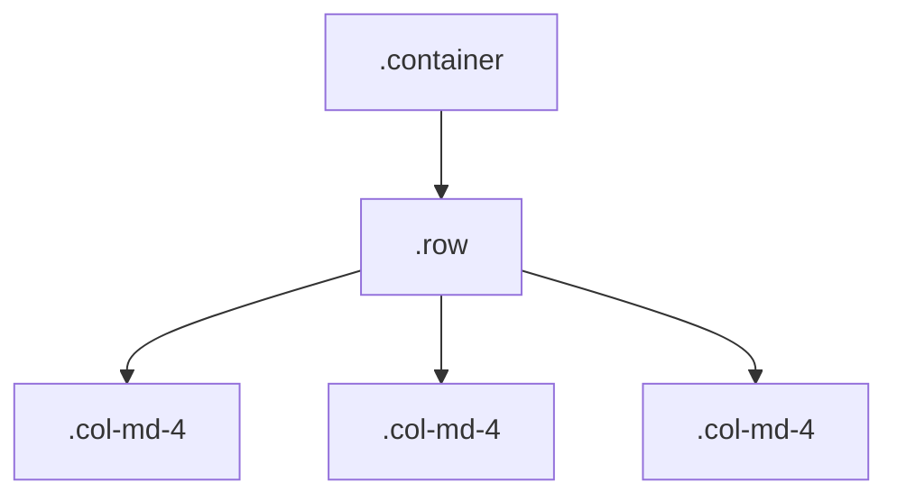
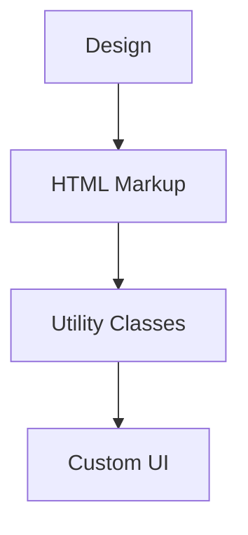

# 25. CSS Frameworks 🧰

CSS frameworks provide pre-written CSS (and often JavaScript) to help you build responsive, consistent, and attractive web interfaces quickly. They offer grid systems, utility classes, and ready-made components, saving time and enforcing best practices.

## Table of Contents
- [[#Why Use a CSS Framework?|Why Use a CSS Framework?]]
- [[#Bootstrap|Bootstrap]]
- [[#Tailwind CSS|Tailwind CSS]]
- [[#Other Popular Frameworks|Other Popular Frameworks]]
- [[#Framework Comparison|Framework Comparison]]
- [[#Best Practices & When to Use|Best Practices & When to Use]]

---

## Why Use a CSS Framework?

> [!abstract] 🚀 **Theory Summary**
> CSS frameworks help you:
> - Build layouts and components faster
> - Ensure cross-browser consistency
> - Follow responsive design best practices
> - Focus on functionality, not just styling

---

## Bootstrap

Bootstrap is the most popular CSS framework. It provides a responsive grid system, pre-built components, and utility classes.

### Key Features
- Mobile-first, responsive grid
- Extensive component library (buttons, navbars, modals, etc.)
- Utility classes for spacing, colors, and more
- Customizable via Sass variables

### Example: Responsive Grid
```html
<!-- preview: true -->
<link rel="stylesheet" href="https://cdn.jsdelivr.net/npm/bootstrap@5.3.0/dist/css/bootstrap.min.css">
<div class="container">
  <div class="row">
    <div class="col-md-4">Column 1</div>
    <div class="col-md-4">Column 2</div>
    <div class="col-md-4">Column 3</div>
  </div>
</div>
```

### Example: Button
```html
<!-- preview: true -->
<button class="btn btn-primary">Primary Button</button>
```

### Mermaid: Bootstrap Grid System


> [!tip] **Bootstrap Pros:**
> - Fast prototyping
> - Large community and documentation
> - Consistent, professional look

---

## Tailwind CSS

Tailwind CSS is a utility-first framework. Instead of pre-built components, it provides low-level utility classes to build custom designs quickly.

### Key Features
- Utility-first: compose styles with classes like `p-4`, `bg-blue-500`, `flex`
- Highly customizable via config file
- Responsive, hover, and dark mode utilities
- Small final CSS size (tree-shaking unused classes)

### Example: Card Component
```html
<!-- preview: true -->
<link href="https://cdn.jsdelivr.net/npm/tailwindcss@2.2.19/dist/tailwind.min.css" rel="stylesheet">
<div class="max-w-sm rounded overflow-hidden shadow-lg bg-white p-4">
  
  <div class="py-4">
    <div class="font-bold text-xl mb-2">Tailwind Card</div>
    <p class="text-gray-700 text-base">A simple card built with Tailwind CSS utility classes.</p>
  </div>
</div>
```

### Example: Button
```html
<!-- preview: true -->
<button class="bg-blue-500 hover:bg-blue-700 text-white font-bold py-2 px-4 rounded">Tailwind Button</button>
```

### Mermaid: Utility-First Workflow


> [!tip] **Tailwind Pros:**
> - Maximum design flexibility
> - Encourages consistency
> - Great for custom UIs and rapid prototyping

---

## Other Popular Frameworks

- **Bulma:** Modern, flexbox-based, easy to use
- **Foundation:** Robust, enterprise-ready, responsive
- **Materialize:** Implements Google Material Design
- **Semantic UI:** Human-friendly class names, lots of components

---

## Framework Comparison

| Framework    | Approach         | Customization | Components | Community |
|--------------|-----------------|--------------|------------|-----------|
| **Bootstrap**| Component-based | High         | Extensive  | Huge      |
| **Tailwind** | Utility-first   | Very High    | Minimal    | Large     |
| **Bulma**    | Component-based | Medium       | Good       | Medium    |
| **Foundation**| Component-based| High         | Good       | Medium    |
| **Materialize**| Material Design| Medium       | Good       | Medium    |

> [!info] **When to Use Which?**
> - **Bootstrap:** For fast, professional, consistent UIs
> - **Tailwind:** For custom designs and utility-driven workflows
> - **Bulma/Foundation:** For modern, flexbox-based layouts
> - **Materialize:** For Material Design look and feel

---

## Best Practices & When to Use

- Use a framework for rapid prototyping or when you need consistency
- Customize frameworks to fit your brand (override variables, use config files)
- Don’t rely solely on frameworks—learn core CSS for full control
- Remove unused CSS for performance (tree-shaking, PurgeCSS)

> [!success] **Best Practice:**
> Use frameworks as a foundation, but don’t be afraid to extend or override them for your project’s unique needs. 


---


---
← [[24. CSS Preprocessors.md|CSS Preprocessors]] [[CSS/Table Of Content|��� Table of Contents]] [[26. Performance Optimization.md|Performance Optimization]] →
