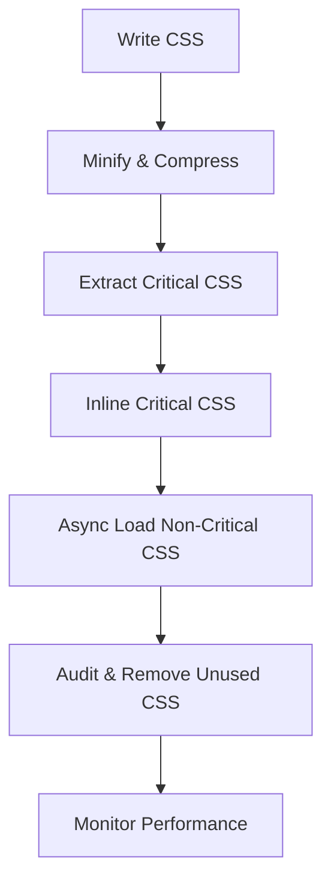

# 26. Performance Optimization ⚡

Optimizing CSS is crucial for fast, responsive, and user-friendly websites. Efficient CSS reduces load times, improves rendering, and enhances the user experience, especially on mobile devices.

## Table of Contents
- [[#Why CSS Performance Matters|Why CSS Performance Matters]]
- [[#Efficient Selectors & Structure|Efficient Selectors & Structure]]
- [[#Minification & Compression|Minification & Compression]]
- [[#Critical CSS & Above-the-Fold|Critical CSS & Above-the-Fold]]
- [[#Modern Loading Techniques|Modern Loading Techniques]]
- [[#Hardware Acceleration & Containment|Hardware Acceleration & Containment]]
- [[#Best Practices & Tools|Best Practices & Tools]]

---

## Why CSS Performance Matters

> [!abstract] 🚀 **Theory Summary**
> - Faster CSS = faster page loads and better SEO
> - Reduces render-blocking and improves Core Web Vitals
> - Essential for mobile and low-bandwidth users

---

## Efficient Selectors & Structure

- Use simple, flat selectors (avoid deep descendant selectors)
- Prefer class selectors over IDs or element selectors for performance
- Avoid universal selectors (`*`) in large codebases
- Group and order CSS logically (see [Idiomatic CSS](https://github.com/necolas/idiomatic-css))

```css
/* Good: Flat, class-based selectors */
.card { margin: 1rem; }
.card-title { font-size: 1.5rem; }

/* Bad: Deep, descendant selectors */
.main .content .section .card .card-title { color: #333; }
```

> [!tip] **Selector Performance:**
> Browsers read selectors right-to-left. Overly specific or deep selectors slow down rendering.

---

## Minification & Compression

- Minify CSS to remove whitespace, comments, and unnecessary characters
- Use tools like [cssnano](https://cssnano.co/), [CleanCSS](https://www.cleancss.com/), or build tool plugins
- Enable Gzip or Brotli compression on your server

```css
/* Before minification */
.button {
  background: #3498db;
  color: white;
  padding: 1rem;
}

/* After minification */
.button{background:#3498db;color:#fff;padding:1rem}
```

---

## Critical CSS & Above-the-Fold

- Extract and inline only the CSS needed for above-the-fold content
- Load non-critical CSS asynchronously (e.g., `media="print" onload="this.media='all'"`)
- Tools: [Critical](https://github.com/addyosmani/critical), [Penthouse](https://github.com/pocketjoso/penthouse)

```html
<!-- preview: true -->
<style>
  /* Critical CSS for above-the-fold */
  body { font-family: sans-serif; }
  .hero { background: #f5f5f5; padding: 2rem; }
</style>
<link rel="stylesheet" href="styles.css" media="print" onload="this.media='all'">
```

> [!tip] **Critical CSS:**
> Inlining critical CSS reduces render-blocking and speeds up first paint.

---

## Modern Loading Techniques

- Use `content-visibility: auto;` to skip rendering offscreen content
- Use `loading="lazy"` for images
- Split CSS by route/page for large apps (code splitting)
- Use `@import` only in build tools, not in production CSS

```css
/* Only render visible content */
.card-list {
  content-visibility: auto;
  contain-intrinsic-size: 300px;
}
```

---

## Hardware Acceleration & Containment

- Use `will-change` to hint at animations (sparingly)
- Use `transform: translateZ(0);` to trigger GPU acceleration
- Use `contain: layout style paint;` for isolated components

```css
.animated {
  will-change: transform, opacity;
  transition: transform 0.3s, opacity 0.3s;
}

.card {
  contain: layout style paint;
}
```

---

## Best Practices & Tools

| Practice                | Tool/Technique                |
|-------------------------|-------------------------------|
| Minification            | cssnano, CleanCSS             |
| Critical CSS Extraction | Critical, Penthouse           |
| Linting                 | Stylelint, CSS Lint           |
| Unused CSS Removal      | PurgeCSS, UnCSS               |
| Compression             | Gzip, Brotli                  |
| Code Splitting          | Webpack, Vite, Parcel         |

> [!success] **Best Practice:**
> Regularly audit your CSS with browser DevTools and remove unused styles for optimal performance.

---

## Mermaid: CSS Loading & Optimization Flow



---


---
← [[25. CSS Frameworks.md|CSS Frameworks]] [[CSS/Table Of Content|��� Table of Contents]] [[27. Form Styling.md|Form Styling]] →
