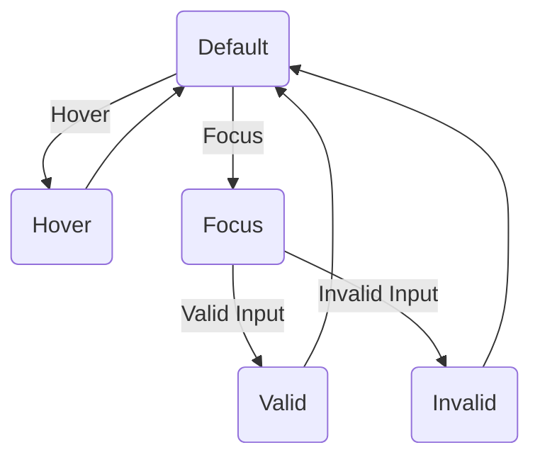

# 27. Form Styling 📝

Styling forms is a fundamental aspect of web design that directly impacts user experience. Well-designed forms are intuitive, accessible, and visually appealing, encouraging users to complete them successfully. This chapter covers everything from basic input styling to advanced custom controls and validation.

## Table of Contents
-   [[#Why Form Styling Matters|Why Form Styling Matters]]
-   [[#Basic Input Styling|Basic Input Styling]]
    -   [[#Text Inputs & Textareas|Text Inputs & Textareas]]
    -   [[#Focus States (`:focus`, `:focus-within`, `:focus-visible`)|Focus States]]
    -   [[#Placeholder Styling (`::placeholder`)|Placeholder Styling]]
-   [[#Advanced Custom Controls|Advanced Custom Controls]]
    -   [[#Custom Checkboxes & Radio Buttons|Custom Checkboxes & Radio Buttons]]
    -   [[#Styling Range Sliders|Styling Range Sliders]]
    -   [[#Styling File Upload Buttons|Styling File Upload Buttons]]
-   [[#Form Validation Styling|Form Validation Styling]]
    -   [[#Using `:valid` and `:invalid`|Using `:valid` and `:invalid`]]
-   [[#Modern Form Properties (2025)|Modern Form Properties (2025)]]
    -   [[#The `accent-color` Property|The `accent-color` Property]]
-   [[#Form Layout & Best Practices|Form Layout & Best Practices]]
-   [[#Mermaid: Input State Flow|Mermaid: Input State Flow]]

---

## Why Form Styling Matters

> [!abstract] 🚀 **Theory Summary**
> - **Usability:** Clear, well-styled forms are easier to use, reducing user frustration.
> - **Conversion:** Good form design can significantly increase completion rates.
> - **Accessibility:** Proper styling (especially focus states) is crucial for users with disabilities.
> - **Brand Consistency:** Forms should match the look and feel of your site.

---

## Basic Input Styling

### Text Inputs & Textareas

The foundation of form styling starts with text fields.

```html
<!-- preview: true -->
<style>
.form-input {
  width: 100%;
  padding: 10px;
  border: 2px solid #ccc;
  border-radius: 6px;
  font-size: 1rem;
  transition: border-color 0.3s;
}
textarea.form-input {
  min-height: 100px;
  resize: vertical;
}
</style>
<input type="text" class="form-input" placeholder="Your Name">
<br/><br/>
<textarea class="form-input" placeholder="Your Message"></textarea>
```

### Focus States (`:focus`, `:focus-within`, `:focus-visible`)

Clear focus styles are essential for accessibility.

-   `:focus`: Applies when an element has focus.
-   `:focus-within`: Applies to a container when any element inside it has focus.
-   `:focus-visible`: A modern pseudo-class that only shows focus rings for keyboard users, not mouse clicks.

```html
<!-- preview: true -->
<style>
.input-group {
  border: 2px solid transparent;
  padding: 5px;
  border-radius: 8px;
  transition: all 0.3s;
}
.input-group:focus-within {
  border-color: #3498db;
  background: #f0f8ff;
}
.form-input-focus:focus-visible {
  outline: 3px solid #3498db;
  outline-offset: 2px;
  border-color: transparent;
}
</style>
<div class="input-group">
  <label for="name">Name:</label>
  <input type="text" id="name" class="form-input-focus" placeholder="Focus with keyboard">
</div>
```

### Placeholder Styling (`::placeholder`)

```html
<!-- preview: true -->
<style>
.form-input-placeholder::placeholder {
  color: #95a5a6;
  font-style: italic;
}
</style>
<input type="text" class="form-input-placeholder" placeholder="This placeholder is styled...">
```

---

## Advanced Custom Controls

### Custom Checkboxes & Radio Buttons

Styling native checkboxes and radios is difficult, so the common pattern is to hide the default input and style a pseudo-element.

```html
<!-- preview: true -->
<style>
.custom-checkbox {
  display: block;
  position: relative;
  padding-left: 35px;
  cursor: pointer;
  -webkit-user-select: none; user-select: none;
}
.custom-checkbox input { /* Hide the browser's default checkbox */
  position: absolute;
  opacity: 0;
  cursor: pointer;
  height: 0;
  width: 0;
}
.checkmark { /* Create a custom checkbox */
  position: absolute;
  top: 0;
  left: 0;
  height: 25px;
  width: 25px;
  background-color: #eee;
  border: 1px solid #ccc;
  border-radius: 4px;
  transition: background-color 0.2s;
}
.custom-checkbox:hover input ~ .checkmark { background-color: #ccc; }
.custom-checkbox input:checked ~ .checkmark { background-color: #2196F3; }
.checkmark:after { /* Create the checkmark/indicator (hidden when not checked) */
  content: "";
  position: absolute;
  display: none;
}
.custom-checkbox input:checked ~ .checkmark:after { display: block; }
.custom-checkbox .checkmark:after { /* Style the checkmark */
  left: 9px;
  top: 5px;
  width: 5px;
  height: 10px;
  border: solid white;
  border-width: 0 3px 3px 0;
  transform: rotate(45deg);
}
</style>
<label class="custom-checkbox">Check me
  <input type="checkbox" checked="checked">
  <span class="checkmark"></span>
</label>
```

### Styling Range Sliders

You can style the track and thumb of a range input using vendor-prefixed pseudo-elements.

```html
<!-- preview: true -->
<style>
.slider {
  -webkit-appearance: none;
  width: 100%;
  height: 10px;
  border-radius: 5px;
  background: #d3d3d3;
  outline: none;
}
.slider::-webkit-slider-thumb {
  -webkit-appearance: none;
  appearance: none;
  width: 25px;
  height: 25px;
  border-radius: 50%;
  background: #4CAF50;
  cursor: pointer;
}
.slider::-moz-range-thumb {
  width: 25px;
  height: 25px;
  border-radius: 50%;
  background: #4CAF50;
  cursor: pointer;
}
</style>
<input type="range" min="1" max="100" value="50" class="slider">
```

### Styling File Upload Buttons

File inputs are notoriously tricky. The best approach is to hide the input and style a `<label>` linked to it.

```html
<!-- preview: true -->
<style>
.file-upload-input {
  display: none; /* Hide the actual input */
}
.file-upload-label {
  background-color: #3498db;
  color: white;
  padding: 10px 15px;
  border-radius: 5px;
  cursor: pointer;
  display: inline-block;
}
.file-upload-label:hover {
  background-color: #2980b9;
}
</style>
<input type="file" id="file-upload" class="file-upload-input">
<label for="file-upload" class="file-upload-label">
  📁 Choose a File...
</label>
```

---

## Form Validation Styling

Use CSS pseudo-classes to provide instant feedback to users.

### Using `:valid` and `:invalid`

```html
<!-- preview: true -->
<style>
.validation-input { border: 2px solid #ccc; padding: 8px; border-radius: 4px; }
.validation-input:invalid {
  border-color: #e74c3c; /* Red for invalid */
  box-shadow: 0 0 5px rgba(231, 76, 60, 0.5);
}
.validation-input:valid {
  border-color: #2ecc71; /* Green for valid */
}
</style>
<input type="email" class="validation-input" placeholder="Enter a valid email" required>
```

---

## Modern Form Properties (2025)

### The `accent-color` Property

Easily change the color of native form controls like checkboxes, radios, and range inputs.

```html
<!-- preview: true -->
<style>
.accented-form {
  accent-color: #e74c3c;
}
</style>
<form class="accented-form">
  <input type="checkbox" checked> Checkbox <br>
  <input type="radio" checked name="r"> Radio <br>
  <input type="range"> Range <br>
</form>
```

> [!note] **Other Modern Features**
> - **`field-sizing`**: Allows textareas to grow automatically as the user types.

---

## Form Layout & Best Practices

Use Flexbox or Grid for clean, responsive form layouts. Always associate labels with inputs using `for` and `id`.

```html
<!-- preview: true -->
<style>
.form-row {
  display: flex;
  flex-wrap: wrap;
  align-items: center;
  margin-bottom: 1rem;
}
.form-row label {
  flex: 1 0 120px; /* Label takes up 120px */
  margin-right: 1rem;
}
.form-row input {
  flex: 2 1 200px; /* Input takes up remaining space */
}
</style>
<form>
  <div class="form-row">
    <label for="username">Username</label>
    <input type="text" id="username" required>
  </div>
  <div class="form-row">
    <label for="password">Password</label>
    <input type="password" id="password" required>
  </div>
</form>
```

---

## Mermaid: Input State Flow

This diagram illustrates the common states of a form input.




---


---
← [[26. Performance Optimization.md|Performance Optimization]] [[CSS/Table Of Content|��� Table of Contents]] [[28. CSS Accessibility (A11y).md|CSS Accessibility (A11y)]] →
