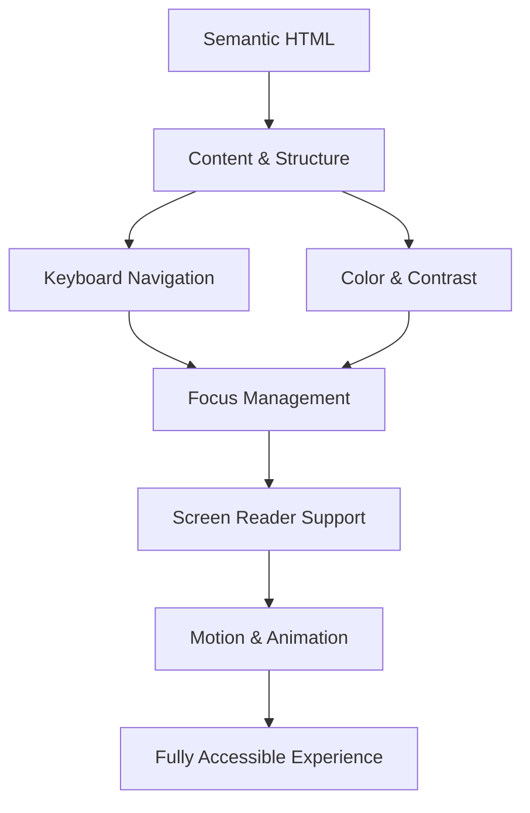

# 28. CSS Accessibility (A11y) ♿

Web accessibility (often abbreviated as **a11y**) ensures that websites are usable by everyone, regardless of disability, device, or connection speed. CSS plays a critical role in creating an accessible web by managing focus, color contrast, and motion.

## Table of Contents
-   [[#Why CSS Accessibility Matters|Why CSS Accessibility Matters]]
-   [[#Focus Management|Focus Management]]
    -   [[#Styling Visible Focus Indicators (`:focus`, `:focus-visible`)|Styling Visible Focus Indicators]]
    -   [[#Creating Skip Links|Creating Skip Links]]
-   [[#Screen Reader Support|Screen Reader Support]]
    -   [[#Visually Hiding Content (`.sr-only`)|Visually Hiding Content]]
    -   [[#Using ARIA Attributes with CSS|Using ARIA Attributes with CSS]]
-   [[#Color Contrast|Color Contrast]]
    -   [[#WCAG Compliance|WCAG Compliance]]
    -   [[#High Contrast Mode (`forced-colors`)|High Contrast Mode]]
-   [[#Motion Accessibility|Motion Accessibility]]
    -   [[#`prefers-reduced-motion`|`prefers-reduced-motion`]]
-   [[#Best Practices & Checklist|Best Practices & Checklist]]
-   [[#Mermaid: Accessibility Layers|Mermaid: Accessibility Layers]]

---

## Why CSS Accessibility Matters

> [!abstract] 🚀 **Theory Summary**
> - **Inclusion:** Makes your site usable for people with visual, motor, auditory, and cognitive disabilities.
> - **Legal Compliance:** Many regions have legal requirements for web accessibility (e.g., ADA, EAA).
> - **SEO & UX:** Accessible sites often have better SEO and provide a better experience for all users.

---

## Focus Management

### Styling Visible Focus Indicators (`:focus`, `:focus-visible`)

Never remove focus outlines without providing an alternative. A clear, visible focus indicator is crucial for keyboard navigation.

```html
<!-- preview: true -->
<style>
a:focus-visible, button:focus-visible {
  outline: 3px solid #3498db;
  outline-offset: 2px;
  background-color: #f0f8ff;
  border-radius: 4px;
}
</style>
<a href="#">Link</a>
<button>Button</button>
```

> [!warning] **Anti-Pattern:**
> Avoid `outline: none;` without a replacement. It makes keyboard navigation impossible.

### Creating Skip Links

Skip links help keyboard users bypass repetitive navigation to get to the main content. They are typically hidden until focused.

```html
<!-- preview: true -->
<style>
.skip-link {
  position: absolute;
  left: -9999px;
  top: auto;
  width: 1px;
  height: 1px;
  overflow: hidden;
  z-index: -999;
}
.skip-link:focus {
  left: 0;
  top: 0;
  width: auto;
  height: auto;
  padding: 10px;
  background-color: #3498db;
  color: white;
  z-index: 1000;
}
</style>
<a href="#main-content" class="skip-link">Skip to Main Content</a>
<header>...</header>
<main id="main-content">Main content starts here.</main>
```

---

## Screen Reader Support

### Visually Hiding Content (`.sr-only`)

Sometimes you need to provide extra context for screen reader users that shouldn't be visible on the screen. The `.sr-only` (screen reader only) class is a standard way to achieve this.

```html
<!-- preview: true -->
<style>
.sr-only {
  position: absolute;
  width: 1px;
  height: 1px;
  padding: 0;
  margin: -1px;
  overflow: hidden;
  clip: rect(0, 0, 0, 0);
  white-space: nowrap;
  border-width: 0;
}
</style>
<button>
  <span aria-hidden="true">❌</span>
  <span class="sr-only">Close</span>
</button>
```

### Using ARIA Attributes with CSS

You can use ARIA states as CSS hooks to style elements.

```html
<!-- preview: true -->
<style>
.accordion-toggle[aria-expanded="true"] {
  background-color: #f0f8ff;
}
.accordion-toggle[aria-expanded="true"]::before {
  content: '− ';
}
.accordion-toggle[aria-expanded="false"]::before {
  content: '+ ';
}
</style>
<button class="accordion-toggle" aria-expanded="true">Section 1</button>
```

---

## Color Contrast

Sufficient contrast between text and its background is vital for users with low vision.

### WCAG Compliance

- **AA Level:** Requires a contrast ratio of at least **4.5:1** for normal text and **3:1** for large text.
- **AAA Level:** Requires **7:1** for normal text and **4.5:1** for large text.

> [!tip] **Tools:**
> Use tools like [WebAIM's Contrast Checker](https://webaim.org/resources/contrastchecker/) or browser DevTools to check ratios.

### High Contrast Mode (`forced-colors`)

The `forced-colors` media query allows you to adapt your styles for users who have enabled a high-contrast mode on their OS.

```css
@media (forced-colors: active) {
  /* Use system colors for high contrast */
  .button {
    border: 2px solid ButtonText;
    background-color: ButtonFace;
    color: ButtonText;
  }
}
```

---

## Motion Accessibility

### `prefers-reduced-motion`

Respect user preferences for reduced motion to prevent discomfort for users with vestibular disorders.

```css
/* Standard animation */
.animated-element {
  transition: transform 0.5s ease-in-out;
}
.animated-element:hover {
  transform: scale(1.1);
}

/* Disable or reduce motion for users who prefer it */
@media (prefers-reduced-motion: reduce) {
  .animated-element {
    transition: opacity 0.3s;
  }
  .animated-element:hover {
    transform: none;
    opacity: 0.8;
  }
}
```

---

## Best Practices & Checklist

-   [ ] **Use semantic HTML:** It provides accessibility for free.
-   [ ] **Ensure visible focus states:** Never remove outlines without a clear alternative.
-   [ ] **Check color contrast:** Meet at least WCAG AA standards.
-   [ ] **Respect reduced motion:** Use the `prefers-reduced-motion` media query.
-   [ ] **Use `alt` text for images:** And an empty `alt=""` for decorative images.
-   [ ] **Label all form controls:** Use `<label for="id">`.

---

## Mermaid: Accessibility Layers

This diagram shows how different layers of accessibility build on each other.




---


---
← [[27. Form Styling.md|Form Styling]] [[CSS/Table Of Content|��� Table of Contents]] [[29. CSS for Print & Multi-Media.md|CSS for Print & Multi-Media]] →
