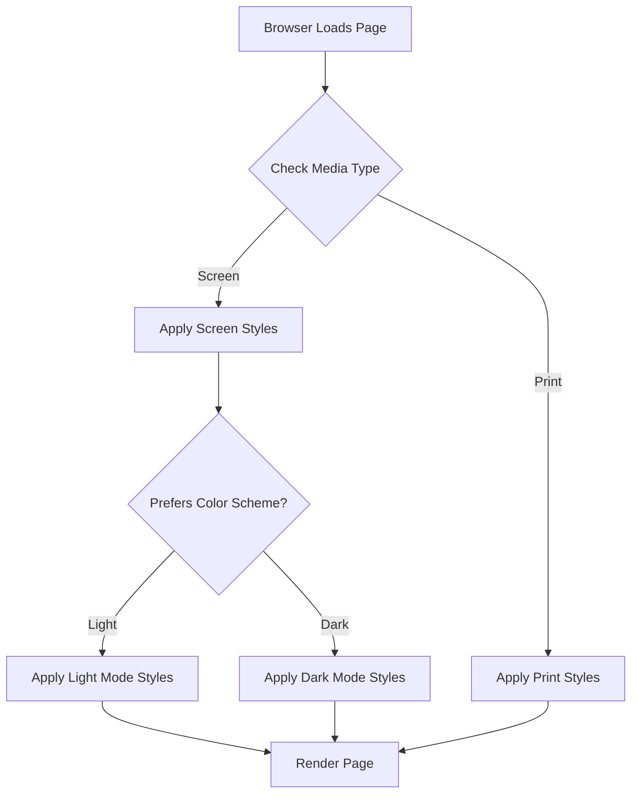

# 29. CSS for Print & Multi-Media 🎨

CSS isn't just for screens. With media queries, you can create tailored experiences for different outputs like print and for user preferences like dark mode. This chapter covers how to create print-friendly stylesheets and implement robust dark mode theming.

## Table of Contents
-   [[#Why Style for Different Media?|Why Style for Different Media?]]
-   [[#Print Stylesheets (`@media print`)|Print Stylesheets]]
    -   [[#Hiding Unnecessary Elements|Hiding Unnecessary Elements]]
    -   [[#Adjusting Typography and Layout|Adjusting Typography and Layout]]
    -   [[#Controlling Page Breaks|Controlling Page Breaks]]
    -   [[#Showing Link URLs|Showing Link URLs]]
-   [[#Dark Mode Support (`prefers-color-scheme`)|Dark Mode Support]]
    -   [[#Basic Dark Mode Theming|Basic Dark Mode Theming]]
    -   [[#Using CSS Variables for Theming|Using CSS Variables for Theming]]
    -   [[#Handling Images in Dark Mode|Handling Images in Dark Mode]]
-   [[#Best Practices|Best Practices]]
-   [[#Mermaid: Media Query Logic|Mermaid: Media Query Logic]]

---

## Why Style for Different Media?

> [!abstract] 🚀 **Theory Summary**
> - **Print:** Provides a clean, readable, and paper-friendly version of your content, saving ink and improving user experience.
> - **Dark Mode:** Respects user's system preferences, reduces eye strain in low-light conditions, and can save battery on OLED screens.
> - **Accessibility:** Adapting to user preferences is a key part of inclusive design.

---

## Print Stylesheets (`@media print`)

The `@media print` query allows you to apply styles specifically when a user prints the page.

### Hiding Unnecessary Elements

Hide navigation, footers, ads, and interactive elements to save ink and focus on content.

```css
@media print {
  nav, footer, aside, .no-print {
    display: none;
  }
}
```

### Adjusting Typography and Layout

Use serif fonts for readability and ensure the layout fits standard paper sizes.

```css
@media print {
  body {
    font-family: 'Georgia', serif;
    font-size: 12pt;
    color: #000;
  }
  .main-content {
    width: 100%;
    margin: 0;
    padding: 0;
  }
}
```

### Controlling Page Breaks

Use `page-break-before`, `page-break-after`, and `page-break-inside` to control how content flows across pages.

```css
@media print {
  h2 {
    page-break-before: always; /* Start new sections on a new page */
  }
  figure, blockquote {
    page-break-inside: avoid; /* Prevent images/quotes from splitting across pages */
  }
}
```

### Showing Link URLs

Display the `href` of links so they are useful on paper.

```html
<!-- preview: true -->
<style>
@media print {
  a[href]::after {
    content: " (" attr(href) ")";
    font-size: 9pt;
    color: #555;
  }
}
</style>
<a href="https://example.com">Example Link</a>
<!-- In print, this would look like: Example Link (https://example.com) -->
```

---

## Dark Mode Support (`prefers-color-scheme`)

The `prefers-color-scheme` media query detects if the user has requested a light or dark color theme.

### Basic Dark Mode Theming

```css
body {
  background-color: #fff;
  color: #111;
}

@media (prefers-color-scheme: dark) {
  body {
    background-color: #111;
    color: #eee;
  }
}
```

### Using CSS Variables for Theming

This is the most robust and maintainable way to handle theming.

```html
<!-- preview: true -->
<style>
:root {
  --bg-color: #ffffff;
  --text-color: #222222;
  --link-color: #007bff;
}

@media (prefers-color-scheme: dark) {
  :root {
    --bg-color: #1a1a1a;
    --text-color: #e0e0e0;
    --link-color: #58a6ff;
  }
}

body {
  background-color: var(--bg-color);
  color: var(--text-color);
  font-family: sans-serif;
  padding: 1rem;
}
a {
  color: var(--link-color);
}
</style>
<body>
  <h1>Themed Content</h1>
  <p>This text will adapt to light or dark mode.</p>
  <a href="#">This is a themed link.</a>
</body>
```

### Handling Images in Dark Mode

Use CSS filters to adjust images for dark mode, or use the `<picture>` element to serve different images.

```html
<!-- preview: true -->
<style>
@media (prefers-color-scheme: dark) {
  .themed-image {
    filter: brightness(.8) contrast(1.2);
  }
}
</style>

```

---

## Best Practices

-   **Print:**
    -   Always hide non-essential elements.
    -   Use `pt` or `cm` units for font sizes.
    -   Ensure links are still identifiable and useful.
-   **Dark Mode:**
    -   Use CSS variables for easy management.
    -   Don't use pure black (`#000000`) for backgrounds; a dark gray is often easier on the eyes.
    -   Test your color contrast in both light and dark modes.

---

## Mermaid: Media Query Logic

This diagram shows how the browser applies different styles based on the media context.




---


---
← [[28. CSS Accessibility (A11y).md|CSS Accessibility (A11y)]] [[CSS/Table Of Content|��� Table of Contents]] [[30. CSS Debugging & Development Tools.md|CSS Debugging & Development Tools]] →
