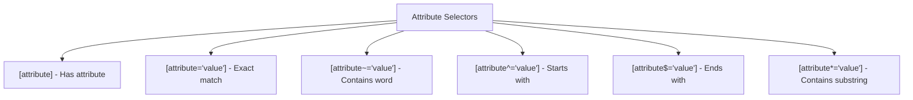
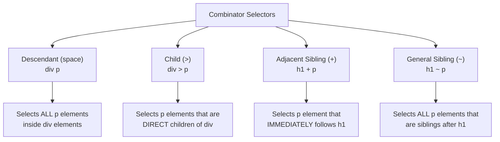

# 3. CSS Selectors Fundamentals 🎯

Selectors are the foundation of CSS - they determine which HTML elements your styles will affect. Mastering selectors is crucial for writing efficient, maintainable CSS.

## Table of Contents

- [[#Basic Selectors|Basic Selectors]]
  - [[#Universal Selector (*)|Universal Selector (*)]]
  - [[#Type/Element Selectors|Type/Element Selectors]]
  - [[#Class Selectors (.className)|Class Selectors (.className)]]
  - [[#ID Selectors (#idName)|ID Selectors (#idName)]]
  - [[#Grouping Selectors|Grouping Selectors]]
- [[#Attribute Selectors|Attribute Selectors]]
- [[#Combinator Selectors|Combinator Selectors]]
- [[#Selector Specificity Quick Reference|Selector Specificity Quick Reference]]

---

## Basic Selectors

### Universal Selector (*)

The universal selector `*` targets **every element** on the page. Use it sparingly as it can impact performance.

> [!info] 💡 **Common Use Cases**
> - Resetting default browser styles
> - Applying box-sizing to all elements
> - Debugging (temporarily adding borders to see layout)

```css
/* Reset all margins and padding */
* {
  margin: 0;
  padding: 0;
  box-sizing: border-box;
}
```

```html
<!-- preview: true -->
<div>This div has no default margin/padding</div>
<p>This paragraph also has no default margin/padding</p>
<style>
* {
  margin: 0;
  padding: 0;
  box-sizing: border-box;
  border: 1px solid #ddd; /* Temporary border to see the effect */
}
</style>
```

### Type/Element Selectors

Type selectors target HTML elements by their tag name.

```css
/* Target all paragraphs */
p {
  color: #333;
  line-height: 1.6;
}

/* Target all headings level 1 */
h1 {
  font-size: 2rem;
  color: #2c3e50;
}

/* Target all images */
img {
  max-width: 100%;
  height: auto;
}
```

```html
<!-- preview: true -->
<h1>This is a Heading</h1>
<p>This is a paragraph with some text content.</p>
<p>This is another paragraph.</p>
<style>
h1 { color: #2c3e50; font-size: 2rem; margin-bottom: 1rem; }
p { color: #333; line-height: 1.6; margin-bottom: 0.5rem; }
</style>
```

### Class Selectors (.className)

Class selectors target elements with a specific `class` attribute. Classes are reusable and can be applied to multiple elements.

> [!success] **Best Practice**
> Use classes for styling that you want to reuse across multiple elements.

```css
/* Target elements with class="highlight" */
.highlight {
  background-color: #fff3cd;
  padding: 0.5rem;
  border-left: 4px solid #ffc107;
}

/* Target elements with class="button" */
.button {
  display: inline-block;
  padding: 10px 20px;
  background-color: #007bff;
  color: white;
  text-decoration: none;
  border-radius: 4px;
}
```

```html
<!-- preview: true -->
<p class="highlight">This paragraph is highlighted!</p>
<p>This paragraph is normal.</p>
<a href="#" class="button">Click Me</a>
<button class="button">Button Element</button>
<style>
.highlight {
  background-color: #fff3cd;
  padding: 0.5rem;
  border-left: 4px solid #ffc107;
  margin: 0.5rem 0;
}
.button {
  display: inline-block;
  padding: 10px 20px;
  background-color: #007bff;
  color: white;
  text-decoration: none;
  border-radius: 4px;
  border: none;
  cursor: pointer;
  margin: 0.25rem;
}
</style>
```

### ID Selectors (#idName)

ID selectors target a single element with a specific `id` attribute. IDs must be unique on a page.

> [!warning] **Important**
> - Each ID should only appear once per page
> - IDs have higher specificity than classes
> - Use IDs for unique elements like main navigation, header, footer

```css
/* Target the element with id="main-header" */
#main-header {
  background-color: #2c3e50;
  color: white;
  padding: 2rem;
  text-align: center;
}

/* Target the element with id="sidebar" */
#sidebar {
  width: 300px;
  background-color: #f8f9fa;
  padding: 1rem;
}
```

```html
<!-- preview: true -->
<header id="main-header">
  <h1>Website Header</h1>
</header>
<div id="sidebar">
  <h3>Sidebar Content</h3>
  <p>This is unique sidebar content.</p>
</div>
<style>
#main-header {
  background-color: #2c3e50;
  color: white;
  padding: 2rem;
  text-align: center;
  margin-bottom: 1rem;
}
#sidebar {
  background-color: #f8f9fa;
  padding: 1rem;
  border: 1px solid #dee2e6;
  border-radius: 4px;
}
</style>
```

### Grouping Selectors

You can apply the same styles to multiple selectors by separating them with commas.

```css
/* Apply the same styles to multiple elements */
h1, h2, h3, h4, h5, h6 {
  font-family: 'Arial', sans-serif;
  font-weight: bold;
  margin-bottom: 1rem;
}

/* Group different selector types */
.error, .warning, #alert {
  padding: 1rem;
  border-radius: 4px;
  margin: 1rem 0;
}
```

```html
<!-- preview: true -->
<h1>Heading 1</h1>
<h2>Heading 2</h2>
<h3>Heading 3</h3>
<p class="error">This is an error message</p>
<p class="warning">This is a warning message</p>
<style>
h1, h2, h3 {
  font-family: 'Arial', sans-serif;
  font-weight: bold;
  margin-bottom: 1rem;
  color: #2c3e50;
}
.error, .warning {
  padding: 1rem;
  border-radius: 4px;
  margin: 1rem 0;
}
.error { background-color: #f8d7da; color: #721c24; }
.warning { background-color: #fff3cd; color: #856404; }
</style>
```

---

## Attribute Selectors

Attribute selectors target elements based on their attributes and attribute values.



### Basic Attribute Selectors

```css
/* Elements that have a 'title' attribute */
[title] {
  border-bottom: 1px dotted #999;
  cursor: help;
}

/* Input elements with type="text" */
[type="text"] {
  border: 2px solid #ddd;
  padding: 0.5rem;
}

/* Links that have a 'download' attribute */
[download] {
  background-color: #28a745;
  color: white;
  padding: 0.25rem 0.5rem;
  text-decoration: none;
}
```

### Advanced Attribute Selectors

```css
/* Class contains the word "button" */
[class~="button"] {
  cursor: pointer;
}

/* href starts with "https://" */
[href^="https://"] {
  color: #28a745;
}

/* href ends with ".pdf" */
[href$=".pdf"]::after {
  content: " 📄";
}

/* alt contains "logo" anywhere */
[alt*="logo"] {
  border: 2px solid #007bff;
}
```

```html
<!-- preview: true -->
<div>
  <input type="text" placeholder="Text input">
  <input type="email" placeholder="Email input">
  <a href="https://example.com" title="External link">Secure Link</a>
  <a href="document.pdf">PDF Document</a>
  
</div>
<style>
[type="text"] {
  border: 2px solid #007bff;
  padding: 0.5rem;
  margin: 0.25rem;
}
[title] {
  border-bottom: 1px dotted #999;
  cursor: help;
}
[href^="https://"] {
  color: #28a745;
  font-weight: bold;
}
[href$=".pdf"]::after {
  content: " 📄";
}
[alt*="logo"] {
  border: 2px solid #007bff;
  border-radius: 4px;
}
</style>
```

---

## Combinator Selectors

Combinators define relationships between elements.



### Descendant Combinator (Space)

Selects elements that are descendants (children, grandchildren, etc.) of another element.

```css
/* All paragraphs inside articles */
article p {
  font-size: 1.1rem;
  line-height: 1.7;
}

/* All links inside navigation */
nav a {
  text-decoration: none;
  color: #333;
}
```

### Child Combinator (>)

Selects elements that are **direct children** of another element.

```css
/* Only direct li children of ul */
ul > li {
  list-style-type: disc;
}

/* Only direct p children of main */
main > p {
  margin-bottom: 2rem;
}
```

### Adjacent Sibling Combinator (+)

Selects an element that **immediately follows** another element.

```css
/* Paragraph immediately after h1 */
h1 + p {
  font-size: 1.2rem;
  font-weight: bold;
  color: #666;
}

/* Image immediately after paragraph */
p + img {
  margin-top: 1rem;
}
```

### General Sibling Combinator (~)

Selects elements that are **siblings** and come after another element.

```css
/* All paragraphs that are siblings after h2 */
h2 ~ p {
  margin-left: 1rem;
}

/* All images that are siblings after h3 */
h3 ~ img {
  width: 100%;
  max-width: 400px;
}
```

```html
<!-- preview: true -->
<article>
  <h1>Article Title</h1>
  <p>This paragraph immediately follows h1 (h1 + p)</p>
  <p>This paragraph is a sibling after h1 (h1 ~ p)</p>
  <div>
    <p>This paragraph is inside a div (article p)</p>
  </div>
  <ul>
    <li>Direct child of ul (ul > li)</li>
    <li>Another direct child</li>
  </ul>
</article>
<style>
article p { color: #333; margin: 0.5rem 0; }
h1 + p { font-weight: bold; color: #007bff; }
h1 ~ p { border-left: 3px solid #ddd; padding-left: 1rem; }
ul > li { color: #28a745; margin: 0.25rem 0; }
</style>
```

---

## Selector Specificity Quick Reference

Understanding specificity helps you predict which styles will be applied when multiple rules target the same element.

| Selector Type | Specificity Weight | Example |
|---------------|-------------------|---------|
| Inline styles | 1000 | `style="color: red;"` |
| IDs | 100 | `#header` |
| Classes, attributes, pseudo-classes | 10 | `.nav`, `[type="text"]`, `:hover` |
| Elements and pseudo-elements | 1 | `div`, `p`, `::before` |
| Universal selector | 0 | `*` |

> [!tip] **Specificity Calculation**
> Count each type and add them up:
> - `#nav .menu li` = 100 + 10 + 1 = 111
> - `.sidebar p.highlight` = 10 + 1 + 10 = 21
> - `div > p` = 1 + 1 = 2

```html
<!-- preview: true -->
<div id="container" class="box">
  <p class="text">This text demonstrates specificity</p>
</div>
<style>
/* Specificity: 1 */
p { color: blue; }

/* Specificity: 10 */
.text { color: green; }

/* Specificity: 100 */
#container p { color: red; }

/* Specificity: 110 - This wins! */
#container .text { color: purple; }
</style>
```

The text will be **purple** because `#container .text` has the highest specificity (110).

---
← [[2. CSS Syntax & Core Concepts.md|CSS Syntax & Core Concepts]] [[CSS/Table Of Content|��� Table of Contents]] [[4. CSS Specificity & Cascade.md|CSS Specificity & Cascade]] →
