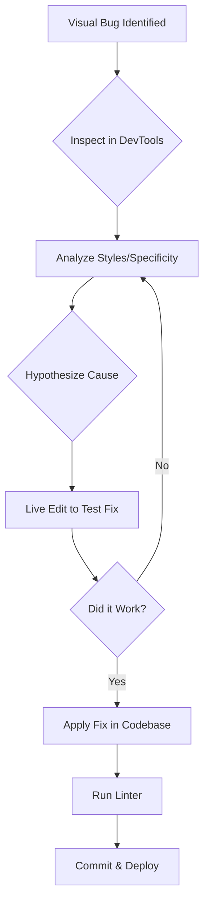

# 30. CSS Debugging & Development Tools 🛠️

Writing CSS is only half the battle; debugging it is the other half. Mastering browser developer tools and adopting effective debugging strategies are essential skills for any web developer. This chapter covers the tools and techniques you need to find and fix CSS issues efficiently.

## Table of Contents
-   [[#Why Debugging Skills Matter|Why Debugging Skills Matter]]
-   [[#Browser Developer Tools|Browser Developer Tools]]
    -   [[#Inspecting Elements & Live Editing|Inspecting Elements & Live Editing]]
    -   [[#Understanding the Box Model & Computed Styles|Understanding the Box Model & Computed Styles]]
-   [[#Common CSS Debugging Strategies|Common CSS Debugging Strategies]]
    -   [[#The `outline` Trick|The `outline` Trick]]
    -   [[#Commenting Out Code|Commenting Out Code]]
    -   [[#Checking Specificity|Checking Specificity]]
-   [[#CSS Linting|CSS Linting]]
    -   [[#What is Linting?|What is Linting?]]
    -   [[#Using Stylelint|Using Stylelint]]
-   [[#Visual Regression Testing|Visual Regression Testing]]
-   [[#Mermaid: The Debugging Workflow|Mermaid: The Debugging Workflow]]

---

## Why Debugging Skills Matter

> [!abstract] 🚀 **Theory Summary**
> - **Efficiency:** Quickly identify and fix visual bugs, saving hours of frustration.
> - **Code Quality:** Write more robust, predictable, and maintainable CSS.
> - **Understanding:** Deepen your knowledge of how CSS works by seeing it in action.

---

## Browser Developer Tools

Browser DevTools (F12 or Ctrl/Cmd+Shift+I) are your most powerful ally for CSS debugging.

### Inspecting Elements & Live Editing

The **Elements** (Chrome) or **Inspector** (Firefox) panel lets you see the HTML structure and the CSS applied to any element. You can edit styles in real-time to test changes without reloading the page.

**How to Use:**
1.  Right-click an element and choose "Inspect".
2.  The **Styles** pane shows all CSS rules affecting the selected element, from most to least specific.
3.  Click on properties or values to change them, or add new ones.
4.  Toggle classes on and off to see their effect.

```html
<!-- preview: true -->
<style>
.debug-box {
  background-color: #3498db;
  color: white;
  padding: 20px;
  border-radius: 8px;
}
.debug-box.highlight {
  background-color: #e74c3c;
}
</style>
<div class="debug-box">
  Right-click and "Inspect" me! Try adding the "highlight" class or changing the padding in the DevTools.
</div>
```

### Understanding the Box Model & Computed Styles

-   **Box Model Viewer:** A visual diagram in the Styles pane showing the `margin`, `border`, `padding`, and `content` size of an element.
-   **Computed Tab:** Shows the final, calculated value for every CSS property on the selected element after all stylesheets have been applied.

---

## Common CSS Debugging Strategies

### The `outline` Trick

When you need to see the boundary of an element without affecting its size or layout, use `outline` instead of `border`.

```css
/* Better than border for debugging */
.element-to-debug {
  outline: 2px solid red;
}

/* You can apply it to everything to see the whole layout */
* {
  outline: 1px solid rgba(255, 0, 0, 0.2);
}
```

### Commenting Out Code

The simplest trick in the book. If you suspect a rule is causing a problem, comment it out to see if the issue resolves.

```css
.card {
  /*
  position: absolute;
  top: -10px;
  left: -10px;
  */
  background: white;
  padding: 1rem;
}
```

### Checking Specificity

If a style isn't applying, it's often a specificity issue. DevTools lists rules in order of specificity, and you can see which ones are being overridden (they appear with a strikethrough).

---

## CSS Linting

### What is Linting?

A linter is a tool that automatically analyzes your code for potential errors, bugs, stylistic inconsistencies, and bad practices.

### Using Stylelint

[Stylelint](https://stylelint.io/) is the industry standard for linting CSS. It's highly configurable and helps enforce consistency across projects.

**Example `stylelint.config.js`:**
```javascript
module.exports = {
  extends: ['stylelint-config-standard'],
  rules: {
    'color-no-invalid-hex': true,
    'at-rule-no-unknown': [true, {
      ignoreAtRules: ['tailwind', 'apply', 'variants', 'responsive', 'screen'],
    }],
    'declaration-block-trailing-semicolon': 'always',
  },
};
```

**Code that would trigger an error:**
```css
/* stylelint-disable-next-line color-no-invalid-hex */
.error {
  color: #12345; /* Invalid hex code */
}
```

---

## Visual Regression Testing

This is an advanced technique where you automatically compare screenshots of your UI before and after a code change to catch unintended visual bugs.

> [!tip] **Tools:**
> Popular visual regression testing tools include **Percy**, **Chromatic**, and the open-source **BackstopJS**.

---

## Mermaid: The Debugging Workflow

This diagram illustrates a typical workflow for debugging a CSS issue.




---


---
← [[29. CSS for Print & Multi-Media.md|CSS for Print & Multi-Media]] [[CSS/Table Of Content|��� Table of Contents]] [[31. Experimental CSS Features (2025+).md|Experimental CSS Features (2025+)]] →
