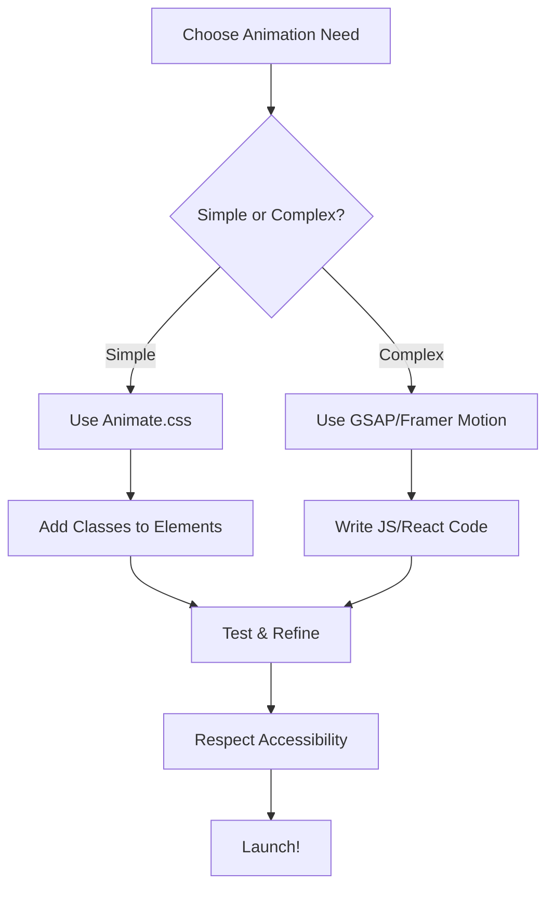

---
tags:
  - css
  - web-development
  - animation
  - libraries
  - frameworks
  - motion-design
  - gsap
  - framer-motion
  - "#css-animations"
date: 2025-07-21
aliases:
  - CSS Animation Libraries
  - Animate.css
  - GSAP
  - Framer Motion
  - Motion Design
---
# 32. CSS Animation Libraries & Frameworks 🎬

CSS animation libraries and frameworks make it easy to add engaging, performant, and accessible motion to your web projects. This chapter explores the most popular tools, their use cases, and best practices for integrating them into modern workflows.

## Table of Contents
-   [[#Why Use Animation Libraries?|Why Use Animation Libraries?]]
-   [[#Animate.css|Animate.css]]
    -   [[#Installation & Usage|Installation & Usage]]
    -   [[#Available Animations|Available Animations]]
    -   [[#Accessibility & prefers-reduced-motion|Accessibility & prefers-reduced-motion]]
-   [[#GSAP (GreenSock Animation Platform)|GSAP (GreenSock Animation Platform)]]
    -   [[#Key Features|Key Features]]
    -   [[#Basic Example|Basic Example]]
-   [[#Framer Motion (React)|Framer Motion (React)]]
    -   [[#Key Features|Key Features]]
    -   [[#Basic Example|Basic Example]]
-   [[#Motion Design Principles|Motion Design Principles]]
-   [[#Best Practices|Best Practices]]
-   [[#Mermaid: Animation Integration Flow|Mermaid: Animation Integration Flow]]

---

## Why Use Animation Libraries?

> [!abstract] 🚀 **Theory Summary**
> - **Productivity:** Pre-built animations save time and reduce code complexity.
> - **Consistency:** Libraries provide standardized, cross-browser animations.
> - **Accessibility:** Many libraries respect user preferences like `prefers-reduced-motion`.
> - **Performance:** Libraries optimize for smooth, jank-free motion.

---

## Animate.css

[Animate.css](https://animate.style/) is a popular, lightweight CSS library with dozens of ready-to-use animations.

### Installation & Usage

**CDN:**
```html
<link rel="stylesheet" href="https://cdnjs.cloudflare.com/ajax/libs/animate.css/4.1.1/animate.min.css" />
```

**Usage:**
```html
<!-- preview: true -->
<h2 class="animate__animated animate__bounce">Bouncy Heading</h2>
<button class="animate__animated animate__fadeInUp">Fade In Button</button>
```

### Available Animations

- Attention Seekers: `bounce`, `flash`, `pulse`, `rubberBand`, `shakeX`, `tada`, `jello`, `heartBeat`
- Entrances/Exits: `fadeIn`, `fadeOut`, `slideInUp`, `slideOutDown`, `zoomIn`, `zoomOut`, `flipInX`, `flipOutY`, etc.
- Many more! See the [full list](https://animate.style/) for details.

### Accessibility & prefers-reduced-motion

Animate.css respects the `prefers-reduced-motion` media query, automatically disabling animations for users who opt out of motion effects.

---

## GSAP (GreenSock Animation Platform)

[GSAP](https://greensock.com/gsap/) is a powerful JavaScript animation library for complex, high-performance animations.

### Key Features
- Timeline-based sequencing
- SVG, CSS, and JavaScript property animation
- Scroll-driven and interactive animations
- Plugins for text, morphing, and more

### Basic Example
```html
<!-- preview: true -->
<script src="https://cdnjs.cloudflare.com/ajax/libs/gsap/3.12.5/gsap.min.js"></script>
<div id="gsap-box" style="width:100px;height:100px;background:#3498db;"></div>
<script>
gsap.to("#gsap-box", { x: 200, rotation: 360, duration: 2, ease: "power2.inOut" });
</script>
```

---

## Framer Motion (React)

[Framer Motion](https://www.framer.com/motion/) is a popular animation library for React, offering declarative, physics-based motion.

### Key Features
- Declarative animation API for React components
- Layout and shared element transitions
- Drag, gesture, and scroll animations
- Orchestration and sequencing

### Basic Example
```jsx
import { motion } from "framer-motion";

export default function Example() {
  return (
    <motion.button
      whileHover={{ scale: 1.1 }}
      whileTap={{ scale: 0.9 }}
      transition={{ type: "spring", stiffness: 300 }}
    >
      Tap Me
    </motion.button>
  );
}
```

---

## Motion Design Principles

- **Easing:** Use natural, non-linear timing functions (e.g., `ease-in-out`, `cubic-bezier`).
- **Duration:** Keep animations short (200–500ms) for snappy UIs.
- **Staging:** Sequence animations for clarity and focus.
- **Purpose:** Use motion to guide, not distract.
- **Accessibility:** Always respect `prefers-reduced-motion`.

---

## Best Practices

- Use libraries for complex or cross-browser animations.
- Avoid animating expensive properties (e.g., `width`, `height`, `top`, `left`). Prefer `transform` and `opacity`.
- Test on multiple devices and with reduced motion enabled.
- Combine CSS and JS animation tools as needed for your stack.

---

## Mermaid: Animation Integration Flow




---


---
← [[31. Experimental CSS Features (2025+).md|Experimental CSS Features (2025+)]] [[CSS/Table Of Content|��� Table of Contents]] [[33. CSS-in-JS & Modern Workflows.md|CSS-in-JS & Modern Workflows]] →
