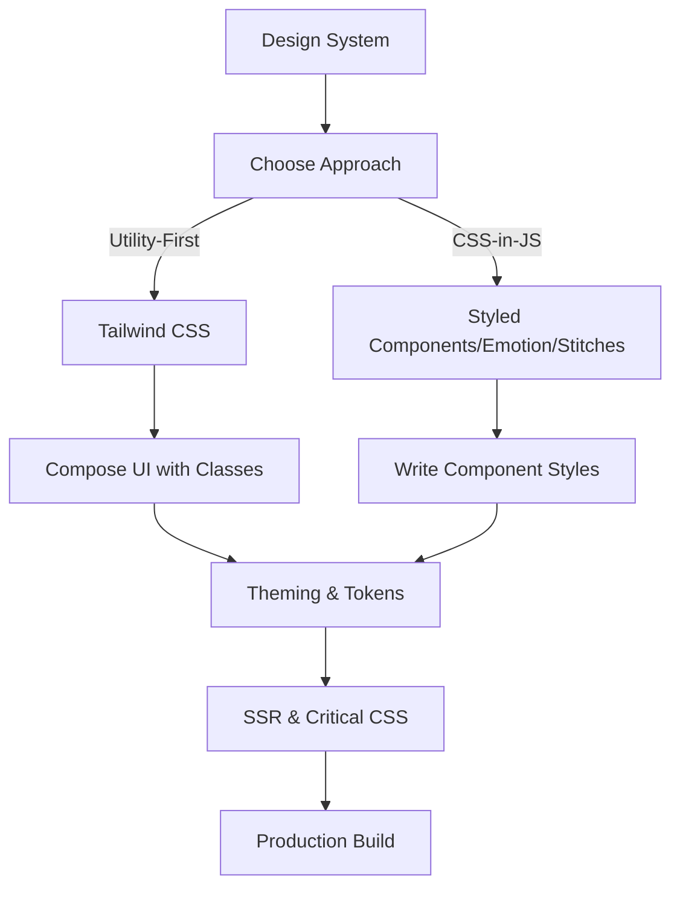

# 33. CSS-in-JS & Modern Workflows ⚛️

Modern frontend development often blends CSS with JavaScript, enabling powerful new workflows for styling, theming, and component-based design. This chapter explores the most popular CSS-in-JS libraries, utility-first frameworks, and how they fit into today’s web development landscape.

## Table of Contents
-   [[#Why CSS-in-JS?|Why CSS-in-JS?]]
-   [[#Popular CSS-in-JS Libraries|Popular CSS-in-JS Libraries]]
    -   [[#Styled Components|Styled Components]]
    -   [[#Emotion|Emotion]]
    -   [[#Stitches|Stitches]]
-   [[#Utility-First CSS: Tailwind CSS|Utility-First CSS: Tailwind CSS]]
-   [[#Modern CSS Workflow Patterns|Modern CSS Workflow Patterns]]
    -   [[#Atomic/Utility CSS|Atomic/Utility CSS]]
    -   [[#Component-Scoped Styles|Component-Scoped Styles]]
    -   [[#Theming & Design Tokens|Theming & Design Tokens]]
    -   [[#Server-Side Rendering (SSR)|Server-Side Rendering (SSR)]]
-   [[#Best Practices|Best Practices]]
-   [[#Mermaid: Modern CSS Workflow|Mermaid: Modern CSS Workflow]]

---

## Why CSS-in-JS?

> [!abstract] 🚀 **Theory Summary**
> - **Componentization:** Co-locate styles with components for better maintainability.
> - **Dynamic Styling:** Use JavaScript logic, props, and state to generate styles.
> - **Theming:** Easily implement dark mode, design tokens, and context-aware styles.
> - **SSR & Critical CSS:** Extract only the styles needed for the initial render.

---

## Popular CSS-in-JS Libraries

### Styled Components

[Styled Components](https://styled-components.com/) lets you write actual CSS in your JavaScript, scoped to individual components.

```jsx
import styled from 'styled-components';

const Button = styled.button`
  background: #3498db;
  color: white;
  padding: 0.75rem 1.5rem;
  border-radius: 6px;
  font-size: 1rem;
  &:hover {
    background: #217dbb;
  }
`;

export default function Example() {
  return <Button>Click Me</Button>;
}
```

### Emotion

[Emotion](https://emotion.sh/) is a performant and flexible CSS-in-JS library with a similar API to Styled Components.

```jsx
/** @jsxImportSource @emotion/react */
import { css } from '@emotion/react';

const style = css`
  color: hotpink;
  font-weight: bold;
`;

export default function Example() {
  return <div css={style}>Emotion Example</div>;
}
```

### Stitches

[Stitches](https://stitches.dev/) is a modern, zero-runtime CSS-in-JS library with theming, variants, and utility support.

```jsx
import { styled } from '@stitches/react';

const Button = styled('button', {
  backgroundColor: 'dodgerblue',
  color: 'white',
  borderRadius: '6px',
  padding: '0.75rem 1.5rem',
  fontSize: '1rem',
  '&:hover': { backgroundColor: 'navy' },
  variants: {
    size: {
      small: { fontSize: '0.8rem' },
      large: { fontSize: '1.2rem' },
    },
  },
});

export default function Example() {
  return <Button size="large">Stitches Button</Button>;
}
```

---

## Utility-First CSS: Tailwind CSS

[Tailwind CSS](https://tailwindcss.com/) is a utility-first framework that lets you compose styles directly in your HTML or JSX using utility classes.

```html
<!-- preview: true -->
<button class="bg-blue-500 hover:bg-blue-700 text-white font-bold py-2 px-4 rounded">
  Tailwind Button
</button>
```

- **Responsive:** Prefix classes with breakpoints (e.g., `md:bg-green-500`).
- **Dark Mode:** Use `dark:` prefix for dark mode styles.
- **PurgeCSS:** Removes unused CSS for tiny production bundles.
- **Design Tokens:** Use CSS variables for theming.

---

## Modern CSS Workflow Patterns

### Atomic/Utility CSS
- Compose UIs from small, single-purpose classes (e.g., Tailwind, Stitches utils).

### Component-Scoped Styles
- Use CSS-in-JS or CSS Modules to scope styles to components.

### Theming & Design Tokens
- Use context, CSS variables, or library theming APIs for dark mode and brand consistency.

### Server-Side Rendering (SSR)
- Extract only the critical CSS for the initial page load (supported by most CSS-in-JS libraries).

---

## Best Practices

- Prefer co-locating styles with components for maintainability.
- Use utility classes for rapid prototyping and consistent spacing.
- Leverage theming APIs for dark mode and design systems.
- Test SSR and hydration for style consistency.
- Avoid global styles unless necessary.

---

## Mermaid: Modern CSS Workflow




---


---
← [[32. CSS Animation Libraries & Frameworks.md|CSS Animation Libraries & Frameworks]] [[CSS/Table Of Content|��� Table of Contents]] [[34. Project-Based Learning.md|Project-Based Learning]] →
