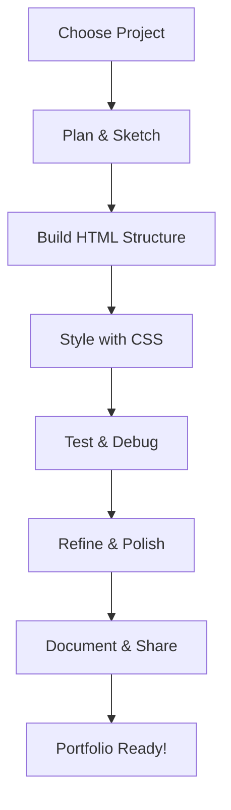

# 34. Project-Based Learning 🏗️

The best way to master CSS is through hands-on projects. This chapter presents a variety of practical CSS projects and real-world application patterns, from simple components to full layouts. Each project reinforces key concepts and helps you build a portfolio of modern, responsive designs.

## Table of Contents
-   [[#Why Project-Based Learning?|Why Project-Based Learning?]]
-   [[#Component Projects|Component Projects]]
    -   [[#Buttons & Toggles|Buttons & Toggles]]
    -   [[#Progress Bars & Loaders|Progress Bars & Loaders]]
    -   [[#Cards & Profile Layouts|Cards & Profile Layouts]]
    -   [[#Navigation Bars & Menus|Navigation Bars & Menus]]
-   [[#Layout Projects|Layout Projects]]
    -   [[#Responsive Grid Gallery|Responsive Grid Gallery]]
    -   [[#Multi-Step Forms|Multi-Step Forms]]
    -   [[#Landing Page|Landing Page]]
-   [[#Animation Projects|Animation Projects]]
    -   [[#Loading Spinners|Loading Spinners]]
    -   [[#Word Carousel|Word Carousel]]
    -   [[#Flashcards|Flashcards]]
-   [[#Best Practices for Project Work|Best Practices for Project Work]]
-   [[#Mermaid: Project Learning Flow|Mermaid: Project Learning Flow]]

---

## Why Project-Based Learning?

> [!abstract] 🚀 **Theory Summary**
> - **Active Learning:** Applying concepts in real projects cements your understanding.
> - **Portfolio Building:** Projects showcase your skills to employers and collaborators.
> - **Problem Solving:** Real-world challenges teach you to debug and adapt.

---

## Component Projects

### Buttons & Toggles
```html
<!-- preview: true -->
<button class="btn">Click Me</button>
<label class="switch">
  <input type="checkbox">
  <span class="slider"></span>
</label>
<style>
.btn {
  background: #3498db;
  color: white;
  border: none;
  border-radius: 6px;
  padding: 0.75rem 1.5rem;
  font-size: 1rem;
  cursor: pointer;
  transition: background 0.2s;
}
.btn:hover { background: #217dbb; }
.switch { position: relative; display: inline-block; width: 50px; height: 24px; }
.switch input { opacity: 0; width: 0; height: 0; }
.slider { position: absolute; cursor: pointer; top: 0; left: 0; right: 0; bottom: 0; background: #ccc; border-radius: 24px; transition: .4s; }
.switch input:checked + .slider { background: #3498db; }
.slider:before { position: absolute; content: ""; height: 18px; width: 18px; left: 3px; bottom: 3px; background: white; border-radius: 50%; transition: .4s; }
.switch input:checked + .slider:before { transform: translateX(26px); }
</style>
```

### Progress Bars & Loaders
```html
<!-- preview: true -->
<div class="progress-bar">
  <div class="progress" style="width: 70%"></div>
</div>
<div class="loader"></div>
<style>
.progress-bar { background: #eee; border-radius: 8px; width: 200px; height: 16px; }
.progress { background: #2ecc71; height: 100%; border-radius: 8px; transition: width 0.4s; }
.loader { border: 4px solid #f3f3f3; border-top: 4px solid #3498db; border-radius: 50%; width: 32px; height: 32px; animation: spin 1s linear infinite; margin-top: 1rem; }
@keyframes spin { 100% { transform: rotate(360deg); } }
</style>
```

### Cards & Profile Layouts
```html
<!-- preview: true -->
<div class="card">
  
  <h3>Jane Doe</h3>
  <p>Web Developer</p>
</div>
<style>
.card { background: #fff; border-radius: 10px; box-shadow: 0 2px 8px rgba(0,0,0,0.08); padding: 1.5rem; text-align: center; width: 200px; }
.avatar { border-radius: 50%; width: 80px; height: 80px; margin-bottom: 1rem; }
</style>
```

### Navigation Bars & Menus
```html
<!-- preview: true -->
<nav class="navbar">
  <a href="#">Home</a>
  <a href="#">About</a>
  <a href="#">Contact</a>
</nav>
<style>
.navbar { display: flex; gap: 1.5rem; background: #222; padding: 1rem; border-radius: 8px; }
.navbar a { color: #fff; text-decoration: none; font-weight: 500; transition: color 0.2s; }
.navbar a:hover { color: #2ecc71; }
</style>
```

---

## Layout Projects

### Responsive Grid Gallery
```html
<!-- preview: true -->
<div class="gallery">
  
  
  
  
</div>
<style>
.gallery { display: grid; grid-template-columns: repeat(auto-fit, minmax(120px, 1fr)); gap: 1rem; }
.gallery img { width: 100%; border-radius: 8px; }
</style>
```

### Multi-Step Forms
```html
<!-- preview: true -->
<form class="multi-step">
  <div class="step active">Step 1: <input type="text" placeholder="Name"></div>
  <div class="step">Step 2: <input type="email" placeholder="Email"></div>
  <div class="step">Step 3: <input type="password" placeholder="Password"></div>
  <button type="button">Next</button>
</form>
<style>
.multi-step { background: #f9f9f9; padding: 2rem; border-radius: 10px; width: 300px; }
.step { display: none; }
.step.active { display: block; }
</style>
```

### Landing Page
```html
<!-- preview: true -->
<section class="landing">
  <h1>Welcome to My Site</h1>
  <p>Modern, responsive, and beautiful.</p>
  <button>Get Started</button>
</section>
<style>
.landing { background: linear-gradient(120deg, #3498db, #2ecc71); color: #fff; padding: 3rem 2rem; border-radius: 16px; text-align: center; }
.landing h1 { font-size: 2.5rem; margin-bottom: 1rem; }
.landing button { background: #fff; color: #3498db; border: none; border-radius: 6px; padding: 0.75rem 1.5rem; font-size: 1rem; cursor: pointer; transition: background 0.2s, color 0.2s; }
.landing button:hover { background: #3498db; color: #fff; }
</style>
```

---

## Animation Projects

### Loading Spinners
```html
<!-- preview: true -->
<div class="loader"></div>
<style>
.loader { border: 4px solid #f3f3f3; border-top: 4px solid #e67e22; border-radius: 50%; width: 40px; height: 40px; animation: spin 1s linear infinite; }
@keyframes spin { 100% { transform: rotate(360deg); } }
</style>
```

### Word Carousel
```html
<!-- preview: true -->
<div class="carousel">
  <span class="word">CSS</span>
  <span class="word">HTML</span>
  <span class="word">JavaScript</span>
</div>
<style>
.carousel { display: flex; gap: 1rem; font-size: 1.5rem; animation: slideWords 3s infinite linear; }
@keyframes slideWords { 0% { gap: 1rem; } 50% { gap: 3rem; } 100% { gap: 1rem; } }
</style>
```

### Flashcards
```html
<!-- preview: true -->
<div class="flashcard">
  <div class="front">Front</div>
  <div class="back">Back</div>
</div>
<style>
.flashcard { width: 120px; height: 80px; perspective: 600px; }
.flashcard > div { width: 100%; height: 100%; position: absolute; backface-visibility: hidden; border-radius: 8px; display: flex; align-items: center; justify-content: center; font-size: 1.2rem; transition: transform 0.6s; }
.flashcard .front { background: #3498db; color: #fff; }
.flashcard .back { background: #2ecc71; color: #fff; transform: rotateY(180deg); }
.flashcard:hover .front { transform: rotateY(180deg); }
.flashcard:hover .back { transform: rotateY(0deg); }
</style>
```

---

## Best Practices for Project Work

- Start simple, then add complexity.
- Use semantic HTML and accessible patterns.
- Test responsiveness and cross-browser compatibility.
- Organize your CSS for maintainability.
- Document your code and reflect on what you learned.

---

## Mermaid: Project Learning Flow




---


---
← [[33. CSS-in-JS & Modern Workflows.md|CSS-in-JS & Modern Workflows]] [[CSS/Table Of Content|��� Table of Contents]] [[35. CSS Code Organization.md|CSS Code Organization]] →
