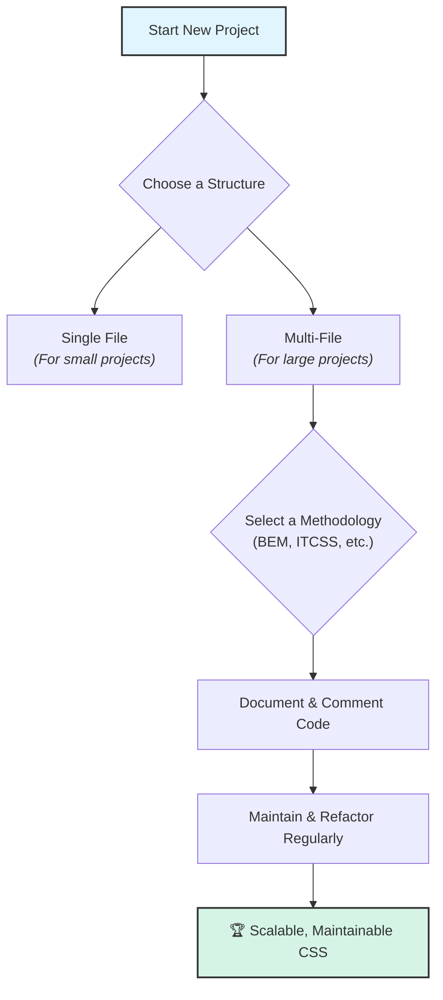

# 35. CSS Code Organization 🗂️

Organizing your CSS codebase is essential for maintainability, scalability, and team collaboration. This chapter covers best practices for structuring files, documenting styles, and maintaining large CSS projects.

## Table of Contents
-   [[#Why Code Organization Matters|Why Code Organization Matters]]
-   [[#File & Folder Structure|File & Folder Structure]]
    -   [[#Single File vs. Multi-File|Single File vs. Multi-File]]
    -   [[#Common Folder Structures|Common Folder Structures]]
    -   [[#Example: BEM + ITCSS|Example: BEM + ITCSS]]
-   [[#Documentation & Comments|Documentation & Comments]]
    -   [[#Section Comments|Section Comments]]
    -   [[#Style Guides & Docs|Style Guides & Docs]]
-   [[#Maintenance & Refactoring|Maintenance & Refactoring]]
    -   [[#Naming Conventions|Naming Conventions]]
    -   [[#Dead Code & Linting|Dead Code & Linting]]
    -   [[#Legacy Code Strategies|Legacy Code Strategies]]
-   [[#Best Practices|Best Practices]]
-   [[#Mermaid: CSS Organization Flow|Mermaid: CSS Organization Flow]]

---

## Why Code Organization Matters

> [!abstract] 🚀 **Theory Summary**
> - **Maintainability:** Well-organized code is easier to read, debug, and update.
> - **Scalability:** Structured CSS scales better as projects grow.
> - **Teamwork:** Consistent organization helps teams collaborate efficiently.

---

## File & Folder Structure

### Single File vs. Multi-File
- **Single File:** Good for small projects or prototypes.
- **Multi-File:** Recommended for larger projects. Split by feature, component, or methodology (e.g., BEM, ITCSS).

### Common Folder Structures

**By Feature/Component:**
```
/css
  /components
    _button.css
    _card.css
  /layouts
    _header.css
    _footer.css
  main.css
```

**By Methodology (ITCSS):**
```
/css
  1-settings.css
  2-tools.css
  3-generic.css
  4-elements.css
  5-objects.css
  6-components.css
  7-utilities.css
```

### Example: BEM + ITCSS
- Use BEM for class naming, ITCSS for file layering.
- Example class: `.card__title--highlighted` in `6-components.css`.

---

## Documentation & Comments

### Section Comments
```css
/* =Components
   --------------------------------------------- */
```
- Use clear section headers for navigation.
- Document complex rules or hacks inline.

### Style Guides & Docs
- Maintain a living style guide (e.g., Storybook, Zeroheight).
- Document design tokens, color palettes, and spacing scales.

---

## Maintenance & Refactoring

### Naming Conventions
- Use BEM, SMACSS, or another methodology for consistency.
- Avoid magic numbers and over-specific selectors.

### Dead Code & Linting
- Regularly remove unused CSS (tools: PurgeCSS, UnCSS).
- Use linters (Stylelint) to enforce standards.

### Legacy Code Strategies
- Refactor incrementally.
- Use utility classes to override legacy styles safely.
- Document legacy patterns for future reference.

---

## Best Practices

- Keep files small and focused.
- Use variables and design tokens for consistency.
- Prefer class selectors over IDs or element selectors.
- Review and refactor regularly.
- Onboard new team members with clear docs.

---

## Mermaid: CSS Organization Flow




---


---
← [[34. Project-Based Learning.md|Project-Based Learning]] [[CSS/Table Of Content|��� Table of Contents]] [[36. CSS Reference & Quick Guides.md|CSS Reference & Quick Guides]] →
