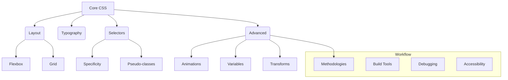

# 36. CSS Reference & Quick Guides 📖

This final chapter serves as a quick reference guide to essential CSS properties, concepts, and resources. Use it as a cheatsheet to speed up your development process and find reliable information when you need it.

## Table of Contents
-   [[#Common Properties Quick Reference|Common Properties Quick Reference]]
    -   [[#Layout & Box Model|Layout & Box Model]]
    -   [[#Typography|Typography]]
    -   [[#Flexbox|Flexbox]]
    -   [[#Grid|Grid]]
    -   [[#Positioning|Positioning]]
-   [[#Browser Compatibility & Resources|Browser Compatibility & Resources]]
    -   [[#Can I Use...|Can I Use...]]
    -   [[#MDN Web Docs|MDN Web Docs]]
    -   [[#Other Learning Platforms & Communities|Other Learning Platforms & Communities]]
-   [[#Core Concepts Cheatsheet|Core Concepts Cheatsheet]]
    -   [[#Selectors & Specificity|Selectors & Specificity]]
    -   [[#CSS Units|CSS Units]]
-   [[#Final Best Practices|Final Best Practices]]
-   [[#Mermaid: The Modern CSS Toolbox|Mermaid: The Modern CSS Toolbox]]

---

## Common Properties Quick Reference

### Layout & Box Model
| Property        | Description                                       |
| --------------- | ------------------------------------------------- |
| `display`       | Sets an element's display type (block, inline, flex, grid) |
| `box-sizing`    | Defines how width/height are calculated       |
| `width`, `height` | Sets the dimensions of an element                 |
| `padding`       | Sets space inside an element                      |
| `margin`        | Sets space outside an element                     |
| `border`        | Sets border properties (width, style, color)      |
| `border-radius` | Creates rounded corners                           |
| `overflow`      | Controls how content overflows its box            |

### Typography
| Property          | Description                                    |
| ----------------- | ---------------------------------------------- |
| `font-family`     | Specifies the font for an element              |
| `font-size`       | Sets the size of the font                      |
| `font-weight`     | Sets the boldness of the font                  |
| `color`           | Sets the color of text                         |
| `text-align`      | Aligns text horizontally                       |
| `line-height`     | Sets the distance between lines of text        |
| `text-decoration` | Adds decorations like underline, overline, etc. |

### Flexbox
| Property         | Description                               |
| ---------------- | ----------------------------------------- |
| `display: flex`  | Enables flex layout                       |
| `flex-direction` | Defines the main axis (row or column)     |
| `justify-content`| Aligns items along the main axis          |
| `align-items`    | Aligns items along the cross axis         |
| `gap`            | Sets the space between flex items         |
| `flex-grow`      | Allows a flex item to grow if needed      |

### Grid
| Property                 | Description                                    |
| ------------------------ | ---------------------------------------------- |
| `display: grid`          | Enables grid layout                            |
| `grid-template-columns`  | Defines the columns of the grid                |
| `grid-template-rows`     | Defines the rows of the grid                   |
| `gap`                    | Sets the space between grid items              |
| `grid-column`, `grid-row`| Places an item in a specific grid location     |

### Positioning
| Property     | Description                                                  |
| ------------ | ------------------------------------------------------------ |
| `position`   | Sets the positioning method (static, relative, absolute, fixed, sticky) |
| `top`, `right`, `bottom`, `left` | Positions the element |
| `z-index`    | Controls the stacking order of positioned elements           |

---

## Browser Compatibility & Resources

### Can I Use...
[**caniuse.com**](https://caniuse.com/) is the definitive resource for checking browser support for any web platform feature.

### MDN Web Docs
The [**MDN Web Docs**](https://developer.mozilla.org/en-US/docs/Web/CSS) are the most comprehensive and reliable source for CSS documentation, tutorials, and guides.

### Other Learning Platforms & Communities
-   **CSS-Tricks:** [css-tricks.com](https://css-tricks.com/) - A blog with articles, guides, and almanacs on all things CSS.
-   **Smashing Magazine:** [smashingmagazine.com](https://www.smashingmagazine.com/) - High-quality articles on web design and development.
-   **freeCodeCamp:** [freecodecamp.org](https://www.freecodecamp.org/) - Interactive tutorials and project-based learning.
-   **CodePen:** [codepen.io](https://codepen.io/) - A social development environment for frontend designers and developers.

---

## Core Concepts Cheatsheet

### Selectors & Specificity
-   **Specificity Hierarchy (Low to High):** Type -> Class -> ID -> Inline Style
-   Use classes for most styling.
-   Avoid `!important` unless absolutely necessary (e.g., utility overrides).
-   Use modern selectors like `:is()`, `:where()`, and `:has()` to simplify complex rules.

### CSS Units
-   **Absolute:** `px` for fixed sizes.
-   **Relative:**
    -   `%` for parent-relative sizing.
    -   `em` for font-size relative sizing.
    -   `rem` for root-element relative sizing (best for consistency).
    -   `vw`, `vh` for viewport-relative sizing.
-   **Functions:** `min()`, `max()`, `clamp()` for fluid sizing.

---

## Final Best Practices

1.  **Use Modern Layouts:** Prefer Flexbox and Grid over floats.
2.  **Be Accessible:** Always consider color contrast, focus states, and reduced motion.
3.  **Organize Your Code:** Use a consistent methodology (BEM, ITCSS) and file structure.
4.  **Stay Updated:** Follow blogs and spec updates to keep your skills sharp.
5.  **Practice:** The best way to learn is by building.

---

## Mermaid: The Modern CSS Toolbox

This diagram provides a high-level overview of the tools and concepts a modern CSS developer uses.

---

---
← [[35. CSS Code Organization.md|CSS Code Organization]] [[CSS/Table Of Content|��� Table of Contents]]
