# 4. CSS Specificity & Cascade 🌊

The **Cascade** and **Specificity** are two fundamental concepts that control how CSS rules are applied to HTML elements. Understanding them is the key to debugging CSS and predicting which styles will appear on your webpage.

## Table of Contents
-   [[#Understanding the Cascade|Understanding the Cascade]]
-   [[#Understanding Specificity|Understanding Specificity]]
-   [[#The Specificity Hierarchy|The Specificity Hierarchy]]
-   [[#Calculating Specificity|Calculating Specificity]]
-   [[#The `!important` Rule|The `!important` Rule]]
-   [[#CSS Inheritance|CSS Inheritance]]

---

## Understanding the Cascade

The "C" in CSS stands for **Cascading**. The cascade is the algorithm that the browser uses to resolve conflicting CSS declarations. If multiple rules target the same element, the cascade determines which one wins and gets applied.

> [!abstract] 🚀 **Theory Summary**
> The cascade considers three factors in this order:
> 1.  **Origin and Importance:** Where the style comes from (author, user, or browser) and whether it has `!important`.
> 2.  **Specificity:** Which selector is more specific.
> 3.  **Source Order:** Which rule appears last in the code.

```mermaid
graph TD
    A[Multiple CSS Rules Target an Element] --> B{Cascade Algorithm};
    B --> C{1. Importance / Origin};
    C --> D{2. Specificity};
    D --> E{3. Source Order};
    E --> F[🏆 Winning Style is Applied];

    subgraph "Cascade Factors"
        C["Origin: Author > User > Browser<br/>Importance: `!important` flips the order"]
        D["More specific selector wins<br/>(e.g., ID > Class > Type)"]
        E["If specificity is equal,<br/>the last rule defined wins"]
    end
```



---

## Understanding Specificity

Specificity is the weight or score that a selector has. When multiple declarations have the same importance, the one with the highest specificity will win.

> [!info] 💡 **Specificity as a Score**
> Think of specificity as a score. The selector with the higher score wins. If the scores are tied, the cascade moves on to source order.

---

## The Specificity Hierarchy

Selectors have different levels of specificity. From highest to lowest:

1.  **Inline Styles:** Styles applied directly to an element using the `style` attribute.
2.  **ID Selectors:** e.g., `#main-content`.
3.  **Class, Pseudo-class, and Attribute Selectors:** e.g., `.my-class`, `:hover`, `[type="submit"]`.
4.  **Type (Element) and Pseudo-element Selectors:** e.g., `p`, `div`, `::before`.

The universal selector (`*`) and combinators (`+`, `>`, `~`, ` `) have **no specificity value**.

### Visualizing the Hierarchy

```html
<!-- preview: true -->
<div id="container" class="box" style="color: purple;">Hello World!</div>

<style>
  /* 4. Type Selector (Lowest Specificity) */
  div { color: blue; }

  /* 3. Class Selector */
  .box { color: green; }

  /* 2. ID Selector */
  #container { color: red; }

  /* 1. Inline Style (Highest Specificity) */
  /* The color will be purple because inline styles win. */
</style>
```

In the example above, the text "Hello World!" will be **purple** because the inline style has the highest specificity, overriding all other rules.

---

## Calculating Specificity

A selector's specificity is often represented as a three-column value: `(IDs, Classes, Types)`.

| Selector Type                       | ID Column | Class Column | Type Column |
| ----------------------------------- | :-------: | :----------: | :---------: |
| ID (`#my-id`)                       |     1     |      0       |      0      |
| Class (`.my-class`)                 |     0     |      1       |      0      |
| Attribute (`[type="text"]`)         |     0     |      1       |      0      |
| Pseudo-class (`:hover`)             |     0     |      1       |      0      |
| Type (`div`)                        |     0     |      0       |      1      |
| Pseudo-element (`::before`)         |     0     |      0       |      1      |

**Comparison works from left to right. A `1` in the ID column will always beat any value in the Class or Type columns.**

### Example Calculation

Let's compare two selectors:
-   `#nav .link`
-   `div #nav a`

**Selector 1: `#nav .link`**
-   IDs: `#nav` -> 1
-   Classes: `.link` -> 1
-   Types: 0
-   **Specificity Score: (1, 1, 0)**

**Selector 2: `div #nav a`**
-   IDs: `#nav` -> 1
-   Classes: 0
-   Types: `div`, `a` -> 2
-   **Specificity Score: (1, 0, 2)**

**Result:** `#nav .link` wins! Even though the second selector has more `Types`, the first selector wins because it has a `1` in the `Class` column while the other has `0`.

```html
<!-- preview: true -->
<div id="nav">
  <a href="#" class="link">Navigation Link</a>
</div>
<style>
/* Selector 1: #nav .link - Specificity (1,1,0) = 110 */
#nav .link {
  color: green;
  font-weight: bold;
}

/* Selector 2: div #nav a - Specificity (1,0,2) = 102 */
div #nav a {
  color: red;
  text-decoration: underline;
}

/* The link will be GREEN because (1,1,0) > (1,0,2) */
</style>
```

### Specificity Calculator Visual

```html
<!-- preview: true -->
<div class="specificity-demo">
  <div class="example-container">
    <h3>Specificity Battle!</h3>
    <div id="demo-element" class="demo-class">
      <p class="demo-text">Watch my color change based on specificity!</p>
    </div>
  </div>
</div>
<style>
.specificity-demo {
  background: #f8f9fa;
  padding: 2rem;
  border-radius: 8px;
  margin: 1rem 0;
}

/* Specificity: (0,0,1) = 1 */
p { color: blue; }

/* Specificity: (0,1,0) = 10 */
.demo-text { color: green; }

/* Specificity: (0,1,1) = 11 */
.demo-class p { color: orange; }

/* Specificity: (1,0,1) = 101 - WINNER! */
#demo-element p { color: purple; font-weight: bold; }

.example-container {
  background: white;
  padding: 1.5rem;
  border-radius: 4px;
  text-align: center;
}
</style>
```

**The text is purple** because `#demo-element p` has the highest specificity (101).

---

## The `!important` Rule

The `!important` rule is an exception that breaks the normal rules of the cascade. When you add `!important` to a CSS declaration, it overrides **any** other declaration, regardless of its origin, specificity, or source order.

**Syntax:**
```css
p {
  color: blue !important; /* This rule will be very hard to override */
}
```

```html
<!-- preview: true -->
<div class="important-demo">
  <div id="important-container" class="important-class">
    <p class="important-text">This text demonstrates !important</p>
  </div>
</div>
<style>
.important-demo {
  background: #f8f9fa;
  padding: 2rem;
  border-radius: 8px;
  margin: 1rem 0;
}

/* Very high specificity: (1,1,1) = 111 */
#important-container .important-class .important-text {
  color: blue;
  font-size: 1.2rem;
}

/* Lower specificity: (0,1,0) = 10, but has !important - WINS! */
.important-text {
  color: red !important;
  font-weight: bold;
}

#important-container {
  background: white;
  padding: 1.5rem;
  border-radius: 4px;
  text-align: center;
}
</style>
```

**The text is red** because `!important` overrides even higher specificity selectors.

> [!danger] **When to Use `!important` (and When Not To)**
> **Almost never.** Using `!important` is generally considered bad practice because it makes debugging difficult and breaks the natural cascade of your stylesheet.
>
> **Acceptable Use Cases:**
> 1.  Overriding styles from a third-party library or framework that you cannot modify directly.
> 2.  In your browser's user stylesheet to personalize your web experience.
> 3.  For utility classes that must always apply a certain style, like a `.hidden` class.
>
> **Example of a utility class:**
> ```css
> .visually-hidden {
>   position: absolute !important;
>   width: 1px !important;
>   height: 1px !important;
>   padding: 0 !important;
>   margin: -1px !important;
>   overflow: hidden !important;
>   clip: rect(0, 0, 0, 0) !important;
>   white-space: nowrap !important;
>   border: 0 !important;
> }
> ```

---

## CSS Inheritance

Some CSS properties, when applied to a parent element, are passed down—or **inherited**—by its child elements.

> [!info] 💡 **Which properties are inherited?**
> Typically, properties related to text and typography are inherited. These include `color`, `font-family`, `font-size`, `font-weight`, `line-height`, and `text-align`.
>
> Properties related to the box model are **not** inherited, such as `width`, `height`, `padding`, `margin`, and `border`.

### Inheritance Example

```html
<!-- preview: true -->
<div class="parent-container">
  <h1>Heading (inherits font and color)</h1>
  <p>This paragraph also inherits the styles from the parent. It has its own border which is not inherited by its children (if it had any).</p>
</div>

<style>
.parent-container {
  font-family: Arial, sans-serif;
  color: #444;
  border: 1px solid black; /* Border is NOT inherited */
  padding: 1rem;           /* Padding is NOT inherited */
}
p {
  border: 1px solid red;
}
</style>
```

### Controlling Inheritance
You can explicitly control inheritance with these three universal property values:
-   `inherit`: Forces an element to inherit a property's value from its parent.
-   `initial`: Resets a property to its default value as defined by the browser.
-   `unset`: Acts as `inherit` if the property is normally inherited, and `initial` if it is not.

```html
<!-- preview: true -->
<div class="inheritance-demo">
  <div class="parent-styles">
    <h3>Parent Container (red text, Arial font)</h3>
    <p class="inherit-example">This paragraph uses "inherit" for color</p>
    <p class="initial-example">This paragraph uses "initial" for color</p>
    <p class="unset-example">This paragraph uses "unset" for color</p>
    <div class="border-example">
      <p>This paragraph shows border inheritance</p>
    </div>
  </div>
</div>
<style>
.inheritance-demo {
  background: #f8f9fa;
  padding: 2rem;
  border-radius: 8px;
  margin: 1rem 0;
}

.parent-styles {
  color: red;
  font-family: Arial, sans-serif;
  font-size: 1.1rem;
  background: white;
  padding: 1.5rem;
  border-radius: 4px;
  border: 3px solid #007bff;
}

.inherit-example {
  color: inherit; /* Inherits red from parent */
  background: #e3f2fd;
  padding: 0.5rem;
  margin: 0.5rem 0;
}

.initial-example {
  color: initial; /* Resets to browser default (usually black) */
  background: #fff3e0;
  padding: 0.5rem;
  margin: 0.5rem 0;
}

.unset-example {
  color: unset; /* Acts as inherit for color (inherited property) */
  background: #f3e5f5;
  padding: 0.5rem;
  margin: 0.5rem 0;
}

.border-example {
  border: inherit; /* Tries to inherit border, but borders don't inherit naturally */
  background: #e8f5e8;
  padding: 0.5rem;
  margin: 0.5rem 0;
}

.border-example p {
  margin: 0;
}
</style>
```

**Notice:**
- **Inherit**: Forces inheritance of parent's red color
- **Initial**: Resets to browser default (black)
- **Unset**: Acts as inherit for color (since color is naturally inherited)
- **Border**: Doesn't inherit naturally, so `border: inherit` has no effect 


---


---
← [[3. CSS Selectors Fundamentals.md|CSS Selectors Fundamentals]] [[CSS/Table Of Content|��� Table of Contents]] [[5. Colors & Backgrounds.md|Colors & Backgrounds]] →
