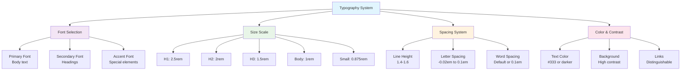

# 6. Typography & Text Styling ✍️

Typography is one of the most important aspects of web design. Good typography enhances readability, establishes hierarchy, and creates visual appeal. This chapter covers all aspects of styling text with CSS.

## Table of Contents

-   [[#Font Properties|Font Properties]]
    -   [[#Font Families and Web-Safe Fonts|Font Families and Web-Safe Fonts]]
    -   [[#Google Fonts Integration|Google Fonts Integration]]
    -   [[#Font Size, Weight, and Style|Font Size, Weight, and Style]]
    -   [[#Line Height and Letter Spacing|Line Height and Letter Spacing]]
-   [[#Text Properties|Text Properties]]
    -   [[#Text Alignment, Decoration, and Transform|Text Alignment, Decoration, and Transform]]
    -   [[#Text Spacing and Indentation|Text Spacing and Indentation]]
    -   [[#Word Break and Text Overflow|Word Break and Text Overflow]]
    -   [[#Text Shadows|Text Shadows]]
-   [[#Typography Best Practices|Typography Best Practices]]
-   [[#Mermaid: Typography Hierarchy|Mermaid: Typography Hierarchy]]

---

## Font Properties

### Font Families and Web-Safe Fonts

The `font-family` property specifies which font to use for text. You can provide multiple fonts as fallbacks.

> [!abstract] 🚀 **Theory Summary**
> Font families are specified in order of preference. If the first font isn't available, the browser tries the next one, and so on. Always end with a generic font family (`serif`, `sans-serif`, `monospace`, `cursive`, `fantasy`).

```css
/* Font stack with fallbacks */
.text-serif {
  font-family: "Times New Roman", Times, serif;
}

.text-sans-serif {
  font-family: "Helvetica Neue", Helvetica, Arial, sans-serif;
}

.text-monospace {
  font-family: "Courier New", Courier, monospace;
}
```

**Web-Safe Font Combinations:**

```html
<!-- preview: true -->
<div class="font-examples">
  <p class="serif-text">This is serif text (Times New Roman, Times, serif)</p>
  <p class="sans-serif-text">This is sans-serif text (Arial, Helvetica, sans-serif)</p>
  <p class="monospace-text">This is monospace text (Courier New, monospace)</p>
  <p class="cursive-text">This is cursive text (cursive)</p>
</div>

<style>
.font-examples p {
  margin: 1rem 0;
  padding: 0.5rem;
  border-left: 4px solid #3498db;
}
.serif-text { font-family: "Times New Roman", Times, serif; }
.sans-serif-text { font-family: Arial, Helvetica, sans-serif; }
.monospace-text { font-family: "Courier New", Courier, monospace; }
.cursive-text { font-family: cursive; }
</style>
```

### Google Fonts Integration

Google Fonts provides a vast library of free, web-optimized fonts.

**Method 1: HTML Link**
```html
<head>
  <link rel="preconnect" href="https://fonts.googleapis.com">
  <link rel="preconnect" href="https://fonts.gstatic.com" crossorigin>
  <link href="https://fonts.googleapis.com/css2?family=Inter:wght@300;400;600;700&display=swap" rel="stylesheet">
</head>
```

**Method 2: CSS Import**
```css
@import url('https://fonts.googleapis.com/css2?family=Inter:wght@300;400;600;700&display=swap');
```

**Usage:**
```css
body {
  font-family: 'Inter', sans-serif;
}
```

> [!tip] **Performance Tip**
> Use `font-display: swap` and preconnect to Google Fonts for better loading performance.

### Font Size, Weight, and Style

#### Font Size
Multiple units available for font sizing:

```css
.font-sizes {
  font-size: 16px;      /* Absolute unit */
  font-size: 1rem;      /* Relative to root font-size */
  font-size: 1.2em;     /* Relative to parent font-size */
  font-size: 120%;      /* Percentage of parent */
  font-size: large;     /* Keyword */
}
```

#### Font Weight
Controls the thickness of characters:

```html
<!-- preview: true -->
<div class="weight-examples">
  <p class="weight-100">Font weight 100 (Thin)</p>
  <p class="weight-300">Font weight 300 (Light)</p>
  <p class="weight-400">Font weight 400 (Normal)</p>
  <p class="weight-600">Font weight 600 (Semi-bold)</p>
  <p class="weight-700">Font weight 700 (Bold)</p>
  <p class="weight-900">Font weight 900 (Black)</p>
</div>

<style>
.weight-examples p { margin: 0.5rem 0; }
.weight-100 { font-weight: 100; }
.weight-300 { font-weight: 300; }
.weight-400 { font-weight: 400; }
.weight-600 { font-weight: 600; }
.weight-700 { font-weight: 700; }
.weight-900 { font-weight: 900; }
</style>
```

#### Font Style
```css
.font-styles {
  font-style: normal;   /* Default */
  font-style: italic;   /* Slanted */
  font-style: oblique;  /* Artificially slanted */
}
```

### Line Height and Letter Spacing

#### Line Height
Controls the space between lines of text:

```html
<!-- preview: true -->
<div class="line-height-examples">
  <p class="tight">Line height 1.2: Lorem ipsum dolor sit amet, consectetur adipiscing elit. Sed do eiusmod tempor incididunt ut labore et dolore magna aliqua.</p>
  <p class="normal">Line height 1.5: Lorem ipsum dolor sit amet, consectetur adipiscing elit. Sed do eiusmod tempor incididunt ut labore et dolore magna aliqua.</p>
  <p class="loose">Line height 2.0: Lorem ipsum dolor sit amet, consectetur adipiscing elit. Sed do eiusmod tempor incididunt ut labore et dolore magna aliqua.</p>
</div>

<style>
.line-height-examples p {
  margin: 1rem 0;
  padding: 0.5rem;
  background: #f8f9fa;
  border-radius: 4px;
}
.tight { line-height: 1.2; }
.normal { line-height: 1.5; }
.loose { line-height: 2.0; }
</style>
```

#### Letter Spacing
Controls space between characters:

```html
<!-- preview: true -->
<div class="letter-spacing-examples">
  <p class="tight-letters">Tight letter spacing (-0.5px)</p>
  <p class="normal-letters">Normal letter spacing (0)</p>
  <p class="loose-letters">Loose letter spacing (2px)</p>
</div>

<style>
.letter-spacing-examples p {
  margin: 1rem 0;
  font-size: 1.1rem;
}
.tight-letters { letter-spacing: -0.5px; }
.normal-letters { letter-spacing: 0; }
.loose-letters { letter-spacing: 2px; }
</style>
```

---

## Text Properties

### Text Alignment, Decoration, and Transform

#### Text Alignment
```html
<!-- preview: true -->
<div class="text-align-examples">
  <p class="left">Left aligned text</p>
  <p class="center">Center aligned text</p>
  <p class="right">Right aligned text</p>
  <p class="justify">Justified text: Lorem ipsum dolor sit amet, consectetur adipiscing elit. Sed do eiusmod tempor incididunt ut labore et dolore magna aliqua. Ut enim ad minim veniam.</p>
</div>

<style>
.text-align-examples p {
  margin: 0.5rem 0;
  padding: 0.5rem;
  background: #e9ecef;
  border-radius: 4px;
}
.left { text-align: left; }
.center { text-align: center; }
.right { text-align: right; }
.justify { text-align: justify; }
</style>
```

#### Text Decoration
```html
<!-- preview: true -->
<div class="text-decoration-examples">
  <p class="underline">Underlined text</p>
  <p class="overline">Overlined text</p>
  <p class="line-through">Strikethrough text</p>
  <p class="no-decoration">No decoration (removes default link underline)</p>
</div>

<style>
.text-decoration-examples p { margin: 0.5rem 0; }
.underline { text-decoration: underline; }
.overline { text-decoration: overline; }
.line-through { text-decoration: line-through; }
.no-decoration { text-decoration: none; }
</style>
```

#### Text Transform
```html
<!-- preview: true -->
<div class="text-transform-examples">
  <p class="uppercase">uppercase text transformation</p>
  <p class="lowercase">LOWERCASE TEXT TRANSFORMATION</p>
  <p class="capitalize">capitalize each word</p>
</div>

<style>
.text-transform-examples p { margin: 0.5rem 0; }
.uppercase { text-transform: uppercase; }
.lowercase { text-transform: lowercase; }
.capitalize { text-transform: capitalize; }
</style>
```

### Text Spacing and Indentation

#### Text Indent
```css
.paragraph-indent {
  text-indent: 2em; /* First line indentation */
}
```

#### Word Spacing
```css
.word-spacing {
  word-spacing: 0.3em; /* Space between words */
}
```

### Word Break and Text Overflow

#### Word Break
```html
<!-- preview: true -->
<div class="word-break-examples">
  <div class="break-all">
    <strong>break-all:</strong> ThisIsAVeryLongWordThatWouldNormallyOverflowTheContainer
  </div>
  <div class="break-word">
    <strong>break-word:</strong> ThisIsAVeryLongWordThatWouldNormallyOverflowTheContainer
  </div>
</div>

<style>
.word-break-examples div {
  width: 200px;
  margin: 1rem 0;
  padding: 0.5rem;
  border: 1px solid #ddd;
  border-radius: 4px;
}
.break-all { word-break: break-all; }
.break-word { overflow-wrap: break-word; }
</style>
```

#### Text Overflow
```html
<!-- preview: true -->
<div class="text-overflow-examples">
  <div class="ellipsis">
    This is a very long text that will be truncated with ellipsis
  </div>
  <div class="clip">
    This is a very long text that will be clipped
  </div>
</div>

<style>
.text-overflow-examples div {
  width: 200px;
  margin: 1rem 0;
  padding: 0.5rem;
  border: 1px solid #ddd;
  border-radius: 4px;
  white-space: nowrap;
  overflow: hidden;
}
.ellipsis { text-overflow: ellipsis; }
.clip { text-overflow: clip; }
</style>
```

### Text Shadows

Text shadows add depth and visual interest to text:

```html
<!-- preview: true -->
<div class="text-shadow-examples">
  <h2 class="simple-shadow">Simple Shadow</h2>
  <h2 class="glow-effect">Glow Effect</h2>
  <h2 class="multiple-shadows">Multiple Shadows</h2>
  <h2 class="embossed">Embossed Text</h2>
</div>

<style>
.text-shadow-examples h2 {
  margin: 1rem 0;
  font-size: 2rem;
  text-align: center;
}
.simple-shadow {
  text-shadow: 2px 2px 4px rgba(0,0,0,0.3);
}
.glow-effect {
  color: #fff;
  background: #333;
  padding: 1rem;
  text-shadow: 0 0 10px #00ff00, 0 0 20px #00ff00;
}
.multiple-shadows {
  text-shadow: 
    1px 1px 0px #ccc,
    2px 2px 0px #c9c9c9,
    3px 3px 0px #bbb,
    4px 4px 0px #b9b9b9,
    5px 5px 0px #aaa;
}
.embossed {
  color: #666;
  background: #f0f0f0;
  padding: 1rem;
  text-shadow: 1px 1px 0px #fff, -1px -1px 0px #333;
}
</style>
```

---

## Typography Best Practices

> [!success] **Typography Guidelines**
> 
> **📏 Sizing & Spacing:**
> - Use relative units (`rem`, `em`) for scalability
> - Maintain consistent vertical rhythm
> - Line height should be 1.4-1.6 for body text
> 
> **🎨 Font Selection:**
> - Limit to 2-3 font families maximum
> - Ensure good contrast ratios (4.5:1 minimum)
> - Test fonts across different devices and browsers
> 
> **📱 Responsive Typography:**
> - Use `clamp()` for fluid typography
> - Consider reading distance on different devices
> - Test readability at various screen sizes

**Fluid Typography Example:**
```css
.fluid-text {
  font-size: clamp(1rem, 2.5vw, 2rem);
  line-height: clamp(1.4, 1.5, 1.6);
}
```

---

## Mermaid: Typography Hierarchy



This comprehensive typography guide covers all essential aspects of text styling in CSS, from basic font properties to advanced text effects and best practices for readable, accessible typography.


---


---
← [[5. Colors & Backgrounds.md|Colors & Backgrounds]] [[CSS/Table Of Content|��� Table of Contents]] [[7. CSS Box Model.md|CSS Box Model]] →
