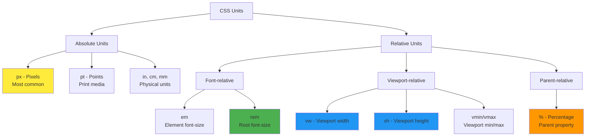

# 8. CSS Units & Sizing 📏

Understanding CSS units is crucial for creating responsive, scalable designs. This chapter covers all types of CSS units, when to use them, and how they affect your layouts.

## Table of Contents

-   [[#Absolute Units|Absolute Units]]
    -   [[#Pixels (px)|Pixels (px)]]
    -   [[#Points, Centimeters, and Other Print Units|Points, Centimeters, and Other Print Units]]
-   [[#Relative Units|Relative Units]]
    -   [[#Em (em) - Relative to Element Font-Size|Em (em) - Relative to Element Font-Size]]
    -   [[#Rem (rem) - Relative to Root Font-Size|Rem (rem) - Relative to Root Font-Size]]
    -   [[#Percentage (%) - Relative to Parent|Percentage (%) - Relative to Parent]]
    -   [[#Viewport Units (vw, vh, vmin, vmax)|Viewport Units (vw, vh, vmin, vmax)]]
-   [[#When to Use Each Unit Type|When to Use Each Unit Type]]
-   [[#Modern Sizing Functions|Modern Sizing Functions]]
-   [[#Mermaid: CSS Units Hierarchy|Mermaid: CSS Units Hierarchy]]

---

## Absolute Units

Absolute units have a fixed size regardless of the parent element or viewport. They're most useful when you need precise control over dimensions.

### Pixels (px)

Pixels are the most common absolute unit in web design. One pixel represents one dot on the screen.

> [!abstract] 🚀 **Theory Summary**
> Despite being called "absolute," pixels are actually relative to the device's pixel density. Modern devices use device pixel ratios to scale pixels appropriately.

```html
<!-- preview: true -->
<div class="pixel-examples">
  <div class="box-small">100px × 50px</div>
  <div class="box-medium">200px × 100px</div>
  <div class="box-large">300px × 150px</div>
</div>

<style>
.pixel-examples {
  display: flex;
  gap: 1rem;
  flex-wrap: wrap;
}
.pixel-examples div {
  background: linear-gradient(45deg, #3498db, #2980b9);
  color: white;
  display: flex;
  align-items: center;
  justify-content: center;
  border-radius: 8px;
  font-weight: bold;
}
.box-small { width: 100px; height: 50px; }
.box-medium { width: 200px; height: 100px; }
.box-large { width: 300px; height: 150px; }
</style>
```

**When to use pixels:**
- ✅ Border widths
- ✅ Small, precise measurements
- ✅ Media queries breakpoints
- ❌ Font sizes (use relative units instead)
- ❌ Large layout dimensions

### Points, Centimeters, and Other Print Units

These units are primarily designed for print media:

| Unit | Description | Example |
|------|-------------|---------|
| `pt` | Points (1pt = 1/72 inch) | `font-size: 12pt;` |
| `pc` | Picas (1pc = 12pt) | `width: 5pc;` |
| `in` | Inches | `margin: 1in;` |
| `cm` | Centimeters | `padding: 2cm;` |
| `mm` | Millimeters | `border: 1mm solid;` |

```css
/* Print stylesheet example */
@media print {
  body {
    font-size: 12pt;
    margin: 1in;
  }
  
  .page-break {
    page-break-before: always;
  }
}
```

---

## Relative Units

Relative units scale based on other values, making them essential for responsive design.

### Em (em) - Relative to Element Font-Size

The `em` unit is relative to the font-size of the element itself (or its parent if font-size isn't set).

> [!info] 💡 **Em Calculation**
> If an element has `font-size: 16px`, then `1em = 16px`, `2em = 32px`, etc.

```html
<!-- preview: true -->
<div class="em-examples">
  <div class="parent-16">
    Parent: 16px font-size
    <div class="child-em">Child: 1.5em (24px)</div>
    <div class="nested-parent">
      Nested: 1.2em (19.2px)
      <div class="nested-child">Nested Child: 1.5em (28.8px)</div>
    </div>
  </div>
</div>

<style>
.em-examples {
  font-family: monospace;
}
.parent-16 {
  font-size: 16px;
  background: #ecf0f1;
  padding: 1rem;
  margin: 1rem 0;
  border-radius: 8px;
}
.child-em {
  font-size: 1.5em; /* 24px */
  background: #d5dbdb;
  padding: 0.5em;
  margin: 0.5em 0;
  border-radius: 4px;
}
.nested-parent {
  font-size: 1.2em; /* 19.2px */
  background: #bdc3c7;
  padding: 0.5em;
  margin: 0.5em 0;
  border-radius: 4px;
}
.nested-child {
  font-size: 1.5em; /* 28.8px (1.5 × 19.2px) */
  background: #95a5a6;
  padding: 0.5em;
  margin: 0.5em 0;
  border-radius: 4px;
}
</style>
```

**Em Compounding Effect:**
Notice how `em` values compound when nested. This can lead to unexpected results in deeply nested elements.

### Rem (rem) - Relative to Root Font-Size

The `rem` unit is relative to the root element's (`<html>`) font-size, avoiding the compounding issue of `em`.

```html
<!-- preview: true -->
<div class="rem-examples">
  <div class="parent-large">
    Parent: 24px font-size
    <div class="child-rem">Child: 1.5rem (24px relative to root)</div>
    <div class="nested-parent-rem">
      Nested: 2rem (32px relative to root)
      <div class="nested-child-rem">Nested Child: 1rem (16px relative to root)</div>
    </div>
  </div>
</div>

<style>
.rem-examples {
  font-family: monospace;
}
.parent-large {
  font-size: 24px;
  background: #e8f6f3;
  padding: 1rem;
  margin: 1rem 0;
  border-radius: 8px;
}
.child-rem {
  font-size: 1.5rem; /* Always 24px (1.5 × 16px root) */
  background: #d1f2eb;
  padding: 0.5rem;
  margin: 0.5rem 0;
  border-radius: 4px;
}
.nested-parent-rem {
  font-size: 2rem; /* Always 32px (2 × 16px root) */
  background: #a3e4d7;
  padding: 0.5rem;
  margin: 0.5rem 0;
  border-radius: 4px;
}
.nested-child-rem {
  font-size: 1rem; /* Always 16px (1 × 16px root) */
  background: #76d7c4;
  padding: 0.5rem;
  margin: 0.5rem 0;
  border-radius: 4px;
}
</style>
```

> [!success] **Rem Advantages**
> - No compounding effect
> - Predictable sizing
> - Easy to maintain consistent scale
> - Respects user's browser font-size preferences

### Percentage (%) - Relative to Parent

Percentages are relative to the parent element's corresponding property.

```html
<!-- preview: true -->
<div class="percentage-examples">
  <div class="parent-container">
    Parent Container (400px width)
    <div class="child-50">50% width (200px)</div>
    <div class="child-75">75% width (300px)</div>
    <div class="child-100">100% width (400px)</div>
  </div>
</div>

<style>
.parent-container {
  width: 400px;
  background: #fef9e7;
  padding: 1rem;
  border: 2px solid #f39c12;
  border-radius: 8px;
  margin: 1rem 0;
}
.child-50 {
  width: 50%;
  background: #fcf3cf;
  padding: 0.5rem;
  margin: 0.5rem 0;
  border-radius: 4px;
}
.child-75 {
  width: 75%;
  background: #f9e79f;
  padding: 0.5rem;
  margin: 0.5rem 0;
  border-radius: 4px;
}
.child-100 {
  width: 100%;
  background: #f7dc6f;
  padding: 0.5rem;
  margin: 0.5rem 0;
  border-radius: 4px;
}
</style>
```

**Percentage Behavior by Property:**
- `width`/`height`: Relative to parent's width/height
- `margin`/`padding`: Always relative to parent's **width** (even for top/bottom)
- `font-size`: Relative to parent's font-size

### Viewport Units (vw, vh, vmin, vmax)

Viewport units are relative to the browser's viewport size.

| Unit | Description |
|------|-------------|
| `vw` | 1% of viewport width |
| `vh` | 1% of viewport height |
| `vmin` | 1% of viewport's smaller dimension |
| `vmax` | 1% of viewport's larger dimension |

```html
<!-- preview: true -->
<div class="viewport-examples">
  <div class="vw-example">50vw width (50% of viewport width)</div>
  <div class="vh-example">20vh height (20% of viewport height)</div>
  <div class="vmin-example">30vmin (30% of smaller viewport dimension)</div>
  <div class="fluid-text">Fluid text: 4vw font-size</div>
</div>

<style>
.viewport-examples > div {
  margin: 1rem 0;
  padding: 1rem;
  border-radius: 8px;
  display: flex;
  align-items: center;
  justify-content: center;
  color: white;
  font-weight: bold;
}
.vw-example {
  width: 50vw;
  background: #e74c3c;
}
.vh-example {
  height: 20vh;
  background: #3498db;
}
.vmin-example {
  width: 30vmin;
  height: 30vmin;
  background: #2ecc71;
}
.fluid-text {
  font-size: 4vw;
  background: #9b59b6;
  width: 100%;
}
</style>
```

---

## When to Use Each Unit Type

```mermaid
graph TD
    A[CSS Units Decision Tree] --> B{What are you sizing?}
    
    B -->|Text| C[Font Sizes]
    B -->|Layout| D[Containers & Spacing]
    B -->|Details| E[Borders & Small Elements]
    
    C --> C1[Use rem<br/>✅ Scalable<br/>✅ Accessible]
    C --> C2[Avoid px<br/>❌ Not scalable]
    
    D --> D1[Use %<br/>✅ Responsive width]
    D --> D2[Use rem/em<br/>✅ Consistent spacing]
    D --> D3[Use vw/vh<br/>✅ Viewport-based]
    
    E --> E1[Use px<br/>✅ Precise control<br/>✅ Consistent appearance]
    
    style C1 fill:#d5f4e6
    style D1 fill:#d5f4e6
    style D2 fill:#d5f4e6
    style D3 fill:#d5f4e6
    style E1 fill:#d5f4e6
    style C2 fill:#ffeaa7
```



> [!tip] **Unit Selection Guidelines**
> 
> **🎯 Font Sizes:** Use `rem` for consistency and accessibility
> ```css
> h1 { font-size: 2.5rem; }
> p { font-size: 1rem; }
> small { font-size: 0.875rem; }
> ```
> 
> **📦 Layout Widths:** Use `%` for responsive containers
> ```css
> .container { width: 90%; max-width: 1200px; }
> .sidebar { width: 25%; }
> ```
> 
> **📏 Spacing:** Use `rem` for consistent spacing scale
> ```css
> .section { margin: 2rem 0; padding: 1.5rem; }
> ```
> 
> **🎨 Details:** Use `px` for precise, small measurements
> ```css
> .border { border: 1px solid #ddd; }
> .shadow { box-shadow: 0 2px 4px rgba(0,0,0,0.1); }
> ```

---

## Modern Sizing Functions

CSS provides powerful functions for dynamic sizing:

### clamp()
Sets a value between a minimum and maximum:

```css
.fluid-typography {
  font-size: clamp(1rem, 4vw, 3rem);
  /* Minimum: 1rem, Preferred: 4vw, Maximum: 3rem */
}

.responsive-container {
  width: clamp(300px, 50%, 800px);
  /* Minimum: 300px, Preferred: 50%, Maximum: 800px */
}
```

### min() and max()
Choose the smaller or larger value:

```css
.adaptive-width {
  width: min(90%, 1200px); /* Whichever is smaller */
}

.minimum-height {
  height: max(200px, 50vh); /* Whichever is larger */
}
```

### calc()
Perform calculations with mixed units:

```css
.calculated-width {
  width: calc(100% - 2rem); /* Full width minus 2rem */
}

.centered-absolute {
  position: absolute;
  left: calc(50% - 150px); /* Center a 300px wide element */
}
```

**Practical Example:**
```html
<!-- preview: true -->
<div class="modern-sizing-example">
  <div class="fluid-card">
    <h3>Fluid Card</h3>
    <p>This card uses clamp() for responsive sizing and calc() for precise spacing.</p>
  </div>
</div>

<style>
.modern-sizing-example {
  padding: 2rem;
  background: #f8f9fa;
  border-radius: 8px;
}
.fluid-card {
  width: clamp(300px, 80%, 600px);
  margin: 0 auto;
  padding: calc(1rem + 2vw);
  background: white;
  border-radius: 12px;
  box-shadow: 0 4px 6px rgba(0,0,0,0.1);
}
.fluid-card h3 {
  font-size: clamp(1.2rem, 3vw, 2rem);
  margin: 0 0 1rem 0;
  color: #2c3e50;
}
.fluid-card p {
  font-size: clamp(0.9rem, 2vw, 1.1rem);
  line-height: 1.6;
  color: #34495e;
  margin: 0;
}
</style>
```

---

## Mermaid: CSS Units Hierarchy



Understanding CSS units is fundamental to creating responsive, accessible, and maintainable stylesheets. Choose the right unit for each use case to build better web experiences.


---


---
← [[7. CSS Box Model.md|CSS Box Model]] [[CSS/Table Of Content|��� Table of Contents]] [[9. Display Properties.md|Display Properties]] →
