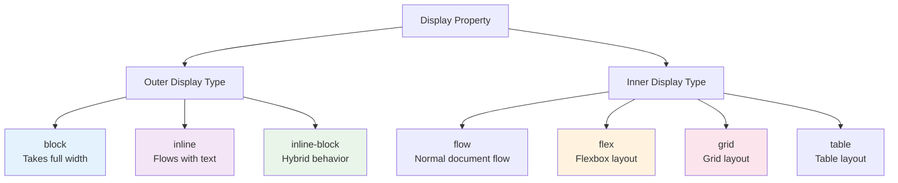
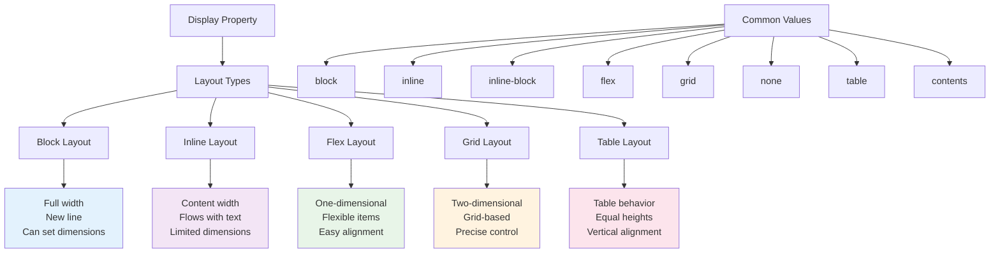

# 9. Display Properties 📦

The `display` property is one of the most important CSS properties for controlling layout. It determines how an element is rendered and how it interacts with other elements. This chapter covers all display values and their behaviors.

## Table of Contents

-   [[#Understanding Display Types|Understanding Display Types]]
-   [[#Block vs Inline vs Inline-Block|Block vs Inline vs Inline-Block]]
-   [[#Display None vs Visibility Hidden|Display None vs Visibility Hidden]]
-   [[#Display Table and Table-Cell|Display Table and Table-Cell]]
-   [[#Display Flex (Introduction)|Display Flex (Introduction)]]
-   [[#Display Grid (Introduction)|Display Grid (Introduction)]]
-   [[#Modern Display Values|Modern Display Values]]
-   [[#Mermaid: Display Property Overview|Mermaid: Display Property Overview]]

---

## Understanding Display Types

Every HTML element has a default display value, which determines its layout behavior. Understanding these display types is crucial for effective CSS layout.

> [!abstract] 🚀 **Theory Summary**
> The `display` property controls two things:
> 1. **Outer display type** - How the element participates in its parent's layout
> 2. **Inner display type** - How the element's children are laid out



---

## Block vs Inline vs Inline-Block

### Block Elements

Block elements take up the full width available and start on a new line.

**Default block elements:** `div`, `p`, `h1-h6`, `section`, `article`, `header`, `footer`, `ul`, `li`

```html
<!-- preview: true -->
<div class="block-examples">
  <div class="block-element">Block Element 1</div>
  <div class="block-element">Block Element 2</div>
  <div class="block-element">Block Element 3</div>
</div>

<style>
.block-element {
  background: #3498db;
  color: white;
  padding: 1rem;
  margin: 0.5rem 0;
  border-radius: 4px;
  text-align: center;
}
</style>
```

**Block Element Characteristics:**
- ✅ Takes full width of parent
- ✅ Starts on a new line
- ✅ Can have width, height, margin, padding
- ✅ Can contain other block and inline elements

### Inline Elements

Inline elements flow with the text and only take up as much width as needed.

**Default inline elements:** `span`, `a`, `strong`, `em`, `img`, `input`, `button`

```html
<!-- preview: true -->
<div class="inline-examples">
  <p>This paragraph contains 
    <span class="inline-element">inline element 1</span> and 
    <span class="inline-element">inline element 2</span> and 
    <span class="inline-element">inline element 3</span> 
    that flow with the text naturally.
  </p>
</div>

<style>
.inline-element {
  background: #e74c3c;
  color: white;
  padding: 0.25rem 0.5rem;
  border-radius: 4px;
}
</style>
```

**Inline Element Characteristics:**
- ✅ Only takes necessary width
- ✅ Flows with text content
- ❌ Cannot have width or height set
- ❌ Vertical margins/padding don't affect layout
- ✅ Can have horizontal margins/padding

### Inline-Block Elements

Inline-block combines the best of both worlds - flows like inline but accepts block properties.

```html
<!-- preview: true -->
<div class="inline-block-examples">
  <div class="inline-block-element">Item 1</div>
  <div class="inline-block-element">Item 2</div>
  <div class="inline-block-element">Item 3</div>
  <div class="inline-block-element">Item 4</div>
</div>

<style>
.inline-block-examples {
  text-align: center;
}
.inline-block-element {
  display: inline-block;
  width: 100px;
  height: 80px;
  background: #2ecc71;
  color: white;
  margin: 0.5rem;
  padding: 1rem;
  border-radius: 8px;
  vertical-align: top;
  text-align: center;
  line-height: 80px;
}
</style>
```

**Inline-Block Element Characteristics:**
- ✅ Flows horizontally like inline
- ✅ Can have width, height, margins, padding
- ✅ Respects vertical alignment
- ⚠️ Small whitespace gaps between elements (can be removed)

### Comparison Table

| Property | Block | Inline | Inline-Block |
|----------|-------|--------|--------------|
| **Width** | Full width by default | Content width | Can be set |
| **Height** | Can be set | Content height | Can be set |
| **New Line** | Yes | No | No |
| **Margins** | All sides | Horizontal only | All sides |
| **Padding** | All sides | All sides* | All sides |

*Inline padding doesn't affect vertical layout

---

## Display None vs Visibility Hidden

Both properties hide elements, but they behave differently:

```html
<!-- preview: true -->
<div class="visibility-examples">
  <div class="normal-element">Normal Element</div>
  <div class="display-none">Display: None (Completely removed)</div>
  <div class="visibility-hidden">Visibility: Hidden (Space preserved)</div>
  <div class="normal-element">Another Normal Element</div>
</div>

<style>
.visibility-examples > div {
  background: #9b59b6;
  color: white;
  padding: 1rem;
  margin: 0.5rem 0;
  border-radius: 4px;
  text-align: center;
}
.display-none {
  display: none; /* Element is completely removed from layout */
}
.visibility-hidden {
  visibility: hidden; /* Element is invisible but space is preserved */
}
</style>
```

| Property | Element Space | Accessibility | Performance |
|----------|---------------|---------------|-------------|
| `display: none` | Removed | Not read by screen readers | Better (no rendering) |
| `visibility: hidden` | Preserved | Not read by screen readers | Worse (still rendered) |
| `opacity: 0` | Preserved | Read by screen readers | Worse (still rendered) |

---

## Display Table and Table-Cell

CSS table display values recreate table layout without HTML table elements:

```html
<!-- preview: true -->
<div class="table-examples">
  <div class="table-container">
    <div class="table-row">
      <div class="table-cell">Cell 1</div>
      <div class="table-cell">Cell 2</div>
      <div class="table-cell">Cell 3</div>
    </div>
    <div class="table-row">
      <div class="table-cell">Cell 4</div>
      <div class="table-cell">Cell 5 with more content</div>
      <div class="table-cell">Cell 6</div>
    </div>
  </div>
</div>

<style>
.table-container {
  display: table;
  width: 100%;
  border-collapse: separate;
  border-spacing: 0.5rem;
}
.table-row {
  display: table-row;
}
.table-cell {
  display: table-cell;
  background: #34495e;
  color: white;
  padding: 1rem;
  border-radius: 4px;
  text-align: center;
  vertical-align: middle;
}
</style>
```

**Table Display Values:**
- `display: table` - Acts like `<table>`
- `display: table-row` - Acts like `<tr>`
- `display: table-cell` - Acts like `<td>`
- `display: table-header-group` - Acts like `<thead>`
- `display: table-footer-group` - Acts like `<tfoot>`

**Use Cases:**
- ✅ Equal height columns
- ✅ Vertical centering
- ✅ When you need table behavior without table markup

---

## Display Flex (Introduction)

Flexbox is a powerful layout method for arranging items in one dimension:

```html
<!-- preview: true -->
<div class="flex-examples">
  <div class="flex-container">
    <div class="flex-item">Item 1</div>
    <div class="flex-item">Item 2</div>
    <div class="flex-item">Item 3</div>
  </div>
</div>

<style>
.flex-container {
  display: flex;
  gap: 1rem;
  background: #ecf0f1;
  padding: 1rem;
  border-radius: 8px;
}
.flex-item {
  flex: 1;
  background: #3498db;
  color: white;
  padding: 1rem;
  border-radius: 4px;
  text-align: center;
}
</style>
```

**Flex Benefits:**
- ✅ Easy alignment and distribution
- ✅ Flexible item sizing
- ✅ Great for navigation bars, cards, buttons
- ✅ Responsive by default

> [!info] **Learn More**
> Flexbox is covered in detail in [[12. Flexbox Layout System]].

---

## Display Grid (Introduction)

CSS Grid is designed for two-dimensional layouts:

```html
<!-- preview: true -->
<div class="grid-examples">
  <div class="grid-container">
    <div class="grid-item">Header</div>
    <div class="grid-item">Sidebar</div>
    <div class="grid-item">Main Content</div>
    <div class="grid-item">Footer</div>
  </div>
</div>

<style>
.grid-container {
  display: grid;
  grid-template-columns: 1fr 2fr;
  grid-template-rows: auto 1fr auto;
  gap: 1rem;
  height: 300px;
  background: #ecf0f1;
  padding: 1rem;
  border-radius: 8px;
}
.grid-item {
  background: #e74c3c;
  color: white;
  padding: 1rem;
  border-radius: 4px;
  text-align: center;
  display: flex;
  align-items: center;
  justify-content: center;
}
.grid-item:nth-child(1) {
  grid-column: 1 / -1; /* Header spans full width */
}
.grid-item:nth-child(4) {
  grid-column: 1 / -1; /* Footer spans full width */
}
</style>
```

**Grid Benefits:**
- ✅ Two-dimensional layout control
- ✅ Complex layouts made simple
- ✅ Great for page layouts, image galleries
- ✅ Precise positioning control

> [!info] **Learn More**
> CSS Grid is covered in detail in [[13. CSS Grid Layout System]].

---

## Modern Display Values

### display: contents

The element's box disappears, but its children remain:

```html
<!-- preview: true -->
<div class="contents-example">
  <div class="parent">
    <div class="child">Child 1</div>
    <div class="contents-wrapper">
      <div class="child">Child 2 (in contents wrapper)</div>
      <div class="child">Child 3 (in contents wrapper)</div>
    </div>
    <div class="child">Child 4</div>
  </div>
</div>

<style>
.parent {
  display: flex;
  gap: 1rem;
  background: #f8f9fa;
  padding: 1rem;
  border-radius: 8px;
}
.contents-wrapper {
  display: contents; /* This wrapper disappears */
}
.child {
  background: #17a2b8;
  color: white;
  padding: 1rem;
  border-radius: 4px;
  text-align: center;
}
</style>
```

### display: flow-root

Creates a new block formatting context:

```css
.clearfix-modern {
  display: flow-root; /* Modern alternative to clearfix */
}
```

---

## Mermaid: Display Property Overview



Understanding display properties is fundamental to CSS layout. Each display type serves specific use cases and understanding when to use each one will make you a more effective CSS developer. The next chapters will dive deeper into the modern layout systems: Flexbox and Grid.


---


---
← [[8. CSS Units & Sizing.md|CSS Units & Sizing]] [[CSS/Table Of Content|��� Table of Contents]] [[10. CSS Positioning.md|CSS Positioning]] →
