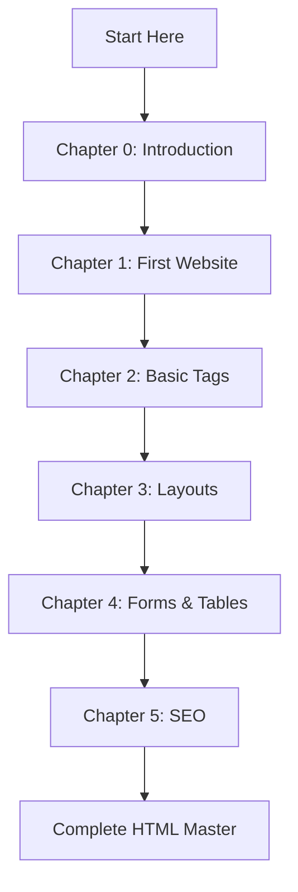

# 📚 HTML Handbook - Complete Guide

> **Learning Path**: From absolute beginner to HTML expert
> 
> **Estimated Time**: 8-12 hours
> 
> **Prerequisites**: None - Start from scratch!

---

## 🎯 Learning Objectives

By the end of this handbook, you will be able to:
- ✅ Create complete HTML websites from scratch
- ✅ Use semantic HTML for better accessibility and SEO
- ✅ Build responsive layouts with proper structure
- ✅ Implement forms, tables, and interactive elements
- ✅ Optimize HTML for search engines
- ✅ Follow modern web development best practices

---

## 📖 Complete Chapter Guide

### 🚀 **Foundation Level** (Beginner)
1. [[🌐 HTML 0 Introduction|📘 Chapter 0: Introduction to HTML]]
   - What is HTML?
   - HTML vs CSS vs JavaScript
   - Tools and setup
   - Your first HTML document

2. [[🌐 HTML 1 Creating Our First Website|🛠️ Chapter 1: Creating Your First Website]]
   - Basic HTML structure
   - Understanding `index.html`
   - HTML document anatomy
   - Testing your website

3. [[🌐 HTML 2 Basic HTML Tags|🔧 Chapter 2: Essential HTML Tags]]
   - Text structure and formatting
   - Links and navigation
   - Media elements (images, video, audio)
   - Semantic HTML fundamentals

### 🏗️ **Structure Level** (Intermediate)
4. [[🧱 HTML 3 Creating a Page Layout|🏗️ Chapter 3: Page Layouts & Structure]]
   - Semantic layout elements
   - Header, main, footer structure
   - Navigation and content organization
   - Best practices for layout

5. [[📋 HTML 4 Lists, Tables & Forms|📊 Chapter 4: Data Structures & Forms]]
   - Lists (ordered, unordered, description)
   - Tables and data presentation
   - Forms and user input
   - Interactive elements

### 🎯 **Advanced Level** (Professional)
6. [[🔍 HTML 5 SEO in HTML|🔎 Chapter 5: SEO & Optimization]]
   - Search Engine Optimization
   - Meta tags and descriptions
   - Semantic markup for SEO
   - Performance optimization

---

## 🧪 Practice Projects

### 📝 **Beginner Projects**
- Personal portfolio page
- Simple blog layout
- Contact form page

### 🎨 **Intermediate Projects**
- Restaurant menu website
- Product catalog with tables
- Multi-page business site

### 🚀 **Advanced Projects**
- SEO-optimized blog
- E-commerce product page
- Accessible documentation site

---

## 🛠️ Tools & Resources

### **Essential Tools**
- **Code Editor**: Visual Studio Code (recommended)
- **Browser**: Chrome, Firefox, or Edge
- **File Manager**: Any text editor works

### **Additional Resources**
- [[The Ultimate HTML handbook.pdf|📖 Complete HTML Handbook PDF]]
- Browser Developer Tools
- HTML validation tools
- Accessibility checkers

---

## 📈 Learning Path



---

## 🎯 Quick Reference

### **Essential Tags**
```html
<!-- Structure -->
<!DOCTYPE html>
<html>
<head>
<body>

<!-- Content -->
<h1> to <h6>
<p>
<a>


<!-- Semantic -->
<header>
<main>
<nav>
<footer>
<article>
<section>
```

### **Common Attributes**
- `class` - CSS styling
- `id` - Unique identifier
- `src` - Source URL
- `href` - Link destination
- `alt` - Alternative text

---

## 🔗 Navigation

### **Previous Chapter**
- Start with [[🌐 HTML 0 Introduction|Chapter 0]]

### **Next Chapter**
- Continue to [[🌐 HTML 1 Creating Our First Website|Chapter 1]]

---

## 📚 Related Topics

- **CSS Styling**: Learn to style your HTML
- **JavaScript**: Add interactivity to your websites
- **Web Accessibility**: Make your sites inclusive
- **Responsive Design**: Mobile-friendly layouts

---

> **Ready to start?** Begin with [[🌐 HTML 0 Introduction|Chapter 0: Introduction to HTML]] and build your way to becoming an HTML expert!