---
tags:
  - javascript
  - introduction
  - fundamentals
  - beginner
  - programming-basics
  - web-development
date: 2025-01-25
aliases:
  - Introduction to JavaScript
  - JavaScript Basics
  - Getting Started with JavaScript
---

# 1. Introduction to JavaScript 🚀

## 📜 Table of Contents
- [[#Overview|Overview]]
- [[#What is JavaScript?|📋 What is JavaScript?]]
- [[#Where JavaScript Runs|🌍 Where JavaScript Runs]]
- [[#Setting Up Development Environment|🛠️ Setting Up Development Environment]]
- [[#Your First JavaScript Program|👋 Your First JavaScript Program]]
- [[#JavaScript Syntax Basics|📝 JavaScript Syntax Basics]]
- [[#Best Practices|💡 Best Practices]]
- [[#Related Links & Next Steps|Navigation]]

## Overview
JavaScript is a **high-level**, **interpreted**, **dynamic** programming language that was originally created to make web pages interactive. Today, it's one of the most popular programming languages in the world, running everywhere from browsers to servers, mobile apps, and even desktop applications.

## 📋 What is JavaScript?

### 🌟 Key Characteristics

- **🔄 Dynamic Typing**: Variables can hold different types of values
- **🎯 Event-Driven**: Responds to user interactions and system events  
- **🔗 Prototype-Based**: Object-oriented programming through prototypes
- **⚡ Just-in-Time Compiled**: Code is compiled during execution for performance
- **🌐 Multi-Paradigm**: Supports procedural, object-oriented, and functional programming

## 🌍 Where JavaScript Runs

```mermaid
graph TD
    A[JavaScript] --> B[🌐 Browser Environment]
    A --> C[🖥️ Server Environment]
    A --> D[📱 Mobile Apps]
    A --> E[🖥️ Desktop Apps]
    
    B --> B1[DOM Manipulation]
    B --> B2[User Interactions]
    B --> B3[Web APIs]
    
    C --> C1[Node.js]
    C --> C2[Express.js]
    C --> C3[Database Operations]
    
    D --> D1[React Native]
    D --> D2[Ionic]
    D --> D3[Cordova]
    
    E --> E1[Electron]
    E --> E2[Tauri]
    E --> E3[NW.js]
```



### 🌐 Browser Environment
- **Client-Side Scripting**: Runs in web browsers
- **DOM Manipulation**: Interact with HTML elements
- **Event Handling**: Respond to user clicks, form submissions, etc.
- **AJAX/Fetch**: Make HTTP requests without page reload

### 🖥️ Server Environment (Node.js)
- **Backend Development**: Build web servers and APIs
- **File System Access**: Read/write files on the server
- **Database Integration**: Connect to databases like MongoDB, MySQL
- **Package Management**: Use npm for third-party libraries

## 🛠️ Setting Up Development Environment

### 📝 Code Editors (Choose One)
- **Visual Studio Code** (Recommended) - Free, powerful, great extensions
- **WebStorm** - Professional IDE with advanced features
- **Sublime Text** - Lightweight and fast
- **Atom** - Hackable text editor

### 🌐 Browser Developer Tools
All modern browsers include developer tools:

```javascript
// Press F12 or Right-click → Inspect Element
console.log("Hello from the browser console!");
```

### 🖥️ Node.js Installation
1. Download from [nodejs.org](https://nodejs.org)
2. Install the LTS (Long Term Support) version
3. Verify installation:

```bash
node --version
npm --version
```

## 💻 Your First JavaScript Program

### 🌐 In the Browser

```html
<!DOCTYPE html>
<html lang="en">
<head>
    <meta charset="UTF-8">
    <meta name="viewport" content="width=device-width, initial-scale=1.0">
    <title>My First JavaScript</title>
</head>
<body>
    <h1>Hello JavaScript!</h1>
    
    <script>
        // Your first JavaScript code
        console.log("Hello, World!");
        alert("Welcome to JavaScript!");
        
        // Interact with HTML
        document.querySelector('h1').style.color = 'blue';
    </script>
</body>
</html>
```

**Output:**
- Console: `Hello, World!`
- Alert popup: `Welcome to JavaScript!`
- H1 text turns blue

### 🖥️ In Node.js

Create a file called `hello.js`:

```javascript
// hello.js
console.log("Hello from Node.js!");
console.log("Current date:", new Date().toLocaleDateString());

// Node.js specific features
const os = require('os');
console.log("Operating System:", os.platform());
console.log("Node.js version:", process.version);
```

Run it:
```bash
node hello.js
```

**Output:**
```
Hello from Node.js!
Current date: 1/24/2025
Operating System: win32
Node.js version: v18.17.0
```

## 🎯 JavaScript Execution Flow

```mermaid
flowchart TD
    A[📄 JavaScript Code] --> B{🌐 Environment?}
    B -->|Browser| C[🔍 HTML Parser]
    B -->|Node.js| D[🚀 V8 Engine]
    
    C --> E[📊 DOM Creation]
    E --> F[⚡ JavaScript Engine]
    
    D --> F
    F --> G[🔄 Call Stack]
    G --> H[🎯 Execution Context]
    H --> I[✅ Code Execution]
    
    I --> J[📤 Output/Side Effects]
```



## 🧠 Key Concepts to Remember

### ✅ JavaScript is Case-Sensitive
```javascript
let myVariable = "Hello";
let myvariable = "World";  // Different variable!
console.log(myVariable);   // Output: Hello
console.log(myvariable);   // Output: World
```

### ✅ Statements and Expressions
```javascript
// Statement - performs an action
let name = "JavaScript";

// Expression - produces a value
let greeting = "Hello " + name;  // "Hello " + name is an expression

console.log(greeting);  // Output: Hello JavaScript
```

### ✅ Comments
```javascript
// Single-line comment

/*
   Multi-line comment
   Can span multiple lines
*/

/**
 * JSDoc comment - used for documentation
 * @param {string} name - The name to greet
 * @returns {string} - The greeting message
 */
function greet(name) {
    return `Hello, ${name}!`;
}
```

## 🎨 Best Practices from the Start

### 📏 Code Style
```javascript
// ✅ Good - consistent indentation and spacing
function calculateArea(width, height) {
    const area = width * height;
    return area;
}

// ❌ Bad - inconsistent formatting
function calculateArea(width,height){
const area=width*height;
return area;
}
```

### 🏷️ Naming Conventions
```javascript
// ✅ Variables and functions - camelCase
let userName = "john_doe";
function getUserInfo() { }

// ✅ Constants - UPPER_SNAKE_CASE
const MAX_RETRY_ATTEMPTS = 3;
const API_BASE_URL = "https://api.example.com";

// ✅ Classes - PascalCase
class UserManager { }
```

### 🔒 Use Strict Mode
```javascript
"use strict";  // Enable strict mode for better error checking

// This will throw an error in strict mode
undeclaredVariable = "This is bad!";  // ReferenceError
```

## 🎯 Learning Path Ahead

```mermaid
graph LR
    A[🚀 Introduction] --> B[📦 Variables & Data Types]
    B --> C[🔧 Operators]
    C --> D[🔤 Strings]
    D --> E[🔢 Numbers]
    E --> F[📅 Dates]
    F --> G[📊 Arrays]
    G --> H[🏗️ Objects]
    H --> I[🔄 Control Flow]
    I --> J[⚙️ Functions]
```



## 💡 Quick Tips

> **🎯 Pro Tip**: Always use the browser's developer console to experiment with JavaScript. Press `F12` and go to the Console tab.

> **⚡ Performance**: Modern JavaScript engines are incredibly fast. Focus on writing readable code first, optimize later.

> **🔍 Debugging**: `console.log()` is your best friend for understanding what your code is doing.

## Related Links & Next Steps

### Navigation
- [[Table Of Content|📚 Table of Contents]]
- [[02_Variables_and_Data_Types|2. Variables and Data Types →]]

### Related Concepts
- [[14_Document_Object_Model_DOM|DOM Manipulation]]
- [[26_Browser_APIs_and_Web_Technologies|Browser APIs]]
- [[29_Professional_Development_Practices|Development Setup]]

---

**Learning Path**: Beginner
**Estimated Time**: 2-3 hours
**Prerequisites**: Basic computer literacy, text editor familiarity