---
tags:
  - javascript
  - variables
  - data-types
  - fundamentals
  - beginner
  - let-const-var
  - primitives
date: 2025-01-25
aliases:
  - Variables and Data Types
  - JavaScript Variables
  - Data Types in JavaScript
---

# 2. Variables and Data Types 📦

## 📜 Table of Contents
- [[#Overview|Overview]]
- [[#Variable Declaration|🏷️ Variable Declaration]]
- [[#Primitive Data Types|🔢 Primitive Data Types]]
- [[#Reference Data Types|📚 Reference Data Types]]
- [[#Type Conversion|🔄 Type Conversion]]
- [[#Variable Scope|🎯 Variable Scope]]
- [[#Best Practices|💡 Best Practices]]
- [[#Related Links & Next Steps|Navigation]]

## Overview
Variables are containers that store data values. JavaScript provides three ways to declare variables: `var`, `let`, and `const`. Understanding data types and variable behavior is fundamental to JavaScript programming.

## 🏷️ Variable Declaration

### 🆕 Modern Variable Declaration (`let` and `const`)

```javascript
// ✅ Use let for variables that can change
let userName = "Alice";
userName = "Bob";  // ✅ Allowed
console.log(userName);  // Output: Bob

// ✅ Use const for constants (cannot be reassigned)
const PI = 3.14159;
const API_URL = "https://api.example.com";
// PI = 3.14;  // ❌ TypeError: Assignment to constant variable
```

### 🚫 Legacy Variable Declaration (`var`)

```javascript
// ❌ Avoid using var (legacy syntax)
var oldStyle = "Don't use this";
var oldStyle = "Can be redeclared";  // This is problematic
```

## 🔍 Variable Scope Comparison

```mermaid
graph TD
    A[Variable Scope] --> B[🌍 Global Scope]
    A --> C[⚙️ Function Scope]
    A --> D[🧱 Block Scope]
    
    B --> B1[var, let, const<br/>outside functions]
    C --> C1[var inside functions]
    D --> D1[let, const inside {blocks}]
    
    style B fill:#ffebee
    style C fill:#e8f5e8
    style D fill:#e3f2fd
```

### 🧱 Block Scope Example

```javascript
function demonstrateScope() {
    // Function scope
    var functionScoped = "I'm function scoped";
    
    if (true) {
        // Block scope
        let blockScoped = "I'm block scoped";
        const alsoBlockScoped = "Me too!";
        var stillFunctionScoped = "I escape the block";
        
        console.log(blockScoped);        // ✅ Works
        console.log(alsoBlockScoped);    // ✅ Works
    }
    
    console.log(functionScoped);         // ✅ Works
    console.log(stillFunctionScoped);    // ✅ Works (var escapes block)
    // console.log(blockScoped);         // ❌ ReferenceError
    // console.log(alsoBlockScoped);     // ❌ ReferenceError
}

demonstrateScope();
```

## 🎯 Data Types Overview

JavaScript has **8 data types**: 7 primitive types and 1 non-primitive type.

```mermaid
graph TD
    A[JavaScript Data Types] --> B[🔹 Primitive Types]
    A --> C[🔸 Non-Primitive Types]
    
    B --> B1[📝 String]
    B --> B2[🔢 Number]
    B --> B3[✅ Boolean]
    B --> B4[❌ Null]
    B --> B5[❓ Undefined]
    B --> B6[🏷️ Symbol]
    B --> B7[🔢 BigInt]
    
    C --> C1[📦 Object]
    C1 --> C2[📊 Array]
    C1 --> C3[⚙️ Function]
    C1 --> C4[📅 Date]
    C1 --> C5[🔍 RegExp]
```



## 🔹 Primitive Data Types

### 📝 String
Represents textual data enclosed in quotes.

```javascript
// Different ways to create strings
let singleQuotes = 'Hello World';
let doubleQuotes = "Hello World";
let templateLiteral = `Hello World`;

// String with variables (Template Literals)
let name = "JavaScript";
let version = 2025;
let message = `Learning ${name} in ${version}`;
console.log(message);  // Output: Learning JavaScript in 2025

// Multi-line strings
let multiLine = `
    This is a
    multi-line
    string
`;

// String properties and methods
console.log(message.length);           // Output: 24
console.log(message.toUpperCase());    // Output: LEARNING JAVASCRIPT IN 2025
console.log(message.includes("Java")); // Output: true
```

### 🔢 Number
Represents both integers and floating-point numbers.

```javascript
// Integer numbers
let age = 25;
let temperature = -10;

// Floating-point numbers
let price = 99.99;
let pi = 3.14159;

// Special numeric values
let infinity = Infinity;
let negativeInfinity = -Infinity;
let notANumber = NaN;

// Number operations
console.log(10 + 5);    // Output: 15
console.log(10 - 5);    // Output: 5
console.log(10 * 5);    // Output: 50
console.log(10 / 5);    // Output: 2
console.log(10 % 3);    // Output: 1 (remainder)
console.log(2 ** 3);    // Output: 8 (exponentiation)

// Number methods
let decimal = 3.14159;
console.log(decimal.toFixed(2));      // Output: "3.14"
console.log(Number.isInteger(25));    // Output: true
console.log(Number.isNaN(NaN));       // Output: true
```

### ✅ Boolean
Represents logical values: `true` or `false`.

```javascript
let isActive = true;
let isComplete = false;

// Boolean from comparisons
let isAdult = age >= 18;
console.log(isAdult);  // Output: true (if age is 25)

// Boolean methods
console.log(Boolean(1));        // Output: true
console.log(Boolean(0));        // Output: false
console.log(Boolean("hello"));  // Output: true
console.log(Boolean(""));       // Output: false
```

### ❌ Null
Represents intentional absence of value.

```javascript
let data = null;  // Explicitly set to "no value"
console.log(data);        // Output: null
console.log(typeof data); // Output: "object" (this is a known quirk)
```

### ❓ Undefined
Represents uninitialized or missing values.

```javascript
let uninitialized;
console.log(uninitialized);        // Output: undefined
console.log(typeof uninitialized); // Output: "undefined"

// Function with no return value
function noReturn() {
    console.log("This function returns undefined");
}
let result = noReturn();
console.log(result);  // Output: undefined
```

### 🏷️ Symbol (ES6+)
Represents unique identifiers.

```javascript
// Create unique symbols
let sym1 = Symbol("description");
let sym2 = Symbol("description");
console.log(sym1 === sym2);  // Output: false (each symbol is unique)

// Using symbols as object keys
let obj = {};
obj[sym1] = "value1";
obj[sym2] = "value2";
console.log(obj[sym1]);  // Output: "value1"
```

### 🔢 BigInt (ES2020)
Represents integers larger than `Number.MAX_SAFE_INTEGER`.

```javascript
// Regular number limit
console.log(Number.MAX_SAFE_INTEGER);  // Output: 9007199254740991

// BigInt for larger numbers
let bigNumber = 1234567890123456789012345678901234567890n;
let anotherBig = BigInt("9007199254740992");

console.log(bigNumber);   // Output: 1234567890123456789012345678901234567890n
console.log(typeof bigNumber);  // Output: "bigint"

// BigInt operations
console.log(10n + 20n);   // Output: 30n
// console.log(10n + 20); // ❌ TypeError: Cannot mix BigInt and other types
```

## 🔸 Non-Primitive Data Types

### 📦 Object
Collection of key-value pairs.

```javascript
// Object literal
let person = {
    name: "Alice",
    age: 30,
    isEmployed: true,
    address: {
        city: "New York",
        country: "USA"
    },
    greet: function() {
        return `Hello, I'm ${this.name}`;
    }
};

// Accessing object properties
console.log(person.name);           // Output: Alice
console.log(person["age"]);         // Output: 30
console.log(person.address.city);   // Output: New York
console.log(person.greet());        // Output: Hello, I'm Alice

// Adding new properties
person.email = "alice@example.com";
person["phone"] = "123-456-7890";
```

### 📊 Array
Ordered collection of values.

```javascript
// Array creation
let fruits = ["apple", "banana", "orange"];
let numbers = [1, 2, 3, 4, 5];
let mixed = ["hello", 42, true, null, {name: "object"}];

// Array access and modification
console.log(fruits[0]);        // Output: apple
console.log(fruits.length);    // Output: 3

fruits.push("grape");          // Add to end
fruits.unshift("mango");       // Add to beginning
console.log(fruits);           // Output: ["mango", "apple", "banana", "orange", "grape"]

// Array methods
let doubled = numbers.map(n => n * 2);
console.log(doubled);          // Output: [2, 4, 6, 8, 10]

let evenNumbers = numbers.filter(n => n % 2 === 0);
console.log(evenNumbers);      // Output: [2, 4]
```

## 🔍 Type Checking

### `typeof` Operator

```javascript
console.log(typeof "hello");        // Output: "string"
console.log(typeof 42);             // Output: "number"
console.log(typeof true);           // Output: "boolean"
console.log(typeof undefined);      // Output: "undefined"
console.log(typeof null);           // Output: "object" (quirk!)
console.log(typeof {});             // Output: "object"
console.log(typeof []);             // Output: "object"
console.log(typeof function(){});   // Output: "function"
console.log(typeof Symbol());       // Output: "symbol"
console.log(typeof 123n);           // Output: "bigint"
```

### More Precise Type Checking

```javascript
// Check for arrays
console.log(Array.isArray([]));           // Output: true
console.log(Array.isArray({}));           // Output: false

// Check for null specifically
function isNull(value) {
    return value === null;
}

// Check for objects (excluding null and arrays)
function isObject(value) {
    return typeof value === 'object' && value !== null && !Array.isArray(value);
}

console.log(isObject({}));        // Output: true
console.log(isObject([]));        // Output: false
console.log(isObject(null));      // Output: false
```

## 🔄 Type Conversion

### 🔀 Implicit Conversion (Coercion)

```javascript
// String coercion
console.log("5" + 3);      // Output: "53" (number becomes string)
console.log("5" - 3);      // Output: 2 (string becomes number)
console.log("5" * 3);      // Output: 15 (string becomes number)

// Boolean coercion
console.log(Boolean(0));         // Output: false
console.log(Boolean(""));        // Output: false
console.log(Boolean(null));      // Output: false
console.log(Boolean(undefined)); // Output: false
console.log(Boolean(NaN));       // Output: false

console.log(Boolean(1));         // Output: true
console.log(Boolean("hello"));   // Output: true
console.log(Boolean([]));        // Output: true
console.log(Boolean({}));        // Output: true
```

### 🎯 Explicit Conversion

```javascript
// To String
let num = 123;
console.log(String(num));        // Output: "123"
console.log(num.toString());     // Output: "123"
console.log(`${num}`);           // Output: "123"

// To Number
let str = "456";
console.log(Number(str));        // Output: 456
console.log(parseInt(str));      // Output: 456
console.log(parseFloat("3.14")); // Output: 3.14
console.log(+str);               // Output: 456 (unary plus)

// To Boolean
console.log(Boolean("false"));   // Output: true (non-empty string)
console.log(!!str);              // Output: true (double negation)
```

## 🎯 Truthy and Falsy Values

### ❌ Falsy Values (8 total)
```javascript
// These are the only falsy values in JavaScript
console.log(Boolean(false));      // false
console.log(Boolean(0));          // false
console.log(Boolean(-0));         // false
console.log(Boolean(0n));         // false (BigInt zero)
console.log(Boolean(""));         // false (empty string)
console.log(Boolean(null));       // false
console.log(Boolean(undefined));  // false
console.log(Boolean(NaN));        // false
```

### ✅ Truthy Values
```javascript
// Everything else is truthy
console.log(Boolean(1));          // true
console.log(Boolean(-1));         // true
console.log(Boolean("0"));        // true (string "0")
console.log(Boolean("false"));    // true (string "false")
console.log(Boolean([]));         // true (empty array)
console.log(Boolean({}));         // true (empty object)
console.log(Boolean(function(){})); // true
```

## 💡 Best Practices

### ✅ Variable Declaration Best Practices

```javascript
// ✅ Use const by default
const userName = "Alice";
const userAge = 25;

// ✅ Use let when you need to reassign
let counter = 0;
counter++;

// ✅ Declare variables at the top of their scope
function processUser() {
    const userId = 123;
    let userData = null;
    let isProcessing = false;
    
    // ... rest of function
}

// ✅ Use descriptive names
const maxRetryAttempts = 3;  // ✅ Clear
const m = 3;                 // ❌ Unclear

// ✅ Group related constants
const CONFIG = {
    MAX_USERS: 100,
    TIMEOUT_MS: 5000,
    API_VERSION: 'v1'
};
```

### 🔍 Type Checking Best Practices

```javascript
// ✅ Strict equality for comparisons
if (value === null) { /* handle null */ }
if (typeof value === 'string') { /* handle string */ }

// ✅ Check for arrays specifically
if (Array.isArray(value)) { /* handle array */ }

// ✅ Check for objects (excluding null and arrays)
if (value && typeof value === 'object' && !Array.isArray(value)) {
    /* handle object */
}

// ✅ Safe property access
const name = user && user.profile && user.profile.name;
// Or using optional chaining (ES2020)
const name2 = user?.profile?.name;
```

## 🧪 Practical Examples

### 📊 Variable Usage Example

```javascript
// User management system
const SYSTEM_NAME = "User Management System";
const MAX_LOGIN_ATTEMPTS = 3;

let currentUser = null;
let loginAttempts = 0;
let isSystemActive = true;

function loginUser(username, password) {
    if (!isSystemActive) {
        return { success: false, message: "System is down" };
    }
    
    if (loginAttempts >= MAX_LOGIN_ATTEMPTS) {
        return { success: false, message: "Too many attempts" };
    }
    
    // Simulate login logic
    if (username === "admin" && password === "secret") {
        currentUser = {
            username: username,
            loginTime: new Date(),
            permissions: ["read", "write", "admin"]
        };
        loginAttempts = 0;  // Reset on successful login
        return { success: true, user: currentUser };
    } else {
        loginAttempts++;
        return { success: false, message: "Invalid credentials" };
    }
}

// Usage
console.log(loginUser("admin", "wrong"));    // Failed attempt
console.log(loginUser("admin", "secret"));   // Successful login
console.log(`Current user: ${currentUser?.username}`);
```

**Output:**
```
{ success: false, message: "Invalid credentials" }
{ success: true, user: { username: "admin", loginTime: 2025-01-24T..., permissions: ["read", "write", "admin"] } }
Current user: admin
```

## Related Links & Next Steps

### Navigation
- [[01_Introduction_to_JavaScript|← 1. Introduction to JavaScript]]
- [[Table Of Content|📚 Table of Contents]]
- [[03_Operators_and_Expressions|3. Operators and Expressions →]]

### Related Concepts
- [[13_Scope_and_Closures|Variable Scope Deep Dive]]
- [[08_Objects_and_Properties|Object Data Types]]
- [[07_Arrays_and_Collections|Array Data Types]]

---

**Learning Path**: Beginner
**Estimated Time**: 2-3 hours
**Prerequisites**: Chapter 1 completed, basic programming concepts