# 🔧 Operators and Expressions

## 📊 Operator Categories Overview

```mermaid
graph TD
    A[JavaScript Operators] --> B[🧮 Arithmetic]
    A --> C[📝 Assignment]
    A --> D[🔍 Comparison]
    A --> E[🧠 Logical]
    A --> F[🔢 Bitwise]
    A --> G[🎯 Unary]
    A --> H[❓ Ternary]
    A --> I[🔗 String]
    A --> J[🏷️ Type]
    
    style A fill:#e1f5fe
    style B fill:#fff3e0
    style C fill:#f3e5f5
    style D fill:#e8f5e8
    style E fill:#fff8e1
```



## 🧮 Arithmetic Operators

Perform mathematical calculations on numbers.

```javascript
let a = 10;
let b = 3;

// Basic arithmetic
console.log(a + b);    // Addition: 13
console.log(a - b);    // Subtraction: 7
console.log(a * b);    // Multiplication: 30
console.log(a / b);    // Division: 3.3333333333333335
console.log(a % b);    // Modulus (remainder): 1
console.log(a ** b);   // Exponentiation: 1000

// Special cases
console.log(10 / 0);   // Infinity
console.log(-10 / 0);  // -Infinity
console.log(0 / 0);    // NaN
console.log(5 % 2);    // 1 (remainder of 5 ÷ 2)
console.log(-5 % 2);   // -1 (sign follows dividend)
```

### 🔄 Increment and Decrement Operators

```javascript
let counter = 5;

// Pre-increment (increment first, then return)
console.log(++counter);  // Output: 6, counter is now 6
console.log(counter);    // Output: 6

// Post-increment (return first, then increment)
counter = 5;  // Reset
console.log(counter++);  // Output: 5, counter becomes 6
console.log(counter);    // Output: 6

// Pre-decrement
counter = 5;  // Reset
console.log(--counter);  // Output: 4, counter is now 4

// Post-decrement
counter = 5;  // Reset
console.log(counter--);  // Output: 5, counter becomes 4
console.log(counter);    // Output: 4

// Practical example
let items = ['a', 'b', 'c'];
let index = 0;
while (index < items.length) {
    console.log(`Item ${index + 1}: ${items[index]}`);
    index++;  // Move to next item
}
```

## 📝 Assignment Operators

Assign values to variables with optional operations.

```javascript
let x = 10;

// Basic assignment
x = 20;
console.log(x);  // Output: 20

// Compound assignment operators
x += 5;   // x = x + 5
console.log(x);  // Output: 25

x -= 3;   // x = x - 3
console.log(x);  // Output: 22

x *= 2;   // x = x * 2
console.log(x);  // Output: 44

x /= 4;   // x = x / 4
console.log(x);  // Output: 11

x %= 3;   // x = x % 3
console.log(x);  // Output: 2

x **= 3;  // x = x ** 3
console.log(x);  // Output: 8

// String concatenation assignment
let message = "Hello";
message += " World";
message += "!";
console.log(message);  // Output: Hello World!

// Array assignment
let numbers = [1, 2, 3];
numbers[3] = 4;  // Add element at index 3
console.log(numbers);  // Output: [1, 2, 3, 4]
```

## 🔍 Comparison Operators

Compare values and return boolean results.

### ⚖️ Equality Operators

```javascript
// Strict equality (===) - checks value AND type
console.log(5 === 5);        // true
console.log(5 === "5");      // false (different types)
console.log(true === 1);     // false
console.log(null === undefined); // false

// Strict inequality (!==)
console.log(5 !== "5");      // true
console.log(5 !== 5);        // false

// Loose equality (==) - performs type coercion
console.log(5 == "5");       // true (string "5" converted to number)
console.log(true == 1);      // true (true converted to 1)
console.log(false == 0);     // true (false converted to 0)
console.log(null == undefined); // true (special case)
console.log("" == 0);        // true (empty string converted to 0)

// Loose inequality (!=)
console.log(5 != "5");       // false (they're equal after coercion)
```

### 📏 Relational Operators

```javascript
let a = 10, b = 5, c = "10";

// Numeric comparisons
console.log(a > b);    // true
console.log(a < b);    // false
console.log(a >= b);   // true
console.log(a <= b);   // false

// String comparisons (lexicographic order)
console.log("apple" < "banana");   // true
console.log("Apple" < "apple");    // true (uppercase comes first)
console.log("10" < "2");           // true (string comparison, not numeric)

// Mixed type comparisons (with coercion)
console.log(a > c);    // false (10 > "10" becomes 10 > 10)
console.log(a >= c);   // true (10 >= "10" becomes 10 >= 10)

// Date comparisons
let date1 = new Date("2025-01-01");
let date2 = new Date("2025-01-02");
console.log(date1 < date2);  // true
```

### 🔍 Special Comparison Cases

```javascript
// NaN comparisons
console.log(NaN === NaN);    // false (NaN is not equal to anything, including itself)
console.log(NaN == NaN);     // false
console.log(Number.isNaN(NaN)); // true (proper way to check for NaN)

// Object comparisons (reference equality)
let obj1 = { name: "Alice" };
let obj2 = { name: "Alice" };
let obj3 = obj1;

console.log(obj1 === obj2);  // false (different objects)
console.log(obj1 === obj3);  // true (same reference)

// Array comparisons
let arr1 = [1, 2, 3];
let arr2 = [1, 2, 3];
console.log(arr1 === arr2);  // false (different arrays)
console.log(arr1.toString() === arr2.toString()); // true (compare string representations)
```

## 🧠 Logical Operators

Perform logical operations and return boolean values (or the actual values in some cases).

### 🔗 Basic Logical Operators

```javascript
let isLoggedIn = true;
let hasPermission = false;
let isAdmin = true;

// AND (&&) - returns true if both operands are true
console.log(isLoggedIn && hasPermission);  // false
console.log(isLoggedIn && isAdmin);        // true

// OR (||) - returns true if at least one operand is true
console.log(isLoggedIn || hasPermission);  // true
console.log(hasPermission || false);       // false

// NOT (!) - returns opposite boolean value
console.log(!isLoggedIn);      // false
console.log(!hasPermission);   // true
console.log(!!isLoggedIn);     // true (double negation converts to boolean)
```

### ⚡ Short-Circuit Evaluation

```javascript
// AND (&&) short-circuit: if first is false, second is not evaluated
let user = null;
user && console.log(user.name);  // Won't execute console.log (no error)

// OR (||) short-circuit: if first is true, second is not evaluated
let defaultName = "Guest";
let userName = "" || defaultName;
console.log(userName);  // Output: Guest

// Practical examples
function greetUser(name) {
    // Use default if name is falsy
    name = name || "Anonymous";
    console.log(`Hello, ${name}!`);
}

greetUser("");        // Output: Hello, Anonymous!
greetUser("Alice");   // Output: Hello, Alice!

// Safe property access
let config = { api: { url: "https://api.example.com" } };
let apiUrl = config && config.api && config.api.url;
console.log(apiUrl);  // Output: https://api.example.com
```

### 🆕 Nullish Coalescing Operator (??)

```javascript
// Nullish coalescing (??) - returns right side if left is null or undefined
let value1 = null ?? "default";
let value2 = undefined ?? "default";
let value3 = 0 ?? "default";
let value4 = "" ?? "default";
let value5 = false ?? "default";

console.log(value1);  // Output: default
console.log(value2);  // Output: default
console.log(value3);  // Output: 0 (not null/undefined)
console.log(value4);  // Output: "" (not null/undefined)
console.log(value5);  // Output: false (not null/undefined)

// Comparison with OR operator
let setting1 = 0 || "default";     // "default" (0 is falsy)
let setting2 = 0 ?? "default";     // 0 (0 is not null/undefined)

console.log(setting1);  // Output: default
console.log(setting2);  // Output: 0
```

## ❓ Ternary (Conditional) Operator

Shorthand for if-else statements.

```javascript
// Basic syntax: condition ? valueIfTrue : valueIfFalse
let age = 20;
let status = age >= 18 ? "adult" : "minor";
console.log(status);  // Output: adult

// Multiple conditions (chaining)
let score = 85;
let grade = score >= 90 ? "A" : 
            score >= 80 ? "B" : 
            score >= 70 ? "C" : 
            score >= 60 ? "D" : "F";
console.log(grade);  // Output: B

// With function calls
function isEven(num) {
    return num % 2 === 0 ? "Even" : "Odd";
}
console.log(isEven(4));  // Output: Even
console.log(isEven(7));  // Output: Odd

// Practical examples
let user = { name: "Alice", isOnline: true };
let displayStatus = user.isOnline ? "🟢 Online" : "🔴 Offline";
console.log(`${user.name} is ${displayStatus}`);  // Output: Alice is 🟢 Online

// Conditional assignment
let items = [];
let message = items.length > 0 ? `You have ${items.length} items` : "Your cart is empty";
console.log(message);  // Output: Your cart is empty
```

## 🔢 Bitwise Operators

Operate on binary representations of numbers.

```javascript
let a = 5;   // Binary: 101
let b = 3;   // Binary: 011

// Bitwise AND (&)
console.log(a & b);   // Output: 1 (Binary: 001)

// Bitwise OR (|)
console.log(a | b);   // Output: 7 (Binary: 111)

// Bitwise XOR (^)
console.log(a ^ b);   // Output: 6 (Binary: 110)

// Bitwise NOT (~)
console.log(~a);      // Output: -6 (inverts all bits)

// Left shift (<<)
console.log(a << 1);  // Output: 10 (Binary: 1010, multiply by 2)

// Right shift (>>)
console.log(a >> 1);  // Output: 2 (Binary: 10, divide by 2)

// Unsigned right shift (>>>)
console.log(-5 >>> 1); // Output: 2147483645 (treats as unsigned 32-bit)

// Practical use: checking if number is even/odd
function isEven(num) {
    return (num & 1) === 0;  // Check if last bit is 0
}
console.log(isEven(4));  // Output: true
console.log(isEven(5));  // Output: false
```

## 🏷️ Type Operators

Check and work with data types.

```javascript
// typeof operator
console.log(typeof 42);           // "number"
console.log(typeof "hello");      // "string"
console.log(typeof true);         // "boolean"
console.log(typeof undefined);    // "undefined"
console.log(typeof null);         // "object" (known quirk)
console.log(typeof {});           // "object"
console.log(typeof []);           // "object"
console.log(typeof function(){}); // "function"

// instanceof operator
let arr = [1, 2, 3];
let date = new Date();
let regex = /pattern/;

console.log(arr instanceof Array);    // true
console.log(date instanceof Date);    // true
console.log(regex instanceof RegExp); // true
console.log(arr instanceof Object);   // true (arrays are objects)

// in operator (check if property exists)
let person = { name: "Alice", age: 30 };
console.log("name" in person);     // true
console.log("email" in person);    // false
console.log("toString" in person); // true (inherited from Object)

// hasOwnProperty (check own properties only)
console.log(person.hasOwnProperty("name"));     // true
console.log(person.hasOwnProperty("toString")); // false
```

## ⚡ Operator Precedence and Associativity

Understanding the order of operations is crucial for complex expressions.

```javascript
// Precedence example
let result1 = 2 + 3 * 4;        // 14, not 20 (multiplication first)
let result2 = (2 + 3) * 4;      // 20 (parentheses override precedence)

// Associativity example (left-to-right for same precedence)
let result3 = 10 - 5 - 2;       // 3 (evaluated as (10 - 5) - 2)
let result4 = 2 ** 3 ** 2;      // 512 (right-to-left: 2 ** (3 ** 2))

console.log(result1);  // Output: 14
console.log(result2);  // Output: 20
console.log(result3);  // Output: 3
console.log(result4);  // Output: 512

// Complex expression
let a = 5, b = 10, c = 2;
let complex = a + b * c > 20 && c ** 2 < 10;
// Evaluation order: b * c (20), a + 20 (25), 25 > 20 (true), c ** 2 (4), 4 < 10 (true), true && true (true)
console.log(complex);  // Output: true
```

### 📊 Precedence Table (High to Low)


## 🧪 Practical Examples

### 🔐 User Authentication System

```javascript
function authenticateUser(username, password, isActive = true) {
    // Input validation using logical operators
    const isValidInput = username && password && 
                        typeof username === 'string' && 
                        typeof password === 'string';
    
    if (!isValidInput) {
        return { success: false, message: "Invalid input" };
    }
    
    // Simulate user lookup
    const users = [
        { username: "admin", password: "secret123", role: "admin", active: true },
        { username: "user1", password: "pass123", role: "user", active: true },
        { username: "user2", password: "pass456", role: "user", active: false }
    ];
    
    // Find user using comparison operators
    const user = users.find(u => u.username === username && u.password === password);
    
    // Authentication logic using ternary and logical operators
    const authResult = !user ? 
        { success: false, message: "User not found" } :
        !user.active ?
        { success: false, message: "Account disabled" } :
        { success: true, message: "Login successful", user: user };
    
    return authResult;
}

// Test the authentication
console.log(authenticateUser("admin", "secret123"));
// Output: { success: true, message: "Login successful", user: {...} }

console.log(authenticateUser("user2", "pass456"));
// Output: { success: false, message: "Account disabled" }

console.log(authenticateUser("", ""));
// Output: { success: false, message: "Invalid input" }
```

### 🛒 Shopping Cart Calculator

```javascript
class ShoppingCart {
    constructor() {
        this.items = [];
        this.taxRate = 0.08;  // 8% tax
        this.discountThreshold = 100;
        this.discountRate = 0.1;  // 10% discount
    }
    
    addItem(name, price, quantity = 1) {
        // Input validation using logical operators
        if (!name || typeof price !== 'number' || price <= 0 || quantity <= 0) {
            console.log("Invalid item data");
            return false;
        }
        
        // Check if item already exists
        const existingItem = this.items.find(item => item.name === name);
        
        if (existingItem) {
            existingItem.quantity += quantity;
        } else {
            this.items.push({ name, price, quantity });
        }
        
        return true;
    }
    
    calculateTotal() {
        // Calculate subtotal using arithmetic operators
        const subtotal = this.items.reduce((total, item) => {
            return total + (item.price * item.quantity);
        }, 0);
        
        // Apply discount using ternary operator
        const discountAmount = subtotal >= this.discountThreshold ? 
            subtotal * this.discountRate : 0;
        
        const discountedSubtotal = subtotal - discountAmount;
        
        // Calculate tax
        const taxAmount = discountedSubtotal * this.taxRate;
        
        // Final total
        const total = discountedSubtotal + taxAmount;
        
        return {
            subtotal: Math.round(subtotal * 100) / 100,
            discount: Math.round(discountAmount * 100) / 100,
            tax: Math.round(taxAmount * 100) / 100,
            total: Math.round(total * 100) / 100,
            itemCount: this.items.reduce((count, item) => count + item.quantity, 0)
        };
    }
    
    displayCart() {
        console.log("🛒 Shopping Cart:");
        console.log("================");
        
        this.items.forEach((item, index) => {
            const itemTotal = item.price * item.quantity;
            console.log(`${index + 1}. ${item.name} - $${item.price} × ${item.quantity} = $${itemTotal.toFixed(2)}`);
        });
        
        const totals = this.calculateTotal();
        console.log("================");
        console.log(`Subtotal: $${totals.subtotal}`);
        
        // Use ternary operator for conditional display
        totals.discount > 0 && console.log(`Discount: -$${totals.discount}`);
        
        console.log(`Tax: $${totals.tax}`);
        console.log(`Total: $${totals.total}`);
        console.log(`Items: ${totals.itemCount}`);
    }
}

// Usage example
const cart = new ShoppingCart();
cart.addItem("Laptop", 899.99, 1);
cart.addItem("Mouse", 29.99, 2);
cart.addItem("Keyboard", 79.99, 1);

cart.displayCart();
```

**Output:**
```
🛒 Shopping Cart:
================
1. Laptop - $899.99 × 1 = $899.99
2. Mouse - $29.99 × 2 = $59.98
3. Keyboard - $79.99 × 1 = $79.99
================
Subtotal: $1039.96
Discount: -$103.996
Tax: $74.88
Total: $1010.84
Items: 4
```

## 💡 Best Practices

### ✅ Comparison Best Practices

```javascript
// ✅ Always use strict equality
if (value === null) { /* handle null */ }
if (typeof value === 'string') { /* handle string */ }

// ❌ Avoid loose equality
if (value == null) { /* could match null OR undefined */ }

// ✅ Explicit type conversion when needed
const userInput = "123";
const number = Number(userInput);
if (number === 123) { /* safe comparison */ }

// ✅ Safe object property checking
if (obj && obj.property) { /* safe access */ }
// Or with optional chaining (ES2020)
if (obj?.property) { /* even safer */ }
```

### ✅ Logical Operator Best Practices

```javascript
// ✅ Use nullish coalescing for default values
const config = userConfig ?? defaultConfig;

// ✅ Use logical AND for conditional execution
isLoggedIn && redirectToProfile();

// ✅ Use logical OR for fallback values (be aware of falsy values)
const name = user.name || "Anonymous";

// ✅ Use ternary for simple conditional assignments
const status = isOnline ? "Online" : "Offline";

// ❌ Avoid complex nested ternary operators
const result = condition1 ? value1 : condition2 ? value2 : condition3 ? value3 : value4;
// ✅ Use if-else for complex conditions instead
```

---

**Next Chapter**: [🔤 Strings and Text Processing](04_Strings_and_Text_Processing.md)