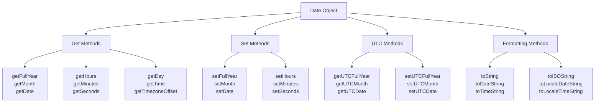

# 📅 Dates and Time

## ⏰ Understanding JavaScript Dates

JavaScript's `Date` object represents a single moment in time. It's based on **Unix timestamp** (milliseconds since January 1, 1970, 00:00:00 UTC) and can represent dates from approximately 285,616 years before to 285,616 years after the Unix epoch.

### 🎯 Creating Date Objects

```javascript
// Current date and time
let now = new Date();
console.log(now); // Output: Current date and time

// Specific date from string
let date1 = new Date("2025-01-24");
let date2 = new Date("January 24, 2025");
let date3 = new Date("2025-01-24T10:30:00");
let date4 = new Date("2025-01-24T10:30:00Z"); // UTC

console.log(date1); // Output: 2025-01-24T00:00:00.000Z (or local timezone)
console.log(date2); // Output: 2025-01-24T08:00:00.000Z (depends on timezone)
console.log(date3); // Output: 2025-01-24T10:30:00.000Z (local timezone)
console.log(date4); // Output: 2025-01-24T10:30:00.000Z (UTC)

// From timestamp (milliseconds since Unix epoch)
let timestampDate = new Date(1737705600000);
console.log(timestampDate); // Output: 2025-01-24T08:00:00.000Z

// From individual components (year, month, day, hour, minute, second, millisecond)
// Note: Month is 0-indexed (0 = January, 11 = December)
let specificDate = new Date(2025, 0, 24, 10, 30, 45, 500);
console.log(specificDate); // Output: 2025-01-24T18:30:45.500Z (depends on timezone)

// UTC date creation
let utcDate = new Date(Date.UTC(2025, 0, 24, 10, 30, 45, 500));
console.log(utcDate); // Output: 2025-01-24T10:30:45.500Z

// Invalid dates
let invalidDate = new Date("invalid");
console.log(invalidDate); // Output: Invalid Date
console.log(isNaN(invalidDate)); // Output: true
```

### 📊 Date Components and Methods



## 📖 Getting Date Components

### 📅 Date Components (Local Time)

```javascript
let date = new Date("2025-01-24T15:30:45.123");

// Year, month, day
console.log(date.getFullYear());  // Output: 2025
console.log(date.getMonth());     // Output: 0 (January, 0-indexed!)
console.log(date.getDate());      // Output: 24
console.log(date.getDay());       // Output: 5 (Friday, 0=Sunday, 6=Saturday)

// Time components
console.log(date.getHours());     // Output: 15
console.log(date.getMinutes());   // Output: 30
console.log(date.getSeconds());   // Output: 45
console.log(date.getMilliseconds()); // Output: 123

// Timestamp and timezone
console.log(date.getTime());      // Output: milliseconds since Unix epoch
console.log(date.getTimezoneOffset()); // Output: minutes difference from UTC

// Practical helper functions
function getMonthName(date) {
    const months = [
        'January', 'February', 'March', 'April', 'May', 'June',
        'July', 'August', 'September', 'October', 'November', 'December'
    ];
    return months[date.getMonth()];
}

function getDayName(date) {
    const days = ['Sunday', 'Monday', 'Tuesday', 'Wednesday', 'Thursday', 'Friday', 'Saturday'];
    return days[date.getDay()];
}

console.log(getMonthName(date));  // Output: January
console.log(getDayName(date));    // Output: Friday
```

### 🌍 UTC Date Components

```javascript
let date = new Date("2025-01-24T15:30:45.123Z"); // UTC time

// UTC components
console.log(date.getUTCFullYear());    // Output: 2025
console.log(date.getUTCMonth());       // Output: 0 (January)
console.log(date.getUTCDate());        // Output: 24
console.log(date.getUTCDay());         // Output: 5 (Friday)
console.log(date.getUTCHours());       // Output: 15
console.log(date.getUTCMinutes());     // Output: 30
console.log(date.getUTCSeconds());     // Output: 45
console.log(date.getUTCMilliseconds()); // Output: 123

// Compare local vs UTC
let localDate = new Date();
console.log("Local time:", localDate.getHours());
console.log("UTC time:", localDate.getUTCHours());
console.log("Timezone offset:", localDate.getTimezoneOffset(), "minutes");

// Convert between local and UTC
function toUTCString(date) {
    return `${date.getUTCFullYear()}-${String(date.getUTCMonth() + 1).padStart(2, '0')}-${String(date.getUTCDate()).padStart(2, '0')}T${String(date.getUTCHours()).padStart(2, '0')}:${String(date.getUTCMinutes()).padStart(2, '0')}:${String(date.getUTCSeconds()).padStart(2, '0')}.${String(date.getUTCMilliseconds()).padStart(3, '0')}Z`;
}

console.log(toUTCString(new Date())); // Custom UTC string format
```

## ✏️ Setting Date Components

### 📝 Modifying Date Objects

```javascript
let date = new Date("2025-01-24T10:30:00");

// Set individual components
date.setFullYear(2026);
console.log(date); // Year changed to 2026

date.setMonth(5); // June (0-indexed)
console.log(date); // Month changed to June

date.setDate(15);
console.log(date); // Day changed to 15th

date.setHours(14, 45, 30, 500); // hour, minute, second, millisecond
console.log(date); // Time changed to 14:45:30.500

// Chaining set methods
let newDate = new Date();
newDate.setFullYear(2025)
       .setMonth(11)  // This won't work - set methods don't return the date object
       
// Correct way to chain operations
newDate.setFullYear(2025);
newDate.setMonth(11); // December
newDate.setDate(25);  // Christmas
console.log(newDate);

// Set UTC components
let utcDate = new Date();
utcDate.setUTCFullYear(2025);
utcDate.setUTCMonth(0);
utcDate.setUTCDate(1);
utcDate.setUTCHours(0, 0, 0, 0);
console.log(utcDate); // New Year 2025 UTC

// Automatic date adjustment
let autoDate = new Date(2025, 0, 32); // January 32nd
console.log(autoDate); // Automatically becomes February 1st

autoDate.setDate(0); // Set to last day of previous month
console.log(autoDate); // January 31st

// Set from timestamp
let timestampDate = new Date();
timestampDate.setTime(Date.now() + 24 * 60 * 60 * 1000); // Tomorrow
console.log(timestampDate);
```

### 🔄 Date Arithmetic

```javascript
// Adding/subtracting time
let baseDate = new Date("2025-01-24T10:00:00");

// Add days
function addDays(date, days) {
    let result = new Date(date);
    result.setDate(result.getDate() + days);
    return result;
}

// Add months (careful with month-end dates)
function addMonths(date, months) {
    let result = new Date(date);
    result.setMonth(result.getMonth() + months);
    return result;
}

// Add years
function addYears(date, years) {
    let result = new Date(date);
    result.setFullYear(result.getFullYear() + years);
    return result;
}

console.log("Original:", baseDate);
console.log("+ 7 days:", addDays(baseDate, 7));
console.log("+ 3 months:", addMonths(baseDate, 3));
console.log("+ 2 years:", addYears(baseDate, 2));

// Time calculations
function addHours(date, hours) {
    return new Date(date.getTime() + hours * 60 * 60 * 1000);
}

function addMinutes(date, minutes) {
    return new Date(date.getTime() + minutes * 60 * 1000);
}

function addSeconds(date, seconds) {
    return new Date(date.getTime() + seconds * 1000);
}

console.log("+ 5 hours:", addHours(baseDate, 5));
console.log("+ 30 minutes:", addMinutes(baseDate, 30));

// Date difference calculations
function dateDifference(date1, date2) {
    const diffMs = Math.abs(date2.getTime() - date1.getTime());
    const diffDays = Math.floor(diffMs / (1000 * 60 * 60 * 24));
    const diffHours = Math.floor((diffMs % (1000 * 60 * 60 * 24)) / (1000 * 60 * 60));
    const diffMinutes = Math.floor((diffMs % (1000 * 60 * 60)) / (1000 * 60));
    
    return {
        milliseconds: diffMs,
        days: diffDays,
        hours: diffHours,
        minutes: diffMinutes,
        totalDays: diffMs / (1000 * 60 * 60 * 24),
        totalHours: diffMs / (1000 * 60 * 60),
        totalMinutes: diffMs / (1000 * 60)
    };
}

let date1 = new Date("2025-01-01");
let date2 = new Date("2025-01-24");
console.log("Difference:", dateDifference(date1, date2));
```

## 🎨 Date Formatting and Display

### 📝 Built-in Formatting Methods

```javascript
let date = new Date("2025-01-24T15:30:45.123");

// Basic string representations
console.log(date.toString());     // Full date and time string
console.log(date.toDateString()); // Date portion only
console.log(date.toTimeString()); // Time portion only

// ISO format
console.log(date.toISOString());  // ISO 8601 format (UTC)
console.log(date.toJSON());       // Same as toISOString()

// Locale-specific formatting
console.log(date.toLocaleDateString());    // Local date format
console.log(date.toLocaleTimeString());    // Local time format
console.log(date.toLocaleString());        // Local date and time format

// UTC versions
console.log(date.toUTCString());   // UTC string format
console.log(date.toGMTString());   // GMT string format (deprecated)

// Custom locale formatting
console.log(date.toLocaleDateString('en-US'));    // US format: 1/24/2025
console.log(date.toLocaleDateString('en-GB'));    // UK format: 24/01/2025
console.log(date.toLocaleDateString('de-DE'));    // German format: 24.1.2025
console.log(date.toLocaleDateString('ja-JP'));    // Japanese format: 2025/1/24

// Advanced locale formatting with options
let options = {
    year: 'numeric',
    month: 'long',
    day: 'numeric',
    weekday: 'long',
    hour: '2-digit',
    minute: '2-digit',
    second: '2-digit',
    timeZoneName: 'short'
};

console.log(date.toLocaleDateString('en-US', options));
// Output: Friday, January 24, 2025

console.log(date.toLocaleString('en-US', options));
// Output: Friday, January 24, 2025 at 03:30:45 PM EST
```

### 🎯 Custom Date Formatting

```javascript
class DateFormatter {
    static format(date, pattern) {
        const map = {
            'YYYY': date.getFullYear(),
            'YY': String(date.getFullYear()).slice(-2),
            'MM': String(date.getMonth() + 1).padStart(2, '0'),
            'MMM': this.getMonthName(date).slice(0, 3),
            'MMMM': this.getMonthName(date),
            'DD': String(date.getDate()).padStart(2, '0'),
            'D': date.getDate(),
            'dddd': this.getDayName(date),
            'ddd': this.getDayName(date).slice(0, 3),
            'HH': String(date.getHours()).padStart(2, '0'),
            'H': date.getHours(),
            'hh': String(date.getHours() % 12 || 12).padStart(2, '0'),
            'h': date.getHours() % 12 || 12,
            'mm': String(date.getMinutes()).padStart(2, '0'),
            'm': date.getMinutes(),
            'ss': String(date.getSeconds()).padStart(2, '0'),
            's': date.getSeconds(),
            'SSS': String(date.getMilliseconds()).padStart(3, '0'),
            'A': date.getHours() >= 12 ? 'PM' : 'AM',
            'a': date.getHours() >= 12 ? 'pm' : 'am'
        };
        
        return pattern.replace(/YYYY|YY|MMMM|MMM|MM|DD|D|dddd|ddd|HH|H|hh|h|mm|m|ss|s|SSS|A|a/g, match => map[match]);
    }
    
    static getMonthName(date) {
        const months = [
            'January', 'February', 'March', 'April', 'May', 'June',
            'July', 'August', 'September', 'October', 'November', 'December'
        ];
        return months[date.getMonth()];
    }
    
    static getDayName(date) {
        const days = ['Sunday', 'Monday', 'Tuesday', 'Wednesday', 'Thursday', 'Friday', 'Saturday'];
        return days[date.getDay()];
    }
    
    // Relative time formatting
    static timeAgo(date) {
        const now = new Date();
        const diffMs = now.getTime() - date.getTime();
        const diffSeconds = Math.floor(diffMs / 1000);
        const diffMinutes = Math.floor(diffSeconds / 60);
        const diffHours = Math.floor(diffMinutes / 60);
        const diffDays = Math.floor(diffHours / 24);
        const diffWeeks = Math.floor(diffDays / 7);
        const diffMonths = Math.floor(diffDays / 30);
        const diffYears = Math.floor(diffDays / 365);
        
        if (diffSeconds < 60) return 'just now';
        if (diffMinutes < 60) return `${diffMinutes} minute${diffMinutes !== 1 ? 's' : ''} ago`;
        if (diffHours < 24) return `${diffHours} hour${diffHours !== 1 ? 's' : ''} ago`;
        if (diffDays < 7) return `${diffDays} day${diffDays !== 1 ? 's' : ''} ago`;
        if (diffWeeks < 4) return `${diffWeeks} week${diffWeeks !== 1 ? 's' : ''} ago`;
        if (diffMonths < 12) return `${diffMonths} month${diffMonths !== 1 ? 's' : ''} ago`;
        return `${diffYears} year${diffYears !== 1 ? 's' : ''} ago`;
    }
}

// Usage examples
let now = new Date();
console.log(DateFormatter.format(now, 'YYYY-MM-DD'));           // 2025-01-24
console.log(DateFormatter.format(now, 'DD/MM/YYYY'));           // 24/01/2025
console.log(DateFormatter.format(now, 'MMMM D, YYYY'));         // January 24, 2025
console.log(DateFormatter.format(now, 'dddd, MMM D'));          // Friday, Jan 24
console.log(DateFormatter.format(now, 'h:mm A'));               // 3:30 PM
console.log(DateFormatter.format(now, 'HH:mm:ss'));             // 15:30:45

// Relative time examples
let fiveMinutesAgo = new Date(Date.now() - 5 * 60 * 1000);
let twoHoursAgo = new Date(Date.now() - 2 * 60 * 60 * 1000);
let threeDaysAgo = new Date(Date.now() - 3 * 24 * 60 * 60 * 1000);

console.log(DateFormatter.timeAgo(fiveMinutesAgo));  // 5 minutes ago
console.log(DateFormatter.timeAgo(twoHoursAgo));     // 2 hours ago
console.log(DateFormatter.timeAgo(threeDaysAgo));    // 3 days ago
```

## 🌍 Timezone Handling

### ⏰ Working with Timezones

```javascript
// Get timezone information
let date = new Date();
console.log("Timezone offset (minutes):", date.getTimezoneOffset());
console.log("Timezone name:", Intl.DateTimeFormat().resolvedOptions().timeZone);

// Create dates in specific timezones using Intl.DateTimeFormat
function createDateInTimezone(year, month, day, hour, minute, second, timezone) {
    // Create a date string in the target timezone
    const dateStr = `${year}-${String(month).padStart(2, '0')}-${String(day).padStart(2, '0')}T${String(hour).padStart(2, '0')}:${String(minute).padStart(2, '0')}:${String(second).padStart(2, '0')}`;
    
    // This is a simplified approach - for production use a library like date-fns-tz
    return new Date(dateStr);
}

// Format date in different timezones
function formatInTimezone(date, timezone, options = {}) {
    return new Intl.DateTimeFormat('en-US', {
        timeZone: timezone,
        year: 'numeric',
        month: '2-digit',
        day: '2-digit',
        hour: '2-digit',
        minute: '2-digit',
        second: '2-digit',
        ...options
    }).format(date);
}

let currentDate = new Date();
console.log("New York:", formatInTimezone(currentDate, 'America/New_York'));
console.log("London:", formatInTimezone(currentDate, 'Europe/London'));
console.log("Tokyo:", formatInTimezone(currentDate, 'Asia/Tokyo'));
console.log("Sydney:", formatInTimezone(currentDate, 'Australia/Sydney'));

// Get all parts of a date in a specific timezone
function getDatePartsInTimezone(date, timezone) {
    const formatter = new Intl.DateTimeFormat('en-US', {
        timeZone: timezone,
        year: 'numeric',
        month: '2-digit',
        day: '2-digit',
        hour: '2-digit',
        minute: '2-digit',
        second: '2-digit',
        hour12: false
    });
    
    const parts = formatter.formatToParts(date);
    const partsObj = {};
    
    parts.forEach(part => {
        if (part.type !== 'literal') {
            partsObj[part.type] = part.value;
        }
    });
    
    return partsObj;
}

console.log("Date parts in Tokyo:", getDatePartsInTimezone(new Date(), 'Asia/Tokyo'));
```

### 🔄 Timezone Conversion Utilities

```javascript
class TimezoneConverter {
    static convertTimezone(date, fromTimezone, toTimezone) {
        // Get the date in the source timezone
        const sourceFormatter = new Intl.DateTimeFormat('en-CA', {
            timeZone: fromTimezone,
            year: 'numeric',
            month: '2-digit',
            day: '2-digit',
            hour: '2-digit',
            minute: '2-digit',
            second: '2-digit',
            hour12: false
        });
        
        // This is a simplified conversion - use a proper library for production
        return new Intl.DateTimeFormat('en-US', {
            timeZone: toTimezone,
            year: 'numeric',
            month: '2-digit',
            day: '2-digit',
            hour: '2-digit',
            minute: '2-digit',
            second: '2-digit',
            hour12: false
        }).format(date);
    }
    
    static getTimezoneOffset(timezone, date = new Date()) {
        const utc = new Date(date.toLocaleString('en-US', { timeZone: 'UTC' }));
        const local = new Date(date.toLocaleString('en-US', { timeZone: timezone }));
        return (local.getTime() - utc.getTime()) / (1000 * 60); // Return offset in minutes
    }
    
    static listCommonTimezones() {
        return [
            'UTC',
            'America/New_York',
            'America/Chicago',
            'America/Denver',
            'America/Los_Angeles',
            'Europe/London',
            'Europe/Paris',
            'Europe/Berlin',
            'Asia/Tokyo',
            'Asia/Shanghai',
            'Asia/Kolkata',
            'Australia/Sydney',
            'Pacific/Auckland'
        ];
    }
    
    static formatWorldClock(date = new Date()) {
        const timezones = this.listCommonTimezones();
        const worldClock = {};
        
        timezones.forEach(tz => {
            worldClock[tz] = new Intl.DateTimeFormat('en-US', {
                timeZone: tz,
                weekday: 'short',
                year: 'numeric',
                month: 'short',
                day: 'numeric',
                hour: '2-digit',
                minute: '2-digit',
                second: '2-digit',
                timeZoneName: 'short'
            }).format(date);
        });
        
        return worldClock;
    }
}

// Usage examples
console.log("World Clock:");
const worldClock = TimezoneConverter.formatWorldClock();
Object.entries(worldClock).forEach(([timezone, time]) => {
    console.log(`${timezone}: ${time}`);
});
```

## 📊 Practical Date Applications

### 📅 Calendar and Date Utilities

```javascript
class Calendar {
    static getDaysInMonth(year, month) {
        return new Date(year, month + 1, 0).getDate();
    }
    
    static getFirstDayOfMonth(year, month) {
        return new Date(year, month, 1).getDay();
    }
    
    static getLastDayOfMonth(year, month) {
        return new Date(year, month + 1, 0).getDay();
    }
    
    static isLeapYear(year) {
        return (year % 4 === 0 && year % 100 !== 0) || (year % 400 === 0);
    }
    
    static getWeekNumber(date) {
        const firstDayOfYear = new Date(date.getFullYear(), 0, 1);
        const pastDaysOfYear = (date - firstDayOfYear) / 86400000;
        return Math.ceil((pastDaysOfYear + firstDayOfYear.getDay() + 1) / 7);
    }
    
    static generateCalendarMonth(year, month) {
        const daysInMonth = this.getDaysInMonth(year, month);
        const firstDay = this.getFirstDayOfMonth(year, month);
        const calendar = [];
        
        // Add empty cells for days before the first day of the month
        for (let i = 0; i < firstDay; i++) {
            calendar.push(null);
        }
        
        // Add all days of the month
        for (let day = 1; day <= daysInMonth; day++) {
            calendar.push(new Date(year, month, day));
        }
        
        // Group into weeks
        const weeks = [];
        for (let i = 0; i < calendar.length; i += 7) {
            weeks.push(calendar.slice(i, i + 7));
        }
        
        return weeks;
    }
    
    static getHolidays(year) {
        // US holidays (simplified)
        return {
            "New Year's Day": new Date(year, 0, 1),
            "Independence Day": new Date(year, 6, 4),
            "Christmas": new Date(year, 11, 25),
            // Easter calculation (simplified - use proper algorithm for production)
            "Easter": this.calculateEaster(year)
        };
    }
    
    static calculateEaster(year) {
        // Simplified Easter calculation (Western Christianity)
        const a = year % 19;
        const b = Math.floor(year / 100);
        const c = year % 100;
        const d = Math.floor(b / 4);
        const e = b % 4;
        const f = Math.floor((b + 8) / 25);
        const g = Math.floor((b - f + 1) / 3);
        const h = (19 * a + b - d - g + 15) % 30;
        const i = Math.floor(c / 4);
        const k = c % 4;
        const l = (32 + 2 * e + 2 * i - h - k) % 7;
        const m = Math.floor((a + 11 * h + 22 * l) / 451);
        const month = Math.floor((h + l - 7 * m + 114) / 31) - 1; // 0-indexed
        const day = ((h + l - 7 * m + 114) % 31) + 1;
        
        return new Date(year, month, day);
    }
}

// Usage examples
console.log("Days in January 2025:", Calendar.getDaysInMonth(2025, 0));
console.log("Is 2024 a leap year?", Calendar.isLeapYear(2024));
console.log("Week number for today:", Calendar.getWeekNumber(new Date()));

const januaryCalendar = Calendar.generateCalendarMonth(2025, 0);
console.log("January 2025 Calendar:");
januaryCalendar.forEach((week, weekIndex) => {
    const weekStr = week.map(day => day ? day.getDate().toString().padStart(2, ' ') : '  ').join(' ');
    console.log(`Week ${weekIndex + 1}: ${weekStr}`);
});

const holidays2025 = Calendar.getHolidays(2025);
console.log("2025 Holidays:");
Object.entries(holidays2025).forEach(([name, date]) => {
    console.log(`${name}: ${DateFormatter.format(date, 'MMMM D, YYYY')}`);
});
```

### ⏱️ Timer and Stopwatch Utilities

```javascript
class Timer {
    constructor() {
        this.startTime = null;
        this.endTime = null;
        this.isRunning = false;
        this.pausedTime = 0;
    }
    
    start() {
        if (this.isRunning) return false;
        
        this.startTime = Date.now() - this.pausedTime;
        this.isRunning = true;
        return true;
    }
    
    stop() {
        if (!this.isRunning) return false;
        
        this.endTime = Date.now();
        this.isRunning = false;
        return true;
    }
    
    pause() {
        if (!this.isRunning) return false;
        
        this.pausedTime = Date.now() - this.startTime;
        this.isRunning = false;
        return true;
    }
    
    reset() {
        this.startTime = null;
        this.endTime = null;
        this.isRunning = false;
        this.pausedTime = 0;
    }
    
    getElapsedTime() {
        if (!this.startTime) return 0;
        
        const currentTime = this.isRunning ? Date.now() : (this.endTime || Date.now());
        return currentTime - this.startTime;
    }
    
    getFormattedTime() {
        const elapsed = this.getElapsedTime();
        const hours = Math.floor(elapsed / (1000 * 60 * 60));
        const minutes = Math.floor((elapsed % (1000 * 60 * 60)) / (1000 * 60));
        const seconds = Math.floor((elapsed % (1000 * 60)) / 1000);
        const milliseconds = elapsed % 1000;
        
        return {
            hours: hours.toString().padStart(2, '0'),
            minutes: minutes.toString().padStart(2, '0'),
            seconds: seconds.toString().padStart(2, '0'),
            milliseconds: milliseconds.toString().padStart(3, '0'),
            formatted: `${hours.toString().padStart(2, '0')}:${minutes.toString().padStart(2, '0')}:${seconds.toString().padStart(2, '0')}.${milliseconds.toString().padStart(3, '0')}`
        };
    }
}

// Performance measurement utility
class PerformanceTimer {
    static measure(name, fn) {
        const start = performance.now();
        const result = fn();
        const end = performance.now();
        
        console.log(`${name} took ${(end - start).toFixed(2)} milliseconds`);
        return result;
    }
    
    static async measureAsync(name, asyncFn) {
        const start = performance.now();
        const result = await asyncFn();
        const end = performance.now();
        
        console.log(`${name} took ${(end - start).toFixed(2)} milliseconds`);
        return result;
    }
    
    static benchmark(name, fn, iterations = 1000) {
        const times = [];
        
        for (let i = 0; i < iterations; i++) {
            const start = performance.now();
            fn();
            const end = performance.now();
            times.push(end - start);
        }
        
        const total = times.reduce((sum, time) => sum + time, 0);
        const average = total / iterations;
        const min = Math.min(...times);
        const max = Math.max(...times);
        
        console.log(`Benchmark: ${name}`);
        console.log(`Iterations: ${iterations}`);
        console.log(`Average: ${average.toFixed(4)}ms`);
        console.log(`Min: ${min.toFixed(4)}ms`);
        console.log(`Max: ${max.toFixed(4)}ms`);
        console.log(`Total: ${total.toFixed(2)}ms`);
        
        return { average, min, max, total, times };
    }
}

// Usage examples
const timer = new Timer();
timer.start();

// Simulate some work
setTimeout(() => {
    console.log("Elapsed time:", timer.getFormattedTime().formatted);
    timer.pause();
    
    setTimeout(() => {
        timer.start(); // Resume
        setTimeout(() => {
            timer.stop();
            console.log("Final time:", timer.getFormattedTime().formatted);
        }, 1000);
    }, 500);
}, 2000);

// Performance measurement example
PerformanceTimer.measure("Array creation", () => {
    return new Array(1000000).fill(0).map((_, i) => i * 2);
});

// Benchmark example
PerformanceTimer.benchmark("String concatenation", () => {
    let str = "";
    for (let i = 0; i < 100; i++) {
        str += "a";
    }
    return str;
}, 1000);
```

### 📊 Date Range and Period Utilities

```javascript
class DateRange {
    constructor(startDate, endDate) {
        this.startDate = new Date(startDate);
        this.endDate = new Date(endDate);
        
        if (this.startDate > this.endDate) {
            throw new Error("Start date must be before end date");
        }
    }
    
    contains(date) {
        const checkDate = new Date(date);
        return checkDate >= this.startDate && checkDate <= this.endDate;
    }
    
    overlaps(otherRange) {
        return this.startDate <= otherRange.endDate && this.endDate >= otherRange.startDate;
    }
    
    getDurationInDays() {
        return Math.ceil((this.endDate - this.startDate) / (1000 * 60 * 60 * 24));
    }
    
    getDurationInHours() {
        return Math.ceil((this.endDate - this.startDate) / (1000 * 60 * 60));
    }
    
    split(intervalDays) {
        const ranges = [];
        let currentStart = new Date(this.startDate);
        
        while (currentStart < this.endDate) {
            let currentEnd = new Date(currentStart);
            currentEnd.setDate(currentEnd.getDate() + intervalDays);
            
            if (currentEnd > this.endDate) {
                currentEnd = new Date(this.endDate);
            }
            
            ranges.push(new DateRange(currentStart, currentEnd));
            currentStart = new Date(currentEnd);
            currentStart.setDate(currentStart.getDate() + 1);
        }
        
        return ranges;
    }
    
    getBusinessDays() {
        let businessDays = 0;
        let currentDate = new Date(this.startDate);
        
        while (currentDate <= this.endDate) {
            const dayOfWeek = currentDate.getDay();
            if (dayOfWeek !== 0 && dayOfWeek !== 6) { // Not Sunday (0) or Saturday (6)
                businessDays++;
            }
            currentDate.setDate(currentDate.getDate() + 1);
        }
        
        return businessDays;
    }
    
    toString() {
        return `${DateFormatter.format(this.startDate, 'YYYY-MM-DD')} to ${DateFormatter.format(this.endDate, 'YYYY-MM-DD')}`;
    }
}

// Usage examples
const range1 = new DateRange("2025-01-01", "2025-01-31");
const range2 = new DateRange("2025-01-15", "2025-02-15");

console.log("Range 1:", range1.toString());
console.log("Duration in days:", range1.getDurationInDays());
console.log("Business days:", range1.getBusinessDays());
console.log("Contains Jan 15?", range1.contains("2025-01-15"));
console.log("Overlaps with range 2?", range1.overlaps(range2));

// Split range into weekly periods
const weeklyRanges = range1.split(7);
console.log("Weekly ranges:");
weeklyRanges.forEach((range, index) => {
    console.log(`Week ${index + 1}: ${range.toString()}`);
});
```

## 💡 Best Practices

### ✅ Date Handling Best Practices

```javascript
// ✅ Always validate date inputs
function createSafeDate(input) {
    const date = new Date(input);
    if (isNaN(date.getTime())) {
        throw new Error(`Invalid date: ${input}`);
    }
    return date;
}

// ✅ Use ISO strings for data storage and transmission
function serializeDate(date) {
    return date.toISOString();
}

function deserializeDate(isoString) {
    return new Date(isoString);
}

// ✅ Handle timezone conversions explicitly
function convertToUserTimezone(utcDate, userTimezone) {
    return new Intl.DateTimeFormat('en-US', {
        timeZone: userTimezone,
        year: 'numeric',
        month: '2-digit',
        day: '2-digit',
        hour: '2-digit',
        minute: '2-digit',
        second: '2-digit'
    }).format(utcDate);
}

// ✅ Use immutable date operations
function addDaysImmutable(date, days) {
    const newDate = new Date(date);
    newDate.setDate(newDate.getDate() + days);
    return newDate;
}

// ❌ Avoid mutating original dates
function addDaysMutable(date, days) {
    date.setDate(date.getDate() + days); // Modifies original!
    return date;
}

// ✅ Compare dates properly
function isSameDay(date1, date2) {
    return date1.getFullYear() === date2.getFullYear() &&
           date1.getMonth() === date2.getMonth() &&
           date1.getDate() === date2.getDate();
}

// ✅ Handle month boundaries carefully
function addMonthsSafely(date, months) {
    const newDate = new Date(date);
    const originalDay = newDate.getDate();
    
    newDate.setMonth(newDate.getMonth() + months);
    
    // Handle month-end edge cases (e.g., Jan 31 + 1 month = Feb 28/29, not Mar 3)
    if (newDate.getDate() !== originalDay) {
        newDate.setDate(0); // Go to last day of previous month
    }
    
    return newDate;
}

console.log("Safe month addition:");
console.log("Jan 31 + 1 month:", addMonthsSafely(new Date(2025, 0, 31), 1));
console.log("Jan 31 + 2 months:", addMonthsSafely(new Date(2025, 0, 31), 2));
```

### ⚠️ Common Date Pitfalls

```javascript
// ❌ Month is 0-indexed
const wrongDate = new Date(2025, 1, 24); // This is February 24, not January!
const correctDate = new Date(2025, 0, 24); // January 24

// ❌ Date constructor inconsistencies
console.log(new Date("2025-01-24"));    // ISO format - reliable
console.log(new Date("01/24/2025"));    // US format - browser dependent
console.log(new Date("24/01/2025"));    // Invalid in most browsers

// ❌ Timezone assumptions
const localDate = new Date("2025-01-24T10:00:00");    // Local timezone
const utcDate = new Date("2025-01-24T10:00:00Z");     // UTC timezone

// ❌ Floating-point arithmetic with dates
const date1 = new Date("2025-01-01");
const date2 = new Date("2025-01-02");
const diffDays = (date2 - date1) / (1000 * 60 * 60 * 24); // Could have precision issues

// ✅ Use integer arithmetic when possible
const diffDaysInt = Math.floor((date2 - date1) / (1000 * 60 * 60 * 24));
```

---

**Next Chapter**: [📊 Arrays and Collections](07_Arrays_and_Collections.md)