# 📊 Arrays and Collections

## 🎯 Array Fundamentals

Arrays are ordered collections of elements that can store multiple values in a single variable. JavaScript arrays are **dynamic**, **zero-indexed**, and can contain elements of **different types**.

### 🏗️ Array Creation Methods

```javascript
// Array literal (most common)
let fruits = ["apple", "banana", "orange"];
let numbers = [1, 2, 3, 4, 5];
let mixed = ["hello", 42, true, null, { name: "object" }];

// Array constructor
let arr1 = new Array();           // Empty array
let arr2 = new Array(5);          // Array with 5 empty slots
let arr3 = new Array(1, 2, 3);    // Array with elements [1, 2, 3]

console.log(arr1);  // Output: []
console.log(arr2);  // Output: [empty × 5]
console.log(arr3);  // Output: [1, 2, 3]

// Array.of() - creates array from arguments
let arr4 = Array.of(5);           // [5] (not empty array with 5 slots)
let arr5 = Array.of(1, 2, 3);     // [1, 2, 3]

// Array.from() - creates array from iterable or array-like object
let str = "hello";
let charArray = Array.from(str);  // ["h", "e", "l", "l", "o"]

// Array.from with mapping function
let doubled = Array.from([1, 2, 3], x => x * 2);  // [2, 4, 6]

// Create array with specific length and values
let zeros = new Array(5).fill(0);        // [0, 0, 0, 0, 0]
let sequence = Array.from({length: 5}, (_, i) => i + 1);  // [1, 2, 3, 4, 5]

console.log(charArray);  // Output: ["h", "e", "l", "l", "o"]
console.log(doubled);    // Output: [2, 4, 6]
console.log(zeros);      // Output: [0, 0, 0, 0, 0]
console.log(sequence);   // Output: [1, 2, 3, 4, 5]
```

### 📏 Array Properties and Basic Operations

```javascript
let fruits = ["apple", "banana", "orange"];

// Length property
console.log(fruits.length);  // Output: 3

// Accessing elements
console.log(fruits[0]);      // Output: apple
console.log(fruits[1]);      // Output: banana
console.log(fruits[-1]);     // Output: undefined (no negative indexing)

// Last element
console.log(fruits[fruits.length - 1]);  // Output: orange

// Modifying elements
fruits[1] = "grape";
console.log(fruits);  // Output: ["apple", "grape", "orange"]

// Adding elements beyond current length
fruits[5] = "mango";
console.log(fruits);        // Output: ["apple", "grape", "orange", empty × 2, "mango"]
console.log(fruits.length); // Output: 6

// Sparse arrays (arrays with holes)
let sparse = [1, , , 4];
console.log(sparse);        // Output: [1, empty × 2, 4]
console.log(sparse.length); // Output: 4
console.log(sparse[1]);     // Output: undefined

// Check if index exists
console.log(1 in sparse);   // Output: false
console.log(0 in sparse);   // Output: true
```

## 🔧 Array Methods Overview

```mermaid
graph TD
    A[Array Methods] --> B[🔄 Mutating Methods]
    A --> C[🔒 Non-Mutating Methods]
    A --> D[🔍 Search Methods]
    A --> E[🎯 Iteration Methods]
    
    B --> B1[push, pop<br/>shift, unshift]
    B --> B2[splice, sort<br/>reverse, fill]
    
    C --> C1[slice, concat<br/>join, toString]
    C --> C2[map, filter<br/>reduce, find]
    
    D --> D1[indexOf, lastIndexOf<br/>includes, find]
    D --> D2[findIndex, some<br/>every]
    
    E --> E1[forEach, map<br/>filter, reduce]
    E --> E2[some, every<br/>find, findIndex]
```



## ➕ Adding and Removing Elements

### 🔚 Adding/Removing at End

```javascript
let fruits = ["apple", "banana"];

// push() - add to end (mutating)
let newLength = fruits.push("orange");
console.log(fruits);     // Output: ["apple", "banana", "orange"]
console.log(newLength);  // Output: 3

// Add multiple elements
fruits.push("grape", "mango");
console.log(fruits);     // Output: ["apple", "banana", "orange", "grape", "mango"]

// pop() - remove from end (mutating)
let removed = fruits.pop();
console.log(removed);    // Output: mango
console.log(fruits);     // Output: ["apple", "banana", "orange", "grape"]
```

### 🔝 Adding/Removing at Beginning

```javascript
let fruits = ["banana", "orange"];

// unshift() - add to beginning (mutating)
let newLength = fruits.unshift("apple");
console.log(fruits);     // Output: ["apple", "banana", "orange"]
console.log(newLength);  // Output: 3

// Add multiple elements
fruits.unshift("mango", "grape");
console.log(fruits);     // Output: ["mango", "grape", "apple", "banana", "orange"]

// shift() - remove from beginning (mutating)
let removed = fruits.shift();
console.log(removed);    // Output: mango
console.log(fruits);     // Output: ["grape", "apple", "banana", "orange"]
```

---

**Next Chapter**: [🏗️ Objects and Properties](08_Objects_and_Properties.md)