# 🔄 Control Flow Statements

## 🎯 Understanding Control Flow

Control flow determines the order in which statements are executed in a program. JavaScript provides various control structures to make decisions, repeat actions, and handle different scenarios.

```mermaid
graph TD
    A[Control Flow] --> B[🔀 Conditional Statements]
    A --> C[🔄 Loop Statements]
    A --> D[🚪 Jump Statements]
    A --> E[🎯 Exception Handling]
    
    B --> B1[if/else<br/>switch<br/>ternary]
    C --> C1[for<br/>while<br/>do-while]
    C --> C2[for...in<br/>for...of]
    D --> D1[break<br/>continue<br/>return]
    E --> E1[try/catch<br/>throw<br/>finally]
```



## 🔀 Conditional Statements

### 📋 if/else Statements

```javascript
// Basic if statement
let age = 18;
if (age >= 18) {
    console.log("You are an adult");
}

// if-else statement
let temperature = 25;
if (temperature > 30) {
    console.log("It's hot outside");
} else {
    console.log("It's not too hot");
}

// if-else if-else chain
let score = 85;
if (score >= 90) {
    console.log("Grade: A");
} else if (score >= 80) {
    console.log("Grade: B");
} else if (score >= 70) {
    console.log("Grade: C");
} else if (score >= 60) {
    console.log("Grade: D");
} else {
    console.log("Grade: F");
}

// Nested if statements
let weather = "sunny";
let temperature2 = 28;

if (weather === "sunny") {
    if (temperature2 > 25) {
        console.log("Perfect day for the beach!");
    } else {
        console.log("Nice sunny day, but a bit cool");
    }
} else if (weather === "rainy") {
    console.log("Stay inside today");
}

// Complex conditions
let user = {
    name: "Alice",
    age: 25,
    isActive: true,
    role: "admin"
};

if (user.isActive && user.age >= 18 && (user.role === "admin" || user.role === "moderator")) {
    console.log("User has administrative access");
} else {
    console.log("Access denied");
}

// Practical example: User authentication
function authenticateUser(username, password, isActive) {
    if (!username || !password) {
        return { success: false, message: "Username and password required" };
    }
    
    if (username === "admin" && password === "secret123") {
        if (isActive) {
            return { success: true, message: "Welcome, admin!" };
        } else {
            return { success: false, message: "Account is deactivated" };
        }
    } else {
        return { success: false, message: "Invalid credentials" };
    }
}

console.log(authenticateUser("admin", "secret123", true));
// Output: { success: true, message: "Welcome, admin!" }
```

### 🔄 switch Statements

```javascript
// Basic switch statement
let dayOfWeek = 3;
let dayName;

switch (dayOfWeek) {
    case 1:
        dayName = "Monday";
        break;
    case 2:
        dayName = "Tuesday";
        break;
    case 3:
        dayName = "Wednesday";
        break;
    case 4:
        dayName = "Thursday";
        break;
    case 5:
        dayName = "Friday";
        break;
    case 6:
        dayName = "Saturday";
        break;
    case 7:
        dayName = "Sunday";
        break;
    default:
        dayName = "Invalid day";
}

console.log(dayName); // Output: Wednesday

// Switch with fall-through (no break)
let month = 2;
let season;

switch (month) {
    case 12:
    case 1:
    case 2:
        season = "Winter";
        break;
    case 3:
    case 4:
    case 5:
        season = "Spring";
        break;
    case 6:
    case 7:
    case 8:
        season = "Summer";
        break;
    case 9:
    case 10:
    case 11:
        season = "Fall";
        break;
    default:
        season = "Invalid month";
}

console.log(season); // Output: Winter

// Switch with expressions
let operation = "+";
let a = 10;
let b = 5;
let result;

switch (operation) {
    case "+":
        result = a + b;
        break;
    case "-":
        result = a - b;
        break;
    case "*":
        result = a * b;
        break;
    case "/":
        result = b !== 0 ? a / b : "Cannot divide by zero";
        break;
    case "%":
        result = a % b;
        break;
    default:
        result = "Invalid operation";
}

console.log(`${a} ${operation} ${b} = ${result}`); // Output: 10 + 5 = 15

// Switch with function calls
function processUserAction(action, data) {
    switch (action) {
        case "CREATE_USER":
            return createUser(data);
        case "UPDATE_USER":
            return updateUser(data);
        case "DELETE_USER":
            return deleteUser(data);
        case "GET_USER":
            return getUser(data);
        default:
            return { error: "Unknown action" };
    }
}

// Modern alternative: Object lookup
const actionHandlers = {
    "CREATE_USER": createUser,
    "UPDATE_USER": updateUser,
    "DELETE_USER": deleteUser,
    "GET_USER": getUser
};

function processUserActionModern(action, data) {
    const handler = actionHandlers[action];
    return handler ? handler(data) : { error: "Unknown action" };
}

// Switch with complex conditions (not recommended, use if-else instead)
let userType = "premium";
let accountAge = 365;

switch (true) {
    case userType === "premium" && accountAge > 365:
        console.log("Loyal premium user");
        break;
    case userType === "premium":
        console.log("Premium user");
        break;
    case accountAge > 365:
        console.log("Loyal user");
        break;
    default:
        console.log("Regular user");
}
```

### ❓ Ternary Operator

```javascript
// Basic ternary operator
let age = 20;
let status = age >= 18 ? "adult" : "minor";
console.log(status); // Output: adult

// Ternary with function calls
let isLoggedIn = true;
let greeting = isLoggedIn ? getWelcomeMessage() : getLoginPrompt();

function getWelcomeMessage() {
    return "Welcome back!";
}

function getLoginPrompt() {
    return "Please log in";
}

console.log(greeting); // Output: Welcome back!

// Nested ternary (use sparingly)
let score = 85;
let grade = score >= 90 ? "A" : 
            score >= 80 ? "B" : 
            score >= 70 ? "C" : 
            score >= 60 ? "D" : "F";
console.log(grade); // Output: B

// Ternary for assignment
let user = { name: "Alice", premium: true };
let maxDownloads = user.premium ? 100 : 10;
let welcomeMessage = user.name ? `Hello, ${user.name}!` : "Hello, Guest!";

// Ternary in JSX-like scenarios (React)
function UserProfile({ user }) {
    return user ? (
        `<div>Welcome, ${user.name}!</div>`
    ) : (
        `<div>Please log in</div>`
    );
}

// Multiple conditions with ternary
let weather = "sunny";
let temperature = 25;
let recommendation = weather === "sunny" ? 
    (temperature > 25 ? "Go to the beach!" : "Nice day for a walk") :
    "Stay inside";

console.log(recommendation); // Output: Nice day for a walk

// Ternary with null/undefined checks
let userData = { profile: { name: "Bob" } };
let displayName = userData?.profile?.name ? userData.profile.name : "Anonymous";

// Short-circuit evaluation alternative
let displayName2 = userData?.profile?.name || "Anonymous";
let displayName3 = userData?.profile?.name ?? "Anonymous"; // Nullish coalescing
```

## ✅ Truthy and Falsy Values

### 🔍 Understanding Falsy Values

```javascript
// The 8 falsy values in JavaScript
console.log(Boolean(false));      // false
console.log(Boolean(0));          // false
console.log(Boolean(-0));         // false
console.log(Boolean(0n));         // false (BigInt zero)
console.log(Boolean(""));         // false (empty string)
console.log(Boolean(null));       // false
console.log(Boolean(undefined));  // false
console.log(Boolean(NaN));        // false

// Everything else is truthy
console.log(Boolean(true));       // true
console.log(Boolean(1));          // true
console.log(Boolean(-1));         // true
console.log(Boolean("0"));        // true (string "0")
console.log(Boolean("false"));    // true (string "false")
console.log(Boolean([]));         // true (empty array)
console.log(Boolean({}));         // true (empty object)
console.log(Boolean(function(){})); // true

// Practical usage in conditions
let userInput = "";
if (userInput) {
    console.log("User provided input");
} else {
    console.log("No input provided"); // This will execute
}

// Common patterns
function processData(data) {
    if (!data) {
        return "No data provided";
    }
    
    if (!data.length) {
        return "Empty data array";
    }
    
    return `Processing ${data.length} items`;
}

console.log(processData(null));        // No data provided
console.log(processData([]));          // Empty data array
console.log(processData([1, 2, 3]));   // Processing 3 items

// Checking for empty objects
function isEmpty(obj) {
    if (!obj) return true;
    if (Array.isArray(obj)) return obj.length === 0;
    if (typeof obj === 'object') return Object.keys(obj).length === 0;
    return false;
}

console.log(isEmpty(null));      // true
console.log(isEmpty([]));        // true
console.log(isEmpty({}));        // true
console.log(isEmpty({a: 1}));    // false

// Default value patterns
function greetUser(name) {
    name = name || "Guest";  // Use "Guest" if name is falsy
    return `Hello, ${name}!`;
}

// Modern alternative with nullish coalescing
function greetUserModern(name) {
    name = name ?? "Guest";  // Use "Guest" only if name is null/undefined
    return `Hello, ${name}!`;
}

console.log(greetUser(""));        // Hello, Guest! (empty string is falsy)
console.log(greetUserModern(""));  // Hello, ! (empty string is not null/undefined)
```

### 🎯 Logical Operators for Control Flow

```javascript
// Logical AND (&&) for conditional execution
let user = { name: "Alice", isActive: true };

user.isActive && console.log("User is active"); // Executes
user.isAdmin && console.log("User is admin");   // Doesn't execute

// Logical OR (||) for default values
function createUser(name, role) {
    return {
        name: name || "Anonymous",
        role: role || "user",
        createdAt: new Date()
    };
}

console.log(createUser("", "admin")); // {name: "Anonymous", role: "admin", ...}

// Nullish coalescing (??) for null/undefined only
function createUserModern(name, role) {
    return {
        name: name ?? "Anonymous",
        role: role ?? "user",
        createdAt: new Date()
    };
}

console.log(createUserModern("", "admin")); // {name: "", role: "admin", ...}

// Chaining logical operators
let config = {
    api: {
        timeout: 5000
    }
};

let timeout = config && config.api && config.api.timeout || 3000;
console.log(timeout); // 5000

// Modern optional chaining
let timeoutModern = config?.api?.timeout ?? 3000;
console.log(timeoutModern); // 5000

// Guard clauses
function processOrder(order) {
    if (!order) {
        throw new Error("Order is required");
    }
    
    if (!order.items || order.items.length === 0) {
        throw new Error("Order must have items");
    }
    
    if (!order.customer) {
        throw new Error("Customer information is required");
    }
    
    // Process the order
    return calculateTotal(order);
}

// Early returns for cleaner code
function validateUser(user) {
    if (!user) return { valid: false, error: "User is required" };
    if (!user.email) return { valid: false, error: "Email is required" };
    if (!user.email.includes("@")) return { valid: false, error: "Invalid email" };
    
    return { valid: true };
}
```

## 🔄 Loops and Iteration

### 🔢 for Loops

```javascript
// Basic for loop
for (let i = 0; i < 5; i++) {
    console.log(`Iteration ${i}`);
}
// Output: Iteration 0, Iteration 1, ..., Iteration 4

// Counting backwards
for (let i = 5; i > 0; i--) {
    console.log(`Countdown: ${i}`);
}
// Output: Countdown: 5, Countdown: 4, ..., Countdown: 1

// Step by different amounts
for (let i = 0; i <= 20; i += 5) {
    console.log(`Value: ${i}`);
}
// Output: Value: 0, Value: 5, Value: 10, Value: 15, Value: 20

// Multiple variables
for (let i = 0, j = 10; i < 5; i++, j--) {
    console.log(`i: ${i}, j: ${j}`);
}
// Output: i: 0, j: 10; i: 1, j: 9; ...; i: 4, j: 6

// Iterating over arrays
let fruits = ["apple", "banana", "orange"];
for (let i = 0; i < fruits.length; i++) {
    console.log(`${i}: ${fruits[i]}`);
}

// Nested loops
for (let row = 1; row <= 3; row++) {
    let rowString = "";
    for (let col = 1; col <= 3; col++) {
        rowString += `(${row},${col}) `;
    }
    console.log(rowString);
}
// Output: (1,1) (1,2) (1,3)
//         (2,1) (2,2) (2,3)
//         (3,1) (3,2) (3,3)

// Practical example: Generate multiplication table
function multiplicationTable(size) {
    for (let i = 1; i <= size; i++) {
        let row = "";
        for (let j = 1; j <= size; j++) {
            row += `${(i * j).toString().padStart(4)} `;
        }
        console.log(row);
    }
}

multiplicationTable(5);
```

### 🔄 while and do-while Loops

```javascript
// Basic while loop
let count = 0;
while (count < 5) {
    console.log(`Count: ${count}`);
    count++;
}

// While loop with complex condition
let user = { attempts: 0, maxAttempts: 3, authenticated: false };

while (user.attempts < user.maxAttempts && !user.authenticated) {
    console.log(`Login attempt ${user.attempts + 1}`);
    
    // Simulate login attempt
    let success = Math.random() > 0.5;
    if (success) {
        user.authenticated = true;
        console.log("Login successful!");
    } else {
        user.attempts++;
        console.log("Login failed");
    }
}

if (!user.authenticated) {
    console.log("Max attempts reached. Account locked.");
}

// do-while loop (executes at least once)
let userInput;
do {
    userInput = prompt("Enter a number between 1 and 10:");
    console.log(`You entered: ${userInput}`);
} while (userInput < 1 || userInput > 10);

// Practical example: Menu system
function showMenu() {
    let choice;
    do {
        console.log("\n=== MENU ===");
        console.log("1. View Profile");
        console.log("2. Edit Profile");
        console.log("3. Settings");
        console.log("4. Exit");
        
        choice = parseInt(prompt("Enter your choice (1-4):"));
        
        switch (choice) {
            case 1:
                console.log("Viewing profile...");
                break;
            case 2:
                console.log("Editing profile...");
                break;
            case 3:
                console.log("Opening settings...");
                break;
            case 4:
                console.log("Goodbye!");
                break;
            default:
                console.log("Invalid choice. Please try again.");
        }
    } while (choice !== 4);
}

// Infinite loop with break condition
let gameRunning = true;
let score = 0;

while (gameRunning) {
    // Simulate game logic
    score += Math.floor(Math.random() * 10);
    console.log(`Current score: ${score}`);
    
    // End game condition
    if (score >= 100) {
        console.log("You win!");
        gameRunning = false;
    }
    
    // Random game over
    if (Math.random() < 0.1) {
        console.log("Game over!");
        break;
    }
}
```

### 🔍 for...in and for...of Loops

```javascript
// for...in loop (iterates over object properties)
let person = {
    name: "Alice",
    age: 30,
    city: "New York",
    occupation: "Developer"
};

for (let key in person) {
    console.log(`${key}: ${person[key]}`);
}
// Output: name: Alice, age: 30, city: New York, occupation: Developer

// for...in with arrays (not recommended)
let colors = ["red", "green", "blue"];
for (let index in colors) {
    console.log(`${index}: ${colors[index]}`);
}
// Output: 0: red, 1: green, 2: blue

// for...of loop (iterates over iterable values)
for (let color of colors) {
    console.log(color);
}
// Output: red, green, blue

// for...of with strings
let message = "Hello";
for (let char of message) {
    console.log(char);
}
// Output: H, e, l, l, o

// for...of with Maps
let userRoles = new Map([
    ["alice", "admin"],
    ["bob", "user"],
    ["charlie", "moderator"]
]);

for (let [username, role] of userRoles) {
    console.log(`${username}: ${role}`);
}

// for...of with Sets
let uniqueNumbers = new Set([1, 2, 3, 2, 1]);
for (let number of uniqueNumbers) {
    console.log(number);
}
// Output: 1, 2, 3

// Getting both index and value
let fruits = ["apple", "banana", "orange"];

// Method 1: entries()
for (let [index, fruit] of fruits.entries()) {
    console.log(`${index}: ${fruit}`);
}

// Method 2: forEach (not a loop, but similar)
fruits.forEach((fruit, index) => {
    console.log(`${index}: ${fruit}`);
});

// Practical example: Processing nested data
let students = [
    { name: "Alice", grades: [85, 92, 78] },
    { name: "Bob", grades: [90, 88, 94] },
    { name: "Charlie", grades: [76, 81, 85] }
];

for (let student of students) {
    let total = 0;
    for (let grade of student.grades) {
        total += grade;
    }
    let average = total / student.grades.length;
    console.log(`${student.name}: ${average.toFixed(1)}`);
}
```

## 🚪 Loop Control Statements

### ⏭️ break and continue

```javascript
// break statement - exit loop completely
for (let i = 0; i < 10; i++) {
    if (i === 5) {
        break; // Exit loop when i equals 5
    }
    console.log(i);
}
// Output: 0, 1, 2, 3, 4

// continue statement - skip current iteration
for (let i = 0; i < 10; i++) {
    if (i % 2 === 0) {
        continue; // Skip even numbers
    }
    console.log(i);
}
// Output: 1, 3, 5, 7, 9

// break in nested loops
outerLoop: for (let i = 0; i < 3; i++) {
    for (let j = 0; j < 3; j++) {
        if (i === 1 && j === 1) {
            break outerLoop; // Break out of both loops
        }
        console.log(`i: ${i}, j: ${j}`);
    }
}
// Output: i: 0, j: 0; i: 0, j: 1; i: 0, j: 2; i: 1, j: 0

// continue with labels
outerLoop2: for (let i = 0; i < 3; i++) {
    for (let j = 0; j < 3; j++) {
        if (j === 1) {
            continue outerLoop2; // Continue outer loop
        }
        console.log(`i: ${i}, j: ${j}`);
    }
}

// Practical example: Finding first prime number
function findFirstPrime(start, end) {
    for (let num = start; num <= end; num++) {
        if (num < 2) continue;
        
        let isPrime = true;
        for (let i = 2; i <= Math.sqrt(num); i++) {
            if (num % i === 0) {
                isPrime = false;
                break; // Not prime, exit inner loop
            }
        }
        
        if (isPrime) {
            return num; // Found first prime
        }
    }
    return null; // No prime found
}

console.log(findFirstPrime(10, 20)); // Output: 11

// Search with early termination
let users = [
    { id: 1, name: "Alice", active: true },
    { id: 2, name: "Bob", active: false },
    { id: 3, name: "Charlie", active: true },
    { id: 4, name: "Diana", active: true }
];

function findActiveUser(targetId) {
    for (let user of users) {
        if (!user.active) {
            continue; // Skip inactive users
        }
        
        if (user.id === targetId) {
            return user; // Found the user
        }
    }
    return null; // User not found or not active
}

console.log(findActiveUser(3)); // Output: { id: 3, name: "Charlie", active: true }
```

## 🎯 Advanced Control Flow Patterns

### 🔄 Loop Alternatives with Array Methods

```javascript
let numbers = [1, 2, 3, 4, 5, 6, 7, 8, 9, 10];

// Traditional for loop
let evenNumbers = [];
for (let i = 0; i < numbers.length; i++) {
    if (numbers[i] % 2 === 0) {
        evenNumbers.push(numbers[i]);
    }
}

// Modern alternative: filter
let evenNumbersModern = numbers.filter(num => num % 2 === 0);

// Traditional loop for transformation
let doubled = [];
for (let i = 0; i < numbers.length; i++) {
    doubled.push(numbers[i] * 2);
}

// Modern alternative: map
let doubledModern = numbers.map(num => num * 2);

// Traditional loop for finding
let found = null;
for (let i = 0; i < numbers.length; i++) {
    if (numbers[i] > 5) {
        found = numbers[i];
        break;
    }
}

// Modern alternative: find
let foundModern = numbers.find(num => num > 5);

// Traditional loop for checking all
let allEven = true;
for (let i = 0; i < numbers.length; i++) {
    if (numbers[i] % 2 !== 0) {
        allEven = false;
        break;
    }
}

// Modern alternative: every
let allEvenModern = numbers.every(num => num % 2 === 0);

// Traditional loop for checking any
let hasEven = false;
for (let i = 0; i < numbers.length; i++) {
    if (numbers[i] % 2 === 0) {
        hasEven = true;
        break;
    }
}

// Modern alternative: some
let hasEvenModern = numbers.some(num => num % 2 === 0);
```

### 🎮 State Machine Pattern

```javascript
// Simple state machine for a game character
class CharacterStateMachine {
    constructor() {
        this.state = "idle";
        this.health = 100;
        this.energy = 100;
    }
    
    transition(action) {
        switch (this.state) {
            case "idle":
                switch (action) {
                    case "move":
                        if (this.energy > 10) {
                            this.state = "moving";
                            this.energy -= 10;
                        }
                        break;
                    case "attack":
                        if (this.energy > 20) {
                            this.state = "attacking";
                            this.energy -= 20;
                        }
                        break;
                    case "rest":
                        this.state = "resting";
                        break;
                }
                break;
                
            case "moving":
                switch (action) {
                    case "stop":
                        this.state = "idle";
                        break;
                    case "attack":
                        if (this.energy > 20) {
                            this.state = "attacking";
                            this.energy -= 20;
                        }
                        break;
                }
                break;
                
            case "attacking":
                switch (action) {
                    case "finish":
                        this.state = "idle";
                        break;
                }
                break;
                
            case "resting":
                this.energy = Math.min(100, this.energy + 30);
                if (action === "finish") {
                    this.state = "idle";
                }
                break;
        }
        
        return this.state;
    }
    
    getStatus() {
        return {
            state: this.state,
            health: this.health,
            energy: this.energy
        };
    }
}

// Usage
let character = new CharacterStateMachine();
console.log(character.getStatus()); // {state: "idle", health: 100, energy: 100}

character.transition("move");
console.log(character.getStatus()); // {state: "moving", health: 100, energy: 90}

character.transition("attack");
console.log(character.getStatus()); // {state: "attacking", health: 100, energy: 70}

character.transition("finish");
console.log(character.getStatus()); // {state: "idle", health: 100, energy: 70}
```

### 🔄 Iterator Pattern

```javascript
// Custom iterator for a range of numbers
class NumberRange {
    constructor(start, end, step = 1) {
        this.start = start;
        this.end = end;
        this.step = step;
    }
    
    [Symbol.iterator]() {
        let current = this.start;
        const end = this.end;
        const step = this.step;
        
        return {
            next() {
                if (current < end) {
                    const value = current;
                    current += step;
                    return { value, done: false };
                } else {
                    return { done: true };
                }
            }
        };
    }
}

// Usage
let range = new NumberRange(1, 10, 2);
for (let num of range) {
    console.log(num); // Output: 1, 3, 5, 7, 9
}

// Generator function (simpler iterator)
function* fibonacci(max) {
    let a = 0, b = 1;
    while (a < max) {
        yield a;
        [a, b] = [b, a + b];
    }
}

for (let num of fibonacci(100)) {
    console.log(num); // Output: 0, 1, 1, 2, 3, 5, 8, 13, 21, 34, 55, 89
}

// Async iterator for data processing
async function* processDataStream(data) {
    for (let item of data) {
        // Simulate async processing
        await new Promise(resolve => setTimeout(resolve, 100));
        yield item.toUpperCase();
    }
}

// Usage (in async function)
async function processData() {
    const data = ["hello", "world", "javascript"];
    for await (let processed of processDataStream(data)) {
        console.log(processed); // Output: HELLO, WORLD, JAVASCRIPT (with delays)
    }
}
```

## 💡 Best Practices

### ✅ Control Flow Best Practices

```javascript
// ✅ Use early returns to reduce nesting
function processUser(user) {
    if (!user) {
        return { error: "User is required" };
    }
    
    if (!user.email) {
        return { error: "Email is required" };
    }
    
    if (!user.email.includes("@")) {
        return { error: "Invalid email format" };
    }
    
    // Main logic here
    return { success: true, user: processValidUser(user) };
}

// ❌ Avoid deep nesting
function processUserBad(user) {
    if (user) {
        if (user.email) {
            if (user.email.includes("@")) {
                // Main logic buried deep
                return { success: true, user: processValidUser(user) };
            } else {
                return { error: "Invalid email format" };
            }
        } else {
            return { error: "Email is required" };
        }
    } else {
        return { error: "User is required" };
    }
}

// ✅ Use appropriate loop types
// For known iterations: for loop
for (let i = 0; i < 10; i++) { /* ... */ }

// For array processing: for...of or array methods
let numbers = [1, 2, 3, 4, 5];
for (let num of numbers) { /* ... */ }
// or
numbers.forEach(num => { /* ... */ });

// For object properties: for...in or Object methods
let obj = { a: 1, b: 2, c: 3 };
for (let key in obj) { /* ... */ }
// or
Object.keys(obj).forEach(key => { /* ... */ });

// ✅ Use meaningful variable names in loops
for (let userIndex = 0; userIndex < users.length; userIndex++) {
    const currentUser = users[userIndex];
    // Process currentUser
}

// ✅ Prefer const in for...of loops when not modifying
for (const item of items) {
    console.log(item); // item won't be reassigned
}

// ✅ Use break and continue appropriately
function findFirstValidUser(users) {
    for (let user of users) {
        if (!user.active) {
            continue; // Skip inactive users
        }
        
        if (user.email && user.email.includes("@")) {
            return user; // Found valid user
        }
    }
    return null;
}

// ✅ Avoid infinite loops
let attempts = 0;
const maxAttempts = 100;

while (condition && attempts < maxAttempts) {
    // Loop body
    attempts++;
}

if (attempts >= maxAttempts) {
    console.warn("Maximum attempts reached");
}
```

### ⚠️ Common Control Flow Pitfalls

```javascript
// ❌ Forgetting break in switch statements
function getGradeBad(score) {
    let grade;
    switch (true) {
        case score >= 90:
            grade = "A";
            // Missing break! Falls through to next case
        case score >= 80:
            grade = "B";
            break;
        default:
            grade = "F";
    }
    return grade;
}

console.log(getGradeBad(95)); // Returns "B" instead of "A"!

// ✅ Always include break statements
function getGradeGood(score) {
    switch (true) {
        case score >= 90:
            return "A";
        case score >= 80:
            return "B";
        case score >= 70:
            return "C";
        case score >= 60:
            return "D";
        default:
            return "F";
    }
}

// ❌ Modifying loop variable incorrectly
for (let i = 0; i < 10; i++) {
    if (someCondition) {
        i += 2; // This can cause unexpected behavior
    }
}

// ✅ Use while loop if you need complex iteration control
let i = 0;
while (i < 10) {
    if (someCondition) {
        i += 3;
    } else {
        i++;
    }
}

// ❌ Using for...in with arrays
let arr = [1, 2, 3];
arr.customProperty = "test";

for (let index in arr) {
    console.log(index); // Outputs: "0", "1", "2", "customProperty"
}

// ✅ Use for...of for array values
for (let value of arr) {
    console.log(value); // Outputs: 1, 2, 3
}

// ❌ Not handling edge cases
function divide(a, b) {
    if (b === 0) {
        return "Cannot divide by zero";
    }
    return a / b;
}

// ✅ Handle all edge cases
function divideGood(a, b) {
    if (typeof a !== 'number' || typeof b !== 'number') {
        throw new Error('Both arguments must be numbers');
    }
    
    if (b === 0) {
        throw new Error('Division by zero is not allowed');
    }
    
    if (!Number.isFinite(a) || !Number.isFinite(b)) {
        throw new Error('Arguments must be finite numbers');
    }
    
    return a / b;
}
```

---

**Next Chapter**: [🔄 Loops and Iteration](10_Loops_and_Iteration.md)