# 🔄 Loops and Iteration

## 🎯 Loop Types Overview

Loops allow you to execute code repeatedly based on conditions. JavaScript provides several loop types, each optimized for different scenarios.

```mermaid
graph TD
    A[JavaScript Loops] --> B[🔢 Traditional Loops]
    A --> C[🎯 Object/Array Loops]
    A --> D[🔄 Functional Iteration]
    A --> E[⚡ Advanced Iteration]
    
    B --> B1[for<br/>while<br/>do-while]
    C --> C1[for...in<br/>for...of<br/>forEach]
    D --> D1[map<br/>filter<br/>reduce]
    E --> E1[generators<br/>iterators<br/>async iteration]
```



## 🔢 Traditional Loops

### 🔄 for Loop

```javascript
// Basic for loop structure
for (initialization; condition; increment) {
    // code to execute
}

// Standard counting loop
for (let i = 0; i < 5; i++) {
    console.log(`Iteration ${i}`);
}
// Output: Iteration 0, Iteration 1, Iteration 2, Iteration 3, Iteration 4

// Counting backwards
for (let i = 10; i >= 0; i--) {
    console.log(`Countdown: ${i}`);
}

// Different step sizes
for (let i = 0; i <= 20; i += 5) {
    console.log(`Value: ${i}`);
}
// Output: Value: 0, Value: 5, Value: 10, Value: 15, Value: 20

// Multiple variables
for (let i = 0, j = 10; i <= j; i++, j--) {
    console.log(`i: ${i}, j: ${j}`);
}

// Array iteration with for loop
let fruits = ["apple", "banana", "orange", "grape"];
for (let i = 0; i < fruits.length; i++) {
    console.log(`${i + 1}. ${fruits[i]}`);
}

// Reverse array iteration
for (let i = fruits.length - 1; i >= 0; i--) {
    console.log(`Reverse ${fruits.length - i}: ${fruits[i]}`);
}

// Nested loops - multiplication table
function createMultiplicationTable(size) {
    console.log("Multiplication Table:");
    for (let i = 1; i <= size; i++) {
        let row = "";
        for (let j = 1; j <= size; j++) {
            row += `${(i * j).toString().padStart(4)} `;
        }
        console.log(row);
    }
}

createMultiplicationTable(5);

// Complex loop conditions
let numbers = [1, 3, 7, 12, 18, 25, 30];
for (let i = 0; i < numbers.length && numbers[i] < 20; i++) {
    console.log(`Number under 20: ${numbers[i]}`);
}
// Stops when reaching 25 (first number >= 20)
```

### 🔄 while Loop

```javascript
// Basic while loop
let count = 0;
while (count < 5) {
    console.log(`Count: ${count}`);
    count++;
}

// While loop with complex condition
let attempts = 0;
let success = false;
const maxAttempts = 5;

while (attempts < maxAttempts && !success) {
    attempts++;
    console.log(`Attempt ${attempts}`);
    
    // Simulate random success
    success = Math.random() > 0.7;
    
    if (success) {
        console.log("Success!");
    } else {
        console.log("Failed, trying again...");
    }
}

if (!success) {
    console.log("Max attempts reached without success");
}

// Reading data until condition met
function processDataUntilEmpty(data) {
    while (data.length > 0) {
        let item = data.shift(); // Remove first element
        console.log(`Processing: ${item}`);
        
        // Simulate processing time
        if (item === "stop") {
            console.log("Stop command received");
            break;
        }
    }
}

let taskQueue = ["task1", "task2", "task3", "stop", "task4"];
processDataUntilEmpty(taskQueue);

// User input validation
function getUserInput() {
    let input;
    let isValid = false;
    
    while (!isValid) {
        input = prompt("Enter a number between 1 and 10:");
        
        if (input === null) {
            console.log("User cancelled");
            return null;
        }
        
        let num = parseInt(input);
        if (!isNaN(num) && num >= 1 && num <= 10) {
            isValid = true;
            return num;
        } else {
            console.log("Invalid input. Please try again.");
        }
    }
}

// Infinite loop with break condition
function gameLoop() {
    let gameRunning = true;
    let score = 0;
    let lives = 3;
    
    while (gameRunning) {
        // Simulate game round
        let roundScore = Math.floor(Math.random() * 100);
        score += roundScore;
        
        console.log(`Round score: ${roundScore}, Total: ${score}`);
        
        // Random chance of losing a life
        if (Math.random() < 0.3) {
            lives--;
            console.log(`Lost a life! Lives remaining: ${lives}`);
            
            if (lives <= 0) {
                console.log("Game Over!");
                gameRunning = false;
            }
        }
        
        // Win condition
        if (score >= 1000) {
            console.log("You win!");
            gameRunning = false;
        }
        
        // Simulate delay
        // In real game, this would be frame timing
    }
    
    return { finalScore: score, livesLeft: lives };
}
```

### 🔄 do-while Loop

```javascript
// Basic do-while (executes at least once)
let userChoice;
do {
    console.log("\n=== MENU ===");
    console.log("1. Start Game");
    console.log("2. Settings");
    console.log("3. Exit");
    
    userChoice = parseInt(prompt("Choose an option (1-3):"));
    
    switch (userChoice) {
        case 1:
            console.log("Starting game...");
            break;
        case 2:
            console.log("Opening settings...");
            break;
        case 3:
            console.log("Goodbye!");
            break;
        default:
            console.log("Invalid choice. Please try again.");
    }
} while (userChoice !== 3);

// Password validation
function createPassword() {
    let password;
    let isValid;
    
    do {
        password = prompt("Create a password (min 8 characters, must include number):");
        
        if (password === null) {
            return null; // User cancelled
        }
        
        isValid = password.length >= 8 && /\d/.test(password);
        
        if (!isValid) {
            console.log("Password must be at least 8 characters and contain a number");
        }
    } while (!isValid);
    
    return password;
}

// Dice rolling game
function rollDiceGame() {
    let totalScore = 0;
    let rollAgain;
    
    do {
        let roll = Math.floor(Math.random() * 6) + 1;
        totalScore += roll;
        
        console.log(`You rolled: ${roll}`);
        console.log(`Total score: ${totalScore}`);
        
        if (roll === 1) {
            console.log("You rolled a 1! Game over!");
            return totalScore;
        }
        
        rollAgain = confirm("Roll again? (Cancel to stop)");
        
    } while (rollAgain);
    
    console.log(`Final score: ${totalScore}`);
    return totalScore;
}

// Data processing with validation
function processUserData(dataArray) {
    let index = 0;
    let processedCount = 0;
    
    do {
        let currentData = dataArray[index];
        
        if (currentData && typeof currentData === 'object') {
            console.log(`Processing user: ${currentData.name}`);
            processedCount++;
        } else {
            console.log(`Skipping invalid data at index ${index}`);
        }
        
        index++;
        
    } while (index < dataArray.length);
    
    console.log(`Processed ${processedCount} valid records out of ${dataArray.length}`);
    return processedCount;
}

let userData = [
    { name: "Alice", age: 30 },
    null,
    { name: "Bob", age: 25 },
    "invalid",
    { name: "Charlie", age: 35 }
];

processUserData(userData);
```

## 🎯 Object and Array Iteration

### 🔍 for...in Loop (Object Properties)

```javascript
// Basic for...in with objects
let person = {
    name: "Alice",
    age: 30,
    city: "New York",
    occupation: "Developer"
};

for (let key in person) {
    console.log(`${key}: ${person[key]}`);
}
// Output: name: Alice, age: 30, city: New York, occupation: Developer

// for...in with inherited properties
function Animal(species) {
    this.species = species;
}

Animal.prototype.kingdom = "Animalia";

function Dog(name, breed) {
    Animal.call(this, "Canis lupus");
    this.name = name;
    this.breed = breed;
}

Dog.prototype = Object.create(Animal.prototype);
Dog.prototype.sound = "Woof";

let myDog = new Dog("Buddy", "Golden Retriever");

console.log("All properties (including inherited):");
for (let key in myDog) {
    console.log(`${key}: ${myDog[key]}`);
}

console.log("\nOwn properties only:");
for (let key in myDog) {
    if (myDog.hasOwnProperty(key)) {
        console.log(`${key}: ${myDog[key]}`);
    }
}

// for...in with arrays (not recommended)
let colors = ["red", "green", "blue"];
colors.customProperty = "test";

console.log("for...in with array:");
for (let index in colors) {
    console.log(`${index}: ${colors[index]}`);
}
// Output includes: 0: red, 1: green, 2: blue, customProperty: test

// Better alternatives for objects
let config = {
    theme: "dark",
    language: "en",
    notifications: true,
    autoSave: false
};

// Object.keys()
console.log("Using Object.keys():");
Object.keys(config).forEach(key => {
    console.log(`${key}: ${config[key]}`);
});

// Object.entries()
console.log("Using Object.entries():");
Object.entries(config).forEach(([key, value]) => {
    console.log(`${key}: ${value}`);
});

// Object.values()
console.log("Using Object.values():");
Object.values(config).forEach(value => {
    console.log(value);
});

// Practical example: Configuration validation
function validateConfig(config, requiredKeys) {
    let missingKeys = [];
    
    for (let key of requiredKeys) {
        if (!(key in config)) {
            missingKeys.push(key);
        }
    }
    
    if (missingKeys.length > 0) {
        console.log(`Missing required keys: ${missingKeys.join(", ")}`);
        return false;
    }
    
    console.log("Configuration is valid");
    return true;
}

validateConfig(config, ["theme", "language", "timeout"]); // Missing timeout
```

### 🎯 for...of Loop (Iterable Values)

```javascript
// Basic for...of with arrays
let fruits = ["apple", "banana", "orange", "grape"];

for (let fruit of fruits) {
    console.log(fruit);
}
// Output: apple, banana, orange, grape

// for...of with strings
let message = "Hello";
for (let char of message) {
    console.log(char);
}
// Output: H, e, l, l, o

// for...of with Sets
let uniqueNumbers = new Set([1, 2, 3, 2, 1, 4]);
for (let number of uniqueNumbers) {
    console.log(number);
}
// Output: 1, 2, 3, 4

// for...of with Maps
let userRoles = new Map([
    ["alice", "admin"],
    ["bob", "user"],
    ["charlie", "moderator"]
]);

for (let [username, role] of userRoles) {
    console.log(`${username}: ${role}`);
}

// Getting index with entries()
let colors = ["red", "green", "blue"];
for (let [index, color] of colors.entries()) {
    console.log(`${index}: ${color}`);
}

// for...of with NodeList (in browser)
// let divs = document.querySelectorAll('div');
// for (let div of divs) {
//     console.log(div.textContent);
// }

// for...of with generator functions
function* fibonacci(max) {
    let a = 0, b = 1;
    while (a < max) {
        yield a;
        [a, b] = [b, a + b];
    }
}

console.log("Fibonacci sequence:");
for (let num of fibonacci(100)) {
    console.log(num);
}
// Output: 0, 1, 1, 2, 3, 5, 8, 13, 21, 34, 55, 89

// Custom iterable object
class NumberRange {
    constructor(start, end, step = 1) {
        this.start = start;
        this.end = end;
        this.step = step;
    }
    
    [Symbol.iterator]() {
        let current = this.start;
        const end = this.end;
        const step = this.step;
        
        return {
            next() {
                if (current < end) {
                    const value = current;
                    current += step;
                    return { value, done: false };
                } else {
                    return { done: true };
                }
            }
        };
    }
}

let range = new NumberRange(1, 10, 2);
for (let num of range) {
    console.log(num);
}
// Output: 1, 3, 5, 7, 9

// Destructuring in for...of
let users = [
    { name: "Alice", age: 30, city: "New York" },
    { name: "Bob", age: 25, city: "London" },
    { name: "Charlie", age: 35, city: "Tokyo" }
];

for (let { name, age } of users) {
    console.log(`${name} is ${age} years old`);
}

// Nested destructuring
let orders = [
    { id: 1, customer: { name: "Alice", email: "alice@example.com" }, total: 100 },
    { id: 2, customer: { name: "Bob", email: "bob@example.com" }, total: 250 }
];

for (let { id, customer: { name, email }, total } of orders) {
    console.log(`Order ${id}: ${name} (${email}) - $${total}`);
}
```

## 🔄 Functional Iteration Methods

### 🗺️ Array.forEach()

```javascript
let numbers = [1, 2, 3, 4, 5];

// Basic forEach
numbers.forEach(function(number) {
    console.log(number * 2);
});

// Arrow function syntax
numbers.forEach(number => console.log(number * 2));

// With index and array parameters
numbers.forEach((number, index, array) => {
    console.log(`Index ${index}: ${number} (Array length: ${array.length})`);
});

// Practical example: Processing user data
let users = [
    { name: "Alice", email: "alice@example.com", active: true },
    { name: "Bob", email: "bob@example.com", active: false },
    { name: "Charlie", email: "charlie@example.com", active: true }
];

// Send emails to active users
users.forEach(user => {
    if (user.active) {
        console.log(`Sending email to ${user.name} at ${user.email}`);
        // sendEmail(user.email, "Welcome back!");
    }
});

// Update DOM elements (browser example)
// let listItems = document.querySelectorAll('li');
// listItems.forEach((item, index) => {
//     item.textContent = `Item ${index + 1}`;
//     item.addEventListener('click', () => console.log(`Clicked item ${index + 1}`));
// });

// forEach with objects using Object methods
let inventory = {
    apples: 50,
    bananas: 30,
    oranges: 25,
    grapes: 40
};

Object.entries(inventory).forEach(([fruit, quantity]) => {
    if (quantity < 35) {
        console.log(`Low stock alert: ${fruit} (${quantity} remaining)`);
    }
});

// Modifying array elements (be careful!)
let scores = [85, 92, 78, 96, 88];
scores.forEach((score, index, array) => {
    if (score < 80) {
        array[index] = 80; // Curve the grade
    }
});
console.log(scores); // [85, 92, 80, 96, 88]

// forEach cannot be broken early (use for...of instead)
function findFirstEven(numbers) {
    // This won't work as expected
    numbers.forEach(num => {
        if (num % 2 === 0) {
            return num; // This only returns from the callback, not the function
        }
    });
    
    // Better approach with for...of
    for (let num of numbers) {
        if (num % 2 === 0) {
            return num; // This returns from the function
        }
    }
}
```

### 🗺️ Array.map()

```javascript
let numbers = [1, 2, 3, 4, 5];

// Basic map - transform each element
let doubled = numbers.map(num => num * 2);
console.log(doubled); // [2, 4, 6, 8, 10]

// Map with objects
let users = [
    { firstName: "Alice", lastName: "Johnson", age: 30 },
    { firstName: "Bob", lastName: "Smith", age: 25 },
    { firstName: "Charlie", lastName: "Brown", age: 35 }
];

// Extract full names
let fullNames = users.map(user => `${user.firstName} ${user.lastName}`);
console.log(fullNames); // ["Alice Johnson", "Bob Smith", "Charlie Brown"]

// Transform to new object structure
let userProfiles = users.map(user => ({
    name: `${user.firstName} ${user.lastName}`,
    isAdult: user.age >= 18,
    category: user.age < 30 ? "young" : user.age < 50 ? "middle" : "senior"
}));

console.log(userProfiles);

// Map with index
let indexedItems = ["apple", "banana", "orange"].map((fruit, index) => ({
    id: index + 1,
    name: fruit,
    position: index
}));

// Chaining map operations
let processedNumbers = numbers
    .map(num => num * 2)        // Double each number
    .map(num => num + 1)        // Add 1 to each
    .map(num => `#${num}`);     // Convert to string with prefix

console.log(processedNumbers); // ["#3", "#5", "#7", "#9", "#11"]

// Map with conditional logic
let products = [
    { name: "Laptop", price: 999, category: "Electronics" },
    { name: "Book", price: 15, category: "Education" },
    { name: "Phone", price: 699, category: "Electronics" }
];

let discountedProducts = products.map(product => ({
    ...product,
    discountedPrice: product.category === "Electronics" 
        ? product.price * 0.9 
        : product.price * 0.95,
    savings: product.category === "Electronics" 
        ? product.price * 0.1 
        : product.price * 0.05
}));

// Nested array mapping
let matrix = [
    [1, 2, 3],
    [4, 5, 6],
    [7, 8, 9]
];

let doubledMatrix = matrix.map(row => row.map(num => num * 2));
console.log(doubledMatrix); // [[2, 4, 6], [8, 10, 12], [14, 16, 18]]

// Map with async operations (returns Promise array)
let urls = ["url1", "url2", "url3"];
let fetchPromises = urls.map(async url => {
    // return await fetch(url);
    return `Response from ${url}`;
});

// To handle async map results
Promise.all(fetchPromises).then(responses => {
    console.log("All responses:", responses);
});

// Practical example: Data formatting for display
function formatUsersForDisplay(users) {
    return users.map(user => ({
        displayName: user.name.toUpperCase(),
        email: user.email.toLowerCase(),
        status: user.active ? "🟢 Active" : "🔴 Inactive",
        joinDate: new Date(user.createdAt).toLocaleDateString(),
        avatar: user.avatar || "/default-avatar.png"
    }));
}
```

### 🔍 Array.filter()

```javascript
let numbers = [1, 2, 3, 4, 5, 6, 7, 8, 9, 10];

// Basic filter - even numbers
let evenNumbers = numbers.filter(num => num % 2 === 0);
console.log(evenNumbers); // [2, 4, 6, 8, 10]

// Filter with objects
let users = [
    { name: "Alice", age: 30, active: true, role: "admin" },
    { name: "Bob", age: 25, active: false, role: "user" },
    { name: "Charlie", age: 35, active: true, role: "user" },
    { name: "Diana", age: 28, active: true, role: "moderator" }
];

// Active users only
let activeUsers = users.filter(user => user.active);
console.log(activeUsers);

// Multiple conditions
let activeAdults = users.filter(user => user.active && user.age >= 30);
console.log(activeAdults);

// Complex filtering
let eligibleUsers = users.filter(user => {
    return user.active && 
           user.age >= 25 && 
           (user.role === "admin" || user.role === "moderator");
});

// Filter with index
let firstThreeActive = users.filter((user, index) => user.active && index < 3);

// Remove duplicates using filter
let numbersWithDuplicates = [1, 2, 2, 3, 3, 3, 4, 5, 5];
let uniqueNumbers = numbersWithDuplicates.filter((num, index, array) => 
    array.indexOf(num) === index
);
console.log(uniqueNumbers); // [1, 2, 3, 4, 5]

// Filter by property existence
let products = [
    { name: "Laptop", price: 999, sale: true },
    { name: "Mouse", price: 25 },
    { name: "Keyboard", price: 75, sale: false },
    { name: "Monitor", price: 299, sale: true }
];

let saleItems = products.filter(product => product.hasOwnProperty('sale') && product.sale);
console.log(saleItems);

// String filtering
let words = ["apple", "banana", "apricot", "grape", "application"];
let wordsStartingWithAp = words.filter(word => word.startsWith("ap"));
console.log(wordsStartingWithAp); // ["apple", "apricot", "application"]

// Date filtering
let events = [
    { name: "Meeting", date: new Date("2025-01-25") },
    { name: "Conference", date: new Date("2025-02-15") },
    { name: "Workshop", date: new Date("2025-01-20") },
    { name: "Seminar", date: new Date("2025-03-10") }
];

let upcomingEvents = events.filter(event => event.date > new Date());
let januaryEvents = events.filter(event => 
    event.date.getMonth() === 0 && event.date.getFullYear() === 2025
);

// Chaining filter with other methods
let processedData = users
    .filter(user => user.active)           // Only active users
    .filter(user => user.age >= 25)       // Adults only
    .map(user => ({                       // Transform data
        name: user.name,
        role: user.role.toUpperCase()
    }))
    .sort((a, b) => a.name.localeCompare(b.name)); // Sort by name

console.log(processedData);

// Practical example: Search functionality
function searchProducts(products, searchTerm, filters = {}) {
    return products.filter(product => {
        // Text search
        const matchesSearch = !searchTerm || 
            product.name.toLowerCase().includes(searchTerm.toLowerCase()) ||
            product.description?.toLowerCase().includes(searchTerm.toLowerCase());
        
        // Category filter
        const matchesCategory = !filters.category || 
            product.category === filters.category;
        
        // Price range filter
        const matchesPriceRange = 
            (!filters.minPrice || product.price >= filters.minPrice) &&
            (!filters.maxPrice || product.price <= filters.maxPrice);
        
        // Availability filter
        const matchesAvailability = filters.inStockOnly ? product.inStock : true;
        
        return matchesSearch && matchesCategory && matchesPriceRange && matchesAvailability;
    });
}

let allProducts = [
    { name: "Gaming Laptop", price: 1299, category: "Electronics", inStock: true },
    { name: "Office Chair", price: 299, category: "Furniture", inStock: false },
    { name: "Wireless Mouse", price: 49, category: "Electronics", inStock: true }
];

let searchResults = searchProducts(allProducts, "laptop", {
    category: "Electronics",
    maxPrice: 1500,
    inStockOnly: true
});
```

### 🔄 Array.reduce()

```javascript
let numbers = [1, 2, 3, 4, 5];

// Basic reduce - sum
let sum = numbers.reduce((accumulator, current) => accumulator + current, 0);
console.log(sum); // 15

// Product of all numbers
let product = numbers.reduce((acc, curr) => acc * curr, 1);
console.log(product); // 120

// Find maximum
let max = numbers.reduce((acc, curr) => Math.max(acc, curr));
console.log(max); // 5

// Reduce with objects
let orders = [
    { id: 1, amount: 100, status: "completed" },
    { id: 2, amount: 250, status: "completed" },
    { id: 3, amount: 75, status: "pending" },
    { id: 4, amount: 300, status: "completed" }
];

// Total revenue from completed orders
let totalRevenue = orders
    .filter(order => order.status === "completed")
    .reduce((total, order) => total + order.amount, 0);
console.log(totalRevenue); // 650

// Group orders by status
let ordersByStatus = orders.reduce((groups, order) => {
    const status = order.status;
    if (!groups[status]) {
        groups[status] = [];
    }
    groups[status].push(order);
    return groups;
}, {});

console.log(ordersByStatus);
// { completed: [...], pending: [...] }

// Count occurrences
let fruits = ["apple", "banana", "apple", "orange", "banana", "apple"];
let fruitCount = fruits.reduce((count, fruit) => {
    count[fruit] = (count[fruit] || 0) + 1;
    return count;
}, {});
console.log(fruitCount); // { apple: 3, banana: 2, orange: 1 }

// Flatten nested arrays
let nestedArrays = [[1, 2], [3, 4], [5, 6]];
let flattened = nestedArrays.reduce((flat, current) => flat.concat(current), []);
console.log(flattened); // [1, 2, 3, 4, 5, 6]

// Build object from array
let users = [
    { id: 1, name: "Alice", email: "alice@example.com" },
    { id: 2, name: "Bob", email: "bob@example.com" },
    { id: 3, name: "Charlie", email: "charlie@example.com" }
];

let userLookup = users.reduce((lookup, user) => {
    lookup[user.id] = user;
    return lookup;
}, {});

console.log(userLookup[2]); // { id: 2, name: "Bob", email: "bob@example.com" }

// Complex data transformation
let salesData = [
    { product: "Laptop", category: "Electronics", sales: 1200, month: "Jan" },
    { product: "Chair", category: "Furniture", sales: 800, month: "Jan" },
    { product: "Phone", category: "Electronics", sales: 1500, month: "Feb" },
    { product: "Desk", category: "Furniture", sales: 600, month: "Feb" }
];

// Sales by category and month
let salesSummary = salesData.reduce((summary, item) => {
    const key = `${item.category}-${item.month}`;
    if (!summary[key]) {
        summary[key] = {
            category: item.category,
            month: item.month,
            totalSales: 0,
            products: []
        };
    }
    summary[key].totalSales += item.sales;
    summary[key].products.push(item.product);
    return summary;
}, {});

console.log(salesSummary);

// Reduce with index and array
let words = ["hello", "world", "javascript"];
let indexedWords = words.reduce((result, word, index, array) => {
    result[index] = {
        word: word,
        length: word.length,
        isLast: index === array.length - 1
    };
    return result;
}, {});

// Pipeline operations with reduce
function pipe(...functions) {
    return (value) => functions.reduce((acc, fn) => fn(acc), value);
}

const addOne = x => x + 1;
const double = x => x * 2;
const square = x => x * x;

const pipeline = pipe(addOne, double, square);
console.log(pipeline(3)); // ((3 + 1) * 2)² = 64

// Practical example: Shopping cart calculation
function calculateCartTotal(cartItems) {
    return cartItems.reduce((cart, item) => {
        const itemTotal = item.price * item.quantity;
        const itemTax = itemTotal * (item.taxRate || 0.08);
        
        return {
            subtotal: cart.subtotal + itemTotal,
            tax: cart.tax + itemTax,
            total: cart.total + itemTotal + itemTax,
            itemCount: cart.itemCount + item.quantity
        };
    }, {
        subtotal: 0,
        tax: 0,
        total: 0,
        itemCount: 0
    });
}

let cartItems = [
    { name: "Laptop", price: 999, quantity: 1, taxRate: 0.08 },
    { name: "Mouse", price: 25, quantity: 2, taxRate: 0.08 },
    { name: "Book", price: 15, quantity: 3, taxRate: 0.05 }
];

console.log(calculateCartTotal(cartItems));
```

## ⚡ Advanced Iteration Techniques

### 🔄 Generators and Iterators

```javascript
// Basic generator function
function* simpleGenerator() {
    yield 1;
    yield 2;
    yield 3;
}

let gen = simpleGenerator();
console.log(gen.next()); // { value: 1, done: false }
console.log(gen.next()); // { value: 2, done: false }
console.log(gen.next()); // { value: 3, done: false }
console.log(gen.next()); // { value: undefined, done: true }

// Generator with for...of
for (let value of simpleGenerator()) {
    console.log(value); // 1, 2, 3
}

// Infinite sequence generator
function* fibonacci() {
    let a = 0, b = 1;
    while (true) {
        yield a;
        [a, b] = [b, a + b];
    }
}

// Take first 10 fibonacci numbers
function take(generator, count) {
    const result = [];
    const iterator = generator();
    
    for (let i = 0; i < count; i++) {
        const { value, done } = iterator.next();
        if (done) break;
        result.push(value);
    }
    
    return result;
}

console.log(take(fibonacci, 10)); // [0, 1, 1, 2, 3, 5, 8, 13, 21, 34]

// Generator with parameters
function* range(start, end, step = 1) {
    for (let i = start; i < end; i += step) {
        yield i;
    }
}

console.log([...range(1, 10, 2)]); // [1, 3, 5, 7, 9]

// Generator for data processing
function* processData(data) {
    for (let item of data) {
        if (item.active) {
            yield {
                ...item,
                processed: true,
                timestamp: new Date()
            };
        }
    }
}

let userData = [
    { id: 1, name: "Alice", active: true },
    { id: 2, name: "Bob", active: false },
    { id: 3, name: "Charlie", active: true }
];

for (let processedUser of processData(userData)) {
    console.log(processedUser);
}

// Custom iterator
class NumberSequence {
    constructor(start, end) {
        this.start = start;
        this.end = end;
    }
    
    [Symbol.iterator]() {
        let current = this.start;
        const end = this.end;
        
        return {
            next() {
                if (current <= end) {
                    return { value: current++, done: false };
                } else {
                    return { done: true };
                }
            }
        };
    }
}

let sequence = new NumberSequence(1, 5);
for (let num of sequence) {
    console.log(num); // 1, 2, 3, 4, 5
}

// Async generators
async function* fetchUserData(userIds) {
    for (let id of userIds) {
        // Simulate API call
        await new Promise(resolve => setTimeout(resolve, 100));
        yield { id, name: `User ${id}`, data: `Data for user ${id}` };
    }
}

// Usage with async iteration
async function processUsers() {
    const userIds = [1, 2, 3, 4, 5];
    
    for await (let user of fetchUserData(userIds)) {
        console.log(`Processing: ${user.name}`);
    }
}

// Generator delegation
function* generator1() {
    yield 1;
    yield 2;
}

function* generator2() {
    yield 3;
    yield 4;
}

function* combinedGenerator() {
    yield* generator1();
    yield* generator2();
    yield 5;
}

console.log([...combinedGenerator()]); // [1, 2, 3, 4, 5]
```

### 🔄 Performance Optimization

```javascript
// Lazy evaluation with generators
function* lazyMap(iterable, transform) {
    for (let item of iterable) {
        yield transform(item);
    }
}

function* lazyFilter(iterable, predicate) {
    for (let item of iterable) {
        if (predicate(item)) {
            yield item;
        }
    }
}

// Compose lazy operations
function* pipeline(iterable, ...operations) {
    let result = iterable;
    for (let operation of operations) {
        result = operation(result);
    }
    yield* result;
}

// Large dataset processing
let largeDataset = Array.from({ length: 1000000 }, (_, i) => i);

// Eager evaluation (processes all at once)
let eagerResult = largeDataset
    .map(x => x * 2)
    .filter(x => x % 4 === 0)
    .slice(0, 10);

// Lazy evaluation (processes only what's needed)
let lazyResult = [...pipeline(
    largeDataset,
    data => lazyMap(data, x => x * 2),
    data => lazyFilter(data, x => x % 4 === 0)
)].slice(0, 10);

// Early termination patterns
function findFirst(array, predicate) {
    for (let item of array) {
        if (predicate(item)) {
            return item;
        }
    }
    return null;
}

// vs array.find() which does the same thing
let firstEven = findFirst([1, 3, 5, 8, 9, 12], x => x % 2 === 0);

// Batch processing
function* batchProcess(items, batchSize) {
    for (let i = 0; i < items.length; i += batchSize) {
        yield items.slice(i, i + batchSize);
    }
}

async function processBatches(items, batchSize, processor) {
    for (let batch of batchProcess(items, batchSize)) {
        await processor(batch);
        // Allow other tasks to run
        await new Promise(resolve => setTimeout(resolve, 0));
    }
}

// Usage
let largeItemList = Array.from({ length: 10000 }, (_, i) => ({ id: i, data: `Item ${i}` }));

processBatches(largeItemList, 100, async (batch) => {
    console.log(`Processing batch of ${batch.length} items`);
    // Process batch
});

// Memory-efficient iteration
class LargeDataIterator {
    constructor(size) {
        this.size = size;
        this.current = 0;
    }
    
    [Symbol.iterator]() {
        return this;
    }
    
    next() {
        if (this.current < this.size) {
            // Generate data on demand instead of storing it
            const value = {
                id: this.current,
                data: `Generated item ${this.current}`,
                timestamp: new Date()
            };
            this.current++;
            return { value, done: false };
        } else {
            return { done: true };
        }
    }
}

// Process millions of items without storing them all in memory
let largeData = new LargeDataIterator(1000000);
let count = 0;

for (let item of largeData) {
    if (item.id % 100000 === 0) {
        console.log(`Processed ${item.id} items`);
    }
    count++;
    
    // Process only first 10 items for demo
    if (count >= 10) break;
}
```

## 💡 Best Practices

### ✅ Loop Selection Guidelines

```javascript
// ✅ Use for...of for array values
const fruits = ["apple", "banana", "orange"];
for (const fruit of fruits) {
    console.log(fruit);
}

// ✅ Use for...in for object properties (with hasOwnProperty check)
const person = { name: "Alice", age: 30 };
for (const key in person) {
    if (person.hasOwnProperty(key)) {
        console.log(`${key}: ${person[key]}`);
    }
}

// ✅ Use forEach for side effects (no return value needed)
users.forEach(user => {
    sendEmail(user.email);
    logActivity(user.id);
});

// ✅ Use map for transformations
const userNames = users.map(user => user.name);

// ✅ Use filter for selections
const activeUsers = users.filter(user => user.active);

// ✅ Use reduce for aggregations
const totalAge = users.reduce((sum, user) => sum + user.age, 0);

// ✅ Use find for single item search
const admin = users.find(user => user.role === "admin");

// ✅ Use some/every for boolean checks
const hasActiveUsers = users.some(user => user.active);
const allAdults = users.every(user => user.age >= 18);

// ✅ Chain methods for complex operations
const result = users
    .filter(user => user.active)
    .map(user => ({ ...user, displayName: user.name.toUpperCase() }))
    .sort((a, b) => a.age - b.age);

// ✅ Use traditional for loop for performance-critical code
function sumLargeArray(numbers) {
    let sum = 0;
    for (let i = 0; i < numbers.length; i++) {
        sum += numbers[i];
    }
    return sum;
}

// ✅ Use while for unknown iteration count
function waitForCondition(checkCondition, maxAttempts = 100) {
    let attempts = 0;
    while (!checkCondition() && attempts < maxAttempts) {
        attempts++;
        // Wait or perform some action
    }
    return attempts < maxAttempts;
}

// ✅ Use generators for lazy evaluation
function* processLargeDataset(data) {
    for (const item of data) {
        // Expensive operation
        yield expensiveTransform(item);
    }
}
```

### ⚠️ Common Loop Pitfalls

```javascript
// ❌ Modifying array while iterating
let numbers = [1, 2, 3, 4, 5];
for (let i = 0; i < numbers.length; i++) {
    if (numbers[i] % 2 === 0) {
        numbers.splice(i, 1); // This skips elements!
        i--; // Need to adjust index
    }
}

// ✅ Better approach: iterate backwards or use filter
for (let i = numbers.length - 1; i >= 0; i--) {
    if (numbers[i] % 2 === 0) {
        numbers.splice(i, 1);
    }
}

// Or better yet:
numbers = numbers.filter(num => num % 2 !== 0);

// ❌ Creating functions in loops without proper closure
let functions = [];
for (var i = 0; i < 3; i++) {
    functions.push(function() {
        console.log(i); // All functions will log 3!
    });
}

// ✅ Use let instead of var
let functions2 = [];
for (let i = 0; i < 3; i++) {
    functions2.push(function() {
        console.log(i); // Each function logs its own i
    });
}

// ✅ Or use closure explicitly
let functions3 = [];
for (var i = 0; i < 3; i++) {
    functions3.push((function(index) {
        return function() {
            console.log(index);
        };
    })(i));
}

// ❌ Unnecessary array method chaining
const result = data
    .map(item => item.value)
    .filter(value => value > 0)
    .map(value => value * 2)
    .filter(value => value < 100);

// ✅ Combine operations when possible
const result2 = data.reduce((acc, item) => {
    const doubled = item.value * 2;
    if (item.value > 0 && doubled < 100) {
        acc.push(doubled);
    }
    return acc;
}, []);

// ❌ Using forEach when you need a return value
let doubled = [];
numbers.forEach(num => {
    doubled.push(num * 2); // Side effect, harder to reason about
});

// ✅ Use map for transformations
let doubled2 = numbers.map(num => num * 2);

// ❌ Not handling sparse arrays
let sparse = [1, , , 4];
sparse.forEach(num => console.log(num)); // Skips empty slots
sparse.map(num => num * 2); // [2, empty × 2, 8]

// ✅ Handle sparse arrays explicitly if needed
for (let i = 0; i < sparse.length; i++) {
    console.log(i in sparse ? sparse[i] : 'empty');
}
```

---

**Next Chapter**: [⚙️ Functions Fundamentals](11_Functions_Fundamentals.md)