# ⚙️ Functions Fundamentals

## 🎯 Understanding Functions

Functions are reusable blocks of code that perform specific tasks. They are **first-class objects** in JavaScript, meaning they can be assigned to variables, passed as arguments, and returned from other functions.

```mermaid
graph TD
    A[JavaScript Functions] --> B[📝 Function Types]
    A --> C[📊 Parameters & Arguments]
    A --> D[🔄 Return Values]
    A --> E[🔍 Scope & Context]
    
    B --> B1[Function Declarations<br/>Function Expressions<br/>Arrow Functions]
    C --> C1[Required Parameters<br/>Default Parameters<br/>Rest Parameters]
    D --> D1[Return Statements<br/>Implicit Returns<br/>Multiple Returns]
    E --> E1[Local Scope<br/>Global Scope<br/>this Binding]
```



## 📝 Function Declaration Types

### 🏗️ Function Declarations

```javascript
// Basic function declaration
function greet(name) {
    return `Hello, ${name}!`;
}

console.log(greet("Alice")); // Output: Hello, Alice!

// Function declarations are hoisted
console.log(add(5, 3)); // Output: 8 (works before declaration)

function add(a, b) {
    return a + b;
}

// Function with multiple parameters
function calculateArea(width, height, unit = "sq ft") {
    const area = width * height;
    return `${area} ${unit}`;
}

console.log(calculateArea(10, 15)); // Output: 150 sq ft
console.log(calculateArea(10, 15, "sq m")); // Output: 150 sq m

// Function with no parameters
function getCurrentTime() {
    return new Date().toLocaleTimeString();
}

console.log(getCurrentTime()); // Output: current time

// Function with conditional logic
function getGrade(score) {
    if (score >= 90) return "A";
    if (score >= 80) return "B";
    if (score >= 70) return "C";
    if (score >= 60) return "D";
    return "F";
}

console.log(getGrade(85)); // Output: B

// Function with complex logic
function processOrder(order) {
    // Validation
    if (!order || !order.items || order.items.length === 0) {
        return { success: false, error: "Invalid order" };
    }
    
    // Calculate total
    let total = 0;
    for (let item of order.items) {
        total += item.price * item.quantity;
    }
    
    // Apply discount
    if (order.coupon) {
        total *= (1 - order.coupon.discount);
    }
    
    // Add tax
    const tax = total * 0.08;
    const finalTotal = total + tax;
    
    return {
        success: true,
        subtotal: total,
        tax: tax,
        total: finalTotal,
        orderNumber: Math.random().toString(36).substr(2, 9)
    };
}

let sampleOrder = {
    items: [
        { name: "Laptop", price: 999, quantity: 1 },
        { name: "Mouse", price: 25, quantity: 2 }
    ],
    coupon: { discount: 0.1 }
};

console.log(processOrder(sampleOrder));
```

### 🎭 Function Expressions

```javascript
// Function expression (not hoisted)
const multiply = function(a, b) {
    return a * b;
};

console.log(multiply(4, 5)); // Output: 20

// Named function expression
const factorial = function fact(n) {
    if (n <= 1) return 1;
    return n * fact(n - 1); // Can reference itself by name
};

console.log(factorial(5)); // Output: 120

// Anonymous function expression
const divide = function(a, b) {
    if (b === 0) {
        throw new Error("Division by zero");
    }
    return a / b;
};

// Function expression in object
const calculator = {
    add: function(a, b) {
        return a + b;
    },
    
    subtract: function(a, b) {
        return a - b;
    },
    
    // Method shorthand (ES6)
    multiply(a, b) {
        return a * b;
    }
};

console.log(calculator.add(10, 5)); // Output: 15
console.log(calculator.multiply(3, 4)); // Output: 12

// Function expression as callback
let numbers = [1, 2, 3, 4, 5];

let doubled = numbers.map(function(num) {
    return num * 2;
});

console.log(doubled); // Output: [2, 4, 6, 8, 10]

// Immediately Invoked Function Expression (IIFE)
(function() {
    console.log("This runs immediately!");
})();

// IIFE with parameters
(function(name, age) {
    console.log(`Hello ${name}, you are ${age} years old`);
})("Alice", 30);

// IIFE returning a value
const result = (function(x, y) {
    return x * y + 10;
})(5, 3);

console.log(result); // Output: 25

// Module pattern with IIFE
const myModule = (function() {
    let privateVariable = 0;
    
    function privateFunction() {
        return "This is private";
    }
    
    return {
        publicMethod: function() {
            privateVariable++;
            return `Public method called ${privateVariable} times`;
        },
        
        getPrivateValue: function() {
            return privateVariable;
        }
    };
})();

console.log(myModule.publicMethod()); // Output: Public method called 1 times
console.log(myModule.getPrivateValue()); // Output: 1
// console.log(myModule.privateVariable); // undefined (not accessible)
```

### 🏹 Arrow Functions (ES6)

```javascript
// Basic arrow function
const square = (x) => x * x;
console.log(square(5)); // Output: 25

// Arrow function with single parameter (parentheses optional)
const double = x => x * 2;
console.log(double(7)); // Output: 14

// Arrow function with multiple parameters
const sum = (a, b) => a + b;
console.log(sum(3, 4)); // Output: 7

// Arrow function with no parameters
const getRandomNumber = () => Math.random();
console.log(getRandomNumber()); // Output: random number

// Arrow function with block body
const processUser = (user) => {
    const fullName = `${user.firstName} ${user.lastName}`;
    const age = new Date().getFullYear() - user.birthYear;
    
    return {
        fullName: fullName,
        age: age,
        isAdult: age >= 18
    };
};

let user = { firstName: "John", lastName: "Doe", birthYear: 1990 };
console.log(processUser(user));

// Arrow functions in array methods
let numbers = [1, 2, 3, 4, 5];

let evens = numbers.filter(n => n % 2 === 0);
let squares = numbers.map(n => n * n);
let total = numbers.reduce((sum, n) => sum + n, 0);

console.log(evens);   // Output: [2, 4]
console.log(squares); // Output: [1, 4, 9, 16, 25]
console.log(total);   // Output: 15

// Arrow functions with object methods (be careful with 'this')
const person = {
    name: "Alice",
    age: 30,
    
    // Regular function - 'this' refers to person object
    greet: function() {
        return `Hello, I'm ${this.name}`;
    },
    
    // Arrow function - 'this' refers to outer scope
    greetArrow: () => {
        return `Hello, I'm ${this.name}`; // 'this' is undefined or global
    },
    
    // Method that uses arrow function inside
    delayedGreet: function() {
        setTimeout(() => {
            console.log(`Hello from ${this.name}`); // 'this' correctly refers to person
        }, 1000);
    }
};

console.log(person.greet());      // Output: Hello, I'm Alice
console.log(person.greetArrow()); // Output: Hello, I'm undefined

// Practical arrow function examples
const users = [
    { name: "Alice", age: 30, active: true },
    { name: "Bob", age: 25, active: false },
    { name: "Charlie", age: 35, active: true }
];

// Chaining with arrow functions
const activeUserNames = users
    .filter(user => user.active)
    .map(user => user.name)
    .sort();

console.log(activeUserNames); // Output: ["Alice", "Charlie"]

// Arrow function for event handling (in browser)
// document.getElementById('button').addEventListener('click', (event) => {
//     console.log('Button clicked!', event.target);
// });

// Arrow function with destructuring
const getFullName = ({ firstName, lastName }) => `${firstName} ${lastName}`;
console.log(getFullName({ firstName: "John", lastName: "Doe" })); // Output: John Doe

// Arrow function returning object (need parentheses)
const createUser = (name, age) => ({
    name: name,
    age: age,
    createdAt: new Date()
});

console.log(createUser("Alice", 30));
```

## 📊 Parameters and Arguments

### 🎯 Function Parameters

```javascript
// Required parameters
function divide(dividend, divisor) {
    if (divisor === 0) {
        throw new Error("Cannot divide by zero");
    }
    return dividend / divisor;
}

console.log(divide(10, 2)); // Output: 5

// Default parameters (ES6)
function greet(name = "Guest", greeting = "Hello") {
    return `${greeting}, ${name}!`;
}

console.log(greet());                    // Output: Hello, Guest!
console.log(greet("Alice"));             // Output: Hello, Alice!
console.log(greet("Bob", "Hi"));         // Output: Hi, Bob!

// Default parameters with expressions
function createUser(name, role = "user", createdAt = new Date()) {
    return {
        name: name,
        role: role,
        createdAt: createdAt,
        id: Math.random().toString(36).substr(2, 9)
    };
}

console.log(createUser("Alice"));
console.log(createUser("Bob", "admin"));

// Default parameters can reference earlier parameters
function buildUrl(protocol = "https", domain, path = "/") {
    return `${protocol}://${domain}${path}`;
}

console.log(buildUrl(undefined, "example.com")); // Output: https://example.com/
console.log(buildUrl("http", "localhost", "/api")); // Output: http://localhost/api

// Rest parameters (...args)
function sum(...numbers) {
    return numbers.reduce((total, num) => total + num, 0);
}

console.log(sum(1, 2, 3));        // Output: 6
console.log(sum(1, 2, 3, 4, 5));  // Output: 15

// Rest parameters with other parameters
function logMessage(level, ...messages) {
    const timestamp = new Date().toISOString();
    console.log(`[${timestamp}] ${level.toUpperCase()}: ${messages.join(" ")}`);
}

logMessage("info", "User", "Alice", "logged in");
logMessage("error", "Database", "connection", "failed");

// Destructuring parameters
function processOrder({ orderId, items, customer, discount = 0 }) {
    const subtotal = items.reduce((sum, item) => sum + item.price * item.quantity, 0);
    const discountAmount = subtotal * discount;
    const total = subtotal - discountAmount;
    
    return {
        orderId,
        customer: customer.name,
        subtotal,
        discount: discountAmount,
        total
    };
}

let order = {
    orderId: "ORD-123",
    customer: { name: "Alice Johnson", email: "alice@example.com" },
    items: [
        { name: "Laptop", price: 999, quantity: 1 },
        { name: "Mouse", price: 25, quantity: 2 }
    ],
    discount: 0.1
};

console.log(processOrder(order));

// Array destructuring in parameters
function getCoordinates([x, y, z = 0]) {
    return { x, y, z };
}

console.log(getCoordinates([10, 20]));     // Output: { x: 10, y: 20, z: 0 }
console.log(getCoordinates([5, 15, 25]));  // Output: { x: 5, y: 15, z: 25 }

// Mixed parameter types
function createProduct(name, price, { category = "general", inStock = true, tags = [] } = {}) {
    return {
        name,
        price,
        category,
        inStock,
        tags,
        id: Math.random().toString(36).substr(2, 9)
    };
}

console.log(createProduct("Laptop", 999));
console.log(createProduct("Phone", 699, { category: "electronics", tags: ["mobile", "tech"] }));
```

### 📥 Arguments Object and Spread

```javascript
// Arguments object (traditional way, avoid in modern code)
function oldStyleSum() {
    let total = 0;
    for (let i = 0; i < arguments.length; i++) {
        total += arguments[i];
    }
    return total;
}

console.log(oldStyleSum(1, 2, 3, 4)); // Output: 10

// Modern approach with rest parameters
function modernSum(...numbers) {
    return numbers.reduce((total, num) => total + num, 0);
}

console.log(modernSum(1, 2, 3, 4)); // Output: 10

// Spread operator with function calls
function multiply(a, b, c) {
    return a * b * c;
}

let numbers = [2, 3, 4];
console.log(multiply(...numbers)); // Output: 24

// Combining arrays with spread
function combineArrays(...arrays) {
    return [].concat(...arrays);
}

let arr1 = [1, 2, 3];
let arr2 = [4, 5, 6];
let arr3 = [7, 8, 9];

console.log(combineArrays(arr1, arr2, arr3)); // Output: [1, 2, 3, 4, 5, 6, 7, 8, 9]

// Function with variable arguments and options
function createLogger(name, ...messages) {
    return function(level = "info") {
        const timestamp = new Date().toISOString();
        console.log(`[${timestamp}] [${name}] ${level.toUpperCase()}: ${messages.join(" ")}`);
    };
}

let userLogger = createLogger("UserService", "Processing user data");
userLogger("info");
userLogger("error");

// Practical example: Flexible API function
function apiRequest(method, url, options = {}) {
    const defaultOptions = {
        headers: { "Content-Type": "application/json" },
        timeout: 5000,
        retries: 3
    };
    
    const finalOptions = { ...defaultOptions, ...options };
    
    console.log(`${method} ${url}`, finalOptions);
    
    // Simulate API call
    return new Promise((resolve) => {
        setTimeout(() => {
            resolve({ status: 200, data: "Success" });
        }, 100);
    });
}

// Usage
apiRequest("GET", "/users");
apiRequest("POST", "/users", { 
    body: JSON.stringify({ name: "Alice" }),
    headers: { "Authorization": "Bearer token123" }
});
```

## 🔄 Return Values and Side Effects

### ↩️ Return Statements

```javascript
// Basic return
function add(a, b) {
    return a + b;
}

// Early return for validation
function validateEmail(email) {
    if (!email) {
        return { valid: false, error: "Email is required" };
    }
    
    if (!email.includes("@")) {
        return { valid: false, error: "Invalid email format" };
    }
    
    if (email.length < 5) {
        return { valid: false, error: "Email too short" };
    }
    
    return { valid: true };
}

console.log(validateEmail("test@example.com")); // Output: { valid: true }
console.log(validateEmail("invalid"));          // Output: { valid: false, error: "Invalid email format" }

// Multiple return points
function getDiscountRate(user) {
    if (user.isPremium) {
        return 0.2; // 20% discount
    }
    
    if (user.yearsActive > 5) {
        return 0.15; // 15% discount
    }
    
    if (user.totalPurchases > 1000) {
        return 0.1; // 10% discount
    }
    
    return 0; // No discount
}

// Returning different data types
function processData(data, format = "object") {
    const processed = data.map(item => ({
        id: item.id,
        name: item.name.toUpperCase(),
        processed: true
    }));
    
    switch (format) {
        case "array":
            return processed;
        case "json":
            return JSON.stringify(processed);
        case "count":
            return processed.length;
        default:
            return { items: processed, count: processed.length };
    }
}

// Function without explicit return (returns undefined)
function logMessage(message) {
    console.log(`[${new Date().toISOString()}] ${message}`);
    // No return statement - returns undefined
}

let result = logMessage("Hello");
console.log(result); // Output: undefined

// Returning functions (higher-order functions)
function createMultiplier(factor) {
    return function(number) {
        return number * factor;
    };
}

let double = createMultiplier(2);
let triple = createMultiplier(3);

console.log(double(5)); // Output: 10
console.log(triple(4)); // Output: 12

// Returning promises
function fetchUserData(userId) {
    return new Promise((resolve, reject) => {
        // Simulate API call
        setTimeout(() => {
            if (userId > 0) {
                resolve({
                    id: userId,
                    name: `User ${userId}`,
                    email: `user${userId}@example.com`
                });
            } else {
                reject(new Error("Invalid user ID"));
            }
        }, 1000);
    });
}

// Usage with async/await
async function getUser(id) {
    try {
        const user = await fetchUserData(id);
        return user;
    } catch (error) {
        return { error: error.message };
    }
}
```

### 🎭 Pure Functions vs Side Effects

```javascript
// Pure function - no side effects, same input always produces same output
function calculateTax(amount, rate) {
    return amount * rate;
}

console.log(calculateTax(100, 0.08)); // Always returns 8

// Impure function - has side effects
let logCount = 0;
function impureLog(message) {
    logCount++; // Side effect: modifies external variable
    console.log(`[${logCount}] ${message}`); // Side effect: console output
    return message;
}

// Pure function for array operations
function addToArray(array, item) {
    return [...array, item]; // Returns new array, doesn't modify original
}

let originalArray = [1, 2, 3];
let newArray = addToArray(originalArray, 4);
console.log(originalArray); // [1, 2, 3] - unchanged
console.log(newArray);      // [1, 2, 3, 4] - new array

// Impure function - modifies input
function impureAddToArray(array, item) {
    array.push(item); // Modifies the original array
    return array;
}

// Pure function for object operations
function updateUser(user, updates) {
    return {
        ...user,
        ...updates,
        updatedAt: new Date() // This makes it slightly impure due to Date()
    };
}

// More pure version
function updateUserPure(user, updates, timestamp) {
    return {
        ...user,
        ...updates,
        updatedAt: timestamp
    };
}

// Side effect management
function createCounter() {
    let count = 0;
    
    return {
        increment: () => ++count,
        decrement: () => --count,
        getValue: () => count,
        reset: () => { count = 0; return count; }
    };
}

let counter = createCounter();
console.log(counter.increment()); // 1
console.log(counter.increment()); // 2
console.log(counter.getValue());  // 2

// Functional programming approach
function processUsers(users, operations) {
    return operations.reduce((result, operation) => {
        return operation(result);
    }, users);
}

let users = [
    { name: "Alice", age: 30, active: true },
    { name: "Bob", age: 25, active: false },
    { name: "Charlie", age: 35, active: true }
];

let operations = [
    users => users.filter(user => user.active),
    users => users.map(user => ({ ...user, displayName: user.name.toUpperCase() })),
    users => users.sort((a, b) => a.age - b.age)
];

let processedUsers = processUsers(users, operations);
console.log(processedUsers);
```

## 🔍 Function Scope and Context

### 🌐 Scope Basics

```javascript
// Global scope
let globalVariable = "I'm global";

function demonstrateScope() {
    // Function scope
    let functionVariable = "I'm in function scope";
    
    if (true) {
        // Block scope
        let blockVariable = "I'm in block scope";
        const blockConstant = "I'm also in block scope";
        
        console.log(globalVariable);    // Accessible
        console.log(functionVariable);  // Accessible
        console.log(blockVariable);     // Accessible
    }
    
    console.log(globalVariable);    // Accessible
    console.log(functionVariable);  // Accessible
    // console.log(blockVariable);  // ReferenceError: not accessible
}

demonstrateScope();

// Variable shadowing
let name = "Global Alice";

function shadowExample() {
    let name = "Function Alice"; // Shadows global variable
    
    function innerFunction() {
        let name = "Inner Alice"; // Shadows function variable
        console.log(name); // Output: Inner Alice
    }
    
    innerFunction();
    console.log(name); // Output: Function Alice
}

shadowExample();
console.log(name); // Output: Global Alice

// Closure example
function createGreeter(greeting) {
    return function(name) {
        return `${greeting}, ${name}!`;
    };
}

let sayHello = createGreeter("Hello");
let sayHi = createGreeter("Hi");

console.log(sayHello("Alice")); // Output: Hello, Alice!
console.log(sayHi("Bob"));      // Output: Hi, Bob!

// Practical closure example: Private variables
function createBankAccount(initialBalance) {
    let balance = initialBalance;
    let transactionHistory = [];
    
    return {
        deposit: function(amount) {
            if (amount > 0) {
                balance += amount;
                transactionHistory.push({ type: "deposit", amount, balance });
                return balance;
            }
            throw new Error("Deposit amount must be positive");
        },
        
        withdraw: function(amount) {
            if (amount > 0 && amount <= balance) {
                balance -= amount;
                transactionHistory.push({ type: "withdrawal", amount, balance });
                return balance;
            }
            throw new Error("Invalid withdrawal amount");
        },
        
        getBalance: function() {
            return balance;
        },
        
        getHistory: function() {
            return [...transactionHistory]; // Return copy to prevent modification
        }
    };
}

let account = createBankAccount(1000);
console.log(account.deposit(500));   // 1500
console.log(account.withdraw(200));  // 1300
console.log(account.getBalance());   // 1300
console.log(account.getHistory());
// console.log(account.balance);     // undefined - private variable
```

### 🎯 this Context

```javascript
// Global context
console.log(this); // In browser: window object, in Node.js: global object

// Function context
function regularFunction() {
    console.log(this); // In strict mode: undefined, otherwise: global object
}

// Object method context
let person = {
    name: "Alice",
    age: 30,
    
    greet: function() {
        console.log(`Hello, I'm ${this.name}`); // 'this' refers to person object
    },
    
    getInfo: function() {
        return {
            name: this.name,
            age: this.age,
            isAdult: this.age >= 18
        };
    }
};

person.greet(); // Output: Hello, I'm Alice
console.log(person.getInfo());

// Method assignment loses context
let greetFunction = person.greet;
// greetFunction(); // 'this' is undefined or global object

// Binding context
let boundGreet = person.greet.bind(person);
boundGreet(); // Output: Hello, I'm Alice

// Arrow functions and 'this'
let personWithArrow = {
    name: "Bob",
    
    regularMethod: function() {
        console.log(`Regular: ${this.name}`);
        
        // Arrow function inherits 'this' from enclosing scope
        let arrowFunction = () => {
            console.log(`Arrow: ${this.name}`);
        };
        
        arrowFunction();
    },
    
    arrowMethod: () => {
        console.log(`Arrow method: ${this.name}`); // 'this' is not the object
    }
};

personWithArrow.regularMethod(); // Both log "Bob"
personWithArrow.arrowMethod();   // Logs undefined

// Constructor function context
function User(name, email) {
    this.name = name;
    this.email = email;
    
    this.greet = function() {
        return `Hello, I'm ${this.name}`;
    };
}

let user1 = new User("Alice", "alice@example.com");
console.log(user1.greet()); // Output: Hello, I'm Alice

// Call, apply, and bind
function introduce(greeting, punctuation) {
    return `${greeting}, I'm ${this.name}${punctuation}`;
}

let person1 = { name: "Alice" };
let person2 = { name: "Bob" };

// call - invoke immediately with specific 'this' and arguments
console.log(introduce.call(person1, "Hello", "!")); // Hello, I'm Alice!

// apply - invoke immediately with specific 'this' and arguments array
console.log(introduce.apply(person2, ["Hi", "."])); // Hi, I'm Bob.

// bind - create new function with bound 'this'
let aliceIntroduce = introduce.bind(person1);
console.log(aliceIntroduce("Hey", "!!!")); // Hey, I'm Alice!!!

// Practical example: Event handling context
class Button {
    constructor(element) {
        this.element = element;
        this.clickCount = 0;
        
        // Bind method to maintain context
        this.handleClick = this.handleClick.bind(this);
        
        // Or use arrow function
        this.handleClickArrow = () => {
            this.clickCount++;
            console.log(`Button clicked ${this.clickCount} times`);
        };
    }
    
    handleClick() {
        this.clickCount++;
        console.log(`Button clicked ${this.clickCount} times`);
    }
    
    attachListeners() {
        // this.element.addEventListener('click', this.handleClick);
        // this.element.addEventListener('click', this.handleClickArrow);
    }
}

// Practical example: Method chaining with proper context
class Calculator {
    constructor(value = 0) {
        this.value = value;
    }
    
    add(num) {
        this.value += num;
        return this; // Return 'this' for chaining
    }
    
    subtract(num) {
        this.value -= num;
        return this;
    }
    
    multiply(num) {
        this.value *= num;
        return this;
    }
    
    divide(num) {
        if (num !== 0) {
            this.value /= num;
        }
        return this;
    }
    
    getValue() {
        return this.value;
    }
    
    reset() {
        this.value = 0;
        return this;
    }
}

let calc = new Calculator(10);
let result = calc
    .add(5)
    .multiply(2)
    .subtract(10)
    .divide(2)
    .getValue();

console.log(result); // Output: 10
```

## 🧪 Practical Function Examples

### 🛠️ Utility Functions

```javascript
// Debounce function - limits function calls
function debounce(func, delay) {
    let timeoutId;
    
    return function(...args) {
        clearTimeout(timeoutId);
        timeoutId = setTimeout(() => func.apply(this, args), delay);
    };
}

// Usage example
const expensiveOperation = debounce((query) => {
    console.log(`Searching for: ${query}`);
    // Perform expensive search operation
}, 300);

// Throttle function - limits function call frequency
function throttle(func, limit) {
    let inThrottle;
    
    return function(...args) {
        if (!inThrottle) {
            func.apply(this, args);
            inThrottle = true;
            setTimeout(() => inThrottle = false, limit);
        }
    };
}

// Memoization - cache function results
function memoize(func) {
    const cache = new Map();
    
    return function(...args) {
        const key = JSON.stringify(args);
        
        if (cache.has(key)) {
            console.log("Cache hit!");
            return cache.get(key);
        }
        
        const result = func.apply(this, args);
        cache.set(key, result);
        return result;
    };
}

// Expensive function to memoize
const fibonacci = memoize(function(n) {
    if (n < 2) return n;
    return fibonacci(n - 1) + fibonacci(n - 2);
});

console.log(fibonacci(40)); // First call - computed
console.log(fibonacci(40)); // Second call - cached

// Curry function - partial application
function curry(func) {
    return function curried(...args) {
        if (args.length >= func.length) {
            return func.apply(this, args);
        } else {
            return function(...nextArgs) {
                return curried.apply(this, args.concat(nextArgs));
            };
        }
    };
}

// Usage
const add = (a, b, c) => a + b + c;
const curriedAdd = curry(add);

console.log(curriedAdd(1)(2)(3)); // 6
console.log(curriedAdd(1, 2)(3)); // 6
console.log(curriedAdd(1)(2, 3)); // 6

// Compose functions
function compose(...functions) {
    return function(value) {
        return functions.reduceRight((acc, fn) => fn(acc), value);
    };
}

const addOne = x => x + 1;
const double = x => x * 2;
const square = x => x * x;

const pipeline = compose(square, double, addOne);
console.log(pipeline(3)); // ((3 + 1) * 2)² = 64

// Pipe functions (left to right)
function pipe(...functions) {
    return function(value) {
        return functions.reduce((acc, fn) => fn(acc), value);
    };
}

const pipeline2 = pipe(addOne, double, square);
console.log(pipeline2(3)); // ((3 + 1) * 2)² = 64
```

### 🎮 Real-World Application Functions

```javascript
// Form validation system
class FormValidator {
    constructor() {
        this.rules = {};
        this.errors = {};
    }
    
    addRule(field, validator, message) {
        if (!this.rules[field]) {
            this.rules[field] = [];
        }
        this.rules[field].push({ validator, message });
        return this;
    }
    
    validate(data) {
        this.errors = {};
        
        for (let field in this.rules) {
            for (let rule of this.rules[field]) {
                if (!rule.validator(data[field])) {
                    if (!this.errors[field]) {
                        this.errors[field] = [];
                    }
                    this.errors[field].push(rule.message);
                }
            }
        }
        
        return Object.keys(this.errors).length === 0;
    }
    
    getErrors() {
        return this.errors;
    }
}

// Validation functions
const validators = {
    required: (value) => value !== undefined && value !== null && value !== "",
    email: (value) => /^[^\s@]+@[^\s@]+\.[^\s@]+$/.test(value),
    minLength: (min) => (value) => value && value.length >= min,
    maxLength: (max) => (value) => value && value.length <= max,
    numeric: (value) => !isNaN(value) && !isNaN(parseFloat(value))
};

// Usage
const userValidator = new FormValidator()
    .addRule('name', validators.required, 'Name is required')
    .addRule('name', validators.minLength(2), 'Name must be at least 2 characters')
    .addRule('email', validators.required, 'Email is required')
    .addRule('email', validators.email, 'Invalid email format')
    .addRule('age', validators.required, 'Age is required')
    .addRule('age', validators.numeric, 'Age must be a number');

const userData = {
    name: "A",
    email: "invalid-email",
    age: "not-a-number"
};

if (!userValidator.validate(userData)) {
    console.log("Validation errors:", userValidator.getErrors());
}

// API client with retry logic
class APIClient {
    constructor(baseURL, options = {}) {
        this.baseURL = baseURL;
        this.defaultOptions = {
            timeout: 5000,
            retries: 3,
            retryDelay: 1000,
            ...options
        };
    }
    
    async request(endpoint, options = {}) {
        const url = `${this.baseURL}${endpoint}`;
        const config = { ...this.defaultOptions, ...options };
        
        for (let attempt = 1; attempt <= config.retries; attempt++) {
            try {
                console.log(`Attempt ${attempt} for ${url}`);
                
                // Simulate API call
                const response = await this.makeRequest(url, config);
                return response;
                
            } catch (error) {
                if (attempt === config.retries) {
                    throw error;
                }
                
                console.log(`Attempt ${attempt} failed, retrying in ${config.retryDelay}ms`);
                await this.delay(config.retryDelay);
            }
        }
    }
    
    async makeRequest(url, config) {
        // Simulate network request
        return new Promise((resolve, reject) => {
            setTimeout(() => {
                if (Math.random() > 0.7) {
                    resolve({ status: 200, data: "Success" });
                } else {
                    reject(new Error("Network error"));
                }
            }, 100);
        });
    }
    
    delay(ms) {
        return new Promise(resolve => setTimeout(resolve, ms));
    }
    
    // Convenience methods
    get(endpoint, options) {
        return this.request(endpoint, { ...options, method: 'GET' });
    }
    
    post(endpoint, data, options) {
        return this.request(endpoint, { 
            ...options, 
            method: 'POST', 
            body: JSON.stringify(data) 
        });
    }
}

// Usage
const api = new APIClient('https://api.example.com');

async function fetchUserData() {
    try {
        const response = await api.get('/users/123');
        console.log('User data:', response);
    } catch (error) {
        console.error('Failed to fetch user data:', error.message);
    }
}

// Event system with functions
class EventEmitter {
    constructor() {
        this.events = {};
    }
    
    on(event, callback) {
        if (!this.events[event]) {
            this.events[event] = [];
        }
        this.events[event].push(callback);
        
        // Return unsubscribe function
        return () => {
            this.events[event] = this.events[event].filter(cb => cb !== callback);
        };
    }
    
    emit(event, ...args) {
        if (this.events[event]) {
            this.events[event].forEach(callback => {
                try {
                    callback(...args);
                } catch (error) {
                    console.error(`Error in event handler for ${event}:`, error);
                }
            });
        }
    }
    
    once(event, callback) {
        const onceWrapper = (...args) => {
            callback(...args);
            this.off(event, onceWrapper);
        };
        
        this.on(event, onceWrapper);
    }
    
    off(event, callback) {
        if (this.events[event]) {
            this.events[event] = this.events[event].filter(cb => cb !== callback);
        }
    }
}

// Usage
const emitter = new EventEmitter();

const unsubscribe = emitter.on('user-login', (user) => {
    console.log(`User ${user.name} logged in`);
});

emitter.on('user-login', (user) => {
    console.log(`Welcome back, ${user.name}!`);
});

emitter.emit('user-login', { name: 'Alice', id: 123 });

// Unsubscribe
unsubscribe();
```

## 💡 Best Practices

### ✅ Function Design Best Practices

```javascript
// ✅ Use descriptive function names
function calculateMonthlyPayment(principal, rate, years) {
    return principal * (rate * Math.pow(1 + rate, years)) / (Math.pow(1 + rate, years) - 1);
}

// ❌ Avoid unclear names
function calc(p, r, y) {
    return p * (r * Math.pow(1 + r, y)) / (Math.pow(1 + r, y) - 1);
}

// ✅ Keep functions small and focused (Single Responsibility Principle)
function validateEmail(email) {
    return email && email.includes('@') && email.length > 5;
}

function formatEmail(email) {
    return email.toLowerCase().trim();
}

function processEmail(email) {
    const formatted = formatEmail(email);
    const isValid = validateEmail(formatted);
    return { email: formatted, valid: isValid };
}

// ✅ Use pure functions when possible
function addTax(price, taxRate) {
    return price * (1 + taxRate);
}

// ✅ Handle edge cases
function safeDivide(a, b) {
    if (typeof a !== 'number' || typeof b !== 'number') {
        throw new Error('Both arguments must be numbers');
    }
    
    if (b === 0) {
        throw new Error('Division by zero is not allowed');
    }
    
    return a / b;
}

// ✅ Use default parameters instead of checking for undefined
function greetUser(name = 'Guest', greeting = 'Hello') {
    return `${greeting}, ${name}!`;
}

// ✅ Return early to reduce nesting
function processUser(user) {
    if (!user) {
        return { error: 'User is required' };
    }
    
    if (!user.email) {
        return { error: 'Email is required' };
    }
    
    if (!validateEmail(user.email)) {
        return { error: 'Invalid email' };
    }
    
    // Main processing logic
    return { success: true, user: processValidUser(user) };
}

// ✅ Use consistent parameter ordering
function createUser(name, email, options = {}) {
    // Required parameters first, optional last
}

// ✅ Document complex functions
/**
 * Calculates the compound interest
 * @param {number} principal - The initial amount
 * @param {number} rate - The annual interest rate (as decimal)
 * @param {number} time - The time period in years
 * @param {number} compound - The number of times interest is compounded per year
 * @returns {number} The final amount after compound interest
 */
function compoundInterest(principal, rate, time, compound = 1) {
    return principal * Math.pow(1 + rate / compound, compound * time);
}
```

### ⚠️ Common Function Pitfalls

```javascript
// ❌ Functions that do too much
function badUserProcessor(userData) {
    // Validation
    if (!userData.email || !userData.email.includes('@')) {
        throw new Error('Invalid email');
    }
    
    // Formatting
    userData.email = userData.email.toLowerCase();
    userData.name = userData.name.trim();
    
    // Database operation
    // database.save(userData);
    
    // Logging
    console.log(`User ${userData.name} processed`);
    
    // Email sending
    // emailService.sendWelcome(userData.email);
    
    return userData;
}

// ✅ Break into smaller, focused functions
function validateUserData(userData) {
    if (!userData.email || !userData.email.includes('@')) {
        throw new Error('Invalid email');
    }
}

function formatUserData(userData) {
    return {
        ...userData,
        email: userData.email.toLowerCase(),
        name: userData.name.trim()
    };
}

function processUser(userData) {
    validateUserData(userData);
    const formatted = formatUserData(userData);
    // Additional processing...
    return formatted;
}

// ❌ Modifying parameters
function badUpdateUser(user, updates) {
    user.name = updates.name; // Mutates original object
    user.updatedAt = new Date();
    return user;
}

// ✅ Return new objects
function updateUser(user, updates) {
    return {
        ...user,
        ...updates,
        updatedAt: new Date()
    };
}

// ❌ Inconsistent return types
function badGetUser(id) {
    if (id < 0) {
        return false; // Boolean
    }
    
    if (!userExists(id)) {
        return null; // null
    }
    
    return { id, name: 'User' }; // Object
}

// ✅ Consistent return types
function getUser(id) {
    if (id < 0) {
        return { success: false, error: 'Invalid ID' };
    }
    
    if (!userExists(id)) {
        return { success: false, error: 'User not found' };
    }
    
    return { success: true, user: { id, name: 'User' } };
}

// ❌ Too many parameters
function createProduct(name, price, category, description, inStock, tags, weight, dimensions, color) {
    // Too many parameters!
}

// ✅ Use object parameter
function createProduct({ name, price, category, description, inStock = true, tags = [], weight, dimensions, color }) {
    return {
        name,
        price,
        category,
        description,
        inStock,
        tags,
        weight,
        dimensions,
        color,
        id: generateId()
    };
}
```

---

**Next Chapter**: [🏹 Advanced Function Concepts](12_Advanced_Function_Concepts.md)