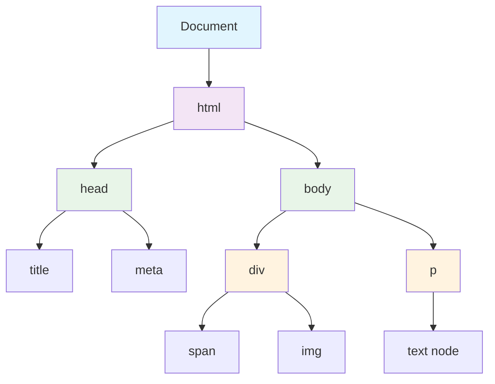

# 🌐 Document Object Model (DOM)

## 🎯 Understanding the DOM

The Document Object Model (DOM) is a programming interface for HTML and XML documents. It represents the page structure as a tree of objects that can be manipulated with JavaScript.



### 🌳 DOM Tree Structure

```javascript
// DOM represents HTML as a tree structure
console.log(document.nodeType);        // 9 (DOCUMENT_NODE)
console.log(document.documentElement); // <html> element
console.log(document.head);            // <head> element
console.log(document.body);            // <body> element

// Node types
const NODE_TYPES = {
    ELEMENT_NODE: 1,
    ATTRIBUTE_NODE: 2,
    TEXT_NODE: 3,
    COMMENT_NODE: 8,
    DOCUMENT_NODE: 9,
    DOCUMENT_FRAGMENT_NODE: 11
};
```

## 🔍 Selecting DOM Elements

### 🎯 Basic Selection Methods

```javascript
// getElementById - most efficient for single element
let container = document.getElementById('container');
console.log(container); // <div id="container">

// getElementsByClassName - returns HTMLCollection (live)
let items = document.getElementsByClassName('item');
console.log(items.length); // 3
console.log(items[0]);      // First <li class="item">

// querySelector - returns first matching element
let title = document.querySelector('.title');
let firstItem = document.querySelector('.item');
let button = document.querySelector('#btn');

console.log(title);     // <h1 class="title">
console.log(firstItem); // First <li class="item">
console.log(button);    // <button id="btn">

// querySelectorAll - returns NodeList (static)
let allItems = document.querySelectorAll('.item');
console.log(allItems.length); // 3
console.log(allItems[1]);     // Second <li class="item">
```

## 📝 Reading and Changing Content

### 📖 Getting Element Content

```javascript
let titleElement = document.querySelector('.title');

// Different ways to get content
console.log('innerHTML:', titleElement.innerHTML);     // HTML content
console.log('textContent:', titleElement.textContent); // Text only
console.log('innerText:', titleElement.innerText);     // Visible text only

// Getting computed styles
let computedStyle = window.getComputedStyle(titleElement);
console.log('Color:', computedStyle.color);
console.log('Font size:', computedStyle.fontSize);
```

### ✏️ Modifying Element Content

```javascript
let titleElement = document.querySelector('.title');
let contentElement = document.querySelector('.content');

// Setting content
titleElement.textContent = 'New Title';
contentElement.innerHTML = 'This is <strong>bold</strong> text';

// Creating and inserting new content
let newParagraph = document.createElement('p');
newParagraph.textContent = 'This is a new paragraph';
newParagraph.className = 'new-content';

// Different insertion methods
let container = document.getElementById('container');
container.appendChild(newParagraph);

// Modern insertion methods
titleElement.insertAdjacentHTML('afterend', '<div class="warning">Warning message</div>');
titleElement.insertAdjacentText('afterbegin', 'Prefix: ');
```

## 🎨 Modifying Styles and Attributes

### 🎨 Working with CSS Styles

```javascript
let element = document.querySelector('.title');

// Inline styles
element.style.color = 'blue';
element.style.fontSize = '24px';
element.style.backgroundColor = 'lightgray';

// Setting multiple styles at once
Object.assign(element.style, {
    color: 'red',
    fontSize: '28px',
    margin: '20px',
    border: '2px solid black'
});

// Working with CSS classes
element.classList.add('new-class');
element.classList.remove('old-class');
element.classList.toggle('active');
element.classList.replace('primary', 'secondary');

console.log('Contains "active":', element.classList.contains('active'));
```

### 🏷️ Working with Attributes

```javascript
let button = document.querySelector('#btn');

// Setting attributes
button.setAttribute('disabled', 'true');
button.setAttribute('data-action', 'submit');
button.setAttribute('aria-label', 'Submit form');

// Getting attributes
console.log('ID:', button.getAttribute('id'));
console.log('Data action:', button.getAttribute('data-action'));

// Data attributes
button.dataset.userId = '123';
button.dataset.userName = 'john_doe';

console.log('User ID:', button.dataset.userId);
console.log('User name:', button.dataset.userName);
```

## 🏗️ Creating and Removing Elements

### 🔨 Creating New Elements

```javascript
// Basic element creation
let newDiv = document.createElement('div');
let newParagraph = document.createElement('p');

// Setting properties
newDiv.id = 'dynamic-container';
newDiv.className = 'container dynamic';
newDiv.textContent = 'This is a dynamically created div';

// Creating complex structures
function createCard(title, content) {
    let card = document.createElement('div');
    card.className = 'card';
    
    let cardTitle = document.createElement('h3');
    cardTitle.textContent = title;
    cardTitle.className = 'card-title';
    
    let cardContent = document.createElement('p');
    cardContent.textContent = content;
    cardContent.className = 'card-content';
    
    card.appendChild(cardTitle);
    card.appendChild(cardContent);
    
    return card;
}

let card = createCard('Sample Card', 'This is sample content');
document.body.appendChild(card);
```

### 🗑️ Removing Elements

```javascript
// Modern method (preferred)
let elementToRemove = document.querySelector('.remove-target');
if (elementToRemove) {
    elementToRemove.remove();
}

// Removing multiple elements
let elementsToRemove = document.querySelectorAll('.remove-multiple');
elementsToRemove.forEach(element => element.remove());

// Removing all children
let container = document.getElementById('container');
container.innerHTML = ''; // Fast but loses event listeners

// Alternative method preserving event listeners
while (container.firstChild) {
    container.removeChild(container.firstChild);
}
```

## 🚶‍♂️ DOM Traversal

### 🧭 Navigating the DOM Tree

```javascript
let currentElement = document.querySelector('.current');

// Parent navigation
console.log('Parent element:', currentElement.parentElement);

// Child navigation
console.log('All children:', currentElement.children);
console.log('First child:', currentElement.firstElementChild);
console.log('Last child:', currentElement.lastElementChild);

// Sibling navigation
console.log('Next sibling:', currentElement.nextElementSibling);
console.log('Previous sibling:', currentElement.previousElementSibling);

// Advanced traversal
function findAncestor(element, selector) {
    let current = element.parentElement;
    
    while (current && !current.matches(selector)) {
        current = current.parentElement;
    }
    
    return current;
}

function getSiblings(element) {
    return Array.from(element.parentElement.children)
        .filter(sibling => sibling !== element);
}
```

## 💡 Best Practices

### ✅ DOM Best Practices

```javascript
// ✅ Cache DOM queries
let container = document.getElementById('container');
let items = container.querySelectorAll('.item');

// ✅ Use document fragments for multiple insertions
let fragment = document.createDocumentFragment();
for (let i = 0; i < 100; i++) {
    let div = document.createElement('div');
    div.textContent = `Item ${i}`;
    fragment.appendChild(div);
}
container.appendChild(fragment);

// ✅ Use textContent for user input to prevent XSS
function displayUserContent(element, userInput) {
    element.textContent = userInput; // Safe
}

// ✅ Check for element existence
let element = document.getElementById('maybe-exists');
if (element) {
    element.style.color = 'red';
}
```

### ⚠️ Common Pitfalls

```javascript
// ❌ Repeated DOM queries
// document.getElementById('container').style.color = 'red';
// document.getElementById('container').style.fontSize = '16px';

// ✅ Cache the query
let container = document.getElementById('container');
container.style.color = 'red';
container.style.fontSize = '16px';

// ❌ Assuming elements exist
// let element = document.getElementById('nonexistent');
// element.style.color = 'red'; // TypeError!

// ✅ Always check for existence
let element = document.getElementById('maybe-exists');
if (element) {
    element.style.color = 'red';
}
```

---

**Next Chapter**: [⚡ Event Handling](15_Event_Handling.md)