# ⚡ Event Handling

## 🎯 Understanding Events

Events are actions that occur in the browser - user interactions, page loading, network requests, etc. JavaScript can listen for and respond to these events.

```mermaid
graph TD
    A[Event System] --> B[🖱️ Mouse Events]
    A --> C[⌨️ Keyboard Events]
    A --> D[📄 Document Events]
    A --> E[🌐 Window Events]
    A --> F[📝 Form Events]
    
    B --> B1[click, dblclick<br/>mousedown, mouseup<br/>mouseover, mouseout]
    C --> C1[keydown, keyup<br/>keypress<br/>input]
    D --> D1[DOMContentLoaded<br/>load, unload<br/>scroll]
    E --> E1[resize, scroll<br/>focus, blur<br/>beforeunload]
    F --> F1[submit, reset<br/>change, input<br/>focus, blur]
```



### 🎪 Event Fundamentals

```javascript
// Basic event listener
let button = document.getElementById('myButton');

button.addEventListener('click', function(event) {
    console.log('Button clicked!');
    console.log('Event type:', event.type);
    console.log('Target element:', event.target);
    console.log('Current target:', event.currentTarget);
});

// Arrow function event handler
button.addEventListener('click', (e) => {
    console.log('Arrow function handler');
});

// Multiple event listeners on same element
button.addEventListener('click', handleClick1);
button.addEventListener('click', handleClick2);

function handleClick1() {
    console.log('First handler');
}

function handleClick2() {
    console.log('Second handler');
}
```

## 🖱️ Mouse Events

```javascript
let element = document.getElementById('interactive');

// Mouse click events
element.addEventListener('click', (e) => {
    console.log('Single click at:', e.clientX, e.clientY);
});

element.addEventListener('dblclick', (e) => {
    console.log('Double click');
});

// Mouse button events
element.addEventListener('mousedown', (e) => {
    console.log('Mouse button pressed:', e.button);
    // 0 = left, 1 = middle, 2 = right
});

element.addEventListener('mouseup', (e) => {
    console.log('Mouse button released');
});

// Mouse movement events
element.addEventListener('mouseover', (e) => {
    console.log('Mouse entered element');
    e.target.style.backgroundColor = 'lightblue';
});

element.addEventListener('mouseout', (e) => {
    console.log('Mouse left element');
    e.target.style.backgroundColor = '';
});

element.addEventListener('mousemove', (e) => {
    console.log('Mouse position:', e.clientX, e.clientY);
});
```

## ⌨️ Keyboard Events

```javascript
let input = document.getElementById('textInput');

// Keyboard events
input.addEventListener('keydown', (e) => {
    console.log('Key pressed:', e.key, 'Code:', e.code);
    
    // Special keys
    if (e.key === 'Enter') {
        console.log('Enter key pressed');
    }
    
    if (e.ctrlKey && e.key === 's') {
        e.preventDefault(); // Prevent browser save
        console.log('Ctrl+S pressed');
    }
});

input.addEventListener('keyup', (e) => {
    console.log('Key released:', e.key);
});

input.addEventListener('input', (e) => {
    console.log('Input value changed:', e.target.value);
});
```

## 📝 Form Events

```javascript
let form = document.getElementById('myForm');
let nameInput = document.getElementById('name');
let emailInput = document.getElementById('email');

// Form submission
form.addEventListener('submit', (e) => {
    e.preventDefault(); // Prevent default form submission
    
    let formData = new FormData(form);
    console.log('Form data:', Object.fromEntries(formData));
    
    // Custom validation
    if (!nameInput.value.trim()) {
        alert('Name is required');
        return;
    }
    
    console.log('Form is valid, submitting...');
});

// Input events
nameInput.addEventListener('input', (e) => {
    console.log('Name input changed:', e.target.value);
});

emailInput.addEventListener('change', (e) => {
    console.log('Email changed:', e.target.value);
});

// Focus events
nameInput.addEventListener('focus', (e) => {
    console.log('Name input focused');
    e.target.style.borderColor = 'blue';
});

nameInput.addEventListener('blur', (e) => {
    console.log('Name input lost focus');
    e.target.style.borderColor = '';
});
```

## 🌊 Event Propagation

### 🎯 Bubbling and Capturing

```javascript
// Event propagation example
let outer = document.getElementById('outer');
let middle = document.getElementById('middle');
let inner = document.getElementById('inner');

// Bubbling phase (default)
outer.addEventListener('click', () => {
    console.log('Outer clicked (bubbling)');
});

middle.addEventListener('click', () => {
    console.log('Middle clicked (bubbling)');
});

inner.addEventListener('click', () => {
    console.log('Inner clicked (bubbling)');
});

// Capturing phase
outer.addEventListener('click', () => {
    console.log('Outer clicked (capturing)');
}, true);

middle.addEventListener('click', () => {
    console.log('Middle clicked (capturing)');
}, true);

inner.addEventListener('click', () => {
    console.log('Inner clicked (capturing)');
}, true);

// Stopping propagation
inner.addEventListener('click', (e) => {
    e.stopPropagation(); // Stops bubbling
    console.log('Propagation stopped');
});

// Preventing default behavior
let link = document.getElementById('myLink');
link.addEventListener('click', (e) => {
    e.preventDefault(); // Prevents navigation
    console.log('Link click prevented');
});
```

## 🎯 Event Delegation

```javascript
// Event delegation - handling events on parent element
let list = document.getElementById('itemList');

list.addEventListener('click', (e) => {
    if (e.target.matches('.list-item')) {
        console.log('List item clicked:', e.target.textContent);
    }
    
    if (e.target.matches('.delete-btn')) {
        e.target.closest('.list-item').remove();
    }
    
    if (e.target.matches('.edit-btn')) {
        let item = e.target.closest('.list-item');
        let text = item.querySelector('.item-text');
        text.contentEditable = true;
        text.focus();
    }
});

// Adding new items dynamically
function addListItem(text) {
    let item = document.createElement('li');
    item.className = 'list-item';
    item.innerHTML = `
        <span class="item-text">${text}</span>
        <button class="edit-btn">Edit</button>
        <button class="delete-btn">Delete</button>
    `;
    list.appendChild(item);
}

// New items automatically get event handling through delegation
addListItem('New item 1');
addListItem('New item 2');
```

## 🔧 Advanced Event Techniques

### 🎛️ Custom Events

```javascript
// Creating custom events
let customEvent = new CustomEvent('userLogin', {
    detail: {
        username: 'john_doe',
        timestamp: new Date(),
        sessionId: 'abc123'
    },
    bubbles: true,
    cancelable: true
});

// Listening for custom events
document.addEventListener('userLogin', (e) => {
    console.log('User logged in:', e.detail);
});

// Dispatching custom events
document.dispatchEvent(customEvent);

// Custom event class
class EventEmitter {
    constructor() {
        this.events = {};
    }
    
    on(event, callback) {
        if (!this.events[event]) {
            this.events[event] = [];
        }
        this.events[event].push(callback);
    }
    
    emit(event, data) {
        if (this.events[event]) {
            this.events[event].forEach(callback => callback(data));
        }
    }
    
    off(event, callback) {
        if (this.events[event]) {
            this.events[event] = this.events[event].filter(cb => cb !== callback);
        }
    }
}

let emitter = new EventEmitter();
emitter.on('dataUpdate', (data) => {
    console.log('Data updated:', data);
});

emitter.emit('dataUpdate', { id: 1, value: 'new data' });
```

---

**Next Chapter**: [⏰ Timers and Scheduling](16_Timers_and_Scheduling.md)