# ⏰ Timers and Scheduling

## 🎯 JavaScript Timers

JavaScript provides several methods for scheduling code execution at specific times or intervals.

```mermaid
graph TD
    A[JavaScript Timers] --> B[⏱️ setTimeout]
    A --> C[🔄 setInterval]
    A --> D[🚫 clearTimeout]
    A --> E[🛑 clearInterval]
    A --> F[🎬 requestAnimationFrame]
    
    B --> B1[One-time execution<br/>Delayed execution<br/>Asynchronous]
    C --> C1[Repeated execution<br/>Fixed intervals<br/>Continuous]
    D --> D1[Cancel setTimeout<br/>Prevent execution]
    E --> E1[Cancel setInterval<br/>Stop repetition]
    F --> F1[Smooth animations<br/>60 FPS target<br/>Browser optimized]
```



### ⏱️ setTimeout

```javascript
// Basic setTimeout
setTimeout(() => {
    console.log('This runs after 2 seconds');
}, 2000);

// setTimeout with function reference
function delayedFunction() {
    console.log('Delayed function executed');
}

let timeoutId = setTimeout(delayedFunction, 1000);

// setTimeout with parameters
setTimeout((name, age) => {
    console.log(`Hello ${name}, you are ${age} years old`);
}, 1500, 'Alice', 25);

// Clearing timeout
let cancelableTimeout = setTimeout(() => {
    console.log('This will not run');
}, 3000);

clearTimeout(cancelableTimeout);

// Practical example: Debounce function
function debounce(func, delay) {
    let timeoutId;
    
    return function(...args) {
        clearTimeout(timeoutId);
        timeoutId = setTimeout(() => func.apply(this, args), delay);
    };
}

let searchInput = document.getElementById('search');
let debouncedSearch = debounce((query) => {
    console.log('Searching for:', query);
}, 300);

searchInput.addEventListener('input', (e) => {
    debouncedSearch(e.target.value);
});
```

### 🔄 setInterval

```javascript
// Basic setInterval
let counter = 0;
let intervalId = setInterval(() => {
    counter++;
    console.log('Counter:', counter);
    
    if (counter >= 5) {
        clearInterval(intervalId);
        console.log('Interval cleared');
    }
}, 1000);

// Clock example
function updateClock() {
    let now = new Date();
    let timeString = now.toLocaleTimeString();
    console.log('Current time:', timeString);
    
    let clockElement = document.getElementById('clock');
    if (clockElement) {
        clockElement.textContent = timeString;
    }
}

let clockInterval = setInterval(updateClock, 1000);
updateClock(); // Initial call

// Progress bar example
function createProgressBar(duration) {
    let progress = 0;
    let increment = 100 / (duration / 100);
    
    let progressInterval = setInterval(() => {
        progress += increment;
        
        let progressBar = document.getElementById('progress');
        if (progressBar) {
            progressBar.style.width = progress + '%';
        }
        
        console.log('Progress:', Math.round(progress) + '%');
        
        if (progress >= 100) {
            clearInterval(progressInterval);
            console.log('Progress complete!');
        }
    }, 100);
    
    return progressInterval;
}

let progressId = createProgressBar(5000); // 5 second progress bar
```

### 🎬 requestAnimationFrame

```javascript
// Basic animation with requestAnimationFrame
let box = document.getElementById('animatedBox');
let position = 0;
let direction = 1;

function animate() {
    position += direction * 2;
    
    if (position >= 300 || position <= 0) {
        direction *= -1;
    }
    
    if (box) {
        box.style.left = position + 'px';
    }
    
    requestAnimationFrame(animate);
}

animate();

// Smooth scrolling animation
function smoothScrollTo(targetY, duration = 1000) {
    let startY = window.pageYOffset;
    let distance = targetY - startY;
    let startTime = null;
    
    function animation(currentTime) {
        if (startTime === null) startTime = currentTime;
        
        let timeElapsed = currentTime - startTime;
        let progress = Math.min(timeElapsed / duration, 1);
        
        // Easing function
        let ease = progress * (2 - progress);
        
        window.scrollTo(0, startY + distance * ease);
        
        if (progress < 1) {
            requestAnimationFrame(animation);
        }
    }
    
    requestAnimationFrame(animation);
}

// Usage
let scrollButton = document.getElementById('scrollButton');
if (scrollButton) {
    scrollButton.addEventListener('click', () => {
        smoothScrollTo(1000); // Scroll to 1000px
    });
}
```

## 🛠️ Advanced Timer Patterns

### 🎯 Timer Utilities

```javascript
// Delay utility (Promise-based)
function delay(ms) {
    return new Promise(resolve => setTimeout(resolve, ms));
}

// Usage with async/await
async function delayedExecution() {
    console.log('Starting...');
    await delay(2000);
    console.log('After 2 seconds');
    await delay(1000);
    console.log('After 3 seconds total');
}

delayedExecution();

// Throttle function
function throttle(func, limit) {
    let inThrottle;
    
    return function(...args) {
        if (!inThrottle) {
            func.apply(this, args);
            inThrottle = true;
            setTimeout(() => inThrottle = false, limit);
        }
    };
}

let throttledScroll = throttle(() => {
    console.log('Scroll event throttled');
}, 100);

window.addEventListener('scroll', throttledScroll);

// Retry with exponential backoff
async function retryWithBackoff(fn, maxRetries = 3, baseDelay = 1000) {
    for (let attempt = 1; attempt <= maxRetries; attempt++) {
        try {
            return await fn();
        } catch (error) {
            if (attempt === maxRetries) {
                throw error;
            }
            
            let delayTime = baseDelay * Math.pow(2, attempt - 1);
            console.log(`Attempt ${attempt} failed, retrying in ${delayTime}ms`);
            await delay(delayTime);
        }
    }
}

// Usage
async function unreliableFunction() {
    if (Math.random() < 0.7) {
        throw new Error('Random failure');
    }
    return 'Success!';
}

retryWithBackoff(unreliableFunction)
    .then(result => console.log(result))
    .catch(error => console.error('All retries failed:', error));
```

---

**Next Chapter**: [🔄 Promises and Async Programming](17_Promises_and_Async_Programming.md)