---
tags:
  - javascript
  - promises
  - async-await
  - asynchronous
  - event-loop
  - callbacks
  - advanced
date: 2025-01-25
aliases:
  - Promises and Async Programming
  - Asynchronous JavaScript
  - Async/Await
---

# 17. Promises and Async Programming 🔄

## 📜 Table of Contents
- [[#Overview|Overview]]
- [[#Promise Fundamentals|🤝 Promise Fundamentals]]
- [[#Async/Await Syntax|⏳ Async/Await Syntax]]
- [[#Error Handling|🛡️ Error Handling]]
- [[#Promise Utilities|🔧 Promise Utilities]]
- [[#Event Loop Understanding|🔄 Event Loop Understanding]]
- [[#Best Practices|💡 Best Practices]]
- [[#Related Links & Next Steps|Navigation]]

## Overview
JavaScript is single-threaded but can handle asynchronous operations through the event loop, callbacks, promises, and async/await. This chapter covers modern asynchronous programming patterns that are essential for handling API calls, file operations, and other non-blocking operations.

```mermaid
graph TD
    A[Asynchronous JavaScript] --> B[📞 Callbacks]
    A --> C[🤝 Promises]
    A --> D[⏳ Async/Await]
    A --> E[🔄 Event Loop]
    
    B --> B1[Callback Hell<br/>Error Handling<br/>Nested Functions]
    C --> C1[Pending State<br/>Fulfilled State<br/>Rejected State]
    D --> D1[Synchronous Syntax<br/>Error Handling<br/>Sequential Code]
    E --> E1[Call Stack<br/>Task Queue<br/>Microtask Queue]
```



### 🤝 Promise Fundamentals

```javascript
// Creating a basic Promise
let myPromise = new Promise((resolve, reject) => {
    let success = Math.random() > 0.5;
    
    setTimeout(() => {
        if (success) {
            resolve('Operation successful!');
        } else {
            reject(new Error('Operation failed!'));
        }
    }, 1000);
});

// Consuming a Promise
myPromise
    .then(result => {
        console.log('Success:', result);
    })
    .catch(error => {
        console.error('Error:', error.message);
    })
    .finally(() => {
        console.log('Promise completed');
    });

// Promise states
console.log('Promise state:', myPromise); // Promise { <pending> }

// Immediately resolved Promise
let resolvedPromise = Promise.resolve('Immediate success');
resolvedPromise.then(result => console.log(result));

// Immediately rejected Promise
let rejectedPromise = Promise.reject(new Error('Immediate failure'));
rejectedPromise.catch(error => console.error(error.message));
```

### 🔗 Promise Chaining

```javascript
// Sequential operations with Promise chaining
function fetchUserData(userId) {
    return new Promise((resolve) => {
        setTimeout(() => {
            resolve({ id: userId, name: `User ${userId}` });
        }, 1000);
    });
}

function fetchUserPosts(user) {
    return new Promise((resolve) => {
        setTimeout(() => {
            resolve([
                { id: 1, title: 'Post 1', author: user.name },
                { id: 2, title: 'Post 2', author: user.name }
            ]);
        }, 800);
    });
}

function fetchPostComments(post) {
    return new Promise((resolve) => {
        setTimeout(() => {
            resolve([
                { id: 1, text: 'Great post!', postId: post.id },
                { id: 2, text: 'Thanks for sharing', postId: post.id }
            ]);
        }, 600);
    });
}

// Promise chain
fetchUserData(123)
    .then(user => {
        console.log('User fetched:', user);
        return fetchUserPosts(user);
    })
    .then(posts => {
        console.log('Posts fetched:', posts);
        return fetchPostComments(posts[0]);
    })
    .then(comments => {
        console.log('Comments fetched:', comments);
    })
    .catch(error => {
        console.error('Chain failed:', error);
    });
```

## ⏳ Async/Await

### 🎯 Basic Async/Await

```javascript
// Converting Promise chain to async/await
async function getUserDataComplete(userId) {
    try {
        console.log('Fetching user data...');
        
        let user = await fetchUserData(userId);
        console.log('User fetched:', user);
        
        let posts = await fetchUserPosts(user);
        console.log('Posts fetched:', posts);
        
        let comments = await fetchPostComments(posts[0]);
        console.log('Comments fetched:', comments);
        
        return {
            user,
            posts,
            comments
        };
    } catch (error) {
        console.error('Error in getUserDataComplete:', error);
        throw error;
    }
}

// Using the async function
getUserDataComplete(456)
    .then(result => {
        console.log('Complete data:', result);
    })
    .catch(error => {
        console.error('Failed to get complete data:', error);
    });

// Async function with multiple awaits
async function processMultipleUsers(userIds) {
    let results = [];
    
    for (let userId of userIds) {
        try {
            let userData = await getUserDataComplete(userId);
            results.push(userData);
        } catch (error) {
            console.error(`Failed to process user ${userId}:`, error);
            results.push({ error: error.message, userId });
        }
    }
    
    return results;
}

processMultipleUsers([1, 2, 3]).then(results => {
    console.log('All users processed:', results);
});
```

## 🚀 Promise Utilities

### 🔄 Promise.all()

```javascript
// Promise.all - wait for all promises to resolve
let promise1 = fetchUserData(1);
let promise2 = fetchUserData(2);
let promise3 = fetchUserData(3);

Promise.all([promise1, promise2, promise3])
    .then(users => {
        console.log('All users fetched:', users);
    })
    .catch(error => {
        console.error('One or more promises failed:', error);
    });

// With async/await
async function fetchAllUsers() {
    try {
        let users = await Promise.all([
            fetchUserData(1),
            fetchUserData(2),
            fetchUserData(3)
        ]);
        
        console.log('All users:', users);
        return users;
    } catch (error) {
        console.error('Failed to fetch all users:', error);
        throw error;
    }
}
```

### 🏁 Promise.race()

```javascript
// Promise.race - first promise to settle wins
let slowPromise = new Promise(resolve => {
    setTimeout(() => resolve('Slow result'), 3000);
});

let fastPromise = new Promise(resolve => {
    setTimeout(() => resolve('Fast result'), 1000);
});

Promise.race([slowPromise, fastPromise])
    .then(result => {
        console.log('First result:', result); // "Fast result"
    });

// Timeout implementation with Promise.race
function withTimeout(promise, timeoutMs) {
    let timeoutPromise = new Promise((_, reject) => {
        setTimeout(() => {
            reject(new Error(`Operation timed out after ${timeoutMs}ms`));
        }, timeoutMs);
    });
    
    return Promise.race([promise, timeoutPromise]);
}

// Usage
withTimeout(fetchUserData(123), 2000)
    .then(result => console.log('Result within timeout:', result))
    .catch(error => console.error('Timeout or error:', error));
```

### 🛡️ Promise.allSettled()

```javascript
// Promise.allSettled - wait for all promises to settle (resolve or reject)
let mixedPromises = [
    Promise.resolve('Success 1'),
    Promise.reject(new Error('Error 1')),
    Promise.resolve('Success 2'),
    Promise.reject(new Error('Error 2'))
];

Promise.allSettled(mixedPromises)
    .then(results => {
        results.forEach((result, index) => {
            if (result.status === 'fulfilled') {
                console.log(`Promise ${index} succeeded:`, result.value);
            } else {
                console.log(`Promise ${index} failed:`, result.reason.message);
            }
        });
    });

// Practical example: Multiple API calls with error handling
async function fetchMultipleAPIs() {
    let apiCalls = [
        fetch('/api/users'),
        fetch('/api/posts'),
        fetch('/api/comments')
    ];
    
    let results = await Promise.allSettled(apiCalls);
    
    let successfulResults = results
        .filter(result => result.status === 'fulfilled')
        .map(result => result.value);
    
    let errors = results
        .filter(result => result.status === 'rejected')
        .map(result => result.reason);
    
    console.log('Successful API calls:', successfulResults.length);
    console.log('Failed API calls:', errors.length);
    
    return { successes: successfulResults, errors };
}
```

## 🌐 Fetch API and HTTP Requests

### 📡 Basic Fetch Usage

```javascript
// Basic GET request
async function fetchUsers() {
    try {
        let response = await fetch('/api/users');
        
        if (!response.ok) {
            throw new Error(`HTTP error! status: ${response.status}`);
        }
        
        let users = await response.json();
        console.log('Users:', users);
        return users;
    } catch (error) {
        console.error('Fetch error:', error);
        throw error;
    }
}

// POST request with JSON data
async function createUser(userData) {
    try {
        let response = await fetch('/api/users', {
            method: 'POST',
            headers: {
                'Content-Type': 'application/json',
                'Authorization': 'Bearer your-token-here'
            },
            body: JSON.stringify(userData)
        });
        
        if (!response.ok) {
            let errorData = await response.json();
            throw new Error(errorData.message || 'Failed to create user');
        }
        
        let newUser = await response.json();
        console.log('User created:', newUser);
        return newUser;
    } catch (error) {
        console.error('Create user error:', error);
        throw error;
    }
}

// Usage
createUser({
    name: 'John Doe',
    email: 'john@example.com',
    age: 30
}).then(user => {
    console.log('New user ID:', user.id);
}).catch(error => {
    console.error('Failed to create user:', error);
});
```

### 🔧 Advanced Fetch Patterns

```javascript
// Fetch with timeout
async function fetchWithTimeout(url, options = {}, timeoutMs = 5000) {
    let controller = new AbortController();
    let timeoutId = setTimeout(() => controller.abort(), timeoutMs);
    
    try {
        let response = await fetch(url, {
            ...options,
            signal: controller.signal
        });
        
        clearTimeout(timeoutId);
        return response;
    } catch (error) {
        clearTimeout(timeoutId);
        
        if (error.name === 'AbortError') {
            throw new Error(`Request timed out after ${timeoutMs}ms`);
        }
        
        throw error;
    }
}

// Retry mechanism
async function fetchWithRetry(url, options = {}, maxRetries = 3) {
    for (let attempt = 1; attempt <= maxRetries; attempt++) {
        try {
            let response = await fetch(url, options);
            
            if (response.ok) {
                return response;
            }
            
            // Don't retry on client errors (4xx)
            if (response.status >= 400 && response.status < 500) {
                throw new Error(`Client error: ${response.status}`);
            }
            
            // Retry on server errors (5xx)
            if (attempt === maxRetries) {
                throw new Error(`Server error after ${maxRetries} attempts: ${response.status}`);
            }
            
        } catch (error) {
            if (attempt === maxRetries) {
                throw error;
            }
            
            // Exponential backoff
            let delay = Math.pow(2, attempt) * 1000;
            console.log(`Attempt ${attempt} failed, retrying in ${delay}ms...`);
            await new Promise(resolve => setTimeout(resolve, delay));
        }
    }
}

// API client class
class APIClient {
    constructor(baseURL, defaultHeaders = {}) {
        this.baseURL = baseURL;
        this.defaultHeaders = defaultHeaders;
    }
    
    async request(endpoint, options = {}) {
        let url = `${this.baseURL}${endpoint}`;
        let config = {
            headers: {
                ...this.defaultHeaders,
                ...options.headers
            },
            ...options
        };
        
        let response = await fetchWithRetry(url, config);
        
        if (!response.ok) {
            let errorData;
            try {
                errorData = await response.json();
            } catch {
                errorData = { message: response.statusText };
            }
            throw new Error(errorData.message || `HTTP ${response.status}`);
        }
        
        return response.json();
    }
    
    get(endpoint, params = {}) {
        let url = new URL(endpoint, this.baseURL);
        Object.keys(params).forEach(key => {
            url.searchParams.append(key, params[key]);
        });
        
        return this.request(url.pathname + url.search);
    }
    
    post(endpoint, data) {
        return this.request(endpoint, {
            method: 'POST',
            headers: { 'Content-Type': 'application/json' },
            body: JSON.stringify(data)
        });
    }
    
    put(endpoint, data) {
        return this.request(endpoint, {
            method: 'PUT',
            headers: { 'Content-Type': 'application/json' },
            body: JSON.stringify(data)
        });
    }
    
    delete(endpoint) {
        return this.request(endpoint, { method: 'DELETE' });
    }
}

// Usage
let api = new APIClient('https://api.example.com', {
    'Authorization': 'Bearer your-token'
});

async function example() {
    try {
        let users = await api.get('/users', { page: 1, limit: 10 });
        let newUser = await api.post('/users', { name: 'Alice', email: 'alice@example.com' });
        let updatedUser = await api.put(`/users/${newUser.id}`, { name: 'Alice Smith' });
        await api.delete(`/users/${newUser.id}`);
        
        console.log('API operations completed successfully');
    } catch (error) {
        console.error('API error:', error);
    }
}
```

## Related Links & Next Steps

### Navigation
- [[16_Timers_and_Scheduling|← 16. Timers and Scheduling]]
- [[Table Of Content|📚 Table of Contents]]
- [[18_Advanced_Asynchronous_Patterns|18. Advanced Asynchronous Patterns →]]

### Related Concepts
- [[18_Advanced_Asynchronous_Patterns|Advanced Async Patterns]]
- [[25_Error_Handling_and_Debugging|Error Handling Strategies]]
- [[26_Browser_APIs_and_Web_Technologies|Browser APIs]]

---

**Learning Path**: Advanced
**Estimated Time**: 3-4 hours
**Prerequisites**: Functions, callbacks, and basic JavaScript concepts