# 🔧 Advanced Asynchronous Patterns

## 🎯 Promise Utilities and Patterns

Advanced asynchronous programming involves sophisticated patterns for handling complex async operations, error handling, and performance optimization.

```mermaid
graph TD
    A[Advanced Async Patterns] --> B[🔄 Promise Utilities]
    A --> C[⚡ Concurrency Control]
    A --> D[�️ Eyrror Handling]
    A --> E[🎭 Async Generators]
    A --> F[�  Stream Processing]
    
    B --> B1[Promise.any<br/>Custom Utilities<br/>Composition]
    C --> C1[Rate Limiting<br/>Throttling<br/>Queue Management]
    D --> D1[Global Handlers<br/>Retry Logic<br/>Circuit Breakers]
    E --> E1[Async Iteration<br/>Lazy Evaluation<br/>Data Streams]
    F --> F1[Transform Streams<br/>Backpressure<br/>Pipeline Processing]
```



### 🚀 Advanced Promise Utilities

```javascript
// Promise.any() - first successful promise
async function fetchFromMultipleSources(urls) {
    try {
        // Try multiple sources, return first successful response
        let result = await Promise.any(
            urls.map(url => fetch(url).then(r => r.json()))
        );
        console.log('First successful result:', result);
        return result;
    } catch (error) {
        // All promises rejected
        console.error('All sources failed:', error);
        throw new Error('No sources available');
    }
}

// Custom Promise utilities
class PromiseUtils {
    // Delay utility
    static delay(ms) {
        return new Promise(resolve => setTimeout(resolve, ms));
    }
    
    // Timeout wrapper
    static timeout(promise, ms, message = 'Operation timed out') {
        return Promise.race([
            promise,
            this.delay(ms).then(() => Promise.reject(new Error(message)))
        ]);
    }
    
    // Retry with exponential backoff
    static async retry(fn, options = {}) {
        const {
            maxAttempts = 3,
            baseDelay = 1000,
            maxDelay = 10000,
            backoffFactor = 2,
            jitter = true
        } = options;
        
        for (let attempt = 1; attempt <= maxAttempts; attempt++) {
            try {
                return await fn();
            } catch (error) {
                if (attempt === maxAttempts) {
                    throw error;
                }
                
                let delay = Math.min(
                    baseDelay * Math.pow(backoffFactor, attempt - 1),
                    maxDelay
                );
                
                // Add jitter to prevent thundering herd
                if (jitter) {
                    delay *= (0.5 + Math.random() * 0.5);
                }
                
                console.log(`Attempt ${attempt} failed, retrying in ${Math.round(delay)}ms`);
                await this.delay(delay);
            }
        }
    }
    
    // Batch processing
    static async batch(items, processor, batchSize = 10) {
        let results = [];
        
        for (let i = 0; i < items.length; i += batchSize) {
            let batch = items.slice(i, i + batchSize);
            let batchResults = await Promise.all(
                batch.map(item => processor(item))
            );
            results.push(...batchResults);
        }
        
        return results;
    }
    
    // Sequential processing
    static async sequence(items, processor) {
        let results = [];
        
        for (let item of items) {
            let result = await processor(item);
            results.push(result);
        }
        
        return results;
    }
    
    // Parallel with concurrency limit
    static async parallel(items, processor, concurrency = 5) {
        let results = new Array(items.length);
        let executing = [];
        
        for (let i = 0; i < items.length; i++) {
            let promise = processor(items[i], i).then(result => {
                results[i] = result;
            });
            
            executing.push(promise);
            
            if (executing.length >= concurrency) {
                await Promise.race(executing);
                executing = executing.filter(p => p !== promise);
            }
        }
        
        await Promise.all(executing);
        return results;
    }
}

// Usage examples
async function demonstratePromiseUtils() {
    // Retry example
    let unreliableAPI = () => {
        if (Math.random() < 0.7) {
            throw new Error('API temporarily unavailable');
        }
        return Promise.resolve({ data: 'Success!' });
    };
    
    try {
        let result = await PromiseUtils.retry(unreliableAPI, {
            maxAttempts: 5,
            baseDelay: 500
        });
        console.log('Retry succeeded:', result);
    } catch (error) {
        console.error('All retries failed:', error);
    }
    
    // Batch processing example
    let numbers = Array.from({ length: 100 }, (_, i) => i + 1);
    let processNumber = async (n) => {
        await PromiseUtils.delay(100);
        return n * n;
    };
    
    let squares = await PromiseUtils.batch(numbers, processNumber, 10);
    console.log('First 10 squares:', squares.slice(0, 10));
}

demonstratePromiseUtils();
```

### ⚡ Concurrency Control

```javascript
// Rate limiter
class RateLimiter {
    constructor(maxRequests, timeWindow) {
        this.maxRequests = maxRequests;
        this.timeWindow = timeWindow;
        this.requests = [];
    }
    
    async acquire() {
        let now = Date.now();
        
        // Remove old requests outside time window
        this.requests = this.requests.filter(
            time => now - time < this.timeWindow
        );
        
        if (this.requests.length >= this.maxRequests) {
            // Wait until oldest request expires
            let oldestRequest = Math.min(...this.requests);
            let waitTime = this.timeWindow - (now - oldestRequest);
            await PromiseUtils.delay(waitTime);
            return this.acquire(); // Recursive call
        }
        
        this.requests.push(now);
    }
}

// Semaphore for concurrency control
class Semaphore {
    constructor(maxConcurrency) {
        this.maxConcurrency = maxConcurrency;
        this.currentConcurrency = 0;
        this.queue = [];
    }
    
    async acquire() {
        return new Promise((resolve) => {
            if (this.currentConcurrency < this.maxConcurrency) {
                this.currentConcurrency++;
                resolve();
            } else {
                this.queue.push(resolve);
            }
        });
    }
    
    release() {
        this.currentConcurrency--;
        
        if (this.queue.length > 0) {
            let next = this.queue.shift();
            this.currentConcurrency++;
            next();
        }
    }
    
    async execute(fn) {
        await this.acquire();
        try {
            return await fn();
        } finally {
            this.release();
        }
    }
}

// Queue with priority
class PriorityQueue {
    constructor() {
        this.queue = [];
        this.processing = false;
    }
    
    async add(task, priority = 0) {
        return new Promise((resolve, reject) => {
            this.queue.push({
                task,
                priority,
                resolve,
                reject
            });
            
            // Sort by priority (higher priority first)
            this.queue.sort((a, b) => b.priority - a.priority);
            
            this.process();
        });
    }
    
    async process() {
        if (this.processing || this.queue.length === 0) {
            return;
        }
        
        this.processing = true;
        
        while (this.queue.length > 0) {
            let { task, resolve, reject } = this.queue.shift();
            
            try {
                let result = await task();
                resolve(result);
            } catch (error) {
                reject(error);
            }
        }
        
        this.processing = false;
    }
}

// Usage examples
async function demonstrateConcurrencyControl() {
    // Rate limiter example
    let rateLimiter = new RateLimiter(5, 1000); // 5 requests per second
    
    async function makeAPICall(id) {
        await rateLimiter.acquire();
        console.log(`Making API call ${id} at ${new Date().toISOString()}`);
        // Simulate API call
        await PromiseUtils.delay(100);
        return `Result ${id}`;
    }
    
    // Make 10 API calls (will be rate limited)
    let apiCalls = Array.from({ length: 10 }, (_, i) => makeAPICall(i + 1));
    await Promise.all(apiCalls);
    
    // Semaphore example
    let semaphore = new Semaphore(3); // Max 3 concurrent operations
    
    async function heavyOperation(id) {
        return semaphore.execute(async () => {
            console.log(`Starting heavy operation ${id}`);
            await PromiseUtils.delay(2000);
            console.log(`Completed heavy operation ${id}`);
            return `Operation ${id} result`;
        });
    }
    
    // Start 10 operations (only 3 will run concurrently)
    let operations = Array.from({ length: 10 }, (_, i) => heavyOperation(i + 1));
    await Promise.all(operations);
}
```

### 🛡️ Advanced Error Handling

```javascript
// Circuit breaker pattern
class CircuitBreaker {
    constructor(options = {}) {
        this.failureThreshold = options.failureThreshold || 5;
        this.recoveryTimeout = options.recoveryTimeout || 60000;
        this.monitoringPeriod = options.monitoringPeriod || 10000;
        
        this.state = 'CLOSED'; // CLOSED, OPEN, HALF_OPEN
        this.failureCount = 0;
        this.lastFailureTime = null;
        this.successCount = 0;
    }
    
    async execute(operation) {
        if (this.state === 'OPEN') {
            if (Date.now() - this.lastFailureTime >= this.recoveryTimeout) {
                this.state = 'HALF_OPEN';
                this.successCount = 0;
            } else {
                throw new Error('Circuit breaker is OPEN');
            }
        }
        
        try {
            let result = await operation();
            this.onSuccess();
            return result;
        } catch (error) {
            this.onFailure();
            throw error;
        }
    }
    
    onSuccess() {
        this.failureCount = 0;
        
        if (this.state === 'HALF_OPEN') {
            this.successCount++;
            if (this.successCount >= 3) {
                this.state = 'CLOSED';
            }
        }
    }
    
    onFailure() {
        this.failureCount++;
        this.lastFailureTime = Date.now();
        
        if (this.failureCount >= this.failureThreshold) {
            this.state = 'OPEN';
        }
    }
    
    getState() {
        return {
            state: this.state,
            failureCount: this.failureCount,
            lastFailureTime: this.lastFailureTime
        };
    }
}

// Global error handling
class AsyncErrorHandler {
    constructor() {
        this.handlers = new Map();
        this.globalHandler = null;
        
        // Handle unhandled promise rejections
        if (typeof window !== 'undefined') {
            window.addEventListener('unhandledrejection', (event) => {
                this.handleUnhandledRejection(event.reason, event.promise);
            });
        } else if (typeof process !== 'undefined') {
            process.on('unhandledRejection', (reason, promise) => {
                this.handleUnhandledRejection(reason, promise);
            });
        }
    }
    
    addHandler(errorType, handler) {
        if (!this.handlers.has(errorType)) {
            this.handlers.set(errorType, []);
        }
        this.handlers.get(errorType).push(handler);
    }
    
    setGlobalHandler(handler) {
        this.globalHandler = handler;
    }
    
    async handleError(error, context = {}) {
        let errorType = error.constructor.name;
        let handlers = this.handlers.get(errorType) || [];
        
        // Try specific handlers first
        for (let handler of handlers) {
            try {
                let handled = await handler(error, context);
                if (handled) return;
            } catch (handlerError) {
                console.error('Error in error handler:', handlerError);
            }
        }
        
        // Fall back to global handler
        if (this.globalHandler) {
            try {
                await this.globalHandler(error, context);
            } catch (handlerError) {
                console.error('Error in global error handler:', handlerError);
            }
        }
    }
    
    handleUnhandledRejection(reason, promise) {
        console.error('Unhandled promise rejection:', reason);
        this.handleError(reason, { promise, unhandled: true });
    }
    
    // Wrapper for async functions
    wrap(fn, context = {}) {
        return async (...args) => {
            try {
                return await fn(...args);
            } catch (error) {
                await this.handleError(error, { ...context, args });
                throw error;
            }
        };
    }
}

// Usage
let errorHandler = new AsyncErrorHandler();

// Add specific error handlers
errorHandler.addHandler('TypeError', async (error, context) => {
    console.log('Handling TypeError:', error.message);
    // Log to monitoring service
    return true; // Mark as handled
});

errorHandler.addHandler('NetworkError', async (error, context) => {
    console.log('Handling NetworkError, retrying...');
    // Implement retry logic
    return false; // Let it propagate
});

// Set global handler
errorHandler.setGlobalHandler(async (error, context) => {
    console.error('Global error handler:', error);
    // Send to error reporting service
});

// Circuit breaker usage
let circuitBreaker = new CircuitBreaker({
    failureThreshold: 3,
    recoveryTimeout: 5000
});

async function unreliableService() {
    if (Math.random() < 0.6) {
        throw new Error('Service unavailable');
    }
    return 'Service response';
}

async function demonstrateCircuitBreaker() {
    for (let i = 0; i < 10; i++) {
        try {
            let result = await circuitBreaker.execute(unreliableService);
            console.log(`Call ${i + 1}: ${result}`);
        } catch (error) {
            console.log(`Call ${i + 1}: ${error.message}`);
        }
        
        console.log('Circuit breaker state:', circuitBreaker.getState());
        await PromiseUtils.delay(1000);
    }
}
```

### 🎭 Async Generators and Iteration

```javascript
// Async generator for data streaming
async function* fetchDataStream(urls) {
    for (let url of urls) {
        try {
            let response = await fetch(url);
            let data = await response.json();
            yield { url, data, success: true };
        } catch (error) {
            yield { url, error: error.message, success: false };
        }
    }
}

// Async generator for pagination
async function* paginatedFetch(baseUrl, pageSize = 10) {
    let page = 1;
    let hasMore = true;
    
    while (hasMore) {
        try {
            let response = await fetch(`${baseUrl}?page=${page}&size=${pageSize}`);
            let data = await response.json();
            
            if (data.items && data.items.length > 0) {
                yield* data.items; // Yield each item individually
                page++;
                hasMore = data.hasMore || data.items.length === pageSize;
            } else {
                hasMore = false;
            }
        } catch (error) {
            console.error(`Error fetching page ${page}:`, error);
            hasMore = false;
        }
    }
}

// Async generator for real-time data
async function* realTimeDataStream(source, interval = 1000) {
    while (true) {
        try {
            let data = await source.getData();
            yield {
                timestamp: new Date(),
                data,
                success: true
            };
        } catch (error) {
            yield {
                timestamp: new Date(),
                error: error.message,
                success: false
            };
        }
        
        await PromiseUtils.delay(interval);
    }
}

// Async iteration utilities
class AsyncIteratorUtils {
    // Transform async iterator
    static async* map(asyncIterable, transform) {
        for await (let item of asyncIterable) {
            yield await transform(item);
        }
    }
    
    // Filter async iterator
    static async* filter(asyncIterable, predicate) {
        for await (let item of asyncIterable) {
            if (await predicate(item)) {
                yield item;
            }
        }
    }
    
    // Take first n items
    static async* take(asyncIterable, count) {
        let taken = 0;
        for await (let item of asyncIterable) {
            if (taken >= count) break;
            yield item;
            taken++;
        }
    }
    
    // Batch items
    static async* batch(asyncIterable, batchSize) {
        let batch = [];
        
        for await (let item of asyncIterable) {
            batch.push(item);
            
            if (batch.length >= batchSize) {
                yield batch;
                batch = [];
            }
        }
        
        if (batch.length > 0) {
            yield batch;
        }
    }
    
    // Convert to array
    static async toArray(asyncIterable) {
        let result = [];
        for await (let item of asyncIterable) {
            result.push(item);
        }
        return result;
    }
    
    // Reduce async iterator
    static async reduce(asyncIterable, reducer, initialValue) {
        let accumulator = initialValue;
        
        for await (let item of asyncIterable) {
            accumulator = await reducer(accumulator, item);
        }
        
        return accumulator;
    }
}

// Usage examples
async function demonstrateAsyncGenerators() {
    // Data streaming example
    let urls = [
        'https://api.example.com/users',
        'https://api.example.com/posts',
        'https://api.example.com/comments'
    ];
    
    console.log('Streaming data from multiple sources:');
    for await (let result of fetchDataStream(urls)) {
        if (result.success) {
            console.log(`✓ ${result.url}: ${result.data.length} items`);
        } else {
            console.log(`✗ ${result.url}: ${result.error}`);
        }
    }
    
    // Paginated data example
    console.log('Fetching paginated data:');
    let itemCount = 0;
    for await (let item of AsyncIteratorUtils.take(
        paginatedFetch('https://api.example.com/items'),
        50
    )) {
        itemCount++;
        if (itemCount % 10 === 0) {
            console.log(`Processed ${itemCount} items...`);
        }
    }
    
    // Transform and filter example
    let processedData = AsyncIteratorUtils.map(
        AsyncIteratorUtils.filter(
            paginatedFetch('https://api.example.com/products'),
            item => item.price > 100
        ),
        item => ({
            id: item.id,
            name: item.name,
            discountedPrice: item.price * 0.9
        })
    );
    
    // Batch processing
    for await (let batch of AsyncIteratorUtils.batch(processedData, 10)) {
        console.log(`Processing batch of ${batch.length} expensive items`);
        // Process batch
    }
}
```

### 🔀 Stream Processing Patterns

```javascript
// Transform stream
class AsyncTransformStream {
    constructor(transform, options = {}) {
        this.transform = transform;
        this.concurrency = options.concurrency || 1;
        this.buffer = [];
        this.processing = 0;
    }
    
    async* process(asyncIterable) {
        let iterator = asyncIterable[Symbol.asyncIterator]();
        let done = false;
        let results = [];
        
        while (!done || this.processing > 0 || results.length > 0) {
            // Fill buffer
            while (this.processing < this.concurrency && !done) {
                let { value, done: iterDone } = await iterator.next();
                
                if (iterDone) {
                    done = true;
                    break;
                }
                
                this.processing++;
                let promise = this.transform(value)
                    .then(result => ({ result, error: null }))
                    .catch(error => ({ result: null, error }))
                    .finally(() => this.processing--);
                
                results.push(promise);
            }
            
            // Yield completed results
            if (results.length > 0) {
                let { result, error } = await results.shift();
                
                if (error) {
                    throw error;
                }
                
                yield result;
            }
        }
    }
}

// Pipeline composition
class AsyncPipeline {
    constructor() {
        this.stages = [];
    }
    
    pipe(stage) {
        this.stages.push(stage);
        return this;
    }
    
    async* process(input) {
        let current = input;
        
        for (let stage of this.stages) {
            if (typeof stage === 'function') {
                current = AsyncIteratorUtils.map(current, stage);
            } else if (stage.process) {
                current = stage.process(current);
            }
        }
        
        yield* current;
    }
}

// Backpressure handling
class BackpressureBuffer {
    constructor(maxSize = 100) {
        this.maxSize = maxSize;
        this.buffer = [];
        this.waitingConsumers = [];
        this.waitingProducers = [];
    }
    
    async push(item) {
        if (this.buffer.length >= this.maxSize) {
            // Wait for space
            await new Promise(resolve => {
                this.waitingProducers.push(resolve);
            });
        }
        
        this.buffer.push(item);
        
        // Notify waiting consumers
        if (this.waitingConsumers.length > 0) {
            let consumer = this.waitingConsumers.shift();
            consumer();
        }
    }
    
    async pop() {
        if (this.buffer.length === 0) {
            // Wait for items
            await new Promise(resolve => {
                this.waitingConsumers.push(resolve);
            });
        }
        
        let item = this.buffer.shift();
        
        // Notify waiting producers
        if (this.waitingProducers.length > 0) {
            let producer = this.waitingProducers.shift();
            producer();
        }
        
        return item;
    }
    
    async* consume() {
        while (true) {
            yield await this.pop();
        }
    }
}

// Usage example
async function demonstrateStreamProcessing() {
    // Create a data source
    async function* dataSource() {
        for (let i = 1; i <= 100; i++) {
            yield { id: i, value: Math.random() * 100 };
            await PromiseUtils.delay(10); // Simulate data arrival
        }
    }
    
    // Create processing pipeline
    let pipeline = new AsyncPipeline()
        .pipe(item => ({ ...item, processed: true }))
        .pipe(new AsyncTransformStream(async item => {
            // Simulate async processing
            await PromiseUtils.delay(50);
            return { ...item, doubled: item.value * 2 };
        }, { concurrency: 5 }))
        .pipe(item => item.doubled > 100 ? item : null)
        .pipe(AsyncIteratorUtils.filter(item => item !== null));
    
    // Process data
    let processedCount = 0;
    for await (let item of pipeline.process(dataSource())) {
        processedCount++;
        console.log(`Processed item ${processedCount}:`, item);
        
        if (processedCount >= 10) break; // Limit output
    }
}

demonstrateStreamProcessing();
```

## 💡 Best Practices

### ✅ Advanced Async Best Practices

```javascript
// ✅ Use appropriate concurrency control
async function processLargeDataset(items) {
    // Don't overwhelm the system
    return PromiseUtils.parallel(items, processItem, 10);
}

// ✅ Implement proper error boundaries
async function robustAsyncOperation() {
    try {
        return await riskyOperation();
    } catch (error) {
        // Log error
        console.error('Operation failed:', error);
        
        // Return fallback or rethrow
        return getFallbackData();
    }
}

// ✅ Use circuit breakers for external services
let apiCircuitBreaker = new CircuitBreaker({
    failureThreshold: 5,
    recoveryTimeout: 30000
});

async function callExternalAPI(data) {
    return apiCircuitBreaker.execute(() => fetch('/api/external', {
        method: 'POST',
        body: JSON.stringify(data)
    }));
}

// ✅ Implement proper cleanup
class AsyncResource {
    constructor() {
        this.active = true;
        this.cleanup = [];
    }
    
    async process() {
        try {
            // Setup resources
            let connection = await this.connect();
            this.cleanup.push(() => connection.close());
            
            // Process data
            return await this.processData(connection);
        } finally {
            // Always cleanup
            await this.dispose();
        }
    }
    
    async dispose() {
        this.active = false;
        await Promise.all(this.cleanup.map(fn => fn()));
        this.cleanup = [];
    }
}
```

---

**Next Chapter**: [🏗️ OOP Fundamentals](19_OOP_Fundamentals.md)