---
tags:
  - javascript
  - oop
  - object-oriented-programming
  - classes
  - objects
  - inheritance
  - prototypes
  - intermediate
date: 2025-01-25
aliases:
  - OOP Fundamentals
  - Object-Oriented Programming
  - JavaScript Classes
---

# 19. OOP Fundamentals 🏗️

## 📜 Table of Contents
- [[#Overview|Overview]]
- [[#Object Literals with Methods|📦 Object Literals with Methods]]
- [[#Constructor Functions|🏗️ Constructor Functions]]
- [[#ES6 Classes|🎭 ES6 Classes]]
- [[#Understanding Prototypes|🔗 Understanding Prototypes]]
- [[#Inheritance Patterns|🧬 Inheritance Patterns]]
- [[#Best Practices|💡 Best Practices]]
- [[#Related Links & Next Steps|Navigation]]

## Overview
JavaScript supports multiple programming paradigms, including object-oriented programming through prototypes, constructor functions, and ES6 classes. This chapter covers the fundamentals of OOP in JavaScript and how to create robust, maintainable object-oriented code.

```mermaid
graph TD
    A[JavaScript OOP] --> B[📦 Object Literals]
    A --> C[🏗️ Constructor Functions]
    A --> D[🎭 ES6 Classes]
    A --> E[🔗 Prototypes]
    A --> F[🧬 Inheritance]
    
    B --> B1[Methods<br/>Properties<br/>this Binding]
    C --> C1[new Keyword<br/>this Context<br/>Prototype Chain]
    D --> D1[Class Syntax<br/>Constructor<br/>Methods]
    E --> E1[Prototype Chain<br/>Shared Methods<br/>Property Lookup]
    F --> F1[extends Keyword<br/>super Calls<br/>Method Override]
```



### 📦 Object Literals with Methods

```javascript
// Basic object with methods
let calculator = {
    result: 0,
    
    add(value) {
        this.result += value;
        return this;
    },
    
    subtract(value) {
        this.result -= value;
        return this;
    },
    
    multiply(value) {
        this.result *= value;
        return this;
    },
    
    divide(value) {
        if (value !== 0) {
            this.result /= value;
        }
        return this;
    },
    
    clear() {
        this.result = 0;
        return this;
    },
    
    getValue() {
        return this.result;
    }
};

// Method chaining
let result = calculator
    .clear()
    .add(10)
    .multiply(2)
    .subtract(5)
    .getValue();

console.log(result); // Output: 15

// Object with computed properties and methods
let user = {
    firstName: 'John',
    lastName: 'Doe',
    age: 30,
    
    // Getter method
    get fullName() {
        return `${this.firstName} ${this.lastName}`;
    },
    
    // Setter method
    set fullName(value) {
        [this.firstName, this.lastName] = value.split(' ');
    },
    
    // Method with validation
    setAge(newAge) {
        if (newAge >= 0 && newAge <= 150) {
            this.age = newAge;
        } else {
            throw new Error('Invalid age');
        }
    },
    
    // Method returning object info
    getInfo() {
        return {
            name: this.fullName,
            age: this.age,
            isAdult: this.age >= 18
        };
    },
    
    // Method with callback
    greet(callback) {
        let greeting = `Hello, I'm ${this.fullName}`;
        if (callback) {
            callback(greeting);
        }
        return greeting;
    }
};

console.log(user.fullName); // Output: John Doe
user.fullName = 'Jane Smith';
console.log(user.firstName); // Output: Jane
console.log(user.getInfo()); // Output: {name: "Jane Smith", age: 30, isAdult: true}

// Factory function for creating objects
function createPerson(firstName, lastName, age) {
    return {
        firstName,
        lastName,
        age,
        
        get fullName() {
            return `${this.firstName} ${this.lastName}`;
        },
        
        introduce() {
            return `Hi, I'm ${this.fullName} and I'm ${this.age} years old.`;
        },
        
        haveBirthday() {
            this.age++;
            return `Happy birthday! I'm now ${this.age}.`;
        }
    };
}

let person1 = createPerson('Alice', 'Johnson', 25);
let person2 = createPerson('Bob', 'Wilson', 32);

console.log(person1.introduce()); // Output: Hi, I'm Alice Johnson and I'm 25 years old.
console.log(person2.haveBirthday()); // Output: Happy birthday! I'm now 33.
```

### 🏗️ Constructor Functions

```javascript
// Basic constructor function
function Person(firstName, lastName, age) {
    this.firstName = firstName;
    this.lastName = lastName;
    this.age = age;
    
    // Method defined in constructor (not recommended for performance)
    this.introduce = function() {
        return `Hi, I'm ${this.firstName} ${this.lastName}`;
    };
}

// Adding methods to prototype (recommended)
Person.prototype.getFullName = function() {
    return `${this.firstName} ${this.lastName}`;
};

Person.prototype.haveBirthday = function() {
    this.age++;
    return this.age;
};

Person.prototype.isAdult = function() {
    return this.age >= 18;
};

// Creating instances
let person1 = new Person('John', 'Doe', 30);
let person2 = new Person('Jane', 'Smith', 25);

console.log(person1.getFullName()); // Output: John Doe
console.log(person2.haveBirthday()); // Output: 26
console.log(person1.isAdult()); // Output: true

// Constructor with validation
function BankAccount(accountNumber, initialBalance = 0) {
    if (!accountNumber) {
        throw new Error('Account number is required');
    }
    
    if (initialBalance < 0) {
        throw new Error('Initial balance cannot be negative');
    }
    
    this.accountNumber = accountNumber;
    this.balance = initialBalance;
    this.transactions = [];
}

BankAccount.prototype.deposit = function(amount) {
    if (amount <= 0) {
        throw new Error('Deposit amount must be positive');
    }
    
    this.balance += amount;
    this.transactions.push({
        type: 'deposit',
        amount: amount,
        balance: this.balance,
        timestamp: new Date()
    });
    
    return this.balance;
};

BankAccount.prototype.withdraw = function(amount) {
    if (amount <= 0) {
        throw new Error('Withdrawal amount must be positive');
    }
    
    if (amount > this.balance) {
        throw new Error('Insufficient funds');
    }
    
    this.balance -= amount;
    this.transactions.push({
        type: 'withdrawal',
        amount: amount,
        balance: this.balance,
        timestamp: new Date()
    });
    
    return this.balance;
};

BankAccount.prototype.getBalance = function() {
    return this.balance;
};

BankAccount.prototype.getTransactionHistory = function() {
    return [...this.transactions]; // Return copy to prevent modification
};

// Usage
let account = new BankAccount('ACC-001', 1000);
console.log(account.deposit(500)); // Output: 1500
console.log(account.withdraw(200)); // Output: 1300
console.log(account.getTransactionHistory());

// Constructor with static methods
function MathUtils() {
    throw new Error('MathUtils cannot be instantiated');
}

MathUtils.PI = 3.14159;
MathUtils.E = 2.71828;

MathUtils.add = function(a, b) {
    return a + b;
};

MathUtils.multiply = function(a, b) {
    return a * b;
};

MathUtils.circleArea = function(radius) {
    return MathUtils.PI * radius * radius;
};

console.log(MathUtils.add(5, 3)); // Output: 8
console.log(MathUtils.circleArea(5)); // Output: 78.53975
```

### 🎭 ES6 Classes

```javascript
// Basic class definition
class Animal {
    constructor(name, species) {
        this.name = name;
        this.species = species;
        this.energy = 100;
    }
    
    // Instance method
    eat(food) {
        console.log(`${this.name} is eating ${food}`);
        this.energy += 10;
        return this;
    }
    
    sleep(hours) {
        console.log(`${this.name} is sleeping for ${hours} hours`);
        this.energy += hours * 5;
        return this;
    }
    
    move() {
        console.log(`${this.name} is moving`);
        this.energy -= 5;
        return this;
    }
    
    // Getter
    get status() {
        if (this.energy > 80) return 'energetic';
        if (this.energy > 50) return 'normal';
        if (this.energy > 20) return 'tired';
        return 'exhausted';
    }
    
    // Setter
    set energy(value) {
        this._energy = Math.max(0, Math.min(100, value));
    }
    
    get energy() {
        return this._energy;
    }
    
    // Static method
    static compareAnimals(animal1, animal2) {
        return animal1.energy - animal2.energy;
    }
    
    // Static property
    static get kingdom() {
        return 'Animalia';
    }
}

// Creating instances
let dog = new Animal('Buddy', 'Dog');
let cat = new Animal('Whiskers', 'Cat');

console.log(dog.eat('kibble').sleep(8).status); // Output: energetic
console.log(Animal.compareAnimals(dog, cat)); // Compare energy levels
console.log(Animal.kingdom); // Output: Animalia

// Class with private fields (ES2022)
class User {
    // Private fields
    #password;
    #loginAttempts = 0;
    
    // Public fields
    username;
    email;
    
    constructor(username, email, password) {
        this.username = username;
        this.email = email;
        this.#password = this.#hashPassword(password);
    }
    
    // Private method
    #hashPassword(password) {
        // Simple hash simulation
        return password.split('').reverse().join('') + '_hashed';
    }
    
    // Public method
    login(password) {
        if (this.#password === this.#hashPassword(password)) {
            this.#loginAttempts = 0;
            return { success: true, message: 'Login successful' };
        } else {
            this.#loginAttempts++;
            return { 
                success: false, 
                message: `Login failed. Attempts: ${this.#loginAttempts}` 
            };
        }
    }
    
    changePassword(oldPassword, newPassword) {
        if (this.#password === this.#hashPassword(oldPassword)) {
            this.#password = this.#hashPassword(newPassword);
            return { success: true, message: 'Password changed successfully' };
        } else {
            return { success: false, message: 'Current password is incorrect' };
        }
    }
    
    // Getter for read-only access to private data
    get loginAttempts() {
        return this.#loginAttempts;
    }
}

let user = new User('john_doe', 'john@example.com', 'secret123');
console.log(user.login('wrong_password')); // Login failed
console.log(user.login('secret123')); // Login successful
// console.log(user.#password); // SyntaxError: Private field '#password' must be declared in an enclosing class

// Class with complex functionality
class TaskManager {
    constructor() {
        this.tasks = [];
        this.nextId = 1;
    }
    
    addTask(title, description = '', priority = 'medium') {
        let task = {
            id: this.nextId++,
            title,
            description,
            priority,
            completed: false,
            createdAt: new Date(),
            completedAt: null
        };
        
        this.tasks.push(task);
        return task;
    }
    
    completeTask(id) {
        let task = this.tasks.find(t => t.id === id);
        if (task) {
            task.completed = true;
            task.completedAt = new Date();
            return task;
        }
        throw new Error(`Task with id ${id} not found`);
    }
    
    removeTask(id) {
        let index = this.tasks.findIndex(t => t.id === id);
        if (index !== -1) {
            return this.tasks.splice(index, 1)[0];
        }
        throw new Error(`Task with id ${id} not found`);
    }
    
    getTasks(filter = 'all') {
        switch (filter) {
            case 'completed':
                return this.tasks.filter(t => t.completed);
            case 'pending':
                return this.tasks.filter(t => !t.completed);
            case 'high-priority':
                return this.tasks.filter(t => t.priority === 'high');
            default:
                return [...this.tasks];
        }
    }
    
    getTaskStats() {
        let total = this.tasks.length;
        let completed = this.tasks.filter(t => t.completed).length;
        let pending = total - completed;
        
        return {
            total,
            completed,
            pending,
            completionRate: total > 0 ? (completed / total * 100).toFixed(1) + '%' : '0%'
        };
    }
    
    // Method chaining support
    chain() {
        return new TaskManagerChain(this);
    }
}

// Helper class for method chaining
class TaskManagerChain {
    constructor(taskManager) {
        this.taskManager = taskManager;
        this.result = null;
    }
    
    add(title, description, priority) {
        this.result = this.taskManager.addTask(title, description, priority);
        return this;
    }
    
    complete(id) {
        this.result = this.taskManager.completeTask(id);
        return this;
    }
    
    remove(id) {
        this.result = this.taskManager.removeTask(id);
        return this;
    }
    
    get() {
        return this.result;
    }
}

// Usage
let taskManager = new TaskManager();

let task1 = taskManager.chain()
    .add('Learn JavaScript', 'Complete OOP chapter', 'high')
    .get();

let task2 = taskManager.addTask('Write tests', 'Unit tests for TaskManager', 'medium');

taskManager.completeTask(task1.id);

console.log('Task Stats:', taskManager.getTaskStats());
console.log('Pending Tasks:', taskManager.getTasks('pending'));
```

### 🔗 Understanding Prototypes

```javascript
// Prototype chain demonstration
function Vehicle(make, model) {
    this.make = make;
    this.model = model;
}

Vehicle.prototype.start = function() {
    return `${this.make} ${this.model} is starting`;
};

Vehicle.prototype.stop = function() {
    return `${this.make} ${this.model} is stopping`;
};

function Car(make, model, doors) {
    Vehicle.call(this, make, model); // Call parent constructor
    this.doors = doors;
}

// Set up inheritance
Car.prototype = Object.create(Vehicle.prototype);
Car.prototype.constructor = Car;

// Add Car-specific methods
Car.prototype.honk = function() {
    return `${this.make} ${this.model} is honking`;
};

// Override parent method
Car.prototype.start = function() {
    return `${this.make} ${this.model} car is starting with ${this.doors} doors`;
};

let myCar = new Car('Toyota', 'Camry', 4);
console.log(myCar.start()); // Output: Toyota Camry car is starting with 4 doors
console.log(myCar.honk()); // Output: Toyota Camry is honking
console.log(myCar.stop()); // Output: Toyota Camry is stopping (inherited)

// Prototype chain inspection
console.log(myCar instanceof Car); // true
console.log(myCar instanceof Vehicle); // true
console.log(myCar.constructor === Car); // true

// Adding methods to existing prototypes
String.prototype.capitalize = function() {
    return this.charAt(0).toUpperCase() + this.slice(1).toLowerCase();
};

Array.prototype.last = function() {
    return this[this.length - 1];
};

console.log('hello world'.capitalize()); // Output: Hello world
console.log([1, 2, 3, 4, 5].last()); // Output: 5

// Prototype-based object creation
let animalPrototype = {
    init(name, species) {
        this.name = name;
        this.species = species;
        return this;
    },
    
    speak() {
        return `${this.name} the ${this.species} makes a sound`;
    },
    
    move() {
        return `${this.name} is moving`;
    }
};

let dogPrototype = Object.create(animalPrototype);
dogPrototype.bark = function() {
    return `${this.name} is barking`;
};

dogPrototype.speak = function() {
    return `${this.name} the dog says woof!`;
};

// Create instances
let dog1 = Object.create(dogPrototype).init('Buddy', 'Golden Retriever');
let dog2 = Object.create(dogPrototype).init('Max', 'German Shepherd');

console.log(dog1.speak()); // Output: Buddy the dog says woof!
console.log(dog2.bark()); // Output: Max is barking
console.log(dog1.move()); // Output: Buddy is moving (inherited)
```

### 🧬 Inheritance Patterns

```javascript
// Classical inheritance with ES6 classes
class Shape {
    constructor(color) {
        this.color = color;
    }
    
    getArea() {
        throw new Error('getArea method must be implemented');
    }
    
    getPerimeter() {
        throw new Error('getPerimeter method must be implemented');
    }
    
    describe() {
        return `A ${this.color} shape with area ${this.getArea()} and perimeter ${this.getPerimeter()}`;
    }
}

class Rectangle extends Shape {
    constructor(color, width, height) {
        super(color); // Call parent constructor
        this.width = width;
        this.height = height;
    }
    
    getArea() {
        return this.width * this.height;
    }
    
    getPerimeter() {
        return 2 * (this.width + this.height);
    }
    
    // Additional method specific to Rectangle
    isSquare() {
        return this.width === this.height;
    }
}

class Circle extends Shape {
    constructor(color, radius) {
        super(color);
        this.radius = radius;
    }
    
    getArea() {
        return Math.PI * this.radius * this.radius;
    }
    
    getPerimeter() {
        return 2 * Math.PI * this.radius;
    }
    
    // Additional method specific to Circle
    getDiameter() {
        return 2 * this.radius;
    }
}

// Usage
let rectangle = new Rectangle('red', 5, 3);
let circle = new Circle('blue', 4);

console.log(rectangle.describe()); // A red shape with area 15 and perimeter 16
console.log(circle.describe()); // A blue shape with area 50.26... and perimeter 25.13...
console.log(rectangle.isSquare()); // false
console.log(circle.getDiameter()); // 8

// Multiple inheritance simulation (mixins)
let Flyable = {
    fly() {
        return `${this.name} is flying`;
    },
    
    land() {
        return `${this.name} is landing`;
    }
};

let Swimmable = {
    swim() {
        return `${this.name} is swimming`;
    },
    
    dive() {
        return `${this.name} is diving`;
    }
};

class Bird extends Animal {
    constructor(name, species, canFly = true) {
        super(name, species);
        this.canFly = canFly;
    }
    
    chirp() {
        return `${this.name} is chirping`;
    }
}

// Add flying capability to birds that can fly
function makeFlyable(bird) {
    if (bird.canFly) {
        Object.assign(bird, Flyable);
    }
    return bird;
}

class Duck extends Bird {
    constructor(name) {
        super(name, 'Duck', true);
    }
    
    quack() {
        return `${this.name} says quack!`;
    }
}

// Add both flying and swimming capabilities to ducks
function makeDuck(duck) {
    Object.assign(duck, Flyable, Swimmable);
    return duck;
}

let duck = makeDuck(new Duck('Donald'));
console.log(duck.fly()); // Donald is flying
console.log(duck.swim()); // Donald is swimming
console.log(duck.quack()); // Donald says quack!

// Abstract class pattern
class AbstractDatabase {
    constructor() {
        if (this.constructor === AbstractDatabase) {
            throw new Error('Abstract class cannot be instantiated');
        }
    }
    
    // Abstract methods (must be implemented by subclasses)
    connect() {
        throw new Error('connect method must be implemented');
    }
    
    query(sql) {
        throw new Error('query method must be implemented');
    }
    
    close() {
        throw new Error('close method must be implemented');
    }
    
    // Concrete method (can be used by all subclasses)
    executeTransaction(queries) {
        this.connect();
        try {
            let results = [];
            for (let query of queries) {
                results.push(this.query(query));
            }
            return results;
        } finally {
            this.close();
        }
    }
}

class MySQLDatabase extends AbstractDatabase {
    connect() {
        console.log('Connecting to MySQL database');
        this.connected = true;
    }
    
    query(sql) {
        if (!this.connected) {
            throw new Error('Not connected to database');
        }
        console.log(`Executing MySQL query: ${sql}`);
        return { result: 'MySQL result', sql };
    }
    
    close() {
        console.log('Closing MySQL connection');
        this.connected = false;
    }
}

class PostgreSQLDatabase extends AbstractDatabase {
    connect() {
        console.log('Connecting to PostgreSQL database');
        this.connected = true;
    }
    
    query(sql) {
        if (!this.connected) {
            throw new Error('Not connected to database');
        }
        console.log(`Executing PostgreSQL query: ${sql}`);
        return { result: 'PostgreSQL result', sql };
    }
    
    close() {
        console.log('Closing PostgreSQL connection');
        this.connected = false;
    }
}

// Usage
let mysqlDb = new MySQLDatabase();
let postgresDb = new PostgreSQLDatabase();

let mysqlResults = mysqlDb.executeTransaction([
    'SELECT * FROM users',
    'SELECT * FROM orders'
]);

let postgresResults = postgresDb.executeTransaction([
    'SELECT * FROM products',
    'SELECT * FROM categories'
]);

console.log('MySQL Results:', mysqlResults);
console.log('PostgreSQL Results:', postgresResults);
```

## 💡 Best Practices

### ✅ OOP Best Practices

```javascript
// ✅ Use meaningful class and method names
class UserAccountManager {
    createUserAccount(userData) {
        // Clear, descriptive method name
    }
    
    validateUserCredentials(username, password) {
        // Self-documenting method name
    }
}

// ✅ Keep classes focused (Single Responsibility Principle)
class User {
    constructor(username, email) {
        this.username = username;
        this.email = email;
    }
    
    // Only user-related methods
    updateEmail(newEmail) {
        this.email = newEmail;
    }
}

class UserValidator {
    // Separate class for validation logic
    static validateEmail(email) {
        return /^[^\s@]+@[^\s@]+\.[^\s@]+$/.test(email);
    }
    
    static validateUsername(username) {
        return username.length >= 3 && /^[a-zA-Z0-9_]+$/.test(username);
    }
}

// ✅ Use composition over inheritance when appropriate
class Engine {
    start() {
        return 'Engine started';
    }
    
    stop() {
        return 'Engine stopped';
    }
}

class Car {
    constructor(make, model) {
        this.make = make;
        this.model = model;
        this.engine = new Engine(); // Composition
    }
    
    start() {
        return this.engine.start();
    }
    
    stop() {
        return this.engine.stop();
    }
}

// ✅ Use private fields for encapsulation
class BankAccount {
    #balance = 0;
    #accountNumber;
    
    constructor(accountNumber) {
        this.#accountNumber = accountNumber;
    }
    
    deposit(amount) {
        if (amount > 0) {
            this.#balance += amount;
        }
    }
    
    getBalance() {
        return this.#balance;
    }
}

// ✅ Implement proper error handling
class SafeCalculator {
    divide(a, b) {
        if (typeof a !== 'number' || typeof b !== 'number') {
            throw new TypeError('Arguments must be numbers');
        }
        
        if (b === 0) {
            throw new Error('Division by zero is not allowed');
        }
        
        return a / b;
    }
}
```

### ⚠️ Common OOP Pitfalls

```javascript
// ❌ Avoid modifying built-in prototypes in production
// Array.prototype.myMethod = function() { ... }; // Don't do this

// ❌ Don't create overly complex inheritance hierarchies
// class A extends B extends C extends D { ... } // Too deep

// ✅ Prefer composition and interfaces
class ComponentA {
    doSomething() { /* ... */ }
}

class ComponentB {
    doSomethingElse() { /* ... */ }
}

class CompositeClass {
    constructor() {
        this.componentA = new ComponentA();
        this.componentB = new ComponentB();
    }
    
    performActions() {
        this.componentA.doSomething();
        this.componentB.doSomethingElse();
    }
}

// ❌ Don't forget to call super() in constructors
class Parent {
    constructor(name) {
        this.name = name;
    }
}

class Child extends Parent {
    constructor(name, age) {
        super(name); // ✅ Must call super()
        this.age = age;
    }
}

// ❌ Avoid tight coupling between classes
// ✅ Use dependency injection instead
class EmailService {
    send(message) {
        console.log('Sending email:', message);
    }
}

class NotificationManager {
    constructor(emailService) {
        this.emailService = emailService; // Injected dependency
    }
    
    notify(message) {
        this.emailService.send(message);
    }
}

let emailService = new EmailService();
let notificationManager = new NotificationManager(emailService);
```

## Related Links & Next Steps

### Navigation
- [[18_Advanced_Asynchronous_Patterns|← 18. Advanced Asynchronous Patterns]]
- [[Table Of Content|📚 Table of Contents]]
- [[20_Advanced_OOP_Concepts|20. Advanced OOP Concepts →]]

### Related Concepts
- [[22_Functional_Programming|Functional Programming Comparison]]
- [[21_Memory_Management_and_Performance|Memory Management in OOP]]
- [[24_Advanced_Language_Features|Advanced Language Features]]

---

**Learning Path**: Intermediate
**Estimated Time**: 3-4 hours
**Prerequisites**: Functions, scope, and basic JavaScript concepts