---
tags:
  - javascript
  - oop
  - design-patterns
  - advanced
  - encapsulation
  - singleton
  - factory
  - observer
  - strategy
date: 2025-01-25
aliases:
  - Advanced OOP Concepts
  - Design Patterns
  - JavaScript Patterns
---

# 20. Advanced OOP Concepts 🎭

## 📜 Table of Contents
- [[#Overview|Overview]]
- [[#Creational Patterns|🏭 Creational Patterns]]
- [[#Behavioral Patterns|🎭 Behavioral Patterns]]
- [[#Encapsulation and Privacy|🔒 Encapsulation and Privacy]]
- [[#Mixins and Composition|🧩 Mixins and Composition]]
- [[#Best Practices|💡 Best Practices]]
- [[#Related Links & Next Steps|Navigation]]

## Overview
Design patterns are reusable solutions to common problems in software design. They represent best practices and provide a shared vocabulary for developers. This chapter covers advanced OOP concepts including design patterns, encapsulation techniques, and composition strategies.

```mermaid
graph TD
    A[Design Patterns] --> B[🏭 Creational Patterns]
    A --> C[🏗️ Structural Patterns]
    A --> D[🎭 Behavioral Patterns]
    A --> E[🔒 Encapsulation Patterns]
    
    B --> B1[Singleton<br/>Factory<br/>Builder]
    C --> C1[Adapter<br/>Decorator<br/>Facade]
    D --> D1[Observer<br/>Strategy<br/>Command]
    E --> E1[Module<br/>Revealing Module<br/>IIFE]
```



### 🏭 Creational Patterns

#### 🔒 Singleton Pattern

```javascript
// Singleton pattern - ensures only one instance exists
class DatabaseConnection {
    constructor() {
        if (DatabaseConnection.instance) {
            return DatabaseConnection.instance;
        }
        
        this.connection = null;
        this.isConnected = false;
        DatabaseConnection.instance = this;
    }
    
    connect() {
        if (!this.isConnected) {
            console.log('Establishing database connection...');
            this.connection = { id: Math.random(), timestamp: Date.now() };
            this.isConnected = true;
        }
        return this.connection;
    }
    
    query(sql) {
        if (!this.isConnected) {
            throw new Error('Database not connected');
        }
        console.log(`Executing query: ${sql}`);
        return { result: 'Query result', sql };
    }
}

// Usage
let db1 = new DatabaseConnection();
let db2 = new DatabaseConnection();
console.log(db1 === db2); // true - same instance
```

#### 🏭 Factory Pattern

```javascript
// Factory pattern - creates objects without specifying exact classes
class Animal {
    constructor(name, type) {
        this.name = name;
        this.type = type;
    }
    
    speak() {
        throw new Error('speak method must be implemented');
    }
}

class Dog extends Animal {
    constructor(name) {
        super(name, 'dog');
    }
    
    speak() {
        return `${this.name} says Woof!`;
    }
}

class Cat extends Animal {
    constructor(name) {
        super(name, 'cat');
    }
    
    speak() {
        return `${this.name} says Meow!`;
    }
}

// Factory class
class AnimalFactory {
    static createAnimal(type, name) {
        switch (type.toLowerCase()) {
            case 'dog':
                return new Dog(name);
            case 'cat':
                return new Cat(name);
            default:
                throw new Error(`Unknown animal type: ${type}`);
        }
    }
}

// Usage
let dog = AnimalFactory.createAnimal('dog', 'Buddy');
let cat = AnimalFactory.createAnimal('cat', 'Whiskers');

console.log(dog.speak()); // Buddy says Woof!
console.log(cat.speak()); // Whiskers says Meow!
```

### 🎭 Behavioral Patterns

#### 👁️ Observer Pattern

```javascript
// Observer pattern - defines one-to-many dependency between objects
class EventEmitter {
    constructor() {
        this.events = {};
    }
    
    on(event, callback) {
        if (!this.events[event]) {
            this.events[event] = [];
        }
        this.events[event].push(callback);
        
        // Return unsubscribe function
        return () => {
            this.events[event] = this.events[event].filter(cb => cb !== callback);
        };
    }
    
    emit(event, data) {
        if (this.events[event]) {
            this.events[event].forEach(callback => callback(data));
        }
    }
    
    off(event, callback) {
        if (this.events[event]) {
            this.events[event] = this.events[event].filter(cb => cb !== callback);
        }
    }
}

// Usage
let emitter = new EventEmitter();

let unsubscribe = emitter.on('user-login', (user) => {
    console.log(`User ${user.name} logged in`);
});

emitter.on('user-login', (user) => {
    console.log(`Welcome back, ${user.name}!`);
});

emitter.emit('user-login', { name: 'Alice', id: 123 });
// Output: User Alice logged in
//         Welcome back, Alice!

unsubscribe(); // Remove first listener
```

#### 🎯 Strategy Pattern

```javascript
// Strategy pattern - defines family of algorithms and makes them interchangeable
class PaymentProcessor {
    constructor(strategy) {
        this.strategy = strategy;
    }
    
    setStrategy(strategy) {
        this.strategy = strategy;
    }
    
    processPayment(amount) {
        return this.strategy.pay(amount);
    }
}

// Payment strategies
class CreditCardPayment {
    constructor(cardNumber, cvv) {
        this.cardNumber = cardNumber;
        this.cvv = cvv;
    }
    
    pay(amount) {
        return `Paid $${amount} using Credit Card ending in ${this.cardNumber.slice(-4)}`;
    }
}

class PayPalPayment {
    constructor(email) {
        this.email = email;
    }
    
    pay(amount) {
        return `Paid $${amount} using PayPal account ${this.email}`;
    }
}

class CryptoPayment {
    constructor(walletAddress) {
        this.walletAddress = walletAddress;
    }
    
    pay(amount) {
        return `Paid $${amount} using Crypto wallet ${this.walletAddress.slice(0, 8)}...`;
    }
}

// Usage
let processor = new PaymentProcessor(new CreditCardPayment('1234567890123456', '123'));
console.log(processor.processPayment(100));

processor.setStrategy(new PayPalPayment('user@example.com'));
console.log(processor.processPayment(50));

processor.setStrategy(new CryptoPayment('1A1zP1eP5QGefi2DMPTfTL5SLmv7DivfNa'));
console.log(processor.processPayment(75));
```

### 🔒 Encapsulation and Privacy

#### 🗝️ Private Fields and Methods

```javascript
// Modern private fields (ES2022)
class BankAccount {
    // Private fields
    #balance = 0;
    #accountNumber;
    #transactions = [];
    
    constructor(accountNumber, initialBalance = 0) {
        this.#accountNumber = accountNumber;
        this.#balance = initialBalance;
    }
    
    // Private method
    #validateAmount(amount) {
        if (typeof amount !== 'number' || amount <= 0) {
            throw new Error('Amount must be a positive number');
        }
    }
    
    #addTransaction(type, amount) {
        this.#transactions.push({
            type,
            amount,
            balance: this.#balance,
            timestamp: new Date()
        });
    }
    
    // Public methods
    deposit(amount) {
        this.#validateAmount(amount);
        this.#balance += amount;
        this.#addTransaction('deposit', amount);
        return this.#balance;
    }
    
    withdraw(amount) {
        this.#validateAmount(amount);
        
        if (amount > this.#balance) {
            throw new Error('Insufficient funds');
        }
        
        this.#balance -= amount;
        this.#addTransaction('withdrawal', amount);
        return this.#balance;
    }
    
    getBalance() {
        return this.#balance;
    }
    
    getAccountNumber() {
        // Return masked account number
        return this.#accountNumber.replace(/\d(?=\d{4})/g, '*');
    }
    
    getTransactionHistory() {
        return [...this.#transactions]; // Return copy
    }
}

let account = new BankAccount('1234567890', 1000);
console.log(account.deposit(500)); // 1500
console.log(account.getBalance()); // 1500
console.log(account.getAccountNumber()); // ******7890
// console.log(account.#balance); // SyntaxError: Private field '#balance' must be declared in an enclosing class
```

#### 🗺️ WeakMap for Private Data

```javascript
// Using WeakMap for private data (pre-ES2022 approach)
const privateData = new WeakMap();

class User {
    constructor(username, email, password) {
        // Store private data in WeakMap
        privateData.set(this, {
            password: this.#hashPassword(password),
            loginAttempts: 0,
            lastLogin: null
        });
        
        // Public properties
        this.username = username;
        this.email = email;
        this.createdAt = new Date();
    }
    
    #hashPassword(password) {
        // Simple hash simulation
        return btoa(password).split('').reverse().join('');
    }
    
    login(password) {
        let private = privateData.get(this);
        let hashedPassword = this.#hashPassword(password);
        
        if (private.password === hashedPassword) {
            private.loginAttempts = 0;
            private.lastLogin = new Date();
            return { success: true, message: 'Login successful' };
        } else {
            private.loginAttempts++;
            return { 
                success: false, 
                message: `Login failed. Attempts: ${private.loginAttempts}` 
            };
        }
    }
    
    changePassword(oldPassword, newPassword) {
        let private = privateData.get(this);
        
        if (private.password === this.#hashPassword(oldPassword)) {
            private.password = this.#hashPassword(newPassword);
            return { success: true, message: 'Password changed' };
        } else {
            return { success: false, message: 'Current password incorrect' };
        }
    }
    
    getLoginAttempts() {
        return privateData.get(this).loginAttempts;
    }
    
    getLastLogin() {
        return privateData.get(this).lastLogin;
    }
}

let user = new User('john_doe', 'john@example.com', 'secret123');
console.log(user.login('wrong')); // Login failed
console.log(user.login('secret123')); // Login successful
console.log(user.getLastLogin()); // Recent timestamp
```

### 🧩 Mixins and Composition

#### 🎭 Mixin Pattern

```javascript
// Mixin pattern - adds functionality to classes
const Timestamped = {
    addTimestamp() {
        this.createdAt = new Date();
        return this;
    },
    
    updateTimestamp() {
        this.updatedAt = new Date();
        return this;
    },
    
    getAge() {
        return this.createdAt ? Date.now() - this.createdAt.getTime() : 0;
    }
};

const Validatable = {
    addValidation(field, validator) {
        if (!this._validators) this._validators = {};
        this._validators[field] = validator;
        return this;
    },
    
    validate() {
        if (!this._validators) return { valid: true, errors: [] };
        
        let errors = [];
        for (let field in this._validators) {
            if (!this._validators[field](this[field])) {
                errors.push(`Invalid ${field}`);
            }
        }
        
        return { valid: errors.length === 0, errors };
    }
};

const Serializable = {
    toJSON() {
        let result = {};
        for (let key in this) {
            if (this.hasOwnProperty(key) && !key.startsWith('_')) {
                result[key] = this[key];
            }
        }
        return result;
    },
    
    fromJSON(json) {
        Object.assign(this, json);
        return this;
    }
};

// Apply mixins to a class
function applyMixins(targetClass, ...mixins) {
    mixins.forEach(mixin => {
        Object.assign(targetClass.prototype, mixin);
    });
}

class Product {
    constructor(name, price) {
        this.name = name;
        this.price = price;
    }
}

// Apply mixins
applyMixins(Product, Timestamped, Validatable, Serializable);

// Usage
let product = new Product('Laptop', 999);
product.addTimestamp()
       .addValidation('price', price => price > 0)
       .addValidation('name', name => name && name.length > 0);

console.log(product.validate()); // { valid: true, errors: [] }
console.log(product.toJSON());
console.log(`Product age: ${product.getAge()}ms`);
```

#### 🏗️ Composition over Inheritance

```javascript
// Composition pattern - build complex objects from simpler ones
class Engine {
    constructor(horsepower, type = 'gasoline') {
        this.horsepower = horsepower;
        this.type = type;
        this.running = false;
    }
    
    start() {
        this.running = true;
        return `${this.type} engine started (${this.horsepower}hp)`;
    }
    
    stop() {
        this.running = false;
        return 'Engine stopped';
    }
    
    getStatus() {
        return {
            type: this.type,
            horsepower: this.horsepower,
            running: this.running
        };
    }
}

class Transmission {
    constructor(type = 'automatic') {
        this.type = type;
        this.gear = 'P'; // Park
    }
    
    shiftTo(gear) {
        this.gear = gear;
        return `Shifted to ${gear}`;
    }
    
    getStatus() {
        return {
            type: this.type,
            currentGear: this.gear
        };
    }
}

class GPS {
    constructor() {
        this.destination = null;
        this.currentLocation = { lat: 0, lng: 0 };
    }
    
    setDestination(destination) {
        this.destination = destination;
        return `Destination set to ${destination}`;
    }
    
    navigate() {
        if (!this.destination) {
            return 'No destination set';
        }
        return `Navigating to ${this.destination}`;
    }
}

// Car class using composition
class Car {
    constructor(make, model, engineSpecs, transmissionType) {
        this.make = make;
        this.model = model;
        
        // Composition - car HAS-A engine, transmission, GPS
        this.engine = new Engine(engineSpecs.horsepower, engineSpecs.type);
        this.transmission = new Transmission(transmissionType);
        this.gps = new GPS();
        
        this.speed = 0;
    }
    
    start() {
        let engineStatus = this.engine.start();
        this.transmission.shiftTo('D');
        return `${this.make} ${this.model}: ${engineStatus}`;
    }
    
    stop() {
        this.speed = 0;
        this.transmission.shiftTo('P');
        let engineStatus = this.engine.stop();
        return `${this.make} ${this.model}: ${engineStatus}`;
    }
    
    accelerate(speedIncrease) {
        if (!this.engine.running) {
            return 'Cannot accelerate - engine not running';
        }
        
        this.speed += speedIncrease;
        return `Accelerating to ${this.speed} mph`;
    }
    
    navigateTo(destination) {
        this.gps.setDestination(destination);
        return this.gps.navigate();
    }
    
    getStatus() {
        return {
            vehicle: `${this.make} ${this.model}`,
            speed: this.speed,
            engine: this.engine.getStatus(),
            transmission: this.transmission.getStatus(),
            destination: this.gps.destination
        };
    }
}

// Usage
let myCar = new Car('Toyota', 'Camry', { horsepower: 200, type: 'hybrid' }, 'automatic');

console.log(myCar.start());
console.log(myCar.accelerate(30));
console.log(myCar.navigateTo('Downtown'));
console.log(myCar.getStatus());
console.log(myCar.stop());

// Electric car - different engine, same composition structure
class ElectricEngine extends Engine {
    constructor(horsepower, batteryCapacity) {
        super(horsepower, 'electric');
        this.batteryCapacity = batteryCapacity;
        this.batteryLevel = 100;
    }
    
    start() {
        this.running = true;
        return `Electric motor started (${this.horsepower}hp, ${this.batteryLevel}% battery)`;
    }
    
    getStatus() {
        return {
            ...super.getStatus(),
            batteryCapacity: this.batteryCapacity,
            batteryLevel: this.batteryLevel
        };
    }
}

class ElectricCar extends Car {
    constructor(make, model, motorSpecs, batteryCapacity) {
        super(make, model, motorSpecs, 'automatic');
        // Replace engine with electric motor
        this.engine = new ElectricEngine(motorSpecs.horsepower, batteryCapacity);
    }
    
    charge(amount) {
        this.engine.batteryLevel = Math.min(100, this.engine.batteryLevel + amount);
        return `Battery charged to ${this.engine.batteryLevel}%`;
    }
}

let electricCar = new ElectricCar('Tesla', 'Model 3', { horsepower: 283 }, 75);
console.log(electricCar.start());
console.log(electricCar.charge(10));
console.log(electricCar.getStatus());
```

## 💡 Best Practices

### ✅ Advanced OOP Best Practices

```javascript
// ✅ Use composition over inheritance
class DatabaseLogger {
    log(message) {
        console.log(`[DB] ${message}`);
    }
}

class FileLogger {
    log(message) {
        console.log(`[FILE] ${message}`);
    }
}

class UserService {
    constructor(logger) {
        this.logger = logger; // Dependency injection
    }
    
    createUser(userData) {
        this.logger.log('Creating user...');
        // User creation logic
        return { id: 1, ...userData };
    }
}

// ✅ Use dependency injection
let dbLogger = new DatabaseLogger();
let userService = new UserService(dbLogger);

// ✅ Follow SOLID principles
// Single Responsibility: Each class has one reason to change
// Open/Closed: Open for extension, closed for modification
// Liskov Substitution: Subtypes must be substitutable for base types
// Interface Segregation: Many specific interfaces better than one general
// Dependency Inversion: Depend on abstractions, not concretions

// ✅ Use private fields for encapsulation
class SecureData {
    #sensitiveInfo;
    
    constructor(data) {
        this.#sensitiveInfo = data;
    }
    
    getPublicInfo() {
        return { id: this.#sensitiveInfo.id };
    }
}

// ✅ Implement proper error handling
class ValidationError extends Error {
    constructor(field, value) {
        super(`Invalid ${field}: ${value}`);
        this.name = 'ValidationError';
        this.field = field;
        this.value = value;
    }
}

class User {
    constructor(email) {
        if (!this.isValidEmail(email)) {
            throw new ValidationError('email', email);
        }
        this.email = email;
    }
    
    isValidEmail(email) {
        return /^[^\s@]+@[^\s@]+\.[^\s@]+$/.test(email);
    }
}
```

## Related Links & Next Steps

### Navigation
- [[19_OOP_Fundamentals|← 19. OOP Fundamentals]]
- [[Table Of Content|📚 Table of Contents]]
- [[21_Memory_Management_and_Performance|21. Memory Management and Performance →]]

### Related Concepts
- [[19_OOP_Fundamentals|OOP Fundamentals]]
- [[22_Functional_Programming|Functional Programming Comparison]]
- [[27_Project_Development_Patterns|Project Architecture]]

---

**Learning Path**: Advanced
**Estimated Time**: 4-5 hours
**Prerequisites**: OOP Fundamentals, ES6 classes, understanding of software design principles