---
tags:
  - javascript
  - memory-management
  - performance
  - optimization
  - garbage-collection
  - profiling
  - advanced
date: 2025-01-25
aliases:
  - Memory Management and Performance
  - JavaScript Performance
  - Memory Optimization
---

# 21. Memory Management and Performance 🧠

## 📜 Table of Contents
- [[#Overview|Overview]]
- [[#Memory Allocation in JavaScript|🏗️ Memory Allocation in JavaScript]]
- [[#Garbage Collection Mechanisms|🗑️ Garbage Collection Mechanisms]]
- [[#WeakMap and WeakSet for Memory Management|🔍 WeakMap and WeakSet for Memory Management]]
- [[#Performance Optimization Techniques|⚡ Performance Optimization Techniques]]
- [[#Memory Profiling and Monitoring|🔍 Memory Profiling and Monitoring]]
- [[#Best Practices for Memory Management|💡 Best Practices for Memory Management]]
- [[#Related Links & Next Steps|Navigation]]

## Overview
JavaScript automatically manages memory through garbage collection, but understanding how it works helps you write more efficient code and avoid memory leaks. This chapter covers memory management principles, performance optimization techniques, and profiling tools for building high-performance applications.

```mermaid
graph TD
    A[JavaScript Memory] --> B[🏗️ Memory Allocation]
    A --> C[🗑️ Garbage Collection]
    A --> D[⚡ Performance Optimization]
    A --> E[🔍 Memory Profiling]
    
    B --> B1[Stack Memory<br/>Heap Memory<br/>Reference Types]
    C --> C1[Mark & Sweep<br/>Reference Counting<br/>Generational GC]
    D --> D1[Code Optimization<br/>Data Structures<br/>Algorithm Choice]
    E --> E1[DevTools Profiler<br/>Memory Snapshots<br/>Performance Monitor]
```



### 🏗️ Memory Allocation in JavaScript

```javascript
// Stack vs Heap memory allocation
function demonstrateMemoryAllocation() {
    // Primitive values stored in stack
    let number = 42;           // Stack
    let string = "Hello";      // Stack (small strings)
    let boolean = true;        // Stack
    
    // Objects stored in heap, references in stack
    let object = { name: "John" };     // Heap
    let array = [1, 2, 3, 4, 5];      // Heap
    let function1 = function() {};     // Heap
    
    // Multiple references to same object
    let obj1 = { value: 100 };
    let obj2 = obj1;  // Both reference same heap location
    
    console.log(obj1 === obj2); // true - same reference
    
    obj1.value = 200;
    console.log(obj2.value);    // 200 - shared object modified
}

demonstrateMemoryAllocation();

// Memory allocation patterns
class MemoryExample {
    constructor() {
        this.data = new Array(1000000).fill(0); // Large array allocation
        this.references = new Map();             // Map for key-value pairs
        this.callbacks = [];                     // Array for function references
    }
    
    addCallback(callback) {
        this.callbacks.push(callback);
        // Potential memory leak if callbacks accumulate
    }
    
    processData() {
        // Temporary objects created and eligible for GC
        let tempArray = this.data.map(x => x * 2);
        let tempObject = { processed: tempArray.length };
        
        return tempObject;
        // tempArray becomes eligible for garbage collection
    }
    
    cleanup() {
        this.callbacks = [];     // Clear references
        this.references.clear(); // Clear Map
        this.data = null;        // Remove large array reference
    }
}
```

### 🗑️ Garbage Collection Mechanisms

```javascript
// Understanding garbage collection
class GarbageCollectionDemo {
    static demonstrateGC() {
        console.log('=== Garbage Collection Demo ===');
        
        // 1. Reference counting (conceptual)
        let obj = { name: "Test" };  // Reference count: 1
        let ref1 = obj;              // Reference count: 2
        let ref2 = obj;              // Reference count: 3
        
        ref1 = null;                 // Reference count: 2
        ref2 = null;                 // Reference count: 1
        obj = null;                  // Reference count: 0 -> eligible for GC
        
        // 2. Circular references (handled by mark-and-sweep)
        function createCircularReference() {
            let parent = { name: "Parent" };
            let child = { name: "Child" };
            
            parent.child = child;
            child.parent = parent;
            
            // Even with circular references, modern GC can clean this up
            // when parent and child go out of scope
        }
        
        createCircularReference();
        // Objects become unreachable and eligible for GC
        
        // 3. Closure memory retention
        function createClosure() {
            let largeData = new Array(100000).fill("data");
            
            return function(index) {
                return largeData[index]; // largeData retained in closure
            };
        }
        
        let accessor = createClosure();
        // largeData array is retained as long as accessor exists
        
        accessor = null; // Now largeData can be garbage collected
    }
    
    // Memory leak examples
    static memoryLeakExamples() {
        console.log('=== Common Memory Leaks ===');
        
        // 1. Global variables
        // BAD: Creates global variable
        function createGlobalLeak() {
            globalVar = new Array(100000); // Implicit global
        }
        
        // GOOD: Use proper scoping
        function properScoping() {
            let localVar = new Array(100000);
            return localVar;
        }
        
        // 2. Event listeners not removed
        class ComponentWithLeak {
            constructor() {
                this.data = new Array(100000);
                
                // BAD: Event listener not removed
                document.addEventListener('click', this.handleClick.bind(this));
            }
            
            handleClick() {
                console.log('Clicked');
            }
            
            // Missing cleanup method
        }
        
        class ComponentWithoutLeak {
            constructor() {
                this.data = new Array(100000);
                this.boundHandler = this.handleClick.bind(this);
                
                document.addEventListener('click', this.boundHandler);
            }
            
            handleClick() {
                console.log('Clicked');
            }
            
            cleanup() {
                // GOOD: Remove event listener
                document.removeEventListener('click', this.boundHandler);
                this.data = null;
            }
        }
        
        // 3. Timers not cleared
        class TimerLeak {
            constructor() {
                this.data = new Array(100000);
                
                // BAD: Timer keeps reference alive
                this.intervalId = setInterval(() => {
                    console.log(this.data.length);
                }, 1000);
            }
            
            cleanup() {
                // GOOD: Clear timer
                clearInterval(this.intervalId);
                this.data = null;
            }
        }
    }
}

GarbageCollectionDemo.demonstrateGC();
GarbageCollectionDemo.memoryLeakExamples();
```

### 🔍 WeakMap and WeakSet for Memory Management

```javascript
// WeakMap and WeakSet for better memory management
class WeakCollectionsDemo {
    static demonstrateWeakMap() {
        console.log('=== WeakMap Demo ===');
        
        // Regular Map keeps strong references
        let regularMap = new Map();
        let obj1 = { id: 1 };
        
        regularMap.set(obj1, 'metadata');
        obj1 = null; // Object still referenced by Map, won't be GC'd
        
        console.log('Regular Map size:', regularMap.size); // 1
        
        // WeakMap allows garbage collection
        let weakMap = new WeakMap();
        let obj2 = { id: 2 };
        
        weakMap.set(obj2, 'metadata');
        // When obj2 goes out of scope, it can be garbage collected
        // even though it's in the WeakMap
        
        // WeakMap use case: Private data
        const privateData = new WeakMap();
        
        class User {
            constructor(name, ssn) {
                this.name = name;
                // Store sensitive data in WeakMap
                privateData.set(this, { ssn: ssn });
            }
            
            getSSN() {
                return privateData.get(this).ssn;
            }
        }
        
        let user = new User('John', '123-45-6789');
        console.log('SSN:', user.getSSN());
        
        user = null; // User object and its private data can be GC'd
    }
    
    static demonstrateWeakSet() {
        console.log('=== WeakSet Demo ===');
        
        // WeakSet for object tracking
        const processedObjects = new WeakSet();
        
        function processObject(obj) {
            if (processedObjects.has(obj)) {
                console.log('Object already processed');
                return;
            }
            
            // Process the object
            console.log('Processing object:', obj.id);
            processedObjects.add(obj);
        }
        
        let item1 = { id: 1, data: 'test' };
        let item2 = { id: 2, data: 'test2' };
        
        processObject(item1); // Processing object: 1
        processObject(item1); // Object already processed
        processObject(item2); // Processing object: 2
        
        // Objects can be GC'd when no longer referenced elsewhere
        item1 = null;
        item2 = null;
    }
}

WeakCollectionsDemo.demonstrateWeakMap();
WeakCollectionsDemo.demonstrateWeakSet();
```

## ⚡ Performance Optimization Techniques

### 🚀 Code Optimization Strategies

```javascript
// Performance optimization examples
class PerformanceOptimization {
    // 1. Efficient loops
    static loopOptimization() {
        console.log('=== Loop Optimization ===');
        
        let largeArray = new Array(1000000).fill(0).map((_, i) => i);
        
        // BAD: Inefficient loop
        function inefficientLoop(arr) {
            let result = [];
            for (let i = 0; i < arr.length; i++) {
                if (arr[i] % 2 === 0) {
                    result.push(arr[i] * 2);
                }
            }
            return result;
        }
        
        // GOOD: Optimized loop
        function optimizedLoop(arr) {
            let result = [];
            let length = arr.length; // Cache length
            
            for (let i = 0; i < length; i++) {
                let value = arr[i]; // Cache array access
                if (value % 2 === 0) {
                    result.push(value * 2);
                }
            }
            return result;
        }
        
        // BETTER: Use built-in methods (often optimized)
        function functionalApproach(arr) {
            return arr
                .filter(x => x % 2 === 0)
                .map(x => x * 2);
        }
        
        // Performance comparison
        console.time('Inefficient');
        inefficientLoop(largeArray.slice(0, 10000));
        console.timeEnd('Inefficient');
        
        console.time('Optimized');
        optimizedLoop(largeArray.slice(0, 10000));
        console.timeEnd('Optimized');
        
        console.time('Functional');
        functionalApproach(largeArray.slice(0, 10000));
        console.timeEnd('Functional');
    }
    
    // 2. Object property access optimization
    static propertyAccessOptimization() {
        console.log('=== Property Access Optimization ===');
        
        let obj = {
            deeply: {
                nested: {
                    property: {
                        value: 42
                    }
                }
            }
        };
        
        // BAD: Repeated deep property access
        function inefficientAccess() {
            for (let i = 0; i < 100000; i++) {
                let value = obj.deeply.nested.property.value;
                // Do something with value
            }
        }
        
        // GOOD: Cache deep property access
        function efficientAccess() {
            let cachedValue = obj.deeply.nested.property.value;
            for (let i = 0; i < 100000; i++) {
                let value = cachedValue;
                // Do something with value
            }
        }
        
        console.time('Inefficient Access');
        inefficientAccess();
        console.timeEnd('Inefficient Access');
        
        console.time('Efficient Access');
        efficientAccess();
        console.timeEnd('Efficient Access');
    }
    
    // 3. String concatenation optimization
    static stringOptimization() {
        console.log('=== String Optimization ===');
        
        let items = new Array(10000).fill('item');
        
        // BAD: String concatenation in loop
        function inefficientStringConcat(arr) {
            let result = '';
            for (let item of arr) {
                result += item + ', ';
            }
            return result;
        }
        
        // GOOD: Array join
        function efficientStringConcat(arr) {
            return arr.join(', ');
        }
        
        // BETTER: Template literals for complex cases
        function templateLiteralApproach(arr) {
            return arr.map(item => `${item}`).join(', ');
        }
        
        console.time('String Concat');
        inefficientStringConcat(items);
        console.timeEnd('String Concat');
        
        console.time('Array Join');
        efficientStringConcat(items);
        console.timeEnd('Array Join');
        
        console.time('Template Literals');
        templateLiteralApproach(items);
        console.timeEnd('Template Literals');
    }
}

PerformanceOptimization.loopOptimization();
PerformanceOptimization.propertyAccessOptimization();
PerformanceOptimization.stringOptimization();
```

### 📊 Advanced Data Structures for Performance

```javascript
// Efficient data structures
class EfficientDataStructures {
    // 1. Map vs Object for key-value storage
    static mapVsObject() {
        console.log('=== Map vs Object Performance ===');
        
        let iterations = 100000;
        
        // Object approach
        let obj = {};
        console.time('Object Set');
        for (let i = 0; i < iterations; i++) {
            obj[`key${i}`] = i;
        }
        console.timeEnd('Object Set');
        
        console.time('Object Get');
        for (let i = 0; i < iterations; i++) {
            let value = obj[`key${i}`];
        }
        console.timeEnd('Object Get');
        
        // Map approach
        let map = new Map();
        console.time('Map Set');
        for (let i = 0; i < iterations; i++) {
            map.set(`key${i}`, i);
        }
        console.timeEnd('Map Set');
        
        console.time('Map Get');
        for (let i = 0; i < iterations; i++) {
            let value = map.get(`key${i}`);
        }
        console.timeEnd('Map Get');
        
        console.log('Object size:', Object.keys(obj).length);
        console.log('Map size:', map.size);
    }
    
    // 2. Set vs Array for unique values
    static setVsArray() {
        console.log('=== Set vs Array for Uniqueness ===');
        
        let data = new Array(10000).fill(0).map(() => Math.floor(Math.random() * 1000));
        
        // Array approach
        console.time('Array Unique');
        let uniqueArray = [];
        for (let item of data) {
            if (!uniqueArray.includes(item)) {
                uniqueArray.push(item);
            }
        }
        console.timeEnd('Array Unique');
        
        // Set approach
        console.time('Set Unique');
        let uniqueSet = new Set(data);
        let uniqueFromSet = Array.from(uniqueSet);
        console.timeEnd('Set Unique');
        
        console.log('Array unique count:', uniqueArray.length);
        console.log('Set unique count:', uniqueFromSet.length);
    }
    
    // 3. Typed Arrays for numerical data
    static typedArrays() {
        console.log('=== Typed Arrays Performance ===');
        
        let size = 1000000;
        
        // Regular Array
        console.time('Regular Array Creation');
        let regularArray = new Array(size);
        for (let i = 0; i < size; i++) {
            regularArray[i] = i;
        }
        console.timeEnd('Regular Array Creation');
        
        // Typed Array
        console.time('Typed Array Creation');
        let typedArray = new Int32Array(size);
        for (let i = 0; i < size; i++) {
            typedArray[i] = i;
        }
        console.timeEnd('Typed Array Creation');
        
        // Memory usage comparison
        console.log('Regular Array memory (approx):', regularArray.length * 8, 'bytes');
        console.log('Typed Array memory:', typedArray.byteLength, 'bytes');
        
        // Performance comparison for operations
        console.time('Regular Array Sum');
        let sum1 = 0;
        for (let i = 0; i < regularArray.length; i++) {
            sum1 += regularArray[i];
        }
        console.timeEnd('Regular Array Sum');
        
        console.time('Typed Array Sum');
        let sum2 = 0;
        for (let i = 0; i < typedArray.length; i++) {
            sum2 += typedArray[i];
        }
        console.timeEnd('Typed Array Sum');
        
        console.log('Sums equal:', sum1 === sum2);
    }
}

EfficientDataStructures.mapVsObject();
EfficientDataStructures.setVsArray();
EfficientDataStructures.typedArrays();
```

### 🔍 Memory Profiling and Monitoring

```javascript
// Memory profiling utilities
class MemoryProfiler {
    static measureMemoryUsage(fn, label = 'Function') {
        // Note: performance.memory is only available in Chrome
        if (typeof performance !== 'undefined' && performance.memory) {
            let startMemory = performance.memory.usedJSHeapSize;
            let startTime = performance.now();
            
            let result = fn();
            
            let endTime = performance.now();
            let endMemory = performance.memory.usedJSHeapSize;
            
            console.log(`${label} Performance:`);
            console.log(`  Time: ${(endTime - startTime).toFixed(2)}ms`);
            console.log(`  Memory change: ${((endMemory - startMemory) / 1024 / 1024).toFixed(2)}MB`);
            console.log(`  Total heap size: ${(endMemory / 1024 / 1024).toFixed(2)}MB`);
            
            return result;
        } else {
            console.log('Memory profiling not available in this environment');
            return fn();
        }
    }
    
    static createMemoryTest() {
        console.log('=== Memory Usage Test ===');
        
        // Test 1: Large array creation
        this.measureMemoryUsage(() => {
            let largeArray = new Array(1000000).fill(0).map((_, i) => ({ id: i, data: `item${i}` }));
            return largeArray.length;
        }, 'Large Array Creation');
        
        // Test 2: Object creation in loop
        this.measureMemoryUsage(() => {
            let objects = [];
            for (let i = 0; i < 100000; i++) {
                objects.push({
                    id: i,
                    name: `Object ${i}`,
                    data: new Array(10).fill(i)
                });
            }
            return objects.length;
        }, 'Object Creation Loop');
        
        // Test 3: String operations
        this.measureMemoryUsage(() => {
            let result = '';
            for (let i = 0; i < 10000; i++) {
                result += `String ${i} `;
            }
            return result.length;
        }, 'String Concatenation');
    }
    
    // Memory leak detection helper
    static createLeakDetector() {
        let objects = new Set();
        
        return {
            track(obj) {
                objects.add(obj);
            },
            
            untrack(obj) {
                objects.delete(obj);
            },
            
            getTrackedCount() {
                return objects.size;
            },
            
            clear() {
                objects.clear();
            }
        };
    }
    
    static demonstrateLeakDetection() {
        console.log('=== Leak Detection Demo ===');
        
        let detector = this.createLeakDetector();
        
        // Simulate object creation and cleanup
        function createObjects() {
            let objs = [];
            for (let i = 0; i < 1000; i++) {
                let obj = { id: i, data: new Array(100).fill(i) };
                detector.track(obj);
                objs.push(obj);
            }
            return objs;
        }
        
        function cleanupObjects(objs) {
            objs.forEach(obj => detector.untrack(obj));
        }
        
        console.log('Initial tracked objects:', detector.getTrackedCount());
        
        let objects = createObjects();
        console.log('After creation:', detector.getTrackedCount());
        
        cleanupObjects(objects);
        console.log('After cleanup:', detector.getTrackedCount());
        
        // Simulate memory leak
        createObjects(); // Objects created but not cleaned up
        console.log('After leak simulation:', detector.getTrackedCount());
        
        detector.clear();
        console.log('After detector clear:', detector.getTrackedCount());
    }
}

MemoryProfiler.createMemoryTest();
MemoryProfiler.demonstrateLeakDetection();
```

## 💡 Best Practices for Memory Management

### ✅ Memory Management Best Practices

```javascript
// Best practices for memory-efficient code
class MemoryBestPractices {
    // 1. Proper object lifecycle management
    static objectLifecycleManagement() {
        console.log('=== Object Lifecycle Management ===');
        
        class ResourceManager {
            constructor() {
                this.resources = new Map();
                this.eventListeners = new Map();
            }
            
            addResource(id, resource) {
                this.resources.set(id, resource);
                
                // Set up cleanup for resource
                if (resource.cleanup) {
                    this.eventListeners.set(id, resource.cleanup.bind(resource));
                }
            }
            
            removeResource(id) {
                let resource = this.resources.get(id);
                if (resource) {
                    // Call cleanup if available
                    let cleanup = this.eventListeners.get(id);
                    if (cleanup) {
                        cleanup();
                        this.eventListeners.delete(id);
                    }
                    
                    this.resources.delete(id);
                }
            }
            
            cleanup() {
                // Clean up all resources
                for (let [id, cleanup] of this.eventListeners) {
                    cleanup();
                }
                
                this.resources.clear();
                this.eventListeners.clear();
            }
        }
        
        // Usage example
        let manager = new ResourceManager();
        
        let resource = {
            data: new Array(1000).fill('data'),
            cleanup() {
                this.data = null;
                console.log('Resource cleaned up');
            }
        };
        
        manager.addResource('resource1', resource);
        manager.removeResource('resource1'); // Properly cleaned up
    }
    
    // 2. Efficient event handling
    static efficientEventHandling() {
        console.log('=== Efficient Event Handling ===');
        
        class EventManager {
            constructor() {
                this.listeners = new Map();
                this.abortController = new AbortController();
            }
            
            addEventListener(element, event, handler) {
                // Use AbortController for easy cleanup
                element.addEventListener(event, handler, {
                    signal: this.abortController.signal
                });
                
                // Track for manual cleanup if needed
                let key = `${element.tagName}-${event}`;
                if (!this.listeners.has(key)) {
                    this.listeners.set(key, []);
                }
                this.listeners.get(key).push({ element, event, handler });
            }
            
            removeAllListeners() {
                // Remove all listeners at once
                this.abortController.abort();
                this.listeners.clear();
                
                // Create new controller for future listeners
                this.abortController = new AbortController();
            }
            
            getListenerCount() {
                let count = 0;
                for (let listeners of this.listeners.values()) {
                    count += listeners.length;
                }
                return count;
            }
        }
        
        // Usage example (conceptual - would work in browser)
        let eventManager = new EventManager();
        console.log('Event manager created with listener count:', eventManager.getListenerCount());
    }
    
    // 3. Memory-efficient data processing
    static memoryEfficientProcessing() {
        console.log('=== Memory-Efficient Data Processing ===');
        
        // BAD: Process all data at once
        function inefficientProcessing(largeDataset) {
            return largeDataset
                .map(item => ({ ...item, processed: true }))
                .filter(item => item.value > 100)
                .sort((a, b) => a.value - b.value);
        }
        
        // GOOD: Process data in chunks
        function* efficientProcessing(largeDataset, chunkSize = 1000) {
            for (let i = 0; i < largeDataset.length; i += chunkSize) {
                let chunk = largeDataset.slice(i, i + chunkSize);
                
                let processed = chunk
                    .map(item => ({ ...item, processed: true }))
                    .filter(item => item.value > 100);
                
                yield processed;
            }
        }
        
        // BETTER: Use streams for large datasets
        class DataProcessor {
            static async processStream(dataStream, processor) {
                let results = [];
                
                for await (let chunk of dataStream) {
                    let processed = await processor(chunk);
                    results.push(...processed);
                    
                    // Yield control to prevent blocking
                    await new Promise(resolve => setTimeout(resolve, 0));
                }
                
                return results;
            }
        }
        
        // Example usage
        let testData = new Array(10000).fill(0).map((_, i) => ({
            id: i,
            value: Math.random() * 200
        }));
        
        console.log('Processing', testData.length, 'items');
        
        // Process in chunks
        let processedChunks = [];
        for (let chunk of efficientProcessing(testData, 1000)) {
            processedChunks.push(chunk);
        }
        
        let totalProcessed = processedChunks.reduce((sum, chunk) => sum + chunk.length, 0);
        console.log('Processed items:', totalProcessed);
    }
}

MemoryBestPractices.objectLifecycleManagement();
MemoryBestPractices.efficientEventHandling();
MemoryBestPractices.memoryEfficientProcessing();
```

### ⚠️ Common Memory Pitfalls to Avoid

```javascript
// Common memory management mistakes
class MemoryPitfalls {
    // 1. Closures retaining unnecessary references
    static closureMemoryIssues() {
        console.log('=== Closure Memory Issues ===');
        
        // BAD: Closure retains large object
        function createBadClosure() {
            let largeObject = {
                data: new Array(100000).fill('large data'),
                metadata: { created: new Date() }
            };
            
            // This closure retains the entire largeObject
            return function() {
                return largeObject.metadata.created;
            };
        }
        
        // GOOD: Extract only needed data
        function createGoodClosure() {
            let largeObject = {
                data: new Array(100000).fill('large data'),
                metadata: { created: new Date() }
            };
            
            // Extract only what's needed
            let createdDate = largeObject.metadata.created;
            
            // Now largeObject can be garbage collected
            return function() {
                return createdDate;
            };
        }
        
        let badClosure = createBadClosure();
        let goodClosure = createGoodClosure();
        
        console.log('Bad closure result:', badClosure());
        console.log('Good closure result:', goodClosure());
    }
    
    // 2. Detached DOM nodes
    static detachedDOMNodes() {
        console.log('=== Detached DOM Nodes (Conceptual) ===');
        
        // This would be relevant in browser environment
        class DOMManager {
            constructor() {
                this.elementReferences = new Map();
            }
            
            // BAD: Keeping references to removed elements
            storeElementReference(id, element) {
                this.elementReferences.set(id, element);
                // If element is removed from DOM but reference kept here,
                // it becomes a detached DOM node
            }
            
            // GOOD: Clean up references when elements are removed
            removeElement(id) {
                let element = this.elementReferences.get(id);
                if (element && element.parentNode) {
                    element.parentNode.removeChild(element);
                }
                
                // Remove reference to allow GC
                this.elementReferences.delete(id);
            }
            
            cleanup() {
                this.elementReferences.clear();
            }
        }
        
        console.log('DOM manager pattern demonstrated');
    }
    
    // 3. Accumulating event listeners
    static accumulatingListeners() {
        console.log('=== Accumulating Event Listeners ===');
        
        class ComponentWithListeners {
            constructor() {
                this.listeners = [];
                this.data = new Array(1000).fill('component data');
            }
            
            // BAD: Adding listeners without cleanup
            addListenersBadly() {
                let handler = () => console.log('Event handled');
                
                // These accumulate over time
                document.addEventListener('click', handler);
                window.addEventListener('resize', handler);
                
                // No way to remove these specific handlers
            }
            
            // GOOD: Track listeners for cleanup
            addListenersCorrectly() {
                let clickHandler = () => console.log('Click handled');
                let resizeHandler = () => console.log('Resize handled');
                
                document.addEventListener('click', clickHandler);
                window.addEventListener('resize', resizeHandler);
                
                // Store references for cleanup
                this.listeners.push(
                    { element: document, event: 'click', handler: clickHandler },
                    { element: window, event: 'resize', handler: resizeHandler }
                );
            }
            
            cleanup() {
                // Remove all tracked listeners
                this.listeners.forEach(({ element, event, handler }) => {
                    element.removeEventListener(event, handler);
                });
                
                this.listeners = [];
                this.data = null;
            }
        }
        
        let component = new ComponentWithListeners();
        component.addListenersCorrectly();
        component.cleanup();
        
        console.log('Component cleanup completed');
    }
}

MemoryPitfalls.closureMemoryIssues();
MemoryPitfalls.detachedDOMNodes();
MemoryPitfalls.accumulatingListeners();
```

## Related Links & Next Steps

### Navigation
- [[20_Advanced_OOP_Concepts|← 20. Advanced OOP Concepts]]
- [[Table Of Content|📚 Table of Contents]]
- [[22_Functional_Programming|22. Functional Programming →]]

### Related Concepts
- [[18_Advanced_Asynchronous_Patterns|Async Performance]]
- [[25_Error_Handling_and_Debugging|Debugging and Profiling]]
- [[27_Project_Development_Patterns|Performance Architecture]]

---

**Learning Path**: Advanced
**Estimated Time**: 3-4 hours
**Prerequisites**: Advanced JavaScript concepts, debugging experience, understanding of data structures