---
tags:
  - javascript
  - functional-programming
  - pure-functions
  - immutability
  - higher-order-functions
  - currying
  - composition
  - advanced
date: 2025-01-25
aliases:
  - Functional Programming
  - FP in JavaScript
  - Pure Functions
---

# 22. Functional Programming 🔧

## 📜 Table of Contents
- [[#Overview|Overview]]
- [[#Pure Functions|🔒 Pure Functions]]
- [[#Immutability|🔄 Immutability]]
- [[#Higher-Order Functions|🎭 Higher-Order Functions]]
- [[#Function Composition|🔗 Function Composition]]
- [[#Currying and Partial Application|🍛 Currying and Partial Application]]
- [[#Best Practices|💡 Best Practices]]
- [[#Related Links & Next Steps|Navigation]]

## Overview
Functional programming is a programming paradigm that treats computation as the evaluation of mathematical functions and avoids changing state and mutable data. This chapter explores functional programming concepts in JavaScript and how to write more predictable, testable, and maintainable code.

```mermaid
graph TD
    A[Functional Programming] --> B[🔒 Pure Functions]
    A --> C[🔄 Immutability]
    A --> D[🎭 Higher-Order Functions]
    A --> E[🔗 Function Composition]
    A --> F[🍛 Currying & Partial Application]
    
    B --> B1[No Side Effects<br/>Predictable Output<br/>Testable]
    C --> C1[Immutable Data<br/>No Mutations<br/>Persistent Structures]
    D --> D1[Functions as Arguments<br/>Return Functions<br/>Callbacks]
    E --> E1[Combine Functions<br/>Pipeline Operations<br/>Modular Code]
    F --> F1[Function Transformation<br/>Reusable Logic<br/>Specialized Functions]
```



### 🔒 Pure Functions

```javascript
// Pure functions - same input always produces same output, no side effects
console.log('=== Pure Functions ===');

// ✅ Pure function examples
function add(a, b) {
    return a + b;
}

function multiply(x, y) {
    return x * y;
}

function calculateCircleArea(radius) {
    return Math.PI * radius * radius;
}

// Pure function with complex logic
function processUserData(user) {
    return {
        ...user,
        fullName: `${user.firstName} ${user.lastName}`,
        age: new Date().getFullYear() - user.birthYear,
        isAdult: (new Date().getFullYear() - user.birthYear) >= 18
    };
}

// Testing pure functions
console.log('add(2, 3):', add(2, 3)); // Always 5
console.log('multiply(4, 5):', multiply(4, 5)); // Always 20

let user = { firstName: 'John', lastName: 'Doe', birthYear: 1990 };
console.log('Processed user:', processUserData(user));

// ❌ Impure function examples (avoid these patterns)
let counter = 0;

function impureIncrement() {
    counter++; // Side effect: modifies external state
    return counter;
}

function impureRandom() {
    return Math.random(); // Non-deterministic output
}

function impureLog(message) {
    console.log(message); // Side effect: I/O operation
    return message;
}

// ✅ Converting impure to pure functions
function pureIncrement(currentValue) {
    return currentValue + 1; // No side effects
}

function createRandomGenerator(seed) {
    let state = seed;
    return function() {
        state = (state * 9301 + 49297) % 233280;
        return state / 233280;
    };
}

function createLogger() {
    let logs = [];
    return {
        log(message) {
            logs.push({ message, timestamp: Date.now() });
            return logs.length - 1; // Return log index
        },
        getLogs() {
            return [...logs]; // Return copy
        }
    };
}

// Usage of pure alternatives
console.log('Pure increment:', pureIncrement(5)); // 6
let rng = createRandomGenerator(12345);
console.log('Seeded random:', rng(), rng()); // Predictable sequence

let logger = createLogger();
logger.log('Test message');
console.log('Logs:', logger.getLogs());
```

### 🔄 Immutability

```javascript
// Immutability - data doesn't change, create new versions instead
console.log('=== Immutability ===');

// ❌ Mutable operations (avoid)
function addItemMutable(array, item) {
    array.push(item); // Mutates original array
    return array;
}

function updateUserMutable(user, updates) {
    Object.assign(user, updates); // Mutates original object
    return user;
}

// ✅ Immutable operations (preferred)
function addItemImmutable(array, item) {
    return [...array, item]; // Creates new array
}

function updateUserImmutable(user, updates) {
    return { ...user, ...updates }; // Creates new object
}

function removeItemImmutable(array, index) {
    return [
        ...array.slice(0, index),
        ...array.slice(index + 1)
    ];
}

function updateArrayItemImmutable(array, index, newValue) {
    return array.map((item, i) => i === index ? newValue : item);
}

// Immutable array operations
let originalArray = [1, 2, 3, 4, 5];
let newArray = addItemImmutable(originalArray, 6);

console.log('Original array:', originalArray); // [1, 2, 3, 4, 5]
console.log('New array:', newArray); // [1, 2, 3, 4, 5, 6]

let withoutThird = removeItemImmutable(originalArray, 2);
console.log('Without third item:', withoutThird); // [1, 2, 4, 5]

let updated = updateArrayItemImmutable(originalArray, 1, 99);
console.log('Updated array:', updated); // [1, 99, 3, 4, 5]

// Immutable object operations
let originalUser = { name: 'John', age: 30, city: 'New York' };
let updatedUser = updateUserImmutable(originalUser, { age: 31, city: 'Boston' });

console.log('Original user:', originalUser); // Unchanged
console.log('Updated user:', updatedUser); // New object with changes

// Deep immutability helpers
class ImmutableHelper {
    static deepClone(obj) {
        if (obj === null || typeof obj !== 'object') {
            return obj;
        }
        
        if (obj instanceof Date) {
            return new Date(obj.getTime());
        }
        
        if (obj instanceof Array) {
            return obj.map(item => this.deepClone(item));
        }
        
        if (typeof obj === 'object') {
            let cloned = {};
            for (let key in obj) {
                if (obj.hasOwnProperty(key)) {
                    cloned[key] = this.deepClone(obj[key]);
                }
            }
            return cloned;
        }
    }
    
    static setNestedProperty(obj, path, value) {
        let keys = path.split('.');
        let result = this.deepClone(obj);
        let current = result;
        
        for (let i = 0; i < keys.length - 1; i++) {
            current = current[keys[i]];
        }
        
        current[keys[keys.length - 1]] = value;
        return result;
    }
    
    static updateNestedProperty(obj, path, updater) {
        let keys = path.split('.');
        let result = this.deepClone(obj);
        let current = result;
        
        for (let i = 0; i < keys.length - 1; i++) {
            current = current[keys[i]];
        }
        
        let lastKey = keys[keys.length - 1];
        current[lastKey] = updater(current[lastKey]);
        return result;
    }
}

// Deep immutability examples
let complexObject = {
    user: {
        profile: {
            name: 'Alice',
            preferences: {
                theme: 'dark',
                notifications: true
            }
        },
        posts: [
            { id: 1, title: 'First Post', likes: 10 },
            { id: 2, title: 'Second Post', likes: 5 }
        ]
    }
};

let updatedComplex = ImmutableHelper.setNestedProperty(
    complexObject, 
    'user.profile.preferences.theme', 
    'light'
);

console.log('Original theme:', complexObject.user.profile.preferences.theme); // 'dark'
console.log('Updated theme:', updatedComplex.user.profile.preferences.theme); // 'light'

let incrementedLikes = ImmutableHelper.updateNestedProperty(
    complexObject,
    'user.posts.0.likes',
    likes => likes + 1
);

console.log('Original likes:', complexObject.user.posts[0].likes); // 10
console.log('Updated likes:', incrementedLikes.user.posts[0].likes); // 11
```

### 🎭 Higher-Order Functions

```javascript
// Higher-order functions - functions that take or return other functions
console.log('=== Higher-Order Functions ===');

// Basic higher-order functions
function createMultiplier(factor) {
    return function(number) {
        return number * factor;
    };
}

function createValidator(validationFn) {
    return function(value) {
        return {
            value,
            isValid: validationFn(value),
            timestamp: new Date()
        };
    };
}

function withLogging(fn) {
    return function(...args) {
        console.log(`Calling function with args:`, args);
        let result = fn(...args);
        console.log(`Function returned:`, result);
        return result;
    };
}

// Usage examples
let double = createMultiplier(2);
let triple = createMultiplier(3);

console.log('double(5):', double(5)); // 10
console.log('triple(4):', triple(4)); // 12

let emailValidator = createValidator(email => /^[^\s@]+@[^\s@]+\.[^\s@]+$/.test(email));
let ageValidator = createValidator(age => age >= 0 && age <= 150);

console.log('Email validation:', emailValidator('test@example.com'));
console.log('Age validation:', ageValidator(25));

let loggedAdd = withLogging((a, b) => a + b);
loggedAdd(3, 4); // Logs input and output

// Advanced higher-order functions
class FunctionalUtils {
    // Memoization - cache function results
    static memoize(fn) {
        let cache = new Map();
        
        return function(...args) {
            let key = JSON.stringify(args);
            
            if (cache.has(key)) {
                console.log('Cache hit for:', key);
                return cache.get(key);
            }
            
            let result = fn(...args);
            cache.set(key, result);
            console.log('Cache miss, computed:', key);
            return result;
        };
    }
    
    // Throttling - limit function execution frequency
    static throttle(fn, delay) {
        let lastCall = 0;
        
        return function(...args) {
            let now = Date.now();
            
            if (now - lastCall >= delay) {
                lastCall = now;
                return fn(...args);
            }
        };
    }
    
    // Debouncing - delay function execution until after calls stop
    static debounce(fn, delay) {
        let timeoutId;
        
        return function(...args) {
            clearTimeout(timeoutId);
            
            timeoutId = setTimeout(() => {
                fn(...args);
            }, delay);
        };
    }
    
    // Retry mechanism
    static retry(fn, maxAttempts = 3, delay = 1000) {
        return async function(...args) {
            for (let attempt = 1; attempt <= maxAttempts; attempt++) {
                try {
                    return await fn(...args);
                } catch (error) {
                    if (attempt === maxAttempts) {
                        throw error;
                    }
                    
                    console.log(`Attempt ${attempt} failed, retrying in ${delay}ms`);
                    await new Promise(resolve => setTimeout(resolve, delay));
                }
            }
        };
    }
}

// Memoization example
let expensiveCalculation = FunctionalUtils.memoize((n) => {
    console.log(`Computing factorial of ${n}`);
    let result = 1;
    for (let i = 2; i <= n; i++) {
        result *= i;
    }
    return result;
});

console.log('Factorial 5:', expensiveCalculation(5)); // Computed
console.log('Factorial 5 again:', expensiveCalculation(5)); // Cached

// Throttling example
let throttledLog = FunctionalUtils.throttle((message) => {
    console.log('Throttled:', message, new Date().toISOString());
}, 1000);

// Only first call executes immediately, others are ignored within 1 second
throttledLog('Message 1');
throttledLog('Message 2'); // Ignored
throttledLog('Message 3'); // Ignored

// Function composition utilities
class Composition {
    static pipe(...functions) {
        return function(value) {
            return functions.reduce((acc, fn) => fn(acc), value);
        };
    }
    
    static compose(...functions) {
        return function(value) {
            return functions.reduceRight((acc, fn) => fn(acc), value);
        };
    }
    
    static partial(fn, ...partialArgs) {
        return function(...remainingArgs) {
            return fn(...partialArgs, ...remainingArgs);
        };
    }
}

// Function composition examples
let addOne = x => x + 1;
let double = x => x * 2;
let square = x => x * x;

let pipeline = Composition.pipe(addOne, double, square);
console.log('Pipeline (1 -> 2 -> 4 -> 16):', pipeline(1)); // 16

let composition = Composition.compose(square, double, addOne);
console.log('Composition (1 -> 2 -> 4 -> 16):', composition(1)); // 16

// Partial application
let multiply = (a, b, c) => a * b * c;
let multiplyByTwo = Composition.partial(multiply, 2);
let multiplyByTwoAndThree = Composition.partial(multiply, 2, 3);

console.log('Partial application:', multiplyByTwo(3, 4)); // 24
console.log('More partial application:', multiplyByTwoAndThree(5)); // 30
```

### 🍛 Currying and Partial Application

```javascript
// Currying - transform function with multiple arguments into sequence of functions
console.log('=== Currying and Partial Application ===');

// Manual currying
function curriedAdd(a) {
    return function(b) {
        return function(c) {
            return a + b + c;
        };
    };
}

// Arrow function currying
let curriedMultiply = a => b => c => a * b * c;

// Usage
console.log('Curried add:', curriedAdd(1)(2)(3)); // 6
console.log('Curried multiply:', curriedMultiply(2)(3)(4)); // 24

// Automatic currying utility
function curry(fn) {
    return function curried(...args) {
        if (args.length >= fn.length) {
            return fn.apply(this, args);
        } else {
            return function(...nextArgs) {
                return curried.apply(this, args.concat(nextArgs));
            };
        }
    };
}

// Currying examples
let add = (a, b, c) => a + b + c;
let curriedAddAuto = curry(add);

console.log('Auto curried - all at once:', curriedAddAuto(1, 2, 3)); // 6
console.log('Auto curried - one by one:', curriedAddAuto(1)(2)(3)); // 6
console.log('Auto curried - mixed:', curriedAddAuto(1, 2)(3)); // 6

// Practical currying examples
let formatString = curry((template, value1, value2) => {
    return template.replace('{0}', value1).replace('{1}', value2);
});

let greetingFormatter = formatString('Hello {0}, welcome to {1}!');
let errorFormatter = formatString('Error {0}: {1}');

console.log('Greeting:', greetingFormatter('Alice', 'JavaScript World'));
console.log('Error:', errorFormatter('404', 'Page not found'));

// Advanced currying patterns
class CurryingPatterns {
    // Curried array operations
    static map = curry((fn, array) => array.map(fn));
    static filter = curry((predicate, array) => array.filter(predicate));
    static reduce = curry((reducer, initial, array) => array.reduce(reducer, initial));
    
    // Curried object operations
    static prop = curry((key, obj) => obj[key]);
    static assoc = curry((key, value, obj) => ({ ...obj, [key]: value }));
    
    // Curried comparison functions
    static equals = curry((a, b) => a === b);
    static greaterThan = curry((threshold, value) => value > threshold);
    static lessThan = curry((threshold, value) => value < threshold);
}

// Using curried functions
let numbers = [1, 2, 3, 4, 5, 6, 7, 8, 9, 10];

let doubleNumbers = CurryingPatterns.map(x => x * 2);
let filterEven = CurryingPatterns.filter(x => x % 2 === 0);
let sumNumbers = CurryingPatterns.reduce((sum, n) => sum + n, 0);

console.log('Doubled:', doubleNumbers(numbers));
console.log('Even numbers:', filterEven(numbers));
console.log('Sum:', sumNumbers(numbers));

// Function composition with curried functions
let processNumbers = Composition.pipe(
    doubleNumbers,
    filterEven,
    sumNumbers
);

console.log('Processed numbers:', processNumbers([1, 2, 3, 4, 5])); // 30

// Curried validation
let validateUser = curry((rules, user) => {
    let errors = [];
    
    for (let [field, validator] of Object.entries(rules)) {
        if (!validator(user[field])) {
            errors.push(`Invalid ${field}`);
        }
    }
    
    return {
        isValid: errors.length === 0,
        errors,
        user
    };
});

let userValidationRules = {
    name: name => name && name.length > 0,
    email: email => /^[^\s@]+@[^\s@]+\.[^\s@]+$/.test(email),
    age: age => age >= 18 && age <= 100
};

let validateUserWithRules = validateUser(userValidationRules);

let user1 = { name: 'John', email: 'john@example.com', age: 25 };
let user2 = { name: '', email: 'invalid-email', age: 15 };

console.log('Valid user:', validateUserWithRules(user1));
console.log('Invalid user:', validateUserWithRules(user2));
```

### 🔗 Function Composition and Pipelines

```javascript
// Function composition - combining simple functions to build complex operations
console.log('=== Function Composition and Pipelines ===');

// Data transformation pipeline
let users = [
    { name: 'Alice', age: 25, department: 'Engineering', salary: 75000 },
    { name: 'Bob', age: 30, department: 'Marketing', salary: 65000 },
    { name: 'Charlie', age: 35, department: 'Engineering', salary: 85000 },
    { name: 'Diana', age: 28, department: 'Sales', salary: 70000 },
    { name: 'Eve', age: 32, department: 'Engineering', salary: 90000 }
];

// Individual transformation functions
let filterByDepartment = department => users => 
    users.filter(user => user.department === department);

let filterByMinAge = minAge => users => 
    users.filter(user => user.age >= minAge);

let sortBySalary = users => 
    [...users].sort((a, b) => b.salary - a.salary);

let addBonusField = bonusRate => users => 
    users.map(user => ({
        ...user,
        bonus: user.salary * bonusRate,
        totalCompensation: user.salary * (1 + bonusRate)
    }));

let selectFields = fields => users => 
    users.map(user => {
        let selected = {};
        fields.forEach(field => {
            selected[field] = user[field];
        });
        return selected;
    });

// Create processing pipeline
let processEngineers = Composition.pipe(
    filterByDepartment('Engineering'),
    filterByMinAge(30),
    sortBySalary,
    addBonusField(0.15),
    selectFields(['name', 'age', 'salary', 'totalCompensation'])
);

console.log('Processed engineers:', processEngineers(users));

// Async function composition
class AsyncComposition {
    static asyncPipe(...functions) {
        return async function(value) {
            let result = value;
            for (let fn of functions) {
                result = await fn(result);
            }
            return result;
        };
    }
    
    static asyncCompose(...functions) {
        return async function(value) {
            let result = value;
            for (let i = functions.length - 1; i >= 0; i--) {
                result = await functions[i](result);
            }
            return result;
        };
    }
}

// Async pipeline example
let fetchUserData = async (userId) => {
    // Simulate API call
    await new Promise(resolve => setTimeout(resolve, 100));
    return { id: userId, name: `User ${userId}`, posts: [] };
};

let fetchUserPosts = async (user) => {
    // Simulate API call
    await new Promise(resolve => setTimeout(resolve, 100));
    return {
        ...user,
        posts: [
            { id: 1, title: 'First Post', likes: 10 },
            { id: 2, title: 'Second Post', likes: 5 }
        ]
    };
};

let calculateEngagement = async (user) => {
    let totalLikes = user.posts.reduce((sum, post) => sum + post.likes, 0);
    return {
        ...user,
        engagement: {
            totalPosts: user.posts.length,
            totalLikes,
            avgLikesPerPost: totalLikes / user.posts.length || 0
        }
    };
};

let processUserProfile = AsyncComposition.asyncPipe(
    fetchUserData,
    fetchUserPosts,
    calculateEngagement
);

// Usage (would need to be in async context)
processUserProfile(123).then(result => {
    console.log('Processed user profile:', result);
});

// Conditional composition
class ConditionalComposition {
    static when(condition, fn) {
        return function(value) {
            return condition(value) ? fn(value) : value;
        };
    }
    
    static unless(condition, fn) {
        return function(value) {
            return !condition(value) ? fn(value) : value;
        };
    }
    
    static branch(condition, trueFn, falseFn) {
        return function(value) {
            return condition(value) ? trueFn(value) : falseFn(value);
        };
    }
}

// Conditional processing example
let processNumber = Composition.pipe(
    ConditionalComposition.when(x => x < 0, Math.abs),
    ConditionalComposition.when(x => x > 100, x => 100),
    ConditionalComposition.branch(
        x => x % 2 === 0,
        x => x / 2,
        x => x * 3 + 1
    )
);

console.log('Process -5:', processNumber(-5)); // 8 (abs -> even -> /2)
console.log('Process 7:', processNumber(7)); // 22 (odd -> *3+1)
console.log('Process 150:', processNumber(150)); // 50 (clamp -> even -> /2)

// Error handling in composition
class SafeComposition {
    static tryCatch(fn, errorHandler = error => ({ error })) {
        return function(value) {
            try {
                return { success: true, value: fn(value) };
            } catch (error) {
                return { success: false, ...errorHandler(error) };
            }
        };
    }
    
    static safePipe(...functions) {
        return function(value) {
            let result = { success: true, value };
            
            for (let fn of functions) {
                if (!result.success) break;
                
                try {
                    result.value = fn(result.value);
                } catch (error) {
                    result = { success: false, error, value: result.value };
                }
            }
            
            return result;
        };
    }
}

// Safe processing example
let riskyDivision = x => {
    if (x === 0) throw new Error('Division by zero');
    return 100 / x;
};

let safeProcess = SafeComposition.safePipe(
    x => x + 1,
    riskyDivision,
    x => x.toFixed(2)
);

console.log('Safe process 4:', safeProcess(4)); // Success: "20.00"
console.log('Safe process -1:', safeProcess(-1)); // Error: Division by zero
```

## 💡 Functional Programming Best Practices

### ✅ Functional Programming Best Practices

```javascript
// Best practices for functional programming in JavaScript
console.log('=== Functional Programming Best Practices ===');

// 1. Prefer pure functions
class FunctionalBestPractices {
    // ✅ Pure function - predictable and testable
    static calculateTax(income, taxRate) {
        return income * taxRate;
    }
    
    // ✅ Pure function with complex logic
    static processOrder(order, discountRules) {
        let subtotal = order.items.reduce((sum, item) => sum + item.price * item.quantity, 0);
        
        let discount = discountRules.reduce((totalDiscount, rule) => {
            return totalDiscount + rule.calculate(order, subtotal);
        }, 0);
        
        return {
            ...order,
            subtotal,
            discount,
            total: subtotal - discount,
            processedAt: new Date().toISOString()
        };
    }
    
    // 2. Use immutable data structures
    static updateInventory(inventory, updates) {
        return updates.reduce((newInventory, update) => {
            return {
                ...newInventory,
                [update.productId]: {
                    ...newInventory[update.productId],
                    quantity: newInventory[update.productId].quantity + update.quantityChange
                }
            };
        }, inventory);
    }
    
    // 3. Compose small, focused functions
    static createDataProcessor() {
        let validate = data => {
            if (!data || !Array.isArray(data)) {
                throw new Error('Invalid data format');
            }
            return data;
        };
        
        let filterValid = data => data.filter(item => item && typeof item === 'object');
        
        let normalize = data => data.map(item => ({
            id: item.id || Math.random().toString(36),
            name: (item.name || '').trim(),
            value: Number(item.value) || 0,
            timestamp: item.timestamp || new Date().toISOString()
        }));
        
        let sort = data => [...data].sort((a, b) => a.name.localeCompare(b.name));
        
        return Composition.pipe(validate, filterValid, normalize, sort);
    }
    
    // 4. Use functional array methods
    static analyzeData(data) {
        return {
            total: data.length,
            sum: data.reduce((sum, item) => sum + item.value, 0),
            average: data.length > 0 ? data.reduce((sum, item) => sum + item.value, 0) / data.length : 0,
            max: data.length > 0 ? Math.max(...data.map(item => item.value)) : null,
            min: data.length > 0 ? Math.min(...data.map(item => item.value)) : null,
            groups: data.reduce((groups, item) => {
                let key = item.category || 'uncategorized';
                groups[key] = (groups[key] || 0) + 1;
                return groups;
            }, {})
        };
    }
}

// Example usage
let sampleData = [
    { id: 1, name: 'Item A', value: 100, category: 'electronics' },
    { id: 2, name: 'Item B', value: 50, category: 'books' },
    { id: 3, name: 'Item C', value: 75, category: 'electronics' },
    null, // Invalid item
    { name: 'Item D', value: 25, category: 'books' }
];

let processor = FunctionalBestPractices.createDataProcessor();
let processedData = processor(sampleData);
let analysis = FunctionalBestPractices.analyzeData(processedData);

console.log('Processed data:', processedData);
console.log('Data analysis:', analysis);

// 5. Error handling in functional style
class FunctionalErrorHandling {
    // Maybe monad pattern
    static Maybe = {
        of(value) {
            return value != null ? { hasValue: true, value } : { hasValue: false };
        },
        
        map(maybe, fn) {
            return maybe.hasValue ? this.of(fn(maybe.value)) : maybe;
        },
        
        flatMap(maybe, fn) {
            return maybe.hasValue ? fn(maybe.value) : maybe;
        },
        
        getOrElse(maybe, defaultValue) {
            return maybe.hasValue ? maybe.value : defaultValue;
        }
    };
    
    // Either monad pattern
    static Either = {
        right(value) {
            return { isRight: true, value };
        },
        
        left(error) {
            return { isRight: false, error };
        },
        
        map(either, fn) {
            return either.isRight ? this.right(fn(either.value)) : either;
        },
        
        flatMap(either, fn) {
            return either.isRight ? fn(either.value) : either;
        },
        
        fold(either, leftFn, rightFn) {
            return either.isRight ? rightFn(either.value) : leftFn(either.error);
        }
    };
    
    // Safe operations using Either
    static safeDivide(a, b) {
        return b === 0 
            ? this.Either.left(new Error('Division by zero'))
            : this.Either.right(a / b);
    }
    
    static safeParseInt(str) {
        let parsed = parseInt(str, 10);
        return isNaN(parsed)
            ? this.Either.left(new Error(`Cannot parse "${str}" as integer`))
            : this.Either.right(parsed);
    }
}

// Using functional error handling
let { Maybe, Either } = FunctionalErrorHandling;

let maybeValue = Maybe.of('hello');
let upperCased = Maybe.map(maybeValue, s => s.toUpperCase());
console.log('Maybe result:', Maybe.getOrElse(upperCased, 'default'));

let divisionResult = FunctionalErrorHandling.safeDivide(10, 2);
let finalResult = Either.map(divisionResult, x => x * 2);

Either.fold(
    finalResult,
    error => console.log('Error:', error.message),
    value => console.log('Success:', value)
);

// 6. Functional reactive patterns
class FunctionalReactive {
    static createObservable(producer) {
        return {
            subscribe(observer) {
                return producer(observer);
            },
            
            map(fn) {
                return this.createObservable(observer => {
                    return this.subscribe({
                        next: value => observer.next(fn(value)),
                        error: error => observer.error(error),
                        complete: () => observer.complete()
                    });
                });
            },
            
            filter(predicate) {
                return this.createObservable(observer => {
                    return this.subscribe({
                        next: value => predicate(value) && observer.next(value),
                        error: error => observer.error(error),
                        complete: () => observer.complete()
                    });
                });
            }
        };
    }
    
    static fromArray(array) {
        return this.createObservable(observer => {
            array.forEach(item => observer.next(item));
            observer.complete();
        });
    }
    
    static interval(ms) {
        return this.createObservable(observer => {
            let count = 0;
            let intervalId = setInterval(() => {
                observer.next(count++);
            }, ms);
            
            return () => clearInterval(intervalId);
        });
    }
}

// Using functional reactive patterns
let numbers$ = FunctionalReactive.fromArray([1, 2, 3, 4, 5, 6, 7, 8, 9, 10]);

let evenDoubled$ = numbers$
    .filter(x => x % 2 === 0)
    .map(x => x * 2);

evenDoubled$.subscribe({
    next: value => console.log('Even doubled:', value),
    complete: () => console.log('Stream completed')
});
```

## Related Links & Next Steps

### Navigation
- [[21_Memory_Management_and_Performance|← 21. Memory Management and Performance]]
- [[Table Of Content|📚 Table of Contents]]
- [[23_Modules_and_Code_Organization|23. Modules and Code Organization →]]

### Related Concepts
- [[19_OOP_Fundamentals|OOP vs Functional Programming]]
- [[24_Advanced_Language_Features|Advanced Language Features]]
- [[27_Project_Development_Patterns|Functional Architecture Patterns]]

---

**Learning Path**: Advanced
**Estimated Time**: 4-5 hours
**Prerequisites**: Functions, arrays, object manipulation, and understanding of programming paradigms