---
tags:
  - javascript
  - modules
  - es6-modules
  - commonjs
  - code-organization
  - architecture
  - import-export
  - advanced
date: 2025-01-25
aliases:
  - Modules and Code Organization
  - ES6 Modules
  - JavaScript Modules
---

# 23. Modules and Code Organization 📦

## 📜 Table of Contents
- [[#Overview|Overview]]
- [[#ES6 Modules (ESM)|📜 ES6 Modules (ESM)]]
- [[#CommonJS Modules|🔧 CommonJS Modules]]
- [[#Module Patterns|🏗️ Module Patterns]]
- [[#Code Organization Strategies|📁 Code Organization Strategies]]
- [[#Best Practices|💡 Best Practices]]
- [[#Related Links & Next Steps|Navigation]]

## Overview
Modules are a way to organize code into separate files and manage dependencies between them. JavaScript has evolved from having no module system to supporting multiple module formats. This chapter covers modern module systems and best practices for organizing large-scale JavaScript applications.

```mermaid
graph TD
    A[JavaScript Modules] --> B[📜 ES6 Modules]
    A --> C[🔧 CommonJS]
    A --> D[🏗️ Module Patterns]
    A --> E[📁 Code Organization]
    
    B --> B1[import/export<br/>Static Analysis<br/>Tree Shaking]
    C --> C1[require/module.exports<br/>Dynamic Loading<br/>Node.js Standard]
    D --> D1[IIFE Pattern<br/>Revealing Module<br/>Namespace Pattern]
    E --> E1[File Structure<br/>Dependency Management<br/>Build Tools]
```



### 📜 ES6 Modules (ESM)

```javascript
// === math-utils.js ===
// Named exports
export function add(a, b) {
    return a + b;
}

export function subtract(a, b) {
    return a - b;
}

export function multiply(a, b) {
    return a * b;
}

export function divide(a, b) {
    if (b === 0) {
        throw new Error('Division by zero');
    }
    return a / b;
}

// Export constants
export const PI = 3.14159;
export const E = 2.71828;

// Export class
export class Calculator {
    constructor() {
        this.history = [];
    }
    
    calculate(operation, a, b) {
        let result;
        switch (operation) {
            case 'add':
                result = add(a, b);
                break;
            case 'subtract':
                result = subtract(a, b);
                break;
            case 'multiply':
                result = multiply(a, b);
                break;
            case 'divide':
                result = divide(a, b);
                break;
            default:
                throw new Error(`Unknown operation: ${operation}`);
        }
        
        this.history.push({ operation, a, b, result });
        return result;
    }
    
    getHistory() {
        return [...this.history];
    }
    
    clearHistory() {
        this.history = [];
    }
}

// Default export
export default class AdvancedCalculator extends Calculator {
    constructor() {
        super();
        this.memory = 0;
    }
    
    power(base, exponent) {
        let result = Math.pow(base, exponent);
        this.history.push({ operation: 'power', base, exponent, result });
        return result;
    }
    
    sqrt(number) {
        if (number < 0) {
            throw new Error('Cannot calculate square root of negative number');
        }
        let result = Math.sqrt(number);
        this.history.push({ operation: 'sqrt', number, result });
        return result;
    }
    
    memoryStore(value) {
        this.memory = value;
    }
    
    memoryRecall() {
        return this.memory;
    }
    
    memoryClear() {
        this.memory = 0;
    }
}

// === string-utils.js ===
// Multiple ways to export
export const capitalize = (str) => {
    return str.charAt(0).toUpperCase() + str.slice(1).toLowerCase();
};

export const reverse = (str) => {
    return str.split('').reverse().join('');
};

export const truncate = (str, maxLength, suffix = '...') => {
    if (str.length <= maxLength) return str;
    return str.slice(0, maxLength - suffix.length) + suffix;
};

// Export object with multiple functions
export const validation = {
    isEmail(email) {
        return /^[^\s@]+@[^\s@]+\.[^\s@]+$/.test(email);
    },
    
    isPhone(phone) {
        return /^\+?[\d\s\-\(\)]+$/.test(phone);
    },
    
    isURL(url) {
        try {
            new URL(url);
            return true;
        } catch {
            return false;
        }
    }
};

// Re-export from another module
export { add, multiply } from './math-utils.js';

// === array-utils.js ===
// Functional array utilities
export const chunk = (array, size) => {
    let chunks = [];
    for (let i = 0; i < array.length; i += size) {
        chunks.push(array.slice(i, i + size));
    }
    return chunks;
};

export const unique = (array) => {
    return [...new Set(array)];
};

export const groupBy = (array, keyFn) => {
    return array.reduce((groups, item) => {
        let key = keyFn(item);
        if (!groups[key]) {
            groups[key] = [];
        }
        groups[key].push(item);
        return groups;
    }, {});
};

export const sortBy = (array, keyFn, direction = 'asc') => {
    return [...array].sort((a, b) => {
        let aVal = keyFn(a);
        let bVal = keyFn(b);
        
        if (direction === 'desc') {
            [aVal, bVal] = [bVal, aVal];
        }
        
        if (aVal < bVal) return -1;
        if (aVal > bVal) return 1;
        return 0;
    });
};

// Default export with named exports
export default {
    chunk,
    unique,
    groupBy,
    sortBy,
    
    // Additional utility
    flatten(array, depth = 1) {
        return depth > 0 
            ? array.reduce((acc, val) => 
                acc.concat(Array.isArray(val) ? this.flatten(val, depth - 1) : val), [])
            : array.slice();
    }
};
```

### 🔄 Importing ES6 Modules

```javascript
// === main.js ===
// Different ways to import modules

// 1. Named imports
import { add, subtract, PI } from './math-utils.js';
import { capitalize, reverse, validation } from './string-utils.js';

console.log('Addition:', add(5, 3)); // 8
console.log('PI value:', PI); // 3.14159
console.log('Capitalized:', capitalize('hello world')); // Hello world
console.log('Is email valid:', validation.isEmail('test@example.com')); // true

// 2. Default import
import AdvancedCalculator from './math-utils.js';

let calc = new AdvancedCalculator();
console.log('Power calculation:', calc.power(2, 8)); // 256
console.log('Square root:', calc.sqrt(16)); // 4

// 3. Mixed imports (default + named)
import ArrayUtils, { chunk, unique } from './array-utils.js';

let numbers = [1, 2, 2, 3, 4, 4, 5];
console.log('Unique numbers:', unique(numbers)); // [1, 2, 3, 4, 5]
console.log('Chunked:', chunk(numbers, 3)); // [[1, 2, 2], [3, 4, 4], [5]]
console.log('Flattened:', ArrayUtils.flatten([[1, 2], [3, [4, 5]]], 2)); // [1, 2, 3, 4, 5]

// 4. Namespace import
import * as MathUtils from './math-utils.js';

console.log('Namespace add:', MathUtils.add(10, 20)); // 30
console.log('Namespace PI:', MathUtils.PI); // 3.14159

let calculator = new MathUtils.Calculator();
console.log('Calculator result:', calculator.calculate('multiply', 6, 7)); // 42

// 5. Renaming imports
import { add as sum, multiply as product } from './math-utils.js';
import { capitalize as upperFirst } from './string-utils.js';

console.log('Sum:', sum(15, 25)); // 40
console.log('Product:', product(4, 9)); // 36
console.log('Upper first:', upperFirst('javascript')); // Javascript

// 6. Dynamic imports (ES2020)
async function loadMathUtils() {
    try {
        let mathModule = await import('./math-utils.js');
        console.log('Dynamic import add:', mathModule.add(100, 200)); // 300
        
        let AdvancedCalc = mathModule.default;
        let dynamicCalc = new AdvancedCalc();
        console.log('Dynamic calculator:', dynamicCalc.power(3, 4)); // 81
    } catch (error) {
        console.error('Failed to load math utils:', error);
    }
}

loadMathUtils();

// 7. Conditional imports
async function loadUtilsBasedOnCondition(condition) {
    if (condition === 'math') {
        let { add, multiply } = await import('./math-utils.js');
        return { add, multiply };
    } else if (condition === 'string') {
        let { capitalize, reverse } = await import('./string-utils.js');
        return { capitalize, reverse };
    } else {
        let arrayUtils = await import('./array-utils.js');
        return arrayUtils.default;
    }
}

// Usage of conditional imports
loadUtilsBasedOnCondition('math').then(utils => {
    console.log('Conditional math:', utils.add(7, 8)); // 15
});

loadUtilsBasedOnCondition('array').then(utils => {
    console.log('Conditional array:', utils.unique([1, 1, 2, 3, 3])); // [1, 2, 3]
});
```

### 🔧 CommonJS Modules (Node.js)

```javascript
// === math-utils-cjs.js ===
// CommonJS module exports

function add(a, b) {
    return a + b;
}

function subtract(a, b) {
    return a - b;
}

function multiply(a, b) {
    return a * b;
}

function divide(a, b) {
    if (b === 0) {
        throw new Error('Division by zero');
    }
    return a / b;
}

const PI = 3.14159;
const E = 2.71828;

class Calculator {
    constructor() {
        this.history = [];
    }
    
    calculate(operation, a, b) {
        let result;
        switch (operation) {
            case 'add':
                result = add(a, b);
                break;
            case 'subtract':
                result = subtract(a, b);
                break;
            case 'multiply':
                result = multiply(a, b);
                break;
            case 'divide':
                result = divide(a, b);
                break;
            default:
                throw new Error(`Unknown operation: ${operation}`);
        }
        
        this.history.push({ operation, a, b, result });
        return result;
    }
    
    getHistory() {
        return [...this.history];
    }
}

// Different ways to export in CommonJS
// 1. Individual exports
exports.add = add;
exports.subtract = subtract;
exports.multiply = multiply;
exports.divide = divide;
exports.PI = PI;
exports.E = E;
exports.Calculator = Calculator;

// 2. Bulk export
module.exports = {
    add,
    subtract,
    multiply,
    divide,
    PI,
    E,
    Calculator,
    
    // Additional utility function
    factorial(n) {
        if (n < 0) throw new Error('Factorial of negative number');
        if (n === 0 || n === 1) return 1;
        return n * this.factorial(n - 1);
    }
};

// === string-utils-cjs.js ===
// CommonJS string utilities

const capitalize = (str) => {
    return str.charAt(0).toUpperCase() + str.slice(1).toLowerCase();
};

const reverse = (str) => {
    return str.split('').reverse().join('');
};

const truncate = (str, maxLength, suffix = '...') => {
    if (str.length <= maxLength) return str;
    return str.slice(0, maxLength - suffix.length) + suffix;
};

const validation = {
    isEmail(email) {
        return /^[^\s@]+@[^\s@]+\.[^\s@]+$/.test(email);
    },
    
    isPhone(phone) {
        return /^\+?[\d\s\-\(\)]+$/.test(phone);
    },
    
    isURL(url) {
        try {
            new URL(url);
            return true;
        } catch {
            return false;
        }
    }
};

// Export everything
module.exports = {
    capitalize,
    reverse,
    truncate,
    validation
};

// === main-cjs.js ===
// Using CommonJS modules

// 1. Require entire module
const mathUtils = require('./math-utils-cjs');
const stringUtils = require('./string-utils-cjs');

console.log('CJS Addition:', mathUtils.add(10, 15)); // 25
console.log('CJS Factorial:', mathUtils.factorial(5)); // 120
console.log('CJS Capitalize:', stringUtils.capitalize('commonjs')); // Commonjs

// 2. Destructuring require
const { add, multiply, Calculator } = require('./math-utils-cjs');
const { reverse, validation } = require('./string-utils-cjs');

console.log('Destructured add:', add(7, 8)); // 15
console.log('Reversed string:', reverse('hello')); // olleh

let calc = new Calculator();
console.log('Calculator multiply:', calc.calculate('multiply', 6, 9)); // 54

// 3. Conditional require
function loadModule(moduleName) {
    try {
        return require(`./${moduleName}-cjs`);
    } catch (error) {
        console.error(`Failed to load ${moduleName}:`, error.message);
        return null;
    }
}

let dynamicMath = loadModule('math-utils');
if (dynamicMath) {
    console.log('Dynamic CJS:', dynamicMath.subtract(20, 8)); // 12
}

// 4. Caching demonstration
console.log('First require:', require('./math-utils-cjs') === mathUtils); // true (cached)

// 5. Module wrapper demonstration
console.log('Module filename:', __filename);
console.log('Module dirname:', __dirname);
console.log('Module exports:', typeof module.exports);
```

### 🏗️ Module Patterns (Pre-ES6)

```javascript
// === IIFE Module Pattern ===
let MathModule = (function() {
    // Private variables and functions
    let history = [];
    
    function logOperation(operation, result) {
        history.push({
            operation,
            result,
            timestamp: new Date()
        });
    }
    
    // Public API
    return {
        add(a, b) {
            let result = a + b;
            logOperation(`${a} + ${b}`, result);
            return result;
        },
        
        subtract(a, b) {
            let result = a - b;
            logOperation(`${a} - ${b}`, result);
            return result;
        },
        
        getHistory() {
            return [...history]; // Return copy
        },
        
        clearHistory() {
            history = [];
        }
    };
})();

// Usage
console.log('IIFE add:', MathModule.add(5, 3)); // 8
console.log('IIFE subtract:', MathModule.subtract(10, 4)); // 6
console.log('IIFE history:', MathModule.getHistory());

// === Revealing Module Pattern ===
let StringModule = (function() {
    // Private variables
    let processedStrings = new Set();
    
    // Private functions
    function markAsProcessed(str) {
        processedStrings.add(str);
    }
    
    function isProcessed(str) {
        return processedStrings.has(str);
    }
    
    // Public functions
    function capitalize(str) {
        if (isProcessed(str)) {
            console.log('String already processed:', str);
        }
        
        let result = str.charAt(0).toUpperCase() + str.slice(1).toLowerCase();
        markAsProcessed(str);
        return result;
    }
    
    function reverse(str) {
        if (isProcessed(str)) {
            console.log('String already processed:', str);
        }
        
        let result = str.split('').reverse().join('');
        markAsProcessed(str);
        return result;
    }
    
    function getProcessedCount() {
        return processedStrings.size;
    }
    
    function reset() {
        processedStrings.clear();
    }
    
    // Reveal public interface
    return {
        capitalize,
        reverse,
        getProcessedCount,
        reset
    };
})();

// Usage
console.log('Revealing capitalize:', StringModule.capitalize('hello')); // Hello
console.log('Revealing reverse:', StringModule.reverse('world')); // dlrow
console.log('Processed count:', StringModule.getProcessedCount()); // 2

// === Namespace Pattern ===
let MyApp = MyApp || {};

MyApp.Utils = {
    Math: {
        add: (a, b) => a + b,
        multiply: (a, b) => a * b,
        
        Advanced: {
            power: (base, exp) => Math.pow(base, exp),
            factorial: function(n) {
                if (n <= 1) return 1;
                return n * this.factorial(n - 1);
            }
        }
    },
    
    String: {
        format: (template, ...args) => {
            return template.replace(/{(\d+)}/g, (match, index) => {
                return args[index] !== undefined ? args[index] : match;
            });
        },
        
        slugify: (str) => {
            return str.toLowerCase()
                     .replace(/[^\w\s-]/g, '')
                     .replace(/[\s_-]+/g, '-')
                     .replace(/^-+|-+$/g, '');
        }
    },
    
    Array: {
        chunk: (array, size) => {
            let chunks = [];
            for (let i = 0; i < array.length; i += size) {
                chunks.push(array.slice(i, i + size));
            }
            return chunks;
        },
        
        unique: (array) => [...new Set(array)]
    }
};

// Usage
console.log('Namespace add:', MyApp.Utils.Math.add(15, 25)); // 40
console.log('Namespace power:', MyApp.Utils.Math.Advanced.power(2, 10)); // 1024
console.log('Namespace format:', MyApp.Utils.String.format('Hello {0}, you have {1} messages', 'Alice', 5));
console.log('Namespace slugify:', MyApp.Utils.String.slugify('Hello World! This is a Test'));

// === Module Factory Pattern ===
function createCalculatorModule(config = {}) {
    let precision = config.precision || 2;
    let history = [];
    let maxHistorySize = config.maxHistorySize || 100;
    
    function addToHistory(operation) {
        history.push(operation);
        if (history.length > maxHistorySize) {
            history.shift();
        }
    }
    
    return {
        add(a, b) {
            let result = parseFloat((a + b).toFixed(precision));
            addToHistory({ operation: 'add', a, b, result });
            return result;
        },
        
        divide(a, b) {
            if (b === 0) throw new Error('Division by zero');
            let result = parseFloat((a / b).toFixed(precision));
            addToHistory({ operation: 'divide', a, b, result });
            return result;
        },
        
        getHistory() {
            return [...history];
        },
        
        configure(newConfig) {
            precision = newConfig.precision || precision;
            maxHistorySize = newConfig.maxHistorySize || maxHistorySize;
        }
    };
}

// Usage
let calc1 = createCalculatorModule({ precision: 4, maxHistorySize: 5 });
let calc2 = createCalculatorModule({ precision: 1 });

console.log('Factory calc1:', calc1.add(1.23456, 2.34567)); // 3.5802
console.log('Factory calc2:', calc2.add(1.23456, 2.34567)); // 3.6
console.log('Factory divide:', calc1.divide(10, 3)); // 3.3333
```

### 📁 Code Organization Strategies

```javascript
// === Project Structure Example ===

// === src/core/EventEmitter.js ===
export default class EventEmitter {
    constructor() {
        this.events = new Map();
    }
    
    on(event, callback) {
        if (!this.events.has(event)) {
            this.events.set(event, new Set());
        }
        this.events.get(event).add(callback);
        
        return () => this.off(event, callback);
    }
    
    off(event, callback) {
        if (this.events.has(event)) {
            this.events.get(event).delete(callback);
        }
    }
    
    emit(event, data) {
        if (this.events.has(event)) {
            this.events.get(event).forEach(callback => {
                try {
                    callback(data);
                } catch (error) {
                    console.error('Event callback error:', error);
                }
            });
        }
    }
    
    removeAllListeners(event) {
        if (event) {
            this.events.delete(event);
        } else {
            this.events.clear();
        }
    }
}

// === src/utils/validation.js ===
export const validators = {
    required: (value) => value != null && value !== '',
    
    minLength: (min) => (value) => 
        typeof value === 'string' && value.length >= min,
    
    maxLength: (max) => (value) => 
        typeof value === 'string' && value.length <= max,
    
    pattern: (regex) => (value) => 
        typeof value === 'string' && regex.test(value),
    
    email: (value) => 
        /^[^\s@]+@[^\s@]+\.[^\s@]+$/.test(value),
    
    number: (value) => 
        !isNaN(value) && !isNaN(parseFloat(value)),
    
    range: (min, max) => (value) => {
        let num = parseFloat(value);
        return !isNaN(num) && num >= min && num <= max;
    }
};

export function createValidator(rules) {
    return function validate(data) {
        let errors = {};
        let isValid = true;
        
        for (let [field, fieldRules] of Object.entries(rules)) {
            let fieldErrors = [];
            let value = data[field];
            
            for (let rule of fieldRules) {
                if (typeof rule === 'function') {
                    if (!rule(value)) {
                        fieldErrors.push(`Invalid ${field}`);
                    }
                } else if (typeof rule === 'object') {
                    if (!rule.validator(value)) {
                        fieldErrors.push(rule.message || `Invalid ${field}`);
                    }
                }
            }
            
            if (fieldErrors.length > 0) {
                errors[field] = fieldErrors;
                isValid = false;
            }
        }
        
        return { isValid, errors, data };
    };
}

// === src/services/ApiService.js ===
import EventEmitter from '../core/EventEmitter.js';

export default class ApiService extends EventEmitter {
    constructor(baseURL, options = {}) {
        super();
        this.baseURL = baseURL;
        this.defaultHeaders = options.headers || {};
        this.timeout = options.timeout || 5000;
    }
    
    async request(endpoint, options = {}) {
        let url = `${this.baseURL}${endpoint}`;
        let config = {
            headers: {
                'Content-Type': 'application/json',
                ...this.defaultHeaders,
                ...options.headers
            },
            ...options
        };
        
        this.emit('request:start', { url, config });
        
        try {
            let controller = new AbortController();
            let timeoutId = setTimeout(() => controller.abort(), this.timeout);
            
            let response = await fetch(url, {
                ...config,
                signal: controller.signal
            });
            
            clearTimeout(timeoutId);
            
            if (!response.ok) {
                throw new Error(`HTTP ${response.status}: ${response.statusText}`);
            }
            
            let data = await response.json();
            this.emit('request:success', { url, data });
            return data;
            
        } catch (error) {
            this.emit('request:error', { url, error });
            throw error;
        }
    }
    
    get(endpoint, params = {}) {
        let url = new URL(endpoint, this.baseURL);
        Object.keys(params).forEach(key => {
            url.searchParams.append(key, params[key]);
        });
        
        return this.request(url.pathname + url.search);
    }
    
    post(endpoint, data) {
        return this.request(endpoint, {
            method: 'POST',
            body: JSON.stringify(data)
        });
    }
    
    put(endpoint, data) {
        return this.request(endpoint, {
            method: 'PUT',
            body: JSON.stringify(data)
        });
    }
    
    delete(endpoint) {
        return this.request(endpoint, { method: 'DELETE' });
    }
}

// === src/models/User.js ===
import { createValidator, validators } from '../utils/validation.js';

export default class User {
    constructor(data = {}) {
        this.id = data.id || null;
        this.name = data.name || '';
        this.email = data.email || '';
        this.age = data.age || null;
        this.createdAt = data.createdAt || new Date();
        this.updatedAt = data.updatedAt || new Date();
    }
    
    static validator = createValidator({
        name: [
            validators.required,
            validators.minLength(2),
            validators.maxLength(50)
        ],
        email: [
            validators.required,
            validators.email
        ],
        age: [
            validators.required,
            validators.number,
            validators.range(0, 150)
        ]
    });
    
    validate() {
        return User.validator(this.toJSON());
    }
    
    update(data) {
        Object.assign(this, data);
        this.updatedAt = new Date();
        return this;
    }
    
    toJSON() {
        return {
            id: this.id,
            name: this.name,
            email: this.email,
            age: this.age,
            createdAt: this.createdAt,
            updatedAt: this.updatedAt
        };
    }
    
    static fromJSON(data) {
        return new User(data);
    }
}

// === src/controllers/UserController.js ===
import ApiService from '../services/ApiService.js';
import User from '../models/User.js';

export default class UserController {
    constructor(apiBaseURL) {
        this.api = new ApiService(apiBaseURL);
        this.users = new Map();
        
        // Set up API event listeners
        this.api.on('request:error', (error) => {
            console.error('API Error:', error);
        });
    }
    
    async createUser(userData) {
        let user = new User(userData);
        let validation = user.validate();
        
        if (!validation.isValid) {
            throw new Error(`Validation failed: ${JSON.stringify(validation.errors)}`);
        }
        
        try {
            let createdUser = await this.api.post('/users', user.toJSON());
            let userInstance = User.fromJSON(createdUser);
            this.users.set(userInstance.id, userInstance);
            return userInstance;
        } catch (error) {
            throw new Error(`Failed to create user: ${error.message}`);
        }
    }
    
    async getUser(id) {
        if (this.users.has(id)) {
            return this.users.get(id);
        }
        
        try {
            let userData = await this.api.get(`/users/${id}`);
            let user = User.fromJSON(userData);
            this.users.set(id, user);
            return user;
        } catch (error) {
            throw new Error(`Failed to get user: ${error.message}`);
        }
    }
    
    async updateUser(id, updates) {
        let user = await this.getUser(id);
        user.update(updates);
        
        let validation = user.validate();
        if (!validation.isValid) {
            throw new Error(`Validation failed: ${JSON.stringify(validation.errors)}`);
        }
        
        try {
            let updatedUser = await this.api.put(`/users/${id}`, user.toJSON());
            let userInstance = User.fromJSON(updatedUser);
            this.users.set(id, userInstance);
            return userInstance;
        } catch (error) {
            throw new Error(`Failed to update user: ${error.message}`);
        }
    }
    
    async deleteUser(id) {
        try {
            await this.api.delete(`/users/${id}`);
            this.users.delete(id);
            return true;
        } catch (error) {
            throw new Error(`Failed to delete user: ${error.message}`);
        }
    }
    
    async listUsers(params = {}) {
        try {
            let usersData = await this.api.get('/users', params);
            return usersData.map(userData => {
                let user = User.fromJSON(userData);
                this.users.set(user.id, user);
                return user;
            });
        } catch (error) {
            throw new Error(`Failed to list users: ${error.message}`);
        }
    }
}

// === src/app.js ===
import UserController from './controllers/UserController.js';

// Application initialization
class App {
    constructor() {
        this.userController = new UserController('https://api.example.com');
        this.init();
    }
    
    async init() {
        console.log('Initializing application...');
        
        try {
            // Example usage
            let newUser = await this.userController.createUser({
                name: 'John Doe',
                email: 'john@example.com',
                age: 30
            });
            
            console.log('Created user:', newUser.toJSON());
            
            let users = await this.userController.listUsers({ limit: 10 });
            console.log('User list:', users.map(u => u.toJSON()));
            
        } catch (error) {
            console.error('Application error:', error.message);
        }
    }
}

// Start application
let app = new App();

export default App;
```

## 💡 Module Best Practices

### ✅ Module Organization Best Practices

```javascript
// === Best Practices for Module Organization ===

// 1. ✅ Single Responsibility Principle
// Each module should have one clear purpose

// === logger.js ===
export default class Logger {
    constructor(level = 'info') {
        this.level = level;
        this.levels = { error: 0, warn: 1, info: 2, debug: 3 };
    }
    
    log(level, message, ...args) {
        if (this.levels[level] <= this.levels[this.level]) {
            console[level](`[${level.toUpperCase()}]`, message, ...args);
        }
    }
    
    error(message, ...args) { this.log('error', message, ...args); }
    warn(message, ...args) { this.log('warn', message, ...args); }
    info(message, ...args) { this.log('info', message, ...args); }
    debug(message, ...args) { this.log('debug', message, ...args); }
}

// 2. ✅ Clear and consistent naming
// Use descriptive names that indicate the module's purpose

// === config/database.js ===
export const databaseConfig = {
    host: process.env.DB_HOST || 'localhost',
    port: process.env.DB_PORT || 5432,
    database: process.env.DB_NAME || 'myapp',
    user: process.env.DB_USER || 'user',
    password: process.env.DB_PASSWORD || 'password'
};

export const connectionOptions = {
    max: 20,
    idleTimeoutMillis: 30000,
    connectionTimeoutMillis: 2000
};

// 3. ✅ Proper dependency management
// Minimize dependencies and make them explicit

// === services/EmailService.js ===
import Logger from '../utils/logger.js';
import { emailConfig } from '../config/email.js';

export default class EmailService {
    constructor(config = emailConfig, logger = new Logger()) {
        this.config = config;
        this.logger = logger;
    }
    
    async sendEmail(to, subject, body) {
        this.logger.info('Sending email', { to, subject });
        
        try {
            // Email sending logic here
            this.logger.info('Email sent successfully', { to });
            return { success: true, messageId: 'mock-id' };
        } catch (error) {
            this.logger.error('Failed to send email', { to, error: error.message });
            throw error;
        }
    }
}

// 4. ✅ Use barrel exports for clean imports
// === utils/index.js ===
export { default as Logger } from './logger.js';
export { default as Validator } from './validator.js';
export { default as DateHelper } from './dateHelper.js';
export * from './constants.js';

// Now you can import multiple utilities from one place:
// import { Logger, Validator, DateHelper } from './utils/index.js';

// 5. ✅ Environment-specific configurations
// === config/index.js ===
const environment = process.env.NODE_ENV || 'development';

const baseConfig = {
    app: {
        name: 'MyApp',
        version: '1.0.0'
    }
};

const environmentConfigs = {
    development: {
        ...baseConfig,
        database: {
            host: 'localhost',
            port: 5432,
            database: 'myapp_dev'
        },
        logging: {
            level: 'debug'
        }
    },
    
    production: {
        ...baseConfig,
        database: {
            host: process.env.DB_HOST,
            port: process.env.DB_PORT,
            database: process.env.DB_NAME
        },
        logging: {
            level: 'error'
        }
    },
    
    test: {
        ...baseConfig,
        database: {
            host: 'localhost',
            port: 5432,
            database: 'myapp_test'
        },
        logging: {
            level: 'warn'
        }
    }
};

export default environmentConfigs[environment];

// 6. ✅ Error boundaries and graceful degradation
// === utils/moduleLoader.js ===
export async function safeImport(modulePath, fallback = null) {
    try {
        return await import(modulePath);
    } catch (error) {
        console.warn(`Failed to load module ${modulePath}:`, error.message);
        return fallback;
    }
}

export function createModuleProxy(modulePath, fallbackMethods = {}) {
    let modulePromise = null;
    
    return new Proxy({}, {
        get(target, prop) {
            if (!modulePromise) {
                modulePromise = safeImport(modulePath);
            }
            
            return async function(...args) {
                try {
                    let module = await modulePromise;
                    if (module && typeof module[prop] === 'function') {
                        return module[prop](...args);
                    } else if (fallbackMethods[prop]) {
                        console.warn(`Using fallback for ${prop}`);
                        return fallbackMethods[prop](...args);
                    } else {
                        throw new Error(`Method ${prop} not available`);
                    }
                } catch (error) {
                    console.error(`Error calling ${prop}:`, error.message);
                    if (fallbackMethods[prop]) {
                        return fallbackMethods[prop](...args);
                    }
                    throw error;
                }
            };
        }
    });
}

// Usage
const analyticsService = createModuleProxy('./services/AnalyticsService.js', {
    track: () => console.log('Analytics tracking disabled'),
    identify: () => console.log('Analytics identification disabled')
});

// 7. ✅ Module testing utilities
// === utils/testHelpers.js ===
export function createMockModule(methods = {}) {
    let callLog = [];
    
    let mock = {};
    for (let [name, implementation] of Object.entries(methods)) {
        mock[name] = function(...args) {
            callLog.push({ method: name, args, timestamp: Date.now() });
            return implementation(...args);
        };
    }
    
    mock._getCallLog = () => [...callLog];
    mock._clearCallLog = () => { callLog = []; };
    mock._getCallCount = (method) => callLog.filter(call => call.method === method).length;
    
    return mock;
}

export function createModuleStub(returnValues = {}) {
    return new Proxy({}, {
        get(target, prop) {
            if (prop.startsWith('_')) {
                return target[prop];
            }
            
            return function(...args) {
                if (returnValues[prop] !== undefined) {
                    return typeof returnValues[prop] === 'function' 
                        ? returnValues[prop](...args)
                        : returnValues[prop];
                }
                return Promise.resolve();
            };
        }
    });
}

// Usage in tests
let mockEmailService = createMockModule({
    sendEmail: (to, subject, body) => ({ success: true, messageId: 'mock-123' })
});

console.log('Mock result:', mockEmailService.sendEmail('test@example.com', 'Test', 'Body'));
console.log('Call log:', mockEmailService._getCallLog());
```

## Related Links & Next Steps

### Navigation
- [[22_Functional_Programming|← 22. Functional Programming]]
- [[Table Of Content|📚 Table of Contents]]
- [[24_Advanced_Language_Features|24. Advanced Language Features →]]

### Related Concepts
- [[27_Project_Development_Patterns|Project Architecture Patterns]]
- [[21_Memory_Management_and_Performance|Performance Optimization]]
- [[25_Error_Handling_and_Debugging|Debugging Strategies]]

---

**Learning Path**: Advanced
**Estimated Time**: 3-4 hours
**Prerequisites**: JavaScript fundamentals, project structure understanding, basic build tools knowledge