---
tags:
  - javascript
  - advanced-features
  - symbols
  - iterators
  - generators
  - proxies
  - regex
  - modern-javascript
date: 2025-01-25
aliases:
  - Advanced Language Features
  - Symbols and Iterators
  - ES6+ Features
---

# 24. Advanced Language Features 🔧

## 📜 Table of Contents
- [[#Overview|Overview]]
- [[#Symbols|🔣 Symbols]]
- [[#Iterators and Iterables|🔄 Iterators and Iterables]]
- [[#Generator Functions|⚡ Generator Functions]]
- [[#Proxies and Reflection|🪞 Proxies and Reflection]]
- [[#Regular Expressions|📝 Regular Expressions]]
- [[#Best Practices|💡 Best Practices]]
- [[#Related Links & Next Steps|Navigation]]

## Overview
This chapter covers advanced JavaScript language features that enable sophisticated programming patterns and meta-programming capabilities. You'll learn about symbols, iterators, generators, proxies, and advanced regular expressions that are essential for modern JavaScript development.

## 🔣 Symbols

Symbols are a primitive data type that provides unique identifiers, while iterators enable custom iteration behavior for objects.

```mermaid
graph TD
    A[Advanced Language Features] --> B[🔣 Symbols]
    A --> C[🔄 Iterators & Iterables]
    A --> D[⚡ Generators]
    A --> E[🪞 Proxies & Reflection]
    A --> F[📝 Regular Expressions]
    
    B --> B1[Unique Identifiers<br/>Well-known Symbols<br/>Symbol Registry]
    C --> C1[Iterator Protocol<br/>Iterable Protocol<br/>Custom Iteration]
    D --> D1[Generator Functions<br/>Yield Expressions<br/>Async Generators]
    E --> E1[Meta-programming<br/>Property Interception<br/>Reflect API]
    F --> F1[Pattern Matching<br/>Advanced Regex<br/>String Processing]
```



### 🔣 Symbols

```javascript
// Symbol basics
console.log('=== Symbol Fundamentals ===');

// Creating symbols
let sym1 = Symbol();
let sym2 = Symbol('description');
let sym3 = Symbol('description');

console.log(typeof sym1); // symbol
console.log(sym2.toString()); // Symbol(description)
console.log(sym2 === sym3); // false - each symbol is unique
console.log(sym2.description); // description

// Symbols as object keys
let obj = {};
let symbolKey = Symbol('myKey');

obj[symbolKey] = 'value for symbol key';
obj['stringKey'] = 'value for string key';

console.log(obj[symbolKey]); // value for symbol key
console.log(Object.keys(obj)); // ['stringKey'] - symbols not included
console.log(Object.getOwnPropertySymbols(obj)); // [Symbol(myKey)]

// Symbol registry - global symbols
let globalSym1 = Symbol.for('globalKey');
let globalSym2 = Symbol.for('globalKey');

console.log(globalSym1 === globalSym2); // true - same global symbol
console.log(Symbol.keyFor(globalSym1)); // globalKey

// Well-known symbols
console.log('=== Well-known Symbols ===');

// Symbol.iterator - defines default iterator
class NumberRange {
    constructor(start, end) {
        this.start = start;
        this.end = end;
    }
    
    [Symbol.iterator]() {
        let current = this.start;
        let end = this.end;
        
        return {
            next() {
                if (current <= end) {
                    return { value: current++, done: false };
                } else {
                    return { done: true };
                }
            }
        };
    }
}

let range = new NumberRange(1, 5);
for (let num of range) {
    console.log('Range value:', num); // 1, 2, 3, 4, 5
}

// Symbol.toStringTag - customize Object.prototype.toString
class CustomClass {
    get [Symbol.toStringTag]() {
        return 'CustomClass';
    }
}

let custom = new CustomClass();
console.log(Object.prototype.toString.call(custom)); // [object CustomClass]

// Symbol.hasInstance - customize instanceof behavior
class MyArray {
    static [Symbol.hasInstance](instance) {
        return Array.isArray(instance);
    }
}

console.log([] instanceof MyArray); // true
console.log({} instanceof MyArray); // false

// Symbol.toPrimitive - customize type conversion
class Temperature {
    constructor(celsius) {
        this.celsius = celsius;
    }
    
    [Symbol.toPrimitive](hint) {
        switch (hint) {
            case 'number':
                return this.celsius;
            case 'string':
                return `${this.celsius}°C`;
            default:
                return this.celsius;
        }
    }
}

let temp = new Temperature(25);
console.log(+temp); // 25 (number conversion)
console.log(`Temperature: ${temp}`); // Temperature: 25°C (string conversion)
console.log(temp + 5); // 30 (default conversion)

// Private properties using symbols
const _private = Symbol('private');

class SecureClass {
    constructor(publicValue, privateValue) {
        this.public = publicValue;
        this[_private] = privateValue;
    }
    
    getPrivate() {
        return this[_private];
    }
    
    setPrivate(value) {
        this[_private] = value;
    }
}

let secure = new SecureClass('public data', 'secret data');
console.log(secure.public); // public data
console.log(secure.getPrivate()); // secret data
console.log(Object.keys(secure)); // ['public'] - private symbol not enumerable
```

### 🔄 Iterators and Iterables

```javascript
// Custom iterators and iterables
console.log('=== Custom Iterators ===');

// Basic iterator implementation
function createIterator(array) {
    let index = 0;
    
    return {
        next() {
            if (index < array.length) {
                return { value: array[index++], done: false };
            } else {
                return { done: true };
            }
        }
    };
}

let iterator = createIterator([1, 2, 3]);
console.log(iterator.next()); // { value: 1, done: false }
console.log(iterator.next()); // { value: 2, done: false }
console.log(iterator.next()); // { value: 3, done: false }
console.log(iterator.next()); // { done: true }

// Iterable object
class Fibonacci {
    constructor(max) {
        this.max = max;
    }
    
    [Symbol.iterator]() {
        let prev = 0;
        let curr = 1;
        let count = 0;
        let max = this.max;
        
        return {
            next() {
                if (count < max) {
                    count++;
                    if (count === 1) {
                        return { value: prev, done: false };
                    } else if (count === 2) {
                        return { value: curr, done: false };
                    } else {
                        let next = prev + curr;
                        prev = curr;
                        curr = next;
                        return { value: next, done: false };
                    }
                } else {
                    return { done: true };
                }
            }
        };
    }
}

let fib = new Fibonacci(8);
console.log('Fibonacci sequence:');
for (let num of fib) {
    console.log(num); // 0, 1, 1, 2, 3, 5, 8, 13
}

// Convert to array
console.log('Fibonacci array:', [...new Fibonacci(5)]); // [0, 1, 1, 2, 3]

// Tree traversal iterator
class TreeNode {
    constructor(value, left = null, right = null) {
        this.value = value;
        this.left = left;
        this.right = right;
    }
    
    // In-order traversal iterator
    *[Symbol.iterator]() {
        if (this.left) {
            yield* this.left;
        }
        yield this.value;
        if (this.right) {
            yield* this.right;
        }
    }
    
    // Pre-order traversal
    *preOrder() {
        yield this.value;
        if (this.left) {
            yield* this.left.preOrder();
        }
        if (this.right) {
            yield* this.right.preOrder();
        }
    }
    
    // Post-order traversal
    *postOrder() {
        if (this.left) {
            yield* this.left.postOrder();
        }
        if (this.right) {
            yield* this.right.postOrder();
        }
        yield this.value;
    }
}

// Create binary tree:     4
//                       /   \
//                      2     6
//                     / \   / \
//                    1   3 5   7
let tree = new TreeNode(4,
    new TreeNode(2,
        new TreeNode(1),
        new TreeNode(3)
    ),
    new TreeNode(6,
        new TreeNode(5),
        new TreeNode(7)
    )
);

console.log('In-order traversal:', [...tree]); // [1, 2, 3, 4, 5, 6, 7]
console.log('Pre-order traversal:', [...tree.preOrder()]); // [4, 2, 1, 3, 6, 5, 7]
console.log('Post-order traversal:', [...tree.postOrder()]); // [1, 3, 2, 5, 7, 6, 4]

// Infinite iterator
class InfiniteSequence {
    constructor(start = 0, step = 1) {
        this.start = start;
        this.step = step;
    }
    
    [Symbol.iterator]() {
        let current = this.start;
        let step = this.step;
        
        return {
            next() {
                let value = current;
                current += step;
                return { value, done: false };
            }
        };
    }
    
    take(count) {
        let result = [];
        let iterator = this[Symbol.iterator]();
        
        for (let i = 0; i < count; i++) {
            result.push(iterator.next().value);
        }
        
        return result;
    }
}

let evens = new InfiniteSequence(0, 2);
console.log('First 10 even numbers:', evens.take(10));

let odds = new InfiniteSequence(1, 2);
console.log('First 5 odd numbers:', odds.take(5));
```

### ⚡ Generator Functions

```javascript
// Generator functions and yield expressions
console.log('=== Generator Functions ===');

// Basic generator
function* simpleGenerator() {
    console.log('Generator started');
    yield 1;
    console.log('After first yield');
    yield 2;
    console.log('After second yield');
    yield 3;
    console.log('Generator finished');
}

let gen = simpleGenerator();
console.log('Created generator');
console.log(gen.next()); // Generator started, { value: 1, done: false }
console.log(gen.next()); // After first yield, { value: 2, done: false }
console.log(gen.next()); // After second yield, { value: 3, done: false }
console.log(gen.next()); // Generator finished, { value: undefined, done: true }

// Generator with parameters and return values
function* parameterizedGenerator(start) {
    console.log('Starting with:', start);
    
    let value = start;
    while (true) {
        let input = yield value;
        if (input !== undefined) {
            value = input;
            console.log('Received input:', input);
        } else {
            value++;
        }
    }
}

let paramGen = parameterizedGenerator(10);
console.log(paramGen.next()); // Starting with: 10, { value: 10, done: false }
console.log(paramGen.next()); // { value: 11, done: false }
console.log(paramGen.next(100)); // Received input: 100, { value: 100, done: false }
console.log(paramGen.next()); // { value: 101, done: false }

// Generator delegation with yield*
function* innerGenerator() {
    yield 'inner1';
    yield 'inner2';
    return 'inner return';
}

function* outerGenerator() {
    yield 'outer1';
    let result = yield* innerGenerator();
    console.log('Inner generator returned:', result);
    yield 'outer2';
}

console.log('Generator delegation:');
for (let value of outerGenerator()) {
    console.log(value); // outer1, inner1, inner2, outer2
}

// Practical generator examples
function* idGenerator() {
    let id = 1;
    while (true) {
        yield `ID_${id++}`;
    }
}

let ids = idGenerator();
console.log('Generated IDs:', [
    ids.next().value,
    ids.next().value,
    ids.next().value
]); // ['ID_1', 'ID_2', 'ID_3']

// Data processing pipeline with generators
function* filterGenerator(iterable, predicate) {
    for (let item of iterable) {
        if (predicate(item)) {
            yield item;
        }
    }
}

function* mapGenerator(iterable, transform) {
    for (let item of iterable) {
        yield transform(item);
    }
}

function* takeGenerator(iterable, count) {
    let taken = 0;
    for (let item of iterable) {
        if (taken >= count) break;
        yield item;
        taken++;
    }
}

// Create processing pipeline
let numbers = [1, 2, 3, 4, 5, 6, 7, 8, 9, 10];
let pipeline = takeGenerator(
    mapGenerator(
        filterGenerator(numbers, x => x % 2 === 0),
        x => x * x
    ),
    3
);

console.log('Pipeline result:', [...pipeline]); // [4, 16, 36]

// Async generators (ES2018)
async function* asyncGenerator() {
    for (let i = 1; i <= 3; i++) {
        await new Promise(resolve => setTimeout(resolve, 100));
        yield `Async value ${i}`;
    }
}

async function demonstrateAsyncGenerator() {
    console.log('Async generator:');
    for await (let value of asyncGenerator()) {
        console.log(value);
    }
}

demonstrateAsyncGenerator();

// Generator for lazy evaluation
function* lazyRange(start, end, step = 1) {
    for (let i = start; i <= end; i += step) {
        console.log(`Generating ${i}`);
        yield i;
    }
}

console.log('Lazy evaluation - only generates when needed:');
let lazyNumbers = lazyRange(1, 1000000);
let firstThree = takeGenerator(lazyNumbers, 3);
console.log([...firstThree]); // Only generates 1, 2, 3

// Generator for state machines
function* stateMachine() {
    let state = 'idle';
    
    while (true) {
        let action = yield state;
        
        switch (state) {
            case 'idle':
                if (action === 'start') {
                    state = 'running';
                }
                break;
            case 'running':
                if (action === 'pause') {
                    state = 'paused';
                } else if (action === 'stop') {
                    state = 'idle';
                }
                break;
            case 'paused':
                if (action === 'resume') {
                    state = 'running';
                } else if (action === 'stop') {
                    state = 'idle';
                }
                break;
        }
    }
}

let machine = stateMachine();
console.log('State machine:');
console.log(machine.next().value); // idle
console.log(machine.next('start').value); // running
console.log(machine.next('pause').value); // paused
console.log(machine.next('resume').value); // running
console.log(machine.next('stop').value); // idle
```

### 🪞 Proxies and Reflection

```javascript
// Proxy objects for meta-programming
console.log('=== Proxies and Reflection ===');

// Basic proxy example
let target = {
    name: 'John',
    age: 30
};

let proxy = new Proxy(target, {
    get(target, property, receiver) {
        console.log(`Getting property: ${property}`);
        return Reflect.get(target, property, receiver);
    },
    
    set(target, property, value, receiver) {
        console.log(`Setting property: ${property} = ${value}`);
        return Reflect.set(target, property, value, receiver);
    }
});

console.log(proxy.name); // Getting property: name, "John"
proxy.age = 31; // Setting property: age = 31

// Validation proxy
function createValidatedObject(validationRules) {
    return new Proxy({}, {
        set(target, property, value, receiver) {
            if (validationRules[property]) {
                let isValid = validationRules[property](value);
                if (!isValid) {
                    throw new Error(`Invalid value for ${property}: ${value}`);
                }
            }
            return Reflect.set(target, property, value, receiver);
        },
        
        get(target, property, receiver) {
            if (property in target) {
                return Reflect.get(target, property, receiver);
            } else {
                throw new Error(`Property ${property} does not exist`);
            }
        }
    });
}

let user = createValidatedObject({
    name: value => typeof value === 'string' && value.length > 0,
    age: value => typeof value === 'number' && value >= 0 && value <= 150,
    email: value => /^[^\s@]+@[^\s@]+\.[^\s@]+$/.test(value)
});

try {
    user.name = 'Alice';
    user.age = 25;
    user.email = 'alice@example.com';
    console.log('User created successfully:', user);
    
    // user.age = -5; // Would throw error
    // user.invalidProperty; // Would throw error
} catch (error) {
    console.error('Validation error:', error.message);
}

// Array-like object with proxy
function createArrayLike() {
    return new Proxy({}, {
        get(target, property, receiver) {
            if (property === 'length') {
                return Object.keys(target).filter(key => !isNaN(key)).length;
            }
            return Reflect.get(target, property, receiver);
        },
        
        set(target, property, value, receiver) {
            if (!isNaN(property)) {
                // Numeric index
                let index = parseInt(property);
                target[index] = value;
                
                // Update length if necessary
                let currentLength = Object.keys(target).filter(key => !isNaN(key)).length;
                if (index >= currentLength) {
                    // Fill gaps with undefined
                    for (let i = currentLength; i < index; i++) {
                        if (!(i in target)) {
                            target[i] = undefined;
                        }
                    }
                }
                return true;
            }
            return Reflect.set(target, property, value, receiver);
        },
        
        has(target, property) {
            if (property === 'length') return true;
            return Reflect.has(target, property);
        },
        
        ownKeys(target) {
            let keys = Reflect.ownKeys(target);
            keys.push('length');
            return keys;
        }
    });
}

let arrayLike = createArrayLike();
arrayLike[0] = 'first';
arrayLike[1] = 'second';
arrayLike[5] = 'sixth';

console.log('Array-like object:');
console.log('Length:', arrayLike.length); // 6
console.log('Items:', arrayLike[0], arrayLike[1], arrayLike[5]); // first, second, sixth

// Function proxy for method interception
function createLoggingProxy(obj) {
    return new Proxy(obj, {
        get(target, property, receiver) {
            let value = Reflect.get(target, property, receiver);
            
            if (typeof value === 'function') {
                return function(...args) {
                    console.log(`Calling method: ${property} with args:`, args);
                    let result = value.apply(this, args);
                    console.log(`Method ${property} returned:`, result);
                    return result;
                };
            }
            
            return value;
        }
    });
}

let calculator = createLoggingProxy({
    add(a, b) { return a + b; },
    multiply(a, b) { return a * b; }
});

calculator.add(5, 3); // Logs method call and result
calculator.multiply(4, 7); // Logs method call and result

// Reflect API examples
console.log('=== Reflect API ===');

let obj = { x: 1, y: 2 };

// Reflect methods mirror Proxy handler methods
console.log('Reflect.has:', Reflect.has(obj, 'x')); // true
console.log('Reflect.get:', Reflect.get(obj, 'x')); // 1
console.log('Reflect.set:', Reflect.set(obj, 'z', 3)); // true
console.log('Reflect.ownKeys:', Reflect.ownKeys(obj)); // ['x', 'y', 'z']
console.log('Reflect.deleteProperty:', Reflect.deleteProperty(obj, 'y')); // true

// Reflect.construct for dynamic object creation
class Person {
    constructor(name, age) {
        this.name = name;
        this.age = age;
    }
}

let person = Reflect.construct(Person, ['Bob', 25]);
console.log('Constructed person:', person); // Person { name: 'Bob', age: 25 }

// Reflect.apply for dynamic function calls
function greet(greeting, name) {
    return `${greeting}, ${name}!`;
}

let result = Reflect.apply(greet, null, ['Hello', 'World']);
console.log('Applied function result:', result); // Hello, World!

// Advanced proxy: Observable object
function createObservable(target, onChange) {
    return new Proxy(target, {
        set(target, property, value, receiver) {
            let oldValue = target[property];
            let result = Reflect.set(target, property, value, receiver);
            
            if (result && oldValue !== value) {
                onChange(property, value, oldValue);
            }
            
            return result;
        },
        
        deleteProperty(target, property) {
            let oldValue = target[property];
            let result = Reflect.deleteProperty(target, property);
            
            if (result) {
                onChange(property, undefined, oldValue);
            }
            
            return result;
        }
    });
}

let observable = createObservable({}, (property, newValue, oldValue) => {
    console.log(`Property ${property} changed from ${oldValue} to ${newValue}`);
});

observable.name = 'Alice'; // Property name changed from undefined to Alice
observable.name = 'Bob'; // Property name changed from Alice to Bob
delete observable.name; // Property name changed from Bob to undefined
```

### 📝 Regular Expressions

```javascript
// Advanced regular expressions
console.log('=== Advanced Regular Expressions ===');

// Basic regex patterns
let emailRegex = /^[^\s@]+@[^\s@]+\.[^\s@]+$/;
let phoneRegex = /^\+?[\d\s\-\(\)]+$/;
let urlRegex = /^https?:\/\/(www\.)?[-a-zA-Z0-9@:%._\+~#=]{1,256}\.[a-zA-Z0-9()]{1,6}\b([-a-zA-Z0-9()@:%_\+.~#?&//=]*)$/;

console.log('Email validation:', emailRegex.test('user@example.com')); // true
console.log('Phone validation:', phoneRegex.test('+1 (555) 123-4567')); // true
console.log('URL validation:', urlRegex.test('https://www.example.com')); // true

// Named capture groups (ES2018)
let dateRegex = /(?<year>\d{4})-(?<month>\d{2})-(?<day>\d{2})/;
let dateMatch = '2023-12-25'.match(dateRegex);

if (dateMatch) {
    console.log('Date parts:', dateMatch.groups); // { year: '2023', month: '12', day: '25' }
    console.log('Year:', dateMatch.groups.year); // 2023
}

// Lookbehind and lookahead assertions
let passwordRegex = /^(?=.*[a-z])(?=.*[A-Z])(?=.*\d)(?=.*[@$!%*?&])[A-Za-z\d@$!%*?&]{8,}$/;
// Positive lookahead: (?=.*[a-z]) - must contain lowercase
// Positive lookahead: (?=.*[A-Z]) - must contain uppercase
// Positive lookahead: (?=.*\d) - must contain digit
// Positive lookahead: (?=.*[@$!%*?&]) - must contain special char

console.log('Password validation:');
console.log('weak123:', passwordRegex.test('weak123')); // false
console.log('Strong123!:', passwordRegex.test('Strong123!')); // true

// Negative lookbehind and lookahead
let notFollowedByRegex = /\d+(?!\d)/g; // Numbers not followed by another digit
let text = 'abc123def456ghi789';
console.log('Numbers not followed by digit:', text.match(notFollowedByRegex)); // ['3', '6', '9']

// Unicode property escapes (ES2018)
let unicodeRegex = /\p{Script=Latin}/u;
let emojiRegex = /\p{Emoji}/u;

console.log('Latin script test:', unicodeRegex.test('Hello')); // true
console.log('Emoji test:', emojiRegex.test('😀')); // true

// Advanced string processing with regex
class TextProcessor {
    static extractEmails(text) {
        let emailRegex = /\b[A-Za-z0-9._%+-]+@[A-Za-z0-9.-]+\.[A-Z|a-z]{2,}\b/g;
        return text.match(emailRegex) || [];
    }
    
    static extractUrls(text) {
        let urlRegex = /https?:\/\/(www\.)?[-a-zA-Z0-9@:%._\+~#=]{1,256}\.[a-zA-Z0-9()]{1,6}\b([-a-zA-Z0-9()@:%_\+.~#?&//=]*)/g;
        return text.match(urlRegex) || [];
    }
    
    static extractHashtags(text) {
        let hashtagRegex = /#[a-zA-Z0-9_]+/g;
        return text.match(hashtagRegex) || [];
    }
    
    static extractMentions(text) {
        let mentionRegex = /@[a-zA-Z0-9_]+/g;
        return text.match(mentionRegex) || [];
    }
    
    static highlightKeywords(text, keywords) {
        let pattern = new RegExp(`\\b(${keywords.join('|')})\\b`, 'gi');
        return text.replace(pattern, '<mark>$1</mark>');
    }
    
    static removeExtraWhitespace(text) {
        return text.replace(/\s+/g, ' ').trim();
    }
    
    static extractCodeBlocks(text) {
        let codeBlockRegex = /```([\s\S]*?)```/g;
        let matches = [];
        let match;
        
        while ((match = codeBlockRegex.exec(text)) !== null) {
            matches.push({
                fullMatch: match[0],
                code: match[1].trim(),
                index: match.index
            });
        }
        
        return matches;
    }
    
    static parseMarkdownLinks(text) {
        let linkRegex = /\[([^\]]+)\]\(([^)]+)\)/g;
        let links = [];
        let match;
        
        while ((match = linkRegex.exec(text)) !== null) {
            links.push({
                text: match[1],
                url: match[2],
                fullMatch: match[0]
            });
        }
        
        return links;
    }
}

// Test text processing
let sampleText = `
Check out https://example.com and email me at john@example.com.
Follow me @johndoe and use #javascript #programming.
Here's some code:
\`\`\`
function hello() {
    console.log("Hello World");
}
\`\`\`
Also see [Google](https://google.com) for more info.
`;

console.log('Text processing results:');
console.log('Emails:', TextProcessor.extractEmails(sampleText));
console.log('URLs:', TextProcessor.extractUrls(sampleText));
console.log('Hashtags:', TextProcessor.extractHashtags(sampleText));
console.log('Mentions:', TextProcessor.extractMentions(sampleText));
console.log('Code blocks:', TextProcessor.extractCodeBlocks(sampleText));
console.log('Markdown links:', TextProcessor.parseMarkdownLinks(sampleText));

// Advanced regex techniques
class RegexUtils {
    // Create regex from template with variables
    static createTemplate(template, variables) {
        let pattern = template;
        for (let [key, value] of Object.entries(variables)) {
            pattern = pattern.replace(new RegExp(`\\{${key}\\}`, 'g'), value);
        }
        return new RegExp(pattern);
    }
    
    // Escape special regex characters
    static escape(string) {
        return string.replace(/[.*+?^${}()|[\]\\]/g, '\\$&');
    }
    
    // Create word boundary regex for any string
    static createWordBoundary(word) {
        return new RegExp(`\\b${this.escape(word)}\\b`, 'gi');
    }
    
    // Split text preserving delimiters
    static splitPreserving(text, delimiter) {
        let regex = new RegExp(`(${this.escape(delimiter)})`, 'g');
        return text.split(regex).filter(part => part !== '');
    }
    
    // Replace with callback function
    static replaceWithCallback(text, pattern, callback) {
        return text.replace(pattern, (...args) => {
            let match = args[0];
            let groups = args.slice(1, -2);
            let offset = args[args.length - 2];
            let string = args[args.length - 1];
            
            return callback(match, groups, offset, string);
        });
    }
}

// Test regex utilities
let template = 'Hello {name}, you have {count} messages';
let regex = RegexUtils.createTemplate(template, {
    name: '[A-Za-z]+',
    count: '\\d+'
});

console.log('Template regex test:', regex.test('Hello Alice, you have 5 messages')); // true

let escaped = RegexUtils.escape('Hello (world)');
console.log('Escaped string:', escaped); // Hello \\(world\\)

let wordBoundary = RegexUtils.createWordBoundary('test');
console.log('Word boundary test:', 'testing test contest'.replace(wordBoundary, 'FOUND')); // testing FOUND contest

let preservedSplit = RegexUtils.splitPreserving('a,b,c', ',');
console.log('Preserved split:', preservedSplit); // ['a', ',', 'b', ',', 'c']

let callbackReplace = RegexUtils.replaceWithCallback(
    'The price is $123.45',
    /\$(\d+)\.(\d+)/g,
    (match, dollars, cents) => `${dollars} dollars and ${cents} cents`
);
console.log('Callback replace:', callbackReplace); // The price is 123 dollars and 45 cents
```

## 💡 Advanced Language Features Best Practices

### ✅ Best Practices for Advanced Features

```javascript
// Best practices for advanced language features
console.log('=== Advanced Features Best Practices ===');

// 1. ✅ Use symbols for truly private properties
const PRIVATE_METHODS = Symbol('privateMethods');

class APIClient {
    constructor(baseURL) {
        this.baseURL = baseURL;
        this[PRIVATE_METHODS] = {
            buildURL: (endpoint) => `${this.baseURL}${endpoint}`,
            handleError: (error) => {
                console.error('API Error:', error);
                throw error;
            }
        };
    }
    
    async get(endpoint) {
        try {
            let url = this[PRIVATE_METHODS].buildURL(endpoint);
            let response = await fetch(url);
            return await response.json();
        } catch (error) {
            this[PRIVATE_METHODS].handleError(error);
        }
    }
}

// 2. ✅ Use generators for memory-efficient data processing
function* processLargeDataset(data) {
    for (let item of data) {
        // Process one item at a time
        yield {
            ...item,
            processed: true,
            timestamp: Date.now()
        };
    }
}

// 3. ✅ Use proxies judiciously - they have performance overhead
function createSmartCache(maxSize = 100) {
    let cache = new Map();
    
    return new Proxy({}, {
        get(target, key) {
            if (cache.has(key)) {
                // Move to end (LRU)
                let value = cache.get(key);
                cache.delete(key);
                cache.set(key, value);
                return value;
            }
            return undefined;
        },
        
        set(target, key, value) {
            if (cache.size >= maxSize) {
                // Remove oldest entry
                let firstKey = cache.keys().next().value;
                cache.delete(firstKey);
            }
            cache.set(key, value);
            return true;
        },
        
        has(target, key) {
            return cache.has(key);
        },
        
        deleteProperty(target, key) {
            return cache.delete(key);
        }
    });
}

// 4. ✅ Compile regex patterns once and reuse
class ValidationService {
    static patterns = {
        email: /^[^\s@]+@[^\s@]+\.[^\s@]+$/,
        phone: /^\+?[\d\s\-\(\)]+$/,
        strongPassword: /^(?=.*[a-z])(?=.*[A-Z])(?=.*\d)(?=.*[@$!%*?&])[A-Za-z\d@$!%*?&]{8,}$/
    };
    
    static validate(type, value) {
        let pattern = this.patterns[type];
        if (!pattern) {
            throw new Error(`Unknown validation type: ${type}`);
        }
        return pattern.test(value);
    }
}

// 5. ✅ Use iterators for custom data structures
class CircularBuffer {
    constructor(size) {
        this.buffer = new Array(size);
        this.size = size;
        this.head = 0;
        this.tail = 0;
        this.count = 0;
    }
    
    push(item) {
        this.buffer[this.tail] = item;
        this.tail = (this.tail + 1) % this.size;
        
        if (this.count < this.size) {
            this.count++;
        } else {
            this.head = (this.head + 1) % this.size;
        }
    }
    
    *[Symbol.iterator]() {
        let current = this.head;
        let remaining = this.count;
        
        while (remaining > 0) {
            yield this.buffer[current];
            current = (current + 1) % this.size;
            remaining--;
        }
    }
    
    toArray() {
        return [...this];
    }
}

// Test the implementations
let client = new APIClient('https://api.example.com');
console.log('API client created with private methods');

let cache = createSmartCache(3);
cache.a = 1;
cache.b = 2;
cache.c = 3;
cache.d = 4; // Should evict 'a'
console.log('Cache test:', 'a' in cache, 'b' in cache); // false, true

console.log('Email validation:', ValidationService.validate('email', 'test@example.com')); // true

let buffer = new CircularBuffer(3);
buffer.push(1);
buffer.push(2);
buffer.push(3);
buffer.push(4); // Overwrites 1
console.log('Circular buffer:', buffer.toArray()); // [2, 3, 4]

// 6. ✅ Error handling with advanced features
class SafeProxy {
    static create(target, options = {}) {
        let { onError = console.error, fallback = null } = options;
        
        return new Proxy(target, {
            get(target, property, receiver) {
                try {
                    return Reflect.get(target, property, receiver);
                } catch (error) {
                    onError(`Error accessing property ${property}:`, error);
                    return fallback;
                }
            },
            
            set(target, property, value, receiver) {
                try {
                    return Reflect.set(target, property, value, receiver);
                } catch (error) {
                    onError(`Error setting property ${property}:`, error);
                    return false;
                }
            }
        });
    }
}

let safeObj = SafeProxy.create({}, {
    onError: (msg, error) => console.log('Safe proxy error:', msg),
    fallback: 'DEFAULT_VALUE'
});

console.log('Safe proxy test:', safeObj.nonExistentProperty); // DEFAULT_VALUE
```

## Related Links & Next Steps

### Navigation
- [[23_Modules_and_Code_Organization|← 23. Modules and Code Organization]]
- [[Table Of Content|📚 Table of Contents]]
- [[25_Error_Handling_and_Debugging|25. Error Handling and Debugging →]]

### Related Concepts
- [[19_OOP_Fundamentals|Object-Oriented Programming]]
- [[21_Memory_Management_and_Performance|Performance Optimization]]
- [[22_Functional_Programming|Functional Programming Patterns]]

---

**Learning Path**: Advanced
**Estimated Time**: 4-5 hours
**Prerequisites**: Solid JavaScript foundation, ES6 basics, understanding of objects and functions