---
tags:
  - javascript
  - error-handling
  - debugging
  - testing
  - quality-assurance
  - try-catch
  - console
  - advanced
date: 2025-01-25
aliases:
  - Error Handling and Debugging
  - JavaScript Debugging
  - Error Management
---

# 25. Error Handling and Debugging 🛡️

## 📜 Table of Contents
- [[#Overview|Overview]]
- [[#Understanding Error Types|🚨 Understanding Error Types]]
- [[#Error Handling Patterns|🛡️ Error Handling Patterns]]
- [[#Debugging Techniques|🔍 Debugging Techniques]]
- [[#Testing and Quality Assurance|🧪 Testing and Quality Assurance]]
- [[#Best Practices|💡 Best Practices]]
- [[#Related Links & Next Steps|Navigation]]

## Overview
Effective error handling is crucial for building robust applications. JavaScript provides multiple mechanisms for handling errors gracefully. This chapter covers error types, handling strategies, debugging techniques, and testing approaches for creating reliable applications.

```mermaid
graph TD
    A[Error Handling & Debugging] --> B[🚨 Error Types]
    A --> C[🛡️ Error Handling Patterns]
    A --> D[🔍 Debugging Techniques]
    A --> E[🧪 Testing & Quality Assurance]
    
    B --> B1[Syntax Errors<br/>Runtime Errors<br/>Logic Errors]
    C --> C1[try/catch/finally<br/>Custom Errors<br/>Error Boundaries]
    D --> D1[Console Methods<br/>Breakpoints<br/>Performance Profiling]
    E --> E1[Unit Testing<br/>Integration Testing<br/>Code Quality Tools]
```



### 🚨 Understanding Error Types

```javascript
// Different types of errors in JavaScript
console.log('=== JavaScript Error Types ===');

// 1. Syntax Errors - caught at parse time
try {
    // eval('let x = ;'); // SyntaxError: Unexpected token ';'
    console.log('Syntax error example would break parsing');
} catch (error) {
    console.log('Syntax error caught:', error.message);
}

// 2. Reference Errors - accessing undefined variables
try {
    console.log(undefinedVariable);
} catch (error) {
    console.log('ReferenceError:', error.message); // undefinedVariable is not defined
    console.log('Error type:', error.constructor.name); // ReferenceError
}

// 3. Type Errors - wrong data type operations
try {
    let num = 42;
    num.toUpperCase(); // TypeError: num.toUpperCase is not a function
} catch (error) {
    console.log('TypeError:', error.message);
    console.log('Stack trace:', error.stack);
}

// 4. Range Errors - values outside valid range
try {
    let arr = new Array(-1); // RangeError: Invalid array length
} catch (error) {
    console.log('RangeError:', error.message);
}

// 5. URI Errors - malformed URI
try {
    decodeURIComponent('%'); // URIError: URI malformed
} catch (error) {
    console.log('URIError:', error.message);
}

// 6. Custom Errors
class ValidationError extends Error {
    constructor(field, value, message) {
        super(message || `Invalid value for ${field}: ${value}`);
        this.name = 'ValidationError';
        this.field = field;
        this.value = value;
        
        // Maintain proper stack trace (V8 only)
        if (Error.captureStackTrace) {
            Error.captureStackTrace(this, ValidationError);
        }
    }
}

class NetworkError extends Error {
    constructor(url, status, message) {
        super(message || `Network request failed: ${status}`);
        this.name = 'NetworkError';
        this.url = url;
        this.status = status;
    }
}

// Using custom errors
function validateUser(user) {
    if (!user.name || user.name.trim() === '') {
        throw new ValidationError('name', user.name, 'Name is required');
    }
    
    if (!user.email || !/^[^\s@]+@[^\s@]+\.[^\s@]+$/.test(user.email)) {
        throw new ValidationError('email', user.email, 'Valid email is required');
    }
    
    if (user.age < 0 || user.age > 150) {
        throw new ValidationError('age', user.age, 'Age must be between 0 and 150');
    }
    
    return true;
}

try {
    validateUser({ name: '', email: 'invalid', age: -5 });
} catch (error) {
    if (error instanceof ValidationError) {
        console.log(`Validation failed for ${error.field}: ${error.message}`);
    } else {
        console.log('Unexpected error:', error.message);
    }
}

// Error object properties
try {
    throw new Error('Sample error for inspection');
} catch (error) {
    console.log('Error properties:');
    console.log('- name:', error.name);
    console.log('- message:', error.message);
    console.log('- stack:', error.stack.split('\n')[0]); // First line only
}
```

### 🛡️ Error Handling Patterns

```javascript
// Comprehensive error handling patterns
console.log('=== Error Handling Patterns ===');

// 1. Basic try/catch/finally
function basicErrorHandling() {
    let resource = null;
    
    try {
        console.log('Acquiring resource...');
        resource = { id: 1, data: 'important data' };
        
        // Simulate potential error
        if (Math.random() > 0.5) {
            throw new Error('Random failure occurred');
        }
        
        console.log('Processing resource:', resource.data);
        return resource.data.toUpperCase();
        
    } catch (error) {
        console.log('Error occurred:', error.message);
        return 'DEFAULT_VALUE';
        
    } finally {
        console.log('Cleaning up resource...');
        if (resource) {
            resource = null;
        }
    }
}

console.log('Result:', basicErrorHandling());

// 2. Error handling with async/await
async function asyncErrorHandling() {
    try {
        console.log('Starting async operation...');
        
        // Simulate async operation that might fail
        let result = await new Promise((resolve, reject) => {
            setTimeout(() => {
                if (Math.random() > 0.5) {
                    resolve('Success data');
                } else {
                    reject(new NetworkError('https://api.example.com', 500, 'Server error'));
                }
            }, 100);
        });
        
        console.log('Async operation succeeded:', result);
        return result;
        
    } catch (error) {
        if (error instanceof NetworkError) {
            console.log(`Network error for ${error.url}: ${error.message}`);
            // Could implement retry logic here
        } else {
            console.log('Unexpected async error:', error.message);
        }
        
        throw error; // Re-throw if needed
    }
}

// Usage with proper error handling
asyncErrorHandling()
    .then(result => console.log('Final result:', result))
    .catch(error => console.log('Unhandled error:', error.message));

// 3. Error handling utility class
class ErrorHandler {
    constructor() {
        this.errorLog = [];
        this.errorHandlers = new Map();
        
        // Set up global error handlers
        this.setupGlobalHandlers();
    }
    
    setupGlobalHandlers() {
        // Handle unhandled promise rejections
        if (typeof window !== 'undefined') {
            window.addEventListener('unhandledrejection', (event) => {
                this.handleUnhandledRejection(event.reason, event.promise);
                event.preventDefault(); // Prevent default browser behavior
            });
            
            window.addEventListener('error', (event) => {
                this.handleGlobalError(event.error, event.filename, event.lineno);
            });
        } else if (typeof process !== 'undefined') {
            process.on('unhandledRejection', (reason, promise) => {
                this.handleUnhandledRejection(reason, promise);
            });
            
            process.on('uncaughtException', (error) => {
                this.handleUncaughtException(error);
            });
        }
    }
    
    registerHandler(errorType, handler) {
        if (!this.errorHandlers.has(errorType)) {
            this.errorHandlers.set(errorType, []);
        }
        this.errorHandlers.get(errorType).push(handler);
    }
    
    async handleError(error, context = {}) {
        // Log the error
        let errorEntry = {
            timestamp: new Date().toISOString(),
            error: {
                name: error.name,
                message: error.message,
                stack: error.stack
            },
            context,
            id: Math.random().toString(36).substr(2, 9)
        };
        
        this.errorLog.push(errorEntry);
        
        // Find and execute appropriate handlers
        let errorType = error.constructor.name;
        let handlers = this.errorHandlers.get(errorType) || [];
        
        for (let handler of handlers) {
            try {
                await handler(error, context, errorEntry);
            } catch (handlerError) {
                console.error('Error in error handler:', handlerError);
            }
        }
        
        // Default handling
        if (handlers.length === 0) {
            console.error('Unhandled error:', error);
        }
        
        return errorEntry.id;
    }
    
    handleUnhandledRejection(reason, promise) {
        console.error('Unhandled Promise Rejection:', reason);
        this.handleError(reason instanceof Error ? reason : new Error(reason), {
            type: 'unhandledRejection',
            promise
        });
    }
    
    handleGlobalError(error, filename, lineno) {
        console.error('Global Error:', error);
        this.handleError(error, {
            type: 'globalError',
            filename,
            lineno
        });
    }
    
    handleUncaughtException(error) {
        console.error('Uncaught Exception:', error);
        this.handleError(error, {
            type: 'uncaughtException'
        });
        
        // In Node.js, you might want to gracefully shutdown
        // process.exit(1);
    }
    
    getErrorLog() {
        return [...this.errorLog];
    }
    
    clearErrorLog() {
        this.errorLog = [];
    }
    
    getErrorStats() {
        let stats = {};
        this.errorLog.forEach(entry => {
            let errorType = entry.error.name;
            stats[errorType] = (stats[errorType] || 0) + 1;
        });
        return stats;
    }
}

// Set up global error handler
let errorHandler = new ErrorHandler();

// Register specific error handlers
errorHandler.registerHandler('ValidationError', async (error, context) => {
    console.log(`Validation Error Handler: ${error.field} - ${error.message}`);
    // Could send to analytics service
});

errorHandler.registerHandler('NetworkError', async (error, context) => {
    console.log(`Network Error Handler: ${error.url} - ${error.status}`);
    // Could implement retry logic or fallback
});

// 4. Retry mechanism with exponential backoff
class RetryHandler {
    static async withRetry(operation, options = {}) {
        let {
            maxAttempts = 3,
            baseDelay = 1000,
            maxDelay = 10000,
            backoffFactor = 2,
            retryCondition = () => true
        } = options;
        
        for (let attempt = 1; attempt <= maxAttempts; attempt++) {
            try {
                return await operation();
            } catch (error) {
                if (attempt === maxAttempts || !retryCondition(error)) {
                    throw error;
                }
                
                let delay = Math.min(
                    baseDelay * Math.pow(backoffFactor, attempt - 1),
                    maxDelay
                );
                
                console.log(`Attempt ${attempt} failed, retrying in ${delay}ms...`);
                await new Promise(resolve => setTimeout(resolve, delay));
            }
        }
    }
    
    static async withCircuitBreaker(operation, options = {}) {
        let {
            failureThreshold = 5,
            recoveryTimeout = 30000,
            monitoringPeriod = 10000
        } = options;
        
        if (!this.circuitState) {
            this.circuitState = {
                state: 'CLOSED', // CLOSED, OPEN, HALF_OPEN
                failureCount: 0,
                lastFailureTime: null,
                successCount: 0
            };
        }
        
        let state = this.circuitState;
        
        // Check if circuit should transition from OPEN to HALF_OPEN
        if (state.state === 'OPEN' && 
            Date.now() - state.lastFailureTime >= recoveryTimeout) {
            state.state = 'HALF_OPEN';
            state.successCount = 0;
        }
        
        // Reject if circuit is OPEN
        if (state.state === 'OPEN') {
            throw new Error('Circuit breaker is OPEN');
        }
        
        try {
            let result = await operation();
            
            // Success - reset failure count
            state.failureCount = 0;
            
            if (state.state === 'HALF_OPEN') {
                state.successCount++;
                if (state.successCount >= 3) {
                    state.state = 'CLOSED';
                }
            }
            
            return result;
        } catch (error) {
            state.failureCount++;
            state.lastFailureTime = Date.now();
            
            if (state.failureCount >= failureThreshold) {
                state.state = 'OPEN';
            }
            
            throw error;
        }
    }
}

// Example usage of retry and circuit breaker
async function unreliableOperation() {
    if (Math.random() < 0.7) {
        throw new NetworkError('https://api.example.com', 500, 'Service unavailable');
    }
    return 'Operation successful';
}

// Test retry mechanism
RetryHandler.withRetry(unreliableOperation, {
    maxAttempts: 5,
    retryCondition: (error) => error instanceof NetworkError
}).then(result => {
    console.log('Retry success:', result);
}).catch(error => {
    console.log('Retry failed after all attempts:', error.message);
});

// 5. Error boundary pattern for components
class ErrorBoundary {
    constructor(component, fallbackRenderer) {
        this.component = component;
        this.fallbackRenderer = fallbackRenderer;
        this.hasError = false;
        this.error = null;
    }
    
    async render(...args) {
        if (this.hasError) {
            return this.fallbackRenderer(this.error);
        }
        
        try {
            return await this.component.render(...args);
        } catch (error) {
            this.hasError = true;
            this.error = error;
            
            // Log error
            errorHandler.handleError(error, {
                component: this.component.constructor.name,
                args
            });
            
            return this.fallbackRenderer(error);
        }
    }
    
    reset() {
        this.hasError = false;
        this.error = null;
    }
}

// Example component with error boundary
class UserProfile {
    async render(userId) {
        if (!userId) {
            throw new ValidationError('userId', userId, 'User ID is required');
        }
        
        // Simulate API call that might fail
        if (userId === 'invalid') {
            throw new NetworkError('/api/users/invalid', 404, 'User not found');
        }
        
        return `<div>User Profile for ${userId}</div>`;
    }
}

let userProfile = new UserProfile();
let safeUserProfile = new ErrorBoundary(
    userProfile,
    (error) => `<div>Error loading profile: ${error.message}</div>`
);

// Test error boundary
safeUserProfile.render('user123').then(html => console.log('Profile HTML:', html));
safeUserProfile.render('invalid').then(html => console.log('Error HTML:', html));
```

### 🔍 Debugging Techniques

```javascript
// Advanced debugging techniques
console.log('=== Debugging Techniques ===');

// 1. Enhanced console methods
class DebugLogger {
    constructor(enabled = true) {
        this.enabled = enabled;
        this.timers = new Map();
        this.counters = new Map();
    }
    
    log(message, ...args) {
        if (!this.enabled) return;
        console.log(`[LOG ${new Date().toISOString()}]`, message, ...args);
    }
    
    error(message, ...args) {
        if (!this.enabled) return;
        console.error(`[ERROR ${new Date().toISOString()}]`, message, ...args);
    }
    
    warn(message, ...args) {
        if (!this.enabled) return;
        console.warn(`[WARN ${new Date().toISOString()}]`, message, ...args);
    }
    
    debug(message, ...args) {
        if (!this.enabled) return;
        console.debug(`[DEBUG ${new Date().toISOString()}]`, message, ...args);
    }
    
    group(label) {
        if (!this.enabled) return;
        console.group(label);
    }
    
    groupEnd() {
        if (!this.enabled) return;
        console.groupEnd();
    }
    
    table(data) {
        if (!this.enabled) return;
        console.table(data);
    }
    
    time(label) {
        if (!this.enabled) return;
        this.timers.set(label, performance.now());
        console.time(label);
    }
    
    timeEnd(label) {
        if (!this.enabled) return;
        if (this.timers.has(label)) {
            let startTime = this.timers.get(label);
            let duration = performance.now() - startTime;
            this.timers.delete(label);
            console.log(`Timer ${label}: ${duration.toFixed(2)}ms`);
        }
        console.timeEnd(label);
    }
    
    count(label = 'default') {
        if (!this.enabled) return;
        let current = this.counters.get(label) || 0;
        this.counters.set(label, current + 1);
        console.count(label);
    }
    
    countReset(label = 'default') {
        if (!this.enabled) return;
        this.counters.set(label, 0);
        console.countReset(label);
    }
    
    trace(message) {
        if (!this.enabled) return;
        console.trace(message);
    }
    
    assert(condition, message) {
        if (!this.enabled) return;
        console.assert(condition, message);
    }
    
    // Custom methods
    inspect(obj, depth = 2) {
        if (!this.enabled) return;
        console.log('Object inspection:', JSON.stringify(obj, null, 2));
    }
    
    memory() {
        if (!this.enabled || typeof performance === 'undefined' || !performance.memory) return;
        let memory = performance.memory;
        console.log('Memory usage:', {
            used: `${(memory.usedJSHeapSize / 1024 / 1024).toFixed(2)} MB`,
            total: `${(memory.totalJSHeapSize / 1024 / 1024).toFixed(2)} MB`,
            limit: `${(memory.jsHeapSizeLimit / 1024 / 1024).toFixed(2)} MB`
        });
    }
}

let logger = new DebugLogger();

// Demonstrate debugging methods
logger.group('Debugging Demo');
logger.log('Starting debugging demonstration');
logger.time('operation');

logger.count('iterations');
logger.count('iterations');
logger.count('iterations');

logger.table([
    { name: 'Alice', age: 25, city: 'New York' },
    { name: 'Bob', age: 30, city: 'London' },
    { name: 'Charlie', age: 35, city: 'Tokyo' }
]);

logger.timeEnd('operation');
logger.memory();
logger.groupEnd();

// 2. Function tracing and profiling
function createTracer() {
    let callStack = [];
    let callCount = new Map();
    
    return {
        trace(fn, name = fn.name || 'anonymous') {
            return function(...args) {
                let callId = Math.random().toString(36).substr(2, 9);
                let startTime = performance.now();
                
                callStack.push({ name, callId, startTime, args });
                callCount.set(name, (callCount.get(name) || 0) + 1);
                
                console.log(`→ Entering ${name}(${args.map(a => JSON.stringify(a)).join(', ')}) [${callId}]`);
                
                try {
                    let result = fn.apply(this, args);
                    
                    if (result instanceof Promise) {
                        return result.then(
                            (value) => {
                                let duration = performance.now() - startTime;
                                console.log(`← Exiting ${name} [${callId}] - ${duration.toFixed(2)}ms - resolved:`, value);
                                callStack.pop();
                                return value;
                            },
                            (error) => {
                                let duration = performance.now() - startTime;
                                console.log(`← Exiting ${name} [${callId}] - ${duration.toFixed(2)}ms - rejected:`, error.message);
                                callStack.pop();
                                throw error;
                            }
                        );
                    } else {
                        let duration = performance.now() - startTime;
                        console.log(`← Exiting ${name} [${callId}] - ${duration.toFixed(2)}ms - returned:`, result);
                        callStack.pop();
                        return result;
                    }
                } catch (error) {
                    let duration = performance.now() - startTime;
                    console.log(`← Exiting ${name} [${callId}] - ${duration.toFixed(2)}ms - threw:`, error.message);
                    callStack.pop();
                    throw error;
                }
            };
        },
        
        getCallStack() {
            return [...callStack];
        },
        
        getCallCount() {
            return new Map(callCount);
        },
        
        reset() {
            callStack = [];
            callCount.clear();
        }
    };
}

// Example usage of tracer
let tracer = createTracer();

let add = tracer.trace((a, b) => a + b, 'add');
let multiply = tracer.trace((a, b) => a * b, 'multiply');
let calculate = tracer.trace((x, y) => {
    let sum = add(x, y);
    let product = multiply(x, y);
    return add(sum, product);
}, 'calculate');

console.log('Traced calculation result:', calculate(3, 4));
console.log('Call counts:', Object.fromEntries(tracer.getCallCount()));

// 3. Performance monitoring
class PerformanceMonitor {
    constructor() {
        this.metrics = new Map();
        this.observers = [];
    }
    
    startMeasurement(name) {
        this.metrics.set(name, {
            startTime: performance.now(),
            startMemory: this.getMemoryUsage()
        });
    }
    
    endMeasurement(name) {
        let metric = this.metrics.get(name);
        if (!metric) {
            console.warn(`No measurement started for: ${name}`);
            return null;
        }
        
        let endTime = performance.now();
        let endMemory = this.getMemoryUsage();
        
        let result = {
            name,
            duration: endTime - metric.startTime,
            memoryDelta: endMemory - metric.startMemory,
            timestamp: new Date().toISOString()
        };
        
        this.metrics.delete(name);
        this.notifyObservers(result);
        
        return result;
    }
    
    getMemoryUsage() {
        if (typeof performance !== 'undefined' && performance.memory) {
            return performance.memory.usedJSHeapSize;
        }
        return 0;
    }
    
    addObserver(callback) {
        this.observers.push(callback);
    }
    
    notifyObservers(metric) {
        this.observers.forEach(callback => {
            try {
                callback(metric);
            } catch (error) {
                console.error('Error in performance observer:', error);
            }
        });
    }
    
    measureFunction(fn, name = fn.name) {
        return (...args) => {
            this.startMeasurement(name);
            try {
                let result = fn(...args);
                if (result instanceof Promise) {
                    return result.finally(() => this.endMeasurement(name));
                } else {
                    this.endMeasurement(name);
                    return result;
                }
            } catch (error) {
                this.endMeasurement(name);
                throw error;
            }
        };
    }
}

let perfMonitor = new PerformanceMonitor();

// Add observer to log performance metrics
perfMonitor.addObserver((metric) => {
    console.log(`Performance: ${metric.name} took ${metric.duration.toFixed(2)}ms, memory delta: ${(metric.memoryDelta / 1024).toFixed(2)}KB`);
});

// Example function to monitor
let expensiveOperation = perfMonitor.measureFunction(() => {
    let result = 0;
    for (let i = 0; i < 1000000; i++) {
        result += Math.sqrt(i);
    }
    return result;
}, 'expensiveOperation');

expensiveOperation();

// 4. Debug utilities for objects and functions
class DebugUtils {
    static deepInspect(obj, maxDepth = 3, currentDepth = 0) {
        if (currentDepth >= maxDepth) {
            return '[Max depth reached]';
        }
        
        if (obj === null) return 'null';
        if (obj === undefined) return 'undefined';
        
        let type = typeof obj;
        
        if (type === 'function') {
            return `[Function: ${obj.name || 'anonymous'}]`;
        }
        
        if (type !== 'object') {
            return obj;
        }
        
        if (Array.isArray(obj)) {
            return obj.map(item => this.deepInspect(item, maxDepth, currentDepth + 1));
        }
        
        let result = {};
        for (let key in obj) {
            if (obj.hasOwnProperty(key)) {
                result[key] = this.deepInspect(obj[key], maxDepth, currentDepth + 1);
            }
        }
        
        return result;
    }
    
    static getFunctionInfo(fn) {
        return {
            name: fn.name || 'anonymous',
            length: fn.length,
            toString: fn.toString().substring(0, 100) + '...',
            isAsync: fn.constructor.name === 'AsyncFunction',
            isGenerator: fn.constructor.name === 'GeneratorFunction'
        };
    }
    
    static getObjectInfo(obj) {
        return {
            type: typeof obj,
            constructor: obj?.constructor?.name,
            isArray: Array.isArray(obj),
            keys: obj && typeof obj === 'object' ? Object.keys(obj) : [],
            prototype: obj?.constructor?.prototype?.constructor?.name
        };
    }
    
    static createDebugProxy(obj, name = 'DebugProxy') {
        return new Proxy(obj, {
            get(target, property, receiver) {
                let value = Reflect.get(target, property, receiver);
                console.log(`${name}.${property} accessed, value:`, value);
                return value;
            },
            
            set(target, property, value, receiver) {
                console.log(`${name}.${property} set to:`, value);
                return Reflect.set(target, property, value, receiver);
            },
            
            has(target, property) {
                let result = Reflect.has(target, property);
                console.log(`${name} has ${property}:`, result);
                return result;
            }
        });
    }
}

// Test debug utilities
let testObj = {
    name: 'Test',
    nested: {
        value: 42,
        deep: {
            array: [1, 2, 3]
        }
    }
};

console.log('Deep inspect:', DebugUtils.deepInspect(testObj));
console.log('Function info:', DebugUtils.getFunctionInfo(calculate));
console.log('Object info:', DebugUtils.getObjectInfo(testObj));

let debugProxy = DebugUtils.createDebugProxy({ x: 1, y: 2 }, 'TestProxy');
debugProxy.x; // Logs access
debugProxy.z = 3; // Logs assignment
```

### 🧪 Testing and Quality Assurance

```javascript
// Testing utilities and patterns
console.log('=== Testing and Quality Assurance ===');

// 1. Simple test framework
class SimpleTest {
    constructor() {
        this.tests = [];
        this.results = {
            passed: 0,
            failed: 0,
            total: 0
        };
    }
    
    describe(description, testFn) {
        console.log(`\n📋 ${description}`);
        testFn();
    }
    
    it(description, testFn) {
        this.results.total++;
        
        try {
            testFn();
            this.results.passed++;
            console.log(`  ✅ ${description}`);
        } catch (error) {
            this.results.failed++;
            console.log(`  ❌ ${description}`);
            console.log(`     Error: ${error.message}`);
        }
    }
    
    expect(actual) {
        return {
            toBe: (expected) => {
                if (actual !== expected) {
                    throw new Error(`Expected ${expected}, but got ${actual}`);
                }
            },
            
            toEqual: (expected) => {
                if (JSON.stringify(actual) !== JSON.stringify(expected)) {
                    throw new Error(`Expected ${JSON.stringify(expected)}, but got ${JSON.stringify(actual)}`);
                }
            },
            
            toBeNull: () => {
                if (actual !== null) {
                    throw new Error(`Expected null, but got ${actual}`);
                }
            },
            
            toBeUndefined: () => {
                if (actual !== undefined) {
                    throw new Error(`Expected undefined, but got ${actual}`);
                }
            },
            
            toBeTruthy: () => {
                if (!actual) {
                    throw new Error(`Expected truthy value, but got ${actual}`);
                }
            },
            
            toBeFalsy: () => {
                if (actual) {
                    throw new Error(`Expected falsy value, but got ${actual}`);
                }
            },
            
            toThrow: (expectedError) => {
                if (typeof actual !== 'function') {
                    throw new Error('Expected a function that throws');
                }
                
                try {
                    actual();
                    throw new Error('Expected function to throw, but it did not');
                } catch (error) {
                    if (expectedError && !error.message.includes(expectedError)) {
                        throw new Error(`Expected error containing "${expectedError}", but got "${error.message}"`);
                    }
                }
            },
            
            toBeInstanceOf: (expectedClass) => {
                if (!(actual instanceof expectedClass)) {
                    throw new Error(`Expected instance of ${expectedClass.name}, but got ${actual?.constructor?.name}`);
                }
            }
        };
    }
    
    getSummary() {
        return this.results;
    }
    
    printSummary() {
        let { passed, failed, total } = this.results;
        console.log(`\n📊 Test Summary:`);
        console.log(`   Total: ${total}`);
        console.log(`   Passed: ${passed} ✅`);
        console.log(`   Failed: ${failed} ❌`);
        console.log(`   Success Rate: ${((passed / total) * 100).toFixed(1)}%`);
    }
}

// 2. Mock and stub utilities
class MockUtils {
    static createMock(methods = {}) {
        let callLog = [];
        let mock = {};
        
        for (let [name, implementation] of Object.entries(methods)) {
            mock[name] = function(...args) {
                let call = {
                    method: name,
                    args: [...args],
                    timestamp: Date.now(),
                    callCount: callLog.filter(c => c.method === name).length + 1
                };
                
                callLog.push(call);
                
                if (typeof implementation === 'function') {
                    return implementation.apply(this, args);
                } else {
                    return implementation;
                }
            };
        }
        
        // Add inspection methods
        mock._getCalls = (methodName) => {
            return methodName 
                ? callLog.filter(call => call.method === methodName)
                : [...callLog];
        };
        
        mock._getCallCount = (methodName) => {
            return methodName
                ? callLog.filter(call => call.method === methodName).length
                : callLog.length;
        };
        
        mock._wasCalledWith = (methodName, ...expectedArgs) => {
            return callLog.some(call => 
                call.method === methodName && 
                JSON.stringify(call.args) === JSON.stringify(expectedArgs)
            );
        };
        
        mock._reset = () => {
            callLog = [];
        };
        
        return mock;
    }
    
    static createSpy(originalFn) {
        let callLog = [];
        
        function spy(...args) {
            let call = {
                args: [...args],
                timestamp: Date.now(),
                callCount: callLog.length + 1
            };
            
            try {
                let result = originalFn.apply(this, args);
                call.result = result;
                call.threw = false;
                callLog.push(call);
                return result;
            } catch (error) {
                call.error = error;
                call.threw = true;
                callLog.push(call);
                throw error;
            }
        }
        
        spy._getCalls = () => [...callLog];
        spy._getCallCount = () => callLog.length;
        spy._wasCalledWith = (...expectedArgs) => {
            return callLog.some(call => 
                JSON.stringify(call.args) === JSON.stringify(expectedArgs)
            );
        };
        spy._reset = () => { callLog = []; };
        
        return spy;
    }
}

// 3. Example tests using the framework
let test = new SimpleTest();

// Test the calculator functions
test.describe('Calculator Functions', () => {
    test.it('should add two numbers correctly', () => {
        test.expect(add(2, 3)).toBe(5);
        test.expect(add(-1, 1)).toBe(0);
        test.expect(add(0, 0)).toBe(0);
    });
    
    test.it('should multiply two numbers correctly', () => {
        test.expect(multiply(3, 4)).toBe(12);
        test.expect(multiply(-2, 3)).toBe(-6);
        test.expect(multiply(0, 5)).toBe(0);
    });
    
    test.it('should handle edge cases', () => {
        test.expect(add(0.1, 0.2)).toBe(0.30000000000000004); // Floating point precision
        test.expect(multiply(Infinity, 0)).toBe(NaN);
    });
});

// Test error handling
test.describe('Error Handling', () => {
    test.it('should throw ValidationError for invalid input', () => {
        test.expect(() => {
            validateUser({ name: '', email: 'invalid', age: -5 });
        }).toThrow('ValidationError');
    });
    
    test.it('should create custom errors correctly', () => {
        let error = new ValidationError('email', 'invalid', 'Invalid email format');
        test.expect(error).toBeInstanceOf(ValidationError);
        test.expect(error.field).toBe('email');
        test.expect(error.value).toBe('invalid');
    });
});

// Test with mocks
test.describe('Mock Testing', () => {
    test.it('should track function calls', () => {
        let mockFn = MockUtils.createMock({
            process: (data) => `processed: ${data}`
        });
        
        let result = mockFn.process('test data');
        
        test.expect(result).toBe('processed: test data');
        test.expect(mockFn._getCallCount('process')).toBe(1);
        test.expect(mockFn._wasCalledWith('process', 'test data')).toBe(true);
    });
    
    test.it('should spy on existing functions', () => {
        let originalFn = (x) => x * 2;
        let spy = MockUtils.createSpy(originalFn);
        
        let result = spy(5);
        
        test.expect(result).toBe(10);
        test.expect(spy._getCallCount()).toBe(1);
        test.expect(spy._wasCalledWith(5)).toBe(true);
    });
});

// Run tests and show summary
test.printSummary();

// 4. Code quality checker
class CodeQualityChecker {
    static analyzeFunction(fn) {
        let fnString = fn.toString();
        let lines = fnString.split('\n');
        
        return {
            name: fn.name || 'anonymous',
            lineCount: lines.length,
            complexity: this.calculateComplexity(fnString),
            hasComments: /\/\*[\s\S]*?\*\/|\/\/.*$/m.test(fnString),
            parameterCount: fn.length,
            suggestions: this.getSuggestions(fnString, fn)
        };
    }
    
    static calculateComplexity(code) {
        // Simple cyclomatic complexity calculation
        let complexity = 1; // Base complexity
        
        // Count decision points
        let patterns = [
            /if\s*\(/g,
            /else\s+if\s*\(/g,
            /while\s*\(/g,
            /for\s*\(/g,
            /switch\s*\(/g,
            /case\s+/g,
            /catch\s*\(/g,
            /&&/g,
            /\|\|/g,
            /\?/g // Ternary operator
        ];
        
        patterns.forEach(pattern => {
            let matches = code.match(pattern);
            if (matches) {
                complexity += matches.length;
            }
        });
        
        return complexity;
    }
    
    static getSuggestions(code, fn) {
        let suggestions = [];
        
        if (fn.length > 5) {
            suggestions.push('Consider reducing parameter count (current: ' + fn.length + ')');
        }
        
        if (code.split('\n').length > 50) {
            suggestions.push('Function is quite long, consider breaking it down');
        }
        
        if (this.calculateComplexity(code) > 10) {
            suggestions.push('High complexity detected, consider refactoring');
        }
        
        if (!/\/\*[\s\S]*?\*\/|\/\/.*$/m.test(code)) {
            suggestions.push('Consider adding comments for better documentation');
        }
        
        if (/console\.log/g.test(code)) {
            suggestions.push('Remove console.log statements before production');
        }
        
        return suggestions;
    }
}

// Analyze some functions
console.log('\n🔍 Code Quality Analysis:');
console.log('Calculate function:', CodeQualityChecker.analyzeFunction(calculate));
console.log('Validate user function:', CodeQualityChecker.analyzeFunction(validateUser));
```

## 💡 Error Handling and Debugging Best Practices

### ✅ Best Practices Summary

```javascript
// Comprehensive best practices for error handling and debugging
console.log('=== Best Practices Summary ===');

// 1. ✅ Always handle errors appropriately
class BestPracticesDemo {
    // Good: Specific error handling
    static async fetchUserData(userId) {
        try {
            let response = await fetch(`/api/users/${userId}`);
            
            if (!response.ok) {
                throw new NetworkError(
                    `/api/users/${userId}`, 
                    response.status, 
                    `Failed to fetch user: ${response.statusText}`
                );
            }
            
            return await response.json();
        } catch (error) {
            if (error instanceof NetworkError) {
                // Handle network errors specifically
                logger.error('Network error fetching user:', error);
                throw error; // Re-throw for caller to handle
            } else {
                // Handle unexpected errors
                logger.error('Unexpected error fetching user:', error);
                throw new Error('Failed to fetch user data');
            }
        }
    }
    
    // Good: Input validation with clear error messages
    static validateAndProcessData(data) {
        if (!data) {
            throw new ValidationError('data', data, 'Data is required');
        }
        
        if (!Array.isArray(data)) {
            throw new ValidationError('data', typeof data, 'Data must be an array');
        }
        
        if (data.length === 0) {
            throw new ValidationError('data', data.length, 'Data array cannot be empty');
        }
        
        return data.map(item => {
            if (!item.id) {
                throw new ValidationError('item.id', item.id, 'Each item must have an id');
            }
            return { ...item, processed: true };
        });
    }
    
    // Good: Graceful degradation
    static async getDataWithFallback(primarySource, fallbackSource) {
        try {
            return await primarySource();
        } catch (primaryError) {
            logger.warn('Primary source failed, trying fallback:', primaryError.message);
            
            try {
                return await fallbackSource();
            } catch (fallbackError) {
                logger.error('Both sources failed:', {
                    primary: primaryError.message,
                    fallback: fallbackError.message
                });
                
                // Return safe default or throw combined error
                throw new Error('All data sources unavailable');
            }
        }
    }
}

// 2. ✅ Use appropriate logging levels
class ProductionLogger {
    constructor(level = 'info') {
        this.levels = { error: 0, warn: 1, info: 2, debug: 3 };
        this.currentLevel = this.levels[level] || 2;
    }
    
    error(message, context = {}) {
        if (this.currentLevel >= 0) {
            console.error('[ERROR]', message, context);
            // In production: send to error tracking service
        }
    }
    
    warn(message, context = {}) {
        if (this.currentLevel >= 1) {
            console.warn('[WARN]', message, context);
        }
    }
    
    info(message, context = {}) {
        if (this.currentLevel >= 2) {
            console.info('[INFO]', message, context);
        }
    }
    
    debug(message, context = {}) {
        if (this.currentLevel >= 3) {
            console.debug('[DEBUG]', message, context);
        }
    }
}

// 3. ✅ Implement proper error boundaries
class ApplicationErrorBoundary {
    constructor() {
        this.setupGlobalHandlers();
    }
    
    setupGlobalHandlers() {
        // Handle unhandled promise rejections
        window.addEventListener('unhandledrejection', (event) => {
            this.handleError(event.reason, 'unhandledRejection');
            event.preventDefault();
        });
        
        // Handle global errors
        window.addEventListener('error', (event) => {
            this.handleError(event.error, 'globalError', {
                filename: event.filename,
                lineno: event.lineno,
                colno: event.colno
            });
        });
    }
    
    handleError(error, type, context = {}) {
        // Log error with context
        console.error(`Global ${type}:`, error, context);
        
        // Send to error tracking service (in production)
        // this.sendToErrorService(error, type, context);
        
        // Show user-friendly message
        this.showUserNotification('An unexpected error occurred. Please try again.');
    }
    
    showUserNotification(message) {
        // Show user-friendly error message
        console.log('User notification:', message);
    }
}

// Initialize error boundary
let errorBoundary = new ApplicationErrorBoundary();

console.log('✅ Error handling and debugging best practices implemented');
console.log('📊 Remember to:');
console.log('   - Use specific error types');
console.log('   - Implement proper logging');
console.log('   - Handle errors at appropriate levels');
console.log('   - Provide fallbacks when possible');
console.log('   - Test error scenarios');
console.log('   - Monitor errors in production');
```

## Related Links & Next Steps

### Navigation
- [[24_Advanced_Language_Features|← 24. Advanced Language Features]]
- [[Table Of Content|📚 Table of Contents]]
- [[26_Browser_APIs_and_Web_Technologies|26. Browser APIs and Web Technologies →]]

### Related Concepts
- [[17_Promises_and_Async_Programming|Async Error Handling]]
- [[21_Memory_Management_and_Performance|Performance Debugging]]
- [[29_Professional_Development_Practices|Code Quality Practices]]

---

**Learning Path**: Advanced
**Estimated Time**: 3-4 hours
**Prerequisites**: JavaScript fundamentals, development tools familiarity, basic testing concepts