---
tags:
  - javascript
  - browser-apis
  - web-technologies
  - storage-apis
  - web-workers
  - service-workers
  - pwa
  - advanced
date: 2025-01-25
aliases:
  - Browser APIs and Web Technologies
  - Web APIs
  - Browser Storage
---

# 26. Browser APIs and Web Technologies 🌐

## 📜 Table of Contents
- [[#Overview|Overview]]
- [[#Storage APIs|💾 Storage APIs]]
- [[#Web APIs|🌍 Web APIs]]
- [[#Modern Web Features|🔧 Modern Web Features]]
- [[#Graphics and Media APIs|🎨 Graphics and Media APIs]]
- [[#Best Practices|💡 Best Practices]]
- [[#Related Links & Next Steps|Navigation]]

## Overview
Modern browsers provide various storage mechanisms for persisting data on the client side, each with different capabilities and use cases. This chapter covers essential browser APIs, web technologies, and modern features that enable rich web applications.

```mermaid
graph TD
    A[Browser APIs & Web Technologies] --> B[💾 Storage APIs]
    A --> C[🌍 Web APIs]
    A --> D[🔧 Modern Web Features]
    A --> E[🎨 Graphics & Media]
    
    B --> B1[localStorage<br/>sessionStorage<br/>IndexedDB<br/>Cookies]
    C --> C1[Geolocation<br/>File API<br/>Notifications<br/>Web Workers]
    D --> D1[Service Workers<br/>PWA Features<br/>WebSockets<br/>WebRTC]
    E --> E1[Canvas API<br/>WebGL<br/>Web Audio<br/>Media APIs]
```



### 💾 Storage APIs

```javascript
// Comprehensive storage API examples
console.log('=== Browser Storage APIs ===');

// 1. localStorage and sessionStorage
class WebStorage {
    static setItem(key, value, useSession = false) {
        try {
            let storage = useSession ? sessionStorage : localStorage;
            let serializedValue = JSON.stringify({
                value: value,
                timestamp: Date.now(),
                type: typeof value
            });
            storage.setItem(key, serializedValue);
            return true;
        } catch (error) {
            console.error('Storage error:', error);
            return false;
        }
    }
    
    static getItem(key, useSession = false) {
        try {
            let storage = useSession ? sessionStorage : localStorage;
            let item = storage.getItem(key);
            
            if (!item) return null;
            
            let parsed = JSON.parse(item);
            return parsed.value;
        } catch (error) {
            console.error('Storage retrieval error:', error);
            return null;
        }
    }
    
    static removeItem(key, useSession = false) {
        try {
            let storage = useSession ? sessionStorage : localStorage;
            storage.removeItem(key);
            return true;
        } catch (error) {
            console.error('Storage removal error:', error);
            return false;
        }
    }
    
    static clear(useSession = false) {
        try {
            let storage = useSession ? sessionStorage : localStorage;
            storage.clear();
            return true;
        } catch (error) {
            console.error('Storage clear error:', error);
            return false;
        }
    }
    
    static getStorageInfo(useSession = false) {
        let storage = useSession ? sessionStorage : localStorage;
        let items = {};
        let totalSize = 0;
        
        for (let i = 0; i < storage.length; i++) {
            let key = storage.key(i);
            let value = storage.getItem(key);
            items[key] = value;
            totalSize += key.length + value.length;
        }
        
        return {
            itemCount: storage.length,
            items: items,
            estimatedSize: totalSize,
            type: useSession ? 'sessionStorage' : 'localStorage'
        };
    }
    
    // Advanced storage with expiration
    static setWithExpiration(key, value, expirationMinutes, useSession = false) {
        let expirationTime = Date.now() + (expirationMinutes * 60 * 1000);
        let item = {
            value: value,
            expiration: expirationTime
        };
        return this.setItem(key, item, useSession);
    }
    
    static getWithExpiration(key, useSession = false) {
        let item = this.getItem(key, useSession);
        
        if (!item) return null;
        
        if (item.expiration && Date.now() > item.expiration) {
            this.removeItem(key, useSession);
            return null;
        }
        
        return item.value;
    }
}

// Test localStorage
WebStorage.setItem('user', { name: 'John', age: 30 });
WebStorage.setWithExpiration('tempData', 'This expires in 1 minute', 1);

console.log('Stored user:', WebStorage.getItem('user'));
console.log('Temp data:', WebStorage.getWithExpiration('tempData'));
console.log('Storage info:', WebStorage.getStorageInfo());

// 2. IndexedDB for complex data storage
class IndexedDBManager {
    constructor(dbName, version = 1) {
        this.dbName = dbName;
        this.version = version;
        this.db = null;
    }
    
    async init(stores = []) {
        return new Promise((resolve, reject) => {
            let request = indexedDB.open(this.dbName, this.version);
            
            request.onerror = () => reject(request.error);
            request.onsuccess = () => {
                this.db = request.result;
                resolve(this.db);
            };
            
            request.onupgradeneeded = (event) => {
                let db = event.target.result;
                
                stores.forEach(store => {
                    if (!db.objectStoreNames.contains(store.name)) {
                        let objectStore = db.createObjectStore(store.name, store.options);
                        
                        if (store.indexes) {
                            store.indexes.forEach(index => {
                                objectStore.createIndex(index.name, index.keyPath, index.options);
                            });
                        }
                    }
                });
            };
        });
    }
    
    async add(storeName, data) {
        return new Promise((resolve, reject) => {
            let transaction = this.db.transaction([storeName], 'readwrite');
            let store = transaction.objectStore(storeName);
            let request = store.add(data);
            
            request.onsuccess = () => resolve(request.result);
            request.onerror = () => reject(request.error);
        });
    }
    
    async get(storeName, key) {
        return new Promise((resolve, reject) => {
            let transaction = this.db.transaction([storeName], 'readonly');
            let store = transaction.objectStore(storeName);
            let request = store.get(key);
            
            request.onsuccess = () => resolve(request.result);
            request.onerror = () => reject(request.error);
        });
    }
    
    async getAll(storeName) {
        return new Promise((resolve, reject) => {
            let transaction = this.db.transaction([storeName], 'readonly');
            let store = transaction.objectStore(storeName);
            let request = store.getAll();
            
            request.onsuccess = () => resolve(request.result);
            request.onerror = () => reject(request.error);
        });
    }
    
    async update(storeName, data) {
        return new Promise((resolve, reject) => {
            let transaction = this.db.transaction([storeName], 'readwrite');
            let store = transaction.objectStore(storeName);
            let request = store.put(data);
            
            request.onsuccess = () => resolve(request.result);
            request.onerror = () => reject(request.error);
        });
    }
    
    async delete(storeName, key) {
        return new Promise((resolve, reject) => {
            let transaction = this.db.transaction([storeName], 'readwrite');
            let store = transaction.objectStore(storeName);
            let request = store.delete(key);
            
            request.onsuccess = () => resolve(request.result);
            request.onerror = () => reject(request.error);
        });
    }
    
    async query(storeName, indexName, value) {
        return new Promise((resolve, reject) => {
            let transaction = this.db.transaction([storeName], 'readonly');
            let store = transaction.objectStore(storeName);
            let index = store.index(indexName);
            let request = index.getAll(value);
            
            request.onsuccess = () => resolve(request.result);
            request.onerror = () => reject(request.error);
        });
    }
}

// Example usage of IndexedDB (would work in browser environment)
async function demonstrateIndexedDB() {
    try {
        let dbManager = new IndexedDBManager('MyAppDB', 1);
        
        await dbManager.init([
            {
                name: 'users',
                options: { keyPath: 'id', autoIncrement: true },
                indexes: [
                    { name: 'email', keyPath: 'email', options: { unique: true } },
                    { name: 'name', keyPath: 'name', options: { unique: false } }
                ]
            },
            {
                name: 'posts',
                options: { keyPath: 'id', autoIncrement: true },
                indexes: [
                    { name: 'userId', keyPath: 'userId', options: { unique: false } },
                    { name: 'createdAt', keyPath: 'createdAt', options: { unique: false } }
                ]
            }
        ]);
        
        // Add some data
        let userId = await dbManager.add('users', {
            name: 'Alice Johnson',
            email: 'alice@example.com',
            createdAt: new Date()
        });
        
        await dbManager.add('posts', {
            userId: userId,
            title: 'My First Post',
            content: 'Hello, IndexedDB!',
            createdAt: new Date()
        });
        
        // Query data
        let users = await dbManager.getAll('users');
        let userPosts = await dbManager.query('posts', 'userId', userId);
        
        console.log('IndexedDB Users:', users);
        console.log('User Posts:', userPosts);
        
    } catch (error) {
        console.log('IndexedDB demo (would work in browser):', error.message);
    }
}

demonstrateIndexedDB();

// 3. Cookie management
class CookieManager {
    static set(name, value, options = {}) {
        let {
            expires = null,
            maxAge = null,
            domain = null,
            path = '/',
            secure = false,
            httpOnly = false,
            sameSite = 'Lax'
        } = options;
        
        let cookieString = `${encodeURIComponent(name)}=${encodeURIComponent(value)}`;
        
        if (expires) {
            cookieString += `; expires=${expires.toUTCString()}`;
        }
        
        if (maxAge) {
            cookieString += `; max-age=${maxAge}`;
        }
        
        if (domain) {
            cookieString += `; domain=${domain}`;
        }
        
        cookieString += `; path=${path}`;
        
        if (secure) {
            cookieString += '; secure';
        }
        
        if (httpOnly) {
            cookieString += '; httponly';
        }
        
        cookieString += `; samesite=${sameSite}`;
        
        // In browser environment: document.cookie = cookieString;
        console.log('Would set cookie:', cookieString);
        return cookieString;
    }
    
    static get(name) {
        // In browser: let cookies = document.cookie.split(';');
        let cookies = []; // Simulated for demo
        
        for (let cookie of cookies) {
            let [cookieName, cookieValue] = cookie.trim().split('=');
            if (decodeURIComponent(cookieName) === name) {
                return decodeURIComponent(cookieValue);
            }
        }
        
        return null;
    }
    
    static delete(name, options = {}) {
        let deleteOptions = {
            ...options,
            expires: new Date(0)
        };
        return this.set(name, '', deleteOptions);
    }
    
    static getAll() {
        // In browser: let cookies = document.cookie.split(';');
        let cookies = []; // Simulated for demo
        let result = {};
        
        for (let cookie of cookies) {
            let [name, value] = cookie.trim().split('=');
            if (name && value) {
                result[decodeURIComponent(name)] = decodeURIComponent(value);
            }
        }
        
        return result;
    }
}

// Example cookie usage
CookieManager.set('sessionId', 'abc123', {
    maxAge: 3600, // 1 hour
    secure: true,
    sameSite: 'Strict'
});

CookieManager.set('preferences', JSON.stringify({ theme: 'dark', lang: 'en' }), {
    expires: new Date(Date.now() + 30 * 24 * 60 * 60 * 1000) // 30 days
});

console.log('Session ID:', CookieManager.get('sessionId'));
console.log('All cookies:', CookieManager.getAll());
```

### 🌍 Web APIs

```javascript
// Modern Web APIs demonstration
console.log('=== Modern Web APIs ===');

// 1. Geolocation API
class GeolocationService {
    static async getCurrentPosition(options = {}) {
        let defaultOptions = {
            enableHighAccuracy: true,
            timeout: 10000,
            maximumAge: 300000 // 5 minutes
        };
        
        let finalOptions = { ...defaultOptions, ...options };
        
        return new Promise((resolve, reject) => {
            if (!navigator.geolocation) {
                reject(new Error('Geolocation is not supported'));
                return;
            }
            
            navigator.geolocation.getCurrentPosition(
                (position) => {
                    resolve({
                        latitude: position.coords.latitude,
                        longitude: position.coords.longitude,
                        accuracy: position.coords.accuracy,
                        altitude: position.coords.altitude,
                        altitudeAccuracy: position.coords.altitudeAccuracy,
                        heading: position.coords.heading,
                        speed: position.coords.speed,
                        timestamp: position.timestamp
                    });
                },
                (error) => {
                    let errorMessage;
                    switch (error.code) {
                        case error.PERMISSION_DENIED:
                            errorMessage = 'Geolocation permission denied';
                            break;
                        case error.POSITION_UNAVAILABLE:
                            errorMessage = 'Position information unavailable';
                            break;
                        case error.TIMEOUT:
                            errorMessage = 'Geolocation request timed out';
                            break;
                        default:
                            errorMessage = 'Unknown geolocation error';
                    }
                    reject(new Error(errorMessage));
                },
                finalOptions
            );
        });
    }
    
    static watchPosition(callback, errorCallback, options = {}) {
        if (!navigator.geolocation) {
            errorCallback(new Error('Geolocation is not supported'));
            return null;
        }
        
        return navigator.geolocation.watchPosition(
            (position) => callback({
                latitude: position.coords.latitude,
                longitude: position.coords.longitude,
                accuracy: position.coords.accuracy,
                timestamp: position.timestamp
            }),
            errorCallback,
            options
        );
    }
    
    static clearWatch(watchId) {
        if (navigator.geolocation && watchId) {
            navigator.geolocation.clearWatch(watchId);
        }
    }
    
    static calculateDistance(lat1, lon1, lat2, lon2) {
        let R = 6371; // Earth's radius in kilometers
        let dLat = this.toRadians(lat2 - lat1);
        let dLon = this.toRadians(lon2 - lon1);
        
        let a = Math.sin(dLat / 2) * Math.sin(dLat / 2) +
                Math.cos(this.toRadians(lat1)) * Math.cos(this.toRadians(lat2)) *
                Math.sin(dLon / 2) * Math.sin(dLon / 2);
        
        let c = 2 * Math.atan2(Math.sqrt(a), Math.sqrt(1 - a));
        return R * c; // Distance in kilometers
    }
    
    static toRadians(degrees) {
        return degrees * (Math.PI / 180);
    }
}

// Example geolocation usage (would work in browser)
GeolocationService.getCurrentPosition()
    .then(position => {
        console.log('Current position:', position);
        
        // Calculate distance to a reference point (e.g., New York City)
        let distance = GeolocationService.calculateDistance(
            position.latitude, position.longitude,
            40.7128, -74.0060 // NYC coordinates
        );
        console.log(`Distance to NYC: ${distance.toFixed(2)} km`);
    })
    .catch(error => {
        console.log('Geolocation error (demo):', error.message);
    });

// 2. File API
class FileHandler {
    static async readFile(file, readAs = 'text') {
        return new Promise((resolve, reject) => {
            let reader = new FileReader();
            
            reader.onload = (event) => resolve(event.target.result);
            reader.onerror = (error) => reject(error);
            
            switch (readAs) {
                case 'text':
                    reader.readAsText(file);
                    break;
                case 'dataURL':
                    reader.readAsDataURL(file);
                    break;
                case 'arrayBuffer':
                    reader.readAsArrayBuffer(file);
                    break;
                case 'binaryString':
                    reader.readAsBinaryString(file);
                    break;
                default:
                    reject(new Error(`Unknown read type: ${readAs}`));
            }
        });
    }
    
    static async processFiles(files, processor) {
        let results = [];
        
        for (let file of files) {
            try {
                let fileInfo = {
                    name: file.name,
                    size: file.size,
                    type: file.type,
                    lastModified: new Date(file.lastModified)
                };
                
                let content = await this.readFile(file);
                let processed = await processor(content, fileInfo);
                
                results.push({
                    file: fileInfo,
                    content: content,
                    processed: processed
                });
            } catch (error) {
                results.push({
                    file: { name: file.name },
                    error: error.message
                });
            }
        }
        
        return results;
    }
    
    static validateFile(file, constraints = {}) {
        let {
            maxSize = Infinity,
            allowedTypes = [],
            allowedExtensions = []
        } = constraints;
        
        let errors = [];
        
        if (file.size > maxSize) {
            errors.push(`File size ${file.size} exceeds maximum ${maxSize}`);
        }
        
        if (allowedTypes.length > 0 && !allowedTypes.includes(file.type)) {
            errors.push(`File type ${file.type} not allowed`);
        }
        
        if (allowedExtensions.length > 0) {
            let extension = file.name.split('.').pop().toLowerCase();
            if (!allowedExtensions.includes(extension)) {
                errors.push(`File extension .${extension} not allowed`);
            }
        }
        
        return {
            isValid: errors.length === 0,
            errors: errors
        };
    }
    
    static createDownload(content, filename, mimeType = 'text/plain') {
        // In browser environment:
        // let blob = new Blob([content], { type: mimeType });
        // let url = URL.createObjectURL(blob);
        // let a = document.createElement('a');
        // a.href = url;
        // a.download = filename;
        // a.click();
        // URL.revokeObjectURL(url);
        
        console.log(`Would download file: ${filename} (${mimeType})`);
        console.log('Content preview:', content.substring(0, 100) + '...');
    }
}

// Example file processing
let mockFile = {
    name: 'example.txt',
    size: 1024,
    type: 'text/plain',
    lastModified: Date.now()
};

let validation = FileHandler.validateFile(mockFile, {
    maxSize: 2048,
    allowedTypes: ['text/plain', 'text/csv'],
    allowedExtensions: ['txt', 'csv']
});

console.log('File validation:', validation);

// 3. Notification API
class NotificationService {
    static async requestPermission() {
        if (!('Notification' in window)) {
            throw new Error('Notifications not supported');
        }
        
        let permission = await Notification.requestPermission();
        return permission === 'granted';
    }
    
    static async show(title, options = {}) {
        if (!('Notification' in window)) {
            console.log('Notification not supported, would show:', title);
            return null;
        }
        
        if (Notification.permission !== 'granted') {
            let granted = await this.requestPermission();
            if (!granted) {
                throw new Error('Notification permission denied');
            }
        }
        
        let defaultOptions = {
            icon: '/icon.png',
            badge: '/badge.png',
            tag: 'default',
            renotify: false,
            requireInteraction: false,
            silent: false
        };
        
        let finalOptions = { ...defaultOptions, ...options };
        
        let notification = new Notification(title, finalOptions);
        
        // Set up event handlers
        notification.onclick = options.onClick || (() => {});
        notification.onclose = options.onClose || (() => {});
        notification.onerror = options.onError || (() => {});
        
        // Auto-close after specified time
        if (options.autoClose) {
            setTimeout(() => notification.close(), options.autoClose);
        }
        
        return notification;
    }
    
    static async showWithActions(title, message, actions = []) {
        return this.show(title, {
            body: message,
            actions: actions,
            requireInteraction: true
        });
    }
}

// Example notification usage
NotificationService.show('Welcome!', {
    body: 'Thanks for visiting our app',
    icon: '/welcome-icon.png',
    autoClose: 5000,
    onClick: () => console.log('Notification clicked'),
    onClose: () => console.log('Notification closed')
}).then(notification => {
    console.log('Notification shown (demo)');
}).catch(error => {
    console.log('Notification error (demo):', error.message);
});

// 4. Web Workers for background processing
class WorkerManager {
    constructor() {
        this.workers = new Map();
    }
    
    createWorker(name, workerScript) {
        if (typeof Worker === 'undefined') {
            console.log('Web Workers not supported');
            return null;
        }
        
        let worker = new Worker(workerScript);
        this.workers.set(name, worker);
        
        return {
            postMessage: (data) => worker.postMessage(data),
            onMessage: (callback) => worker.onmessage = (e) => callback(e.data),
            onError: (callback) => worker.onerror = callback,
            terminate: () => {
                worker.terminate();
                this.workers.delete(name);
            }
        };
    }
    
    // Create worker from function (inline worker)
    createInlineWorker(name, workerFunction) {
        if (typeof Worker === 'undefined') {
            console.log('Web Workers not supported');
            return null;
        }
        
        let workerScript = `
            self.onmessage = function(e) {
                let result = (${workerFunction.toString()})(e.data);
                self.postMessage(result);
            };
        `;
        
        let blob = new Blob([workerScript], { type: 'application/javascript' });
        let workerUrl = URL.createObjectURL(blob);
        
        let worker = this.createWorker(name, workerUrl);
        
        // Clean up blob URL when worker is terminated
        let originalTerminate = worker.terminate;
        worker.terminate = () => {
            originalTerminate();
            URL.revokeObjectURL(workerUrl);
        };
        
        return worker;
    }
    
    terminateAll() {
        for (let [name, worker] of this.workers) {
            worker.terminate();
        }
        this.workers.clear();
    }
}

// Example worker usage
let workerManager = new WorkerManager();

// Heavy computation function to run in worker
function heavyComputation(data) {
    let { numbers, operation } = data;
    let result = 0;
    
    for (let i = 0; i < numbers.length; i++) {
        switch (operation) {
            case 'sum':
                result += numbers[i];
                break;
            case 'product':
                result = result === 0 ? numbers[i] : result * numbers[i];
                break;
            case 'squares':
                result += numbers[i] * numbers[i];
                break;
        }
    }
    
    return { result, operation, count: numbers.length };
}

// Create and use worker (would work in browser)
try {
    let computeWorker = workerManager.createInlineWorker('compute', heavyComputation);
    
    if (computeWorker) {
        computeWorker.onMessage((result) => {
            console.log('Worker result:', result);
        });
        
        computeWorker.onError((error) => {
            console.error('Worker error:', error);
        });
        
        // Send work to worker
        computeWorker.postMessage({
            numbers: Array.from({ length: 1000000 }, (_, i) => i + 1),
            operation: 'sum'
        });
    }
} catch (error) {
    console.log('Worker demo (would work in browser):', error.message);
}
```

### 🔧 Modern Web Features

```javascript
// Modern web features and APIs
console.log('=== Modern Web Features ===');

// 1. Service Workers (conceptual implementation)
class ServiceWorkerManager {
    static async register(scriptURL, options = {}) {
        if (!('serviceWorker' in navigator)) {
            throw new Error('Service Workers not supported');
        }
        
        try {
            let registration = await navigator.serviceWorker.register(scriptURL, options);
            
            console.log('Service Worker registered:', registration.scope);
            
            // Handle updates
            registration.addEventListener('updatefound', () => {
                let newWorker = registration.installing;
                console.log('New Service Worker installing');
                
                newWorker.addEventListener('statechange', () => {
                    if (newWorker.state === 'installed') {
                        if (navigator.serviceWorker.controller) {
                            console.log('New Service Worker available');
                            // Notify user about update
                        } else {
                            console.log('Service Worker installed for first time');
                        }
                    }
                });
            });
            
            return registration;
        } catch (error) {
            console.error('Service Worker registration failed:', error);
            throw error;
        }
    }
    
    static async unregister() {
        if (!('serviceWorker' in navigator)) {
            return false;
        }
        
        let registration = await navigator.serviceWorker.getRegistration();
        if (registration) {
            return await registration.unregister();
        }
        return false;
    }
    
    static async sendMessage(message) {
        if (!navigator.serviceWorker.controller) {
            throw new Error('No active Service Worker');
        }
        
        return new Promise((resolve, reject) => {
            let messageChannel = new MessageChannel();
            
            messageChannel.port1.onmessage = (event) => {
                if (event.data.error) {
                    reject(new Error(event.data.error));
                } else {
                    resolve(event.data);
                }
            };
            
            navigator.serviceWorker.controller.postMessage(message, [messageChannel.port2]);
        });
    }
}

// Example Service Worker script content (would be in separate file)
let serviceWorkerScript = `
// Service Worker script
const CACHE_NAME = 'app-cache-v1';
const urlsToCache = [
    '/',
    '/styles/main.css',
    '/scripts/main.js',
    '/images/logo.png'
];

// Install event - cache resources
self.addEventListener('install', (event) => {
    event.waitUntil(
        caches.open(CACHE_NAME)
            .then((cache) => cache.addAll(urlsToCache))
    );
});

// Fetch event - serve from cache or network
self.addEventListener('fetch', (event) => {
    event.respondWith(
        caches.match(event.request)
            .then((response) => {
                // Return cached version or fetch from network
                return response || fetch(event.request);
            })
    );
});

// Activate event - clean up old caches
self.addEventListener('activate', (event) => {
    event.waitUntil(
        caches.keys().then((cacheNames) => {
            return Promise.all(
                cacheNames.map((cacheName) => {
                    if (cacheName !== CACHE_NAME) {
                        return caches.delete(cacheName);
                    }
                })
            );
        })
    );
});

// Message handling
self.addEventListener('message', (event) => {
    if (event.data.type === 'SKIP_WAITING') {
        self.skipWaiting();
    }
});
`;

console.log('Service Worker script example created');

// 2. Progressive Web App (PWA) features
class PWAManager {
    static async installPrompt() {
        // This would be set up during beforeinstallprompt event
        if (this.deferredPrompt) {
            this.deferredPrompt.prompt();
            let { outcome } = await this.deferredPrompt.userChoice;
            console.log(`User ${outcome} the install prompt`);
            this.deferredPrompt = null;
            return outcome === 'accepted';
        }
        return false;
    }
    
    static setupInstallPrompt() {
        window.addEventListener('beforeinstallprompt', (e) => {
            e.preventDefault();
            this.deferredPrompt = e;
            
            // Show custom install button
            this.showInstallButton();
        });
        
        window.addEventListener('appinstalled', () => {
            console.log('PWA was installed');
            this.hideInstallButton();
        });
    }
    
    static showInstallButton() {
        console.log('Showing install button');
        // Show custom install UI
    }
    
    static hideInstallButton() {
        console.log('Hiding install button');
        // Hide custom install UI
    }
    
    static checkInstallability() {
        return {
            isStandalone: window.matchMedia('(display-mode: standalone)').matches,
            isInstallable: !!this.deferredPrompt,
            isInstalled: window.navigator.standalone === true
        };
    }
}

// Web App Manifest (would be in manifest.json)
let webAppManifest = {
    "name": "My Progressive Web App",
    "short_name": "MyPWA",
    "description": "A sample progressive web application",
    "start_url": "/",
    "display": "standalone",
    "background_color": "#ffffff",
    "theme_color": "#000000",
    "icons": [
        {
            "src": "/icons/icon-192x192.png",
            "sizes": "192x192",
            "type": "image/png"
        },
        {
            "src": "/icons/icon-512x512.png",
            "sizes": "512x512",
            "type": "image/png"
        }
    ]
};

console.log('PWA Manifest example:', webAppManifest);

// 3. WebSockets for real-time communication
class WebSocketManager {
    constructor(url, protocols = []) {
        this.url = url;
        this.protocols = protocols;
        this.ws = null;
        this.reconnectAttempts = 0;
        this.maxReconnectAttempts = 5;
        this.reconnectDelay = 1000;
        this.messageQueue = [];
        this.eventHandlers = new Map();
    }
    
    connect() {
        return new Promise((resolve, reject) => {
            try {
                this.ws = new WebSocket(this.url, this.protocols);
                
                this.ws.onopen = (event) => {
                    console.log('WebSocket connected');
                    this.reconnectAttempts = 0;
                    
                    // Send queued messages
                    while (this.messageQueue.length > 0) {
                        let message = this.messageQueue.shift();
                        this.ws.send(message);
                    }
                    
                    this.emit('open', event);
                    resolve(event);
                };
                
                this.ws.onmessage = (event) => {
                    let data;
                    try {
                        data = JSON.parse(event.data);
                    } catch {
                        data = event.data;
                    }
                    
                    this.emit('message', data);
                };
                
                this.ws.onclose = (event) => {
                    console.log('WebSocket closed:', event.code, event.reason);
                    this.emit('close', event);
                    
                    if (!event.wasClean && this.reconnectAttempts < this.maxReconnectAttempts) {
                        this.reconnect();
                    }
                };
                
                this.ws.onerror = (error) => {
                    console.error('WebSocket error:', error);
                    this.emit('error', error);
                    reject(error);
                };
                
            } catch (error) {
                reject(error);
            }
        });
    }
    
    reconnect() {
        this.reconnectAttempts++;
        let delay = this.reconnectDelay * Math.pow(2, this.reconnectAttempts - 1);
        
        console.log(`Reconnecting in ${delay}ms (attempt ${this.reconnectAttempts})`);
        
        setTimeout(() => {
            this.connect().catch(error => {
                console.error('Reconnection failed:', error);
            });
        }, delay);
    }
    
    send(data) {
        let message = typeof data === 'object' ? JSON.stringify(data) : data;
        
        if (this.ws && this.ws.readyState === WebSocket.OPEN) {
            this.ws.send(message);
        } else {
            this.messageQueue.push(message);
        }
    }
    
    close(code = 1000, reason = '') {
        if (this.ws) {
            this.ws.close(code, reason);
        }
    }
    
    on(event, handler) {
        if (!this.eventHandlers.has(event)) {
            this.eventHandlers.set(event, []);
        }
        this.eventHandlers.get(event).push(handler);
    }
    
    off(event, handler) {
        if (this.eventHandlers.has(event)) {
            let handlers = this.eventHandlers.get(event);
            let index = handlers.indexOf(handler);
            if (index > -1) {
                handlers.splice(index, 1);
            }
        }
    }
    
    emit(event, data) {
        if (this.eventHandlers.has(event)) {
            this.eventHandlers.get(event).forEach(handler => {
                try {
                    handler(data);
                } catch (error) {
                    console.error('Error in event handler:', error);
                }
            });
        }
    }
    
    getState() {
        if (!this.ws) return 'DISCONNECTED';
        
        switch (this.ws.readyState) {
            case WebSocket.CONNECTING: return 'CONNECTING';
            case WebSocket.OPEN: return 'OPEN';
            case WebSocket.CLOSING: return 'CLOSING';
            case WebSocket.CLOSED: return 'CLOSED';
            default: return 'UNKNOWN';
        }
    }
}

// Example WebSocket usage
let wsManager = new WebSocketManager('wss://echo.websocket.org');

wsManager.on('open', () => {
    console.log('Connected to WebSocket server');
    wsManager.send({ type: 'greeting', message: 'Hello Server!' });
});

wsManager.on('message', (data) => {
    console.log('Received message:', data);
});

wsManager.on('close', (event) => {
    console.log('WebSocket connection closed');
});

wsManager.on('error', (error) => {
    console.error('WebSocket error:', error);
});

// Connect (would work in browser environment)
// wsManager.connect();

console.log('WebSocket manager created (demo)');

// 4. Web Audio API for audio processing
class AudioManager {
    constructor() {
        this.audioContext = null;
        this.masterGain = null;
        this.analyser = null;
        this.sources = new Map();
    }
    
    async init() {
        try {
            this.audioContext = new (window.AudioContext || window.webkitAudioContext)();
            this.masterGain = this.audioContext.createGain();
            this.analyser = this.audioContext.createAnalyser();
            
            this.masterGain.connect(this.analyser);
            this.analyser.connect(this.audioContext.destination);
            
            // Resume context if suspended (required by some browsers)
            if (this.audioContext.state === 'suspended') {
                await this.audioContext.resume();
            }
            
            console.log('Audio context initialized');
            return true;
        } catch (error) {
            console.error('Failed to initialize audio context:', error);
            return false;
        }
    }
    
    async loadAudioBuffer(url) {
        try {
            let response = await fetch(url);
            let arrayBuffer = await response.arrayBuffer();
            let audioBuffer = await this.audioContext.decodeAudioData(arrayBuffer);
            return audioBuffer;
        } catch (error) {
            console.error('Failed to load audio:', error);
            throw error;
        }
    }
    
    playBuffer(audioBuffer, options = {}) {
        let {
            loop = false,
            volume = 1,
            playbackRate = 1,
            startTime = 0,
            duration = null
        } = options;
        
        let source = this.audioContext.createBufferSource();
        let gainNode = this.audioContext.createGain();
        
        source.buffer = audioBuffer;
        source.loop = loop;
        source.playbackRate.value = playbackRate;
        gainNode.gain.value = volume;
        
        source.connect(gainNode);
        gainNode.connect(this.masterGain);
        
        let sourceId = Math.random().toString(36).substr(2, 9);
        this.sources.set(sourceId, { source, gainNode });
        
        source.onended = () => {
            this.sources.delete(sourceId);
        };
        
        if (duration) {
            source.start(0, startTime, duration);
        } else {
            source.start(0, startTime);
        }
        
        return sourceId;
    }
    
    stopSource(sourceId) {
        let sourceData = this.sources.get(sourceId);
        if (sourceData) {
            sourceData.source.stop();
            this.sources.delete(sourceId);
        }
    }
    
    setMasterVolume(volume) {
        if (this.masterGain) {
            this.masterGain.gain.value = Math.max(0, Math.min(1, volume));
        }
    }
    
    getFrequencyData() {
        if (!this.analyser) return null;
        
        let bufferLength = this.analyser.frequencyBinCount;
        let dataArray = new Uint8Array(bufferLength);
        this.analyser.getByteFrequencyData(dataArray);
        
        return dataArray;
    }
    
    createOscillator(type = 'sine', frequency = 440) {
        let oscillator = this.audioContext.createOscillator();
        let gainNode = this.audioContext.createGain();
        
        oscillator.type = type;
        oscillator.frequency.value = frequency;
        gainNode.gain.value = 0.1;
        
        oscillator.connect(gainNode);
        gainNode.connect(this.masterGain);
        
        return { oscillator, gainNode };
    }
}

// Example audio usage (would work in browser with audio files)
let audioManager = new AudioManager();

audioManager.init().then(success => {
    if (success) {
        console.log('Audio manager initialized');
        
        // Create a simple tone
        let { oscillator, gainNode } = audioManager.createOscillator('sine', 440);
        
        // Play tone for 1 second (would make sound in browser)
        // oscillator.start();
        // setTimeout(() => oscillator.stop(), 1000);
        
        console.log('Audio oscillator created (demo)');
    }
}).catch(error => {
    console.log('Audio demo (would work in browser):', error.message);
});
```

## 💡 Browser APIs Best Practices

### ✅ Best Practices for Web APIs

```javascript
// Best practices for using browser APIs
console.log('=== Browser APIs Best Practices ===');

// 1. ✅ Feature detection and graceful degradation
class FeatureDetection {
    static checkSupport() {
        return {
            localStorage: typeof Storage !== 'undefined',
            sessionStorage: typeof Storage !== 'undefined',
            indexedDB: 'indexedDB' in window,
            serviceWorker: 'serviceWorker' in navigator,
            webWorkers: typeof Worker !== 'undefined',
            geolocation: 'geolocation' in navigator,
            notifications: 'Notification' in window,
            webSockets: 'WebSocket' in window,
            webAudio: 'AudioContext' in window || 'webkitAudioContext' in window,
            canvas: !!document.createElement('canvas').getContext,
            webGL: !!document.createElement('canvas').getContext('webgl')
        };
    }
    
    static createFallback(feature, modernImplementation, fallbackImplementation) {
        let support = this.checkSupport();
        
        if (support[feature]) {
            return modernImplementation;
        } else {
            console.warn(`${feature} not supported, using fallback`);
            return fallbackImplementation;
        }
    }
}

// 2. ✅ Proper error handling for APIs
class SafeAPIWrapper {
    static async safeGeolocation(options = {}) {
        try {
            if (!navigator.geolocation) {
                throw new Error('Geolocation not supported');
            }
            
            return await GeolocationService.getCurrentPosition(options);
        } catch (error) {
            console.warn('Geolocation failed:', error.message);
            
            // Fallback to IP-based location or default
            return {
                latitude: 0,
                longitude: 0,
                accuracy: null,
                source: 'fallback'
            };
        }
    }
    
    static async safeNotification(title, options = {}) {
        try {
            if (!('Notification' in window)) {
                throw new Error('Notifications not supported');
            }
            
            return await NotificationService.show(title, options);
        } catch (error) {
            console.warn('Notification failed:', error.message);
            
            // Fallback to in-app notification
            return this.showInAppNotification(title, options.body);
        }
    }
    
    static showInAppNotification(title, message) {
        console.log(`In-app notification: ${title} - ${message}`);
        // Show custom in-app notification UI
        return { type: 'in-app', title, message };
    }
}

// 3. ✅ Performance optimization for APIs
class PerformantAPIUsage {
    static createThrottledGeolocation(interval = 5000) {
        let lastUpdate = 0;
        let lastPosition = null;
        
        return async function(options = {}) {
            let now = Date.now();
            
            if (now - lastUpdate < interval && lastPosition) {
                return lastPosition;
            }
            
            try {
                lastPosition = await GeolocationService.getCurrentPosition(options);
                lastUpdate = now;
                return lastPosition;
            } catch (error) {
                if (lastPosition) {
                    console.warn('Using cached position due to error:', error.message);
                    return lastPosition;
                }
                throw error;
            }
        };
    }
    
    static createBatchedStorage() {
        let pendingWrites = new Map();
        let writeTimeout = null;
        
        return {
            set(key, value) {
                pendingWrites.set(key, value);
                
                if (writeTimeout) {
                    clearTimeout(writeTimeout);
                }
                
                writeTimeout = setTimeout(() => {
                    this.flush();
                }, 100); // Batch writes for 100ms
            },
            
            flush() {
                for (let [key, value] of pendingWrites) {
                    WebStorage.setItem(key, value);
                }
                pendingWrites.clear();
                writeTimeout = null;
            },
            
            get(key) {
                // Check pending writes first
                if (pendingWrites.has(key)) {
                    return pendingWrites.get(key);
                }
                return WebStorage.getItem(key);
            }
        };
    }
}

// 4. ✅ Security considerations
class SecureAPIUsage {
    static sanitizeStorageData(data) {
        if (typeof data === 'string') {
            // Remove potentially dangerous content
            return data.replace(/<script\b[^<]*(?:(?!<\/script>)<[^<]*)*<\/script>/gi, '');
        }
        
        if (typeof data === 'object' && data !== null) {
            let sanitized = {};
            for (let [key, value] of Object.entries(data)) {
                sanitized[key] = this.sanitizeStorageData(value);
            }
            return sanitized;
        }
        
        return data;
    }
    
    static validateOrigin(allowedOrigins = []) {
        let currentOrigin = window.location.origin;
        
        if (allowedOrigins.length === 0) {
            return true; // No restrictions
        }
        
        return allowedOrigins.includes(currentOrigin);
    }
    
    static secureWebSocket(url, options = {}) {
        // Ensure WSS in production
        if (location.protocol === 'https:' && url.startsWith('ws:')) {
            console.warn('Using WSS instead of WS for secure connection');
            url = url.replace('ws:', 'wss:');
        }
        
        // Validate origin
        if (!this.validateOrigin(options.allowedOrigins)) {
            throw new Error('Origin not allowed for WebSocket connection');
        }
        
        return new WebSocketManager(url, options.protocols);
    }
}

// 5. ✅ Comprehensive API manager
class BrowserAPIManager {
    constructor() {
        this.features = FeatureDetection.checkSupport();
        this.storage = this.initStorage();
        this.geolocation = this.initGeolocation();
        this.notifications = this.initNotifications();
    }
    
    initStorage() {
        if (this.features.localStorage) {
            return PerformantAPIUsage.createBatchedStorage();
        } else {
            // Fallback to memory storage
            let memoryStorage = new Map();
            return {
                set: (key, value) => memoryStorage.set(key, value),
                get: (key) => memoryStorage.get(key),
                flush: () => {} // No-op for memory storage
            };
        }
    }
    
    initGeolocation() {
        if (this.features.geolocation) {
            return PerformantAPIUsage.createThrottledGeolocation(10000);
        } else {
            return async () => {
                throw new Error('Geolocation not supported');
            };
        }
    }
    
    initNotifications() {
        if (this.features.notifications) {
            return NotificationService;
        } else {
            return {
                show: (title, options) => SafeAPIWrapper.showInAppNotification(title, options.body),
                requestPermission: () => Promise.resolve(false)
            };
        }
    }
    
    async initialize() {
        console.log('Browser API Manager initialized');
        console.log('Supported features:', this.features);
        
        // Request permissions upfront if needed
        if (this.features.notifications) {
            try {
                await this.notifications.requestPermission();
            } catch (error) {
                console.warn('Failed to request notification permission:', error);
            }
        }
        
        return this.features;
    }
    
    getCapabilities() {
        return {
            ...this.features,
            storageType: this.features.localStorage ? 'localStorage' : 'memory',
            geolocationAvailable: this.features.geolocation,
            notificationsAvailable: this.features.notifications
        };
    }
}

// Initialize and use the API manager
let apiManager = new BrowserAPIManager();

apiManager.initialize().then(features => {
    console.log('✅ Browser API Manager ready');
    console.log('Available capabilities:', apiManager.getCapabilities());
    
    // Example usage
    apiManager.storage.set('user_preference', { theme: 'dark', language: 'en' });
    console.log('Stored preference:', apiManager.storage.get('user_preference'));
    
    // Test geolocation with fallback
    apiManager.geolocation().then(position => {
        console.log('Current position:', position);
    }).catch(error => {
        console.log('Geolocation error (expected in Node.js):', error.message);
    });
});

console.log('🌐 Browser APIs and Web Technologies examples completed');
```

## Related Links & Next Steps

### Navigation
- [[25_Error_Handling_and_Debugging|← 25. Error Handling and Debugging]]
- [[Table Of Content|📚 Table of Contents]]
- [[27_Project_Development_Patterns|27. Project Development Patterns →]]

### Related Concepts
- [[17_Promises_and_Async_Programming|Async API Calls]]
- [[28_Security_Considerations|Web Security]]
- [[30_Integration_and_Interoperability|API Integration]]

---

**Learning Path**: Advanced
**Estimated Time**: 4-5 hours
**Prerequisites**: DOM manipulation, async programming, understanding of web architecture