---
tags:
  - javascript
  - architecture
  - design-patterns
  - mvc
  - mvvm
  - state-management
  - project-management
  - best-practices
  - advanced
date: 2025-01-25
aliases:
  - Project Development Patterns
  - Application Architecture
  - JavaScript Architecture
---

# 27. Project Development Patterns 🏗️

## 📜 Table of Contents
- [[#Overview|Overview]]
- [[#Architecture Patterns|🏛️ Architecture Patterns]]
- [[#State Management|📊 State Management]]
- [[#Code Quality and Maintenance|🔧 Code Quality and Maintenance]]
- [[#Performance and Optimization|⚡ Performance and Optimization]]
- [[#Best Practices|💡 Best Practices]]
- [[#Related Links & Next Steps|Navigation]]

## Overview
Modern JavaScript applications require well-structured architecture patterns to maintain scalability, testability, and maintainability. This chapter covers architectural patterns, state management strategies, and development practices for building robust applications.

```mermaid
graph TD
    A[Project Development Patterns] --> B[🏛️ Architecture Patterns]
    A --> C[📊 State Management]
    A --> D[🔧 Code Quality & Maintenance]
    A --> E[⚡ Performance & Optimization]
    
    B --> B1[MVC/MVP/MVVM<br/>Component Architecture<br/>Layered Architecture]
    C --> C1[Centralized State<br/>Event-Driven<br/>Reactive Patterns]
    D --> D1[Code Style<br/>Documentation<br/>Refactoring]
    E --> E1[Loading Optimization<br/>Rendering Performance<br/>Network Optimization]
```



### 🏛️ Architecture Patterns

```javascript
// MVC (Model-View-Controller) Pattern
console.log('=== MVC Architecture Pattern ===');

// Model - Data and business logic
class UserModel {
    constructor() {
        this.users = new Map();
        this.observers = [];
    }
    
    addObserver(observer) {
        this.observers.push(observer);
    }
    
    removeObserver(observer) {
        this.observers = this.observers.filter(obs => obs !== observer);
    }
    
    notifyObservers(event, data) {
        this.observers.forEach(observer => {
            if (typeof observer.update === 'function') {
                observer.update(event, data);
            }
        });
    }
    
    async createUser(userData) {
        // Validate data
        if (!userData.name || !userData.email) {
            throw new Error('Name and email are required');
        }
        
        // Simulate API call
        await new Promise(resolve => setTimeout(resolve, 100));
        
        let user = {
            id: Date.now().toString(),
            ...userData,
            createdAt: new Date(),
            updatedAt: new Date()
        };
        
        this.users.set(user.id, user);
        this.notifyObservers('userCreated', user);
        
        return user;
    }
    
    async updateUser(id, updates) {
        let user = this.users.get(id);
        if (!user) {
            throw new Error('User not found');
        }
        
        // Simulate API call
        await new Promise(resolve => setTimeout(resolve, 100));
        
        let updatedUser = {
            ...user,
            ...updates,
            updatedAt: new Date()
        };
        
        this.users.set(id, updatedUser);
        this.notifyObservers('userUpdated', updatedUser);
        
        return updatedUser;
    }
    
    async deleteUser(id) {
        let user = this.users.get(id);
        if (!user) {
            throw new Error('User not found');
        }
        
        // Simulate API call
        await new Promise(resolve => setTimeout(resolve, 100));
        
        this.users.delete(id);
        this.notifyObservers('userDeleted', { id, user });
        
        return true;
    }
    
    getUser(id) {
        return this.users.get(id);
    }
    
    getAllUsers() {
        return Array.from(this.users.values());
    }
    
    searchUsers(query) {
        return this.getAllUsers().filter(user => 
            user.name.toLowerCase().includes(query.toLowerCase()) ||
            user.email.toLowerCase().includes(query.toLowerCase())
        );
    }
}

// View - User interface representation
class UserView {
    constructor(container) {
        this.container = container;
        this.template = this.createTemplate();
    }
    
    createTemplate() {
        return {
            userList: `
                <div class="user-list">
                    <h2>Users</h2>
                    <div class="user-items"></div>
                </div>
            `,
            userItem: (user) => `
                <div class="user-item" data-id="${user.id}">
                    <h3>${user.name}</h3>
                    <p>${user.email}</p>
                    <small>Created: ${user.createdAt.toLocaleDateString()}</small>
                    <div class="user-actions">
                        <button class="edit-btn" data-id="${user.id}">Edit</button>
                        <button class="delete-btn" data-id="${user.id}">Delete</button>
                    </div>
                </div>
            `,
            userForm: `
                <form class="user-form">
                    <h3>Add/Edit User</h3>
                    <input type="hidden" name="id">
                    <input type="text" name="name" placeholder="Name" required>
                    <input type="email" name="email" placeholder="Email" required>
                    <input type="text" name="phone" placeholder="Phone">
                    <button type="submit">Save</button>
                    <button type="button" class="cancel-btn">Cancel</button>
                </form>
            `
        };
    }
    
    render(users = []) {
        // In a real application, this would manipulate the DOM
        console.log('Rendering user list with', users.length, 'users');
        
        let html = this.template.userList;
        let userItems = users.map(user => this.template.userItem(user)).join('');
        
        // Simulate DOM update
        console.log('User list HTML generated');
        return html.replace('<div class="user-items"></div>', 
                          `<div class="user-items">${userItems}</div>`);
    }
    
    renderForm(user = null) {
        console.log('Rendering user form', user ? 'for editing' : 'for creation');
        return this.template.userForm;
    }
    
    showMessage(message, type = 'info') {
        console.log(`[${type.toUpperCase()}] ${message}`);
    }
    
    showError(error) {
        console.error('View Error:', error.message);
    }
    
    showLoading(show = true) {
        console.log(show ? 'Showing loading...' : 'Hiding loading...');
    }
}

// Controller - Handles user input and coordinates Model and View
class UserController {
    constructor(model, view) {
        this.model = model;
        this.view = view;
        
        // Set up model observers
        this.model.addObserver(this);
        
        // Set up view event handlers (would be real DOM events in browser)
        this.setupEventHandlers();
    }
    
    setupEventHandlers() {
        // Simulate event handler setup
        console.log('Setting up event handlers for user interactions');
    }
    
    // Observer pattern implementation
    update(event, data) {
        switch (event) {
            case 'userCreated':
                this.view.showMessage(`User ${data.name} created successfully`, 'success');
                this.refreshUserList();
                break;
            case 'userUpdated':
                this.view.showMessage(`User ${data.name} updated successfully`, 'success');
                this.refreshUserList();
                break;
            case 'userDeleted':
                this.view.showMessage(`User deleted successfully`, 'success');
                this.refreshUserList();
                break;
        }
    }
    
    async createUser(userData) {
        try {
            this.view.showLoading(true);
            await this.model.createUser(userData);
        } catch (error) {
            this.view.showError(error);
        } finally {
            this.view.showLoading(false);
        }
    }
    
    async updateUser(id, updates) {
        try {
            this.view.showLoading(true);
            await this.model.updateUser(id, updates);
        } catch (error) {
            this.view.showError(error);
        } finally {
            this.view.showLoading(false);
        }
    }
    
    async deleteUser(id) {
        try {
            this.view.showLoading(true);
            await this.model.deleteUser(id);
        } catch (error) {
            this.view.showError(error);
        } finally {
            this.view.showLoading(false);
        }
    }
    
    refreshUserList() {
        let users = this.model.getAllUsers();
        this.view.render(users);
    }
    
    searchUsers(query) {
        let users = this.model.searchUsers(query);
        this.view.render(users);
    }
    
    showUserForm(userId = null) {
        let user = userId ? this.model.getUser(userId) : null;
        this.view.renderForm(user);
    }
}

// Usage of MVC pattern
let userModel = new UserModel();
let userView = new UserView('#user-container');
let userController = new UserController(userModel, userView);

// Simulate user interactions
async function demonstrateMVC() {
    console.log('Demonstrating MVC pattern...');
    
    await userController.createUser({
        name: 'John Doe',
        email: 'john@example.com',
        phone: '123-456-7890'
    });
    
    await userController.createUser({
        name: 'Jane Smith',
        email: 'jane@example.com',
        phone: '098-765-4321'
    });
    
    userController.refreshUserList();
    userController.searchUsers('john');
}

demonstrateMVC();
```

### 📊 State Management Patterns

```javascript
// State management patterns for complex applications
console.log('=== State Management Patterns ===');

// 1. Centralized State Management (Redux-like pattern)
class StateManager {
    constructor(initialState = {}, reducer = null) {
        this.state = initialState;
        this.reducer = reducer || this.defaultReducer;
        this.subscribers = [];
        this.middleware = [];
        this.actionHistory = [];
    }
    
    defaultReducer(state, action) {
        return state;
    }
    
    // Subscribe to state changes
    subscribe(callback) {
        this.subscribers.push(callback);
        
        // Return unsubscribe function
        return () => {
            this.subscribers = this.subscribers.filter(sub => sub !== callback);
        };
    }
    
    // Add middleware
    use(middleware) {
        this.middleware.push(middleware);
    }
    
    // Dispatch action
    dispatch(action) {
        // Apply middleware
        let processedAction = this.middleware.reduce((acc, middleware) => {
            return middleware(acc, this.getState.bind(this), this.dispatch.bind(this));
        }, action);
        
        // Record action
        this.actionHistory.push({
            action: processedAction,
            timestamp: Date.now(),
            previousState: { ...this.state }
        });
        
        // Apply reducer
        let newState = this.reducer(this.state, processedAction);
        
        // Update state if changed
        if (newState !== this.state) {
            this.state = newState;
            
            // Notify subscribers
            this.subscribers.forEach(callback => {
                try {
                    callback(this.state, processedAction);
                } catch (error) {
                    console.error('Error in state subscriber:', error);
                }
            });
        }
        
        return processedAction;
    }
    
    getState() {
        return this.state;
    }
    
    // Time travel debugging
    getActionHistory() {
        return [...this.actionHistory];
    }
    
    replayActions(actions) {
        let originalState = this.state;
        
        // Reset to initial state
        this.state = {};
        
        // Replay actions
        actions.forEach(({ action }) => {
            this.state = this.reducer(this.state, action);
        });
        
        // Notify subscribers
        this.subscribers.forEach(callback => {
            callback(this.state, { type: 'REPLAY' });
        });
    }
}

// Application-specific reducer
function appReducer(state = {}, action) {
    switch (action.type) {
        case 'SET_USERS':
            return {
                ...state,
                users: action.payload
            };
            
        case 'ADD_USER':
            return {
                ...state,
                users: [...(state.users || []), action.payload]
            };
            
        case 'UPDATE_USER':
            return {
                ...state,
                users: (state.users || []).map(user =>
                    user.id === action.payload.id ? action.payload : user
                )
            };
            
        case 'DELETE_USER':
            return {
                ...state,
                users: (state.users || []).filter(user => user.id !== action.payload)
            };
            
        case 'SET_LOADING':
            return {
                ...state,
                loading: action.payload
            };
            
        case 'SET_ERROR':
            return {
                ...state,
                error: action.payload
            };
            
        case 'SET_SEARCH_QUERY':
            return {
                ...state,
                searchQuery: action.payload,
                filteredUsers: (state.users || []).filter(user =>
                    user.name.toLowerCase().includes(action.payload.toLowerCase())
                )
            };
            
        default:
            return state;
    }
}

// Action creators
const actions = {
    setUsers: (users) => ({ type: 'SET_USERS', payload: users }),
    addUser: (user) => ({ type: 'ADD_USER', payload: user }),
    updateUser: (user) => ({ type: 'UPDATE_USER', payload: user }),
    deleteUser: (userId) => ({ type: 'DELETE_USER', payload: userId }),
    setLoading: (loading) => ({ type: 'SET_LOADING', payload: loading }),
    setError: (error) => ({ type: 'SET_ERROR', payload: error }),
    setSearchQuery: (query) => ({ type: 'SET_SEARCH_QUERY', payload: query })
};

// Middleware examples
const loggingMiddleware = (action, getState, dispatch) => {
    console.log('Action dispatched:', action);
    console.log('Current state:', getState());
    return action;
};

const asyncMiddleware = (action, getState, dispatch) => {
    // Handle async actions
    if (typeof action === 'function') {
        return action(dispatch, getState);
    }
    return action;
};

// Set up state manager
let stateManager = new StateManager({
    users: [],
    loading: false,
    error: null,
    searchQuery: ''
}, appReducer);

// Add middleware
stateManager.use(loggingMiddleware);
stateManager.use(asyncMiddleware);

// Subscribe to state changes
let unsubscribe = stateManager.subscribe((state, action) => {
    console.log('State updated:', {
        userCount: state.users?.length || 0,
        loading: state.loading,
        error: state.error,
        searchQuery: state.searchQuery
    });
});

// Async action creators
const asyncActions = {
    async fetchUsers() {
        return async (dispatch, getState) => {
            dispatch(actions.setLoading(true));
            dispatch(actions.setError(null));
            
            try {
                // Simulate API call
                await new Promise(resolve => setTimeout(resolve, 500));
                let users = [
                    { id: '1', name: 'John Doe', email: 'john@example.com' },
                    { id: '2', name: 'Jane Smith', email: 'jane@example.com' }
                ];
                
                dispatch(actions.setUsers(users));
            } catch (error) {
                dispatch(actions.setError(error.message));
            } finally {
                dispatch(actions.setLoading(false));
            }
        };
    },
    
    async createUser(userData) {
        return async (dispatch, getState) => {
            dispatch(actions.setLoading(true));
            
            try {
                // Simulate API call
                await new Promise(resolve => setTimeout(resolve, 300));
                let newUser = {
                    id: Date.now().toString(),
                    ...userData,
                    createdAt: new Date()
                };
                
                dispatch(actions.addUser(newUser));
            } catch (error) {
                dispatch(actions.setError(error.message));
            } finally {
                dispatch(actions.setLoading(false));
            }
        };
    }
};

// Demonstrate state management
async function demonstrateStateManagement() {
    console.log('Demonstrating centralized state management...');
    
    // Fetch initial data
    await stateManager.dispatch(asyncActions.fetchUsers());
    
    // Create a new user
    await stateManager.dispatch(asyncActions.createUser({
        name: 'Alice Johnson',
        email: 'alice@example.com'
    }));
    
    // Search users
    stateManager.dispatch(actions.setSearchQuery('alice'));
    
    // Show action history
    console.log('Action history:', stateManager.getActionHistory().map(h => h.action.type));
}

demonstrateStateManagement();
```

### 🔧 Code Quality and Maintenance

```javascript
// Code quality and maintenance patterns
console.log('=== Code Quality and Maintenance ===');

// 1. Code style and linting utilities
class CodeStyleChecker {
    static checkNamingConventions(code) {
        let issues = [];
        
        // Check for camelCase variables
        let variableRegex = /(?:let|const|var)\s+([a-zA-Z_$][a-zA-Z0-9_$]*)/g;
        let match;
        
        while ((match = variableRegex.exec(code)) !== null) {
            let varName = match[1];
            if (!/^[a-z][a-zA-Z0-9]*$/.test(varName) && !/^[A-Z_][A-Z0-9_]*$/.test(varName)) {
                issues.push(`Variable '${varName}' should use camelCase or CONSTANT_CASE`);
            }
        }
        
        // Check for PascalCase classes
        let classRegex = /class\s+([a-zA-Z_$][a-zA-Z0-9_$]*)/g;
        while ((match = classRegex.exec(code)) !== null) {
            let className = match[1];
            if (!/^[A-Z][a-zA-Z0-9]*$/.test(className)) {
                issues.push(`Class '${className}' should use PascalCase`);
            }
        }
        
        return issues;
    }
    
    static checkComplexity(code) {
        let complexity = 1; // Base complexity
        
        // Count decision points
        let patterns = [
            /if\s*\(/g,
            /else\s+if\s*\(/g,
            /while\s*\(/g,
            /for\s*\(/g,
            /switch\s*\(/g,
            /case\s+/g,
            /catch\s*\(/g,
            /&&/g,
            /\|\|/g,
            /\?/g
        ];
        
        patterns.forEach(pattern => {
            let matches = code.match(pattern);
            if (matches) {
                complexity += matches.length;
            }
        });
        
        return {
            complexity,
            rating: complexity <= 5 ? 'Low' : complexity <= 10 ? 'Medium' : 'High',
            suggestions: complexity > 10 ? ['Consider breaking down into smaller functions'] : []
        };
    }
    
    static checkBestPractices(code) {
        let issues = [];
        
        // Check for console.log in production code
        if (/console\.log/.test(code)) {
            issues.push('Remove console.log statements before production');
        }
        
        // Check for == instead of ===
        if (/[^=!]==[^=]/.test(code)) {
            issues.push('Use strict equality (===) instead of loose equality (==)');
        }
        
        // Check for var usage
        if (/\bvar\s+/.test(code)) {
            issues.push('Use let or const instead of var');
        }
        
        return issues;
    }
    
    static analyzeCode(code) {
        return {
            namingIssues: this.checkNamingConventions(code),
            complexity: this.checkComplexity(code),
            bestPracticeIssues: this.checkBestPractices(code),
            lineCount: code.split('\n').length,
            characterCount: code.length
        };
    }
}

// Example code analysis
let sampleCode = `
class userManager {
    constructor() {
        var users = []
        this.count = 0
    }
    
    addUser(user) {
        if (user.name == '') {
            console.log('Invalid user')
            return false
        }
        
        if (user.age > 18 && user.email && user.phone || user.isVip) {
            this.users.push(user)
            this.count++
            return true
        }
        
        return false
    }
}
`;

let analysis = CodeStyleChecker.analyzeCode(sampleCode);
console.log('Code analysis results:');
console.log('- Naming issues:', analysis.namingIssues);
console.log('- Complexity:', analysis.complexity);
console.log('- Best practice issues:', analysis.bestPracticeIssues);

console.log('\n🏗️ Project Development Patterns examples completed');
```

## 💡 Best Practices for Project Development

### ✅ Architecture Best Practices

```javascript
// Best practices for project architecture
console.log('=== Architecture Best Practices ===');

// 1. ✅ Separation of Concerns
class UserService {
    // Only handles user-related business logic
    async createUser(userData) {
        // Validation
        this.validateUserData(userData);
        
        // Business logic
        let user = this.processUserData(userData);
        
        // Persistence (delegate to repository)
        return await this.userRepository.save(user);
    }
    
    validateUserData(userData) {
        if (!userData.email || !userData.name) {
            throw new Error('Email and name are required');
        }
    }
    
    processUserData(userData) {
        return {
            ...userData,
            id: this.generateId(),
            createdAt: new Date(),
            status: 'active'
        };
    }
    
    generateId() {
        return Date.now().toString(36) + Math.random().toString(36).substr(2);
    }
}

// 2. ✅ Dependency Injection
class Application {
    constructor(dependencies = {}) {
        this.userService = dependencies.userService || new UserService();
        this.logger = dependencies.logger || console;
        this.config = dependencies.config || {};
    }
    
    async start() {
        this.logger.log('Application starting...');
        // Application initialization
    }
}

// 3. ✅ Configuration Management
class ConfigManager {
    constructor(environment = 'development') {
        this.environment = environment;
        this.config = this.loadConfig();
    }
    
    loadConfig() {
        let baseConfig = {
            app: {
                name: 'MyApp',
                version: '1.0.0'
            }
        };
        
        let envConfig = {
            development: {
                api: { baseUrl: 'http://localhost:3000' },
                debug: true
            },
            production: {
                api: { baseUrl: 'https://api.myapp.com' },
                debug: false
            }
        };
        
        return {
            ...baseConfig,
            ...envConfig[this.environment]
        };
    }
    
    get(key) {
        return key.split('.').reduce((obj, k) => obj?.[k], this.config);
    }
}

// 4. ✅ Error Boundaries and Graceful Degradation
class ErrorBoundary {
    constructor(fallbackRenderer) {
        this.fallbackRenderer = fallbackRenderer;
        this.hasError = false;
        this.error = null;
    }
    
    async execute(operation) {
        try {
            this.hasError = false;
            this.error = null;
            return await operation();
        } catch (error) {
            this.hasError = true;
            this.error = error;
            console.error('Operation failed:', error);
            return this.fallbackRenderer(error);
        }
    }
    
    reset() {
        this.hasError = false;
        this.error = null;
    }
}

console.log('✅ Architecture best practices demonstrated');
console.log('📋 Remember to:');
console.log('   - Keep components focused and single-purpose');
console.log('   - Use dependency injection for testability');
console.log('   - Implement proper error handling');
console.log('   - Maintain clear separation of concerns');
console.log('   - Document your architecture decisions');
```

## Related Links & Next Steps

### Navigation
- [[26_Browser_APIs_and_Web_Technologies|← 26. Browser APIs and Web Technologies]]
- [[Table Of Content|📚 Table of Contents]]
- [[28_Security_Considerations|28. Security Considerations →]]

### Related Concepts
- [[20_Advanced_OOP_Concepts|Design Patterns]]
- [[23_Modules_and_Code_Organization|Code Organization]]
- [[29_Professional_Development_Practices|Development Practices]]

---

**Learning Path**: Advanced
**Estimated Time**: 4-5 hours
**Prerequisites**: OOP, functional programming, project experience, understanding of software architecture
            ng(true));
ns.setLoadich(actio     dispat      
 ate) => {etSttch, gasync (disparn         retu {
er(userData)eateUssync cr
    a ,
     }
  };           }
      ));
   ng(falseons.setLoadich(acti     dispat           
 finally {  }          ge));
essar.m(erroortErrions.seh(actspatc  di      
        ) {catch (error       } );
     rs)Users(useions.setatch(act      disp        
           
                ];     ' }
  ple.come@examl: 'janemai', ith 'Jane Smname:{ id: '2',            ,
         mple.com' }@exaemail: 'johnn Doe', Johme: ' na{ id: '1',              [
       ers =     let us         
  0));esolve, 50tTimeout(rse => se(resolveit new Promi  awa               call
 APISimulate       // 
          {     try             
  ;
    (null))ons.setErrorh(actidispatc          ;
  e))trug(ns.setLoadinactioatch(    disp
        ate) => {patch, getStisync (drn as       retu
 ) {ers(etchUsync fas
    ons = {ctincA
const asyeators action crAsync);

// });
}
    earchQuerytate.suery: sarchQ se
       ror,state.err:       erroloading,
   state.ding: loa
       | 0,ength |?.ltate.usersunt: sCo        user {
pdated:',State ulog('  console.  n) => {
te, actiota(s.subscribe(tateManager= se scribubns
let uchangesto state scribe ub S
//are);
ingMiddlewe(errorHandlManager.usre);
statencMiddlewar.use(asyageteManstaware);
ggingMiddlenager.use(loeMaare
stat Add middlew
//
); appReducerry: ''
},searchQue    ll,
 error: nuse,
   ng: fal
    loadi users: [],r({
    StateManageew = nstateManagerer
let ate manag up stSet}
};

//   age };
   error.messOR', error:{ type: 'ERR return 
       message));rror.(etErrorctions.setch(apais;
        d', error)tion error:e.error('Acol      consr) {
  ch (erro   } cat;
 tionrn ac     retu
   y {  tr  
) => {tch dispa, getState,ione = (actiddlewarrHandlingMnst erro
};

cotion;  return ac
  
    } getState);ch,ataction(dispreturn  {
        function')action === ' if (typeof actions
   e async / Handl {
    / =>e, dispatch)tat getSn,are = (actioiddlewyncMnst as
coon;
};
eturn acti    r;
te())e:', getStastatCurrent ole.log('
    consion);d:', actn dispatchectiolog('A   console.tch) => {
 dispate, tSta geaction,are = (iddlewingMst loggcon examples
dlewareid
};

// Mery }) payload: quUERY',EARCH_Qpe: 'SET_S{ tyuery) => (uery: (q setSearchQor }),
   ad: errpaylo, SET_ERROR' ({ type: ') =>rrorrror: (e   setE}),
 : loading G', payloadET_LOADIN ({ type: 'Sding) =>oading: (loa
    setLrId }),se payload: uR','DELETE_USE: { typed) => (rIser: (useeU  delet
  user }),d: yloa, paSER'TE_Uype: 'UPDA> ({ ter) =teUser: (usupda    }),
 user R', payload:e: 'ADD_USEyper) => ({ tUser: (us   add,
  })load: usersRS', payT_USEe: 'SE ({ typrs) =>s: (use setUser = {
   onsnst actis
coreator cction// A}

   }
 state;
 urn        rett:
        defaul     
    };
                   )
             
   e())owerCasad.toLpaylos(action.deinclurCase().oLoweser.name.t          u          
er(user =>lt]).fis || [ (state.userteredUsers:fil            load,
    on.pay: actiryearchQue s          tate,
      ...s            {
        return   
     RY':T_SEARCH_QUE'SE case 
                   };
      load
      .payion  error: act            e,
  stat      ...        turn {
     re      ROR':
   ET_ER case 'S        
             };
         oad
 tion.payl loading: ac          ate,
     ...st              {
   urn         retADING':
   case 'SET_LO                  
;
       }
       d)on.payloa= actiid !=r. => useilter(user.fers || [])ate.usrs: (st      use       .state,
        ..        turn {
     re          
TE_USER':  case 'DELE     
       
      };            )
                
er usn.payload :d.id ? actiotion.payloaid === ac     user.             user =>
  ap(.musers || [])e.: (stat     users     ate,
             ...st{
         urn et r        
   ':USERse 'UPDATE_
        ca    
        };          d]
  payloaion.|| []), acte.users stats: [...(    user   
         ...state,          
        return {  :
        SER' 'ADD_U  case 
             ;
              }
  .payload actionsers:  u     ,
         ...state              rn {
       retuS':
       USERSET_      case '
  on.type) {cti switch (aion) {
   te = {}, actcer(stan appReduionctcer
fuecific reduication-spppl/ A}

/
   }
 
        });LAY' });EP type: 'Rtate, {his.slback(t   cal       ck => {
  allba.forEach(cbscribers     this.sus
   criber subs/ Notify   /     
  ;
            });
  on)ate, actiucer(this.st this.redstate = this.        
   }) => {ion ch(({ actns.forEa actio       tions
Replay ac
        //     {};
    ate = is.st       the
 l statnitiaReset to i    //      
      e;
 atsttate = this.lSriginalet o       tions) {
 (acnseplayActio
    r    }
    History];
.this.action  return [..      story() {
getActionHing
    ggiel debu Time trav  //  
    
    }tate;
s.sturn thi   re
     etState() { g  
   }
  ;
    edActionturn process        re       
        }
 ;
    })        }
              );
  r:', errorte subscribeor in staerror('Err  console.            
      ror) {ertch (     } ca     n);
      essedActiorocte, pthis.stak(     callbac                   try {
     {
       llback => h(ca.forEacersis.subscrib   th         cribers
subsotify        // N          
    wState;
   nete =  this.sta       
    is.state) { thnewState !==      if (  ed
te if changstaUpdate         //        
ction);
 dArocessee, pat.st(this.reducerte = thislet newSta       er
  reducpply       // A   
 ;
             })te }
.this.stae: { ..eviousStat        pr,
    Date.now()mp:     timesta      
  dAction, processe  action:          y.push({
onHistorcti      this.aion
  d act // Recor 
       
       , action);  }   ));
   hisbind(th.ispatcs.d(this), thietState.bindacc, this.ge(dlewarrn midretu          
  {eware) => (acc, middluce(ware.reddlemids.ion = thicessedAct   let pro    
 middlewareply  Ap//      
  tion) {dispatch(ac   h action
 spatc Di   
    //    }
 eware);
dlid.push(middleware  this.m
      eware) {iddl  use(meware
   middl  // Add   
  
   };
    });
      == callback> sub !filter(sub =scribers. = this.subribersubsc    this.s       () => {
  eturn   r   ion
  cribe functnsubsturn u     // Re     
   ck);
   .push(callbaersubscrib this.s      k) {
 accallbsubscribe(   
 hangese ce to statSubscrib  //     
      }

te;staeturn 
        rion) {, actcer(stateedu defaultR 
     }
    [];
   =onHistory this.acti   [];
     e =is.middlewarth      
  ibers = [];this.subscr;
        erfaultReduchis.de || t= reducerr reduce this.  ;
     nitialStatee = iathis.st        tull) {
educer = n{}, rte = alStar(initinstructo  coger {
  eManass Stat
claattern)ike px-l(Redunagement ate Maalized St 1. Centr');

//== = Patternsgementate Mana= St==('.logonsoleations
clex appliccompr  fotterns pa managementpt
// State
```javascri Patterns
emente Manag
### 📊 Stat``
VM();
`emonstrateMV');
}

dUsers('alicel.searchwMode    userViesers
 uarch Se   
    //
 id);
    }].(users[0ctUsereleewModel.s   userVi
     ength > 0) { if (users.l;
   a.usersodel.datwM userVie =rslet useer
     a us // Select
     ;
  
    })mple.com' 'alice@exa      email:n',
  ice Johnsoe: 'Al      nam({
  serel.createUwModserVieait user
    awate a u/ Cre /    
   s();
.refreshUserViewModelad
    userta lodatial   // Ini);
    
  ern...'ttM parating MVVemonstle.log('DnsocoVM() {
    nstrateMVnction demoync fu
asMVVMnstrate ;

// Demoel)userViewModveUserView( ReactierView = neweactiveUs r
leterModel);usiewModel( UserVl = newewModelet userVipattern
VM e of MV/ Usag
}

/
    };ion) hasSelectons:',ction actiselegle e.log('Togolns
        coion) {sSelectnActions(halectioggleSe 
    to   }
   , count);
 play:'unt dising user coUpdatg('sole.lo
        conunt) {(coteUserCount   upda
    
 
    }y);nput:', querg search ipdatin('Ule.log       conso) {
 queryInput(Search update
       }
     error);
r:',aying erroerror('Disple.onsol    cor) {
    r(err showErro
    
   ');
    }ing...g load..' : 'Hiding loading.? 'Showinding og(loale.lconso  {
      ) ing(loading   showLoad 
 
    }
   , userId);:'ghting user('Highlilogsole.  con) {
      userIdser(ghlightU    
    hi);
    }
h, 'users'.lengtrswith', useser list ering u'Rendle.log(     conso{
   List(users) serrenderU   
    
   }  });
  
      ion);cteles(hasStionAction.toggleSelec       thisn);
     sSelectio, hate:'ection staog('Selole.l       cons => {
     tion)sSelecon', (haelecti'hasSnd(wModel.bi    this.vie 
    ;
             })(count);
  rCounteUses.updat thi     nt);
      , couupdated:' count e.log('User     consol> {
       (count) =nt', erCoul.bind('usis.viewMode     th
   properties computed ind to/ B   /    
       er']);
  ctedUs   }, ['sele
     ll;dUser !== nuteata.selecModel.drn this.view  retu
          ', () => {ectionhasSelted('del.compu this.viewMo      
 userlected as serty: hted prope Compu      //       
  ']);
 users    }, ['h;
    .users.lengtodel.datathis.viewMturn        re {
      () =>serCount',mputed('uwModel.co   this.vieunt
      user coty: filteredputed proper    // Com) {
    roperties(utedPmpupCoset
    
    );
    } }    ry);
   (queearchInputs.updateShi t          , query);
 anged:'chrch query ('Sealogle.   conso      {
    , (query) =>searchQuery'd('wModel.bin  this.vie     
 );
          }
            });
      errors.showError(        thi      r);
  ro', eriew:rror in v'Ee.error(sol       con        (error) {
        if  => {
     , (error)r'ind('errodel.bhis.viewMo 
        t
       ); }g);
       ng(loadinshowLoadi   this.;
         loading) state:', ding('Loaole.logons          c
  g) => {dinloaading', (bind('isLowModel.this.vie   
     
          });  ;
    (user?.id)ightUserhls.hig    thi
        one');ame || 'n:', user?.nser changedlected ule.log('Seso      con
      => {user) dUser', (teind('seleciewModel.bs.v       thi
    });
      ;
       t(users)erUserLisis.rend  th        ;
  sers.length)in view:', ud rs update.log('Use  console         s) => {
 er, (ususers'l.bind('wModeieis.v   th    nges
 hadata cto Bind    //  {
     ()pBindings
    setu   }
    es();
 edPropertietupComput  this.s);
      Bindings(etup  this.s;
      viewModelwModel =   this.vie   ) {
   odeliewMtructor(vcons    UserView {
ve Reactinding
classata biith d View w/ Enhanced }
}

/(id);
   sermodel.getUUser = this.selectedhis.data.  t) {
      idr( selectUse
    
     });
  ery(quearchUsersdel.ss.mo thita.users =    this.da
    y;ry = querhQue.data.searchis      tuery) {
  (qers searchUs
   
    
    });lUsers(.model.getAl thisa.users =s.dat      thiers() {
  eshUs  
    refr
     }
         }false;
 = .isLoadingthis.data            lly {
    } fina   ssage;
  = error.me.data.error    this
        (error) {ch  cat  }id);
      eleteUser(l.dis.modet th      awai {
          try
          null;
   or =ata.errs.d      thie;
  ing = truaddata.isLothis.     {
   r(id)  deleteUseync  as
  }
         }
    false;
   isLoading =   this.data.       lly {
   na       } fi;
 geerror.messaor = is.data.err        thr) {
    (erro    } catch   ;
  ates)r(id, updl.updateUsehis.mode  await t
          ry {  t   
   
        ror = null;this.data.er        = true;
 sLoading.iatahis.d      ts) {
  (id, updateserpdateU async u}
    
      }
    ;
      = falseading.data.isLo this           finally {
 } 
       or.message;or = errta.err  this.da      or) {
    (errch  } cat   a);
    DatusereUser(l.creatode.mhiswait t      a       {
       try
 
        or = null;.data.errhis        ttrue;
ng = oadiisLata.this.d   
     ata) {User(userDc create  asyn  ons)
(actiommands 
    // C}
       }
    ;
     eak      br
          shUsers();  this.refre              ':
'userDeleted     case    d':
    'userUpdate      case    ated':
   userCrese '       ca{
     h (event) tc  swi      {
 event, data)    update(on
tin implementaatterver perObs   // }
    
     
        }
        }eFn();
    = computame] data[nis.      th         perty)) {
 s(changedProdecies.inclunden (depe       if   ies) {
  rtdPropeis.compute of th }]ependenciesmputeFn, d [name, { co  for (let   {
   operty) gedPrties(chandProperCompute
    update    }
     });

         });       ;
   omputeFn()name] = c this.data[                {
ep, () =>ind(d  this.b          => {
 ep.forEach(dnciesde     depeng
   ckindency traup depenet       // S   
  
     eFn();= computta[name] his.da      tion
  al computat    // Initi    
       });
  ncies dependeFn, { computees.set(name,roperti.computedPthis    
    cies = []) {n, dependenomputeF cd(name,ompute  cs
  ropertieomputed p 
    // C
   
    }      } });
            Value);
 ldalue, oewVlback(n cal          
     lback => {h(cal.forEacoperty)prndings.get(bithis.           ) {
 as(property).hdingshis.bin   if (tue) {
     ldVallue, oerty, newVaindings(prop notifyB 
      }
   ack);
 .push(callby)get(propertindings..b   this   }
          rty, []);
gs.set(propehis.bindin  t          operty)) {
.has(pris.bindings(!th     if ck) {
   , callbad(property    binnding
bi Data  // 
        }
 ;
   })}
             ;
     return true       
                   ty);
      operprerties(tedPropeCompuat   this.upd           
  sed propertie comput/ Update  /   
                      ue);
     ue, oldVal valty,pergs(prondinifyBi    this.not    
        dings/ Notify bin    /         
            
        = value;ty]arget[proper      t     
     y];pert target[prot oldValue =     le            {
value) => property, (target,t: se            data, {
w Proxy(rn ne       retuoxy
 active prre// Create              

      };  
   nullror:    er       ,
  ng: falsedi     isLoa       Query: '',
ch  sear    ull,
      ectedUser: n        sel],
      users: [       ta = {
    let da
       ata() {eDteReactiv
    crea   
    }
 ver(this);erl.addObs this.mode  
     el observersp modSet u
        //     
    eData();ctivcreateReata = this.this.da
        = new Map();roperties computedP      this.  p();
Mags = new is.bindin
        th;odel = modelis.m       thdel) {
 tructor(mo   cons{
 wModel erVie
class Us and Viewween Modelr beting layeindodel - BiewM
// V;
 ===') PatternrchitectureM A('\n=== MVVnsole.log Pattern
col)-ViewMode(Model-View// MVVM 

MVC();teemonstran');
}

dohrchUsers('jr.searControlle use   ;
hUserList()fresoller.reerContr    us  
});
  
    65-4321''098-7:     phone  le.com',
  xampne@eemail: 'ja     ,
   Smith'ane ame: 'J    nUser({
    er.createllrContro   await use  
   });
  90'
  -456-78e: '123     phonm',
   le.coexampail: 'john@
        emoe', 'John Dame:      n{
  createUser(ller.t userContro  
    awairn...');
   patteVCnstrating Memosole.log('D conC() {
   trateMV demonson functins
asyncinteractior e use// Simulat

);ewViuserdel, ler(userMoolew UserContr= ner trollerCont usner');
lentai#user-coserView(' Uw = new userVie
leterModel();= new UsserModel tern
let uat of MVC p
// Usage
}
   }rm(user);
 Foiew.renderthis.v       l;
  : nulser(userId)odel.getUs.merId ? thir = ususelet 
        null) {serId = rm(uerFoUs
    show   
    }
 rs);r(uses.view.rende
        thiery);(quhUsers.model.searc = this users
        letrs(query) {chUse 
    sear   }
 s);
   ender(useriew.r    this.v    lUsers();
tAldel.gethis.mos = let user   
     {List() serefreshU   
    r
    }
 
        }g(false);showLoadinw.   this.vie        ally {
      } finerror);
   Error(is.view.show     th    or) {
    catch (err }     );
  eUser(id.delet this.modelait       aw     );
(truenghowLoadi this.view.s           {
        try{
 er(id) eUssync delet 
    a
   
    }
        }lse);owLoading(fa.sh  this.view         
 ly { } final      or);
 owError(errview.shis.        th    error) {
 catch (;
        }id, updates).updateUser(his.modelawait t    
        ue);Loading(trshowhis.view.     t    y {
        tr{
   ) , updatesser(idsync updateU    
    a  }
    }
;
      se)ding(falshowLoa.view.  this           {
ly   } finalror);
     showError(erw.s.viethi   
          {tch (error)  } ca  
    serData);eateUser(uel.crt this.mod     awai       
ing(true);adview.showLo   this.
               try {
   {a)DatUser(usersync create    
    a    }


        }   break;         st();
    shUserLi this.refre         ');
       'successly`,ccessfulted suser delege(`UssaMew.show   this.vie      ':
       eletede 'userD     cas      reak;
   b       ;
       UserList()is.refreshth                uccess');
ully`, 'sed successf} updat.nametaer ${dae(`Usssag.view.showMe     this         ted':
  daase 'userUp  c        ;
        break        );
  shUserList(re    this.ref           cess');
 `, 'succcessfullyted suame} crear ${data.nage(`UseshowMess this.view.            ated':
   Crease 'user      ct) {
      h (evenswitc       data) {
  nt,te(eve
    updaationimplementr pattern serve 
    // Ob
   ');
    }teractionsiner for uss vent handlerng up eog('Settionsole.l       c
 setupandler ent himulate ev  // S {
      dlers()etupEventHan  s  
    );
    }
s(erpEventHandl   this.setur)
     ts in browsel DOM eveneald be rlers (wouandview event h Set up 
        //    s);
    Observer(thiel.addis.modth      
  rversdel obsep mo Set u    //         
iew;
   ew = vvi  this.
      el;el = modod      this.mview) {
  odel, ructor(mst    conr {
erControlles Usiew
clas Model and Vtesrdinaoo ct andnpues user i Handl -lertrol Con//

   }
});
 loading...' : 'Hiding loading...' ? 'Showing .log(show    consolee) {
    show = trushowLoading(
    
    );
    }sage.mesor errew Error:','Virror(le.eso    con  ror) {
  Error(er
    show  }
    ;
  ${message}`)Case()}] Upperpe.tolog(`[${tynsole.       cofo') {
 = 'insage, type (mesMessageow   
    sh}
   
  rForm;.usetemplatehis.eturn t       reation');
 g' : 'for cr editinr ? 'for, useorm'ering user f('Rendogsole.l       con) {
  = nullrm(userderFo
    ren}
      `);
  /div>userItems}<items">${ss="user- cla   `<div                   ', 
    s"></div>-itemerss="us'<div cla.replace(n html   retured');
     atTML generst Her lilog('Usonsole.     c
   tedaM up Simulate DO     // 
          n('');
.joim(user)).userItes.templatehi(user => ters.mapms = ust userIte     leist;
   ate.userL.templl = this  let htm    
         ers');
 ength, 'uss.luser, r list with'ndering usesole.log('Re  conDOM
      he ulate tmanipould n, this wl applicatioa rea      // In  {
  ])er(users = [ 
    rend
     };
    }  `
              
  rm>/fo   <          n>
   ancel</buttol-btn">Ccance" class="tton="bun typetto       <bu     >
        ton/butt">Save<pe="submi  <button ty          
        Phone">older="ne" placehme="pho" naext"t=input type  <            
      quired>re"Email" der= placeholail"me="em" namailut type="e <inp            
       ed>" requir"Nameholder=ame" placet" name="n="texnput type <i                 id">
  en" name="dd"hi type=put       <in             er</h3>
/Edit Us3>Add       <h         >
    orm"s="user-fasrm cl       <fo
         orm: `    userF   ,
          `iv>
       /d <           >
    </div                   </button>
 >Delete{user.id}"ta-id="$ daete-btn"ss="del clabutton  <                    tton>
  }">Edit</buuser.id="${" data-id"edit-btnss=button cla     <               
    ">nsactio"user-=lass   <div c             
    small>eString()}</caleDatLocreatedAt.to${user.ated:  <small>Cre               p>
    mail}</<p>${user.e                  
  e}</h3>.nam<h3>${user                   .id}">
 "${user data-id="user-item"class=v    <di            => `
  : (user)    userItem              `,
        </div>
   
           iv>ems"></d"user-it <div class=           2>
        sers</h   <h2>U        
         r-list">"usev class=         <di    
   List: ` user           urn {
et    re() {
    eateTemplat
    cr
    }
    mplate();.createTee = thismplat this.te     ntainer;
   cocontainer =     this. {
   ntainer)coconstructor(   ew {
 UserVin
class ioresentatterface rep User inew -// Vi
}


    }        );ase())
LowerCtouery.ncludes(qCase().imail.toLower   user.e
         se()) ||y.toLowerCades(querse().inclu.toLowerCa user.name           ser => 
).filter(ugetAllUsers(urn this.et      ruery) {
  Users(qearch   s
    
 
    });rs.values()this.usey.from(turn Arra   re
      {ers()UsAll get   
    }
    
);rs.get(ids.use  return thi     
 er(id) {  getUs}
    
  true;
    n etur      r  
  );
      d, user }', { ieletedvers('userDertifyObs    this.no  (id);
  sers.delete this.u   
       ));
     e, 100lvt(resoetTimeou => sse(resolvemiroait new P
        awAPI calle / Simulat 
        /
         }d');
      ser not founror('Unew Erw        thro
     er) { (!us       ifid);
 t(ers.geus this.  let user ={
      ser(id)  deleteU 
    async }
   er;
   n updatedUs    retur  
          User);
datedpdated', upuserUrs('otifyObserve  this.ner);
       updatedUsset(id,is.users.th
              
        };()
  w Date: netedAt    upda        .updates,
       ..ser,
     .u          ..User = {
  edupdat        let        

 00));, 1(resolve> setTimeoutsolve = Promise(reew     await nPI call
   ulate A    // Sim 
    
         }    nd');
  not fouor('User new Errow    thr   r) {
        if (!use     .get(id);
 users= this.  let user    {
   dates) er(id, upupdateUs    async    
r;
    }
 usereturn   
        );
      d', useruserCreate('servers.notifyOb  this);
      erer.id, ususers.set(us      this.      
     };
  
     : new Date()dAt   update
         ,w Date() neAt:created         rData,
        ...use       oString(),
ate.now().t     id: D
        { user =       let 
 ;
       0)), 10olveut(resimeoetTresolve => sse( new Promi await     ll
  ulate API ca Sim//             
    }

       ired');quail are reme and emr('Na new Erro     throw
       email) {ata.serD!uata.name || rD (!use       ifate data
 lid     // Va
   rData) {User(useeate    async cr  
  });
    }
      }
           ta);
   event, date(er.updaserv ob            {
    'function')pdate === bserver.u(typeof o    if {
        bserver => forEach(o.observers.     this {
   ent, data)bservers(evnotifyO
       }
    ver);
 ser> obs !== oblter(obs =rvers.fihis.obse = trsrvethis.obse     
   er) {erver(observeObsmov   re }
    
   
 server);(obers.pusherv this.obs {
       r(observer)rve   addObse  }
    
 ];
  rs = [serve  this.ob
       Map();s = newsers.u
        thi {nstructor() col {
   serMode Ugic
class business lota andModel - Da

// );tern ==='ure PatVC Architect'=== M.log(n
consoleterller) Pat-View-ControdelVC (Mocript
// M

```javasernstecture PattArchi`

### 🏛️ 
``timization]work Op>Netrmance<br/ing Perfon<br/>Renderio Optimizat E1[LoadingE -->ing]
    or/>Refacton<brtati/>Documen<br1[Code Style--> Drns]
    D ctive Patten<br/>Reariveent-DState<br/>Evtralized [Cen> C1e]
    C --itecturered Arch<br/>Laytectureent ArchiM<br/>ComponMVV B1[MVC/MVP/  B -->  ]
    
izationance & Optim[⚡ Perform-> E  A -tenance]
  ty & MainQuali[🔧 Code   A --> Dnt]
  emee ManagC[📊 Stat A --> tterns]
   itecture Pa B[🏛️ Archtterns] -->ent Paopmelevoject DD
    A[Prh Tapaid
gr```mermy.

inabilit and maintaestability,ity, tcalabil maintain stterns toture pachitecd arl-structuree weltions requirt applicaipJavaScrModern 

chitecturen Ar Applicatio# 🎯erns

# Patt Developmentroject# 🏗️ P