---
tags:
  - javascript
  - security
  - web-security
  - xss
  - csrf
  - authentication
  - authorization
  - data-protection
  - advanced
date: 2025-01-25
aliases:
  - Security Considerations
  - JavaScript Security
  - Web Application Security
---

# 28. Security Considerations 🔒

## 📜 Table of Contents
- [[#Overview|Overview]]
- [[#Client-Side Security|🛡️ Client-Side Security]]
- [[#Data Security|🔐 Data Security]]
- [[#Authentication and Authorization|🔑 Authentication and Authorization]]
- [[#Network Security|🌐 Network Security]]
- [[#Best Practices|💡 Best Practices]]
- [[#Related Links & Next Steps|Navigation]]

## Overview
JavaScript security is crucial for protecting applications and users from various threats. Understanding common vulnerabilities and implementing proper security measures is essential for building secure web applications. This chapter covers security threats, prevention techniques, and best practices.

```mermaid
graph TD
    A[JavaScript Security] --> B[🛡️ Client-Side Security]
    A --> C[🔐 Data Security]
    A --> D[🔑 Authentication & Authorization]
    A --> E[🌐 Network Security]
    
    B --> B1[XSS Prevention<br/>CSRF Protection<br/>Content Security Policy]
    C --> C1[Input Validation<br/>Data Sanitization<br/>Secure Storage]
    D --> D1[JWT Tokens<br/>OAuth Integration<br/>Session Management]
    E --> E1[HTTPS<br/>API Security<br/>Secure Communication]
```



### 🛡️ XSS (Cross-Site Scripting) Prevention

```javascript
// XSS Prevention techniques
console.log('=== XSS Prevention ===');

// 1. Input sanitization and validation
class InputSanitizer {
    // HTML entity encoding
    static escapeHtml(unsafe) {
        return unsafe
            .replace(/&/g, "&amp;")
            .replace(/</g, "&lt;")
            .replace(/>/g, "&gt;")
            .replace(/"/g, "&quot;")
            .replace(/'/g, "&#039;");
    }
    
    // Remove potentially dangerous HTML tags
    static stripHtml(input) {
        // Create a temporary div to parse HTML
        let temp = document.createElement('div');
        temp.innerHTML = input;
        return temp.textContent || temp.innerText || '';
    }
    
    // Whitelist-based HTML sanitization
    static sanitizeHtml(input, allowedTags = ['b', 'i', 'em', 'strong']) {
        let temp = document.createElement('div');
        temp.innerHTML = input;
        
        // Remove all script tags and event handlers
        let scripts = temp.querySelectorAll('script');
        scripts.forEach(script => script.remove());
        
        // Remove dangerous attributes
        let allElements = temp.querySelectorAll('*');
        allElements.forEach(element => {
            // Remove event handler attributes
            Array.from(element.attributes).forEach(attr => {
                if (attr.name.startsWith('on') || 
                    attr.name === 'javascript:' ||
                    attr.value.includes('javascript:')) {
                    element.removeAttribute(attr.name);
                }
            });
            
            // Remove non-whitelisted tags
            if (!allowedTags.includes(element.tagName.toLowerCase())) {
                element.outerHTML = element.innerHTML;
            }
        });
        
        return temp.innerHTML;
    }
    
    // URL validation and sanitization
    static sanitizeUrl(url) {
        try {
            let urlObj = new URL(url);
            
            // Only allow http and https protocols
            if (!['http:', 'https:'].includes(urlObj.protocol)) {
                throw new Error('Invalid protocol');
            }
            
            return urlObj.toString();
        } catch (error) {
            console.warn('Invalid URL:', url);
            return '#';
        }
    }
    
    // SQL injection prevention for client-side queries
    static escapeSql(input) {
        if (typeof input !== 'string') {
            return input;
        }
        
        return input.replace(/'/g, "''")
                   .replace(/;/g, '\\;')
                   .replace(/--/g, '\\--')
                   .replace(/\/\*/g, '\\/\\*')
                   .replace(/\*\//g, '\\*\\/');
    }
    
    // JSON sanitization
    static sanitizeJson(input) {
        try {
            // Parse and stringify to remove any functions or undefined values
            let parsed = JSON.parse(input);
            return JSON.stringify(parsed);
        } catch (error) {
            throw new Error('Invalid JSON input');
        }
    }
}

// Example usage
let userInput = '<script>alert("XSS")</script><b>Bold text</b>';
let maliciousUrl = 'javascript:alert("XSS")';

console.log('Original input:', userInput);
console.log('Escaped HTML:', InputSanitizer.escapeHtml(userInput));
console.log('Stripped HTML:', InputSanitizer.stripHtml(userInput));
console.log('Sanitized HTML:', InputSanitizer.sanitizeHtml(userInput));
console.log('Sanitized URL:', InputSanitizer.sanitizeUrl(maliciousUrl));

// 2. Content Security Policy (CSP) implementation
class CSPManager {
    static generateCSP(options = {}) {
        let {
            defaultSrc = ["'self'"],
            scriptSrc = ["'self'"],
            styleSrc = ["'self'", "'unsafe-inline'"],
            imgSrc = ["'self'", "data:", "https:"],
            connectSrc = ["'self'"],
            fontSrc = ["'self'"],
            objectSrc = ["'none'"],
            mediaSrc = ["'self'"],
            frameSrc = ["'none'"],
            reportUri = null
        } = options;
        
        let csp = [
            `default-src ${defaultSrc.join(' ')}`,
            `script-src ${scriptSrc.join(' ')}`,
            `style-src ${styleSrc.join(' ')}`,
            `img-src ${imgSrc.join(' ')}`,
            `connect-src ${connectSrc.join(' ')}`,
            `font-src ${fontSrc.join(' ')}`,
            `object-src ${objectSrc.join(' ')}`,
            `media-src ${mediaSrc.join(' ')}`,
            `frame-src ${frameSrc.join(' ')}`
        ];
        
        if (reportUri) {
            csp.push(`report-uri ${reportUri}`);
        }
        
        return csp.join('; ');
    }
    
    static setCSPHeader(cspString) {
        // In a real application, this would be set on the server
        console.log('CSP Header:', cspString);
        
        // For client-side, you can set it via meta tag
        let meta = document.createElement('meta');
        meta.httpEquiv = 'Content-Security-Policy';
        meta.content = cspString;
        
        // In browser environment: document.head.appendChild(meta);
        console.log('CSP meta tag created');
    }
    
    static validateCSP(csp) {
        let issues = [];
        
        if (csp.includes("'unsafe-eval'")) {
            issues.push("'unsafe-eval' allows dangerous eval() usage");
        }
        
        if (csp.includes("'unsafe-inline'") && csp.includes('script-src')) {
            issues.push("'unsafe-inline' in script-src allows inline scripts");
        }
        
        if (csp.includes('*')) {
            issues.push('Wildcard (*) allows any source - too permissive');
        }
        
        return {
            isSecure: issues.length === 0,
            issues
        };
    }
}

// Generate and validate CSP
let csp = CSPManager.generateCSP({
    scriptSrc: ["'self'", "'nonce-abc123'"],
    styleSrc: ["'self'"],
    reportUri: '/csp-report'
});

console.log('Generated CSP:', csp);
console.log('CSP Validation:', CSPManager.validateCSP(csp));

// 3. DOM manipulation security
class SecureDOM {
    // Secure element creation
    static createElement(tagName, attributes = {}, textContent = '') {
        let element = document.createElement(tagName);
        
        // Sanitize attributes
        for (let [key, value] of Object.entries(attributes)) {
            // Prevent event handler injection
            if (key.startsWith('on')) {
                console.warn(`Blocked event handler attribute: ${key}`);
                continue;
            }
            
            // Sanitize href attributes
            if (key === 'href') {
                value = InputSanitizer.sanitizeUrl(value);
            }
            
            // Sanitize other attributes
            if (typeof value === 'string') {
                value = InputSanitizer.escapeHtml(value);
            }
            
            element.setAttribute(key, value);
        }
        
        // Set text content safely
        if (textContent) {
            element.textContent = textContent;
        }
        
        return element;
    }
    
    // Secure innerHTML alternative
    static setContent(element, content, allowHtml = false) {
        if (allowHtml) {
            element.innerHTML = InputSanitizer.sanitizeHtml(content);
        } else {
            element.textContent = content;
        }
    }
    
    // Secure event listener attachment
    static addEventListener(element, event, handler, options = {}) {
        // Validate event name
        if (typeof event !== 'string' || event.startsWith('on')) {
            throw new Error('Invalid event name');
        }
        
        // Validate handler
        if (typeof handler !== 'function') {
            throw new Error('Event handler must be a function');
        }
        
        element.addEventListener(event, handler, options);
    }
    
    // Secure form handling
    static handleFormSubmit(form, handler) {
        this.addEventListener(form, 'submit', (event) => {
            event.preventDefault();
            
            let formData = new FormData(form);
            let sanitizedData = {};
            
            for (let [key, value] of formData.entries()) {
                // Sanitize form data
                sanitizedData[key] = typeof value === 'string' 
                    ? InputSanitizer.escapeHtml(value.trim())
                    : value;
            }
            
            handler(sanitizedData, event);
        });
    }
}

// Example secure DOM usage
try {
    let safeLink = SecureDOM.createElement('a', {
        href: 'https://example.com',
        class: 'safe-link',
        onclick: 'alert("blocked")' // This will be blocked
    }, 'Safe Link');
    
    console.log('Safe link created:', safeLink.outerHTML);
} catch (error) {
    console.log('DOM security demo (would work in browser)');
}
```

### 🔐 CSRF (Cross-Site Request Forgery) Protection

```javascript
// CSRF Protection mechanisms
console.log('=== CSRF Protection ===');

// 1. CSRF Token management
class CSRFProtection {
    constructor() {
        this.token = this.generateToken();
        this.tokenExpiry = Date.now() + (30 * 60 * 1000); // 30 minutes
    }
    
    generateToken() {
        // Generate cryptographically secure random token
        let array = new Uint8Array(32);
        if (typeof crypto !== 'undefined' && crypto.getRandomValues) {
            crypto.getRandomValues(array);
        } else {
            // Fallback for environments without crypto
            for (let i = 0; i < array.length; i++) {
                array[i] = Math.floor(Math.random() * 256);
            }
        }
        
        return Array.from(array, byte => byte.toString(16).padStart(2, '0')).join('');
    }
    
    getToken() {
        // Check if token is expired
        if (Date.now() > this.tokenExpiry) {
            this.token = this.generateToken();
            this.tokenExpiry = Date.now() + (30 * 60 * 1000);
        }
        
        return this.token;
    }
    
    validateToken(providedToken) {
        if (Date.now() > this.tokenExpiry) {
            return false;
        }
        
        return this.token === providedToken;
    }
    
    // Add CSRF token to forms
    addTokenToForm(form) {
        let tokenInput = document.createElement('input');
        tokenInput.type = 'hidden';
        tokenInput.name = '_csrf_token';
        tokenInput.value = this.getToken();
        
        form.appendChild(tokenInput);
    }
    
    // Add CSRF token to AJAX requests
    addTokenToRequest(requestOptions = {}) {
        if (!requestOptions.headers) {
            requestOptions.headers = {};
        }
        
        requestOptions.headers['X-CSRF-Token'] = this.getToken();
        return requestOptions;
    }
}

// 2. Same-Site Cookie configuration
class SecureCookieManager {
    static setCookie(name, value, options = {}) {
        let {
            expires = null,
            maxAge = null,
            domain = null,
            path = '/',
            secure = true, // Always use secure in production
            httpOnly = true, // Prevent XSS access
            sameSite = 'Strict' // CSRF protection
        } = options;
        
        let cookieString = `${encodeURIComponent(name)}=${encodeURIComponent(value)}`;
        
        if (expires) {
            cookieString += `; expires=${expires.toUTCString()}`;
        }
        
        if (maxAge) {
            cookieString += `; max-age=${maxAge}`;
        }
        
        if (domain) {
            cookieString += `; domain=${domain}`;
        }
        
        cookieString += `; path=${path}`;
        
        if (secure) {
            cookieString += '; secure';
        }
        
        if (httpOnly) {
            cookieString += '; httponly';
        }
        
        cookieString += `; samesite=${sameSite}`;
        
        // In browser: document.cookie = cookieString;
        console.log('Secure cookie set:', cookieString);
        return cookieString;
    }
    
    static setSessionCookie(name, value) {
        return this.setCookie(name, value, {
            secure: true,
            httpOnly: true,
            sameSite: 'Strict'
        });
    }
    
    static setAuthCookie(name, value, maxAge = 3600) {
        return this.setCookie(name, value, {
            maxAge,
            secure: true,
            httpOnly: true,
            sameSite: 'Strict'
        });
    }
}

// 3. Request validation
class RequestValidator {
    constructor(csrfProtection) {
        this.csrfProtection = csrfProtection;
        this.allowedOrigins = ['https://myapp.com', 'https://www.myapp.com'];
    }
    
    validateOrigin(request) {
        let origin = request.headers?.origin || request.headers?.referer;
        
        if (!origin) {
            return false; // No origin header
        }
        
        try {
            let originUrl = new URL(origin);
            return this.allowedOrigins.includes(originUrl.origin);
        } catch (error) {
            return false;
        }
    }
    
    validateCSRFToken(request) {
        let token = request.headers?.['x-csrf-token'] || 
                   request.body?._csrf_token;
        
        if (!token) {
            return false;
        }
        
        return this.csrfProtection.validateToken(token);
    }
    
    validateRequest(request) {
        let validations = {
            origin: this.validateOrigin(request),
            csrf: this.validateCSRFToken(request)
        };
        
        return {
            isValid: Object.values(validations).every(v => v),
            validations
        };
    }
}

// Example usage
let csrfProtection = new CSRFProtection();
let requestValidator = new RequestValidator(csrfProtection);

// Simulate form protection
console.log('CSRF token generated:', csrfProtection.getToken());

// Simulate request validation
let mockRequest = {
    headers: {
        'origin': 'https://myapp.com',
        'x-csrf-token': csrfProtection.getToken()
    },
    body: {}
};

let validation = requestValidator.validateRequest(mockRequest);
console.log('Request validation:', validation);

// Set secure cookies
SecureCookieManager.setAuthCookie('session_id', 'abc123', 3600);
```

### 🔐 Data Security and Validation

```javascript
// Data security and validation
console.log('=== Data Security and Validation ===');

// 1. Input validation framework
class ValidationFramework {
    static rules = {
        required: (value) => value != null && value !== '',
        
        minLength: (min) => (value) => 
            typeof value === 'string' && value.length >= min,
        
        maxLength: (max) => (value) => 
            typeof value === 'string' && value.length <= max,
        
        email: (value) => 
            /^[^\s@]+@[^\s@]+\.[^\s@]+$/.test(value),
        
        phone: (value) => 
            /^\+?[\d\s\-\(\)]{10,}$/.test(value),
        
        strongPassword: (value) => 
            /^(?=.*[a-z])(?=.*[A-Z])(?=.*\d)(?=.*[@$!%*?&])[A-Za-z\d@$!%*?&]{8,}$/.test(value),
        
        alphanumeric: (value) => 
            /^[a-zA-Z0-9]+$/.test(value),
        
        numeric: (value) => 
            /^\d+$/.test(value),
        
        url: (value) => {
            try {
                new URL(value);
                return true;
            } catch {
                return false;
            }
        },
        
        dateISO: (value) => 
            /^\d{4}-\d{2}-\d{2}$/.test(value) && !isNaN(Date.parse(value)),
        
        creditCard: (value) => {
            // Luhn algorithm for credit card validation
            let digits = value.replace(/\D/g, '');
            let sum = 0;
            let isEven = false;
            
            for (let i = digits.length - 1; i >= 0; i--) {
                let digit = parseInt(digits[i]);
                
                if (isEven) {
                    digit *= 2;
                    if (digit > 9) {
                        digit -= 9;
                    }
                }
                
                sum += digit;
                isEven = !isEven;
            }
            
            return sum % 10 === 0;
        },
        
        noScript: (value) => 
            !/<script\b[^<]*(?:(?!<\/script>)<[^<]*)*<\/script>/gi.test(value),
        
        safeHtml: (value) => {
            let dangerous = [
                /<script/i,
                /javascript:/i,
                /on\w+\s*=/i,
                /<iframe/i,
                /<object/i,
                /<embed/i
            ];
            
            return !dangerous.some(pattern => pattern.test(value));
        }
    };
    
    static validate(data, schema) {
        let errors = {};
        let sanitizedData = {};
        
        for (let [field, rules] of Object.entries(schema)) {
            let value = data[field];
            let fieldErrors = [];
            
            // Apply validation rules
            for (let rule of rules) {
                if (typeof rule === 'function') {
                    if (!rule(value)) {
                        fieldErrors.push(`Invalid ${field}`);
                    }
                } else if (typeof rule === 'object') {
                    if (!rule.validator(value)) {
                        fieldErrors.push(rule.message || `Invalid ${field}`);
                    }
                }
            }
            
            if (fieldErrors.length > 0) {
                errors[field] = fieldErrors;
            } else {
                // Sanitize valid data
                sanitizedData[field] = this.sanitizeValue(value, field);
            }
        }
        
        return {
            isValid: Object.keys(errors).length === 0,
            errors,
            data: sanitizedData
        };
    }
    
    static sanitizeValue(value, field) {
        if (typeof value === 'string') {
            // Basic sanitization
            value = value.trim();
            
            // Field-specific sanitization
            if (field.includes('email')) {
                value = value.toLowerCase();
            } else if (field.includes('name')) {
                value = value.replace(/[<>]/g, '');
            } else if (field.includes('phone')) {
                value = value.replace(/[^\d\+\-\(\)\s]/g, '');
            }
        }
        
        return value;
    }
    
    // Create validation schema
    static createSchema(fields) {
        let schema = {};
        
        for (let [field, config] of Object.entries(fields)) {
            schema[field] = [];
            
            if (config.required) {
                schema[field].push(this.rules.required);
            }
            
            if (config.type) {
                switch (config.type) {
                    case 'email':
                        schema[field].push(this.rules.email);
                        break;
                    case 'phone':
                        schema[field].push(this.rules.phone);
                        break;
                    case 'password':
                        schema[field].push(this.rules.strongPassword);
                        break;
                    case 'url':
                        schema[field].push(this.rules.url);
                        break;
                }
            }
            
            if (config.minLength) {
                schema[field].push(this.rules.minLength(config.minLength));
            }
            
            if (config.maxLength) {
                schema[field].push(this.rules.maxLength(config.maxLength));
            }
            
            if (config.custom) {
                schema[field].push(config.custom);
            }
        }
        
        return schema;
    }
}

// 2. Secure data storage
class SecureStorage {
    constructor(encryptionKey = null) {
        this.encryptionKey = encryptionKey || this.generateKey();
    }
    
    generateKey() {
        // In a real application, use proper key derivation
        return 'secure-key-' + Math.random().toString(36);
    }
    
    // Simple encryption (use proper crypto library in production)
    encrypt(data) {
        let jsonString = JSON.stringify(data);
        let encrypted = btoa(jsonString); // Base64 encoding (not secure!)
        
        // In production, use proper encryption like AES
        console.log('Data encrypted (demo only - not secure)');
        return encrypted;
    }
    
    decrypt(encryptedData) {
        try {
            let decrypted = atob(encryptedData);
            return JSON.parse(decrypted);
        } catch (error) {
            throw new Error('Failed to decrypt data');
        }
    }
    
    // Secure localStorage wrapper
    setSecureItem(key, value) {
        try {
            let encrypted = this.encrypt(value);
            localStorage.setItem(key, encrypted);
            return true;
        } catch (error) {
            console.error('Failed to store secure item:', error);
            return false;
        }
    }
    
    getSecureItem(key) {
        try {
            let encrypted = localStorage.getItem(key);
            if (!encrypted) return null;
            
            return this.decrypt(encrypted);
        } catch (error) {
            console.error('Failed to retrieve secure item:', error);
            return null;
        }
    }
    
    removeSecureItem(key) {
        localStorage.removeItem(key);
    }
    
    // Secure session storage
    setSecureSessionItem(key, value) {
        try {
            let encrypted = this.encrypt(value);
            sessionStorage.setItem(key, encrypted);
            return true;
        } catch (error) {
            console.error('Failed to store secure session item:', error);
            return false;
        }
    }
    
    getSecureSessionItem(key) {
        try {
            let encrypted = sessionStorage.getItem(key);
            if (!encrypted) return null;
            
            return this.decrypt(encrypted);
        } catch (error) {
            console.error('Failed to retrieve secure session item:', error);
            return null;
        }
    }
}

// Example validation usage
let userSchema = ValidationFramework.createSchema({
    name: {
        required: true,
        minLength: 2,
        maxLength: 50
    },
    email: {
        required: true,
        type: 'email'
    },
    password: {
        required: true,
        type: 'password'
    },
    phone: {
        type: 'phone'
    },
    website: {
        type: 'url'
    }
});

let userData = {
    name: 'John Doe',
    email: 'john@example.com',
    password: 'SecurePass123!',
    phone: '+1-555-123-4567',
    website: 'https://johndoe.com'
};

let validation = ValidationFramework.validate(userData, userSchema);
console.log('User validation:', validation);

// Example secure storage usage
let secureStorage = new SecureStorage();
let sensitiveData = {
    userId: '12345',
    preferences: { theme: 'dark', notifications: true },
    lastLogin: new Date()
};

// Store securely (would work in browser)
console.log('Storing sensitive data securely...');
// secureStorage.setSecureItem('user_data', sensitiveData);
// let retrieved = secureStorage.getSecureItem('user_data');
console.log('Secure storage demo completed');
```

### 🔑 Authentication and Authorization

```javascript
// Authentication and authorization patterns
console.log('=== Authentication and Authorization ===');

// 1. JWT Token management
class JWTManager {
    constructor(secretKey = 'your-secret-key') {
        this.secretKey = secretKey;
    }
    
    // Simple JWT implementation (use proper library in production)
    createToken(payload, expiresIn = 3600) {
        let header = {
            alg: 'HS256',
            typ: 'JWT'
        };
        
        let now = Math.floor(Date.now() / 1000);
        let tokenPayload = {
            ...payload,
            iat: now,
            exp: now + expiresIn
        };
        
        let encodedHeader = this.base64UrlEncode(JSON.stringify(header));
        let encodedPayload = this.base64UrlEncode(JSON.stringify(tokenPayload));
        
        let signature = this.createSignature(encodedHeader + '.' + encodedPayload);
        
        return `${encodedHeader}.${encodedPayload}.${signature}`;
    }
    
    verifyToken(token) {
        try {
            let [header, payload, signature] = token.split('.');
            
            // Verify signature
            let expectedSignature = this.createSignature(header + '.' + payload);
            if (signature !== expectedSignature) {
                throw new Error('Invalid signature');
            }
            
            // Decode payload
            let decodedPayload = JSON.parse(this.base64UrlDecode(payload));
            
            // Check expiration
            let now = Math.floor(Date.now() / 1000);
            if (decodedPayload.exp && decodedPayload.exp < now) {
                throw new Error('Token expired');
            }
            
            return {
                valid: true,
                payload: decodedPayload
            };
        } catch (error) {
            return {
                valid: false,
                error: error.message
            };
        }
    }
    
    refreshToken(token) {
        let verification = this.verifyToken(token);
        
        if (!verification.valid) {
            throw new Error('Cannot refresh invalid token');
        }
        
        // Create new token with same payload but new expiration
        let { iat, exp, ...payload } = verification.payload;
        return this.createToken(payload);
    }
    
    base64UrlEncode(str) {
        return btoa(str)
            .replace(/\+/g, '-')
            .replace(/\//g, '_')
            .replace(/=/g, '');
    }
    
    base64UrlDecode(str) {
        str += '='.repeat((4 - str.length % 4) % 4);
        return atob(str.replace(/-/g, '+').replace(/_/g, '/'));
    }
    
    createSignature(data) {
        // Simple signature (use proper HMAC in production)
        return btoa(data + this.secretKey).replace(/[^a-zA-Z0-9]/g, '').substr(0, 32);
    }
}

// 2. Session management
class SessionManager {
    constructor() {
        this.sessions = new Map();
        this.sessionTimeout = 30 * 60 * 1000; // 30 minutes
    }
    
    createSession(userId, userData = {}) {
        let sessionId = this.generateSessionId();
        let session = {
            id: sessionId,
            userId,
            userData,
            createdAt: Date.now(),
            lastActivity: Date.now(),
            isActive: true
        };
        
        this.sessions.set(sessionId, session);
        
        // Set cleanup timer
        setTimeout(() => {
            this.cleanupSession(sessionId);
        }, this.sessionTimeout);
        
        return sessionId;
    }
    
    validateSession(sessionId) {
        let session = this.sessions.get(sessionId);
        
        if (!session) {
            return { valid: false, reason: 'Session not found' };
        }
        
        if (!session.isActive) {
            return { valid: false, reason: 'Session inactive' };
        }
        
        let now = Date.now();
        if (now - session.lastActivity > this.sessionTimeout) {
            this.cleanupSession(sessionId);
            return { valid: false, reason: 'Session expired' };
        }
        
        // Update last activity
        session.lastActivity = now;
        
        return {
            valid: true,
            session: {
                id: session.id,
                userId: session.userId,
                userData: session.userData,
                createdAt: session.createdAt
            }
        };
    }
    
    updateSession(sessionId, userData) {
        let session = this.sessions.get(sessionId);
        if (session) {
            session.userData = { ...session.userData, ...userData };
            session.lastActivity = Date.now();
            return true;
        }
        return false;
    }
    
    destroySession(sessionId) {
        let session = this.sessions.get(sessionId);
        if (session) {
            session.isActive = false;
            this.sessions.delete(sessionId);
            return true;
        }
        return false;
    }
    
    cleanupSession(sessionId) {
        this.sessions.delete(sessionId);
    }
    
    generateSessionId() {
        return Date.now().toString(36) + Math.random().toString(36).substr(2);
    }
    
    getActiveSessions(userId) {
        let userSessions = [];
        for (let session of this.sessions.values()) {
            if (session.userId === userId && session.isActive) {
                userSessions.push({
                    id: session.id,
                    createdAt: session.createdAt,
                    lastActivity: session.lastActivity
                });
            }
        }
        return userSessions;
    }
}

// 3. Role-based access control
class RBACManager {
    constructor() {
        this.roles = new Map();
        this.permissions = new Map();
        this.userRoles = new Map();
    }
    
    // Define roles and permissions
    defineRole(roleName, permissions = []) {
        this.roles.set(roleName, {
            name: roleName,
            permissions: new Set(permissions),
            createdAt: Date.now()
        });
    }
    
    definePermission(permissionName, description = '') {
        this.permissions.set(permissionName, {
            name: permissionName,
            description,
            createdAt: Date.now()
        });
    }
    
    // Assign roles to users
    assignRole(userId, roleName) {
        if (!this.roles.has(roleName)) {
            throw new Error(`Role ${roleName} does not exist`);
        }
        
        if (!this.userRoles.has(userId)) {
            this.userRoles.set(userId, new Set());
        }
        
        this.userRoles.get(userId).add(roleName);
    }
    
    removeRole(userId, roleName) {
        if (this.userRoles.has(userId)) {
            this.userRoles.get(userId).delete(roleName);
        }
    }
    
    // Check permissions
    hasPermission(userId, permissionName) {
        let userRoles = this.userRoles.get(userId);
        if (!userRoles) return false;
        
        for (let roleName of userRoles) {
            let role = this.roles.get(roleName);
            if (role && role.permissions.has(permissionName)) {
                return true;
            }
        }
        
        return false;
    }
    
    hasRole(userId, roleName) {
        let userRoles = this.userRoles.get(userId);
        return userRoles ? userRoles.has(roleName) : false;
    }
    
    getUserPermissions(userId) {
        let permissions = new Set();
        let userRoles = this.userRoles.get(userId);
        
        if (userRoles) {
            for (let roleName of userRoles) {
                let role = this.roles.get(roleName);
                if (role) {
                    for (let permission of role.permissions) {
                        permissions.add(permission);
                    }
                }
            }
        }
        
        return Array.from(permissions);
    }
    
    // Authorization middleware
    requirePermission(permissionName) {
        return (userId) => {
            if (!this.hasPermission(userId, permissionName)) {
                throw new Error(`Access denied: ${permissionName} permission required`);
            }
            return true;
        };
    }
    
    requireRole(roleName) {
        return (userId) => {
            if (!this.hasRole(userId, roleName)) {
                throw new Error(`Access denied: ${roleName} role required`);
            }
            return true;
        };
    }
}

// Example usage
let jwtManager = new JWTManager();
let sessionManager = new SessionManager();
let rbacManager = new RBACManager();

// Set up roles and permissions
rbacManager.definePermission('read_users', 'Can read user data');
rbacManager.definePermission('write_users', 'Can create/update users');
rbacManager.definePermission('delete_users', 'Can delete users');
rbacManager.definePermission('admin_panel', 'Can access admin panel');

rbacManager.defineRole('user', ['read_users']);
rbacManager.defineRole('moderator', ['read_users', 'write_users']);
rbacManager.defineRole('admin', ['read_users', 'write_users', 'delete_users', 'admin_panel']);

// Create JWT token
let token = jwtManager.createToken({
    userId: '12345',
    username: 'john_doe',
    role: 'admin'
});

console.log('JWT Token created:', token.substring(0, 50) + '...');

// Verify token
let verification = jwtManager.verifyToken(token);
console.log('Token verification:', verification.valid);

// Create session
let sessionId = sessionManager.createSession('12345', { username: 'john_doe' });
console.log('Session created:', sessionId);

// Assign role and check permissions
rbacManager.assignRole('12345', 'admin');
console.log('Has admin panel permission:', rbacManager.hasPermission('12345', 'admin_panel'));
console.log('User permissions:', rbacManager.getUserPermissions('12345'));

// Authorization check
try {
    let adminCheck = rbacManager.requirePermission('admin_panel');
    adminCheck('12345');
    console.log('Admin access granted');
} catch (error) {
    console.log('Access denied:', error.message);
}
```

## 💡 Security Best Practices

### ✅ Security Best Practices Summary

```javascript
// Comprehensive security best practices
console.log('=== Security Best Practices ===');

// 1. ✅ Input validation and sanitization
class SecurityBestPractices {
    // Always validate and sanitize user input
    static processUserInput(input, type = 'text') {
        // Step 1: Validate
        if (!input || typeof input !== 'string') {
            throw new Error('Invalid input');
        }
        
        // Step 2: Sanitize based on type
        switch (type) {
            case 'html':
                return InputSanitizer.sanitizeHtml(input);
            case 'url':
                return InputSanitizer.sanitizeUrl(input);
            case 'sql':
                return InputSanitizer.escapeSql(input);
            default:
                return InputSanitizer.escapeHtml(input);
        }
    }
    
    // ✅ Use HTTPS everywhere
    static enforceHTTPS() {
        if (typeof window !== 'undefined' && window.location.protocol !== 'https:') {
            console.warn('Redirecting to HTTPS...');
            // window.location.href = window.location.href.replace('http:', 'https:');
        }
    }
    
    // ✅ Implement proper error handling
    static handleSecurityError(error, context = {}) {
        // Log security errors (but don't expose details to users)
        console.error('Security error:', {
            message: error.message,
            context,
            timestamp: new Date().toISOString()
        });
        
        // Return generic error message to user
        return {
            success: false,
            message: 'A security error occurred. Please try again.'
        };
    }
    
    // ✅ Rate limiting
    static createRateLimiter(maxRequests = 100, windowMs = 60000) {
        let requests = new Map();
        
        return function rateLimiter(identifier) {
            let now = Date.now();
            let userRequests = requests.get(identifier) || [];
            
            // Remove old requests outside window
            userRequests = userRequests.filter(time => now - time < windowMs);
            
            if (userRequests.length >= maxRequests) {
                throw new Error('Rate limit exceeded');
            }
            
            userRequests.push(now);
            requests.set(identifier, userRequests);
            
            return true;
        };
    }
    
    // ✅ Secure headers configuration
    static getSecurityHeaders() {
        return {
            'Strict-Transport-Security': 'max-age=31536000; includeSubDomains',
            'X-Content-Type-Options': 'nosniff',
            'X-Frame-Options': 'DENY',
            'X-XSS-Protection': '1; mode=block',
            'Referrer-Policy': 'strict-origin-when-cross-origin',
            'Permissions-Policy': 'geolocation=(), microphone=(), camera=()'
        };
    }
}

// 2. ✅ Secure coding checklist
const SECURITY_CHECKLIST = {
    input: [
        '✅ Validate all user inputs',
        '✅ Sanitize data before processing',
        '✅ Use parameterized queries',
        '✅ Implement input length limits'
    ],
    
    authentication: [
        '✅ Use strong password policies',
        '✅ Implement multi-factor authentication',
        '✅ Use secure session management',
        '✅ Implement proper logout functionality'
    ],
    
    authorization: [
        '✅ Implement role-based access control',
        '✅ Use principle of least privilege',
        '✅ Validate permissions on every request',
        '✅ Implement proper error handling for unauthorized access'
    ],
    
    communication: [
        '✅ Use HTTPS for all communications',
        '✅ Implement proper CORS policies',
        '✅ Use secure cookie settings',
        '✅ Implement CSRF protection'
    ],
    
    storage: [
        '✅ Encrypt sensitive data at rest',
        '✅ Use secure storage mechanisms',
        '✅ Implement proper key management',
        '✅ Regular security audits'
    ],
    
    monitoring: [
        '✅ Log security events',
        '✅ Monitor for suspicious activities',
        '✅ Implement intrusion detection',
        '✅ Regular security assessments'
    ]
};

console.log('🔒 Security Checklist:');
Object.entries(SECURITY_CHECKLIST).forEach(([category, items]) => {
    console.log(`\n${category.toUpperCase()}:`);
    items.forEach(item => console.log(`  ${item}`));
});

// 3. ✅ Security testing utilities
class SecurityTester {
    static testXSSVulnerability(inputHandler) {
        let xssPayloads = [
            '<script>alert("XSS")</script>',
            'javascript:alert("XSS")',
            '',
            '<svg onload="alert(\'XSS\')">',
            '"><script>alert("XSS")</script>'
        ];
        
        let vulnerabilities = [];
        
        xssPayloads.forEach(payload => {
            try {
                let result = inputHandler(payload);
                if (result.includes('<script>') || result.includes('javascript:')) {
                    vulnerabilities.push(`XSS vulnerability with payload: ${payload}`);
                }
            } catch (error) {
                // Good - input was rejected
            }
        });
        
        return {
            vulnerable: vulnerabilities.length > 0,
            vulnerabilities
        };
    }
    
    static testCSRFProtection(requestHandler, csrfToken) {
        try {
            // Test request without CSRF token
            requestHandler({});
            return { protected: false, message: 'CSRF token not required' };
        } catch (error) {
            if (error.message.includes('CSRF')) {
                return { protected: true, message: 'CSRF protection active' };
            }
            return { protected: false, message: 'Unknown error' };
        }
    }
    
    static testRateLimiting(rateLimiter, identifier) {
        let attempts = 0;
        let blocked = false;
        
        try {
            for (let i = 0; i < 150; i++) {
                rateLimiter(identifier);
                attempts++;
            }
        } catch (error) {
            if (error.message.includes('Rate limit')) {
                blocked = true;
            }
        }
        
        return {
            rateLimited: blocked,
            attemptsBeforeBlock: attempts
        };
    }
}

// Example security testing
let testInputHandler = (input) => InputSanitizer.escapeHtml(input);
let xssTest = SecurityTester.testXSSVulnerability(testInputHandler);
console.log('\nXSS Test Results:', xssTest);

let rateLimiter = SecurityBestPractices.createRateLimiter(5, 1000);
let rateLimitTest = SecurityTester.testRateLimiting(rateLimiter, 'test-user');
console.log('Rate Limit Test:', rateLimitTest);

console.log('\n🔒 Security Considerations completed');
console.log('Remember: Security is an ongoing process, not a one-time implementation!');
```

## Related Links & Next Steps

### Navigation
- [[27_Project_Development_Patterns|← 27. Project Development Patterns]]
- [[Table Of Content|📚 Table of Contents]]
- [[29_Professional_Development_Practices|29. Professional Development Practices →]]

### Related Concepts
- [[26_Browser_APIs_and_Web_Technologies|Browser Security APIs]]
- [[30_Integration_and_Interoperability|Secure API Integration]]
- [[25_Error_Handling_and_Debugging|Security Testing]]

---

**Learning Path**: Advanced
**Estimated Time**: 3-4 hours
**Prerequisites**: Web development experience, HTTP understanding, basic cryptography concepts