---
tags:
  - javascript
  - integration
  - apis
  - interoperability
  - third-party-libraries
  - rest-api
  - graphql
  - cross-platform
  - advanced
date: 2025-01-25
aliases:
  - Integration and Interoperability
  - API Integration
  - Third-Party Integration
---

# 30. Integration and Interoperability 🔗

## 📜 Table of Contents
- [[#Overview|Overview]]
- [[#API Integration|🌐 API Integration]]
- [[#Third-Party Libraries|📚 Third-Party Libraries]]
- [[#Cross-Platform Development|🔄 Cross-Platform Development]]
- [[#System Architecture|🏗️ System Architecture]]
- [[#Best Practices|💡 Best Practices]]
- [[#Related Links & Next Steps|Navigation]]

## Overview
Modern JavaScript applications rarely work in isolation. Integration with external APIs, third-party services, and different platforms is essential for building comprehensive solutions. This chapter covers integration patterns, library management, and cross-platform development strategies.

```mermaid
graph TD
    A[Integration & Interoperability] --> B[🌐 API Integration]
    A --> C[📚 Third-Party Libraries]
    A --> D[🔄 Cross-Platform Development]
    A --> E[🏗️ System Architecture]
    
    B --> B1[RESTful APIs<br/>GraphQL<br/>WebSockets]
    C --> C1[Library Evaluation<br/>Dependency Management<br/>Version Compatibility]
    D --> D1[Progressive Enhancement<br/>Feature Detection<br/>Polyfills]
    E --> E1[Microservices<br/>Event-Driven Architecture<br/>API Gateway]
```



### 🌐 RESTful API Integration

```javascript
// RESTful API integration patterns
console.log('=== RESTful API Integration ===');

// 1. Comprehensive API client
class APIClient {
    constructor(baseURL, options = {}) {
        this.baseURL = baseURL;
        this.defaultHeaders = {
            'Content-Type': 'application/json',
            ...options.headers
        };
        this.timeout = options.timeout || 10000;
        this.retryAttempts = options.retryAttempts || 3;
        this.interceptors = {
            request: [],
            response: []
        };
    }
    
    // Add request interceptor
    addRequestInterceptor(interceptor) {
        this.interceptors.request.push(interceptor);
    }
    
    // Add response interceptor
    addResponseInterceptor(interceptor) {
        this.interceptors.response.push(interceptor);
    }
    
    // Apply request interceptors
    async applyRequestInterceptors(config) {
        let processedConfig = config;
        
        for (let interceptor of this.interceptors.request) {
            processedConfig = await interceptor(processedConfig);
        }
        
        return processedConfig;
    }
    
    // Apply response interceptors
    async applyResponseInterceptors(response) {
        let processedResponse = response;
        
        for (let interceptor of this.interceptors.response) {
            processedResponse = await interceptor(processedResponse);
        }
        
        return processedResponse;
    }
    
    // Core request method with retry logic
    async request(endpoint, options = {}) {
        const url = `${this.baseURL}${endpoint}`;
        
        let config = {
            method: 'GET',
            headers: { ...this.defaultHeaders },
            ...options
        };
        
        // Apply request interceptors
        config = await this.applyRequestInterceptors(config);
        
        let lastError;
        
        for (let attempt = 1; attempt <= this.retryAttempts; attempt++) {
            try {
                const controller = new AbortController();
                const timeoutId = setTimeout(() => controller.abort(), this.timeout);
                
                const response = await fetch(url, {
                    ...config,
                    signal: controller.signal
                });
                
                clearTimeout(timeoutId);
                
                if (!response.ok) {
                    throw new APIError(
                        `HTTP ${response.status}: ${response.statusText}`,
                        response.status,
                        url
                    );
                }
                
                let processedResponse = response;
                
                // Apply response interceptors
                processedResponse = await this.applyResponseInterceptors(processedResponse);
                
                return processedResponse;
                
            } catch (error) {
                lastError = error;
                
                if (attempt < this.retryAttempts && this.shouldRetry(error)) {
                    const delay = this.calculateRetryDelay(attempt);
                    console.log(`Request failed, retrying in ${delay}ms (attempt ${attempt}/${this.retryAttempts})`);
                    await new Promise(resolve => setTimeout(resolve, delay));
                } else {
                    break;
                }
            }
        }
        
        throw lastError;
    }
    
    shouldRetry(error) {
        // Retry on network errors and 5xx server errors
        return error.name === 'AbortError' || 
               error.name === 'TypeError' || 
               (error.status >= 500 && error.status < 600);
    }
    
    calculateRetryDelay(attempt) {
        // Exponential backoff with jitter
        const baseDelay = 1000;
        const exponentialDelay = baseDelay * Math.pow(2, attempt - 1);
        const jitter = Math.random() * 1000;
        return Math.min(exponentialDelay + jitter, 10000);
    }
    
    // HTTP method helpers
    async get(endpoint, params = {}) {
        const url = new URL(endpoint, this.baseURL);
        Object.keys(params).forEach(key => {
            url.searchParams.append(key, params[key]);
        });
        
        const response = await this.request(url.pathname + url.search);
        return response.json();
    }
    
    async post(endpoint, data) {
        const response = await this.request(endpoint, {
            method: 'POST',
            body: JSON.stringify(data)
        });
        return response.json();
    }
    
    async put(endpoint, data) {
        const response = await this.request(endpoint, {
            method: 'PUT',
            body: JSON.stringify(data)
        });
        return response.json();
    }
    
    async patch(endpoint, data) {
        const response = await this.request(endpoint, {
            method: 'PATCH',
            body: JSON.stringify(data)
        });
        return response.json();
    }
    
    async delete(endpoint) {
        const response = await this.request(endpoint, {
            method: 'DELETE'
        });
        return response.status === 204 ? null : response.json();
    }
}

// Custom API Error class
class APIError extends Error {
    constructor(message, status, url) {
        super(message);
        this.name = 'APIError';
        this.status = status;
        this.url = url;
    }
}

// Example API client usage
const apiClient = new APIClient('https://jsonplaceholder.typicode.com');

// Add authentication interceptor
apiClient.addRequestInterceptor(async (config) => {
    const token = localStorage.getItem('authToken');
    if (token) {
        config.headers.Authorization = `Bearer ${token}`;
    }
    return config;
});

// Add logging interceptor
apiClient.addResponseInterceptor(async (response) => {
    console.log(`API Response: ${response.status} ${response.url}`);
    return response;
});

// Usage examples
async function demonstrateAPIIntegration() {
    try {
        // GET request with parameters
        const posts = await apiClient.get('/posts', { userId: 1 });
        console.log('Fetched posts:', posts.length);
        
        // POST request
        const newPost = await apiClient.post('/posts', {
            title: 'New Post',
            body: 'This is a new post',
            userId: 1
        });
        console.log('Created post:', newPost.id);
        
        // PUT request
        const updatedPost = await apiClient.put('/posts/1', {
            id: 1,
            title: 'Updated Post',
            body: 'This post has been updated',
            userId: 1
        });
        console.log('Updated post:', updatedPost.title);
        
    } catch (error) {
        if (error instanceof APIError) {
            console.error(`API Error: ${error.message} (Status: ${error.status})`);
        } else {
            console.error('Network Error:', error.message);
        }
    }
}

demonstrateAPIIntegration();
```

Let me continue with the rest of the chapter by appending to the file:

<function_calls>
<invoke name="fsAppend">
<parameter name="path">30_Integration_and_Interoperability.md#
## 📊 GraphQL Integration

```javascript
// GraphQL integration patterns
console.log('=== GraphQL Integration ===');

// 1. GraphQL client implementation
class GraphQLClient {
    constructor(endpoint, options = {}) {
        this.endpoint = endpoint;
        this.defaultHeaders = {
            'Content-Type': 'application/json',
            ...options.headers
        };
        this.cache = new Map();
        this.subscriptions = new Map();
    }
    
    // Execute GraphQL query
    async query(query, variables = {}, options = {}) {
        const cacheKey = this.generateCacheKey(query, variables);
        
        // Check cache first
        if (options.cache !== false && this.cache.has(cacheKey)) {
            console.log('Returning cached result');
            return this.cache.get(cacheKey);
        }
        
        const response = await this.executeRequest({
            query,
            variables
        });
        
        if (response.errors) {
            throw new GraphQLError(response.errors);
        }
        
        // Cache successful results
        if (options.cache !== false) {
            this.cache.set(cacheKey, response.data);
        }
        
        return response.data;
    }
    
    // Execute GraphQL mutation
    async mutate(mutation, variables = {}) {
        const response = await this.executeRequest({
            query: mutation,
            variables
        });
        
        if (response.errors) {
            throw new GraphQLError(response.errors);
        }
        
        // Clear related cache entries after mutation
        this.invalidateCache();
        
        return response.data;
    }
    
    // Subscribe to GraphQL subscription (WebSocket)
    subscribe(subscription, variables = {}, callbacks = {}) {
        const subscriptionId = Math.random().toString(36);
        
        // In a real implementation, this would use WebSocket
        console.log('Setting up GraphQL subscription:', subscriptionId);
        
        this.subscriptions.set(subscriptionId, {
            subscription,
            variables,
            callbacks
        });
        
        // Return unsubscribe function
        return () => {
            this.subscriptions.delete(subscriptionId);
            console.log('Unsubscribed from:', subscriptionId);
        };
    }
    
    async executeRequest(payload) {
        try {
            const response = await fetch(this.endpoint, {
                method: 'POST',
                headers: this.defaultHeaders,
                body: JSON.stringify(payload)
            });
            
            if (!response.ok) {
                throw new Error(`HTTP ${response.status}: ${response.statusText}`);
            }
            
            return await response.json();
        } catch (error) {
            throw new GraphQLError([{ message: error.message }]);
        }
    }
    
    generateCacheKey(query, variables) {
        return btoa(query + JSON.stringify(variables));
    }
    
    invalidateCache() {
        this.cache.clear();
    }
    
    // Query builder helpers
    static buildQuery(fields, fragments = {}) {
        let query = 'query {\n';
        
        Object.entries(fields).forEach(([fieldName, fieldConfig]) => {
            if (typeof fieldConfig === 'string') {
                query += `  ${fieldName} ${fieldConfig}\n`;
            } else if (typeof fieldConfig === 'object') {
                query += `  ${fieldName}`;
                if (fieldConfig.args) {
                    const args = Object.entries(fieldConfig.args)
                        .map(([key, value]) => `${key}: ${JSON.stringify(value)}`)
                        .join(', ');
                    query += `(${args})`;
                }
                query += ` ${fieldConfig.fields}\n`;
            }
        });
        
        query += '}';
        
        // Add fragments
        Object.entries(fragments).forEach(([name, fields]) => {
            query += `\n\nfragment ${name} on ${fields.type} ${fields.fields}`;
        });
        
        return query;
    }
}

// Custom GraphQL Error class
class GraphQLError extends Error {
    constructor(errors) {
        const message = errors.map(error => error.message).join(', ');
        super(message);
        this.name = 'GraphQLError';
        this.errors = errors;
    }
}

// Example GraphQL usage
const graphqlClient = new GraphQLClient('https://api.github.com/graphql', {
    headers: {
        'Authorization': 'Bearer YOUR_GITHUB_TOKEN'
    }
});

// Example queries
const GET_USER_QUERY = `
    query GetUser($login: String!) {
        user(login: $login) {
            id
            name
            email
            bio
            repositories(first: 10) {
                nodes {
                    name
                    description
                    stargazerCount
                    primaryLanguage {
                        name
                    }
                }
            }
        }
    }
`;

const CREATE_ISSUE_MUTATION = `
    mutation CreateIssue($repositoryId: ID!, $title: String!, $body: String!) {
        createIssue(input: {
            repositoryId: $repositoryId,
            title: $title,
            body: $body
        }) {
            issue {
                id
                number
                title
                url
            }
        }
    }
`;

async function demonstrateGraphQL() {
    try {
        // Query user data
        const userData = await graphqlClient.query(GET_USER_QUERY, {
            login: 'octocat'
        });
        console.log('User data:', userData.user.name);
        
        // Create an issue (mutation)
        // const newIssue = await graphqlClient.mutate(CREATE_ISSUE_MUTATION, {
        //     repositoryId: 'REPO_ID',
        //     title: 'New Issue',
        //     body: 'Issue description'
        // });
        // console.log('Created issue:', newIssue.createIssue.issue.number);
        
    } catch (error) {
        if (error instanceof GraphQLError) {
            console.error('GraphQL Errors:', error.errors);
        } else {
            console.error('Network Error:', error.message);
        }
    }
}

// demonstrateGraphQL();
```

### 📚 Third-Party Library Integration

```javascript
// Third-party library integration best practices
console.log('=== Third-Party Library Integration ===');

// 1. Library evaluation framework
class LibraryEvaluator {
    static evaluateLibrary(libraryInfo) {
        const criteria = {
            popularity: this.checkPopularity(libraryInfo),
            maintenance: this.checkMaintenance(libraryInfo),
            security: this.checkSecurity(libraryInfo),
            performance: this.checkPerformance(libraryInfo),
            compatibility: this.checkCompatibility(libraryInfo),
            documentation: this.checkDocumentation(libraryInfo)
        };
        
        const scores = Object.values(criteria);
        const averageScore = scores.reduce((sum, score) => sum + score, 0) / scores.length;
        
        return {
            criteria,
            overallScore: averageScore,
            recommendation: this.getRecommendation(averageScore),
            risks: this.identifyRisks(criteria)
        };
    }
    
    static checkPopularity(info) {
        // Check npm downloads, GitHub stars, etc.
        const weeklyDownloads = info.npmDownloads || 0;
        const githubStars = info.githubStars || 0;
        
        let score = 0;
        if (weeklyDownloads > 1000000) score += 3;
        else if (weeklyDownloads > 100000) score += 2;
        else if (weeklyDownloads > 10000) score += 1;
        
        if (githubStars > 10000) score += 2;
        else if (githubStars > 1000) score += 1;
        
        return Math.min(score, 5);
    }
    
    static checkMaintenance(info) {
        const lastUpdate = new Date(info.lastUpdate);
        const daysSinceUpdate = (Date.now() - lastUpdate.getTime()) / (1000 * 60 * 60 * 24);
        
        if (daysSinceUpdate < 30) return 5;
        if (daysSinceUpdate < 90) return 4;
        if (daysSinceUpdate < 180) return 3;
        if (daysSinceUpdate < 365) return 2;
        return 1;
    }
    
    static checkSecurity(info) {
        const vulnerabilities = info.vulnerabilities || 0;
        const hasSecurityPolicy = info.hasSecurityPolicy || false;
        
        let score = 5;
        score -= vulnerabilities * 0.5;
        if (!hasSecurityPolicy) score -= 1;
        
        return Math.max(score, 1);
    }
    
    static checkPerformance(info) {
        const bundleSize = info.bundleSize || 0; // in KB
        
        if (bundleSize < 10) return 5;
        if (bundleSize < 50) return 4;
        if (bundleSize < 100) return 3;
        if (bundleSize < 500) return 2;
        return 1;
    }
    
    static checkCompatibility(info) {
        const nodeVersions = info.supportedNodeVersions || [];
        const browserSupport = info.browserSupport || {};
        
        let score = 3; // Base score
        
        if (nodeVersions.includes('18') && nodeVersions.includes('20')) score += 1;
        if (browserSupport.modern && browserSupport.legacy) score += 1;
        
        return score;
    }
    
    static checkDocumentation(info) {
        const hasReadme = info.hasReadme || false;
        const hasExamples = info.hasExamples || false;
        const hasTypeDefinitions = info.hasTypeDefinitions || false;
        
        let score = 1;
        if (hasReadme) score += 1;
        if (hasExamples) score += 1;
        if (hasTypeDefinitions) score += 2;
        
        return score;
    }
    
    static getRecommendation(score) {
        if (score >= 4) return 'Highly Recommended';
        if (score >= 3) return 'Recommended';
        if (score >= 2) return 'Use with Caution';
        return 'Not Recommended';
    }
    
    static identifyRisks(criteria) {
        const risks = [];
        
        if (criteria.maintenance < 3) {
            risks.push('Library may be poorly maintained');
        }
        
        if (criteria.security < 3) {
            risks.push('Potential security vulnerabilities');
        }
        
        if (criteria.popularity < 2) {
            risks.push('Low adoption may indicate issues');
        }
        
        if (criteria.performance < 3) {
            risks.push('May impact application performance');
        }
        
        return risks;
    }
}

// 2. Dependency management
class DependencyManager {
    constructor() {
        this.dependencies = new Map();
        this.conflicts = [];
    }
    
    addDependency(name, version, info = {}) {
        this.dependencies.set(name, {
            name,
            version,
            ...info,
            addedDate: new Date()
        });
        
        this.checkForConflicts();
    }
    
    checkForConflicts() {
        this.conflicts = [];
        
        // Check for version conflicts
        for (let [name, dep] of this.dependencies) {
            if (dep.peerDependencies) {
                for (let [peerName, peerVersion] of Object.entries(dep.peerDependencies)) {
                    const installedPeer = this.dependencies.get(peerName);
                    
                    if (installedPeer && !this.isVersionCompatible(installedPeer.version, peerVersion)) {
                        this.conflicts.push({
                            type: 'version_conflict',
                            dependency: name,
                            peer: peerName,
                            required: peerVersion,
                            installed: installedPeer.version
                        });
                    }
                }
            }
        }
    }
    
    isVersionCompatible(installed, required) {
        // Simplified version compatibility check
        const installedParts = installed.split('.').map(Number);
        const requiredParts = required.replace(/[^\d.]/g, '').split('.').map(Number);
        
        // Major version must match for compatibility
        return installedParts[0] === requiredParts[0];
    }
    
    generateDependencyReport() {
        const deps = Array.from(this.dependencies.values());
        
        return {
            totalDependencies: deps.length,
            outdatedDependencies: deps.filter(dep => this.isOutdated(dep)),
            vulnerableDependencies: deps.filter(dep => dep.vulnerabilities > 0),
            conflicts: this.conflicts,
            bundleSize: deps.reduce((sum, dep) => sum + (dep.bundleSize || 0), 0),
            recommendations: this.generateRecommendations()
        };
    }
    
    isOutdated(dependency) {
        // Check if dependency is older than 6 months
        const sixMonthsAgo = new Date();
        sixMonthsAgo.setMonth(sixMonthsAgo.getMonth() - 6);
        
        return dependency.lastUpdate && new Date(dependency.lastUpdate) < sixMonthsAgo;
    }
    
    generateRecommendations() {
        const recommendations = [];
        
        if (this.conflicts.length > 0) {
            recommendations.push('Resolve version conflicts to ensure stability');
        }
        
        const outdated = Array.from(this.dependencies.values()).filter(dep => this.isOutdated(dep));
        if (outdated.length > 0) {
            recommendations.push(`Update ${outdated.length} outdated dependencies`);
        }
        
        const totalSize = Array.from(this.dependencies.values())
            .reduce((sum, dep) => sum + (dep.bundleSize || 0), 0);
        
        if (totalSize > 1000) {
            recommendations.push('Consider bundle size optimization');
        }
        
        return recommendations;
    }
}

// Example library evaluation
const libraryInfo = {
    name: 'lodash',
    npmDownloads: 25000000,
    githubStars: 55000,
    lastUpdate: '2023-12-01',
    vulnerabilities: 0,
    hasSecurityPolicy: true,
    bundleSize: 70,
    supportedNodeVersions: ['16', '18', '20'],
    browserSupport: { modern: true, legacy: true },
    hasReadme: true,
    hasExamples: true,
    hasTypeDefinitions: true
};

const evaluation = LibraryEvaluator.evaluateLibrary(libraryInfo);
console.log('Library evaluation:', evaluation.recommendation);
console.log('Overall score:', evaluation.overallScore.toFixed(1));

// Example dependency management
const depManager = new DependencyManager();

depManager.addDependency('react', '18.2.0', {
    bundleSize: 45,
    lastUpdate: '2023-11-15',
    vulnerabilities: 0
});

depManager.addDependency('lodash', '4.17.21', {
    bundleSize: 70,
    lastUpdate: '2023-12-01',
    vulnerabilities: 0
});

const report = depManager.generateDependencyReport();
console.log('Dependency report:', report);
```

### 🔄 Cross-Platform Development

```javascript
// Cross-platform development patterns
console.log('=== Cross-Platform Development ===');

// 1. Feature detection and progressive enhancement
class FeatureDetector {
    static detectFeatures() {
        return {
            // Browser APIs
            localStorage: typeof Storage !== 'undefined',
            sessionStorage: typeof Storage !== 'undefined',
            indexedDB: 'indexedDB' in window,
            serviceWorker: 'serviceWorker' in navigator,
            webWorkers: typeof Worker !== 'undefined',
            
            // Modern JavaScript features
            asyncAwait: this.supportsAsyncAwait(),
            modules: this.supportsModules(),
            classes: this.supportsClasses(),
            arrowFunctions: this.supportsArrowFunctions(),
            
            // CSS features
            cssGrid: this.supportsCSSGrid(),
            flexbox: this.supportsFlexbox(),
            customProperties: this.supportsCSSCustomProperties(),
            
            // Device capabilities
            touchScreen: 'ontouchstart' in window,
            geolocation: 'geolocation' in navigator,
            camera: 'mediaDevices' in navigator,
            
            // Network
            onlineStatus: 'onLine' in navigator,
            connectionType: this.getConnectionType()
        };
    }
    
    static supportsAsyncAwait() {
        try {
            eval('(async function() {})');
            return true;
        } catch (e) {
            return false;
        }
    }
    
    static supportsModules() {
        const script = document.createElement('script');
        return 'noModule' in script;
    }
    
    static supportsClasses() {
        try {
            eval('class TestClass {}');
            return true;
        } catch (e) {
            return false;
        }
    }
    
    static supportsArrowFunctions() {
        try {
            eval('(() => {})');
            return true;
        } catch (e) {
            return false;
        }
    }
    
    static supportsCSSGrid() {
        return CSS.supports('display', 'grid');
    }
    
    static supportsFlexbox() {
        return CSS.supports('display', 'flex');
    }
    
    static supportsCSSCustomProperties() {
        return CSS.supports('--custom-property', 'value');
    }
    
    static getConnectionType() {
        if ('connection' in navigator) {
            return navigator.connection.effectiveType;
        }
        return 'unknown';
    }
}

// 2. Polyfill management
class PolyfillManager {
    constructor() {
        this.polyfills = new Map();
        this.loadedPolyfills = new Set();
    }
    
    // Register a polyfill
    registerPolyfill(feature, polyfillLoader) {
        this.polyfills.set(feature, polyfillLoader);
    }
    
    // Load polyfills based on feature detection
    async loadRequiredPolyfills(features) {
        const detectedFeatures = FeatureDetector.detectFeatures();
        const polyfillsToLoad = [];
        
        for (let feature of features) {
            if (!detectedFeatures[feature] && this.polyfills.has(feature)) {
                polyfillsToLoad.push(feature);
            }
        }
        
        if (polyfillsToLoad.length > 0) {
            console.log('Loading polyfills for:', polyfillsToLoad);
            
            for (let feature of polyfillsToLoad) {
                if (!this.loadedPolyfills.has(feature)) {
                    await this.polyfills.get(feature)();
                    this.loadedPolyfills.add(feature);
                }
            }
        }
        
        return polyfillsToLoad;
    }
    
    // Create a simple polyfill for Array.includes
    static createArrayIncludesPolyfill() {
        if (!Array.prototype.includes) {
            Array.prototype.includes = function(searchElement, fromIndex = 0) {
                return this.indexOf(searchElement, fromIndex) !== -1;
            };
        }
    }
    
    // Create a simple polyfill for Object.assign
    static createObjectAssignPolyfill() {
        if (!Object.assign) {
            Object.assign = function(target, ...sources) {
                if (target == null) {
                    throw new TypeError('Cannot convert undefined or null to object');
                }
                
                const to = Object(target);
                
                for (let source of sources) {
                    if (source != null) {
                        for (let key in source) {
                            if (Object.prototype.hasOwnProperty.call(source, key)) {
                                to[key] = source[key];
                            }
                        }
                    }
                }
                
                return to;
            };
        }
    }
    
    // Create fetch polyfill (simplified)
    static createFetchPolyfill() {
        if (!window.fetch) {
            window.fetch = function(url, options = {}) {
                return new Promise((resolve, reject) => {
                    const xhr = new XMLHttpRequest();
                    
                    xhr.open(options.method || 'GET', url);
                    
                    // Set headers
                    if (options.headers) {
                        Object.entries(options.headers).forEach(([key, value]) => {
                            xhr.setRequestHeader(key, value);
                        });
                    }
                    
                    xhr.onload = () => {
                        resolve({
                            ok: xhr.status >= 200 && xhr.status < 300,
                            status: xhr.status,
                            statusText: xhr.statusText,
                            json: () => Promise.resolve(JSON.parse(xhr.responseText)),
                            text: () => Promise.resolve(xhr.responseText)
                        });
                    };
                    
                    xhr.onerror = () => reject(new Error('Network error'));
                    
                    xhr.send(options.body);
                });
            };
        }
    }
}

// 3. Adaptive loading based on device capabilities
class AdaptiveLoader {
    constructor() {
        this.deviceCapabilities = this.assessDeviceCapabilities();
    }
    
    assessDeviceCapabilities() {
        const connection = navigator.connection || {};
        const memory = navigator.deviceMemory || 4; // Default to 4GB
        
        return {
            connectionSpeed: connection.effectiveType || '4g',
            memory: memory,
            cores: navigator.hardwareConcurrency || 4,
            isLowEnd: memory < 4 || (connection.effectiveType && ['slow-2g', '2g'].includes(connection.effectiveType))
        };
    }
    
    // Load resources based on device capabilities
    async loadResources(resources) {
        const { isLowEnd, connectionSpeed } = this.deviceCapabilities;
        
        if (isLowEnd) {
            console.log('Loading lightweight resources for low-end device');
            return this.loadLightweightResources(resources);
        } else {
            console.log('Loading full resources for capable device');
            return this.loadFullResources(resources);
        }
    }
    
    async loadLightweightResources(resources) {
        // Load only essential resources
        const essential = resources.filter(resource => resource.priority === 'high');
        
        for (let resource of essential) {
            await this.loadResource(resource.lightweight || resource.url);
        }
        
        return essential;
    }
    
    async loadFullResources(resources) {
        // Load all resources, potentially in parallel
        const loadPromises = resources.map(resource => this.loadResource(resource.url));
        return Promise.all(loadPromises);
    }
    
    async loadResource(url) {
        // Simulate resource loading
        console.log(`Loading resource: ${url}`);
        return new Promise(resolve => setTimeout(resolve, 100));
    }
    
    // Lazy load components based on viewport
    createIntersectionObserver(callback, options = {}) {
        const defaultOptions = {
            root: null,
            rootMargin: '50px',
            threshold: 0.1
        };
        
        const observerOptions = { ...defaultOptions, ...options };
        
        if ('IntersectionObserver' in window) {
            return new IntersectionObserver(callback, observerOptions);
        } else {
            // Fallback for browsers without IntersectionObserver
            return {
                observe: (element) => {
                    // Immediately trigger callback for fallback
                    callback([{ isIntersecting: true, target: element }]);
                },
                unobserve: () => {},
                disconnect: () => {}
            };
        }
    }
}

// Example usage
const features = FeatureDetector.detectFeatures();
console.log('Detected features:', Object.keys(features).filter(key => features[key]));

const polyfillManager = new PolyfillManager();

// Register polyfills
polyfillManager.registerPolyfill('arrayIncludes', () => {
    PolyfillManager.createArrayIncludesPolyfill();
    return Promise.resolve();
});

polyfillManager.registerPolyfill('objectAssign', () => {
    PolyfillManager.createObjectAssignPolyfill();
    return Promise.resolve();
});

polyfillManager.registerPolyfill('fetch', () => {
    PolyfillManager.createFetchPolyfill();
    return Promise.resolve();
});

// Load required polyfills
polyfillManager.loadRequiredPolyfills(['arrayIncludes', 'objectAssign', 'fetch'])
    .then(loaded => {
        console.log('Loaded polyfills:', loaded);
    });

const adaptiveLoader = new AdaptiveLoader();
console.log('Device capabilities:', adaptiveLoader.deviceCapabilities);

// Example resource loading
const resources = [
    { url: 'main.js', priority: 'high' },
    { url: 'analytics.js', priority: 'low', lightweight: 'analytics-lite.js' },
    { url: 'animations.js', priority: 'medium' }
];

adaptiveLoader.loadResources(resources);

console.log('\n🔗 Integration and Interoperability completed');
console.log('🎯 Key integration strategies:');
console.log('   - Use robust API clients with retry logic');
console.log('   - Evaluate third-party libraries carefully');
console.log('   - Implement progressive enhancement');
console.log('   - Use feature detection over browser detection');
console.log('   - Load resources adaptively based on device capabilities');
```

## 💡 Integration Best Practices

### ✅ Integration Best Practices Summary

```javascript
// Integration and interoperability best practices
console.log('=== Integration Best Practices ===');

const INTEGRATION_BEST_PRACTICES = {
    api_integration: [
        '✅ Implement proper error handling and retry logic',
        '✅ Use request/response interceptors for common functionality',
        '✅ Cache responses when appropriate',
        '✅ Implement timeout and abort mechanisms',
        '✅ Validate API responses',
        '✅ Use environment-specific configurations'
    ],
    
    third_party_libraries: [
        '✅ Evaluate libraries before adoption',
        '✅ Keep dependencies up to date',
        '✅ Monitor for security vulnerabilities',
        '✅ Consider bundle size impact',
        '✅ Have fallback plans for critical dependencies',
        '✅ Document library choices and rationale'
    ],
    
    cross_platform: [
        '✅ Use feature detection over browser detection',
        '✅ Implement progressive enhancement',
        '✅ Provide polyfills for missing features',
        '✅ Test across different environments',
        '✅ Consider performance on low-end devices',
        '✅ Implement graceful degradation'
    ],
    
    system_architecture: [
        '✅ Design for loose coupling',
        '✅ Use standardized communication protocols',
        '✅ Implement proper authentication and authorization',
        '✅ Monitor system health and performance',
        '✅ Plan for scalability and fault tolerance',
        '✅ Document integration points and dependencies'
    ]
};

console.log('📋 Integration Checklist:');
Object.entries(INTEGRATION_BEST_PRACTICES).forEach(([category, practices]) => {
    console.log(`\n${category.toUpperCase().replace(/_/g, ' ')}:`);
    practices.forEach(practice => console.log(`  ${practice}`));
});

console.log('\n🌐 Remember: Good integration is about building bridges, not walls!');
```

## Related Links & Next Steps

### Navigation
- [[29_Professional_Development_Practices|← 29. Professional Development Practices]]
- [[Table Of Content|📚 Table of Contents]]

### Related Concepts
- [[26_Browser_APIs_and_Web_Technologies|Browser APIs]]
- [[28_Security_Considerations|Secure Integration]]
- [[27_Project_Development_Patterns|Architecture Patterns]]

### Course Completion
**🎉 Congratulations! You have completed the comprehensive JavaScript learning journey from fundamentals to advanced professional practices.**

---

**Learning Path**: Advanced
**Estimated Time**: 4-5 hours
**Prerequisites**: API experience, library management, understanding of web architecture and protocols